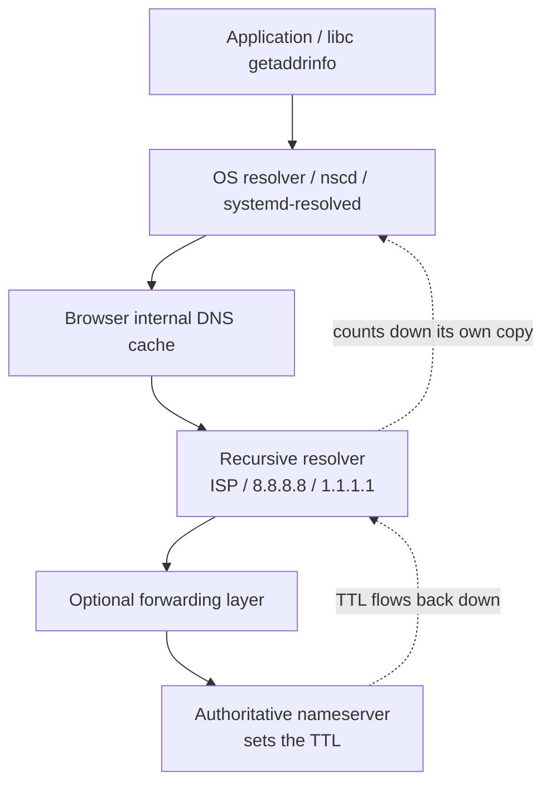
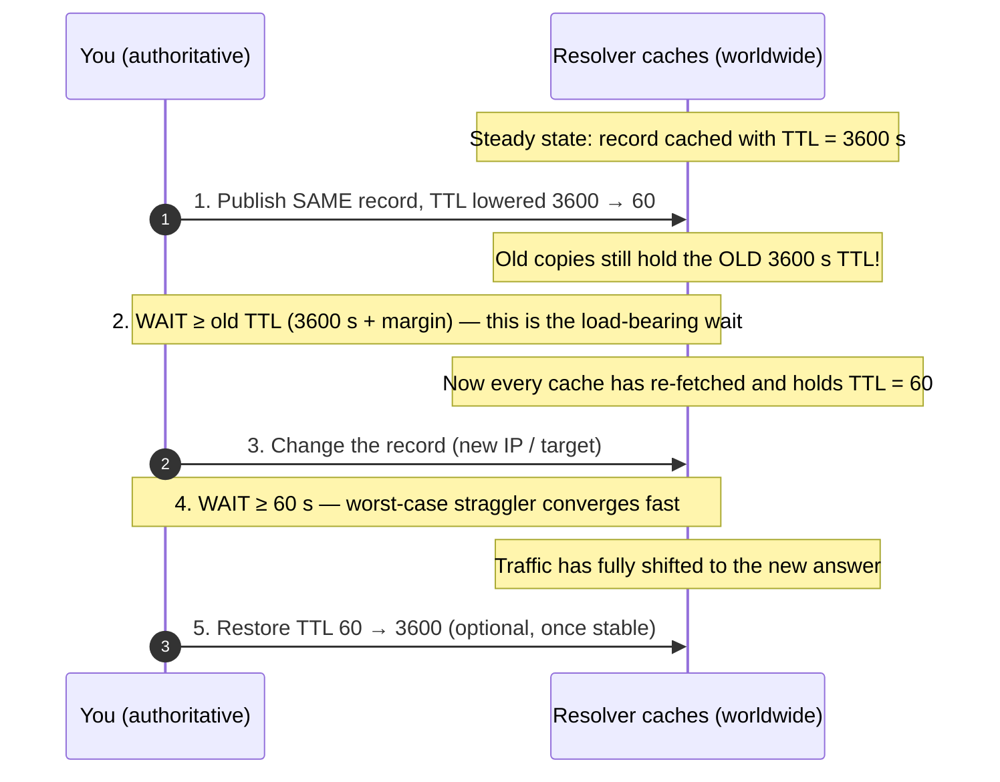
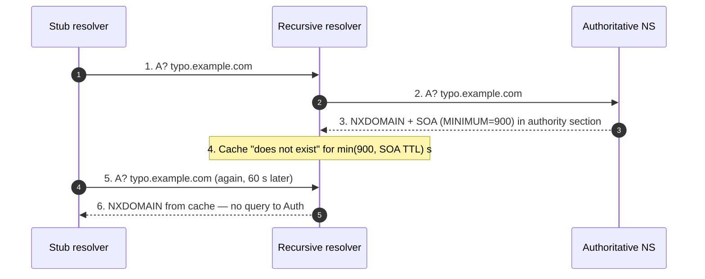

# DNS Caching & TTL — Middle

<!-- level-focus -->
At middle level, focus on this question:

> Where does **DNS Caching & TTL** belong in a maintainable component, and which trade-off selects the design?

Use the smallest realistic scenario that exposes the decision and its failure behavior.
## 2. The Caching Layers a Record Passes Through

A DNS answer is not cached in one place. It is cached at *every* layer that touches it, each with its own clock. When you change a record, you are racing all of these clocks at once.



| Layer | Who controls it | Honors your TTL? | Notes |
|-------|-----------------|------------------|-------|
| Authoritative server | You | Sets it | The origin of the TTL value |
| Recursive resolver | ISP / public DNS operator | Usually, but may **cap** it | The layer that matters most for propagation |
| OS stub / `nscd` / `systemd-resolved` | The host OS | Sometimes; may cache with its own policy | On many Linux boxes there is *no* OS cache unless a caching daemon runs |
| Browser | The browser vendor | Often ignores it (§8) | Fixed-duration internal cache, TTL-agnostic |
| Application connection pool | Your code | No — resolves once, then holds the IP | The most-forgotten "cache" of all |

**Key consequence:** the *effective* time for a change to take hold is not your TTL. It is the **maximum** of every layer's remaining countdown plus every layer that ignores TTL entirely. Your TTL sets a floor on how fast well-behaved resolvers converge; it does nothing for the layers that don't obey it.

---

## 3. TTL as a Contract, Not a Guarantee

The TTL field (RFC 1035 §3.2.1) is a 32-bit unsigned integer: the number of seconds a resource record may be cached before it must be re-fetched. Practically it is treated as at most a signed 31-bit value (up to ~2^31−1 seconds); many resolvers clamp large values.

Three properties of the contract that trip people up:

1. **TTL is a maximum, not a minimum.** A resolver may evict early (cache pressure, restart, operator flush). It may **not** legitimately keep the record longer — but some do, via TTL *capping* to a floor (e.g., a resolver that refuses to cache anything for less than 30 s) or a *ceiling* (a resolver that refuses to trust a 7-day TTL and clamps it to, say, 24 h). You do not control the resolver's policy.

2. **The countdown starts when the resolver caches the answer, not when you publish it.** A resolver that fetched your record 250 s ago, when the TTL was 300 s, will serve the stale copy for 50 more seconds — even if you changed the record 249 seconds ago.

3. **The TTL travels with the answer.** The value a client sees decrements as it sits in a cache. `dig` shows you the *remaining* TTL from whatever cache answered you, not the authoritative value — a crucial observability detail covered in §9.

Because a TTL is a promise you cannot revoke, the correct mental model is: **plan for the worst-behaved cache, and lower the TTL *before* you need agility, not when you already need it.**

---

## 4. Choosing a TTL: Agility vs Resilience

There is no universally correct TTL. It is a trade-off between how fast you can move a record and how much you pay in query volume and blast radius. Short TTLs buy agility and fast failover; long TTLs buy resilience and lower cost.

| Dimension | Short TTL (e.g., 30–300 s) | Long TTL (e.g., 1–24 h) |
|-----------|----------------------------|-------------------------|
| Change/failover speed | Fast — traffic shifts within minutes | Slow — stragglers for hours |
| Query volume to authoritative | High — resolvers re-ask constantly | Low — most reads served from cache |
| Load on your DNS infra & cost | Higher (esp. metered/hosted DNS) | Lower |
| Resilience if authoritative is unreachable | Poor — caches expire and can't refresh | Good — cached answers survive an outage |
| Blast radius of a bad record | Small — a mistake self-heals quickly | Large — a bad record lingers for the full TTL |
| Suitability | Failover targets, blue/green cutover, records you migrate often | Stable apex/`NS`/`MX`, records that rarely change |

**Practical defaults that experienced operators reach for:**

- **Stable infrastructure records** (`NS`, `MX`, an apex `A`/`AAAA` that never moves): hours to a day. They rarely change and you want them to survive a DNS-provider hiccup.
- **Records you actively operate** (a service endpoint behind failover, a canary target): 30–300 s. You are paying query volume in exchange for the ability to move quickly.
- **DNS-based failover / GSLB records**: as low as the TTL floor your resolvers will honor (often 30–60 s). The whole point is fast convergence; a 3600 s TTL makes DNS failover a fiction.

> **Anti-pattern:** setting *everything* to 60 s "to be safe." You inflate query cost and, worse, you make your service *depend* on your DNS provider being up every single minute — you have traded a rare, planned migration cost for a permanent resilience tax.

---

## 5. The Pre-Change Playbook: Lower TTL First

The single most important operational skill in this topic. You cannot make a *cached* record change fast retroactively, because caches already hold your *old, long* TTL. But you *can* prepare the ground: publish a short TTL well in advance, wait for the old long-TTL copies to age out everywhere, and only *then* make the real change. After the change stabilizes, restore the long TTL.

**The sequence — with the timing math that makes it work:**



**Why step 2's wait is measured against the *old* TTL, not the new one.** This is the subtlety that catches people. When you lower the TTL to 60 s, that new value only reaches a resolver when that resolver *next fetches* the record — which won't happen until *its* currently cached copy (carrying the old 3600 s TTL) expires. So the window during which some resolver might still be holding the long TTL is up to the **old** TTL. You must outwait that window before you can rely on the new short TTL. Add a margin (say, +20%) for clock skew, resolvers that fetched a moment before your publish, and secondary/slave propagation delay of your own zone.

**Worked timeline (old TTL = 3600 s, new TTL = 60 s):**

| Time | Action | Worst-case cache state |
|------|--------|------------------------|
| T+0 | Publish record with TTL 60 (value unchanged) | A resolver that cached at T−1 s holds old value + 3599 s of old TTL |
| T+0 … T+3600 | **Wait** (≥ old TTL) | Old-TTL copies drain; every re-fetch now gets TTL 60 |
| T+3600 | Make the real change (new IP) | All caches hold TTL 60, so they'll re-ask within 60 s |
| T+3600 … T+3660 | **Wait** (≥ new TTL) | Last stragglers expire and pick up the new IP |
| T+3660 | Restore TTL to 3600 | Convergence complete; back to low-query steady state |

**Consequences of skipping step 1:** if you change the record while it is still cached under a 3600 s TTL, some users hit the *old* endpoint for up to an hour. During a blue/green cutover or an IP migration, that means a fraction of traffic keeps landing on the decommissioned host — connection resets, or worse, silent routing to a box that no longer serves the app. The lower-TTL-first dance is precisely how you shrink that tail from an hour to a minute.

> **When you can't wait** (emergency: the current target is on fire): you *cannot* accelerate expiry of already-cached long-TTL records. Your only levers are at *your* side of the wire — fix the problem at the old IP (repoint the failing box, put a proxy in front) rather than pretending DNS can move faster than the TTL you already handed out.

---

## 6. Negative Caching and the SOA Minimum (RFC 2308)

Resolvers cache *failures* too, not just successful answers. When an authoritative server replies **NXDOMAIN** (the name does not exist) or **NODATA** (the name exists but has no record of the requested type), the resolver caches that negative result so it does not hammer the authoritative server for something that isn't there.

**How long is a negative answer cached?** Per **RFC 2308**, the negative-caching TTL is:

```
negative_TTL = min( SOA MINIMUM field , TTL of the SOA record in the authority section )
```

The `SOA` record's final field — historically labeled "minimum" — was **redefined by RFC 2308** to mean exactly this: the TTL for negative (NXDOMAIN / NODATA) responses. It no longer means a minimum for positive records. The authoritative server returns the zone's `SOA` record in the *authority section* of a negative reply, and the resolver caches the negative result for the smaller of the two values above.



| | Positive caching | Negative caching |
|---|------------------|------------------|
| What is cached | A successful record (an `A`, `MX`, etc.) | The *absence* of a record (NXDOMAIN / NODATA) |
| TTL source | The record's own TTL field (RFC 1035) | `min(SOA MINIMUM, SOA record TTL)` (RFC 2308) |
| Why it exists | Avoid re-fetching known-good data | Avoid re-querying for names/types known to be missing |
| Operational trap | Long TTL delays a *change* | Long negative TTL delays a *creation* |

**The operational trap that hits teams:** you add a brand-new subdomain, but users who *already tried it before it existed* keep getting NXDOMAIN — because their resolver cached the negative answer for the SOA-minimum duration. If your SOA minimum is 86400, that new record is invisible to those users for a **day**, even though your positive TTL is tiny. Set the SOA minimum sanely (commonly 300–3600 s) so freshly-created names appear promptly. Note the flip side: a *very* low negative TTL means resolvers re-ask the authoritative server for every mistyped or probing lookup, which can be a meaningful load and even a mild amplification vector.

---

## 7. What Actually Clears a Cache

The most important — and most humbling — fact at this level: **you cannot force other people's resolvers to flush your record.** There is no "purge the internet" button in DNS. A cached entry leaves a cache only when one of these happens:

1. **The TTL expires.** The normal, dominant case. This is why TTL discipline (§4–5) is the *only* reliable lever you have over the global cache population.
2. **The cache is restarted or full.** A resolver reboot, process restart, or LRU eviction under memory pressure drops entries early — but you can't count on it, and it's not yours to trigger.
3. **An operator flushes *that specific* cache.** Only the operator of a given resolver can flush it, and only their own cache. You can flush *yours*; you cannot flush `8.8.8.8` or an ISP's resolver.

**What you *can* flush — your own local layers:**

| Layer | Flush command (typical) |
|-------|-------------------------|
| macOS OS cache | `sudo dscacheutil -flushcache; sudo killall -HUP mDNSResponder` |
| Linux `systemd-resolved` | `sudo resolvectl flush-caches` |
| Linux `nscd` | `sudo nscd -i hosts` (or restart the daemon) |
| Windows OS cache | `ipconfig /flushdns` |

**What some public resolvers expose:** a few large public resolvers offer a web tool to purge a *single name* from *their* cache (a courtesy interface to their own operators' flush capability). It clears only that one resolver's copy — not the OS cache on your laptop, not your ISP's resolver, not a corporate forwarder. Treat it as debugging aid, never as a migration strategy.

> **Design implication:** because you can't flush the world, "we'll just clear the cache" is not a valid rollback plan. Your rollback plan is *always* "keep the old target serving until the TTL window drains," which is exactly why you keep TTLs short *around* a change (§5) and why the old endpoint must stay healthy for at least one full TTL after a cutover.

---

## 8. Browser DNS Cache Quirks

Browsers maintain their **own** in-process DNS cache, layered *above* the OS resolver — and it frequently does **not** obey the record's TTL. This is a common source of "I changed DNS an hour ago but *my* browser still hits the old IP while `dig` shows the new one."

Things to know at this level:

- **Fixed-duration, TTL-agnostic caching.** Historically browsers cached DNS results for a fixed internal duration (on the order of a minute) regardless of the actual record TTL. So a 5 s TTL doesn't guarantee the browser re-resolves in 5 s, and a 24 h TTL doesn't make the browser hold it for a day. The browser's own timer wins inside the browser.
- **Connection reuse hides DNS entirely.** Even after the browser's DNS entry would expire, an open **HTTP keep-alive** connection or an HTTP/2/3 connection to the old IP stays in use. No DNS lookup happens at all while that socket is alive, so the record change is invisible until the connection is torn down.
- **Happy Eyeballs / connection coalescing.** Browsers may race IPv4 and IPv6, and may coalesce requests for multiple hostnames onto one connection when certificates and IPs allow — further decoupling "what DNS says now" from "where this request actually goes."
- **DNS-over-HTTPS (DoH) inside the browser.** When a browser resolves via its own DoH provider, it bypasses the OS resolver *and* your OS-level flush commands entirely. Flushing the OS cache does nothing to a browser using DoH; you must clear the browser's own state.

**Debugging move:** to see what a browser actually resolved and cached, use the browser's internal DNS page (e.g., the `net-internals`/`about:networking` style diagnostics each engine ships) and its "clear host cache" control — that is the browser-level analog of `ipconfig /flushdns`. And always verify with `dig` *outside* the browser to separate "DNS has propagated" from "this browser is holding a stale entry or a live socket."

---

## 9. Observing TTL with dig

`dig` is the instrument for this whole topic. The critical skill is reading the **remaining** TTL and inferring *which cache* answered you.

**Baseline query:**

```text
$ dig example.com A

;; ANSWER SECTION:
example.com.    271    IN    A    93.184.216.34
                ^^^
                remaining TTL (seconds) as reported by THIS responder
```

That `271` is not the authoritative TTL. It is what the resolver you queried has left on its cached copy. Query again a few seconds later and you'll watch it count *down*:

```text
$ dig example.com A +noall +answer
example.com.    268    IN    A    93.184.216.34   # 3 s later
```

- **A decrementing TTL** ⇒ you're being served from a **cache**, and the value tells you how long until it re-fetches.
- **A TTL that jumps back up to a round number** (e.g., 300) ⇒ the cache just expired and re-fetched; you're seeing a fresh copy.

**Bypass the cache to read the authoritative (canonical) TTL** — ask the authoritative server directly:

```text
$ dig @ns1.example.com example.com A +noall +answer
example.com.    300    IN    A    93.184.216.34
                ^^^  the ACTUAL published TTL, straight from authoritative
```

Querying `@<authoritative NS>` sidesteps every recursive cache, so the TTL you see is the value you actually published — the number that governs the §5 playbook.

**Other high-value `dig` moves for this topic:**

```text
$ dig example.com SOA +noall +answer      # read the SOA MINIMUM (negative-cache TTL, §6)
example.com.  3600  IN  SOA  ns1.example.com. hostmaster.example.com. (
                              2026070101 7200 3600 1209600 900 )
                                                              ^^^ MINIMUM = 900 s

$ dig doesnotexist.example.com +noall +comments   # observe NXDOMAIN + the SOA in AUTHORITY
$ dig @8.8.8.8 example.com A +noall +answer        # compare a specific public resolver's cached TTL
$ dig +trace example.com A                         # walk root → TLD → authoritative, uncached
```

**How to use these together during a migration:** query `@<your NS>` to confirm the new record and its TTL are actually published; query a couple of public resolvers (`@8.8.8.8`, `@1.1.1.1`) and watch their remaining TTLs to gauge how much of the cache population has converged; and remember that neither of those tells you anything about a browser holding a live socket (§8) — that layer you verify by actually exercising the client.

---

## 10. Middle Checklist

- [ ] Every record has a TTL chosen deliberately from the agility-vs-resilience table (§4), not a copy-pasted default.
- [ ] Stable infra records (`NS`/`MX`/apex) use long TTLs; actively-operated/failover records use short TTLs.
- [ ] Before any planned record change, the **lower-TTL-first** playbook is scheduled: lower TTL → wait ≥ **old** TTL (+margin) → change → wait ≥ new TTL → restore.
- [ ] The wait in step 2 is sized against the *old* TTL, and a clock-skew/propagation margin is added.
- [ ] SOA MINIMUM is set to a sane negative-cache TTL (typically 300–3600 s) so newly-created names appear promptly (RFC 2308).
- [ ] Rollback plan does **not** rely on flushing other people's caches; the old target stays healthy for ≥ one full TTL after cutover.
- [ ] Verification uses `dig @<authoritative>` for the published TTL and `dig @<public resolver>` for cache convergence — and a real client to catch browser/socket staleness.
- [ ] Team knows browser DNS caches and keep-alive sockets can defeat DNS changes independent of TTL.

---

**References (canonical only):** RFC 1035 (Domain Names — Implementation and Specification; TTL field, §3.2.1), RFC 2308 (Negative Caching of DNS Queries; SOA MINIMUM as negative-cache TTL).

*Next step:* [DNS Caching & TTL — Senior](senior.md)

---

## Apply it

1. Find a real component where **DNS Caching & TTL** affects an interface or dependency.
2. Write two plausible choices and the constraint that favors each one.
3. Make the smallest reversible change at that boundary.
4. Exercise the component alone, then exercise the integrated flow.
5. Keep the decision note with the evidence that selected the option.

## Verify your work

- A focused check proves the local behavior.
- An integrated check proves callers and dependencies still agree.
- Logs, traces, compiler output, or benchmarks expose the boundary.
- Reverting the change restores the previous behavior without unrelated edits.

## Review questions

- Which boundary is most affected by DNS Caching & TTL?
- What constraint would make you choose the alternative design?
- How would you isolate a local defect from an integration defect?
- What evidence shows that the change remains maintainable?
