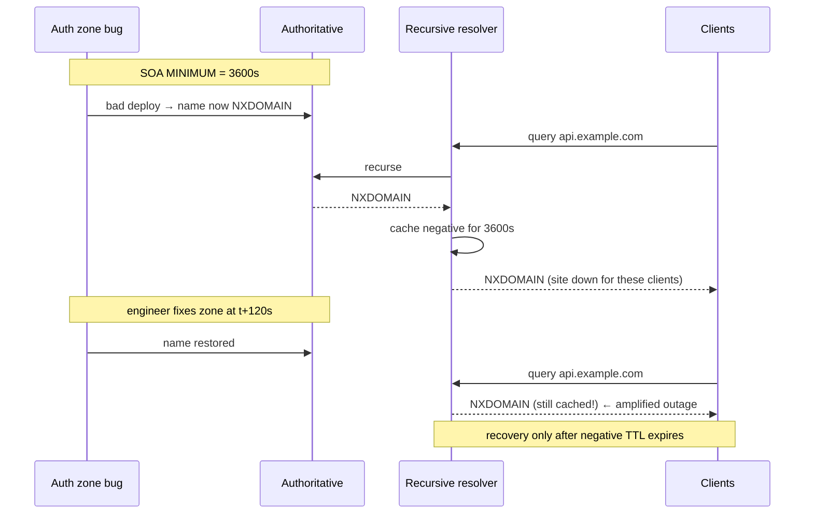
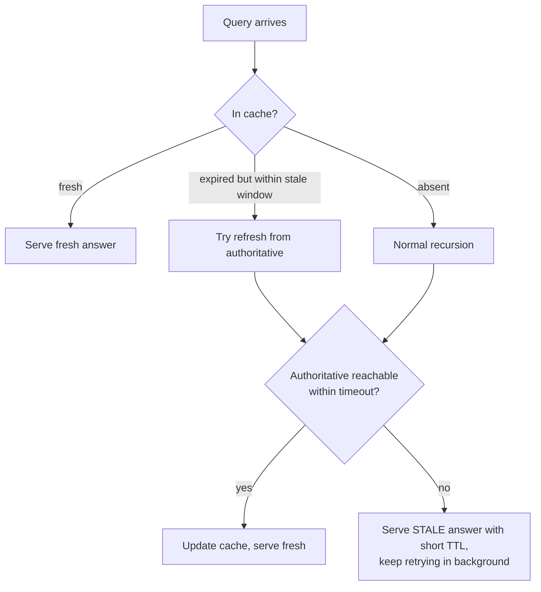

# DNS Caching & TTL — Senior

<!-- level-focus -->
At senior level, focus on this question:

> Which system invariant is affected by **DNS Caching & TTL** under failure, load, and change?

Use the smallest realistic scenario that exposes the decision and its failure behavior.
## 1. TTL as a First-Class Control

Every DNS record carries a TTL: the number of seconds a resolver may cache the answer before it must re-query authoritative. The value is a direct trade between three properties that pull in opposite directions:

- **Agility** — how fast a change (a new IP for failover, a maintenance cutover, a mitigation) actually reaches clients. Low TTL wins.
- **Availability** — how much a cached answer insulates you from an authoritative-server or network problem. High TTL wins.
- **Load and cost** — how many queries hit your authoritative servers and how much you pay per query. High TTL wins.

The mistake juniors make is picking one number globally. Senior practice is to assign TTL *per record by role*, because the failure and change profile differs:

| Record role | Typical TTL | Rationale |
|---|---|---|
| Apex/failover A/AAAA behind DNS failover | 30–60 s | Change must propagate fast; the cost is more queries |
| Stable service endpoint (CDN-fronted) | 300–3600 s | Rarely moves; CDN absorbs traffic; save query load |
| NS / delegation records | 24–48 h | Almost never change; churn here is catastrophic |
| MX | 1–4 h | Mail retries tolerate slow propagation |
| TXT (SPF/DKIM/verification) | 300–3600 s | Occasional rotation; no failover pressure |
| TTL *during* a planned migration | 60 s, pre-lowered 48 h+ ahead | Buy agility for the cutover window, restore after |

The migration row encodes the single most important operational discipline: **lower the TTL well before you need it.** Because the *old* TTL governs how long stale answers persist, dropping TTL to 60 s one hour before a cutover does nothing for the answers already cached under the old 3600 s value. Lower the TTL at least one old-TTL-period ahead (and in practice 24–48 h ahead to cover resolver clamping), let the low value propagate, cut over, then raise it back once stable.

TTL also has a subtler second dimension. It is set at the *authoritative* zone, but the *effective* cache lifetime is decided by whoever holds the answer — recursive resolvers, forwarders, stub resolvers, connection-pooling libraries, and the OS cache. You publish a TTL; the ecosystem *interprets* it. Sections 2 and 3 make that gap concrete.

---

## 2. Quantifying Effective Failover Time

When you rely on DNS to move traffic away from a failed endpoint, the time until clients actually stop hitting the dead IP is **not** your TTL. It is a sum of independent delays, each contributed by a different layer:

```
effective_failover_time ≈
      health_check_detection            (monitor interval × failed samples)
    + authoritative_publish_latency     (record update + zone propagation)
    + resolver_cache_residual           (≤ published TTL, but see clamping)
    + client_cache_residual             (OS + application + library caches)
    + connection_drain                  (existing long-lived connections)
```

Only the third term is the one you nominally control with TTL, and even it is bounded *above* by TTL, not equal to it: a resolver that cached the answer 1 s before the change waits the full TTL, one that cached it TTL−1 s ago re-queries almost immediately. Averaged over a large client population under uniform arrival, the mean residual is ~TTL/2, but the *tail* is the full TTL — and your SLO lives in the tail.

Worked example. Suppose:

- Health check: 10 s interval, 3 consecutive failures required → up to 30 s detection.
- Authoritative update + provider propagation → ~10 s.
- Published TTL 60 s → worst-case resolver residual 60 s.
- Client OS/app caches → commonly 30–60 s of extra residency (browsers pin, JVMs historically cached forever, connection pools reuse sockets).
- Long-lived connections (keep-alive, gRPC channels, DB pools) → do **not** re-resolve until torn down; can persist minutes.

The naive read is "60 s TTL means 60 s failover." The honest worst case is `30 + 10 + 60 + 60 + drain ≈ 160 s +` before *most* clients recover, with a long tail from pooled connections that ignore DNS entirely until reconnect. This is why DNS failover alone is unsuitable for tight RTOs, and why serious designs pair it with connection-level health (load balancer draining, client-side retries with fresh resolution, or an anycast VIP that fails over below DNS).

The senior takeaway: **TTL sets a floor on how bad failover can be, never a ceiling on how good it can be.** To improve failover you must also attack detection time, kill sticky connections, and defeat downstream cache overrides.

---

## 3. Resolvers That Clamp and Override TTL

Your published TTL is a *request*, not a guarantee. Recursive resolvers routinely clamp it to their own policy:

- **Minimum caching (TTL floor)** — many resolvers refuse to honor very low TTLs to protect their cache hit rate and upstream load. A resolver enforcing a 30 s (or 300 s) floor turns your 5 s TTL into 30 s (or 300 s). Some public resolvers and enterprise forwarders have historically clamped small TTLs upward.
- **Maximum caching (TTL cap)** — RFC 2308 recommends resolvers cap absurdly large TTLs (e.g., the classic guidance to treat values above ~7 days / 604800 s conservatively) to avoid records that never expire. A malicious or fat-fingered TTL of `2^31−1` should not pin an answer for 68 years.
- **Cache eviction under pressure** — an answer with a 24 h TTL may be evicted early if the resolver's cache is full (LRU pressure), causing an earlier-than-TTL re-query. High TTL does not guarantee long residency; it only permits it.

Practical consequences:

- Do not assume a 5 s TTL buys you 5 s failover. Assume the *effective* floor of the resolvers your users actually traverse — often 30–60 s. Choose the smallest TTL that is not clamped into meaninglessness; going below a common floor buys nothing but query load.
- Test against the resolver population that matters (major public resolvers, mobile carrier resolvers, large-ISP forwarders), not against your own recursive server, which honors you faithfully and lies to you about the real world.
- The clamping also cuts the other way during incidents: if a *bad* answer got cached under a floored TTL, your correction propagates no faster than that floor allows.

| Behavior | Cause | Effect on you | Mitigation |
|---|---|---|---|
| TTL floor (min-cache) | Resolver policy, hit-rate protection | Low TTLs ignored; slow failover | Set TTL at/above common floor; don't over-rely on DNS failover |
| TTL cap (max-cache) | RFC 2308 sanity limits | Very high TTLs shortened | Fine; you rarely want records that never expire anyway |
| Early eviction | Cache LRU pressure | High TTL not fully realized | Don't depend on caching for correctness or load relief |
| Stub/OS/app caching | Client-side, TTL-unaware | Extra residual beyond resolver | Kill sticky connections; configure library DNS TTL |

---

## 4. Negative Caching and Outage Amplification

Negative caching (RFC 2308) stores the *absence* of a record — an NXDOMAIN (name does not exist) or NODATA (name exists, type does not) — so resolvers stop hammering authoritative for names that legitimately do not resolve. The TTL for a negative answer is **not** the record's TTL (there is no record); it is derived from the **SOA MINIMUM** field (bounded by the SOA record's own TTL, per RFC 2308).

This is a sharp edge. If a deploy, an automation bug, or a zone-transfer glitch briefly makes a *valid* name return NXDOMAIN, every resolver that queried during that window caches the negative answer for the SOA minimum — potentially hours. You fix the zone in seconds; the outage persists for as long as the negative TTL, for exactly the users unlucky enough to have queried during the bad window.



The amplification factor is `negative_TTL / incident_duration`. A 2-minute mistake with a 1-hour SOA minimum is a 30× amplification for affected clients. Senior mitigations:

- **Keep SOA MINIMUM small** (e.g., 300–900 s) so negative-cache blast radius is bounded. The old habit of large SOA minimums predates negative caching's modern meaning; it now directly sets your worst-case NXDOMAIN outage length.
- **Never let a valid name go NXDOMAIN transiently.** Prefer atomic zone publishes, validate zones before load, and ensure partial/failed transfers do not surface as "name absent." A NODATA or SERVFAIL is far less sticky in some paths than a fully cached NXDOMAIN.
- **Understand that you cannot flush other people's resolvers.** Once a negative answer is cached across the internet, no amount of authoritative fixing evicts it early. Prevention beats reaction because reaction is largely impossible.

---

## 5. Serve-Stale (RFC 8767) for Resilience

RFC 8767 ("Serving Stale Data to Improve DNS Resiliency") lets a resolver return a *previously cached, now-expired* answer when it cannot reach authoritative to refresh it. The trade is explicit: a slightly stale answer beats no answer when the authoritative servers are unreachable (DDoS, network partition, provider outage).

Mechanics as specified:

- The resolver keeps expired entries for a bounded window (RFC 8767 suggests a default stale-answer max of ~1–3 days, e.g., 86400 s, with a short client-response timeout ~1.8 s before falling back to stale).
- On a query for an expired name, the resolver first attempts a normal refresh. If authoritative answers, it updates and serves fresh. If authoritative is unreachable within the timeout, it serves the stale answer (typically with a short TTL like 30 s) and keeps trying in the background.



Why this matters at the design level:

- Serve-stale converts an authoritative outage from a *hard* failure (SERVFAIL, site unreachable) into a *soft* degradation (clients keep resolving to the last-known-good IP). If that IP is still healthy, users never notice the DNS outage at all.
- It interacts with TTL policy: with serve-stale in the ecosystem, an aggressively low TTL is less dangerous during authoritative outages, because resolvers can fall back to the expired value instead of failing. But you cannot *rely* on serve-stale — it is resolver-side and not universally deployed.
- The risk is the mirror of caching's risk: if you *changed* the record (failover to a new IP) and authoritative then becomes unreachable, serve-stale may pin clients to the *old* IP. Serve-stale improves availability against authoritative outages but can *delay* a legitimate failover. Know which failure you are optimizing for.

---

## 6. TTL vs Query Cost and Load at Scale

Authoritative query load is inversely related to TTL. A crude but useful model: for a name queried by a large client population, authoritative QPS scales roughly as `unique_resolvers / TTL` (each caching resolver re-queries about once per TTL, independent of how many clients sit behind it). Halving the TTL roughly doubles authoritative QPS; a 5 s TTL versus a 300 s TTL is a ~60× difference in query load.

This has real cost and risk consequences:

- **Managed DNS is billed per query.** Dropping a high-traffic apex from 300 s to 20 s TTL can multiply your DNS bill by an order of magnitude for negligible failover benefit if resolvers clamp anyway.
- **Low TTL enlarges your DDoS-amplification and load surface.** More authoritative queries means more attack surface and less headroom; caching is a load shield, and shrinking TTL thins it.
- **The caching layer is doing you a favor.** A 3600 s TTL means a resolver serving 10M clients hits you once an hour for that name. That is the entire economic model of DNS. Low TTL opts out of it.

| Consideration | Low TTL (e.g., 30 s) | High TTL (e.g., 3600 s) |
|---|---|---|
| Failover / change agility | Fast (bounded by floor) | Slow — hours to fully propagate |
| Authoritative query load | High (~1 query / resolver / 30 s) | Low (~1 query / resolver / hour) |
| Managed-DNS cost | High | Low |
| Resilience to auth outage | Weaker (cache expires fast) | Stronger (cache covers you) |
| Blast radius of a bad record | Small (expires fast) | Large (stuck for the TTL) |
| DDoS load-shield | Thin | Thick |

The senior heuristic: **default to the highest TTL your change/failover requirements tolerate, then temporarily lower it around known change windows.** Reserve permanently low TTLs for records that are genuinely part of a failover mechanism, and even then respect the resolver floor rather than chasing single-digit seconds.

---

## 7. Thundering Herd at TTL Expiry

When many resolvers cached the same popular record at nearly the same time — a common outcome after a global TTL lowering, a cold-cache event, or a mass campaign launch — their caches expire *together*, producing a synchronized burst of authoritative queries at each TTL boundary. Lower TTL makes the herd more frequent; correlated caching makes each herd sharper.

The failure shape is a periodic spike in authoritative QPS every TTL seconds, which can overwhelm authoritative servers exactly when the record is hottest. Mitigations, in rough order of leverage:

- **Prefetch (asynchronous re-fetch)** — resolvers that support prefetch refresh a popular entry *before* it expires (e.g., when a query arrives with < ~10% of TTL remaining and the entry is popular), so clients are always served from cache and the refresh is decoupled from expiry. This is resolver-side but widely available; a modestly higher TTL gives the prefetch window room to work.
- **Jitter / TTL randomization** — desynchronize expiries by spreading effective cache lifetimes across a small random band rather than an exact value. This is primarily a caching-layer technique; at the authoritative layer you cannot per-response randomize a published TTL cleanly, but you *can* avoid publishing changes that force all resolvers to re-cache at the same instant.
- **Request coalescing at authoritative** — ensure a single hot query does not fan out into duplicate backend work behind the authoritative server (relevant if answers are computed, e.g., geo/latency-based routing).
- **Raise TTL for genuinely hot, stable records** — the cheapest herd mitigation is fewer expiries. If a record does not need low TTL for failover, a higher TTL both reduces herd frequency and gives prefetch room.

The interaction to internalize: prefetch and serve-stale together make higher TTLs *safer* (prefetch keeps them fresh, serve-stale covers outages), which means the modern best practice trends toward *higher* baseline TTLs with disciplined, time-boxed lowering — not permanently low TTLs "just in case."

---

## 8. Real Failure Modes and Playbook

Concrete ways DNS caching and TTL cause production incidents, with the senior response:

- **The "we lowered TTL too late" cutover.** Team lowers TTL to 60 s one hour before a migration, but the old 3600 s answers were cached under the *old* TTL and persist for an hour after the cutover. Result: a long tail of clients hitting the decommissioned endpoint. *Fix:* lower TTL ≥ one old-TTL-period (in practice 24–48 h) before the change; verify propagation before cutting over.

- **The sticky-NXDOMAIN outage.** A zone automation bug briefly serves NXDOMAIN for a live name; resolvers cache the negative for the SOA minimum. The fix ships in minutes; affected users stay broken for the full negative TTL. *Fix:* small SOA MINIMUM (300–900 s), atomic/validated zone publishes, and the acceptance that you cannot flush external caches.

- **The failover that didn't fail over.** DNS points to the new IP, but keep-alive connections, connection pools, and TTL-ignoring clients keep using the old socket. DNS "recovered" in dashboards while users stayed on the dead path. *Fix:* pair DNS failover with connection-level draining, client retries that force fresh resolution, and prefer sub-DNS failover (anycast/VIP) for tight RTOs.

- **The clamped-TTL surprise.** You publish 5 s TTL expecting fast failover; a major public or carrier resolver enforces a 30–300 s floor, and your incident drags on. *Fix:* measure real resolver behavior; set TTL at the effective floor; don't design failover that assumes single-digit-second TTLs.

- **The TTL-lowering-induced herd.** Dropping a hot record from 3600 s to 20 s globally multiplies authoritative QPS ~180× and synchronizes expiries; authoritative servers brown out. *Fix:* lower TTL in stages, lean on prefetch/serve-stale, raise it back promptly after the change window.

- **The serve-stale-pins-old-IP trap.** You fail over to a new IP, authoritative then gets DDoSed, and resolvers serve the *stale* old IP under RFC 8767 — extending an outage you thought you'd resolved. *Fix:* know that serve-stale optimizes against authoritative outages, not against needing a fresh answer; keep the old endpoint drainable, not instantly dead.

The unifying principle across all six: **the value you publish is an upper bound on your intentions and a lower bound on your regret.** TTL controls how fast good changes and bad changes both propagate; every caching layer between you and the client can only make a bad answer *stickier*, never fresher. Design TTL per record by role, lower it deliberately and early around changes, keep negative TTLs short, and never let DNS caching be the only thing standing between a failure and your users.

---

*Next step:* [DNS Caching & TTL — Professional](professional.md)

---

## Apply it

1. State the system invariant that **DNS Caching & TTL** must protect.
2. Mark ownership, state, and failure propagation at each boundary.
3. Compare two designs under load, dependency failure, and future change.
4. Define recovery and compatibility behavior before implementation.
5. Test the riskiest assumption with a focused experiment.

## Verify your work

- The experiment supports the design with evidence, not preference.
- Failure injection shows the blast radius and recovery path.
- Compatibility checks cover old and new callers or data.
- Operational signals reveal invariant violations and recovery progress.

## Review questions

- Which invariant must remain true when DNS Caching & TTL fails?
- Where should recovery responsibility live, and why?
- Which assumption deserves an experiment before implementation?
- How can the design evolve without changing every consumer at once?
