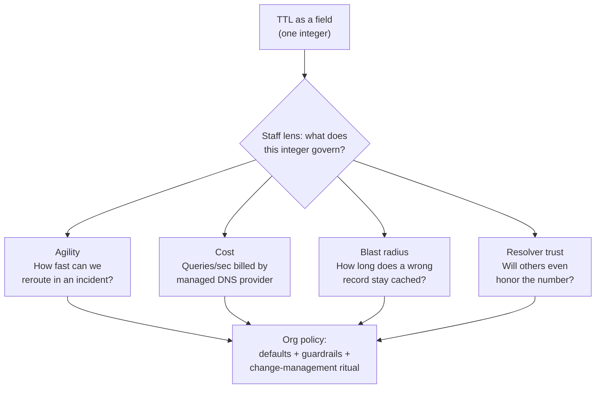

# DNS Caching & TTL — Staff

> **Axis:** organizational scope & judgment — not deeper protocol theory. This file answers:
> how does a Staff/Principal engineer wield **TTL as an organizational policy** across many
> teams, over years, under real cost, migration-risk, and blast-radius constraints? TTL is one
> integer, but it is a governance surface: it trades operational agility against query cost,
> resolver-honoring risk, and the blast radius of a bad record cached far and wide.

---

## Table of Contents

1. [The Staff Framing: TTL Is a Policy, Not a Field](#1-the-staff-framing-ttl-is-a-policy-not-a-field)
2. [Default-TTL Standards Per Record Class](#2-default-ttl-standards-per-record-class)
3. [The Agility vs Blast-Radius Tension](#3-the-agility-vs-blast-radius-tension)
4. [TTL Pre-Lowering as Change-Management Discipline](#4-ttl-pre-lowering-as-change-management-discipline)
5. [The Hard Lesson: You Cannot Rely on Others Honoring Your TTL](#5-the-hard-lesson-you-cannot-rely-on-others-honoring-your-ttl)
6. [Query-Cost Economics: TTL Is Billed](#6-query-cost-economics-ttl-is-billed)
7. [Governance: Who May Set Very Low TTLs](#7-governance-who-may-set-very-low-ttls)
8. [When to Standardize vs Let Teams Choose](#8-when-to-standardize-vs-let-teams-choose)
9. [Second-Order Consequences & The Metrics You Watch](#9-second-order-consequences--the-metrics-you-watch)
10. [Staff Checklist](#10-staff-checklist)

---

## 1. The Staff Framing: TTL Is a Policy, Not a Field

At junior and middle levels, TTL is "the number of seconds a resolver may cache this record."
At Staff level, TTL is an **organizational contract** with three counterparties who never
signed it: the recursive resolvers of the public internet, the finance team paying the managed-DNS
bill, and every downstream team whose service depends on your name resolving quickly *and*
correctly during an incident.

The Staff engineer's job is not to pick a good TTL for one record. It is to build the
**policy, guardrails, and change-management rituals** so that hundreds of records set by dozens
of teams collectively land in a defensible place — agile enough to reroute traffic in an
emergency, expensive enough to be affordable, and not so brittle that one fat-fingered record
takes down half the estate for a day.



The three levers are in direct tension. A low TTL buys agility and shrinks blast radius but
raises query cost and, counterintuitively, *increases* your exposure to resolvers that ignore
short TTLs (see §5). A high TTL is cheap and resilient to authoritative-server outages but turns
every mistake into a multi-hour incident. There is no globally correct TTL — only a TTL that is
correct *for a given record's role, risk, and change cadence*. Encoding that judgment as policy,
not tribal knowledge, is the deliverable.

---

## 2. Default-TTL Standards Per Record Class

The single highest-leverage artifact a Staff engineer ships here is a **default-TTL standard
keyed to record role**, published in the DNS runbook / ADR and enforced (where possible) in the
infrastructure-as-code that provisions records. Different record classes have different change
cadences and different failure consequences, so a flat "everything is 3600" default is a
category error.

| Record role | Recommended default TTL | Rationale |
|-------------|------------------------|-----------|
| Apex / root `A`/`AAAA` for a stable service | 3600s (1h) | Rarely changes; short TTL just burns queries and offers no resilience benefit |
| Load-balancer / CDN alias front-ends | 300–3600s (provider-managed) | Provider health-checks reroute *inside* the record's answer; your TTL need not be tiny |
| Failover-critical `A`/`AAAA` (active/standby DR) | 30–60s | Must reroute fast during failover; accept the query cost as insurance |
| `CNAME` to a third-party (SaaS, CDN) | 300–3600s | Match or exceed the target's own TTL; a shorter TTL than the target buys nothing |
| `MX` (mail) | 3600–86400s (1h–1d) | Mail is retry-tolerant; long TTL is safe and cheap; rarely changes |
| `TXT` (SPF/DKIM/DMARC, verification) | 3600s | Changes are planned, not emergency; but keep low enough to fix a broken SPF within an hour |
| `NS` / delegation records | 86400–172800s (1–2d) | Delegation is structural; long TTL is standard and protects against registrar flakiness |
| `SOA` minimum / negative-cache TTL | 300–900s | Governs how long **NXDOMAIN** is cached — short, or a typo'd deletion lingers |

Two subtleties Staff engineers must call out explicitly because they are routinely missed:

- **Negative caching is a separate TTL.** The `SOA` record's minimum field (RFC 2308) controls
  how long resolvers cache a *non-existent* answer. A team that publishes a brand-new subdomain
  and immediately points customers at it can be bitten by an hour of cached NXDOMAIN from an
  earlier probe. The policy must state negative-cache TTL, not just positive-record TTL.
- **A `CNAME` shorter than its target is pointless.** If your `CNAME` has TTL 60s but points at a
  provider `A` record with TTL 3600s, the resolver still holds the resolved address for up to an
  hour. Effective agility is bounded by the *longest* TTL in the resolution chain, not yours.

---

## 3. The Agility vs Blast-Radius Tension

The core Staff tradeoff is a two-sided coin, and the same TTL value sits on both sides.

| Dimension | Low TTL (e.g., 30–60s) | High TTL (e.g., 3600–86400s) |
|-----------|------------------------|------------------------------|
| **Agility** | Reroute traffic in ~1 min; fast failover, fast rollback | Change takes up to TTL to propagate; slow failover |
| **Blast radius of a wrong record** | Small — a bad answer self-heals within a minute | Large — a wrong record is cached network-wide for hours |
| **Query volume / cost** | High — resolvers re-ask constantly | Low — one query serves many end-users for the TTL window |
| **Resilience to authoritative outage** | Poor — if your DNS is down, caches expire fast and resolution fails | Strong — caches keep serving the last good answer through the outage |
| **Sensitivity to resolver misbehavior** | High — some resolvers clamp/ignore short TTLs (see §5) | Low — the number is large enough that no one shortens it |

The naive read is "low TTL = agile = good." The Staff read is that **low TTL trades one risk for
another**: it minimizes the *duration* of a bad record but maximizes the *frequency* of your
dependence on your own authoritative DNS being healthy. During an authoritative-DNS outage (a
class of incident that has taken down major providers), records with a 60s TTL vanish from caches
in a minute and the whole service goes dark; records with a 24h TTL keep resolving to the last
good answer and buy you a day to recover. Agility and outage-resilience pull in opposite
directions, and the "right" answer depends on which failure you consider more likely and more
costly for *that specific record*.

The general policy that falls out of this: **default to moderate TTLs (300s–3600s) and reserve
very low TTLs for records that genuinely need emergency reroutability** — DR failover targets,
records mid-migration, and canary/traffic-steering endpoints. Everything else pays query cost for
agility it will never use.

---

## 4. TTL Pre-Lowering as Change-Management Discipline

The single most valuable operational ritual around TTL is **pre-lowering**: before a planned
change that will alter a record (a migration, a datacenter cutover, a provider switch), you
*lower the TTL well in advance*, wait for the old high TTL to fully expire from caches, then make
the change while the low TTL is in effect, verify, and finally restore the high TTL. This turns
a change with a multi-hour rollback window into one with a one-minute rollback window — but only
if it is planned days ahead, because you must wait out the *old* TTL first.

```mermaid
sequenceDiagram
    autonumber
    participant CM as Change-Mgmt Plan
    participant DNS as Authoritative DNS
    participant Caches as Recursive Resolvers
    participant Team as On-call Team

    Note over CM,Team: T-7 days — decide cutover date; TTL currently 3600s
    CM->>DNS: 1. Lower TTL 3600s → 60s (record value UNCHANGED)
    Note over DNS,Caches: 2. Wait ≥ old TTL (1h+) so every cache re-fetches the 60s TTL
    Caches-->>DNS: 3. Caches now hold record with 60s TTL
    Note over CM,Team: T-0 — cutover window opens
    CM->>DNS: 4. Change record value (point to new IP/target)
    Note over Caches: 5. Old value expires in ≤ 60s, not ≤ 1h
    Team->>Caches: 6. Verify new answer propagated (dig from multiple resolvers)
    alt Cutover healthy
        Note over Team: 7a. Soak; monitor error rate + query cost
        CM->>DNS: 8a. T+24h — restore TTL 60s → 3600s (cut query bill back)
    else Rollback needed
        CM->>DNS: 7b. Revert record value; bad answer clears in ≤ 60s
        Note over Team: Blast radius contained to ~1 minute
    end
```

The discipline points a Staff engineer enforces:

- **Pre-lowering must precede the change by at least the old TTL**, ideally with margin. Lowering
  the TTL and cutting over in the same maintenance window is the classic mistake: the caches still
  hold the *old* TTL, so the low TTL doesn't take effect until it's too late to help.
- **Restore the high TTL after the soak.** Leaving records at 60s "just in case" is how query
  bills quietly triple (see §6). The low TTL is a temporary state tied to a change, not a new
  default. A common failure is a migration that "finishes" but leaves a hundred records stranded
  at emergency TTLs for months.
- **Bake it into the migration runbook and the ADR**, not into one engineer's head. Pre-lowering
  should be a checklist item on every change-management template that touches a production record,
  the same way a database migration has a rollback script.

---

## 5. The Hard Lesson: You Cannot Rely on Others Honoring Your TTL

This is the incident lesson that separates a Staff-level DNS policy from a naive one: **the TTL
you publish is a request, not a command.** You control your authoritative servers; you do not
control the thousands of recursive resolvers, corporate middleboxes, ISP caches, browser DNS
caches, OS stub resolvers, and connection-pool holders between you and your users. Many of them
ignore, clamp, or extend your TTL for reasons you cannot influence.

Concrete ways your TTL is disrespected in the wild:

- **Resolver TTL clamping.** Some public and ISP resolvers enforce a *minimum* TTL (to reduce
  their own upstream query load) — treating your 30s as 300s or more. Others cap a *maximum* TTL.
  Your intended agility silently evaporates.
- **Application- and library-level caching.** The JVM historically cached DNS lookups for the
  process lifetime (`networkaddress.cache.ttl`) unless reconfigured. Connection pools, HTTP
  clients, and sidecars hold resolved IPs far longer than any DNS TTL. A 60s record does nothing
  if the client resolved once at boot and never looks again.
- **Stale-while-revalidate / serve-stale (RFC 8767).** Resolvers may deliberately serve an
  expired answer during an authoritative outage — good for availability, but it means "expired"
  does not mean "gone."
- **Negative-cache and NXDOMAIN stickiness.** As in §2, a mistaken deletion can linger past your
  positive-record TTL because the negative-cache TTL is a different, often-forgotten knob.

The organizational conclusion: **never design a plan whose correctness depends on everyone
honoring a short TTL.** In an incident, do not assume a 60s TTL means the bad answer is gone in
60s; assume a long tail of clients holds the old value for minutes to hours. Concretely, this
means: keep the *old* endpoint alive and serving (or gracefully redirecting) well past the TTL
during a cutover; monitor traffic to the old target and only decommission when it actually drains,
not when the TTL says it should have; and prefer application-layer traffic steering (load
balancers, service mesh, weighted routing) over DNS for anything that needs *reliable* fast
reroute, because DNS-based reroute is best-effort by nature.

---

## 6. Query-Cost Economics: TTL Is Billed

Managed DNS providers bill primarily by **query volume** (queries answered by your authoritative
zone), often with additional premiums for health-checked / traffic-policy records. TTL is the
single biggest lever on that bill, because it directly divides how many end-user lookups reach
your authoritative servers versus being absorbed by resolver caches.

The mental model: a resolver re-queries your authoritative servers roughly **once per TTL per
resolver population**, not once per end-user. Halving the TTL roughly doubles the authoritative
query rate for that record; cutting it by 10× roughly 10×'s the queries.

```text
Order-of-magnitude estimate (illustrative, not a specific provider's price):

  Assume a busy record fronted by N distinct resolver caches worldwide,
  each of which re-fetches once per TTL:

    authoritative queries/day ≈ N × (86,400 / TTL_seconds)

  For a globally popular record, N (effective distinct resolvers) can be large.
  Take a record where a 3600s TTL yields ~X queries/day.

    TTL 3600s  →   1× baseline query volume
    TTL  300s  →  ~12× baseline
    TTL   60s  →  ~60× baseline
    TTL   30s  → ~120× baseline

  If managed DNS bills per million queries, dropping a hot record from 3600s to
  30s can inflate that record's query cost by ~100×. Across an estate of records
  left at emergency TTLs after a migration, this is how a DNS bill silently grows
  from a rounding error into a line item finance asks about.
```

The Staff judgment: **treat very low TTLs as a metered resource, not a free default.** The cost is
usually invisible to the engineer who sets the TTL (they don't see the bill) and very visible to
the platform team who owns the provider contract. That gap is exactly why TTL needs governance
(§7) — the person with the incentive to set TTL low (an app team wanting fast reroute) is not the
person who pays for it. A good policy makes the cost legible: attribute DNS query cost back to the
owning team, and flag records below a threshold TTL in cost reviews.

---

## 7. Governance: Who May Set Very Low TTLs

Because a very low TTL externalizes cost onto the platform's DNS bill and, in aggregate, onto the
resilience of the whole estate, **the authority to set very low TTLs should be governed, not
open to every team by default.** This is a classic Staff sociotechnical decision: align the
incentive (who wants low TTL) with the accountability (who pays and who is on call).

A workable governance model, expressed as tiers:

| TTL band | Who may set it | Guardrail |
|----------|----------------|-----------|
| ≥ 3600s (default and above) | Any team, self-service via IaC | None; this is the cheap, safe default |
| 300–3600s | Any team, self-service | Lint warns if applied to a rarely-changing record |
| 60–300s | Team, with a documented reason | IaC requires a `ttl_reason` field (failover, migration, canary) |
| < 60s | Platform/DNS owner approval | Time-boxed; auto-reverts or alerts if left low past a window |
| Negative-cache / SOA minimum | Platform/DNS owner only | Central; teams don't touch delegation-level knobs |

Enforcement lives in the paved road, not in review meetings: the Terraform/CloudFormation module
that provisions records rejects (or warns on) sub-threshold TTLs without an accompanying reason
and expiry, a nightly job reports records sitting below the threshold longer than their stated
window, and the cost dashboard attributes query spend per record-owner. The point is not to
forbid low TTLs — DR failover records legitimately need them — but to make the low TTL a
*deliberate, attributed, time-boxed* choice rather than an ambient default that accretes cost and
fragility.

---

## 8. When to Standardize vs Let Teams Choose

The recurring Staff question is where to draw the line between a mandated standard and team
autonomy. The heuristic: **standardize where the failure is shared and invisible to the setter;
delegate where the tradeoff is local and the setter feels the consequences.**

- **Standardize (mandate a default, enforce guardrails):**
  - Negative-cache / SOA-minimum and `NS`/delegation TTLs — structural, estate-wide, and a mistake
    here hurts everyone. Teams have no business tuning these.
  - The *floor* on TTL (the sub-60s approval gate) — because the cost and resilience externality is
    shared and the setting team doesn't pay.
  - The pre-lowering change-management ritual — a shared safety discipline; inconsistency here means
    some migrations are safe and others gamble.
- **Delegate (let teams choose within a band):**
  - The specific TTL for their own service records within the moderate band (300–3600s), because
    the agility-vs-propagation tradeoff is local to their change cadence and they own the
    consequences of a slow propagation.
  - Whether a given record is failover-critical enough to justify a low TTL — the team knows their
    DR posture; the platform just gates the extreme.

The anti-pattern on both ends: over-standardizing ("every record is exactly 300s by decree")
ignores that an `NS` record and a canary endpoint have wildly different needs and imposes cost or
fragility somewhere; under-governing ("every team picks any TTL") produces an estate where nobody
can reason about propagation during an incident, the query bill is unpredictable, and half the
records are stranded at emergency TTLs from migrations three quarters ago. The Staff sweet spot is
a **published default per record class (§2), a governed floor (§7), a mandated change ritual (§4),
and freedom within the moderate band.**

---

## 9. Second-Order Consequences & The Metrics You Watch

The decisions above have downstream effects that surface months later, not at the moment of the
config change:

- **TTL drift after migrations.** Records pre-lowered for a cutover and never restored slowly
  inflate the query bill and, in aggregate, weaken outage-resilience. *Metric to watch:* count of
  records below the TTL threshold with no active change ticket; it should trend to zero.
- **False sense of agility.** Teams that believe a 60s TTL guarantees 60s reroute will design
  incident runbooks that assume DNS is a fast, reliable failover mechanism — and be surprised in a
  real incident when clamping and app-level caching leave a long tail on the old endpoint. *Metric
  to watch:* residual traffic to the old target after a cutover, measured directly at the endpoint,
  not inferred from TTL.
- **Query-cost creep.** As services grow popular, low-TTL hot records dominate the DNS bill. *Metric
  to watch:* authoritative queries/day per record and cost attributed per team; a hot record that
  jumped a band should trigger review.
- **Authoritative-DNS single point of failure.** An estate that has standardized on aggressive low
  TTLs everywhere has made its own DNS availability a hard dependency for the whole product — the
  moment authoritative resolution blips, caches empty in seconds. *Metric to watch:* the fraction of
  business-critical records with TTL below the resilience threshold, treated as a risk register
  item, and a corresponding push for redundant/secondary authoritative DNS.

The unifying second-order lesson: **a TTL policy that optimizes only for agility quietly converts
your product's uptime into a bet on your own DNS provider never having a bad day.** The Staff move
is to hold moderate defaults, buy agility surgically where it's needed, and pay for it knowingly.

---

## 10. Staff Checklist

- [ ] Default-TTL standard published per record class (§2), including the separately-specified
      negative-cache / SOA-minimum TTL, and enforced in the record-provisioning IaC.
- [ ] Pre-lowering is a mandatory checklist item on every change-management template that mutates a
      production record, with an explicit "wait out the old TTL" step and a "restore TTL after soak"
      step.
- [ ] No plan assumes short TTLs are universally honored; cutovers keep the old endpoint alive and
      drain by *measured traffic*, not by TTL expiry.
- [ ] Governance gate for sub-60s TTLs (owner approval, `ttl_reason`, time-boxed, auto-revert/alert);
      a nightly report flags records stranded below the threshold with no active change.
- [ ] DNS query cost is attributed per record-owner and reviewed; hot low-TTL records are visible in
      cost dashboards, not a surprise on the provider invoice.
- [ ] The "standardize vs delegate" boundary is written down: structural TTLs and the TTL floor are
      centrally owned; per-service TTLs within the moderate band are team-owned.
- [ ] Business-critical records' TTL-vs-resilience posture is a tracked risk item, paired with
      secondary/redundant authoritative DNS so aggressive low TTLs don't make DNS a single point of
      failure.

*Next step:* [DNS Caching & TTL — Interview](interview.md)
