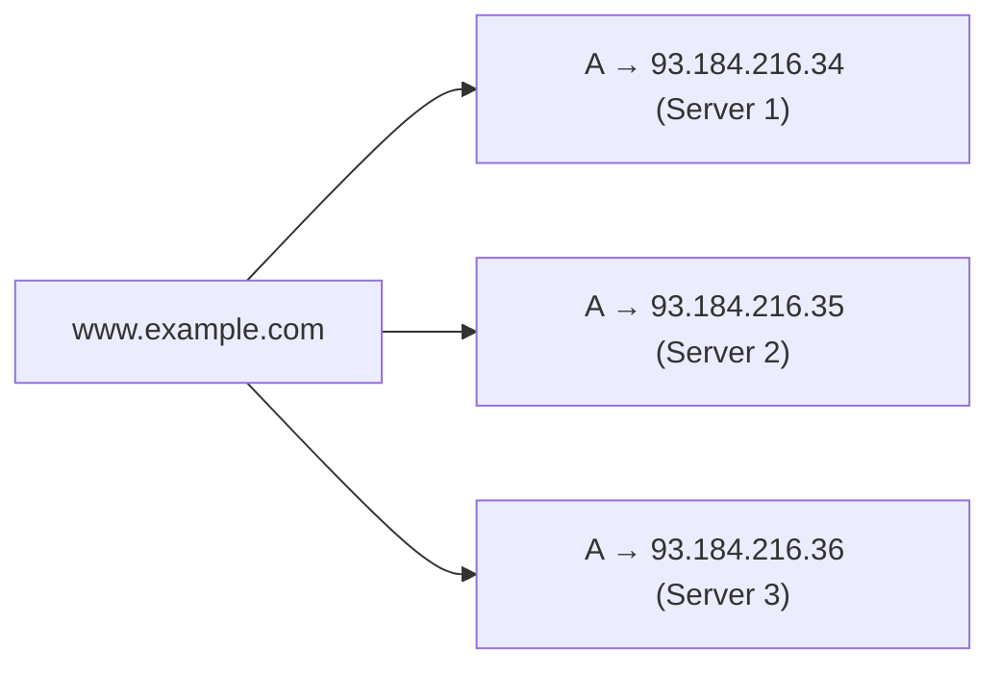
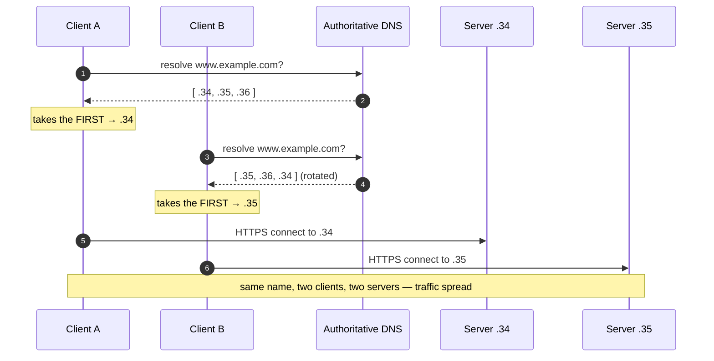
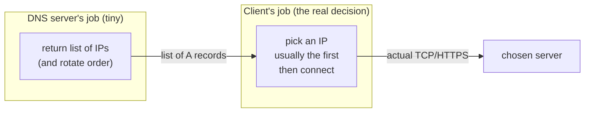
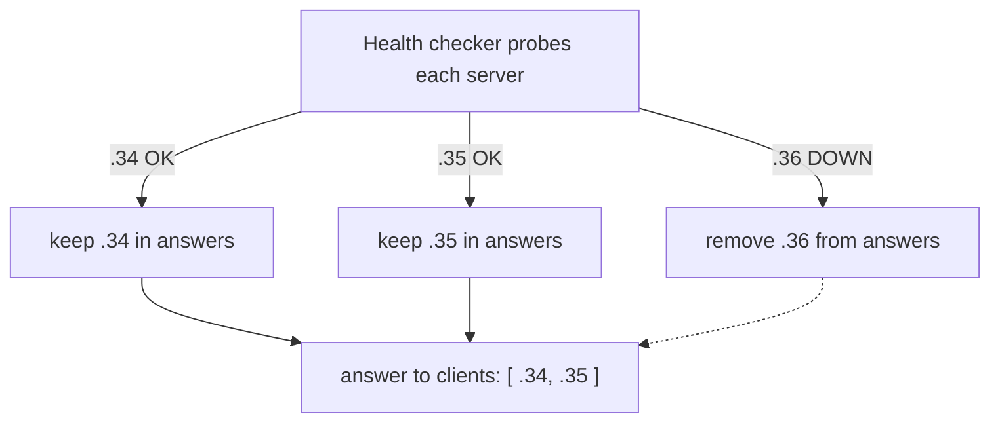

# DNS Load Balancing — Junior

<!-- level-focus -->
At junior level, focus on this question:

> How can I apply **DNS Load Balancing** in one small example and prove the result?

Use the smallest realistic scenario that exposes the decision and its failure behavior.
## 1. What Is DNS Load Balancing?

You have used a site — say `www.wikipedia.org` — that serves millions of people. It
cannot run on one machine. So there are many identical web servers, each with its own
IP address. The question is: **how does traffic get spread across them?**

The cheapest possible answer, invented long before dedicated load-balancer appliances
existed, uses the name-resolution system you *already have*: **DNS load balancing**.

The idea in one sentence: instead of mapping the name `www.wikipedia.org` to a *single*
IP address, the DNS server maps it to **several** IP addresses — one per server — and
hands them out. Different clients end up talking to different servers. No extra box, no
new protocol: the phone book that turns names into addresses does the spreading for you.

This tier builds that idea from scratch: why a name maps to a *list*, how the list gets
*rotated* so no single server takes every request, and the one crucial fact that trips
up every beginner — **the client, not the DNS server, chooses which IP to connect to.**

---

## 2. First Principles: A Name Is Just a Lookup Key

Strip DNS down to its essence. A computer cannot connect to a *name* like
`www.example.com`. TCP/IP needs a numeric **IP address** such as `93.184.216.34`. DNS is
the lookup service that translates one into the other:

```
"www.example.com"  ──DNS lookup──▶  93.184.216.34
   (a name)                          (an address the OS can dial)
```

The record that says "this name → this IPv4 address" is called an **A record** (for
IPv6 it is an **AAAA record**). Nothing in the design says a name may have only **one**
A record. A name is a *key*; the value it maps to can be a **set** of addresses.

That single relaxation — a key may map to many values — is the entire foundation of DNS
load balancing. If `www.example.com` maps to three A records, then three different
servers can all legitimately answer for that one name.



---

## 3. The Core Trick: Return Multiple IPs for One Name

When a client asks a DNS resolver for `www.example.com`, and the zone holds three A
records, the resolver returns **all three** in a single response:

```
;; ANSWER SECTION:
www.example.com.   300   IN   A   93.184.216.34
www.example.com.   300   IN   A   93.184.216.35
www.example.com.   300   IN   A   93.184.216.36
```

Three addresses arrive in one answer. Now imagine 300,000 clients over five minutes each
receive this same list. If every client just connects to the **first** address it sees,
all traffic piles onto `...34` and the other two servers sit idle — no balancing at all.

The fix is almost embarrassingly simple, and it is the subject of the next section:
**change the order of the list each time you hand it out.**

The load being spread here is *connections*, not individual HTTP requests. A client
resolves the name once, caches the result, and reuses that one chosen server for many
requests. DNS load balancing spreads clients across servers — coarsely, at resolution
time — not each request across servers.

---

## 4. Round-Robin DNS: Rotating the Answer

**Round-robin DNS** is the classic technique. The authoritative DNS server keeps the
same set of A records but **rotates their order** on each successive response. Answer #1
leads with `...34`, answer #2 leads with `...35`, answer #3 leads with `...36`, answer #4
wraps back to `...34`, and so on — a circular rotation, hence "round robin."

```
Response 1 → [ 34, 35, 36 ]      leads with .34
Response 2 → [ 35, 36, 34 ]      leads with .35
Response 3 → [ 36, 34, 35 ]      leads with .36
Response 4 → [ 34, 35, 36 ]      wraps around → .34 again
```

Because the overwhelming majority of clients simply take the **first** address in the
list, rotating the front of the list statistically distributes clients roughly evenly
across the three servers. With enough independent clients, each server receives about a
third of the new connections. It is a probabilistic spread, not an exact one — but for a
zero-cost mechanism, it is remarkably effective.

---

## 5. Seeing It with `dig`

`dig` (Domain Information Groper) is the standard command-line tool for querying DNS.
Ask it for a name backed by multiple A records and you can *watch* the list — and its
rotation — directly. Here is a query and a representative answer:

```
$ dig +noall +answer example-lb.com A

example-lb.com.   300   IN   A   93.184.216.34
example-lb.com.   300   IN   A   93.184.216.35
example-lb.com.   300   IN   A   93.184.216.36
```

Reading each answer line, field by field:

| Field | Example value | Meaning |
|-------|---------------|---------|
| Name | `example-lb.com.` | The name that was queried (trailing dot = fully qualified). |
| TTL | `300` | Time-To-Live in **seconds** — how long a resolver may cache this answer (here, 5 minutes). |
| Class | `IN` | Internet class (essentially always `IN`). |
| Type | `A` | Record type: `A` = IPv4 address, `AAAA` = IPv6 address. |
| Data | `93.184.216.34` | The IP address this name resolves to. |

Now run the exact same query a few times in a row. On a round-robin zone the three lines
stay the same but their **order changes** — a different IP appears first each time:

```
$ dig +noall +answer example-lb.com A        # first run
example-lb.com.   300   IN   A   93.184.216.34   ← first
example-lb.com.   300   IN   A   93.184.216.35
example-lb.com.   300   IN   A   93.184.216.36

$ dig +noall +answer example-lb.com A        # second run
example-lb.com.   300   IN   A   93.184.216.35   ← first now
example-lb.com.   300   IN   A   93.184.216.36
example-lb.com.   300   IN   A   93.184.216.34
```

That reordering *is* the load balancing. There is no dedicated appliance in this picture
— just a DNS server shuffling a list. (In practice a cached answer, per its TTL, is
reused without a fresh rotation; §4 DNS Caching and TTL covers that in depth.)

---

## 6. Two Clients, Two Different First IPs

Here is the whole mechanism as a staged flow: two clients resolve the *same* name,
receive the *same three* addresses in *different order*, each takes the first one, and so
they land on *different* servers.



Both clients asked for one identical name. Both received the *same set* of servers. The
only difference was **ordering**, and because each client honored "first in the list,"
they split across two different machines. Multiply this over thousands of clients and the
fleet is loaded roughly evenly.

---

## 7. Who Actually Picks the IP? (The Client Does)

This is the single most important fact at this tier, and it is where beginner intuition
usually goes wrong.

The DNS server **does not route traffic**. It never sees the HTTP request; it never
touches the connection. All it does is *return a list of addresses*. The **decision of
which address to connect to belongs entirely to the client** — the resolver library, the
operating system, and the application on the user's machine.

The convention almost everyone follows is "use the first address in the answer." That
convention is what makes round-robin *work*: if clients ignored order and picked randomly,
rotating the list would achieve nothing; if all clients picked the last entry, they would
all collide on the same server. Round-robin DNS relies on the near-universal client habit
of trying the first record first.

But "relies on client behavior" is also DNS load balancing's central weakness:

- A client may cache one address and reuse it for hours (per the TTL), so a single busy
  client keeps hammering *one* server regardless of rotation.
- Some resolvers or operating systems re-sort the returned addresses (for example, by
  preferring the topologically nearest one), quietly overriding the rotation.
- The DNS server has **no idea** how loaded any server is, or even whether it is alive —
  it just reads records out of a zone file.



Hold onto this: **DNS suggests, the client decides.** Everything DNS load balancing can
and cannot do follows from that split.

---

## 8. Flavors: Multi-Value, Weighted, Health-Checked

Plain round-robin is the starting point. Managed DNS providers layer three refinements on
top of the same "return a list" foundation. You do not need to configure these yet — just
recognize the names and the one-line idea behind each.

| Flavor | What it does | One-line intuition |
|--------|--------------|--------------------|
| **Multi-value answer** | Returns several A/AAAA records at once (with light health checking on some providers). | The base case: one name, many IPs, client picks one. |
| **Round-robin** | Rotates the *order* of that list on each answer. | Nudge each new client toward a different first IP. |
| **Weighted DNS** | Returns some IPs more often than others, in proportion to a configured weight. | Send a bigger server (or region) a larger share of clients. |
| **Health-checked DNS** | The provider probes each server and **drops** unhealthy IPs from the list. | Stop handing out addresses of servers that are down. |

Weighted DNS is useful when servers are not identical: give a machine with twice the
capacity a weight of 2 so it appears in (and leads) roughly twice as many answers.

Health-checked DNS is the most valuable upgrade for reliability. Plain round-robin will
happily keep returning the IP of a **crashed** server — clients dutifully connect to it
and their requests fail. A health-checked provider periodically pings each server and, on
failure, removes that IP from future answers, so new clients are steered only toward
live servers.



There is still a catch even here — clients that already **cached** the dead server's IP
keep using it until the TTL expires. Health-checked DNS improves things but does not make
failover instant. That limitation leads directly into the next section.

---

## 9. Why This Is Not a Real Load Balancer

DNS load balancing is cheap, simple, and needs no new infrastructure — but it is a blunt
instrument. A dedicated **L4** (transport-layer) or **L7** (application-layer) load
balancer is a real box (or service) that sits *in the request path* and makes a routing
decision for **every connection or request**. DNS only makes a decision once, at
resolution time, and then steps out of the way.

The consequences of that difference:

| Aspect | DNS load balancing | L4 / L7 load balancer |
|--------|--------------------|-----------------------|
| Where the decision is made | Once, at name-resolution time | On every connection (L4) or request (L7) |
| Knows real server load? | No — just reads a static list | Yes — tracks connections, latency, health continuously |
| Knows a server is down? | Only with health-checked DNS, and slowly | Yes — detects and removes in seconds |
| How fast does failover happen? | Slow — waits for the client's cached TTL to expire | Fast — next request is rerouted immediately |
| Granularity | Per client (coarse) | Per connection / per request (fine) |
| Sticky sessions / cookies | No | Yes (L7 can route by cookie, path, header) |
| Extra infrastructure needed | None — reuses DNS | Yes — a load balancer to run and operate |

The killer limitation is **stale caching**. Because clients (and intermediate resolvers)
cache DNS answers for the TTL, a server that dies is *not* removed from the client's view
until that cache expires — which could be minutes. During that window, clients keep
connecting to a dead machine and failing. Lowering the TTL helps failover but increases
DNS query volume and does not eliminate the problem, because some resolvers ignore short
TTLs.

The other limitation is **blindness**. DNS has no idea whether `...34` is idle or melting
under load; it hands out the list mechanically. It cannot honor sticky sessions, cannot
route by URL path or header, and cannot rebalance a client that is already connected.

The common, practical answer is to **combine** them: use DNS to spread clients across a
few **regions or data centers** (coarse, geographic), and put a real L4/L7 load balancer
**inside** each region to do the fine-grained, health-aware, per-request balancing. DNS
gets you to the right neighborhood; the load balancer picks the right house. Those L4/L7
mechanics belong to §14 Load Balancing — here, just anchor *why* DNS alone is not enough.

---

## 10. Key Terms

| Term | Definition |
|------|-----------|
| A record | DNS record mapping a name to an IPv4 address. |
| AAAA record | DNS record mapping a name to an IPv6 address. |
| Multi-value answer | A DNS response carrying several A/AAAA records for one name. |
| Round-robin DNS | Rotating the order of the returned records on each answer to spread clients. |
| Weighted DNS | Returning some records more frequently, in proportion to configured weights. |
| Health-checked DNS | A provider probing servers and dropping unhealthy IPs from answers. |
| TTL | Time-To-Live, in seconds — how long a resolver may cache a DNS answer. |
| Resolver | The client-side software that performs the DNS lookup and returns addresses. |
| L4 / L7 load balancer | A device/service in the request path that routes per connection (L4) or per request (L7). |

---

## 11. Common Mistakes at This Level

1. **Thinking the DNS server routes traffic.** It only returns a list of addresses; the
   client picks which one to dial. DNS suggests, the client decides.
2. **Assuming round-robin splits traffic exactly evenly.** It is probabilistic and per
   *client*, not per request. Caching, uneven client weight, and long-lived connections
   all skew the distribution.
3. **Believing a crashed server is instantly removed.** Without health checks it is never
   removed; even with health checks, clients keep using cached IPs until the TTL expires.
4. **Confusing "many A records" with a real load balancer.** DNS load balancing is coarse
   and blind to server load; it does not replace an L4/L7 balancer, it complements one.
5. **Setting a very long TTL then wondering why failover is slow.** The TTL directly
   bounds how quickly a bad server can drop out of clients' caches.

---

## 12. Hands-On Exercise

Pick a large, well-known site and inspect how its name is backed by multiple addresses.

1. Run `dig +noall +answer <name> A` (try a couple of large sites). Count the A records
   returned. Note the TTL on each line and convert it to minutes.
2. Run the **same** query three or four times in quick succession. Does the order of the
   returned addresses change between runs? If it does, you are watching round-robin DNS.
   If it does not, your resolver may be serving a cached answer — try again after the TTL,
   or query the authoritative server directly.
3. On paper, answer: if the server at the **first** returned IP crashed right now, which
   clients would still try to connect to it, and for how long? Tie your answer to the TTL
   value you read in step 1.
4. Explain in two sentences why adding a dedicated L4/L7 load balancer *inside* each
   region would fix the failover problem that DNS alone cannot.

*Next step:* [DNS Load Balancing — Middle](middle.md)

---

## Apply it

1. Choose one small, known input for **DNS Load Balancing**.
2. Predict the output or observable behavior.
3. Run the smallest example or probe that exercises the concept.
4. Change one input to trigger a failure or boundary case.
5. Explain the evidence using the guide's vocabulary.

## Verify your work

- Record the exact input, command or code path, and output.
- Repeat the probe and confirm the result is consistent.
- Show one expected success and one expected failure.
- Resolve any difference between the prediction and the evidence.

## Review questions

- What problem does DNS Load Balancing solve in the example?
- Which input changes the observed result, and why?
- What is the smallest useful success check?
- Which beginner mistake would your evidence catch?
