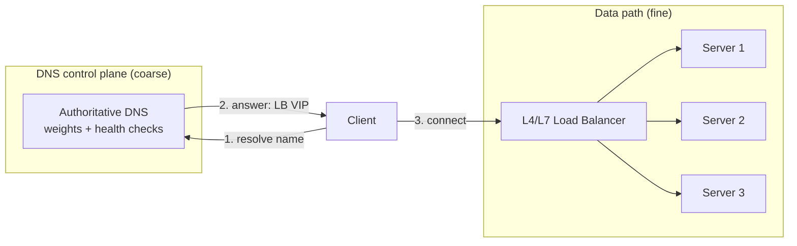
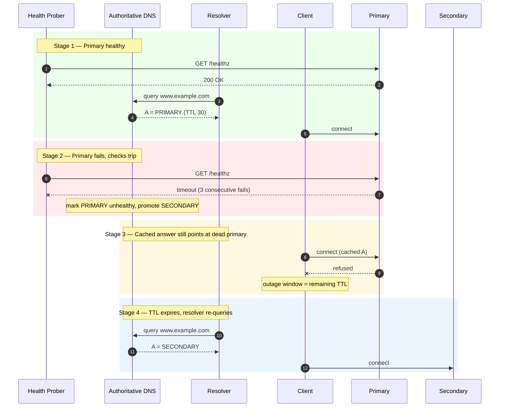
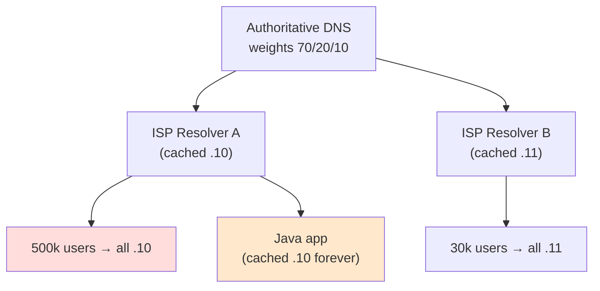

# DNS Load Balancing — Middle

<!-- level-focus -->
At middle level, focus on this question:

> Where does **DNS Load Balancing** belong in a maintainable component, and which trade-off selects the design?

Use the smallest realistic scenario that exposes the decision and its failure behavior.
## 1. Why DNS is a coarse load balancer, not a real one

The defining constraint of DNS load balancing is that **the balancer never sees the traffic it is balancing**. An L4 load balancer sits in the packet path: it counts open connections, weighs current load, and can move a flow the instant a backend degrades. DNS does none of this. It answers one question — "what address(es) does this name map to?" — and then steps out of the way. Everything after the answer (which address the client dials, how long it reuses it, whether it retries a second address on failure) is out of the resolver's control.

That means DNS load balancing operates on **three levers only**:

1. **Which records you return** (the answer set).
2. **In what order / proportion you return them** (rotation, weights).
3. **How long the answer may be cached** (the TTL).

Every technique in this document is a combination of those three levers. And every technique inherits the same hard limit: **you are steering resolvers, not clients, and definitely not connections.** A resolver that caches your answer for the full TTL will send *all* of its downstream users to the same address until the TTL expires. This is why DNS is best understood as **coarse-grained steering between pools or regions**, with a real load balancer doing fine-grained work behind each returned address.



The healthy production pattern is the picture above: DNS picks a **region / VIP**, and an L4/L7 load balancer picks a **server**. DNS steers *between* balancers; it does not replace them.

---

## 2. Simple round-robin and answer rotation

The oldest technique is **round-robin DNS**: publish several A records under one name and let the authoritative server rotate their order on each response.

```
www.example.com.   60   IN   A   203.0.113.10
www.example.com.   60   IN   A   203.0.113.11
www.example.com.   60   IN   A   203.0.113.12
```

Two distinct mechanisms are at play, and conflating them is a common error:

- **Answer rotation (server side).** The authoritative (or recursive) server permutes the order of records between responses, so different clients see a different address first.
- **Client selection (client side).** Most clients — including the C library resolver and browsers — dial the **first** address in the answer, falling through to later ones only on connection failure. So rotation matters *only because* clients prefer the first record.

The result is a rough, best-effort spread. It is genuinely useful for spreading *resolutions* across a static pool, but it is not load balancing in any measured sense:

- It cannot tell that `.11` is at 90% CPU and `.10` is idle — it distributes by *count of answers handed out*, not by load.
- It cannot remove a dead address. If `.12` is down, roughly a third of first-choice clients hit a dead endpoint and must time out and retry. **Plain round-robin has no failover.** This single fact is why round-robin alone is unacceptable for anything that needs availability, and why health-checked records (§4) exist.

Answer rotation is the *distribution* primitive; it must be paired with health checking before it is safe.

---

## 3. Weighted round-robin: shifting proportions

Plain round-robin treats every address equally. **Weighted round-robin** lets you bias the proportions — send more resolutions to some addresses than others. Managed DNS providers expose this as a **weight** attached to each record in a record set; the provider returns each record with probability proportional to its weight.

Conceptually (provider-agnostic pseudo-config):

```
recordset www.example.com A {
  answer 203.0.113.10  weight = 70
  answer 203.0.113.11  weight = 20
  answer 203.0.113.12  weight = 10
}
```

Roughly 70% of resolutions get `.10` first, 20% get `.11`, 10% get `.12`. Note *resolutions*, not requests — the caching caveat of §6 still applies.

Weighted answers unlock several concrete operational patterns:

- **Canary / gradual rollout.** Point weight `5` at the new version and `95` at the old; watch error rates; ramp `5 → 25 → 50 → 100`. This is a **weighted deploy**, and it works across regions where an in-cluster load balancer cannot reach.
- **Capacity-proportional balancing.** If one pool has beefier hardware or more instances, give it a larger weight so it draws proportionally more traffic.
- **Graceful drain.** To retire a data center, walk its weight down to `0` over minutes so cached answers age out instead of dropping connections all at once.
- **Blue/green cutover.** Keep both environments live; flip weights `100/0 → 0/100`. Rollback is just flipping the weights back — no redeploy.

A weight of `0` is special: the record is *eligible* but never returned, which is exactly what you want for a drained-but-not-deleted endpoint you may re-enable.

The limitation is unchanged from §2: weights govern the *statistics of answers*, and answers are cached. Weighted round-robin gives you **proportional steering over time**, not per-request precision.

---

## 4. Health-checked failover records

Health checking is what makes DNS load balancing safe. The authoritative provider periodically probes each endpoint (TCP connect, HTTP GET on a `/healthz` path, or TLS handshake) from multiple vantage points, and **withdraws unhealthy records from the answer set**. A failed endpoint stops being returned; when it recovers and passes N consecutive checks, it is re-added.

There are two shapes of this, and choosing between them is a real design decision:

- **Health-checked round-robin (active/active).** All healthy records are returned and rotated/weighted; a failed one is simply pruned from the pool. Traffic spreads across whatever is up.
- **Failover / primary-secondary (active/passive).** A **primary** record is returned as long as it is healthy. If the primary's health check fails, the provider returns the **secondary** instead. When the primary recovers, traffic fails back.

Failover is the pattern for disaster recovery: primary region serves everything; a standby region takes over only when the primary is declared down.



Stage 3 is the crux and the reason TTL matters so much: **health checks fix the answer, but they cannot recall answers already cached.** A resolver holding the old primary record will keep sending clients to the dead endpoint until its cached entry expires. That gap — from "provider knows primary is dead" to "last cached answer expires" — is your DNS-side outage window, and its ceiling is the record's TTL.

---

## 5. The low-TTL failover trade-off

Because the outage window in §4 is bounded by the TTL, DNS load balancing pushes you toward **low TTLs** — commonly `30` to `60` seconds for records you intend to fail over. A low TTL means caches expire quickly, so a withdrawn or re-weighted record propagates to clients fast.

But TTL is a genuine trade-off with two opposing pressures:

| Concern | Low TTL (e.g. 30s) | High TTL (e.g. 3600s) |
|---|---|---|
| **Failover speed** | Fast — clients re-resolve within ~½·TTL on average | Slow — dead answers linger up to an hour |
| **Weight-change propagation** | Fast — canary ramps take effect in minutes | Slow — stuck on old proportions |
| **DNS query volume** | High — every cache miss is another query | Low — one resolution serves many requests |
| **Cost / load on authoritative NS** | Higher (billed per query on managed DNS) | Lower |
| **Resilience to a DNS outage** | Worse — caches empty fast, so a resolver outage hurts sooner | Better — stale-but-working answers survive longer |

The practical rule of thumb:

- **Failover-critical records:** low TTL (30–60s). You are buying fast recovery and paying with query volume.
- **Stable, rarely-changing records:** higher TTL (300s–3600s+). Fewer queries, cheaper, more resilient to a DNS control-plane hiccup.

Two important nuances that separate the middle from the junior view:

1. **TTL is a hint, not a contract.** Many resolvers **clamp** TTLs — enforcing a minimum (some ISPs floor at 30–60s) or a maximum. A `1`-second TTL will not give you sub-second failover; the resolver will round it up. Do not design assuming your TTL is honored to the second.
2. **The window is bounded by TTL, but the *average* wait is roughly TTL/2**, because a given resolver's cache entry can be anywhere in its lifetime when the failure happens. Worst case is the full TTL; expected case is half of it.

Lowering TTL narrows the outage window but never eliminates it. To get *sub-TTL* failover you must move the retry logic into the client or a fronting L4 load balancer — DNS alone cannot beat its own cache.

---

## 6. How caching undermines even distribution

This is the section that most changes how you think about DNS load balancing. The theory says weighted or round-robin answers produce a distribution matching your weights. Reality inserts **layers of caching between your authoritative server and the end user**, and each layer *pins* traffic in ways that skew the distribution:

- **Authoritative → recursive resolver caching.** A big ISP resolver serving millions of users caches your answer once and serves it to all of them until the TTL expires. If that resolver happened to cache `203.0.113.10`, **every user behind it** is pinned to `.10` for the TTL — regardless of your 70/20/10 weights. Your "distribution" is now a distribution over *resolvers*, not over *users*, and a handful of megaresolvers dominate the traffic.
- **Resolver → OS stub cache.** The client machine caches the answer too, so repeated requests from the same host reuse one address for the TTL.
- **Application-level caching (the sharpest edge).** Many runtimes and HTTP clients resolve a hostname **once at startup or on first use and cache it indefinitely**, ignoring your TTL entirely. The classic offender is a long-lived JVM (historic default of caching DNS forever) and connection-pooling HTTP clients that dial the same resolved IP for the process's lifetime. For these, a weight change or health withdrawal **never reaches the client** until it is restarted.

The compounding effect:



Three consequences you must internalize:

1. **DNS load balancing distributes over resolvers weighted by their user population, not over users uniformly.** With a skewed resolver population (a few giant ISPs), a 33/33/33 answer can land as 60/25/15 in practice.
2. **Session stickiness is accidental but real.** Because a client reuses its cached address, a user tends to stay on one backend for the cache lifetime — sometimes useful (locality), sometimes harmful (uneven load, a "sticky" hot spot).
3. **Withdrawal is slower than you think.** Between resolver clamping (§5) and app-level indefinite caching, a "dead" record can keep receiving traffic long after the TTL you configured.

The mitigations are real but partial: keep TTLs low, front the pool with an L4/L7 balancer (so DNS only picks a VIP and per-connection balancing happens where caching can't pin it), and **fix broken clients** — configure JVM `networkaddress.cache.ttl` to a small value and use HTTP clients that respect DNS TTL or periodically re-resolve. You cannot make DNS distribution precise; you can only stop it from being catastrophically skewed.

---

## 7. Routing policies compared

Managed DNS providers package the levers of §2–§4 into named **routing policies**. The names differ by vendor, but the mechanics reduce to the same primitives. This table is the mental map to carry into a design discussion:

| Policy | What it does | Load signal | Failover | Typical use |
|---|---|---|---|---|
| **Simple / round-robin** | Return all records, rotate order | None (count of answers) | **No** — dead records still returned | Static pool, non-critical |
| **Weighted** | Return records with probability ∝ weight | None (you set proportions) | Only if paired with health checks | Canary, blue/green, capacity bias |
| **Failover (primary/secondary)** | Return primary while healthy, else secondary | Health check pass/fail | **Yes** — active/passive | DR standby region |
| **Latency-based** | Return the region with lowest measured latency to the resolver | Provider-measured RTT | Usually + health check | Multi-region perf |
| **Geolocation** | Return records based on client's geographic region | Resolver/client location | Usually + health check | Data residency, localized content |
| **Geoproximity** | Return nearest region by distance, with a **bias** to shift load | Distance + adjustable bias | Usually + health check | Cost/load-aware geo steering |

Two clarifications that matter:

- **Health checking is orthogonal, not built into every policy.** Round-robin and weighted are *distribution* policies; they only fail over if you attach health checks that prune dead records. Failover is the one policy that is *defined by* health state. Treat "which distribution?" and "am I health-checking?" as two separate switches.
- **Latency-based and geolocation are not the same.** Latency-based routes by *measured RTT* (which usually correlates with geography but not always — peering and routing quirks intervene). Geolocation routes by the client's (or resolver's) *mapped location*, independent of actual latency, and is what you use for compliance/residency ("EU users must hit EU servers"), not raw speed. Getting these confused leads to residency violations or surprising latency.

Policies compose in real deployments: a geolocation policy selects the region, and *within* that region a weighted or failover set picks the endpoint. That nesting is how you get "route EU users to EU, and within EU do a 90/10 canary with automatic failover to the standby."

---

## 8. A worked configuration walkthrough

Let us wire a concrete, provider-agnostic setup: an active/active two-endpoint pool with weights, health checks, and low TTL, plus a standby for full-region failover.

**Step 1 — Define health checks.** Each check probes an endpoint and declares it healthy/unhealthy after N consecutive results.

```
healthcheck primary-a {
  target   = "https://203.0.113.10/healthz"
  interval = 10s
  timeout  = 5s
  healthy_threshold   = 3   # 3 passes to re-add
  unhealthy_threshold = 3   # 3 fails to remove
}
healthcheck primary-b { target = "https://203.0.113.11/healthz"; ...same... }
healthcheck standby   { target = "https://198.51.100.10/healthz"; ...same... }
```

The thresholds matter: too-sensitive (threshold 1) flaps a record out on a single blip; too-lax (threshold 10) leaves a dead endpoint in rotation for `10 × interval` before removal. `3 × 10s = 30s` to detect is a common balance — and note it *adds* to the TTL window when computing total failover time.

**Step 2 — Weighted, health-checked primary set.**

```
recordset www.example.com A ttl=30 {
  answer 203.0.113.10  weight=50  healthcheck=primary-a
  answer 203.0.113.11  weight=50  healthcheck=primary-b
}
```

Now `.10` and `.11` split resolutions ~50/50, and either is pruned automatically if its check fails. If `.11` dies, the pool becomes 100% `.10` (minus caching skew) within the health-check detection window — and cached `.11` answers keep landing until their TTL expires.

**Step 3 — Region failover on top.** Wrap the primary set in a failover policy with a standby region:

```
policy failover www.example.com {
  primary   = recordset[primary set above]   # active/active pool
  secondary = 198.51.100.10                   # standby region VIP
  # secondary returned only if ALL primary records are unhealthy
}
```

**Step 4 — Compute the true failover time.** This is the number that matters, and juniors forget half of it:

```
total_failover ≈ detection_time + TTL_expiry_wait
             ≈ (unhealthy_threshold × interval) + (up to TTL, ~TTL/2 avg)
             ≈ (3 × 10s = 30s)                  + (up to 30s)
             ≈ up to ~60s worst case, ~45s typical
```

If your availability target cannot tolerate ~45–60s of DNS-side failover, **DNS is the wrong tool for that layer** — you need an L4 load balancer or anycast (which fails over in the routing layer, not the caching layer) doing sub-second detection. DNS failover is measured in *tens of seconds*, and no TTL tuning changes that order of magnitude.

---

## 9. Failure modes and how to reason about them

The middle-level skill is diagnosing why "DNS load balancing isn't balancing." Map the symptom to the layer:

- **"One backend is hot, others idle."** Almost always caching skew (§6): a megaresolver or an app with a pinned IP. Check whether the hot backend's traffic is dominated by a few source resolvers. Fix: front with L4, lower TTL, audit client resolvers.
- **"Failover took minutes, not seconds."** Add up detection time + TTL, then remember resolver clamping (§5) can floor your TTL higher than configured, and app-level caches (§6) may never re-resolve. The slowest client sets the outage tail.
- **"Traffic didn't shift after I changed weights."** Weight changes propagate at TTL speed *and* are blocked by any client caching indefinitely. Confirm the change is live authoritatively (query the authoritative server directly, not a cached resolver), then wait out TTL.
- **"Health check flaps."** Threshold too low, or the health path is heavier than real traffic (e.g. `/healthz` hits the database while the app can still serve cached pages). Make the check representative but cheap, and raise thresholds.
- **"Clients hit a dead IP even though DNS pruned it."** The record was withdrawn authoritatively, but the client cached the old answer (resolver or app). DNS cannot recall issued answers; the client must age out or retry to a second address. This is why clients that iterate through *all* returned addresses on connection failure are more resilient than those that dial only the first.

The unifying lesson: **every DNS load-balancing failure is a caching or a health-visibility problem.** You are never debugging "the balancer" — there is no balancer in the path. You are debugging what answer got cached where, and whether health state reached the answer in time.

---

## 10. Practitioner heuristics

- **DNS steers between pools; a real load balancer steers within one.** Return a VIP, not individual servers, whenever you can — it moves fine-grained balancing to a layer caching can't pin.
- **Never run plain round-robin without health checks** for anything that needs availability. Round-robin distributes; only health checks remove the dead.
- **Set TTL by intent:** 30–60s for failover-critical records, 300s+ for stable ones. Remember expected failover is ~TTL/2 detection *plus* the health-check detection window, and resolvers may clamp your TTL upward.
- **Distribution is over resolvers, not users.** Expect skew from megaresolvers; measure actual per-backend load, don't assume your weights hold.
- **Fix broken clients first.** A JVM or HTTP pool caching one IP forever defeats every DNS technique. Configure DNS-TTL respect and periodic re-resolution before blaming the policy.
- **Use weight=0 to drain, not delete** — drained endpoints stay re-enable-able and let cached answers age out gracefully.
- **Compute total failover time explicitly** — `detection + TTL` — and if the answer is "tens of seconds" but your SLO needs "sub-second," reach for anycast or L4/L7, not a lower TTL.
- **Compose policies deliberately:** geolocation/latency for the *region*, weighted/failover for the *endpoint*. Keep "which distribution" and "am I health-checking" as separate, explicit decisions.

DNS load balancing is not a load balancer — it is a **coarse, cache-limited steering layer** you configure with three levers (answer set, proportion, TTL) and one safety mechanism (health checks). Master when its approximate, tens-of-seconds behavior is exactly right — regional steering, canaries, DR failover — and when you must delegate the real work to a balancer that actually sits in the packet path.

---

*Next step:* [DNS Load Balancing — Senior](senior.md)

---

## Apply it

1. Find a real component where **DNS Load Balancing** affects an interface or dependency.
2. Write two plausible choices and the constraint that favors each one.
3. Make the smallest reversible change at that boundary.
4. Exercise the component alone, then exercise the integrated flow.
5. Keep the decision note with the evidence that selected the option.

## Verify your work

- A focused check proves the local behavior.
- An integrated check proves callers and dependencies still agree.
- Logs, traces, compiler output, or benchmarks expose the boundary.
- Reverting the change restores the previous behavior without unrelated edits.

## Review questions

- Which boundary is most affected by DNS Load Balancing?
- What constraint would make you choose the alternative design?
- How would you isolate a local defect from an integration defect?
- What evidence shows that the change remains maintainable?
