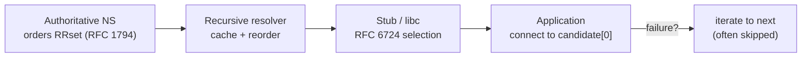
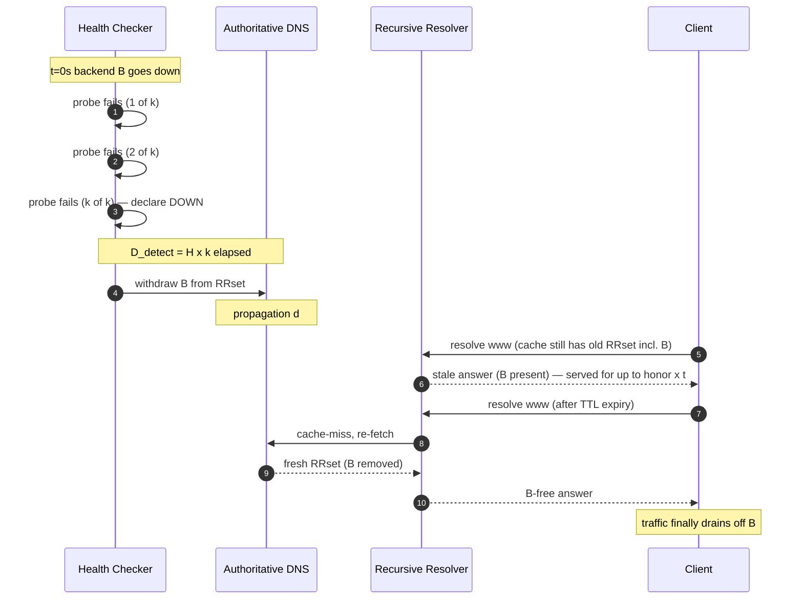

# DNS Load Balancing — Professional

<!-- level-focus -->
At professional level, focus on this question:

> How should teams adopt and operate **DNS Load Balancing** with measurable outcomes and limited coordination?

Use the smallest realistic scenario that exposes the decision and its failure behavior.
## 1. What DNS Load Balancing Actually Controls

When a name resolves to multiple addresses, the authoritative server can influence *which addresses are returned* and *in what order*, but it cannot dictate *which one the client connects to*. That final choice is delegated, in order, to:

1. The **recursive resolver**, which may cache the answer for its TTL, may re-order the RRset before handing it to the stub, and may return a fixed or rotated ordering.
2. The **stub resolver / socket library** on the client, which applies RFC 6724 destination-address selection to the returned list and typically tries the *first* surviving candidate.
3. The **application**, which may or may not iterate to the next address on connection failure ("happy eyeballs" does, many do not).

So DNS load balancing is a **control signal with two lossy amplifiers in series**. The authoritative side is a *distribution shaper*; everything downstream re-weights that distribution. The engineering discipline is to model the composition, not just the first stage.



Each arrow is a place where the intended weight vector `w = (w_1, ..., w_n)` over `n` addresses is transformed. The observed traffic split is `T(w)`, the composition of all three transforms — not `w` itself.

---

## 2. RFC 1794: Authoritative Support for Load Balancing

RFC 1794 ("DNS Support for Load Balancing", 1995) is the standards-track basis for what most operators call *DNS round-robin*. Its contributions are precise and worth stating exactly, because folklore over-claims them.

- **Multiple address records under one name are legal and meaningful.** A resolver receiving several `A` records for `www.example.com` may use any of them; they are equivalent candidates for the same service.
- **The authoritative server MAY rotate the order of the RRset between successive queries.** RFC 1794 sanctions *cyclic ordering* (round-robin) so that the record placed first varies query-to-query. Placing a different address first each time biases naive clients — which take the first entry — toward a uniform split.
- **The mechanism is a hint, not a guarantee.** RFC 1794 is explicit that ordering is advisory. Caches, reordering resolvers, and client selection may all override it. It does not, and cannot, promise a balanced result.

The key property: RFC 1794 round-robin operates **per authoritative response**, but clients do not each get their own response — they share cached responses. This is the crux of section 5's model.

A second RFC 1794 subtlety: rotation is defined over the *answer as sent*, so a server that rotates on every outbound response still only rotates once per cache-miss at any given resolver. A popular resolver serving a million users off one cached answer sees exactly one ordering for the whole TTL window.

---

## 3. Why Naive Round-Robin Fairness Breaks

The mental model "the server rotates, so each backend gets `1/n` of traffic" fails for four compounding reasons.

**(a) Caching collapses per-query rotation into per-TTL rotation.** Rotation happens at the authoritative server on cache-miss. A resolver caches one ordering for the whole TTL and replays it to every downstream stub. The number of *independent orderings* seen per unit time is not the query rate — it is the *cache-miss rate*, roughly `(number of resolvers) x (1 / TTL)`. High TTL and few large resolvers means very few independent draws.

**(b) Resolver reordering overrides authoritative order.** Many resolvers apply their own sorting: RFC 3484's predecessor rules, "sortlist" configuration, latency-based sorting, or simply returning cached records in storage order (often sorted, not rotated). BIND's `rrset-order` is `cyclic` by default but is frequently set to `fixed`. When a resolver sorts, the authoritative rotation is *discarded entirely*.

**(c) Client address selection (RFC 6724) re-sorts before connecting.** Even a perfectly rotated, un-reordered list is re-sorted by the client's `getaddrinfo` per RFC 6724 (§4). The client does not pick uniformly at random; it applies a *deterministic total order* (scope match, longest-prefix match to source address, etc.), then connects to the first. A deterministic re-sort applied to a rotated list can pin large client populations onto one address.

**(d) Traffic is not one-request-per-resolution.** A resolution feeds an entire browsing session — dozens of connections, keep-alive reuse, HTTP/2 multiplexing — all pinned to the *single* address the client selected once. The unit of load is the *client-session*, not the DNS query, and sessions have heavy-tailed weight (bytes, duration, concurrency). One "unlucky" heavy client behind a big resolver can skew a backend badly.

The result: DNS round-robin distributes *resolution events weighted by cache-miss timing*, not *requests*, and then a deterministic client sort collapses even that. Fairness is an emergent statistical property with high variance, not a guarantee.

---

## 4. RFC 6724 Client Address Selection

RFC 6724 ("Default Address Selection for IPv6", 2012, obsoleting RFC 3484) specifies how a dual-stack client orders candidate *destination* addresses returned by DNS. Although titled for IPv6, it governs the combined IPv4+IPv6 candidate set on essentially every modern OS. Its **destination address selection** (§6) sorts candidates by a rule sequence; the first two rules that matter for load balancing:

- **Rule 1 — Avoid unusable destinations.** Unreachable candidates sink to the bottom (this is what enables failover-by-fallthrough — see section 7).
- **Rule 2 — Prefer matching scope**, then **Rule 8 — Prefer smaller scope**, and critically **Rule 9 — Use longest matching prefix** (common prefix length between the candidate and the chosen source address).

Rule 9 is the fairness-killer for load balancing. It is a **deterministic function of `(client source IP, candidate IP)`**. Two candidates `d1`, `d2` are compared by how many leading bits they share with the client's source address. For a fixed client, this ordering never changes regardless of how the authoritative server rotated the RRset. So:

> For a given client, RFC 6724 imposes a **fixed** preference order over your address pool. Authoritative rotation only matters at the *margins* where the comparison rules tie.

Consequently, if your backends' IPs happen to have systematically different longest-common-prefix relationships to large client subnets, RFC 6724 will *consistently* funnel those subnets to specific backends — a stable, invisible skew. Ties are broken by the order the addresses appeared (Rule 10 preserves original order), which is the *only* place authoritative rotation survives to the client. Whether rotation has any effect at all therefore depends on how often Rule 9 produces a tie for your particular address block.

---

## 5. A Distribution Model Under Caching + Selection

Let us quantify what you actually get. Consider `n` equal-weight backends, a client population partitioned across `R` recursive resolvers, and record TTL `t` (seconds). We model over an observation window `W`.

**Step 1 — Independent ordering draws.** Each resolver refreshes its cached RRset at rate `1/t`. Over window `W`, the number of independent authoritative orderings observed is:

```
K = R x (W / t)         (independent RRset orderings across all resolvers)
```

Small `R` (few dominant public resolvers) or large `t` makes `K` small. With `K` small, the *law of large numbers has not kicked in* — the split is dominated by variance.

**Step 2 — What each ordering delivers.** During one TTL window at one resolver, every downstream client sees the *same* cached ordering. If clients naively take the first address, that resolver sends **all** its traffic in that window to `ordering[0]`. Under pure authoritative round-robin, successive misses cycle `ordering[0]` through all `n` backends, so a resolver's traffic is split into `n` time-slices — but each *slice* is an all-or-nothing assignment of that resolver's population.

Let `p_r` be the fraction of total traffic behind resolver `r`. The expected fraction to backend `i` is still `1/n` if rotation is perfect, but the **variance** is what bites:

```
Var(share_i) ≈ (1/K) x sum_r ( p_r^2 )         (per-window, rotation-limited)
```

The term `sum_r p_r^2` is the **Herfindahl index** of resolver concentration. If one resolver carries 40% of traffic (`p_r = 0.4`), it contributes `0.16` to the sum single-handedly. The more concentrated your resolver mix (Google, Cloudflare, Quad9 dominate), the higher the variance for a fixed `K`. Concretely: with `n = 4`, two resolvers at `p = 0.5` each, `t = 300 s`, `W = 300 s`, then `K = 2` and every backend's realized share in that window is drawn from a coarse `{0, 0.5, 1}`-ish lattice — nowhere near `0.25`.

**Step 3 — Client selection overlay.** Now overlay RFC 6724. If a fraction `f` of clients have a *non-tie* Rule-9 preference, those clients ignore rotation entirely and pin to a fixed backend `b(client)`. The effective model splits into:

```
observed_share_i = f x (RFC6724-pinned mass for i)  +  (1 - f) x (rotation share_i)
```

Only the `(1 - f)` fraction is even reachable by your authoritative rotation. The pinned mass `f` is a *static* function of the client-IP-to-backend-IP prefix geometry — you can only move it by changing which IPs sit in the pool.

**Takeaway.** DNS round-robin approaches uniform *only* in the limit `K -> infinity` (many resolvers, short TTL, long window) **and** `f -> 0` (no systematic prefix skew). Real deployments violate both. Expect a distribution whose mean is `1/n` but whose per-window variance scales with resolver concentration and whose floor skew is set by RFC 6724 geometry.

---

## 6. EDNS Client Subnet and Answer Selection

EDNS Client Subnet (ECS, RFC 7871) changes *which* answer the authoritative server selects, giving it back some of the control that caching stole. With ECS, the recursive resolver forwards a truncated prefix of the *client's* source address (e.g., `203.0.113.0/24`) in the query's EDNS option. The authoritative server can then return an answer *tailored to that subnet* — typically for GeoDNS, but equally for subnet-aware load balancing.

Two consequences for the model above:

- **Cache keying becomes per-subnet.** RFC 7871 requires the resolver to key its cache on `(qname, qtype, client-subnet-scope)`. This *increases* `K`: instead of one cached ordering per resolver, there is one per (resolver, subnet-scope) pair, which raises the number of independent draws and lowers variance — at the cost of resolver cache size and query amplification.
- **The authoritative server can steer, not just rotate.** ECS lets you return *different weight vectors* `w(subnet)` to different client blocks — e.g., pin an over-loaded region's clients to spare backends. This is real load-balancing control, because the decision moves back to a component you own.

The cost: ECS leaks client location (a privacy concern RFC 7871 itself flags), inflates authoritative QPS (each distinct subnet is a distinct query), and only helps for resolvers that implement it. It does **not** override RFC 6724 client selection — the client still re-sorts whatever list it receives. ECS improves *which list you send*; it does nothing about *how the client picks from that list*.

---

## 7. Failover Time as f(TTL, health-check, cache honoring)

The critical operational number: when a backend dies, how long until traffic stops hitting it? DNS-based failover means *withdrawing* the dead address from answers, but withdrawal only takes effect as caches expire. Decompose the total failover time into additive stages.

Let:

- `H` = health-check interval (seconds between probes).
- `k` = consecutive failed probes required to declare a backend down (debounce).
- `d` = time to propagate the withdrawal to authoritative servers (edit + push; often near-zero for API-driven DNS).
- `t` = record TTL (seconds).
- `honor` = a factor in `[1, ∞)` capturing resolvers/clients that overstay the TTL (TTL-flooring, negative caching, browser DNS pinning).

**Detection time** — the delay before the system even knows the backend is down:

```
D_detect = H x k        (worst case; expected ≈ H x (k - 1) + H/2)
```

**Propagation floor** — once withdrawn, a *fresh* resolver query gets the new answer after `d`. But already-cached answers persist. A resolver that fetched the old answer *just before* withdrawal serves it for up to `t` more seconds:

```
D_cache_worst = t              (client just missed the withdrawal)
D_cache_mean  = t / 2          (uniform arrival within the TTL window)
```

**Honoring penalty** — real resolvers and clients do not always respect `t`. Some floor TTLs to a minimum (e.g., 30–60 s regardless of your `5 s`), browsers pin DNS for the tab lifetime, and stub caches add their own hold. Model this as a multiplier `honor >= 1` on the cache term.

**Total worst-case failover time:**

```
F_worst = D_detect + d + honor x t
        = (H x k) + d + honor x t
```

**Total expected failover time (for a random affected client):**

```
F_mean  ≈ H x (k - 0.5) + d + honor x (t / 2)
```

**Worked example.** GeoDNS/API-driven setup: `H = 10 s`, `k = 3`, `d ≈ 2 s`, `t = 30 s`, and suppose big resolvers floor short TTLs so `honor ≈ 1.5`.

```
F_worst = (10 x 3) + 2 + 1.5 x 30 = 30 + 2 + 45 = 77 s
F_mean  ≈ 10 x 2.5 + 2 + 1.5 x 15 = 25 + 2 + 22.5 ≈ 49.5 s
```

So even with an aggressive 30 s TTL, a fraction of clients hit the dead backend for over a minute. Note the *diminishing returns*: dropping `t` from 30 s to 5 s cuts the cache term but is largely defeated by `honor` (resolvers that floor to 30 s ignore your 5 s entirely), and it multiplies authoritative QPS 6x. The detection term `H x k` then dominates — meaning **health-check cadence, not TTL, is often the real lever** below a certain TTL. And no DNS TTL choice helps the client whose application never retries: RFC 6724 Rule 1 only demotes an unreachable address *within a fresh resolution*; a client that already connected and holds the socket sees no benefit until it re-resolves.

---

## 8. Staged Failover Timeline



The diagram makes the additivity explicit: nothing about the cache stage begins until detection completes, and the client can keep receiving `B` for the entire `honor x t` window after propagation.

---

## 9. Comparison Tables

**Ideal vs cache-real traffic distribution** (`n = 4` equal-weight backends):

| Property | Ideal round-robin | Cache-real (this model) |
|---|---|---|
| Unit of distribution | Per HTTP request | Per (resolver, TTL-window) ordering |
| Independent draws in window `W` | ≈ request count | `K = R x (W / t)` (often single digits) |
| Mean share per backend | `1/n` | `1/n` (unchanged) |
| Variance of share | ≈ 0 (large N) | `∝ (1/K) x Σ p_r²` (resolver concentration) |
| Effect of RFC 6724 | none assumed | pins fraction `f` to fixed backend |
| Effect of high TTL | none | fewer draws → higher variance |
| Sensitivity to one big resolver | negligible | dominates variance (Herfindahl term) |

**Failover-time contributors** (which knob moves what):

| Contributor | Term | Controlled by | Notes |
|---|---|---|---|
| Detection | `H x k` | Health-check interval + debounce count | Often the dominant term at low TTL |
| Propagation | `d` | DNS provider / API push | Near-zero for managed DNS APIs |
| Cache expiry (mean) | `honor x t / 2` | Record TTL | Diminishing returns as `t` drops |
| Cache expiry (worst) | `honor x t` | Record TTL | Client that just missed withdrawal |
| Honoring overstay | `honor >= 1` | Resolver TTL-flooring, browser pinning | Not under your control; defeats tiny TTLs |
| Client no-retry | unbounded | Application retry logic | RFC 6724 Rule 1 only helps on re-resolution |

---

## Apply it

1. Define the user or business outcome that **DNS Load Balancing** should improve.
2. Assign one owner for code, contracts, operations, and incidents.
3. Split delivery into reversible increments that produce evidence early.
4. Publish responsibilities, escalation paths, and compatibility windows.
5. Stop or expand only when the agreed measures support that decision.

## Verify your work

- Each increment has an owner, rollback path, and observable exit condition.
- Adoption, reliability, delivery time, and coordination cost are measured.
- Incident and migration exercises prove that responsibility is executable.
- The old path is removed only after telemetry proves it is unused.

## Review questions

- Which measurable outcome justifies investing in DNS Load Balancing?
- Which team owns the full lifecycle and incident response?
- What reversible increment produces the earliest useful evidence?
- Which exit condition proves that migration or adoption is complete?
