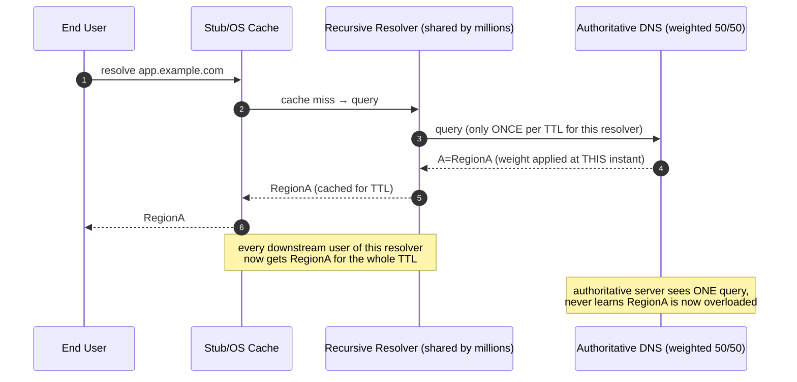
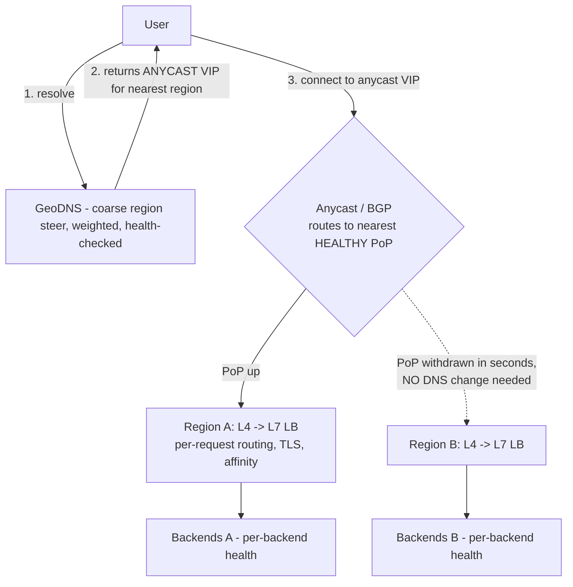
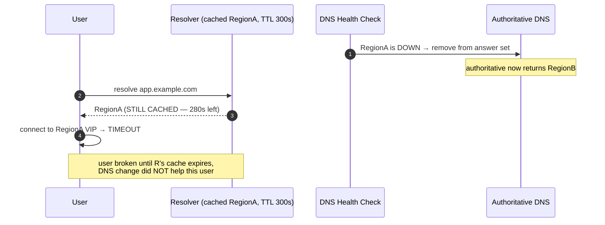

# DNS Load Balancing — Senior

<!-- level-focus -->
At senior level, focus on this question:

> Which system invariant is affected by **DNS Load Balancing** under failure, load, and change?

Use the smallest realistic scenario that exposes the decision and its failure behavior.
## 1. The Fundamental Limits of DNS Load Balancing

DNS load balancing distributes traffic by returning different IP addresses for the same
hostname — either by rotating a multi-record A/AAAA set (round-robin DNS), by weighting,
or by resolving the answer as a function of the resolver's geography, latency, or a
health check (GeoDNS / "smart" authoritative DNS such as Route 53, NS1, Akamai, Cloud
DNS). It is the *first* steering decision in the request path and, structurally, the
weakest form of control you have. Five limits are inherent, not implementation bugs:

**1. No real-time load awareness at the point of decision.** The authoritative server
answers a query and then has no further contact with that client. It never sees the TCP
connection, never sees the request, never sees whether the chosen backend is now
saturated. Weights are set *ahead of time*; they cannot react to a backend that spikes to
95% CPU three seconds after the answer was handed out. Compare this to an L7 LB, which
observes every request and can shed load per-request. DNS steers *populations of future
connections* based on *stale aggregate assumptions*.

**2. Caching defeats fairness.** DNS is a caching system by design — that is what makes it
scale to the whole internet. But between the authoritative server and the end user sit
recursive resolvers (ISP resolvers, 8.8.8.8, 1.1.1.1, corporate resolvers) and the
client's own stub/OS/browser cache. A single large ISP resolver may cache one answer and
serve it to *millions* of downstream users for the whole TTL. Your carefully weighted
"50/50" split becomes whatever fraction of resolvers happened to cache which answer.
Round-robin fairness assumes uniform, uncached, per-query rotation — an assumption
violated the moment a resolver caches. The unit of load balancing is effectively *"one
resolver's user base for one TTL"*, not "one request."

**3. Client stickiness you did not ask for.** Browsers and OS resolver stacks pin a
resolved IP for the life of a page, a connection pool, or a cache entry — often longer
than the TTL, because many stub resolvers and browsers honor TTL loosely or apply their
own minimum. A user who resolved to region A stays on region A until their local cache
expires, regardless of your intent. This is accidental session affinity: useful when you
want it, a liability when you are trying to drain a region.

**4. No per-connection or per-request control.** DNS hands out an address; everything after
that — connection establishment, request routing, retries, affinity — happens at layers
you do not control from DNS. You cannot say "route this user's POST to the write master
but their GETs to a replica." You cannot pin a WebSocket to a specific pod. Those are
L4/L7 concerns. DNS chooses a *front door*, nothing finer.

**5. Uncontrolled honoring of TTL.** You publish TTL=60. A misbehaving resolver clamps to
a 300s minimum, or ignores it entirely, or serves stale on failure (RFC 8767
serve-stale). Your *stated* blast-radius window and your *actual* one differ, and you have
no enforcement mechanism. You control the number you publish; you do not control obedience.



The senior takeaway: **DNS load balancing is a demand-shaping tool, not a request router.**
Treat its output as a *statistical steer over a population*, not a precise control knob.

---

## 2. The TTL Tension: Fairness vs Failover Speed

Almost every DNS-LB decision reduces to choosing a TTL, and TTL sits at the center of an
irreducible tension.

**Low TTL (e.g., 30–60s)** buys *responsiveness*: weight changes and failovers propagate
quickly, because caches expire quickly. The cost is that every resolver re-queries the
authoritative servers frequently, multiplying query volume (a real cost and a real DDoS
amplification surface), and — because answers churn — clients bounce between IPs more
often, weakening any accidental affinity and increasing connection setup overhead.

**High TTL (e.g., 3600s+)** buys *cache efficiency and stability*: fewer authoritative
queries, more stable client-to-region mapping. The cost is catastrophic during failure —
a dead region stays cached in millions of resolvers for up to the full TTL, and there is
*no cache-purge protocol in DNS*. You cannot recall a bad answer. You can only wait it out.

The tension is fundamental because the two goods pull opposite ways:

```text
                low TTL <────────────────────────> high TTL
 failover speed:  FAST                               SLOW
 query load:      HIGH                               LOW
 client stability: churny                            sticky
 fairness fidelity: better (more re-queries)         worse (long stale windows)
 blast radius of bad answer: seconds-minutes         up to full TTL
```

Two crucial second-order facts a senior must internalize:

**(a) A low TTL does NOT guarantee fast failover.** It only *bounds* it — and only if every
resolver obeys it, which they do not (§1, limit 5). Some resolvers clamp minimums; some
serve stale on origin failure (RFC 8767). So DNS-based failover is *best-effort with a
long tail*: most traffic moves within one TTL, but a stubborn fraction lingers far longer.
Any design that treats DNS failover as "clean cutover in TTL seconds" is wrong. Plan for a
tail of clients stuck on the old answer for minutes.

**(b) TTL expiry creates a thundering herd.** If a popular record has TTL=60 and a large
population resolved it near-simultaneously (say, right after a mobile app cold-start push),
their caches expire near-simultaneously, and a synchronized wave of re-queries hits the
authoritative servers — and, worse, a synchronized wave of *new connections* may hit the
newly-selected backend. Mitigations: modest TTLs (not extreme lows), authoritative-server
capacity headroom, and downstream L4/L7 that can absorb connection surges regardless of
which IP DNS handed out.

**Practical rule:** Use *moderate* TTLs (30–120s) for records that participate in
failover, accept that failover is best-effort, and — critically — **never rely on DNS TTL
as your primary failover mechanism for anything requiring sub-minute RTO.** Use it for
*coarse* steering and pair it with a faster mechanism (anycast withdrawal, health-checked
L4) for the actual fast failover (§5).

---

## 3. When DNS Is the Right Layer — and When It Is Not

Owning the steering stack means placing each decision at the cheapest layer that can make
it correctly. DNS is the right layer for exactly the decisions that are **coarse,
population-scale, slow-changing, and geography-shaped.**

**DNS is the right tool when:**

- **Coarse geographic / site steering.** Sending EU users to `eu-west`, US users to
  `us-east`, based on resolver location (GeoDNS / EDNS Client Subnet). This is inherently
  a "which region" decision made once per resolver-population — exactly DNS's grain.
- **Disaster failover *between regions/sites*.** When an entire region is down, you want to
  stop advertising it. DNS health checks (e.g., Route 53 health checks, NS1 monitors) can
  pull a region out of the answer set. It is slow (TTL-bounded, best-effort) but it is the
  right *layer* for a whole-region decision — no single L4/L7 LB spans regions.
- **Steering across independent stacks** that do not share an L4/L7 layer (different clouds,
  different providers, an active/passive DR site). DNS is the only common steering point
  above them all.
- **Cost/blast-radius control at planet scale.** DNS steering is stateless and free of a
  data-path chokepoint — it never touches the bytes — so it scales trivially where a global
  L7 proxy would be a cost and reliability concern.

**DNS is the WRONG tool when you need:**

- **Per-request routing.** "Route `/api/v2` here, `/legacy` there," canary 1% of *requests*,
  header-based routing — all L7.
- **Session affinity / sticky sessions at connection granularity.** DNS affinity is
  accidental and cache-lifetime-bound, not deterministic. Use L4 (connection hashing) or L7
  (cookie-based) affinity.
- **Health at connection granularity / fast failover.** DNS health checks are coarse and
  slow. To fail a *single dead backend* out in milliseconds, you need an L4/L7 LB actively
  health-checking its pool and rejecting the bad member per-connection.
- **Precise weighting / gradual rollouts.** Because caching defeats fairness (§1), DNS
  cannot hold a precise 95/5 split. L7 can, per request.
- **Anything real-time load-adaptive.** Least-connections, least-latency, load-based
  shedding — all require observing live traffic, which DNS never does.

The mental model: **DNS decides *which building*; L4 decides *which door*; L7 decides
*which room and whether you're even allowed in*.** Put each decision at its layer.

---

## 4. DNS LB vs L4 LB vs L7 LB — The Comparison That Matters

These are not competitors; they are layers of one stack. But knowing precisely what each
*can* and *cannot* do is the core senior competency here.

| Dimension | **DNS LB** | **L4 LB** (TCP/UDP) | **L7 LB** (HTTP/gRPC) |
|---|---|---|---|
| Where it sits | Before connection — resolution time | In the data path, per connection | In the data path, per request |
| Unit of balancing | Resolver population / TTL window | TCP/UDP connection (flow) | Individual HTTP request |
| Sees the request? | No — only the DNS query name | No — only IP/port 4-tuple | Yes — method, path, headers, body |
| Real-time load awareness | None (pre-set weights) | Connection counts, basic health | Full: latency, errors, queue depth, per-request |
| Health-check granularity | Whole endpoint/region, slow (TTL-bound) | Per backend, fast (sub-second) | Per backend + per-path, fast |
| Failover speed | Best-effort, TTL-bounded, long tail | Seconds (drop dead backend) | Seconds (drop dead backend/route) |
| Session affinity | Accidental, cache-lifetime, non-deterministic | Deterministic (flow/connection hash) | Deterministic (cookie/header) |
| Geographic steering | **Native strength** (GeoDNS/ECS) | No (single-site) | No (single-site) unless behind anycast |
| Per-request routing / canary | No | No | **Native strength** |
| Cross-region / cross-cloud reach | **Yes — the only layer that spans all** | No | No |
| TLS termination | No | No (pass-through) | Yes (terminates, inspects) |
| In the byte path (cost/latency risk)? | No — steers, never carries traffic | Yes | Yes (highest processing cost) |
| Blast radius of a bad decision | Huge (cached, hard to recall) | Local to that LB's pool | Local to that LB's pool |
| Typical products | Route 53, NS1, Akamai GTM, Cloud DNS | AWS NLB, IPVS, Maglev, HAProxy(L4) | Envoy, NGINX, ALB, HAProxy(L7) |

Read the table as a *layering argument*: each row where DNS says "No" is a decision you
must push *down* to L4 or L7; each row where DNS is the only "Yes" (cross-region reach,
native geo, out-of-band steering) is a decision only DNS can make. A correct global
architecture uses **all three**, each doing only what its layer does well.

---

## 5. The Layered Model: DNS + Anycast + L4/L7

The production pattern that resolves DNS's limits is to compose it with **anycast** and a
**downstream L4/L7** tier so each layer covers the other's weaknesses:

- **DNS** does coarse geo steering and whole-region disaster failover (slow, cache-mediated).
- **Anycast** (announcing the same IP from many locations via BGP) gives *network-level*
  routing to the nearest healthy PoP and — crucially — **fast failover independent of DNS
  TTL**: withdraw the BGP route from a dead PoP and traffic reconverges in seconds, *without
  waiting for any DNS cache to expire*. This is how you get fast failover despite §2's TTL
  tail: the cached DNS answer still points at the *anycast* IP, which BGP has already
  re-routed to a live PoP.
- **L4/L7 LBs at each PoP/region** do per-connection and per-request work: health-check
  individual backends, terminate TLS, do canary/affinity/least-latency routing.



Why this composition works, layer by layer:

- **DNS's slow, cache-bound failover is no longer the critical path.** DNS still hands out a
  stable anycast VIP; when a whole PoP dies, BGP withdrawal reconverges traffic in seconds,
  so the stale-cache problem (§6, failure 1) is neutralized for PoP-level failures. DNS
  failover is reserved for the rarer, larger event of pulling an entire *region/geo* out.
- **The thundering herd on TTL expiry is absorbed** by the L4 tier, which handles connection
  surges regardless of which VIP DNS handed out.
- **Precise routing lives at L7**, where fairness and per-request control actually work.

A second, common staged pattern is **DNS → global anycast L7 (edge) → regional origin**,
as used by CDNs and edge platforms: DNS steers to the edge, the edge L7 does smart
origin selection with live health and latency data — combining DNS's reach with L7's
intelligence.

---

## 6. Failure Modes and Their Mitigations

The failure modes below are the ones a senior is expected to anticipate in design review.

**Failure 1 — Stale cached IP pointing at a dead region.** A region dies; DNS health checks
pull it from the answer set and publish new answers. But resolvers and clients that cached
the old answer keep sending users to the dead IP until their cache expires — for up to the
full TTL, and longer for resolvers that clamp minimums or serve stale (RFC 8767). Users see
timeouts for minutes even though your dashboard says "failed over."



*Mitigations:* (a) Front the region with an **anycast VIP** so BGP withdrawal reroutes even
cached answers in seconds (§5) — the single most effective fix. (b) Keep failover records at
**moderate TTL (30–60s)** to *bound* the tail. (c) Make clients **retry across the returned
answer set** and treat a single IP failure as retryable — application/SDK-level resilience
covers what DNS cannot. (d) Publish **multiple A records** so even a cached answer includes a
live alternative the client can retry.

**Failure 2 — Slow failover / RTO blown.** DNS-only failover cannot meet sub-minute RTO
because it is TTL-bounded and best-effort. Teams that put region failover *solely* in DNS
discover their real RTO is "TTL plus the resolver long tail," not "TTL."
*Mitigation:* do not make DNS the primary fast-failover mechanism. Use anycast/BGP or a
health-checked global L4 for fast failover; reserve DNS for the coarse, slower, whole-region
steer. Set RTO expectations from the *measured* tail, not the published TTL.

**Failure 3 — Thundering herd on TTL expiry.** A large, synchronized population's caches
expire together, producing a re-query spike at authoritative DNS and a connection spike at
the newly-chosen backend (§2b).
*Mitigation:* avoid extreme-low TTLs; provision authoritative-server headroom; ensure the
L4 tier and backend autoscaling can absorb connection surges; where possible, avoid
answer-set churn that synchronizes cache expiry.

**Failure 4 — Weighting drift from cache asymmetry.** Your published 90/10 weight does not
materialize because a few huge resolvers cached the 90% answer and dominate the population.
Canary rollouts done purely in DNS are unreliable.
*Mitigation:* do percentage-based canary/rollout at **L7**, not DNS.

**Failure 5 — Silent partial-brain from health-check blind spots.** DNS health checks probe
an endpoint but not the *actual application path*; a region passes the health check while
serving errors, and DNS keeps steering traffic to it.
*Mitigation:* health-check a **deep, representative endpoint** (dependencies included), and
have the L7 tier's per-backend health provide the fine-grained truth DNS lacks.

**Failure 6 — Split-horizon / EDNS Client Subnet mismatch.** GeoDNS decides region from the
*resolver's* location, not the user's. A user on a distant public resolver (e.g., a corporate
resolver in another country) gets steered to the wrong region. ECS mitigates but is not
universally honored.
*Mitigation:* enable EDNS Client Subnet on the authoritative side; accept residual
mis-steering and let anycast/L7 correct latency where possible.

---

## 7. Owning It: SLOs, Runbooks, and the Senior Checklist

Owning DNS load balancing end-to-end means treating DNS as a *reliability-critical control
plane* with its own SLOs and runbooks — not a config file you edit once and forget.

```text
SLOs to define for the steering layer:
  - DNS resolution success rate (authoritative): target 100% (a DNS outage is a total outage)
  - DNS answer latency (authoritative + resolver): p99 target, e.g., < 50 ms
  - Failover propagation time: MEASURED (not published TTL) — track the long tail, e.g.,
        "95% of traffic moved within 90s; 99% within 5 min"
  - Regional health-check accuracy: false-positive/false-negative rate on region up/down

Error-budget framing:
  - Because a bad DNS answer is cached and hard to recall, treat DNS changes as
    high-blast-radius. Gate them behind change review + staged rollout of the answer set.
```

**Runbook essentials (top failure scenarios):**

1. *Region down:* verify health check pulled the region; confirm anycast/BGP has already
   rerouted PoP-level traffic; watch the failover-propagation tail; do NOT expect
   cached-client recovery until TTL expiry — communicate that to incident stakeholders.
2. *Bad answer published:* you cannot purge caches — revert the record immediately and
   *wait out the TTL*; this is why TTLs on failover records are kept moderate.
3. *Authoritative DNS provider outage:* have a **secondary DNS provider** (two independent
   authoritative providers on the same zone) — DNS is a SPOF for the entire product if
   single-homed.
4. *Thundering-herd surge:* confirm L4 tier and backend autoscaling are absorbing the
   connection spike; check authoritative query-rate headroom.

### Senior Checklist
- [ ] Every DNS-steering decision is *coarse and geographic*; per-request/affinity/canary
      logic is pushed to L7, per-connection health to L4 — not forced into DNS.
- [ ] Fast failover does **not** depend on DNS TTL — anycast/BGP or health-checked global L4
      carries sub-minute RTO; DNS carries only the slow whole-region steer.
- [ ] Failover records use **moderate TTLs (30–120s)**; RTO is quoted from the *measured*
      propagation tail, not the published TTL.
- [ ] Records return **multiple live answers** and clients/SDKs **retry across the set**, so a
      stale cached IP is survivable.
- [ ] Health checks probe a **deep, dependency-inclusive path**, not a shallow ping.
- [ ] **Two independent authoritative DNS providers** serve the zone (no single-provider SPOF).
- [ ] EDNS Client Subnet is enabled where geo accuracy matters; residual mis-steering is
      corrected downstream by anycast/L7.
- [ ] Runbook covers: region-down, bad-answer-published (wait-out-TTL), provider outage,
      and thundering-herd — tested in a game day.

*Next step:* [DNS Load Balancing — Professional](professional.md)

---

## Apply it

1. State the system invariant that **DNS Load Balancing** must protect.
2. Mark ownership, state, and failure propagation at each boundary.
3. Compare two designs under load, dependency failure, and future change.
4. Define recovery and compatibility behavior before implementation.
5. Test the riskiest assumption with a focused experiment.

## Verify your work

- The experiment supports the design with evidence, not preference.
- Failure injection shows the blast radius and recovery path.
- Compatibility checks cover old and new callers or data.
- Operational signals reveal invariant violations and recovery progress.

## Review questions

- Which invariant must remain true when DNS Load Balancing fails?
- Where should recovery responsibility live, and why?
- Which assumption deserves an experiment before implementation?
- How can the design evolve without changing every consumer at once?
