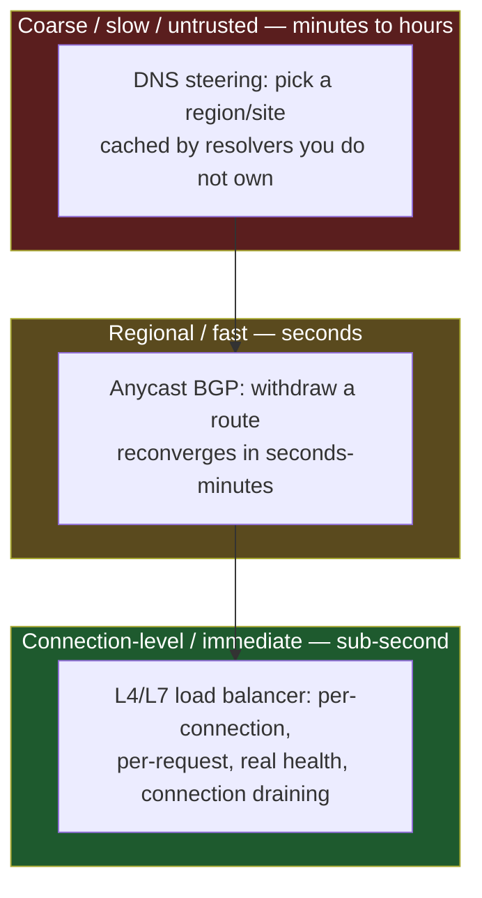
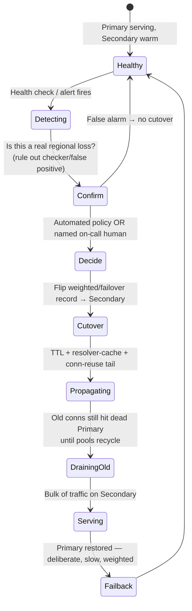

# DNS Load Balancing — Staff

> **Axis:** organizational scope & judgment — NOT deeper protocol theory. This file answers:
> when should an organization *bet* on DNS-level traffic management as a strategy, what does
> that bet cost across teams and years, why does "just lower the TTL" fail to deliver the
> failover you promised in the design review, who owns the failover decision, and when does
> DNS load balancing give you dangerous false confidence? If you take one thing from this
> file: **DNS is a traffic-steering hint, not a control plane.** Design accordingly.

## Table of Contents
1. [The Staff-Level Framing: DNS as a Coarse, Untrusted Steering Layer](#1-the-staff-level-framing-dns-as-a-coarse-untrusted-steering-layer)
2. [The Strategy Space: Steering Products vs Global LB vs Anycast+L7](#2-the-strategy-space-steering-products-vs-global-lb-vs-anycastl7)
3. [Why "Just Lower the TTL" Does Not Give You Fast Failover](#3-why-just-lower-the-ttl-does-not-give-you-fast-failover)
4. [DR Runbooks Built on DNS Failover — and Their Pitfalls](#4-dr-runbooks-built-on-dns-failover--and-their-pitfalls)
5. [Ownership of the Failover Decision: Automated Health Checks vs Human](#5-ownership-of-the-failover-decision-automated-health-checks-vs-human)
6. [Cost, Vendor Lock-In, and the Build-vs-Buy Lens](#6-cost-vendor-lock-in-and-the-build-vs-buy-lens)
7. [When DNS Load Balancing Gives False Confidence](#7-when-dns-load-balancing-gives-false-confidence)
8. [When NOT to Rely on DNS for Load Balancing](#8-when-not-to-rely-on-dns-for-load-balancing)
9. [Second-Order Consequences & the Metrics You Watch](#9-second-order-consequences--the-metrics-you-watch)
10. [Staff Checklist](#10-staff-checklist)

---

## 1. The Staff-Level Framing: DNS as a Coarse, Untrusted Steering Layer

Engineers reach for DNS load balancing because it is *free at the traffic-plane*: no bytes
flow through your infrastructure to move a client from Region A to Region B — you just hand
out a different A/AAAA record. That property is seductive and it is exactly why teams
over-trust it. The Staff job is to keep the organization honest about what DNS actually is:

- **DNS is a name→address hint given once, then cached by parties you do not control.**
  Between your authoritative server and the client sit the recursive resolver (ISP, corporate,
  8.8.8.8, 1.1.1.1), the OS stub resolver, the browser's own cache, and the connection-reuse
  layer of the app. Each honors your TTL to a different degree, or not at all.
- **DNS steers *new* lookups, not *live* connections.** It cannot drain an in-flight TCP
  connection, cannot rebalance mid-request, and cannot react within a request's lifetime.
  Its control granularity is "the next time this client resolves the name," which is minutes
  to hours in practice — not seconds.
- **DNS has no true health signal about the client's path.** Your health check says the origin
  is up *from the checker's vantage point*. It says nothing about whether *this* client's
  network path to that origin is healthy.

So the framing you carry into every design review is a hierarchy of control:



The Staff error is to let a team push a control decision *up* this hierarchy — to make DNS
responsible for something that needs second-scale or connection-scale precision. Push control
*down* whenever the SLA demands speed or per-request accuracy; use DNS only for the coarse,
slow, geographic/site-selection decisions where minutes of imprecision are tolerable.

---

## 2. The Strategy Space: Steering Products vs Global LB vs Anycast+L7

At org scale there are three broad strategies for "get the right client to the right place,"
and Staff engineers are frequently asked to pick or blend them. They are not interchangeable;
they differ on the axes that matter for a business: failover speed, control granularity, cost
model, and lock-in.

| Dimension | Managed DNS traffic-steering (Route 53 / NS1 / Akamai GTM / Azure Traffic Manager) | Global/Cross-region LB (GCP Global LB, AWS Global Accelerator, Azure Front Door) | Anycast + regional L4/L7 (self-run BGP + envoy/nginx/HAProxy) |
|---|---|---|---|
| Control granularity | Per-DNS-answer (whole client population sharing a resolver moves together) | Per-connection / per-request at the edge | Anycast per-flow at BGP; L7 per-request at the region |
| Failover trigger→effect latency | TTL + resolver-cache reality: **tens of seconds to hours** | **Sub-second to seconds** (edge reroutes live) | BGP reconverge **seconds–minutes**; L7 health **seconds** |
| Drains live connections? | No | Yes (edge holds the connection) | L7 yes; anycast reroute may reset flows on reconverge |
| Health-check fidelity | Origin-up as seen from the provider's checkers | End-to-end at the edge, close to real client path | Real per-region L7 health; anycast sees only BGP reachability |
| Cost model | Per-hosted-zone + per-million-queries + per-health-check | Data-processing $/GB through the edge (can dominate) | Capex/opex of running BGP, IP transit, edge boxes, on-call |
| Vendor lock-in | Moderate (record export is easy; *steering policies* are proprietary) | High (traffic rides their backbone; egress + config are sticky) | Low on product, high on *operational capability* (you now run a network) |
| Operational burden | Low | Low–Medium | High (peering, RPKI, DDoS scrubbing, capacity) |
| Best at | Coarse geo/latency routing, weighted rollouts, low-cost multi-region site selection | Single global anycast VIP with real failover and TLS termination at edge | Hyperscale, cost control at high egress, sovereignty over routing |

The Staff synthesis most mature orgs land on is **layered, not either/or**:

- Use **anycast or a global LB** to give clients a single, stable address whose *failover is
  fast and connection-aware*.
- Use **DNS steering** only for the decisions that are legitimately coarse and slow: which
  *geography/product-stack* to enter, weighted canary of a new region, or compliance-driven
  data residency ("EU users resolve to EU").
- Keep the **fast failover** at L4/L7 behind that address, where it belongs.

If a team is proposing DNS steering *as the failover mechanism* rather than as a
site-selection hint, that is the moment to intervene (see §3).

---

## 3. Why "Just Lower the TTL" Does Not Give You Fast Failover

This is the single most consequential misconception Staff engineers have to correct, because
it is stated confidently in design docs and it is wrong in a way that only reveals itself
during an incident — the worst possible time to learn it.

The theory: set TTL=30s, and 30 seconds after you flip the record, the world moves. The
reality is a chain of independent caches, each of which can ignore or extend your TTL:

```mermaid
sequenceDiagram
    autonumber
    participant App as App / connection pool
    participant Browser as Browser DNS cache
    participant OS as OS stub resolver
    participant Rec as Recursive resolver (ISP / public)
    participant Auth as Your authoritative NS
    App->>Browser: resolve api.example.com
    Note over Browser: may pin for minutes<br/>(Chrome ~60s+, ignores your TTL)
    Browser->>OS: (on cache miss) resolve
    Note over OS: nscd/systemd-resolved cache;<br/>TTL respected... usually
    OS->>Rec: (on cache miss) query
    Note over Rec: enforces TTL FLOOR/CAP.<br/>Many clamp to 30-300s minimum;<br/>some serve-stale on origin failure
    Rec->>Auth: (on cache miss) query
    Auth-->>Rec: A record, TTL=30
    Rec-->>OS: cached answer
    OS-->>Browser: cached answer
    Browser-->>App: address
    Note over App: connection pool REUSES old socket<br/>to the DEAD IP until pool recycles —<br/>never re-resolves for live conns
```

The failure modes stacked in that diagram, each defeating your low TTL:

1. **Resolver TTL flooring.** Many large recursive resolvers enforce a *minimum* TTL
   (commonly 30–300s, sometimes higher) to reduce their own query load. Your TTL=5 is
   silently rewritten to their floor. RFC 8767 (`serve-stale`) additionally lets resolvers
   answer with **expired** records when they cannot reach your authoritative server — which is
   *exactly* the condition present during your origin outage. The mechanism designed to
   improve resilience for users actively works against your failover.
2. **Browser and OS caches** hold their own copies with their own eviction logic. Chrome's
   internal DNS cache and pinning behavior do not simply obey your TTL.
3. **Connection reuse / keep-alive.** The deadliest one: a client with an *established* HTTP/2
   or gRPC connection to the old IP never re-resolves. DNS change is irrelevant to a live
   connection pool; it only affects the *next* cold lookup. Long-lived connections (databases,
   gRPC channels, HTTP/2 with generous keep-alive) can pin to a dead endpoint for the pool's
   entire lifetime.
4. **Low-TTL cost tax.** Even where honored, TTL=5 multiplies query volume, and on
   query-priced managed DNS that is a line-item you now pay 24/7 to buy failover you *still*
   don't fully get.

**Staff takeaway:** low TTL narrows the *tail* of your failover but does not set an upper
bound on it. If the runbook or SLA implies "DNS failover completes in T seconds," that claim
is unfounded for the long-tail of clients. Design for a *distribution* of cutover times with a
fat, resolver-and-connection-dependent tail — and put anything requiring bounded failover
behind a mechanism that can *drain live connections* (global LB / L7), not behind DNS.

---

## 4. DR Runbooks Built on DNS Failover — and Their Pitfalls

Disaster-recovery plans routinely enshrine "fail over by updating DNS" as the primary action.
It is attractive because it is one API call. Here is the runbook shape and, more importantly,
the pitfalls a Staff engineer must design out *before* the incident.



Pitfalls, each of which has caused a real prolonged outage somewhere:

- **The propagation tail is not the DR RTO you promised.** If your RTO is "5 minutes" and DNS
  is the mechanism, you have promised something you cannot deliver for a meaningful slice of
  users (see §3). Either fix the mechanism (anycast/global-LB in front) or fix the RTO number
  to reflect the true long-tail. Do not paper over the gap in the doc.
- **The secondary was never actually load-tested at 100%.** Warm-standby regions habitually
  run at a fraction of capacity. On cutover, the entire population arrives and the secondary
  falls over — you failed *into* a second outage. DR that has never carried full production
  traffic is a hypothesis, not a plan. Require periodic **full-shift game days**.
- **Split-brain on failback.** During failover the primary may not be *dead* — it may be
  *partitioned*. If it keeps taking writes while the secondary takes writes, you now have a
  data-reconciliation incident on top of the outage. DNS steering has *no awareness of data
  consistency*; the runbook must fence the old primary (revoke its DB write role, not just its
  DNS record) before cutting over.
- **The control plane you need is in the region that just died.** If your DNS-update tooling,
  credentials, or CI runner lives only in the failed region, you cannot execute the runbook.
  The DR tooling must live outside the failure domain it protects.
- **serve-stale keeps clients on the corpse.** As noted, RFC 8767 resolvers may serve the old
  address precisely because your authoritative NS or origin is unreachable — extending the tail
  during the exact scenario the runbook exists for.
- **Untested runbooks are fiction.** A runbook that has not been executed under load, by the
  people who will be paged, in the last quarter, is documentation of intent, not capability.

**Staff move:** score every DR runbook on *mechanism honesty* (does the claimed RTO match the
cutover physics?), *tested capacity* (has the target carried full load recently?), and
*data-safety fencing* (is split-brain structurally prevented, not just hoped away?).

---

## 5. Ownership of the Failover Decision: Automated Health Checks vs Human

"Who or what decides to fail over?" is an organizational question that Staff engineers own,
and it is genuinely a trade-off, not a solved problem.

**Automated failover (health check flips the record):**
- *Pro:* fast, no human-in-the-loop latency, works at 3 a.m. without paging anyone.
- *Con:* health checks lie. A checker inside the same failed network sees the origin as down
  when it is fine; a checker across a flapping link *flaps the whole population*. Automated DNS
  failover on a *noisy* signal produces **route flapping** — repeatedly cutting traffic back
  and forth, doubling the blast radius, and defeating caches with contradictory answers.
- The classic multi-region self-inflicted outage: a transient health-check blip triggers
  automated failover to a secondary that is under-provisioned (§4), which then fails, whose
  failure trips *its* health check, which fails back to a primary that is now cold — an
  oscillation no human authorized.

**Human-gated failover (health check pages; a human decides):**
- *Pro:* a human can distinguish "the checker is broken" from "the region is gone," can verify
  secondary readiness, and can weigh the split-brain/data risk before committing.
- *Con:* adds minutes of decision latency and depends on the on-call being reachable, awake,
  trained, and authorized. Under-specified ownership ("someone will notice") is how a
  10-minute incident becomes a 90-minute one.

The Staff design is usually **tiered and role-explicit**:

| Failure class | Decision owner | Rationale |
|---|---|---|
| Single instance / AZ, L7 can absorb | Fully automated at L4/L7 (not DNS) | Fast, low blast radius, connection-aware |
| Regional degradation, ambiguous signal | Automated *proposal* → human confirm | Health signal too noisy to trust blindly |
| Full regional loss / data-integrity risk | Named on-call human with runbook authority | Split-brain & capacity judgment required |

Guardrails that make automation safe enough to trust: **dampening / hysteresis** (require N
consecutive failures over a window, not one blip), **hold-down timers** (no re-flip for M
minutes after a flip), **health checks from multiple independent vantage points** with quorum
(not a single checker's opinion), and a **circuit-breaker on failover itself** (if we've
flipped X times in Y minutes, stop and page a human). And critically: name the human. "The
on-call for team X has the authority and the runbook" beats "we'll figure it out" every time.

---

## 6. Cost, Vendor Lock-In, and the Build-vs-Buy Lens

DNS steering *looks* cheap and often is — but the Staff cost lens is total cost of ownership
and reversibility, not the monthly DNS bill.

| Option | When it wins | Hidden cost / lock-in |
|---|---|---|
| Managed DNS steering (Route 53, NS1, Akamai, Traffic Manager) | Coarse geo/latency/weighted routing; small ops team; speed to ship | Per-query pricing punishes low TTLs; *steering-policy config is proprietary* — records port easily, the routing logic does not; health-check semantics differ per vendor so a migration re-tests all of DR |
| Global LB on a provider backbone (GCP GLB, Global Accelerator, Front Door) | Need real, fast, connection-aware failover with one global VIP | **Data-processing egress $/GB can dominate the bill** at scale; traffic now rides their backbone — the stickiest lock-in there is; harder to multi-cloud |
| Self-run anycast + L7 | Hyperscale where egress cost and routing sovereignty justify running a network | Requires a *standing capability*: BGP, peering, RPKI, DDoS scrubbing, 24/7 network on-call — a hiring and org commitment, not a project |

Judgment points:

- **Reversibility is the real question.** Exporting zone records is trivial (a two-way door).
  Migrating off a *global-LB backbone* or off *proprietary steering policies + health-check
  semantics* is a one-way-ish door: budget it as a multi-quarter effort and record it in the
  ADR before you adopt. Cheap-to-enter is not cheap-to-leave.
- **Low TTL is a recurring tax.** On query-priced DNS, aggressive TTLs to chase failover speed
  cost real money forever — and (§3) buy you an incomplete result. Often the cheaper *and*
  better answer is a normal TTL plus a fast L7/anycast layer.
- **Don't run a network to save on a DNS bill.** The self-run anycast path only pays off at
  hyperscale or under sovereignty constraints; below that, the standing on-call and peering
  cost dwarfs any managed-DNS savings. This is a classic over-engineering trap for ambitious
  mid-size teams.

---

## 7. When DNS Load Balancing Gives False Confidence

The danger of DNS LB is not that it fails — it is that it *appears to work in testing and
lies in production*. The false-confidence patterns Staff engineers must name explicitly:

- **"The failover test passed."** It passed *from a fresh client with an empty cache and no
  live connections* — the easiest possible case. It says nothing about the resolver-cached,
  keep-alive-pinned long tail that dominates real traffic (§3).
- **"We have multi-region, so we're HA."** Having a secondary region and having *tested,
  fenced, full-capacity, bounded-cutover* failover to it are different claims. DNS records
  pointing at two regions is HA *theater* until the cutover physics and secondary capacity are
  proven.
- **Weighted round-robin ≠ real load balancing.** DNS weighting distributes *lookups* across a
  *resolver population*, not requests across servers. One large resolver (a big ISP, a corporate
  gateway) funnels a huge, correlated slice of users behind a single cached answer. Your
  "50/50" weight can land as 80/20 in requests, and it cannot react to a server that is *up but
  overloaded* — DNS has no load signal, only up/down.
- **Health check green ≠ users happy.** The check probes `/healthz` and gets 200; meanwhile the
  region is serving 30-second latencies. DNS sees "up" and keeps steering users into the tar
  pit. DNS health is a liveness probe, not a quality-of-service signal.
- **"Anycast gives us instant failover."** Anycast failover is *BGP reconvergence*, which is
  seconds-to-minutes and can *reset in-flight flows* mid-request. It is fast relative to DNS,
  not instant, and not connection-graceful.

Naming these in design reviews is a core Staff contribution — because every one of them is a
statement a well-meaning senior engineer will make in good faith, and each one hides an outage.

---

## 8. When NOT to Rely on DNS for Load Balancing

Concrete disqualifiers. If any of these hold, DNS must **not** be your load-balancing or
failover mechanism (use it only, if at all, for coarse site selection *in front of* a real LB):

- **You need bounded, sub-minute failover (tight RTO).** The cache/connection tail (§3) makes
  DNS cutover unbounded for a slice of users. Put a global LB or anycast+L7 in front.
- **Traffic rides long-lived connections** — gRPC channels, HTTP/2 with keep-alive, database
  pools, WebSockets. These never re-resolve; DNS changes are invisible to them. You need
  connection-level draining at L4/L7.
- **You must balance by real load, not just liveness.** DNS cannot see CPU, queue depth, or
  latency; it can only route to "up." Overload protection needs an L7 LB with least-request /
  EWMA / power-of-two-choices, not DNS round-robin.
- **A large fraction of users sit behind a few big resolvers/corporate gateways.** Answer
  caching there correlates huge populations behind one cached record, wrecking both balancing
  fairness and cutover uniformity.
- **Data-consistency / split-brain risk on cutover.** DNS has zero awareness of write
  ownership. If flipping traffic could let two sites accept writes, you need explicit fencing
  (leader lease, DB role revocation) — the LB layer, not DNS, must coordinate it.
- **Per-request or session-aware routing** (sticky sessions, header/cookie routing, canary by
  user attribute). DNS answers a name once for a whole client; it cannot make per-request
  decisions. That is L7's job.

DNS *is* the right tool for: coarse geographic/latency site selection, data-residency routing,
low-frequency weighted rollouts of an entire stack, and giving a stable name that *points at* a
fast failover layer. Keep it in that lane.

---

## 9. Second-Order Consequences & the Metrics You Watch

The choice to lean on DNS LB has downstream effects that surface 6–12 months later:

- **Organizational:** teams start treating "update DNS" as the universal failover verb and stop
  investing in L7/anycast capability — so when they finally hit a case that needs bounded
  failover, they have no muscle for it. The capability atrophies precisely because DNS was "good
  enough" for the easy cases.
- **Operational:** the low-TTL query bill grows quietly; DR game days get skipped because "the
  failover is just a DNS flip"; the secondary drifts out of capacity parity unnoticed.
- **Security/availability:** authoritative DNS becomes a concentrated failure and attack
  surface — a DDoS on your NS or a registrar/DNS-provider outage takes down *everything*, and
  serve-stale then pins users to whatever was last cached. Multi-provider authoritative DNS and
  registrar-lock become Staff-mandated hygiene.

Metrics that tell you the decision is going wrong (watch these, not just "DNS is up"):

- **Observed cutover distribution**, measured at the client edge — the *P50 and especially P99*
  time from record-flip to traffic actually moving. If P99 is hours, your DNS-based RTO is a
  fiction.
- **Failover flap count** — number of automated cutovers per week; a nonzero-and-rising trend
  means noisy health checks are oscillating your traffic (§5).
- **Secondary capacity headroom under a simulated full shift** — proven, dated, from the last
  game day; not a config value someone believes.
- **Fraction of traffic on long-lived connections** — the population DNS failover *cannot*
  move; if it's large and growing, your DNS strategy is quietly decaying.
- **Authoritative-DNS provider redundancy** — single-provider is a latent total-outage risk.

---

## 10. Staff Checklist

- [ ] Decision captured as an ADR with explicit RTO/RPO and the **honest cutover physics** —
      not a wished-for "5 minutes" that the cache/connection tail cannot deliver.
- [ ] DNS is used only for *coarse* site selection; anything needing bounded or
      connection-aware failover sits behind a global LB / anycast+L7, not behind DNS.
- [ ] TTL choice justified against *both* failover benefit *and* the recurring query-cost tax;
      no assumption that low TTL alone bounds failover time.
- [ ] Failover ownership named and tiered: what is automated, what requires a human, and *who*
      that human is — with dampening, hold-down, multi-vantage quorum, and a failover
      circuit-breaker to prevent flap.
- [ ] DR runbook tested by the people who will be paged, at *full secondary capacity*, within
      the last quarter; split-brain structurally fenced (write-role revocation, not just a DNS
      flip); DR tooling lives outside the failure domain it protects.
- [ ] "When NOT to use DNS LB" section written so others don't cargo-cult it; long-lived
      connections, tight RTO, load-aware balancing, and consistency-risk cases explicitly ruled
      out.
- [ ] Authoritative DNS is multi-provider; registrar-lock enabled; serve-stale behavior
      understood as a failover *hazard*, not a feature.
- [ ] Cutover distribution (P99), flap count, and secondary headroom are instrumented and on a
      dashboard — you can prove the failover works, not just assert it.

*Next step:* [DNS Load Balancing — Interview](interview.md)
