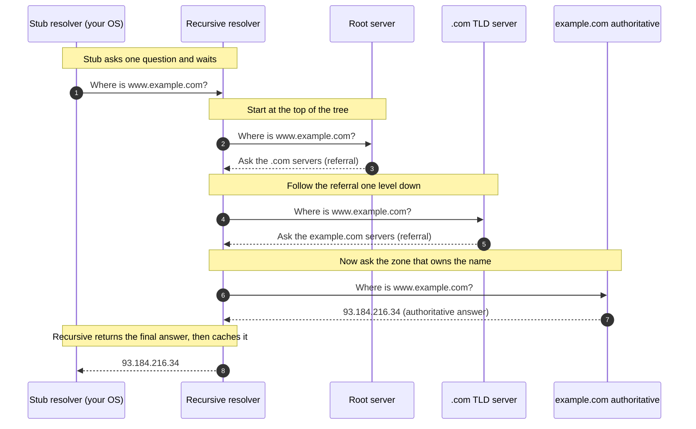

# DNS Resolution Flow — Junior

<!-- level-focus -->
At junior level, focus on this question:

> How can I apply **DNS Resolution Flow** in one small example and prove the result?

Use the smallest realistic scenario that exposes the decision and its failure behavior.
## 1. Why DNS exists

A hostname is a label; an IP address is a route. To connect to `example.com`, your machine must first learn *which* IP address serves that name. One option would be a single global file mapping every name to every address — and in fact the early internet did exactly this, distributing a file called `HOSTS.TXT`. That approach collapsed as the network grew: one file cannot be updated fast enough, cannot be owned by different organizations, and cannot scale to billions of names.

DNS replaced it with a **distributed, hierarchical, cached database**. No single machine holds all the answers. Instead, responsibility is split across many servers by the structure of the name itself, and answers are cached everywhere along the way so the same question rarely travels the full distance twice. Those three properties — distributed, hierarchical, cached — are the whole design, and everything below is a consequence of them.

## 2. The four roles

Resolution involves four kinds of participant. Keep these straight and the rest follows.

| Role | What it is | What it does |
| --- | --- | --- |
| **Stub resolver** | A small piece of code in your OS or app | Asks one question and waits for the final answer. Does no legwork itself. |
| **Recursive resolver** | A server run by your ISP, company, or a public provider (e.g. `8.8.8.8`, `1.1.1.1`) | Does the actual hunting: contacts other servers on your behalf until it has the answer. Caches heavily. |
| **Authoritative name server** | A server that holds the real records for a zone | Gives the definitive answer for the names it owns — or points you closer to who does. |
| **Root / TLD servers** | Special authoritative servers at the top of the tree | Don't know your final answer, but know *who to ask next*. |

The stub resolver is the client. The recursive resolver is the worker. The authoritative servers are the source of truth. Root and TLD servers are just authoritative servers that live near the top and mostly hand out directions.

## 3. The name hierarchy

Read a domain name **right to left** — it is a path through a tree, from most general to most specific:

```
                       . (root)
                       |
              +--------+--------+
              |                 |
             com               org        <- Top-Level Domains (TLDs)
              |
           example                        <- the zone example.com
              |
             www                          <- a host within that zone
```

- The trailing dot (`www.example.com.`) is the **root** — usually implied and left off.
- `com` is a **Top-Level Domain (TLD)**. `org`, `net`, `io`, `uk` are others.
- `example` is the domain someone registered under `com`.
- `www` is a specific host inside that domain.

Each level knows only about the level directly beneath it. The root servers don't know `example.com`'s address; they know which servers run `com`. The `com` servers don't know `www`'s address; they know which servers run `example.com`. This is delegation, and it is why no server ever needs to hold the whole internet.

## 4. A step-by-step resolution

Assume every cache is empty (a **cold** lookup) so we see the full journey. You type `www.example.com` and your browser hands it to the stub resolver.



In words:

1. **Stub → Recursive.** The stub resolver forwards the question to the configured recursive resolver and does nothing else but wait.
2. **Recursive → Root.** With no cached knowledge, the recursive resolver starts at the top and asks a root server.
3. **Root → referral.** The root doesn't know the answer but replies: *"I don't have it; the `com` servers handle names ending in `.com`."*
4. **Recursive → TLD.** The resolver follows that pointer and asks a `.com` TLD server.
5. **TLD → referral.** The `.com` server replies: *"I don't have the final answer, but the servers for `example.com` do — here they are."*
6. **Recursive → Authoritative.** The resolver asks `example.com`'s authoritative server.
7. **Authoritative → answer.** This server owns the zone and returns the real record: `93.184.216.34`. This is the **authoritative answer**.
8. **Recursive → Stub.** The resolver caches the answer and hands it back to the stub, which gives it to your browser.

The stub asked one question and got one answer. All three network round-trips down the tree happened inside the recursive resolver, invisible to you.

## 5. Recursive vs iterative queries

That walk-through used two different *styles* of query, and the difference is the crux of the whole design.

| | Recursive query | Iterative query |
| --- | --- | --- |
| **Who asks it** | Stub → recursive resolver | Recursive resolver → root, TLD, authoritative |
| **Expected reply** | The final answer, or an error | The best answer available: either the answer, or a referral to a better server |
| **Who does the work** | The server being asked | The asker (the resolver keeps chasing referrals) |
| **Analogy** | "Get me the answer." | "Tell me what you know, and where to go next." |

The stub makes a **recursive** query: "handle everything, come back only when you have the answer." The recursive resolver makes a chain of **iterative** queries: each server it contacts answers only with what it knows and, if that isn't the final answer, points one step closer. The recursive resolver is the component that turns one recursive request into many iterative ones. That is precisely why it's called *recursive*.

## 6. Referrals and glue records

When the root says "ask the `com` servers," that reply is a **referral** — a pointer to name servers one level down, given as `NS` records (the names of those servers). But a name server is itself identified by a name, e.g. `a.gtld-servers.net`. If the resolver only got that name, it would need a *second* DNS lookup just to find that server's address, and could loop endlessly.

To break the loop, the referral also ships the IP addresses of those name servers alongside the `NS` records. Those bundled addresses are called **glue records**. Glue is needed specifically when a zone's name servers live *inside* the zone they serve — for example, `ns1.example.com` being the server for `example.com`. Without glue, you'd need to resolve `ns1.example.com` to reach `example.com`, which requires reaching `example.com` first. Glue supplies the address up front and cuts the knot.

- **NS record:** the *name* of a server responsible for a zone.
- **Glue record:** the *IP address* of that server, shipped with the referral so no extra lookup is required.

## 7. Where caching enters

The cold walk-through in section 4 is the exception, not the rule. Real lookups are fast because answers are cached at several layers, and each record carries a **TTL** (time to live) — a number of seconds it may be reused before it must be fetched fresh.

Caches sit, from closest to farthest:

1. **Browser cache** — many browsers keep a short-lived cache of recent lookups.
2. **OS / stub cache** — your operating system remembers recent answers.
3. **Recursive resolver cache** — the big one. It caches final answers *and* intermediate referrals.

That third layer changes everything. Once a resolver has learned the `.com` TLD servers and `example.com`'s authoritative servers, it reuses those for every future name it resolves, not just `example.com`. So the second visitor to `example.com` — and every visitor to any `.com` site — skips most or all of the tree. A cold lookup may touch root, TLD, and authoritative; a warm lookup often gets an instant answer from the resolver's cache with zero external round-trips. TTL is the control knob: short TTLs let records change quickly (useful during migrations) at the cost of more lookups; long TTLs are faster but slower to update.

## 8. Key takeaways

- DNS translates hostnames into IP addresses using a **distributed, hierarchical, cached** database — no single server holds all names.
- Four roles: the **stub resolver** (asks), the **recursive resolver** (hunts and caches), the **authoritative servers** (own the truth), and the **root/TLD servers** (hand out directions).
- Names are read right-to-left as a path down a tree; each level delegates to the level below it.
- The **stub** makes one *recursive* query; the **recursive resolver** makes a chain of *iterative* queries down root → TLD → authoritative, following **referrals**.
- **Glue records** ship name-server IP addresses with a referral to avoid a chicken-and-egg lookup.
- **Caching** with **TTL** at the browser, OS, and (especially) the recursive resolver is why the full cold walk-through almost never happens twice.

Canonical references: [RFC 1034 — Domain Names: Concepts and Facilities](https://www.rfc-editor.org/rfc/rfc1034), [RFC 1035 — Implementation and Specification](https://www.rfc-editor.org/rfc/rfc1035), [Cloudflare Learning: What is DNS?](https://www.cloudflare.com/learning/dns/what-is-dns/).

*Next step:* [DNS Resolution Flow — Middle](middle.md)

---

## Apply it

1. Choose one small, known input for **DNS Resolution Flow**.
2. Predict the output or observable behavior.
3. Run the smallest example or probe that exercises the concept.
4. Change one input to trigger a failure or boundary case.
5. Explain the evidence using the guide's vocabulary.

## Verify your work

- Record the exact input, command or code path, and output.
- Repeat the probe and confirm the result is consistent.
- Show one expected success and one expected failure.
- Resolve any difference between the prediction and the evidence.

## Review questions

- What problem does DNS Resolution Flow solve in the example?
- Which input changes the observed result, and why?
- What is the smallest useful success check?
- Which beginner mistake would your evidence catch?
