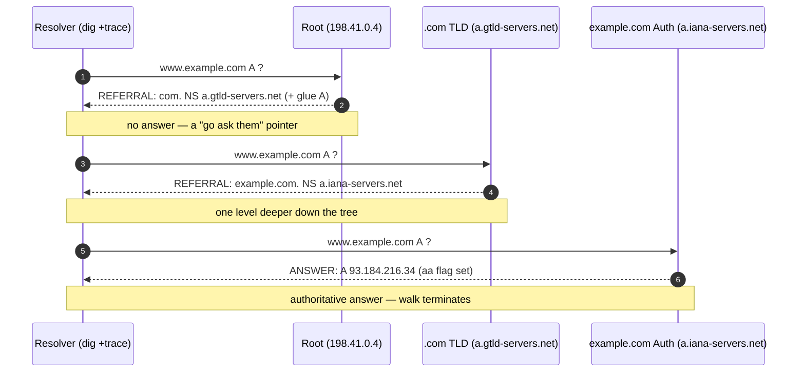

# DNS Resolution Flow — Middle

<!-- level-focus -->
At middle level, focus on this question:

> Where does **DNS Resolution Flow** belong in a maintainable component, and which trade-off selects the design?

Use the smallest realistic scenario that exposes the decision and its failure behavior.
## 1. The Actors and Where Each Query Type Lives

Four distinct roles participate in one name lookup. Confusing them is the root of most DNS misdiagnosis.

| Actor | Runs where | Query style it *sends* | Query style it *answers* | Holds a cache? |
|-------|-----------|------------------------|--------------------------|----------------|
| **Stub resolver** | Your OS / libc (`getaddrinfo`) | **Recursive** ("do the whole job for me") | Nothing | Tiny/none (OS may cache) |
| **Recursive resolver** | `8.8.8.8`, your ISP, corporate resolver | **Iterative** (walks the hierarchy) | **Recursive** (to stubs) | **Yes — the big one** |
| **Root / TLD server** | 13 root letters, `a.gtld-servers.net`… | Nothing | **Iterative** (gives referrals) | Authoritative zone only |
| **Authoritative server** | Ns for the zone (`ns1.example.com`) | Nothing | **Iterative** (gives the answer) | Authoritative zone only |

The single sentence to memorize: **the stub asks for recursion; the recursive resolver does the iteration; everyone above the recursive resolver only ever hands back a referral or the final answer, never chases anything on your behalf.** Per RFC 1034 §5, that iterative walk down the delegation tree is the resolver's job, not the authoritative servers'.

---

## 2. A Full Resolution, Traced Live with `dig +trace`

`dig +trace` makes your `dig` *become* the iterative resolver: it starts at the root hints and follows referrals itself, printing each hop. This is the single most valuable diagnostic in DNS.

```
$ dig +trace www.example.com

.            518400  IN  NS  a.root-servers.net.
             ...                                   ; (1) root NS set, from local root hints
;; Received 811 bytes from 198.41.0.4#53(a.root-servers.net)

com.         172800  IN  NS  a.gtld-servers.net.   ; (2) REFERRAL to .com TLD
a.gtld-servers.net.  172800  IN  A  192.5.6.30     ; glue for the TLD nameserver
;; Received 1174 bytes from 198.41.0.4#53(a.root-servers.net)   ; asked a root, got .com referral

example.com. 172800  IN  NS  a.iana-servers.net.   ; (3) REFERRAL to example.com's authoritative NS
;; Received 576 bytes from 192.5.6.30#53(a.gtld-servers.net)    ; asked .com, got authoritative referral

www.example.com. 86400 IN A 93.184.216.34          ; (4) ANSWER — authoritative, non-referral
;; Received 592 bytes from 199.43.135.53#53(a.iana-servers.net) ; asked authoritative, got the record
```

The staged walk:



Three things to notice every time you read a `+trace`:

1. **Each block ends with `;; Received … from <server>`** — that tells you *which server produced the block above it*. A referral block is produced by the parent; the answer block is produced by the authoritative server.
2. **`+trace` sends `+norecurse`** to every server (RD=0), which is why the root and TLD hand back referrals instead of errors — it's mimicking a real resolver.
3. **A referral has records only in the AUTHORITY (NS) and ADDITIONAL (glue) sections; a real answer has records in ANSWER.** That structural difference (next section) is how you tell them apart mechanically.

> Canonical reference: [RFC 1034 §4.3.2](https://www.rfc-editor.org/rfc/rfc1034) (resolver algorithm), and Cloudflare's [What is DNS?](https://www.cloudflare.com/learning/dns/what-is-dns/) for the lookup narrative.

---

## 3. Reading the Wire: ANSWER, AUTHORITY, ADDITIONAL, Glue

Every DNS response has four sections (RFC 1035 §4.1). Diagnosis is almost entirely about **which section a record landed in**.

| Section | Contains | In a *referral* | In a *final answer* |
|---------|----------|-----------------|---------------------|
| **QUESTION** | The name/type/class you asked | echoes your query | echoes your query |
| **ANSWER** | The records that *answer* the question | **empty** | the A/AAAA/CNAME/etc. |
| **AUTHORITY** | NS records — "who is authoritative next" | the delegated NS set | often the zone's NS set |
| **ADDITIONAL** | Helper records, primarily **glue A/AAAA** | glue for those NS | OPT/EDNS, maybe glue |

**Glue records** exist to break a chicken-and-egg loop. The `.com` servers delegate `example.com` to `ns1.example.com`. To *reach* `ns1.example.com` you'd need to resolve `example.com`… which is the thing you're trying to delegate. So the parent zone ships the **IP of `ns1.example.com` as glue** in the ADDITIONAL section. Glue is authoritative-in-the-parent but not in-the-child. You only *need* glue when the nameserver's name is **inside the zone it serves** (in-bailiwick); if `example.com` used `ns1.somewhere-else.net`, no glue is required because that address is resolvable independently.

```
;; flags: qr aa rd ra;   ; qr=response  aa=authoritative  rd=recursion-desired  ra=recursion-available
```

The **`aa` (Authoritative Answer) flag** is the single most useful bit in the header. Set → this server owns the zone and its ANSWER is canonical. Absent on a resolver's reply → the resolver served it from cache (still valid, just not first-hand).

---

## 4. Iterative vs Recursive — The Distinction That Actually Matters

This is the exam-question distinction, and it is entirely about **who does the chasing**.

| | Recursive query | Iterative query |
|---|-----------------|-----------------|
| Who sends it | Stub → recursive resolver | Recursive resolver → root/TLD/auth |
| Header `RD` bit | **1** (Recursion Desired) | **0** |
| What the responder does | Does *all* the work, returns final answer | Returns the *best it has* — usually a referral |
| Response you get | The A record (or NXDOMAIN) | A referral (NS + glue) or an answer if it's authoritative for the name |
| Failure mode if unwanted | Open resolver / amplification risk | none — this is the safe default upstream |

A recursive resolver **accepts** recursive queries (from stubs) and **emits** iterative queries (up the tree). It is the pivot between the two modes. Root and TLD servers deliberately **refuse recursion** (`ra` flag absent, `RD` ignored) — they only ever refer. An authoritative server also does no recursion; it answers for its own zone and refers/refuses everything else.

Watch the RD bit flip in practice:

```
$ dig @8.8.8.8 www.example.com          # RD=1 → resolver does the work, you get the A record
$ dig @198.41.0.4 www.example.com       # to a root: even RD=1, you get a .com REFERRAL, not the answer
$ dig +norecurse @8.8.8.8 www.example.com   # RD=0 → only served if already CACHED at 8.8.8.8
```

That last command is a caching probe — see §6.

---

## 5. The Resolver Toolbox: `dig`, `nslookup`, and Their Flags

`dig` (from BIND's `dnsutils` / `bind-tools`) is the professional's tool; `nslookup` is the ubiquitous fallback. Learn `dig`.

| Flag / usage | Effect | When you reach for it |
|--------------|--------|-----------------------|
| `dig NAME` | A record via your system resolver | quick lookup |
| `dig @SERVER NAME` | query a *specific* server | bypass your resolver; test one auth ns directly |
| `dig NAME TYPE` | e.g. `dig example.com NS`, `MX`, `AAAA`, `SOA` | inspect a specific record type |
| `+trace` | iterate from root, print every hop | diagnose *where* resolution breaks |
| `+short` | just the answer data, no headers | scripting, quick eyeballing |
| `+norecurse` | send RD=0 | cache probe / query auth servers correctly |
| `+noall +answer` | show only the ANSWER section | strip noise |
| `+nssearch` | query all of a zone's NS for its SOA | detect an out-of-sync / lame nameserver |
| `+dnssec` | request DNSSEC records (`do` bit) | validation debugging |

Read the header line first, always:

```
;; ->>HEADER<<- opcode: QUERY, status: NOERROR, id: 40312
;; flags: qr rd ra; QUERY: 1, ANSWER: 1, AUTHORITY: 0, ADDITIONAL: 1
```

- `status: NOERROR` with `ANSWER: 0` → name exists but has no record of that type (a **NODATA**, e.g. asking `AAAA` of an IPv4-only host).
- `status: NXDOMAIN` → the name does not exist at all.
- `status: SERVFAIL` → the resolver tried and failed (broken auth, DNSSEC failure, timeout). **Not** the same as NXDOMAIN — SERVFAIL is *your side couldn't complete*, NXDOMAIN is *the answer is authoritatively "no such name."*

`nslookup` equivalents when `dig` is absent:

```
nslookup -type=NS example.com          # NS records
nslookup -type=SOA example.com
nslookup example.com 8.8.8.8           # query a specific server (server goes LAST)
```

`nslookup` hides section structure and the header flags, which is exactly why it is worse for delegation debugging — you can't see `aa` or distinguish a referral cleanly.

---

## 6. Caching Entry: TTL, the Negative Cache, and `+norecurse`

The recursive resolver's cache is what keeps DNS fast. Two knobs govern how long entries live.

- **Positive TTL** — the number in the record's second column (`86400` above = 24 h). The authoritative zone sets it; every downstream cache must honor it and count down. Watch a cached TTL shrink on repeat queries against the same resolver:

  ```
  $ dig @8.8.8.8 www.example.com +noall +answer
  www.example.com.  73846  IN  A  93.184.216.34     ; not the full 86400 → already cached, aging
  $ dig @8.8.8.8 www.example.com +noall +answer
  www.example.com.  73840  IN  A  93.184.216.34     ; 6 s later, ticked down by ~6
  ```

  A **fresh authoritative** query would show the *full* TTL; a **partial, ticking** TTL means you hit a cache. This is a reliable way to tell "am I seeing cache or origin?"

- **Negative TTL** — how long a "does not exist" (NXDOMAIN) is remembered. It is the **`minimum` field of the zone's SOA record** (RFC 2308), *not* a per-record value. `dig example.com SOA` shows it as the last number in the SOA RDATA. This is why a just-created record can still return NXDOMAIN for minutes: the negative answer is cached.

**Cache probe** — is a name already cached at resolver R, without triggering a fetch?

```
$ dig +norecurse @8.8.8.8 www.example.com
```

RD=0 means "answer only from cache." A full answer → cached and warm. An empty ANSWER with an AUTHORITY section (or SERVFAIL) → not cached. This is how you verify propagation and diagnose stale entries without polluting the cache further.

---

## 7. Stub Resolver Configuration

The stub is configured at the OS level. The knobs you actually touch:

**`/etc/resolv.conf`** (the classic file; may be managed by `systemd-resolved`, `NetworkManager`, or DHCP):

```
nameserver 1.1.1.1          # recursive resolvers, tried in order
nameserver 8.8.8.8
search corp.example.com     # domains appended to unqualified names
options ndots:2 timeout:2 attempts:2
```

- **`nameserver`** — up to 3 honored by glibc; queried in listed order, next tried only on timeout/error (not on NXDOMAIN).
- **`search`** — turns `dig web` into tries for `web.corp.example.com` etc. Powerful and dangerous (see pitfall below).
- **`ndots:N`** — if a queried name has **fewer than N dots**, the `search` domains are tried *first*, before the name as-is. `ndots:5` (a Kubernetes default) is a notorious latency source: `api.github.com` (2 dots < 5) gets four failed search-domain lookups before the real one.
- **`timeout` / `attempts`** — per-server wait and retry count. Defaults (5 s × 2) are often too slow to fail over; tune for latency-sensitive services.

On `systemd-resolved` hosts, `/etc/resolv.conf` is often a symlink to a stub (`127.0.0.53`); inspect real state with `resolvectl status`. Order of name sources overall is governed by **`/etc/nsswitch.conf`** (`hosts: files dns` → `/etc/hosts` wins before DNS).

---

## 8. Field Diagnosis: Missing Glue, Lame Delegation, Split-Horizon

Three failure classes you will meet, and how each *looks in `dig` output*.

**Missing glue.** The parent delegates to an in-bailiwick nameserver (e.g. `example.com` → `ns1.example.com`) but ships **no A record in ADDITIONAL**. The resolver has an NS name it cannot reach without resolving the very zone being delegated → resolution stalls or SERVFAILs. Symptom in `+trace`: a referral whose ADDITIONAL section lacks the glue for the named NS.
```
;; got referral to ns1.example.com but ADDITIONAL has no A/AAAA for it → suspect missing glue
```
Fix: register glue (host records) at the registrar/parent zone.

**Lame delegation.** The parent points to a nameserver that **does not actually serve the zone** — it responds but without the `aa` flag, or with REFUSED/SERVFAIL for a zone it's supposed to own. The delegation "lies." Detect it by querying each listed NS *directly*:
```
$ dig +norecurse @ns1.example.com example.com SOA
;; ->>HEADER<<- status: REFUSED         ; ← lame: this ns doesn't serve the zone it's delegated
```
`dig +nssearch example.com` sweeps all NS at once — a lame or out-of-sync server stands out (different serial, no SOA, or error). Lame delegations cause intermittent SERVFAILs because the resolver may pick a good NS one time and the lame one the next.

**Split-horizon (split-brain) DNS.** The same name resolves **differently by source IP** — internal clients get a private RFC 1918 address, external clients get a public one. Not a bug; a deliberate design (internal vs external views). It becomes a *pitfall* when you debug from the wrong vantage point: querying `8.8.8.8` returns the public IP, but the app on a corporate host got the internal one. Diagnose by comparing:
```
$ dig @<internal-resolver> app.example.com    # 10.x.x.x  → internal view
$ dig @1.1.1.1            app.example.com      # 203.0.x.x → external view
```
If they differ, you have split-horizon — reproduce the client's *actual* resolver, not a public one.

---

## 9. Checklist and Pitfalls

**Operational checklist for "DNS is broken":**

1. `dig +trace NAME` — find *which hop* fails (root → TLD → auth). Read the `;; Received from` line at each block.
2. Read the header: `NOERROR`/`NXDOMAIN`/`SERVFAIL`/`NODATA` — they mean different things.
3. Query the authoritative servers **directly** with `+norecurse` and check the `aa` flag. No `aa` from a server that should own the zone → lame delegation.
4. Compare TTLs (full vs ticking) to know cache-vs-origin; use `+norecurse @resolver` as a cache probe.
5. If results differ by client, suspect **split-horizon** — reproduce from the client's real resolver.

**Pitfalls that bite everyone once:**

- **`+trace` bypasses your resolver's cache** — it resolves fresh from root. Great for "is the *authoritative* data correct," useless for "why is *my resolver* serving stale."
- **`ndots` surprises** — a Kubernetes-default `ndots:5` turns every external lookup into several failed search-domain queries first; fully-qualify with a trailing dot (`github.com.`) to skip the search list.
- **Trailing dot matters.** `example.com` may get `search` domains appended; `example.com.` (FQDN, trailing dot) is queried exactly as written.
- **NXDOMAIN vs SERVFAIL confusion** — NXDOMAIN is an authoritative "no such name" (cached per SOA minimum); SERVFAIL is "resolution failed" and is *not* cached the same way. Treating a transient SERVFAIL as "record deleted" sends you down the wrong path.
- **Negative cache is SOA-driven** — a new record can still NXDOMAIN for the SOA `minimum` seconds even after it's published. Check `dig example.com SOA` before assuming "it didn't propagate."
- **Glue only matters in-bailiwick** — chasing a "missing glue" theory for an out-of-zone nameserver wastes time; no glue is expected there.

> References: [RFC 1034](https://www.rfc-editor.org/rfc/rfc1034) / [RFC 1035](https://www.rfc-editor.org/rfc/rfc1035) (DNS core), [RFC 2308](https://www.rfc-editor.org/rfc/rfc2308) (negative caching), [MDN: DNS](https://developer.mozilla.org/en-US/docs/Glossary/DNS), [Cloudflare Learning: DNS](https://www.cloudflare.com/learning/dns/what-is-dns/).

*Next step:* [DNS Resolution Flow — Senior](senior.md)

---

## Apply it

1. Find a real component where **DNS Resolution Flow** affects an interface or dependency.
2. Write two plausible choices and the constraint that favors each one.
3. Make the smallest reversible change at that boundary.
4. Exercise the component alone, then exercise the integrated flow.
5. Keep the decision note with the evidence that selected the option.

## Verify your work

- A focused check proves the local behavior.
- An integrated check proves callers and dependencies still agree.
- Logs, traces, compiler output, or benchmarks expose the boundary.
- Reverting the change restores the previous behavior without unrelated edits.

## Review questions

- Which boundary is most affected by DNS Resolution Flow?
- What constraint would make you choose the alternative design?
- How would you isolate a local defect from an integration defect?
- What evidence shows that the change remains maintainable?
