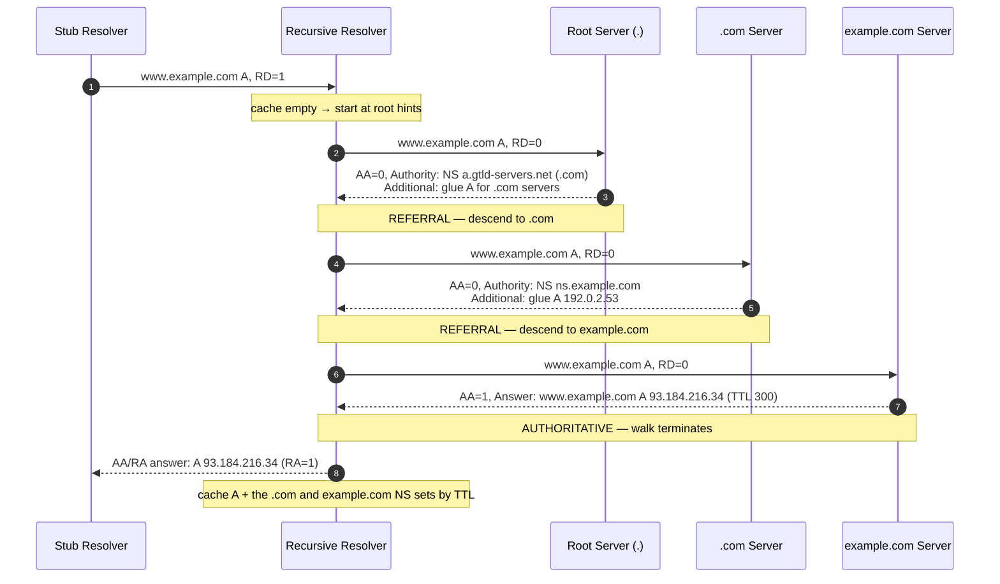

# DNS Resolution Flow — Professional

<!-- level-focus -->
At professional level, focus on this question:

> How should teams adopt and operate **DNS Resolution Flow** with measurable outcomes and limited coordination?

Use the smallest realistic scenario that exposes the decision and its failure behavior.
---

## 1. The DNS Message: One Format for Everything

DNS defines exactly **one** message format (RFC 1035 §4). A query and its response are the same
structure; a request from a stub resolver, an iterative query to a root server, and a zone-less
referral all share the identical five-section layout. The distinction between "query" and
"response" is a single header bit (`QR`), and the distinction between a referral and an answer is
*which section* the records land in — not a different packet type.

```text
+---------------------+
|        Header       |  12 octets, fixed
+---------------------+
|       Question      |  QDCOUNT entries (usually 1)
+---------------------+
|        Answer       |  ANCOUNT resource records (RRs)
+---------------------+
|      Authority      |  NSCOUNT resource records
+---------------------+
|      Additional     |  ARCOUNT resource records (incl. OPT pseudo-RR)
+---------------------+
```

Everything after the header is a sequence of **resource records** in a uniform TLV-ish encoding.
The header's four count fields (`QDCOUNT`, `ANCOUNT`, `NSCOUNT`, `ARCOUNT`) tell the parser how
many records live in each section; there are no length prefixes on the sections themselves, so a
parser walks records sequentially and must decode each name to know where the next record begins.
This "you must parse to know the length" property is why DNS parsers are a perennial source of
CVEs — a malformed name can desynchronize the whole walk.

---

## 2. Header Section — Flags and Codes

The 12-octet header is the control plane of a DNS message. Layout (RFC 1035 §4.1.1):

```text
                                1  1  1  1  1  1
  0  1  2  3  4  5  6  7  8  9  0  1  2  3  4  5
+--+--+--+--+--+--+--+--+--+--+--+--+--+--+--+--+
|                      ID                       |   16-bit query identifier
+--+--+--+--+--+--+--+--+--+--+--+--+--+--+--+--+
|QR|   Opcode  |AA|TC|RD|RA| Z|AD|CD|   RCODE   |
+--+--+--+--+--+--+--+--+--+--+--+--+--+--+--+--+
|                    QDCOUNT                     |
+--+--+--+--+--+--+--+--+--+--+--+--+--+--+--+--+
|                    ANCOUNT                     |
+--+--+--+--+--+--+--+--+--+--+--+--+--+--+--+--+
|                    NSCOUNT                     |
+--+--+--+--+--+--+--+--+--+--+--+--+--+--+--+--+
|                    ARCOUNT                     |
+--+--+--+--+--+--+--+--+--+--+--+--+--+--+--+--+
```

The `ID` is a 16-bit transaction identifier the client picks and the server echoes; combined with
the source port it is the only thing binding a response to a query over connectionless UDP — which
is precisely why off-path spoofing (Kaminsky, 2008) targeted its low entropy, and why 0x20 and
source-port randomization exist (§9).

| Field | Bits | Meaning | Notes |
|-------|------|---------|-------|
| **QR** | 1 | 0 = query, 1 = response | Same packet layout either way |
| **Opcode** | 4 | 0 = QUERY, 1 = IQUERY (obsolete), 2 = STATUS, 4 = NOTIFY, 5 = UPDATE | Standard lookups are Opcode 0 |
| **AA** | 1 | Authoritative Answer | Set only by a server authoritative for the QNAME's zone; **meaningless on a recursor's cached answer** |
| **TC** | 1 | TrunCation | Response exceeded the transport's size limit; ask again over TCP (§6) |
| **RD** | 1 | Recursion Desired | Set by the client; asks the server to resolve fully rather than refer |
| **RA** | 1 | Recursion Available | Set by the server; advertises whether it *will* recurse |
| **Z** | 1 | Reserved, must be 0 | |
| **AD** | 1 | Authentic Data (DNSSEC, RFC 4035) | Recursor asserts the answer validated |
| **CD** | 1 | Checking Disabled (DNSSEC) | Client asks recursor to skip validation and return raw data |
| **RCODE** | 4 | Response code | Extended to 12 bits by EDNS0's OPT record (§6) |

The interplay of `RD`/`RA` defines the two roles. A stub resolver sends `RD=1` to its configured
recursor. An authoritative server typically answers `RA=0` and, crucially, ignores `RD` — it
returns what it knows for its zones and **refers** for everything else. A recursive resolver
querying *upward* toward the roots sends `RD=0` because it wants referrals, not recursion, so that
*it* drives the walk.

**RCODE values** (4-bit base; EDNS0 adds a high byte to reach 12 bits):

| RCODE | Name | Meaning |
|-------|------|---------|
| 0 | NOERROR | Success (may still be an empty/NODATA answer) |
| 1 | FORMERR | Server could not interpret the query |
| 2 | SERVFAIL | Server failed — often a downstream/DNSSEC failure; safe to retry another server |
| 3 | NXDOMAIN | The queried name does **not exist** (authoritative negative) |
| 4 | NOTIMP | Opcode not implemented |
| 5 | REFUSED | Policy refusal (e.g., recursion not offered to this client) |
| 16 | BADVERS | EDNS version not supported (encoded in OPT, RFC 6891) |

A subtle but load-bearing distinction: **NXDOMAIN** ("name does not exist") is *not* the same as
**NOERROR with ANCOUNT=0** ("name exists but has no record of this type" — *NODATA*). A stub that
conflates them will, for example, treat "host exists but has no AAAA" as "host does not exist" and
skip a perfectly good A record.

---

## 3. Question, Answer, Authority, Additional Sections

**Question section** (RFC 1035 §4.1.2) — repeated `QDCOUNT` times, though in practice always 1:

```text
QNAME   : the domain name, label-encoded (see §4)
QTYPE   : 16-bit query type (A=1, NS=2, CNAME=5, SOA=6, PTR=12, MX=15,
          TXT=16, AAAA=28, SRV=33, OPT=41, HTTPS=65, ANY=255)
QCLASS  : 16-bit class (IN=1 for Internet; CH, HS are historical)
```

**Answer / Authority / Additional** each carry **resource records** in the identical RR format:

```text
NAME     : owner name (label-encoded, usually a compression pointer, §4)
TYPE     : 16-bit RR type
CLASS    : 16-bit class (IN)
TTL      : 32-bit signed seconds the record may be cached
RDLENGTH : 16-bit length of RDATA in octets
RDATA    : TYPE-specific payload (4 octets for A, 16 for AAAA, a name for NS/CNAME, ...)
```

The **sections encode the answer's *nature***, and reading them correctly is the whole game for a
resolver:

| Section | Contains | Resolver interpretation |
|---------|----------|-------------------------|
| **Answer** | RRs that directly answer the QNAME/QTYPE | Terminal data — cache it, hand it up |
| **Authority** | NS RRs for the zone that *should* be consulted next | A **referral**: "I'm not authoritative; ask these name servers" |
| **Additional** | Glue A/AAAA for the Authority NS names; OPT pseudo-RR | Avoids a chicken-and-egg lookup for the referred servers' addresses |

A referral response has **`AA=0`, empty Answer, NS records in Authority, and glue in Additional**.
An authoritative answer has **`AA=1` and the data in Answer**. This is why "which section" *is* the
protocol semantics: the same RR type (NS) means "delegation" in Authority but could be data in
Answer if you actually queried `QTYPE=NS`.

**Glue records** deserve special note. If `ns1.example.com` is a name server *for* `example.com`,
you cannot resolve `ns1.example.com`'s address without already being inside `example.com` — a
circular dependency. The parent zone (`.com`) therefore ships the A/AAAA of `ns1.example.com` as
**glue** in the Additional section of its referral, breaking the cycle.

---

## 4. Name Encoding and Message Compression

A domain name on the wire is a sequence of **length-prefixed labels** terminated by a zero-length
label (the root):

```text
www.example.com  ->  03 'w' 'w' 'w'  07 'e' 'x' 'a' 'm' 'p' 'l' 'e'  03 'c' 'o' 'm'  00
                     |__len 3__|      |________len 7__________|       |__len 3__|     root
```

Each label is prefixed by a length octet. The **top two bits of that octet are a type escape**:

| Top 2 bits | Meaning |
|------------|---------|
| `00` | Normal label; low 6 bits = label length (0–63) |
| `11` | **Compression pointer**; low 14 bits = offset into the message |
| `01`, `10` | Reserved (originally EDNS extended labels, deprecated) |

**Message compression** (RFC 1035 §4.1.4) exploits the fact that names repeat heavily within a
single message (every RR in `example.com`'s answer shares the `example.com` suffix). Instead of
re-encoding a suffix, a name may end with a **pointer**: two octets `11xxxxxx xxxxxxxx` whose low
14 bits are a byte offset from the start of the message, pointing at where that suffix was already
written. Because the offset is 14 bits, compression pointers cannot reference beyond byte 16,383 —
a real constraint in large messages.

```text
First occurrence (offset 12):   ... 07 example 03 com 00 ...
Later occurrence (www prefix):  03 'w''w''w'  C0 0C
                                 |__label__|  |__pointer to offset 12 (0x0C)__|
```

Two rules a correct parser must enforce, both historically abused:

1. **Pointers must point backward** (to an already-parsed offset). A forward or self-referential
   pointer creates a decompression loop; parsers must bound pointer-following (or detect cycles) or
   an attacker crashes them with a crafted packet.
2. **A name is at most 255 octets** *decompressed*. A compressed name that expands past 255 octets
   is malformed. Failing to check the *expanded* length is a classic amplification/DoS vector.

Compression applies only to names in well-known RDATA (NS, CNAME, MX, PTR, SOA, ...). For record
types defined after RFC 3597, compression in RDATA is **forbidden** so that a resolver can copy
unknown RDATA verbatim without understanding it.

---

## 5. Label and Format Constraints (RFC 1035 §2.3.4)

The hard size limits, quoted from RFC 1035 §2.3.4 "Size limits":

| Object | Limit | Why |
|--------|-------|-----|
| **label** | 63 octets | Length is 6 usable bits (top 2 are the type escape, §4) → max 63 |
| **name** | 255 octets | Total wire length including length octets and the final root `00` |
| **TTL** | positive 32-bit (< 2³¹) | RFC 2181 §8: treat the high bit as a wrap and clamp; values ≥ 2³¹ SHOULD be taken as 0 |
| **UDP message** | 512 octets (classic) | RFC 1035 §4.2.1; raised via EDNS0 (§6) |

The **name** limit of 255 octets is the *total encoded length*: every label's length octet counts,
plus the terminating root octet. Practically this means the maximum FQDN is a handful of labels
shorter than 255 characters of text, because each label costs one extra length byte.

**Preferred name syntax** (RFC 1035 §2.3.1) restricts labels to letters, digits, and hyphens (LDH),
not starting or ending with a hyphen. But the protocol itself is **8-bit clean and case-preserving
but case-insensitive** for comparison (RFC 1035 §2.3.3, refined by RFC 4343): a name server MUST
compare labels case-insensitively yet SHOULD preserve the case it received. Internationalized names
are handled *above* DNS by Punycode/IDNA (`xn--` A-labels), so the wire protocol still sees only
LDH. The 8-bit-clean-but-case-insensitive property is exactly what 0x20 encoding (§9) weaponizes for
anti-spoofing.

RFC 2181 §5 further clarifies **RRSet semantics**: all records of the same name/type/class form an
RRSet that is atomic — a resolver must not return a partial RRSet, and all members share caching
behavior. RFC 2181 §5.2 also settles that TTLs within one RRSet must be equal.

---

## 6. Transport: UDP, the 512-Byte Limit, EDNS0, and TCP Fallback

DNS runs over **UDP port 53** for the common case and **TCP port 53** for large responses and zone
transfers. Classic DNS (RFC 1035 §4.2.1) caps a UDP message at **512 octets**. When an authoritative
answer would exceed the negotiated UDP size, the server returns as much as fits and sets the **`TC`
(truncation) bit**; a well-behaved resolver then **retries the entire query over TCP**, where the
message is prefixed with a 2-octet length field and can be up to 65,535 octets.

**EDNS0 (RFC 6891)** — "Extension Mechanisms for DNS" — is the escape hatch from 512 bytes and from
the cramped header. It works by placing a pseudo-resource-record of **TYPE=OPT (41)** in the
Additional section. The OPT record repurposes the RR fields:

```text
NAME     : root (empty) — OPT has no owner name
TYPE     : 41 (OPT)
CLASS    : requestor's UDP payload size (e.g., 1232 or 4096) — NOT a class
TTL      : packed field:
             high byte   = EXTENDED-RCODE (upper 8 bits of the 12-bit RCODE)
             next byte   = EDNS VERSION (0)
             low 16 bits = flags, incl. DO (DNSSEC OK) bit
RDLENGTH : length of options
RDATA    : sequence of {OPTION-CODE, OPTION-LENGTH, OPTION-DATA} (e.g., ECS, cookies, padding)
```

So EDNS0 simultaneously: (a) **advertises a larger UDP buffer** so servers can send bigger UDP
responses without truncation, (b) **extends the 4-bit RCODE to 12 bits** (enabling BADVERS=16 and
DNSSEC/TSIG codes), (c) signals **DNSSEC support** via the DO bit, and (d) carries **options** like
EDNS Client Subnet, DNS Cookies (anti-spoofing), and padding (for DoT/DoH privacy).

The modern default advertised buffer is **1232 octets** (DNS Flag Day 2020 guidance) — chosen to
stay under the smallest expected path MTU minus IPv6 + UDP headers, avoiding IP fragmentation, which
is both a reliability hazard and a spoofing vector.

| Property | Classic UDP | UDP + EDNS0 (RFC 6891) | TCP fallback |
|----------|-------------|------------------------|--------------|
| Max message size | 512 octets | requestor-advertised (commonly 1232, up to 65535) | 65,535 octets (2-byte length prefix) |
| RCODE space | 4 bits (0–15) | 12 bits (via OPT high byte) | 4 bits unless OPT also present |
| Handshake cost | none (connectionless) | none (OPT rides in the same packet) | 3-way TCP handshake (+ TLS for DoT) |
| Trigger to use | default | default when OPT present | `TC=1`, or response `> ` advertised size, or AXFR/IXFR |
| Fragmentation risk | low (small) | **avoided by design** with 1232 | none (stream) |
| DNSSEC / big RRSIG | often truncates → TCP | fits many, DO bit set | always fits |

The decision flow a resolver runs on the transport: send UDP with EDNS0 buffer B; if the reply has
`TC=1` (or the reply doesn't fit and the server signaled truncation), **discard the truncated body
and re-issue over TCP**. Never parse a truncated answer as if complete — the `TC` bit means "what
you got is incomplete."

---

## 7. The Iterative Referral Algorithm

A **recursive resolver** turns a stub's single `RD=1` query into a walk *down the delegation tree*,
starting at the root, following NS referrals until it reaches an authoritative server that answers
with `AA=1`. The resolver's own queries carry `RD=0` — it wants referrals so *it* keeps control and
can cache every intermediate delegation.

The algorithm, precisely (this is the classic RFC 1034 §5.3.3 resolver loop):

```text
resolve(QNAME, QTYPE):
  SLIST := best-known name servers for the closest enclosing zone in cache
           (fall back to the hard-coded root hints if nothing better)
  loop:
    NS := pick a server from SLIST (by RTT / health)
    RESP := query(NS, QNAME, QTYPE, RD=0)      # iterative query

    if RESP has AA=1 and Answer contains QTYPE:      # authoritative data
        cache Answer (honor TTLs); return Answer
    else if RESP.Answer contains a CNAME:            # alias
        QNAME := CNAME target; restart loop (bounded to avoid CNAME loops)
    else if RESP.RCODE == NXDOMAIN:                  # authoritative "no such name"
        cache negative (SOA MINIMUM / TTL); return NXDOMAIN
    else if RESP.Authority contains NS (referral):   # delegation downward
        SLIST := NS set from Authority
        fill SLIST addresses from Additional glue; resolve missing glue if needed
        continue                                     # descend one level
    else if RESP.RCODE == SERVFAIL or timeout:
        mark NS bad; try next server in SLIST; if none left, return SERVFAIL
```

Worked example — resolve `www.example.com A`, cold cache:



Three correctness subtleties every implementation must handle:

- **Bailiwick checking.** A resolver must **reject out-of-bailiwick glue/records**. When the `.com`
  server refers you to `ns.example.com` with glue, that glue is trusted only *within* `.com`'s
  authority. A malicious authoritative server injecting an A record for `www.bank.com` into the
  Additional section of an unrelated referral must be discarded — accepting it is cache poisoning.
- **CNAME chasing and loop bounds.** A CNAME in the Answer restarts resolution at the target; the
  resolver must bound the chain length to prevent infinite CNAME/DNAME loops.
- **Negative caching (RFC 2308).** NXDOMAIN and NODATA are cached using the **SOA MINIMUM / SOA TTL**
  of the authoritative zone, so a resolver does not re-walk the tree for every miss.

---

## 8. QNAME Minimization (RFC 7816)

The naive iterative algorithm in §7 leaks the **full QNAME to every server on the path**. When the
resolver asks a *root* server for `www.example.com A`, the root learns the entire name even though
it only needs to return the `.com` referral — the root has no business knowing you wanted
`www.example.com`. This is a privacy leak: every upstream authoritative sees the complete name and
type of your lookups.

**QNAME minimization (RFC 7816, updated by RFC 9156)** fixes this by sending each server only the
**minimal name it needs to produce the next referral** — one label deeper than the zone cut you are
querying, and using `QTYPE=NS` (or `A`) rather than revealing the real type.

| Step | Naive query (to server) | Minimized query (to server) |
|------|-------------------------|-----------------------------|
| To root `.` | `www.example.com A` | `com NS` |
| To `.com` | `www.example.com A` | `example.com NS` |
| To `example.com` | `www.example.com A` | `www.example.com A` (now at the authoritative zone) |

The resolver reveals the full `QNAME`/`QTYPE` **only to the server that is actually authoritative for
it**. Practical caveats RFC 9156 addresses: some authoritative servers mis-handle `NS` queries for
non-apex names (returning NXDOMAIN incorrectly for "empty non-terminals"), so implementations must
fall back gracefully and cap the number of iterations to avoid amplification against
one-label-per-query pathological zones. The net effect: strictly less information disclosed, at the
cost of possibly more round trips on a cold cache.

---

## 9. 0x20 Encoding — Entropy in the Query Name

Over UDP, the only fields binding a response to a query are the 16-bit `ID`, the source port, and the
question tuple. That is roughly **16 + ~16 bits** of entropy an off-path attacker must guess to
inject a forged answer before the real one arrives (the Kaminsky attack drove exactly this race).
**0x20 encoding** (the "DNS-0x20" draft, widely deployed) mines *free* additional entropy from a
property of the wire format established in §5: **names are case-insensitive for matching but
case-preserving on the wire**.

The resolver **randomizes the case of each letter** in the outgoing QNAME:

```text
Sent by resolver:   wWw.eXAMple.CoM   A
Authoritative echo: wWw.eXAMple.CoM   A   (case MUST be preserved in the echoed Question)
Attacker's guess:   www.example.com   A   (wrong case → rejected)
```

Because a compliant server (RFC 4343 case-insensitive comparison) still matches the query but echoes
the Question section **byte-for-byte**, the resolver can reject any response whose QNAME case does
not match what it sent. An off-path attacker who cannot observe the query must now also guess the
case pattern — roughly one extra bit per letter in the name, multiplying the spoofing search space
by ~2^(number of letters). For `example.com` that is ~10 letters → ~1000× harder to spoof, at zero
protocol cost. It composes with (does not replace) source-port randomization, and is subsumed by but
still complementary to DNSSEC (which cryptographically authenticates the data itself).

---

## 10. Putting It Together: Bytes on the Wire

The resolver state machine, viewed as transitions rather than a call trace:

The professional's mental checklist when reading a real packet capture:

- **Header first.** `QR`, `AA`, `TC`, `RD`/`RA`, `RCODE` tell you *what kind* of message this is
  before you read a single record. `AA=0` + NS in Authority = referral, full stop.
- **Trust the sections, not the RR types.** NS in Authority is a delegation; the same type in Answer
  is data. Additional carries glue and the OPT pseudo-RR — never mistake OPT for real data.
- **Watch the transport.** A `TC=1` answer is *incomplete*; parsing it as final is a bug. An absent
  OPT record means you are back to a 512-byte, 4-bit-RCODE world.
- **Enforce the limits.** 63-octet labels, 255-octet decompressed names, backward-only compression
  pointers with cycle detection, RFC 2181 TTL clamping — every one of these is a historical CVE.
- **Verify provenance.** Bailiwick-check glue, honor 0x20 case echo, minimize QNAMEs, and treat
  NXDOMAIN ≠ NODATA. These are the difference between a resolver that is merely functional and one
  that is correct and safe.

Master these and DNS stops being a black box: it becomes a small, precisely specified state machine
walking a delegation tree, whose every byte you can predict and defend.


---

## Apply it

1. Define the user or business outcome that **DNS Resolution Flow** should improve.
2. Assign one owner for code, contracts, operations, and incidents.
3. Split delivery into reversible increments that produce evidence early.
4. Publish responsibilities, escalation paths, and compatibility windows.
5. Stop or expand only when the agreed measures support that decision.

## Verify your work

- Each increment has an owner, rollback path, and observable exit condition.
- Adoption, reliability, delivery time, and coordination cost are measured.
- Incident and migration exercises prove that responsibility is executable.
- The old path is removed only after telemetry proves it is unused.

## Review questions

- Which measurable outcome justifies investing in DNS Resolution Flow?
- Which team owns the full lifecycle and incident response?
- What reversible increment produces the earliest useful evidence?
- Which exit condition proves that migration or adoption is complete?
