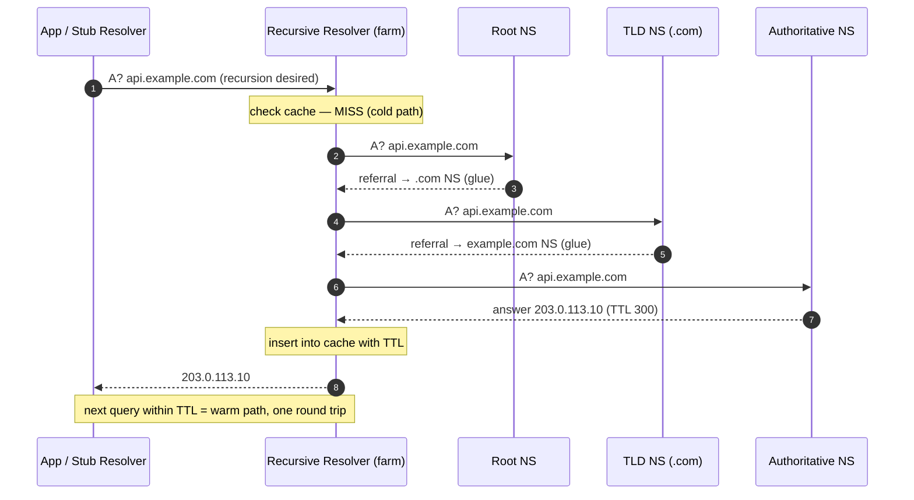
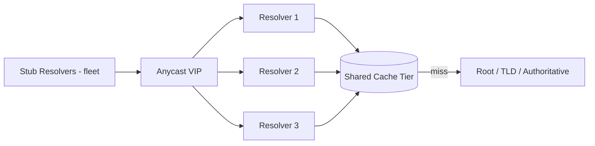
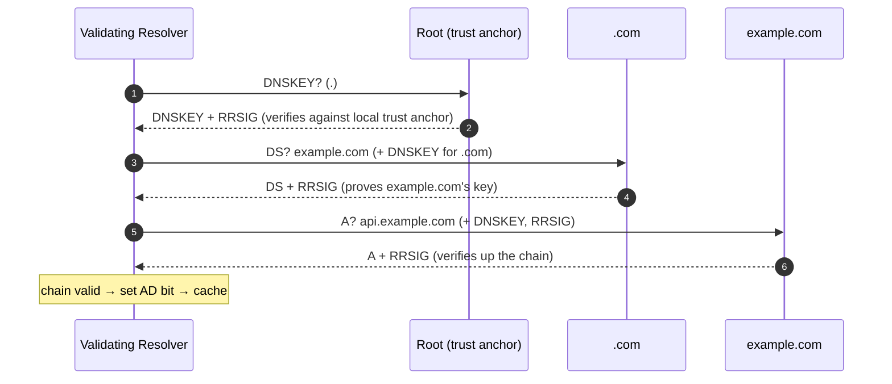
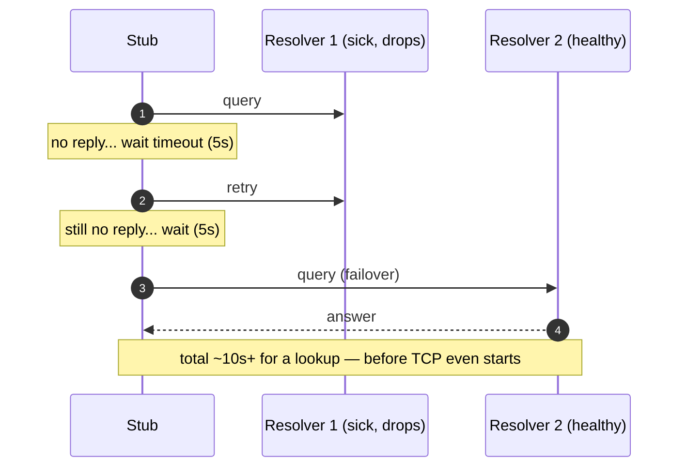

# DNS Resolution Flow — Senior

<!-- level-focus -->
At senior level, focus on this question:

> Which system invariant is affected by **DNS Resolution Flow** under failure, load, and change?

Use the smallest realistic scenario that exposes the decision and its failure behavior.
## 1. Responsibilities at This Level

At senior level you are not "using DNS" — you own the behavior of the resolution path
under load and under failure. Concretely:

- Choose and justify the **stub → recursive** topology (do you run a resolver farm, forward
  to a managed resolver like `1.1.1.1` / `8.8.8.8`, or run full recursion on-box?).
- Define **SLOs for resolution latency** (p50/p99 of the resolver, and separately the p99 of
  *cold* resolutions that hit the authoritative chain), and the cache-hit-ratio target that
  underpins them.
- Understand and defend against the **cache-poisoning surface** (source-port randomization,
  0x20 encoding, DNSSEC) and know the residual risk each leaves.
- Know exactly how a **timeout in the resolution path** propagates into connection setup and
  therefore into the tail latency and error rate of every service that dials by name.
- Reason about the operational blast radius: a resolver farm outage takes down *name
  resolution for everything*, which is a wider blast radius than any single application DB.

The single most important senior insight: **DNS is on the critical path of the very first
byte of nearly every request, but it is invisible in most application traces.** Owning it
means making it observable and bounded.

---

## 2. The Resolution Path as a System

The canonical flow (RFC 1034/1035) has four distinct actors. The **stub resolver** (the OS
`getaddrinfo` / library) is dumb: it asks one question and expects the full answer. The
**recursive resolver** does the work — it either has the answer cached or it walks the
delegation chain: root → TLD → authoritative.



Two properties fall out of this structure and drive every design decision downstream:

1. **The stub does one RTT to the resolver; the resolver may do three or more.** All the
   variance lives at the resolver. That is why we cache aggressively and why resolver
   placement (network distance from your app) dominates warm-path latency.
2. **TTL is the only knob the authoritative side gives you.** Low TTLs (30–60s) buy fast
   failover and traffic-steering agility at the cost of a lower cache-hit ratio and more
   cold-path resolutions. High TTLs (hours) maximize cache hits but make you slow to move
   traffic during an incident. Owning DNS means owning this trade-off *per record*, not
   globally.

---

## 3. Forwarding vs Full Recursion

A resolver can answer a query in two fundamentally different ways, and choosing between them
is the first architectural decision.

- **Full recursion:** the resolver itself walks root → TLD → authoritative. It needs outbound
  UDP/53 (and TCP/53, and increasingly 443 for DoH) to the whole internet, plus a primed root-hints
  file. It has no upstream dependency — but it must maintain its own cache and pays the full
  cold-path cost on every miss.
- **Forwarding:** the resolver forwards the query to an upstream recursive (a cloud resolver,
  or a central resolver farm). It has a smaller cache footprint, benefits from the upstream's
  much larger shared cache (higher hit ratio → fewer cold paths for *you*), but it inherits the
  upstream's availability and its poisoning posture, and adds a network hop.

| Dimension | Forwarding resolver | Full recursive resolver |
|---|---|---|
| Upstream dependency | Yes — the forwarder is a SPOF/blast-radius | None (talks to root/TLD/auth directly) |
| Cache hit ratio | Higher (shares upstream's huge cache) | Lower per-node (only your own traffic) |
| Cold-path latency | 1 hop to upstream + upstream's walk | Full 3+ hop walk yourself |
| Egress firewall surface | Small (one upstream target) | Large (must reach the whole internet on 53/443) |
| Failure blast radius | Upstream down ⇒ all resolution fails | Root/TLD reachability issues only |
| DNSSEC validation | Often delegated to upstream (you trust the AD bit) | You validate locally (stronger, more CPU) |
| Traffic control / logging | Centralized at forwarder | Distributed; harder to aggregate |
| Best for | Branch offices, edge nodes, most app fleets | Central resolver farms, high-security zones |

The common production pattern is **both, layered**: on-host stub → per-cluster caching
*forwarder* (e.g., a sidecar or node-local cache like a caching-only resolver) → central
resolver farm doing full recursion with DNSSEC validation. The node-local cache absorbs the
warm path in microseconds and shields the farm from a thundering herd; the farm centralizes
the cold path, validation, and observability.

---

## 4. Cold Path vs Warm Path Latency

The single most useful mental model for owning DNS latency is the **cold/warm split**.

- **Warm path:** the record is in cache and unexpired. Cost = one RTT from stub to resolver
  plus a hash lookup. On a node-local cache this is **sub-millisecond**; to a nearby farm,
  **~1–5 ms**.
- **Cold path:** cache miss. The resolver walks the delegation chain. Each level is a fresh
  UDP round trip to a server that may be geographically distant and may itself be cold. A
  three-level walk (root, TLD, auth), each ~30–80 ms, plus any CNAME chasing, easily reaches
  **100–300 ms** — and that is *before* your TCP+TLS handshake even starts.

Senior consequences:

- **Cache-hit ratio is your latency lever, and it is a function of TTL × request diversity.**
  A fleet hammering ten hostnames at TTL 300 lives almost entirely on the warm path. A crawler
  touching millions of distinct names lives on the cold path and *cannot* be cached away — for
  it, resolver placement and prefetch matter more than TTL.
- **TTL expiry causes a periodic cold-path spike.** If a record has TTL 60 and 10k boxes all
  expire it near-simultaneously, you get a synchronized cold-path stampede against the
  authoritative servers. Mitigations: **serve-stale** (RFC 8767 — return the expired record
  while asynchronously refreshing), **prefetch** (refresh popular records before TTL expiry),
  and jittered caches so expiries desynchronize.
- The cold path is where DNSSEC, retries, and timeouts all add their cost. Every millisecond of
  design attention should go to (a) maximizing warm hits and (b) bounding the worst case of the
  cold path.

---

## 5. Resolver Farms and Selection

At scale you run a **resolver farm** — a horizontally scaled pool of recursive resolvers behind
a virtual IP (anycast or a load balancer), fronted by the OS's list of configured resolvers.
Two selection layers matter:

**Client-side selection (the stub).** The OS holds an ordered list of resolvers (`resolv.conf`,
`nameserver` lines). Classic stubs are naive: they try the first, and only on *timeout* fall to
the next — so a dead-but-not-refusing primary injects a full timeout (often 5s) into every
lookup before failover. Modern stubs and libraries (systemd-resolved, happy-eyeballs-style
logic) can query resolvers in parallel or rotate, which trades a little extra query load for a
much better tail. **Know which behavior your fleet has**, because it decides whether a single
sick resolver degrades gracefully or stalls every request by 5 seconds.

**Farm-side distribution.** Inside the farm, requests are spread across nodes. This creates a
**cache-fragmentation** problem: N resolver nodes means each hostname may be cold on up to N
nodes, multiplying cold-path traffic to authoritative servers by up to N. Mitigations:

- **Query-name-based hashing / consistent hashing** so the same name lands on the same node,
  concentrating its cache and raising per-name hit ratio.
- A **shared cache tier** (a second-level cache the farm nodes consult before recursing).
- **Anycast** the resolver VIP so clients hit the nearest farm and BGP handles node failure —
  but be aware anycast can *break mid-flight TCP DNS* if routes flap and a session re-homes to a
  different node.



The farm is a **wide-blast-radius dependency**: if it degrades, *name resolution for every
service* degrades at once. Treat it with the same rigor as a top-tier database — capacity
headroom, N+2 redundancy, independent failure domains, and its own error budget.

---

## 6. The Cache-Poisoning Surface

Because a recursive resolver accepts unauthenticated UDP answers, an off-path attacker who can
guess (or race) a response can inject a forged record that the resolver then caches and serves
to everyone — this is **cache poisoning** (the Kaminsky class of attack). The forged answer must
match on: the query name, the query type, the 16-bit transaction ID, and the source port the
resolver used. If it arrives before the real answer, the resolver caches the lie for the TTL the
attacker chose.

The defense layers a resolver must have, and their residual gaps:

| Defense | What it does | Residual risk |
|---|---|---|
| **Random transaction ID** (16 bits) | Adds ~65k guesses of entropy | Alone, brute-forceable during a race |
| **Source-port randomization** | Adds another ~16 bits of entropy | Defeated by NAT that de-randomizes ports; the real fix, not optional |
| **0x20 / DNS-0x20 encoding** | Randomizes case of the query name; answer must echo it | Not universally honored by authoritatives |
| **DNSSEC validation** | Cryptographically verifies the answer chain | Only helps for signed zones; adds latency/CPU |
| **DoT / DoH (encrypted transport)** | Protects stub↔resolver leg from on-path tampering/spoofing | Does not protect resolver↔authoritative leg |

Senior framing: entropy tricks (random ID, source port, 0x20) **raise the cost of the race but
do not close it** — a determined off-path attacker with enough bandwidth and a long-lived
guessing window can still win against a busy resolver, especially where TTLs are long. The only
*cryptographic* close is DNSSEC on the resolver↔authoritative leg. Encrypted transport (DoT/DoH)
closes the *stub↔resolver* leg but is orthogonal — it does nothing for the recursion leg where
poisoning happens. A resolver farm you own should: randomize source ports (verify your NAT
doesn't undo it), enable DNSSEC validation for signed zones, and monitor for anomalous cache
insertions.

---

## 7. DNSSEC Validation Inside the Flow

DNSSEC (RFC 4033/4034/4035) adds a **validating** step to the cold path. Instead of trusting the
authoritative answer, the resolver fetches the signatures (`RRSIG`) and the keys (`DNSKEY`), and
walks a chain of trust from the root's trust anchor down through each delegation's `DS` record to
the answer's signature. Only if the chain verifies does it set the **AD (Authenticated Data)**
bit and cache the answer.



Impact on the flow you must account for:

- **More round trips and bigger responses.** Validation pulls `DNSKEY`/`DS`/`RRSIG` records at
  each level. Responses grow past the classic 512-byte UDP limit, forcing **EDNS0** (larger UDP
  payloads) and, when fragmented or blocked, **fallback to TCP/53** — which adds a full handshake
  and is a frequent source of "DNS works but slow / intermittently fails" incidents behind
  firewalls that drop large UDP or block TCP/53.
- **CPU cost** of signature verification on the resolver, concentrated on cold paths.
- **New failure mode: `SERVFAIL` on validation failure.** An expired `RRSIG`, a key rollover
  gone wrong, or a broken `DS` at the parent makes a *correctly reachable* domain return
  `SERVFAIL` — a validating resolver will refuse a bogus answer rather than serve it. This is
  DNSSEC working as designed, but from the app's view the domain is simply *down*, and it is
  down for everyone using validating resolvers. Signed zones therefore add an **operational
  liability** (signature/key lifecycle) that you trade for integrity.
- Validation results are cached with the answer, so the cost is a cold-path cost, not a
  per-query cost.

Own the trade-off explicitly: DNSSEC closes the poisoning gap for signed names but adds latency,
TCP-fallback fragility, and a self-inflicted-outage surface (key management). It is worth it for
zones where integrity is critical; it is not free.

---

## 8. Failure, Timeout, and Retry Behavior

Resolution failures are not binary — they have a taxonomy, and each maps to different app
behavior:

- **`NOERROR` with answer** — success.
- **`NXDOMAIN`** — name authoritatively does not exist. Negative-cached (RFC 2308) using the
  SOA minimum TTL, so a typo'd hostname stays "not found" for a while even after you fix it.
- **`NODATA` (`NOERROR`, no records of that type)** — name exists but not for this type
  (e.g., no AAAA). Also negative-cached. A common IPv6 pitfall: apps that query AAAA first stall
  or add a round trip when it's NODATA.
- **`SERVFAIL`** — resolver couldn't get a valid answer (upstream unreachable, DNSSEC bogus,
  all authoritatives timed out). Usually *not* cached (or briefly), so it retries — which can
  amplify load against a struggling authoritative.
- **Timeout (no response at all)** — the worst case, because the resolver must *wait* before it
  knows anything.

The **stub retry/timeout defaults are the silent killer**. A classic `resolv.conf` uses
`timeout:5 attempts:2` with resolvers tried in order. A primary resolver that drops packets
(rather than refusing) forces the stub to wait the full timeout, retry, then fail over — turning
a lookup that should take 5 ms into a **5–10 second stall on the connection's very first step**.



Senior mitigations, in order of leverage:

1. **A node-local caching resolver** so the app almost never touches a remote resolver
   synchronously — the warm path becomes local and the remote timeout is decoupled from the
   request.
2. **Tighter, parallel stub behavior** (systemd-resolved / library-level parallel queries, or
   lowering `timeout`/`attempts`) so a sick resolver doesn't inject seconds.
3. **Serve-stale (RFC 8767)** so an authoritative outage returns the last-known-good answer
   instead of `SERVFAIL`, keeping services up while the zone recovers.
4. **Health-checking the resolver pool** and pulling sick nodes from the VIP fast, since the
   stub's own failover is too slow to rely on.

---

## 9. How DNS Latency Shows Up in Real Request Paths

DNS is the **first, hidden segment of connection setup**. The full "time to first byte" for a
fresh outbound connection is:

```
DNS resolution → TCP handshake (1 RTT) → TLS handshake (1–2 RTT) → request → first byte
```

DNS sits *before* everything, and unlike the handshakes it is usually **not** in your
application's span/trace. Consequences a senior must design around:

- **It inflates the tail, not the median.** The warm path is negligible, so p50 looks fine. But
  every TTL expiry, every cold name, every resolver hiccup produces a p99/p999 spike that shows
  up as "slow connection setup" with no obvious cause in the app trace. If your p99 latency has
  unexplained ~100 ms or ~5 s cliffs, suspect DNS.
- **Connection pooling hides it — until it doesn't.** Long-lived connection pools resolve the
  name once and reuse the socket, so DNS cost is paid at pool warm-up, not per request. But
  aggressive pool recycling, short keep-alives, or serverless cold starts re-pay DNS on *every*
  new connection. Worse, a **stale pooled connection to an IP that DNS has since moved** keeps
  sending traffic to the old address — DNS-based failover doesn't help until the pool churns.
- **DNS-based failover is bounded by TTL + client caching + pool lifetime, not by DNS alone.**
  When you flip an A record to a healthy region, clients keep hitting the old IP until (a) their
  resolver's cached record expires (TTL) *and* (b) their connection pool recycles. This is why
  DNS failover is "eventually" and why critical failover uses low TTLs *and* short-lived
  connections *and* often a load balancer VIP that stays put while backends move.
- **A resolver outage is a total, correlated outage.** Because almost every request starts with
  a name lookup, a resolver-farm brownout doesn't degrade one service — it degrades *all of them
  simultaneously*, and it looks like a global slowdown rather than a DNS problem. Make resolution
  latency and cache-hit ratio first-class SLIs so this is visible, not a multi-hour mystery.

The takeaway: **instrument DNS as a real dependency.** Emit resolver query latency and
cache-hit ratio as metrics, alert on `SERVFAIL`/timeout rate, and put a per-lookup timeout in
your dialer so a stalled resolution fails fast into a retry rather than hanging the request.

---

## 10. Senior Checklist

- [ ] Resolver topology chosen and documented: node-local cache → forwarder/farm → recursion,
      with the forwarding-vs-full-recursion trade-off justified per environment.
- [ ] Cache-hit-ratio and resolver p99 are first-class SLIs with alert thresholds; cold-path
      p99 tracked separately from warm.
- [ ] TTLs set per record with the failover-agility vs cache-efficiency trade-off explicit;
      serve-stale and/or prefetch enabled for hot records.
- [ ] Stub timeout/attempts and failover behavior reviewed so a single sick resolver cannot
      inject multi-second stalls; parallel/rotating resolution preferred.
- [ ] Poisoning defenses verified end-to-end: source-port randomization survives NAT, DNSSEC
      validation on for signed zones, EDNS0 + TCP/53 permitted through firewalls.
- [ ] DNSSEC key/signature lifecycle owned (rollover runbook) so validation never self-inflicts
      a `SERVFAIL` outage; `SERVFAIL`/timeout rates monitored.
- [ ] A per-lookup timeout in the dialer bounds resolution's contribution to request tail
      latency; DNS treated as an instrumented dependency, not an invisible one.
- [ ] Resolver farm run as a wide-blast-radius dependency: N+2 capacity, independent failure
      domains, its own error budget and runbook.

> 🎞️ **See it animated:** [What is DNS? (Cloudflare Learning)](https://www.cloudflare.com/learning/dns/what-is-dns/) · [DNSSEC explained (Cloudflare Learning)](https://www.cloudflare.com/dns/dnssec/how-dnssec-works/)

**Sources:** RFC 1034 & 1035 (DNS concepts/implementation), RFC 2308 (negative caching),
RFC 4033/4034/4035 (DNSSEC), RFC 8767 (serve-stale), Cloudflare Learning Center (DNS, DNSSEC).

*Next step:* [DNS Resolution Flow — Professional](professional.md)

---

## Apply it

1. State the system invariant that **DNS Resolution Flow** must protect.
2. Mark ownership, state, and failure propagation at each boundary.
3. Compare two designs under load, dependency failure, and future change.
4. Define recovery and compatibility behavior before implementation.
5. Test the riskiest assumption with a focused experiment.

## Verify your work

- The experiment supports the design with evidence, not preference.
- Failure injection shows the blast radius and recovery path.
- Compatibility checks cover old and new callers or data.
- Operational signals reveal invariant violations and recovery progress.

## Review questions

- Which invariant must remain true when DNS Resolution Flow fails?
- Where should recovery responsibility live, and why?
- Which assumption deserves an experiment before implementation?
- How can the design evolve without changing every consumer at once?
