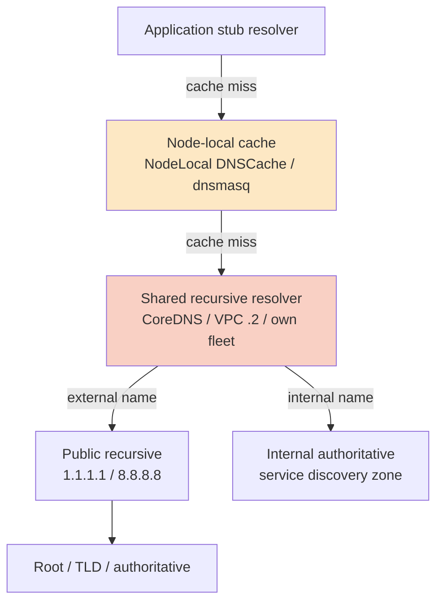
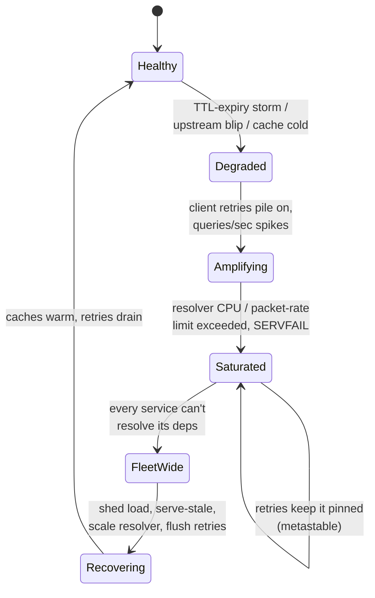

# DNS Resolution Flow — Staff

At Staff level, DNS resolution stops being "the thing that turns a name into an IP" and becomes *a shared, load-bearing dependency that sits on the critical path of nearly every request your organization makes* — inside pods, between services, out to third parties, and back from the edge. The junior and middle tiers teach how recursion, caching, and TTLs work. This tier is about the consequences of those mechanics at organizational scale: the resolver is a single point of failure that most engineers have never drawn on their architecture diagram, its outages have a blast radius that surprises everyone, and the decision of *who runs your resolver* — you, a hyperscale public provider, or your cloud's VPC resolver — is a build-vs-buy call with real reliability, cost, privacy, and compliance stakes. The recurring lesson from the industry's worst DNS incidents is the same: DNS is invisible until it fails, and when it fails it fails *wide*, because everything depends on it and almost nothing degrades gracefully without it.

## Table of Contents

1. [The Resolver as a Shared Dependency and Hidden SPOF](#1-the-resolver-as-a-shared-dependency-and-hidden-spof)
2. [Run-Your-Own vs Public vs Managed VPC Resolver](#2-run-your-own-vs-public-vs-managed-vpc-resolver)
3. [Blast Radius of a Resolver Outage](#3-blast-radius-of-a-resolver-outage)
4. [Observability: DNS as an SLO and a Debugging Signal](#4-observability-dns-as-an-slo-and-a-debugging-signal)
5. [Cost, Rate Limits, and Query Amplification](#5-cost-rate-limits-and-query-amplification)
6. [DoH / DoT as Organizational Policy](#6-doh--dot-as-organizational-policy)
7. [Incident Patterns Where DNS Was the Root Cause](#7-incident-patterns-where-dns-was-the-root-cause)
8. [When NOT to Over-Engineer Resolution](#8-when-not-to-over-engineer-resolution)
9. [Staff Judgment Checklist](#9-staff-judgment-checklist)
10. [Next Step](#10-next-step)

---

## 1. The Resolver as a Shared Dependency and Hidden SPOF

Draw your service's dependency graph honestly and DNS resolution appears on almost every edge, yet it is the one dependency nobody lists. Every outbound call — to your database (`db.prod.internal`), to your cache, to a partner payment API, to your own object store, to the Kubernetes API server — begins with a name lookup. Service discovery in most modern stacks (Kubernetes `ClusterIP` services, Consul, cloud service endpoints) *is* DNS. The resolver is therefore a dependency-of-dependencies: when it degrades, it does not take down one service, it degrades the ability of *every* service to find *every* other service simultaneously.

The reason this SPOF stays hidden is caching. Under normal operation, hot names are resolved once and served from cache for the TTL, so DNS contributes near-zero latency and the resolver looks idle. This lulls teams into treating it as free and infallible. The failure only surfaces when the cache cannot save you: cold caches after a deploy or scale-up event, a flood of *new* names (fan-out to many distinct hosts), a TTL expiry storm where thousands of cached entries lapse at once, or a resolver process that is up but returning `SERVFAIL`. In those moments the resolver moves from "invisible" to "the throttle on the entire fleet."

There are several distinct resolvers in play, and Staff engineers must know which one they actually depend on:

- **The stub resolver** in the application/libc (`getaddrinfo`, `resolv.conf`) — often the real bottleneck, because it may be single-threaded per process, lack caching, or serialize lookups. In containers, `nsswitch`/`ndots` misconfiguration here causes far more incidents than the upstream resolver.
- **The node-local caching resolver** (`systemd-resolved`, `dnsmasq`, `NodeLocal DNSCache` in Kubernetes) — a per-host cache that absorbs most traffic and shields the shared tier.
- **The shared recursive resolver** (cluster CoreDNS, VPC `.2` resolver, or your own BIND/Unbound/Knot fleet) — the tier whose outage is fleet-wide.
- **The authoritative servers and the public recursive resolvers** (`1.1.1.1`, `8.8.8.8`) they ultimately query.

Each layer is a place to add caching and a place to introduce a SPOF. The Staff mandate is to make the dependency *explicit* — put the resolver in the architecture diagram, name its owner, define its SLO — and to ensure no single resolver instance is on the critical path without a fallback.

## 2. Run-Your-Own vs Public vs Managed VPC Resolver

This is the core build-vs-buy decision of the topic, and it is genuinely a trade-off, not a default. The three realistic options are: run your own recursive resolver fleet (BIND, Unbound, Knot Resolver, or CoreDNS for internal zones), point at a public anycast resolver (Cloudflare `1.1.1.1`, Google `8.8.8.8`, Quad9 `9.9.9.9`), or use the cloud's managed VPC resolver (the AWS VPC `.2` resolver / Route 53 Resolver, GCP `169.254.169.254` metadata resolver, Azure `168.63.129.16`). Most mature organizations end up with a *layered* answer — VPC resolver as the default egress, a self-hosted tier for internal service-discovery zones and split-horizon, and public resolvers only as a deliberate, monitored fallback.

| Dimension | Run your own (Unbound/BIND/Knot/CoreDNS) | Public resolver (1.1.1.1 / 8.8.8.8) | Managed VPC resolver (Route 53 Resolver / GCP / Azure) |
|---|---|---|---|
| **Operational burden** | You own patching, scaling, on-call, capacity | None — provider runs it | Minimal — cloud runs it |
| **Availability** | As good as *you* make it (anycast is hard) | Very high, global anycast, but outside your control | High within the region/VPC; tied to cloud health |
| **Blast radius when it fails** | Yours to bound; you can add fallback tiers | Provider-wide; you are one of millions affected | Region/VPC-wide; correlated with your other cloud deps |
| **Internal / split-horizon zones** | Full control; native | Not possible (public only) | Supported via private hosted zones / forwarding rules |
| **Privacy / query visibility** | Queries stay in your infra | Queries leave to a third party | Stays in cloud provider (already your data processor) |
| **Filtering / policy (block C2, malware)** | Full control (RPZ, sinkholes) | Limited (some providers offer filtered variants) | Via provider firewall / Route 53 Resolver DNS Firewall |
| **Latency** | Low if placed near workloads | Low via anycast, but a network hop away | Lowest for cloud-internal names; in-VPC |
| **Cost model** | Compute + people (fixed, scales with fleet) | Free at the query level | Per-query / per-endpoint fees; can surprise at scale |
| **Rate limits** | Yours to set | Provider may throttle abusive sources | Documented per-ENI / per-instance query caps |
| **Compliance / data residency** | You attest fully | Third-party processor; may cross borders | Within your existing cloud compliance boundary |
| **When it wins** | Regulated, high-scale, need split-horizon + filtering | Small footprint, no internal zones, want zero ops | Default for cloud-native workloads; pairs with private zones |

Three non-obvious Staff points. First, **the VPC resolver has hard, undocumented-feeling limits** — cloud providers cap DNS queries per network interface (AWS enforces a hard limit on packets-per-second per ENI to the `.2` resolver); a chatty workload with `ndots:5` and low TTLs can hit this and see intermittent `SERVFAIL` that looks like a mystery until you correlate it with query volume. Second, **public resolvers are a shared fate you do not control** — pointing production at `8.8.8.8` means a Google DNS incident is your incident, and you cannot page their on-call. Third, **"run your own" is only as reliable as your anycast and your redundancy** — a single Unbound box is *worse* than the VPC resolver, not better; the value of self-hosting comes from the control it gives you (filtering, split-horizon, RPZ), not from an inherent reliability advantage you have to earn.

## 3. Blast Radius of a Resolver Outage

The defining property of a DNS outage is that its blast radius is *wider than anyone expects and correlated across services that otherwise share nothing.* Two microservices with no code, database, or team in common still both stop working if they share a resolver, because both need name resolution to find their own dependencies. This breaks the usual mental model of blast-radius containment — bulkheads, cells, and per-service circuit breakers do not help, because the failure is upstream of all of them.

Worse, DNS failures interact badly with retries. When lookups start returning `SERVFAIL` or timing out, well-intentioned client retry logic *amplifies* load on the already-struggling resolver, turning a brownout into a full outage. The resolver is a classic **metastable failure** surface: a small trigger (a TTL storm, a brief upstream blip) pushes it past a tipping point where retry-driven load keeps it down even after the original trigger clears. This is exactly the shape of several famous multi-hour cloud incidents.

The staged progression of a resolver-driven outage:

Design levers a Staff engineer pulls to bound this radius, in rough order of leverage:

- **Node-local caching (`NodeLocal DNSCache`, per-host `dnsmasq`)** — the single highest-leverage mitigation. It absorbs the vast majority of queries at the host, so a shared-resolver blip is invisible to most requests and the shared tier's load drops by an order of magnitude.
- **Serve-stale / `serve-expired`** — configure resolvers (Unbound `serve-expired`, RFC 8767) to return the last-known-good answer past TTL when upstream is unreachable. This trades a small staleness risk for surviving an authoritative-server outage. Enable it deliberately for names where a slightly stale IP is far better than `SERVFAIL`.
- **Redundant resolvers with fast failover** — at least two independent upstreams in `resolv.conf`, ideally in different failure domains (e.g., VPC resolver + a self-hosted tier), and tuned timeouts so a dead resolver is skipped fast rather than blocking the request.
- **Retry discipline** — bounded retries with jittered backoff on the DNS path specifically, so client behavior does not become the amplifier.
- **Higher TTLs on stable internal names** — a name that changes rarely should not have a 5-second TTL; short TTLs multiply resolver load and shrink your survive-the-outage window for no benefit.

## 4. Observability: DNS as an SLO and a Debugging Signal

DNS resolution deserves the same SLO treatment as any other critical dependency, and yet it is the most commonly unmonitored one. The Staff move is to define explicit objectives on the resolver tier and to instrument resolution *from the client's perspective*, not just at the resolver box.

Define at least these SLOs on the shared resolver tier: resolution success rate (fraction of queries answered `NOERROR` vs `SERVFAIL`/timeout), resolution latency (p50/p99 of cache-miss lookups — cache hits are near-zero and mask the tail), and resolver availability. A pragmatic starting objective is p99 cache-miss resolution under a small number of milliseconds internally and a success rate of 99.99%+, but the exact number matters less than *having* the objective and an error budget attached to it. Track cache hit ratio as a leading indicator — a falling hit ratio predicts rising shared-tier load before it becomes an outage.

DNS is also one of the most underused *debugging signals* in an incident. Because nearly every request starts with a lookup, resolution telemetry disambiguates a whole class of "the service is slow / can't reach its dependency" incidents:

- A spike in `SERVFAIL` or resolution latency that *precedes* application errors points squarely at the DNS layer as the root cause, saving hours of chasing the wrong service.
- Query logging (CoreDNS logging, Route 53 Resolver query logs, `dnstap`) reveals *what* is being resolved — a sudden flood of lookups for one hostname exposes a misconfigured low-TTL client or a retry storm; lookups for unexpected external domains can surface data-exfiltration or malware C2 traffic (DNS is a favorite covert channel).
- Correlating resolution latency with the ENI/instance query-rate metric catches the "silent VPC resolver throttle" failure before it becomes user-visible.

The key instrumentation principle: **measure resolution at the application, not only at the resolver.** A resolver reporting itself healthy while a misconfigured `ndots` makes every pod try five bogus search-domain suffixes before the real answer is a failure that only the client-side latency histogram will show. Emit a metric on `getaddrinfo`/lookup duration and outcome from inside the app or a sidecar, and alert on its p99 and error rate.

## 5. Cost, Rate Limits, and Query Amplification

DNS looks free, and per-query it nearly is, which is exactly why cost problems here are stealthy — they show up as *rate-limit failures* and *amplified downstream cost* rather than a line item. Three cost/limit dynamics matter at Staff scale.

**Query amplification from configuration.** The Kubernetes `ndots:5` default is the canonical example: a lookup for an external name like `api.partner.com` is first tried as `api.partner.com.<namespace>.svc.cluster.local`, then several other search-domain suffixes, before finally being tried as the absolute name — turning one intended query into five or six. Multiply by thousands of pods and a low TTL and you have manufactured an order-of-magnitude more DNS traffic than your application logically issues. The fixes (append a trailing dot for absolute names, lower `ndots`, use `NodeLocal DNSCache`) are cheap once you *see* the amplification, which requires query logging.

**Provider rate limits as a hard ceiling.** The AWS VPC resolver enforces a hard packets-per-second limit per network interface toward the `.2` address; exceed it and queries are silently dropped, surfacing as intermittent `SERVFAIL`. This is a capacity limit you must plan against — a batch job that fans out to many distinct hosts from one large instance can hit it. Managed resolver *query logging and firewall* features are also billed per query, so at high volume the observability you want has a real cost that must be budgeted.

**Managed-resolver and endpoint fees.** Route 53 Resolver inbound/outbound endpoints, DNS Firewall rules, and query logging all carry per-query or per-endpoint charges. At a few billion queries a month these become a noticeable bill, and the instinct to "just log everything" needs a sampling strategy. The Staff judgment is to log at high fidelity where it earns its keep (security-relevant zones, incident debugging) and sample or aggregate elsewhere.

The through-line: DNS cost is rarely the DNS bill — it is the *amplified downstream load* (more queries → more resolver capacity → more chance of hitting limits → retry storms → more application latency and compute) and the *rate-limit outages* that a chatty configuration causes. Attack it by reducing unnecessary queries (caching, TTLs, `ndots`) before you attack it by buying more resolver capacity.

## 6. DoH / DoT as Organizational Policy

Encrypted DNS — DNS over HTTPS (DoH, RFC 8484) and DNS over TLS (DoT, RFC 7858) — is a privacy improvement for the open internet and a *governance problem* inside an enterprise, and Staff engineers own that tension. The same property that protects a home user from a snooping ISP (encrypting the query so intermediaries cannot see or tamper with it) also **bypasses the organization's own DNS-based security controls** — RPZ malware sinkholes, split-horizon internal resolution, and query logging all depend on the org seeing and controlling DNS.

The concrete failure mode: a browser or application that ships with DoH enabled by default (pointing at a public resolver over `443`) silently stops using your corporate resolver. Now internal names may not resolve (they only exist in your split-horizon zone), your malware-blocking RPZ is bypassed, and your security team's query logs go dark for that host. This is not hypothetical — mainstream browsers have shipped auto-DoH, and the industry response was the "canary domain" (`use-application-dns.net`): if an org's resolver answers that name with `NXDOMAIN`, compliant browsers disable auto-DoH, deferring to enterprise policy.

The Staff policy position has to answer three questions explicitly:

- **Egress encryption to upstreams:** Yes — the resolver-to-upstream hop *should* use DoT/DoH so queries to `1.1.1.1`/`8.8.8.8` are not sent in cleartext over the internet. This is a pure win and should be the default.
- **Client-to-resolver on managed devices:** Encrypted is fine and good *as long as it points at the corporate resolver*, preserving policy and logging. The threat is not encryption; it is clients choosing a *different, external* resolver.
- **Disabling client auto-DoH-to-public:** On corporate-managed networks and devices, deploy the canary domain and/or MDM policy so applications defer DNS to the organization's resolver. This keeps split-horizon, filtering, and logging intact.

The honest trade-off to document: encrypted DNS strengthens confidentiality against on-path attackers but centralizes trust in whichever resolver the client uses. The enterprise answer is not "block encryption" — it is "encrypt to *our* resolver, and prevent silent redirection to someone else's."

## 7. Incident Patterns Where DNS Was the Root Cause

DNS is disproportionately represented in the root-cause section of major postmortems relative to how little attention it gets in design. Recognizing the recurring patterns lets you design them out. The common shapes:

- **Expired or misconfigured authoritative records / lame delegation.** A record change fat-fingered, or a delegation pointing at a decommissioned nameserver, makes a whole domain unresolvable. Fix: change control on zone edits, staging/verification of zone changes, and monitoring that queries the *public* resolution of your own names end-to-end.
- **TTL storm + cold cache after a deploy or region failover.** A mass restart or failover invalidates caches, and a synchronized flood of cache-miss lookups overwhelms the resolver right when you can least afford it. Fix: node-local caching, serve-stale, staggered restarts, and sensible TTLs.
- **Metastable retry amplification.** A brief resolver blip triggers client retries that pin the resolver down (Section 3). Fix: bounded/jittered retry on the DNS path and load shedding at the resolver.
- **The `ndots`/search-domain amplification outage.** A chatty cluster hits the VPC resolver's per-ENI packet limit; queries are dropped as `SERVFAIL` and it looks like a random application bug. Fix: trailing-dot absolute names, lower `ndots`, `NodeLocal DNSCache`.
- **Split-horizon leak.** An internal name that should resolve to a private IP resolves to a public one (or `NXDOMAIN`) because a client used a public resolver or DoH bypassed the internal view. Fix: enforce corporate resolver, canary domain, and audit split-horizon config.
- **Dependency on a single provider's DNS control plane.** A control-plane outage at the DNS provider (or the *authoritative* service) darkens everything that resolves through it. Fix: secondary DNS with a second independent provider for critical public zones, so authoritative resolution survives one provider's failure.
- **Cache poisoning / hijack.** Less common with DNSSEC and modern resolvers, but a poisoned cache or a hijacked registrar record redirects traffic. Fix: DNSSEC validation, registrar lock, and monitoring for unexpected answer changes.

The meta-pattern across all of these: DNS incidents are almost always *low-probability, high-blast-radius, and invisible-until-they-fire.* They reward exactly the Staff investments — explicit ownership, an SLO, layered caching, redundancy across failure domains, change control on records, and end-to-end synthetic monitoring of your own names' public resolution.

## 8. When NOT to Over-Engineer Resolution

The counterweight to all of the above: for the large majority of teams, the correct DNS resolution architecture is *boring, and that is the point.* Over-engineering DNS is a real failure mode — building a bespoke multi-provider anycast resolver fleet with custom serve-stale logic for a service that makes a few hundred lookups a minute is wasted complexity that adds its own failure surface and on-call burden.

Do **not** run your own recursive resolver fleet when: you have no internal split-horizon zones, no regulatory requirement to keep queries in-house, and no need for custom filtering/RPZ. The cloud VPC resolver plus node-local caching is more reliable than a resolver fleet you would have to earn reliability for, and it costs you zero operational attention.

Do **not** reach for exotic multi-provider secondary DNS, DNSSEC, and serve-stale on *internal* development or low-criticality services — the blast radius is small, the recovery is fast, and the complexity is not repaid. Reserve those investments for the public zones and internal service-discovery tiers whose outage is genuinely fleet-wide.

Do **not** aggressively shorten TTLs "to be safe." Short TTLs multiply resolver load, shrink your survive-an-outage window, and are almost always a symptom of using DNS for something (fast failover, load balancing) that a purpose-built layer (a load balancer, a service mesh, health-checked anycast) does far better. If you find yourself wanting 5-second TTLs for failover, the DNS layer is the wrong tool.

Do **not** build custom DNS caching in the application when the platform already provides node-local caching — you will reinvent TTL handling, negative caching, and serve-stale, and get them subtly wrong.

The Staff judgment is to spend complexity where blast radius and scale justify it — the shared resolver tier, public authoritative zones, security-sensitive query logging — and to keep everything else deliberately, defensibly boring. The resolver you never think about because it is well-cached, redundant across two failure domains, and monitored is the correct outcome; a clever one is usually a liability.

## 9. Staff Judgment Checklist

- [ ] The resolver is drawn on the architecture diagram, has a named owner, and has an SLO (success rate + p99 cache-miss latency) with an error budget.
- [ ] Node-local caching (`NodeLocal DNSCache` / per-host cache) is deployed so a shared-tier blip is invisible to most requests.
- [ ] At least two independent upstream resolvers in different failure domains, with tuned failover timeouts; no single resolver instance is on the critical path.
- [ ] The run-your-own vs public vs VPC-resolver choice is a documented, revisitable decision (ADR), not a default — with cost, privacy, filtering, and split-horizon requirements weighed.
- [ ] DNS resolution is instrumented *at the application/client*, not only at the resolver; p99 lookup latency and `SERVFAIL` rate are alerted.
- [ ] Query logging exists for security-sensitive zones with a sampling/cost strategy; unexpected external lookups are surfaced.
- [ ] `ndots`/search-domain amplification is measured and bounded; absolute names use a trailing dot; VPC per-ENI query limits are monitored.
- [ ] Serve-stale is enabled deliberately where a slightly stale IP beats `SERVFAIL`; TTLs on stable internal names are sane, not reflexively tiny.
- [ ] Encrypted-DNS policy is explicit: DoT/DoH to upstreams, corporate resolver enforced on managed devices (canary domain / MDM), no silent redirection to external resolvers.
- [ ] Critical public zones have secondary DNS across two independent providers, DNSSEC where warranted, registrar lock, and synthetic monitoring of public resolution of your own names.
- [ ] Change control exists on authoritative zone edits; retry logic on the DNS path is bounded and jittered to avoid metastable amplification.

## 10. Next Step

You now hold the organizational and judgment axis of DNS resolution — the resolver as a shared SPOF, the build-vs-buy call, blast radius, observability, cost, encrypted-DNS policy, and the discipline of not over-engineering. Consolidate it against the questions an interviewer will actually probe.

*Next step:* [DNS Resolution Flow — Interview](interview.md)
