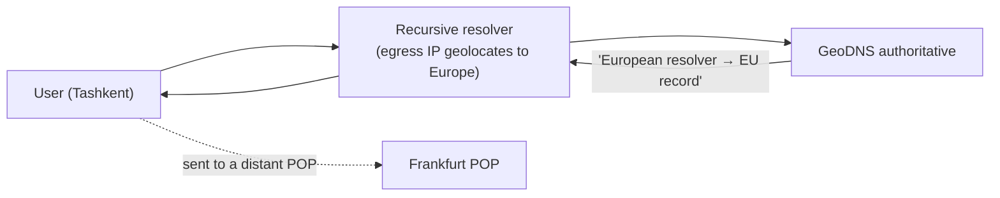
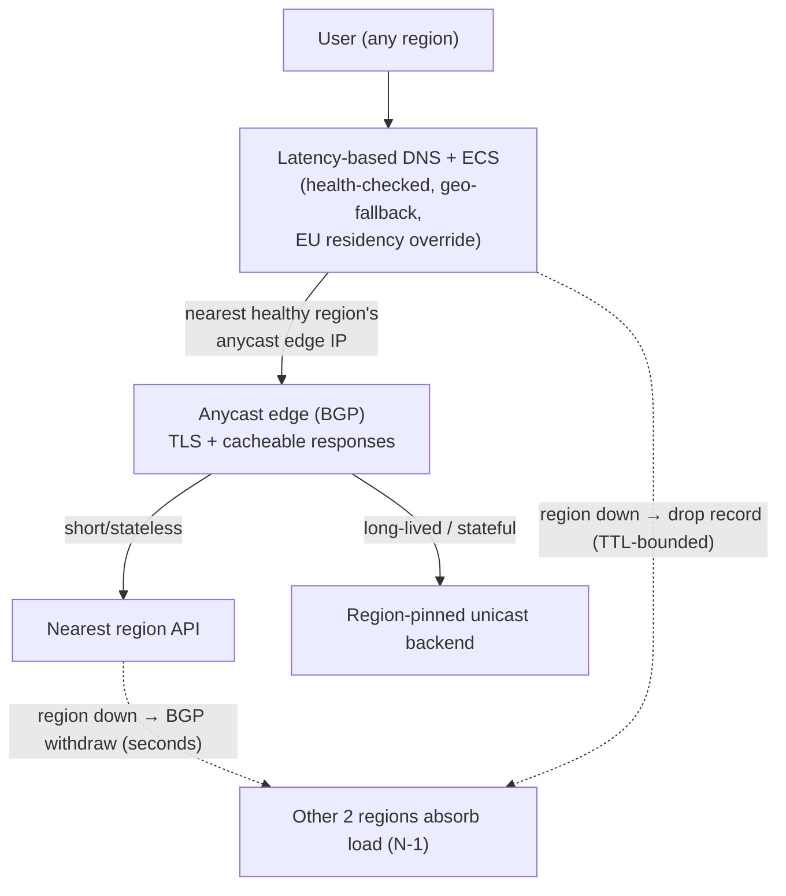

# GeoDNS & Anycast — Interview

Two techniques, two OSI layers, one goal: put every user on a nearby server. Interviewers probe this pair precisely because candidates routinely blur them. The strong answer keeps the *layer* distinction sharp — GeoDNS decides at name-resolution time, anycast decides at packet-routing time — and then reasons about the second-order consequences: who the DNS server actually sees, why anycast heals in seconds, why long-lived TCP flows make anycast operators nervous, and how a real CDN stacks both. This file drills the exact questions and the crisp answers that signal seniority.

---

## Table of Contents

1. [Q1: GeoDNS vs anycast — the one-sentence difference?](#q1-geodns-vs-anycast--the-one-sentence-difference)
2. [Q2: How does anycast actually route a packet?](#q2-how-does-anycast-actually-route-a-packet)
3. [Q3: Why does GeoDNS see the resolver, not the user?](#q3-why-does-geodns-see-the-resolver-not-the-user)
4. [Q4: What is EDNS Client Subnet and how does it help?](#q4-what-is-edns-client-subnet-and-how-does-it-help)
5. [Q5: Isn't anycast dangerous for TCP? Sessions could break.](#q5-isnt-anycast-dangerous-for-tcp-sessions-could-break)
6. [Q6: How do CDNs combine GeoDNS and anycast?](#q6-how-do-cdns-combine-geodns-and-anycast)
7. [Q7: What is a catchment and why doesn't it equal geography?](#q7-what-is-a-catchment-and-why-doesnt-it-equal-geography)
8. [Q8: What is the ECS cache-cost tradeoff?](#q8-what-is-the-ecs-cache-cost-tradeoff)
9. [Q9: How does each technique react to a POP failure?](#q9-how-does-each-technique-react-to-a-pop-failure)
10. [Q10: What is the DNS TTL tradeoff for GeoDNS?](#q10-what-is-the-dns-ttl-tradeoff-for-geodns)
11. [Q11: How is latency-based routing different from geo routing?](#q11-how-is-latency-based-routing-different-from-geo-routing)
12. [Q12: How does anycast defend against DDoS?](#q12-how-does-anycast-defend-against-ddos)
13. [Q13: What are the operational prerequisites for running anycast?](#q13-what-are-the-operational-prerequisites-for-running-anycast)
14. [Q14: Comparison cheat-sheet](#q14-comparison-cheat-sheet)
15. [Q15: Scenario — design global low-latency routing for a service in 3 regions](#q15-scenario--design-global-low-latency-routing-for-a-service-in-3-regions)
16. [Q16: Rapid-fire follow-ups](#q16-rapid-fire-follow-ups)

---

## Q1: GeoDNS vs anycast — the one-sentence difference?

> **GeoDNS = one name, many IPs; the DNS server picks a location-specific address at resolution time. Anycast = one IP, many locations; the network picks the nearest announcing site at routing time.**

They operate at different layers and are complementary, not competing:

- **GeoDNS** is an *application-layer / DNS* decision. The authoritative server inspects the query's apparent origin and returns a *different A/AAAA record* per region. Once resolved, the client makes an ordinary unicast connection to that specific IP.
- **Anycast** is a *network-layer / routing* decision. The *same* IP prefix is announced from many sites via BGP; each router in the internet independently forwards toward its nearest announcer. DNS returns one IP for everybody.

The tell of a weak answer is treating them as synonyms ("both send you to the nearest server"). The tell of a strong answer is naming the *layer* and the *decision moment*, because everything else — failure behavior, resolver blindness, TCP concerns — falls out of that distinction.

---

## Q2: How does anycast actually route a packet?

> Multiple sites **announce the identical IP prefix** into BGP. Every router on the path runs its normal best-path selection and forwards toward whichever announcement is "closest." Closeness is defined by BGP's decision process, not by kilometers.

Step by step:

```mermaid
sequenceDiagram
    autonumber
    participant Site as POPs (FRA, IAD, SIN)
    participant Peers as Transit / Peer Routers
    participant Core as Internet Core (many ASes)
    participant U as User
    Site->>Peers: Announce prefix 192.0.2.0/24 (same prefix, 3 origins)
    Peers->>Core: Propagate routes; each router runs best-path selection
    Note over Core: Per router: prefer shortest AS_PATH,<br/>local-pref, then IGP metric — NOT distance
    U->>Core: Packet dst=192.0.2.1
    Core->>Site: Forward to the best-path announcer for THIS router
    Note over U,Site: Different users' routers may pick different POPs
```

BGP's best-path tie-breakers, in the order that matters here: highest **local-preference** (operator policy), shortest **AS_PATH**, then lowest **IGP metric** to the egress. Physical distance only correlates loosely with these. That is why anycast steering is *good but not perfect* — a user can be routed to a topologically-near but geographically-far POP if that is the shortest AS path. The routing is also **stateless and per-hop**: no site "owns" a user; each packet is forwarded independently by whatever router handles it.

---

## Q3: Why does GeoDNS see the resolver, not the user?

> Because the client never queries the authoritative server directly. It asks a **recursive resolver** (ISP's, or a public one like `8.8.8.8`), and *the resolver* is what contacts GeoDNS. So GeoDNS geolocates the **resolver's egress IP**, not the end user's.



The failure mode: a user in one region who configures a public resolver whose nearest egress is elsewhere gets mapped to the resolver's region. Historically this was worst when a resolver operator had few egress locations. Two structural forces reduce the damage in practice: (1) large public resolvers run **anycast** themselves, so `8.8.8.8` egress is usually near the user; (2) **EDNS Client Subnet** lets the resolver forward a coarse client-network hint (Q4). But the default assumption in an interview should be: *GeoDNS resolution accuracy is bounded by resolver location unless ECS is in play.*

---

## Q4: What is EDNS Client Subnet and how does it help?

> **ECS (RFC 7871)** is an EDNS0 option that lets the recursive resolver include a **truncated prefix of the client's IP** (e.g. `203.0.113.0/24`) in the upstream query. GeoDNS then decides based on where the *client's network* is, not the resolver's.

Key properties:

- The resolver sends `SOURCE PREFIX-LENGTH` bits (commonly a /24 for IPv4, /56 for IPv6) — enough to locate the neighborhood, deliberately not the exact host, for privacy.
- The authoritative server returns a `SCOPE PREFIX-LENGTH` telling the resolver how *specific* its answer was, which governs how the answer may be cached (see Q8).
- It is a **privacy/accuracy tradeoff**. Some resolvers (notably privacy-focused ones) refuse to send ECS on purpose, so GeoDNS must always keep a sane geo-fallback for ECS-less queries.

The nuance worth stating: ECS is a *GeoDNS-only* mechanism. Anycast never needs it, because the network — not a database lookup on an IP — determines proximity from where packets actually enter.

---

## Q5: Isn't anycast dangerous for TCP? Sessions could break.

> The risk is real but bounded. Anycast is **stateless per packet**, so if a routing change ("route flap") mid-connection redirects packets to a *different* POP, that POP has no TCP state for the flow and resets it. This is why anycast is safest for **short, stateless request/response** (DNS/UDP, TLS-terminated HTTP with short-lived connections) and requires care for long-lived flows.

Why it usually works anyway, and how operators mitigate:

- **Routes are stable most of the time.** BGP paths don't churn on a per-packet basis; a given source keeps hitting the same POP for the duration of a normal connection. Flaps are the exception, not the rule.
- **Short connections limit exposure.** A DNS query or a small HTTPS GET completes in one RTT-few; the window for a mid-flow reroute is tiny.
- **Consistent hashing / flow pinning at the edge** and stable ECMP hashing keep a 5-tuple mapped to the same backend even when membership shifts.
- **Session tickets / stateless resumption** let a reset TLS session re-establish cheaply on the new POP.
- **The two-tier pattern**: use anycast only up to the nearest edge, then hand long-lived or stateful traffic (WebSocket, large uploads, video) to a **unicast** address that pins the flow to one machine. This is the standard escape hatch.

A crisp senior answer: "Anycast for stateless and connection-establishment; unicast (or a stable backend behind the anycast edge) for stateful, long-lived flows."

---

## Q6: How do CDNs combine GeoDNS and anycast?

> They layer them. **DNS (often latency-based) narrows you to the right network/region; anycast within that network gives the truly nearest edge plus instant failover.** They solve different granularities of "nearest."

Two common architectures:

- **DNS-steered CDNs** (classic Akamai style): heavy investment in mapping/latency-based DNS returns a *unicast* edge IP tailored to the resolver/ECS subnet. Steering intelligence lives in DNS; failover speed is bounded by TTL.
- **Anycast CDNs** (Cloudflare style): a single anycast IP fronts every edge; DNS is nearly location-agnostic, and BGP does the fine-grained steering and second-level failover. Steering intelligence lives in the network.

Most large operators blend both: DNS picks the *service/region/provider*, and anycast handles *nearest-edge + fast drain* inside it. The interview point is that these are **layers, not rivals** — DNS coarse-grains and can enforce policy (data residency), anycast fine-grains and self-heals.

---

## Q7: What is a catchment and why doesn't it equal geography?

> A **catchment** is the set of clients (or source networks) that a given anycast POP actually receives, as determined by BGP. It is the *routing* footprint of a site, and it does **not** map cleanly to a geographic boundary.

Why catchment diverges from a map:

- BGP picks by **AS_PATH length and policy**, not distance. A user in city A may have a shorter AS path to a POP in a *different* country than to the one physically nearest, so they land in the far POP's catchment.
- **Peering topology** dominates: a POP that peers directly with a user's ISP will "capture" that ISP even if another POP is closer on the map.
- Catchments are **dynamic** — they shift when peering changes, a POP is added/withdrawn, or transit paths change. Operators actively *shape* catchments with local-pref, AS_PATH prepending, and selective prefix announcement (e.g. more-specific prefixes to steer certain networks).

Consequence: capacity planning for anycast is per-*catchment*, not per-*country*. A POP can be overwhelmed by a far-away network that routes to it, and the fix is a BGP-policy change, not a data-center move.

---

## Q8: What is the ECS cache-cost tradeoff?

> ECS **fragments the DNS cache by client subnet**. Without ECS, one cached answer per name serves everyone; with ECS, the resolver must cache a *separate answer per (name, client-subnet)*, multiplying cache entries and lowering hit rate.

The mechanics: the authoritative server's returned **SCOPE prefix-length** tells the resolver how specific the answer is. A `/24` scope means "this answer is valid only for this /24," so the resolver keys the cache entry by `/24`. A busy name that serves thousands of client subnets now needs thousands of cache entries and thousands of upstream queries instead of one.

The tradeoff to articulate:

| Without ECS | With ECS |
|-------------|----------|
| 1 cached answer per name → high hit rate | N answers per name (one per client subnet) → lower hit rate |
| Coarse geo accuracy (resolver-based) | Fine geo accuracy (client-network-based) |
| Less upstream authoritative traffic | More upstream traffic + bigger resolver cache footprint |
| Better client privacy | Coarse client location leaked to authoritative |

Mitigations: return the **widest correct SCOPE** the answer allows (don't over-specify — a `/0` scope means "same answer for everyone, cache freely"), and keep TTLs sensible. The senior insight: *ECS trades DNS cache efficiency and privacy for routing accuracy*, so use it only where the accuracy gain (large geo-steered CDN) justifies the cache blow-up.

---

## Q9: How does each technique react to a POP failure?

> **Anycast heals in seconds; GeoDNS heals in TTL-time (often minutes).** With anycast, the dead site **withdraws its BGP announcement** and every router converges onto the next-nearest announcer of the same IP — no client action, no cache to expire. With GeoDNS, resolvers keep handing out the dead POP's IP until the record's **TTL** expires.

- **Anycast failover** = BGP withdrawal + reconvergence, typically seconds. Health-checking automation withdraws the route when the POP is unhealthy; traffic drains automatically to survivors. This self-healing property is anycast's headline availability benefit.
- **GeoDNS failover** = new record + wait for TTL. Even after you update the record, resolvers that cached the old answer serve it until TTL runs out. A 300 s TTL means up to 5 minutes of users hammering a dead POP. Lowering TTL speeds failover but raises DNS query load and can hurt hit rate (Q10).

This is often *the* differentiator interviewers want: anycast's failover is a network-plane event (fast, automatic); GeoDNS's is a control-plane event bounded by cache TTL (slow, eventually-consistent).

---

## Q10: What is the DNS TTL tradeoff for GeoDNS?

> **Low TTL = faster failover and re-steering, but more DNS query volume and lower cache efficiency. High TTL = fewer queries and better caching, but users stay pinned to a possibly-dead or now-suboptimal POP longer.**

Because GeoDNS makes its decision *once per resolution and then that answer is cached*, TTL is the knob that governs how stale a routing decision can get:

- A **30–60 s** TTL is typical for latency/geo-steered records that need agility for failover and traffic engineering; it accepts higher query load.
- A **higher TTL** (minutes) is cheaper and cache-friendly but blunts both failover and any dynamic re-steering.

There's a subtlety: many resolvers **clamp or ignore very low TTLs** (enforcing a floor), so a `TTL 1` doesn't guarantee 1-second failover in the wild. This is another reason anycast is preferred where *seconds* of failover truly matter — you're not at the mercy of resolver TTL honoring.

---

## Q11: How is latency-based routing different from geo routing?

> **Geo routing** maps the query's source IP to a *geographic region* via a geo-IP database and returns that region's record. **Latency-based routing** returns the endpoint with the lowest *measured network latency* for that source, using pre-collected RTT measurements — not a map.

Both are DNS-layer techniques (one name → chosen IP), and both suffer the resolver-visibility problem (Q3). The difference is the *selection function*:

- Geo answers "which region is this IP registered in?" — simple, policy-friendly (data residency), but geography ≠ network distance; the nearest *country* isn't always the fastest *path*.
- Latency-based answers "which endpoint is actually fastest for this part of the internet?" — better real-world latency, but needs a measurement pipeline and doesn't express policy as cleanly.

Neither pings in real time; latency-based routing uses **historical/aggregated** measurements per network, then returns the winning endpoint via ordinary DNS. Cloud DNS products expose both as separate routing policies precisely because they answer different questions.

---

## Q12: How does anycast defend against DDoS?

> Anycast **distributes attack traffic across every POP by construction**, and lets you **absorb or contain** floods geographically. Because all sites share one IP, a botnet's packets are spread by BGP to many catchments instead of concentrating on one machine — the attack is diluted across your global capacity.

Mechanisms:

- **Automatic load spreading**: each attack source hits its nearest POP, so a globally-distributed botnet is fragmented across the fleet rather than crushing a single site.
- **Blast-radius containment**: a flood that overwhelms one POP is *localized* to that POP's catchment; withdrawing or nullrouting there doesn't take down other regions.
- **Capacity summation**: aggregate anycast edge bandwidth (tens of Tbps for large providers) becomes the effective scrubbing surface.

This is a core reason big DNS/CDN operators run anycast — it converts a single-target problem into a many-target one and turns global edge capacity into DDoS absorption capacity.

---

## Q13: What are the operational prerequisites for running anycast?

> You need **your own IP address space (a routable prefix, typically /24 for IPv4)**, an **Autonomous System Number (ASN)**, and **BGP sessions** with transit providers or at IXPs from *every* POP that announces the prefix — plus route health-check automation. It is materially harder to operate than GeoDNS.

Concretely:

- **Provider-independent IP block + ASN** (from a RIR) so you can announce the same prefix from multiple locations.
- **BGP peering/transit at each site**; consistent, correct announcements (a misconfigured prefix leak can blackhole traffic globally).
- **Route automation**: withdraw on failure, re-announce on recovery, and prefix-based **traffic engineering** (local-pref, prepending, more-specifics) to shape catchments (Q7).
- **Monitoring per catchment**, since load isn't per-country.

Contrast with GeoDNS, which needs only DNS configuration and a geo-IP dataset — no IP space, no ASN, no BGP. That accessibility is exactly why smaller shops reach for GeoDNS first, and why "anycast is harder to run" is the honest tradeoff to name.

---

## Q14: Comparison cheat-sheet

| Dimension | GeoDNS (geo / latency-based DNS) | Anycast |
|-----------|----------------------------------|---------|
| Layer / decision moment | Application (DNS) — at name resolution | Network (BGP) — at packet routing |
| Addressing | One name → **many IPs** | **One IP** → many sites |
| Who steers | The authoritative DNS logic | The internet's routers via BGP |
| Sees the real user? | No — resolver IP (better with **ECS**) | Doesn't need to; nearest by path |
| Failover speed | TTL-bounded (minutes) | BGP reconvergence (seconds) |
| Granularity of "nearest" | Region-level, geo/latency guess | Path-level, per-catchment |
| Stateful/TCP-friendly | Fine (ordinary unicast connection) | Risky mid-flow; use for short/stateless |
| Policy control (data residency) | Strong (explicit per-region records) | Weak (routing chooses) |
| DDoS posture | Concentrates on the returned IP | Distributes across all POPs |
| Ops prerequisites | DNS config + geo-IP DB | Own IP block + ASN + BGP everywhere |
| Cache concern | ECS fragments resolver cache | N/A |
| Canonical examples | CDN region selection, cloud geo/latency policies | `1.1.1.1`, `8.8.8.8`, anycast CDN edges |

---

## Q15: Scenario — design global low-latency routing for a service in 3 regions

**Prompt:** "You run an API in three regions — us-east, eu-west, ap-southeast. Users are worldwide. Design routing so every user hits a nearby region with low latency and the system survives a full-region outage."

**A strong answer proceeds in layers.**

**1. Clarify traffic shape (this drives the whole design).**
- Mostly short request/response HTTPS calls, or long-lived (WebSocket, streaming, big uploads)? This determines how far anycast can reach.
- Any **data-residency** constraints (EU users must stay in eu-west)? Policy pushes toward DNS steering.
- Read-heavy/cacheable vs write-heavy with cross-region consistency needs?

**2. Choose the steering layers.**
- **DNS layer — latency-based routing with health checks and ECS.** Return the endpoint with lowest measured latency per client network; enable ECS so steering keys off the client's subnet, not the resolver's. Keep TTL ~30–60 s for agile failover, with a **geo-fallback** for ECS-less resolvers and a **residency override** (EU networks pinned to eu-west) where required.
- **Edge/anycast layer — front the API with an anycast edge (or anycast CDN)** for TLS termination and static/cacheable responses. Anycast gives sub-second, automatic re-steering within the network and DDoS dilution. Hand **long-lived/stateful** flows to a region-specific unicast backend behind the edge so route flaps don't reset them (Q5).

**3. Failover design (two independent planes).**
- **Network plane (fast):** each region's anycast edge withdraws its BGP announcement on health-check failure → traffic drains to survivors in seconds.
- **Control plane (backstop):** DNS health checks stop returning a dead region's record; TTL bounds the tail. The two planes together mean a region loss is handled in seconds at the edge and fully within a minute at DNS.

**4. Capacity & correctness caveats.**
- Provision each region for **N-1** (one region down, its load lands on the other two) — this is a per-*catchment* exercise for anycast, not per-country (Q7).
- Cross-region **data consistency** is a separate problem: latency routing gets the user to a nearby *front door*, but if the request must reach a single primary for a strongly-consistent write, you still pay the cross-region RTT. Say this explicitly — routing solves proximity, not consistency.



**What a great answer signals:** it separates the DNS layer from the anycast layer, names the resolver/ECS caveat, keeps stateful flows off raw anycast, designs *two* failover planes with the right latencies, sizes for N-1 per catchment, and refuses to conflate proximity routing with data consistency.

---

## Q16: Rapid-fire follow-ups

- **"Can a user get sent to the wrong POP even with anycast?"** Yes — BGP picks by AS_PATH/policy, not distance, so a topologically-near but geographically-far POP can win the catchment (Q2, Q7).
- **"Why not just use anycast everywhere and drop DNS steering?"** Anycast can't easily express *policy* (data residency), is risky for long-lived TCP, and needs your own IP space + BGP everywhere. DNS steering is cheaper and policy-friendly (Q6, Q13).
- **"Does lowering TTL to 1 guarantee 1-second failover?"** No — many resolvers clamp low TTLs, and you inflate query load. For true seconds-level failover, use anycast (Q10).
- **"Where does ECS *not* help?"** When the resolver refuses to send it (privacy resolvers) or when the service is anycast — anycast never needs client geolocation (Q4).
- **"Which absorbs a DDoS better?"** Anycast — it dilutes the flood across every POP's catchment; GeoDNS concentrates traffic on the returned unicast IP (Q12).
- **"What's the single biggest operational cost difference?"** GeoDNS needs only DNS config; anycast needs provider-independent IP space, an ASN, and BGP sessions at every POP (Q13).

---

*Sources:* RFC 7871 (Client Subnet in DNS Queries / EDNS Client Subnet); Cloudflare Learning Center — "What is Anycast?" and "What is GeoDNS?".

*Next step:* [Pull CDN — Junior](../../content-delivery-networks/pull-cdn/junior.md)
