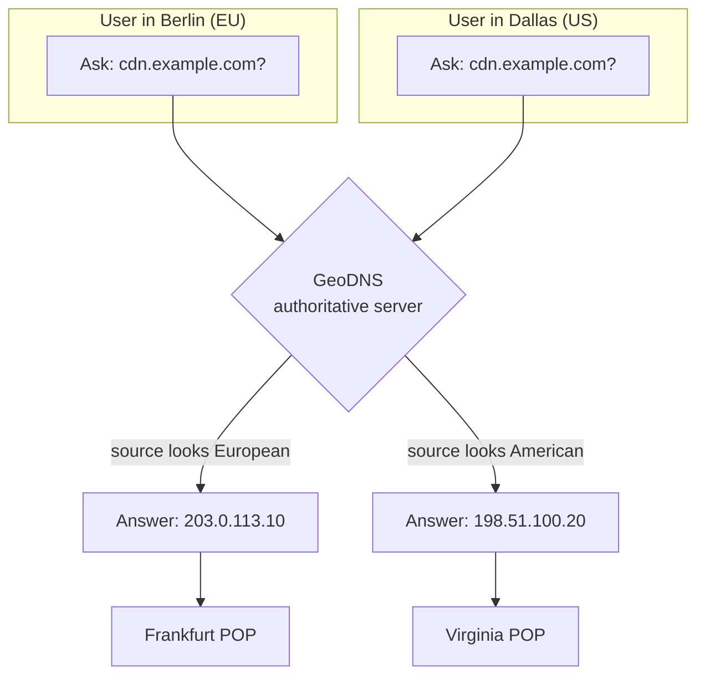
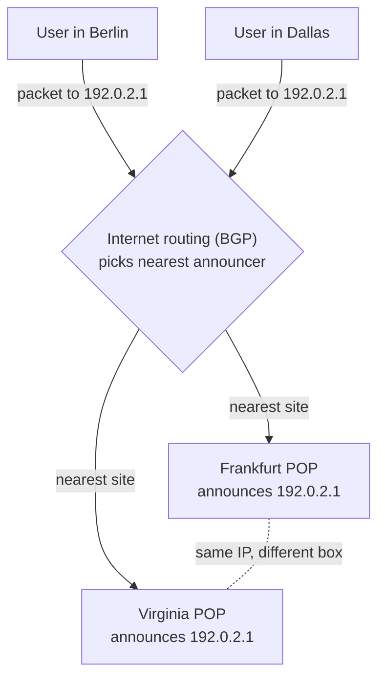
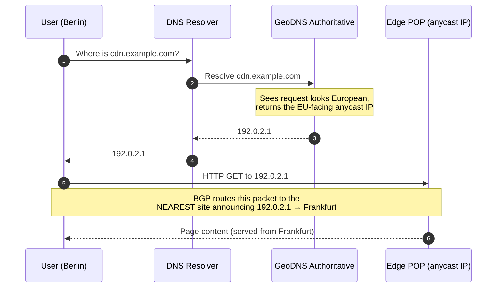
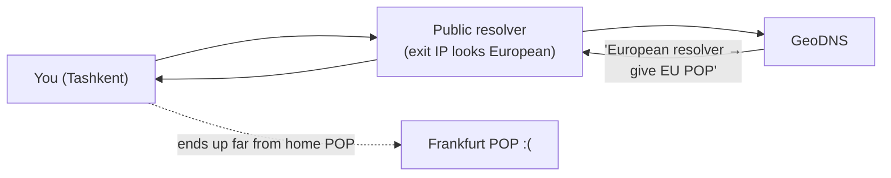

# GeoDNS & Anycast — Junior

<!-- level-focus -->
At junior level, focus on this question:

> How can I apply **GeoDNS & Anycast** in one small example and prove the result?

Use the smallest realistic scenario that exposes the decision and its failure behavior.
---

## 1. The Problem: Distance Is Latency

Data does not teleport. It travels through cables at roughly two-thirds the speed of light, and every router along the way adds a little delay. The farther the server, the longer every request-response round trip takes.

A rough feel for one-way network distance:

| Route | Approx. round-trip time (RTT) |
|-------|-------------------------------|
| Tashkent → server in Tashkent | ~1–5 ms |
| Tashkent → server in Frankfurt | ~80–100 ms |
| Tashkent → server in Virginia (USA) | ~200+ ms |

A single page load can trigger dozens of round trips (DNS, TLS handshake, several HTTP requests). At 200 ms per round trip, those add up into visible, sluggish seconds. At 5 ms, the page feels instant. **Physical distance is the enemy.**

So the goal is simple to state: *serve every user from a nearby location.* To do that, a company runs many copies of its front door — called **POPs** (points of presence) or **edge locations** — in cities around the world. The hard part is not building the POPs. The hard part is *routing each user to the right one.* That is what GeoDNS and anycast do.

> A **POP (Point of Presence)** is a data center location where a company runs servers close to users — e.g. a POP in Singapore, one in Frankfurt, one in Virginia. The same content lives in all of them.

---

## 2. Trick 1 — GeoDNS: Different Answer Per Location

Normal DNS is a phone book: you ask "what's the IP for `example.com`?" and it always answers the same number. **GeoDNS** breaks that rule on purpose — it looks at *where the question came from* and hands back a *different IP* for different regions.

Concretely, the authoritative DNS server for `cdn.example.com` is configured like this:

- If the question seems to come from **Europe** → answer `203.0.113.10` (the Frankfurt POP).
- If the question seems to come from **North America** → answer `198.51.100.20` (the Virginia POP).
- If the question comes from **anywhere else** → answer a sensible default.

The key idea: **the routing decision is made once, at name-resolution time, by handing out a location-specific IP address.** After that, the connection is a totally ordinary connection to that one IP. Berlin talks to Frankfurt's real IP; Dallas talks to Virginia's real IP — two *different* addresses.

**How does GeoDNS guess where you are?** It maps the IP address that asked the question to a geographic location using a geo-IP database (a big lookup table of "this IP block is registered in Germany", etc.). This is a guess, not GPS — and as we'll see in §5, the IP it sees is often your resolver's, not yours.

A close cousin is **latency-based routing**: instead of "which region is this IP in?", the provider measures *which POP actually responds fastest* to that part of the internet (from real network measurements) and returns that POP's IP. Same mechanism (DNS returns a chosen IP), but the choice is driven by measured speed rather than a map. For a junior, treat both as "DNS picks a good IP for you."

---

## 3. Trick 2 — Anycast: One IP, Many Locations

Anycast throws away the "different answer per region" idea entirely. With anycast, **`cdn.example.com` resolves to a *single* IP address — say `192.0.2.1` — for everyone on Earth.**

The magic is that this *same* IP is running in Frankfurt, in Virginia, in Singapore, in Tashkent — all at once. Each of those locations "announces" the address to the internet using **BGP**, the protocol routers use to advertise which addresses they can reach.

> **BGP (Border Gateway Protocol)** is how networks tell each other "traffic for these IP addresses can reach me through here." When many locations announce the *same* address, every router in the internet independently picks the *closest* announcer (in network terms) and forwards packets there.

So when the Berlin user sends a packet to `192.0.2.1`, the internet's routers — following BGP — hand it toward the nearest site that announced that IP, which is Frankfurt. The Dallas user sends to the *exact same* `192.0.2.1`, and the routers steer *their* packet to Virginia. Nobody chose a region in DNS; the network's own routing did the steering.

The one-line summary you should memorize: **GeoDNS = one name, many IPs (DNS chooses). Anycast = one IP, many locations (the network chooses).**

Anycast is exactly how the big public DNS resolvers and CDNs work. Cloudflare's `1.1.1.1` and Google's `8.8.8.8` are single anycast IPs served from hundreds of cities — you always dial the same number and land at the nearest office.

---

## 4. Seeing It End to End (Diagram)

Here is the full journey for a page load, showing both tricks cooperating. In real large systems, GeoDNS (or latency-based DNS) often picks a *region/CDN*, and anycast handles the fine-grained "nearest edge within that CDN" steering.

Read it as two decisions:

1. **DNS step (1–5):** GeoDNS picks *which address* to hand back. This is a "choose the region/service" decision, made once, and it can be cached for a while.
2. **Network step (6–7):** For that anycast address, BGP picks *which physical site* actually receives the packets. This decision is re-made continuously by the network, per packet-path.

You don't have to use both. A simple site might use *only* GeoDNS (return the nearest POP's plain unicast IP). A CDN might use *only* anycast (one IP everywhere). Combining them is common because they solve slightly different problems, as §7 explains.

---

## 5. The Resolver Problem & EDNS Client Subnet

GeoDNS has a built-in weakness worth understanding early, because it explains a lot of "why did I get sent to the wrong POP?" mysteries.

**You never talk to the authoritative DNS server directly.** Your device asks a **resolver** (your ISP's resolver, or a public one like `8.8.8.8`). The resolver is the one that actually queries the GeoDNS authoritative server. So GeoDNS sees the **resolver's IP address**, not yours.

Why that hurts: if you're a user in Tashkent but you configured Google's public DNS, your query might be answered by a resolver whose exit IP looks like it's in Europe. GeoDNS then cheerfully sends you to the *European* POP — far from you. The geo guess was based on the resolver's location, not yours.

**EDNS Client Subnet (ECS)** is the fix. It's an extension that lets the resolver include a *truncated* slice of the real client's IP (e.g. `203.0.113.0/24` — enough to locate the neighborhood, not the exact house) inside the DNS query. Now GeoDNS can decide based on where *you* actually are, not where your resolver is. It's a privacy trade-off (you leak a coarse hint of your location), which is why some resolvers deliberately don't send it.

The neat part: **anycast doesn't have this problem at all.** Because everyone gets the same IP and the *network* does the steering based on where the actual packets enter the internet, it never has to guess your location from a resolver's address. This resolver blind spot is one of anycast's biggest practical advantages over GeoDNS.

---

## 6. GeoDNS vs Anycast — Basic Comparison

| Aspect | GeoDNS (geo / latency-based DNS) | Anycast |
|--------|----------------------------------|---------|
| Core idea | One name → **many IPs**; DNS returns a location-specific one | **One IP** → many locations; network routes to nearest |
| Where the decision happens | At **DNS resolution** time (name → address) | At **routing** time (BGP, per packet-path) |
| What steers you | The DNS server's geo/latency logic | The internet's routers via BGP |
| Knows your true location? | Only a guess from resolver IP (better with **ECS**) | Doesn't need to — nearest by network path automatically |
| Reacting to a POP failure | Slow — old IP stays cached until **TTL** expires | Fast — withdraw the BGP announcement, traffic reroutes |
| Granularity of "nearest" | Region-level, guess-based | Network-path-level, measured by routing |
| Setup difficulty | Easier — just DNS config, no special network | Harder — needs BGP, an owned IP block, network presence |
| Classic examples | CDN region selection, "nearest data center" records | `1.1.1.1`, `8.8.8.8`, CDN edge networks |

The row to really absorb is **failure reaction**. With GeoDNS, if Frankfurt dies, the resolver may keep handing out Frankfurt's IP until the record's **TTL** (time-to-live cache timer) runs out — users keep hitting a dead POP for minutes. With anycast, the failing site simply *stops announcing* the IP; within seconds BGP steers everyone to the next-nearest site, using the same address. That self-healing property is why anycast is beloved for availability.

---

## 7. When You'd Reach for Each

**GeoDNS is a good fit when:**
- You have a handful of full data centers (not hundreds of edges) and want users pointed at the nearest complete stack.
- You need coarse routing you can express in simple config, without owning IP space or running BGP.
- You want to route by *policy*, not just distance — e.g. "keep EU users' traffic on EU servers for data-residency reasons."

**Anycast is a good fit when:**
- You run many edge locations and want the *network* to handle nearest-site selection automatically and per-connection.
- Fast failover matters — a dead site should drain in seconds, not after a DNS TTL.
- The service is small and stateless per request (DNS, CDN cache hits), so it doesn't matter *which* identical site answers.

**Using both together** is the norm for CDNs: DNS (often latency-based) narrows you to the right provider/region, and anycast within that network gives you the truly nearest edge plus instant failover. They're layers, not rivals.

---

## 8. Common Misconceptions

- **"Anycast means the same server handles all my requests."** No — different packets, or the same connection after a routing change, can land at *different physical sites*. That's fine for stateless request/response (a DNS query, a cache lookup), which is why anycast is used there. Long-lived stateful sessions need more care (a middle-tier topic).
- **"GeoDNS knows exactly where I am."** It guesses from an IP, usually your *resolver's* IP. Without ECS it can be badly wrong — see §5.
- **"They're two names for the same thing."** They operate at different layers (DNS answer vs. network routing) and fail differently. Mixing them up is the classic junior error.
- **"Anycast needs special client software."** No. The client just connects to a normal IP. All the cleverness is in how the network advertises and routes that IP — invisible to the user.
- **"Latency-based routing pings you in real time."** No — it uses pre-collected measurements of which POP is fastest for your part of the internet, then returns that POP's IP via ordinary DNS.

---

## 9. Key Takeaways

- The goal of both techniques is the same: **serve each user from a nearby POP**, because distance = latency.
- **GeoDNS = one name, many IPs.** The DNS server chooses a location-specific address for you at resolution time. Easy to set up; reacts slowly to failures (TTL); guesses your location from the resolver's IP.
- **Anycast = one IP, many locations.** The same address is announced from many sites via **BGP**, and the network routes each user to the nearest one. Needs BGP/IP space; self-heals in seconds; doesn't need to guess your location.
- **EDNS Client Subnet (ECS)** improves GeoDNS accuracy by passing a coarse slice of the real client IP, at a small privacy cost. Anycast sidesteps the whole resolver-location problem.
- Real CDNs **combine** them: DNS picks the region/network, anycast picks the exact edge and handles failover.

*Sources:* Cloudflare Learning Center — "What is Anycast?" and "What is DNS?".

*Next step:* [GeoDNS & Anycast — Middle](middle.md)

---

## Apply it

1. Choose one small, known input for **GeoDNS & Anycast**.
2. Predict the output or observable behavior.
3. Run the smallest example or probe that exercises the concept.
4. Change one input to trigger a failure or boundary case.
5. Explain the evidence using the guide's vocabulary.

## Verify your work

- Record the exact input, command or code path, and output.
- Repeat the probe and confirm the result is consistent.
- Show one expected success and one expected failure.
- Resolve any difference between the prediction and the evidence.

## Review questions

- What problem does GeoDNS & Anycast solve in the example?
- Which input changes the observed result, and why?
- What is the smallest useful success check?
- Which beginner mistake would your evidence catch?
