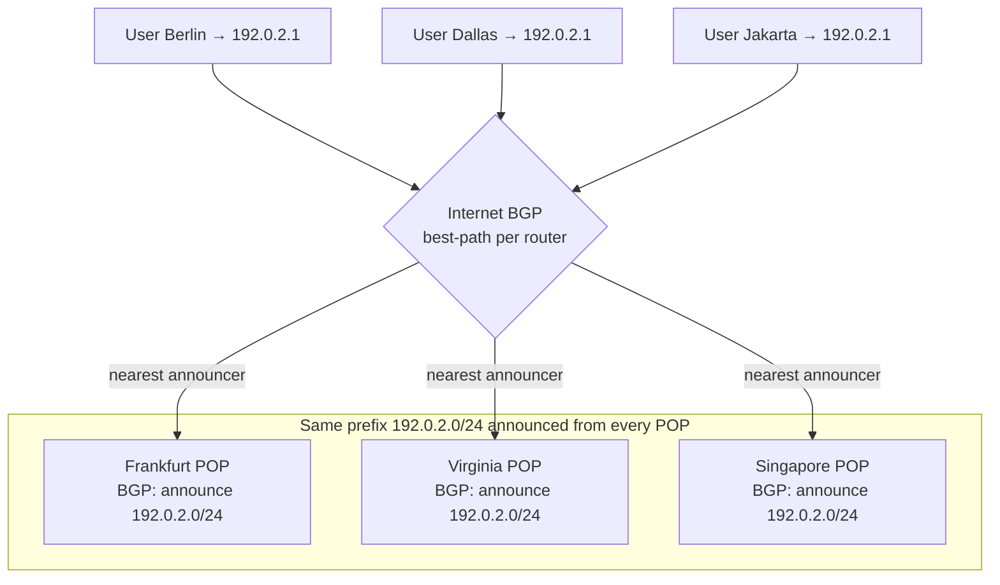
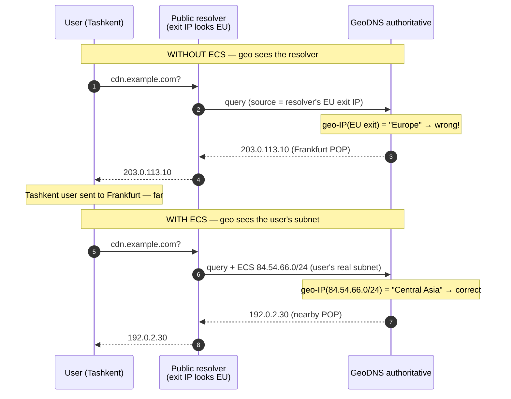

# GeoDNS & Anycast — Middle

<!-- level-focus -->
At middle level, focus on this question:

> Where does **GeoDNS & Anycast** belong in a maintainable component, and which trade-off selects the design?

Use the smallest realistic scenario that exposes the decision and its failure behavior.
---

## 1. What GeoDNS Actually Reads: Resolver IP vs ECS

A GeoDNS authoritative server does not talk to the end user. It receives a query from a **recursive resolver**, and it must decide *where the query came from* using only what is in that query. There are exactly two possible location signals:

1. **The source IP of the resolver** — the packet's source address on the UDP/53 query. This is the *default* and works with 100% of resolvers because it is just the packet header. It answers the question "where is the resolver?" — which is only a proxy for "where is the user?"
2. **The EDNS Client Subnet (ECS) option** — an optional EDNS0 extension (RFC 7871) in which the resolver *voluntarily* copies a truncated slice of the real client's IP into the query, e.g. `203.0.113.0/24`. This answers "where is the user?" directly, but only if the resolver chooses to send it.

The authoritative server runs whichever IP it has (ECS prefix if present, resolver IP otherwise) through a **geo-IP database** — a mapping from IP block to country/region/ASN — to pick a region, then returns the record configured for that region. The critical operational truth: **the accuracy of every GeoDNS answer is capped by the accuracy of this location signal.** With resolver IP, you are geolocating the resolver; with ECS you are geolocating a `/24`-sized neighborhood of the user. Everything in §6 flows from this.

> The geo-IP database is a guess table, refreshed periodically. It carries errors (IP blocks reassigned across regions, VPN exit nodes, satellite ISPs). Treat GeoDNS location as *probabilistic*, never authoritative.

---

## 2. Routing Policies: Geo vs Latency vs Weighted

Every managed DNS provider (Route 53, NS1, Cloudflare, Google Cloud DNS, Azure) exposes the same family of **routing policies** on a record set. They all return a single IP; they differ in *how they pick which IP*.

- **Geolocation routing** — bucket the query's location into a region/country and return the record mapped to that bucket. Purely map-based. Best for *policy* routing ("EU users must stay on EU servers for data residency") and for content localization (language, legal). It does **not** know which POP is actually fastest — only which region the query fell into.
- **Latency-based routing** — return the record for the POP with the lowest *measured* network latency to the querying location. The provider continuously measures RTT from network regions to each of its POPs and returns the winner. Optimizes for real performance, not the map. A user physically near a border may be sent to a POP in the "next" region if the path there is faster.
- **Weighted routing** — return each candidate IP proportionally to an assigned weight (e.g. 80/20). This is *not* about geography at all; it is a traffic-splitting knob for **canary releases, blue-green shifts, and gradual migrations**. Weights are honored statistically across many queries, subject to caching.

These compose. A common production shape is *geo → then weighted within a region*: geolocation picks the region, weighted routing splits that region's traffic across two POP generations during a migration. Providers also layer **health checks / failover** on top of any policy so that unhealthy targets are removed from the answer pool.

| Policy | Decision input | Optimizes for | Typical use | Location-aware? |
|--------|----------------|---------------|-------------|-----------------|
| **Geolocation** | Region/country bucket from IP | Policy & localization | Data residency, per-region content, compliance | Yes (map-based) |
| **Latency-based** | Measured RTT to each POP | Real performance | "Nearest fast POP" for global apps | Yes (measurement-based) |
| **Weighted** | Assigned weights only | Controlled traffic split | Canary, blue-green, migration | No |
| **Failover** (overlay) | Health check status | Availability | Primary/secondary DR | No (health only) |

The distinction that trips people up: **geolocation ≠ latency.** Geolocation returns the record for *your region* even if a POP in a neighboring region has a faster path. Latency-based returns the *fastest* POP regardless of region boundaries. Choose geolocation when the constraint is legal/business ("must stay in region"); choose latency-based when the constraint is speed.

---

## 3. Config-Level Examples

The config shape is provider-agnostic. A **geolocation** policy on `cdn.example.com` is essentially a table of (region → answer):

```
# Geolocation routing (generic)
record: cdn.example.com  type: A  ttl: 60
  when client-region = "EU"      -> 203.0.113.10    # Frankfurt POP
  when client-region = "NA"      -> 198.51.100.20   # Virginia POP
  when client-region = "AP"      -> 192.0.2.30      # Singapore POP
  default (no match)             -> 198.51.100.20   # sensible fallback
```

A **weighted** split for a canary, same name, no geography:

```
# Weighted routing (generic) — 90/10 canary
record: api.example.com  type: A  ttl: 30
  answer 198.51.100.20  weight 90     # stable fleet
  answer 198.51.100.99  weight 10     # canary fleet
```

**Latency-based** routing is usually *implicit*: you attach each answer to a POP/region identifier and the provider's measurement fabric decides which to return — you do not write RTT numbers by hand:

```
# Latency-based routing (generic)
record: cdn.example.com  type: A  ttl: 60
  answer 203.0.113.10   region eu-central   # provider measures & picks
  answer 198.51.100.20  region us-east      # the lowest-latency answer
  answer 192.0.2.30     region ap-southeast # per querying location
```

Two config-level rules apply to *all* of these. First, the **TTL is your failover speed limit**: geo/latency/weighted answers are cached by resolvers for the TTL, so a change (or a health-check-driven removal) only reaches all users after the old TTL drains. Keep TTLs low (30–60s) on records you want to steer or fail over quickly. Second, **weights and geo buckets are honored *per query*, not per user** — caching means a single resolver may serve one cached answer to thousands of users, so splits are statistical, not exact.

---

## 4. Anycast Mechanics: One Prefix, Many BGP Announcements

Anycast has no DNS-side logic at all — the intelligence is entirely in **BGP routing**. The setup, concretely:

1. You own a routable IP **prefix** (e.g. `192.0.2.0/24`) and an **Autonomous System Number (ASN)**. A `/24` is the smallest IPv4 block the global routing table reliably accepts.
2. You stand up the same service on that prefix at **every POP** — Frankfurt, Virginia, Singapore, etc. Each POP runs a router that **announces `192.0.2.0/24` into BGP** with your ASN as origin.
3. Now the *same* prefix is originated from many places. Every router on the internet, running BGP's best-path selection, independently picks the *closest* announcer for that prefix — "closest" being BGP's notion (shortest AS-path, local preference, IGP metric), which correlates with but is not identical to geographic distance.
4. A user's packet to `192.0.2.1` is forwarded hop-by-hop toward *their* nearest announcer. Berlin's packet lands in Frankfurt; Dallas's in Virginia — same destination IP, different physical site.



**Failover is a BGP withdrawal, not a config edit.** If Frankfurt dies, its router *stops announcing* `192.0.2.0/24` (or health-check automation withdraws it). Within seconds, BGP reconverges and every router that was steering to Frankfurt now picks the next-closest announcer — Virginia, say — using the *same* IP. No TTL, no DNS change, no client action. This self-healing is the whole reason anycast dominates availability-critical infrastructure. The failure domain of a POP is drained by the routing protocol itself.

---

## 5. Why Anycast Fits DNS and Stateless UDP

Anycast has one structural weakness: **the site your packets reach can change mid-flow.** If BGP reconverges (a link flaps, an announcement is withdrawn), packets that were going to Frankfurt may suddenly go to Virginia. For a protocol that keeps per-connection state on the server, that is a broken connection. So anycast is a perfect fit *precisely when there is no long-lived per-site state to break*:

- **DNS queries** are the canonical case: a single UDP request, a single UDP response, no session. If the second query in a burst lands at a different POP, nobody cares — every POP holds the same zone data and answers identically. This is why the root servers, TLDs, `1.1.1.1`, and `8.8.8.8` are all anycast.
- **Stateless UDP request/response** in general — NTP, short-lived query/response protocols — tolerate a mid-stream POP switch because each datagram is self-contained.
- **CDN cache hits over anycast** work because any edge can serve the same cached object; a re-route just means a (still-nearby) different edge answers.

The uncomfortable cases are **long-lived stateful sessions**: TCP connections and (classically) TLS sessions assume the same endpoint for the connection's lifetime. In practice anycast *does* carry huge amounts of TCP/HTTPS because BGP is stable on the timescale of a typical connection — a reconvergence rarely happens mid-request. But the risk is real, which is why anycast is layered carefully for stateful traffic (short connections, connection-level retries, and keeping the anycast layer in front of a *stateless* tier). The clean rule: **anycast is safest where any replica can answer any packet with no shared session state.** DNS is the archetype; that is why it is the first thing people put behind anycast.

---

## 6. The Accuracy Problem and How ECS Fixes It

This is the defining operational limitation of GeoDNS, and §1 set it up: **GeoDNS sees the resolver's location, not the user's.** When a user in Tashkent uses a public resolver whose query exits from, say, a European or US data center, the authoritative server geolocates *that exit IP* and returns the wrong-region POP. The user is now anchored to a far POP for the whole TTL. The mismatch:



**ECS (RFC 7871)** closes the gap: the resolver includes a *truncated prefix* of the real client's address (commonly a `/24` for IPv4, `/56` for IPv6) in the EDNS0 option of its upstream query. Now the authoritative server geolocates the **user's neighborhood** instead of the resolver's exit. Key mechanics and caveats:

- **It is opt-in on both sides.** The resolver must *send* ECS, and the authoritative server must *honor* it. Many public resolvers (notably some privacy-focused ones) deliberately omit ECS because it leaks a coarse hint of the user's location upstream.
- **It is a truncated prefix, not the full IP** — enough to place the neighborhood, not to identify the household. RFC 7871 frames this explicitly as a privacy/accuracy trade-off.
- **It fragments the cache.** ECS-aware answers are cached per client-subnet (the resolver must key its cache by the scope the authoritative returns), so an ECS zone has a much larger, more granular cache footprint than a plain zone. This is a real cost, not free accuracy.
- **Anycast is immune to this whole problem.** Because anycast never asks "where is the user?" — the *network* delivers packets to the nearest announcer based on where the real traffic enters — there is no resolver blind spot. This is one of anycast's clearest advantages over pure GeoDNS.

| | Signal used | Accuracy | Cost / caveat |
|---|-------------|----------|---------------|
| **GeoDNS, no ECS** | Resolver exit IP | Poor when resolver ≠ user location | Free, universal; wrong for public/remote resolvers |
| **GeoDNS, with ECS** | User's `/24` (or `/56`) subnet | Good — user neighborhood | Opt-in both sides; privacy leak; cache fragmentation |
| **Anycast** | Where packets actually enter the network | Good by construction | No resolver guess at all; needs BGP + IP space |

---

## 7. Combining the Two Layers

GeoDNS and anycast are not rivals — production CDNs run them as **layers**. A widespread pattern:

- **DNS layer (GeoDNS, often latency-based):** narrows the client to the right *provider or region* and returns an IP from that network. This is where policy (data residency), coarse geo, and traffic-splitting (weighted canary) live.
- **Network layer (anycast):** the IP returned is itself an anycast address, so BGP performs the fine-grained "nearest edge within that network" selection *and* provides second-scale failover if an edge dies.

The two layers cover each other's weaknesses. GeoDNS gives you *policy control* and *per-region traffic shaping* that anycast alone cannot express (BGP has no notion of "EU users only" or "10% to canary"). Anycast gives you *precise nearest-site steering* and *instant failover* that GeoDNS alone cannot achieve (bounded below by TTL, and blind to resolver location). Together: DNS picks the right region/network with policy; anycast picks the truly nearest edge and heals failures in seconds.

---

## 8. Operational Gotchas

- **TTL is your GeoDNS failover floor.** A dead POP keeps receiving traffic until every cached answer's TTL drains. Records you intend to steer or fail over should carry short TTLs (30–60s); accept the extra query load as the price of agility. Anycast has no such floor — withdraw the announcement and reconvergence handles it.
- **Weights and geo buckets are statistical, not exact.** Resolver caching means one cached answer serves many users. A "10% canary" weight is honored across the population of *queries*, not guaranteed per user; and a resolver serving a whole ISP can skew a small split.
- **ECS fragments and enlarges caches.** Turning on ECS multiplies the cache key space (per client-subnet). Budget for it; it is not a free accuracy upgrade.
- **Anycast reconvergence can break mid-flow state.** Safe for DNS/stateless UDP; risky for long-lived stateful sessions. Keep the anycast tier stateless, or in front of one, and lean on short connections and retries.
- **Geo-IP is stale and lossy.** IP blocks get reassigned across regions; VPNs and CGNAT muddy the map. Never treat a GeoDNS region decision as ground truth for anything security- or billing-critical.
- **`/24` is the minimum anycast prefix.** Anything smaller is filtered by many networks and will not route globally — anycast has a real barrier to entry (owned IP space, an ASN, BGP presence at each POP) that GeoDNS does not.

---

## 9. Key Takeaways

- **GeoDNS reads exactly one location signal per query:** the resolver's source IP by default, or an ECS prefix if the resolver sends one. Accuracy is capped by that signal.
- **Three routing policies, three jobs:** *geolocation* = map/policy (data residency, localization); *latency-based* = measured fastest POP; *weighted* = traffic splitting (canary/migration), no geography. Failover/health checks overlay any of them.
- **Anycast setup = one prefix announced from every POP via BGP.** Routers pick the nearest announcer; failover is a BGP *withdrawal* that reconverges in seconds — no TTL, no DNS change.
- **Anycast fits DNS and stateless UDP** precisely because any replica can answer any packet with no shared session state; a mid-flow re-route is harmless. Long-lived stateful sessions need care.
- **The GeoDNS accuracy problem** — it geolocates the resolver, not the user — is *the* defining limitation. **ECS (RFC 7871)** fixes it by carrying a truncated slice of the real client subnet, at the cost of opt-in support, a privacy leak, and cache fragmentation. Anycast sidesteps the problem entirely.
- Real CDNs **layer** them: GeoDNS/latency-based DNS for policy and region selection, anycast for nearest-edge steering and instant failover.

*Sources:* RFC 7871 (Client Subnet in DNS Queries); Cloudflare Learning Center — "What is Anycast?" and "What is DNS?".

*Next step:* [GeoDNS & Anycast — Senior](senior.md)

---

## Apply it

1. Find a real component where **GeoDNS & Anycast** affects an interface or dependency.
2. Write two plausible choices and the constraint that favors each one.
3. Make the smallest reversible change at that boundary.
4. Exercise the component alone, then exercise the integrated flow.
5. Keep the decision note with the evidence that selected the option.

## Verify your work

- A focused check proves the local behavior.
- An integrated check proves callers and dependencies still agree.
- Logs, traces, compiler output, or benchmarks expose the boundary.
- Reverting the change restores the previous behavior without unrelated edits.

## Review questions

- Which boundary is most affected by GeoDNS & Anycast?
- What constraint would make you choose the alternative design?
- How would you isolate a local defect from an integration defect?
- What evidence shows that the change remains maintainable?
