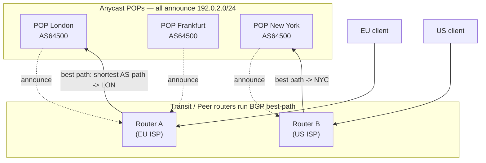
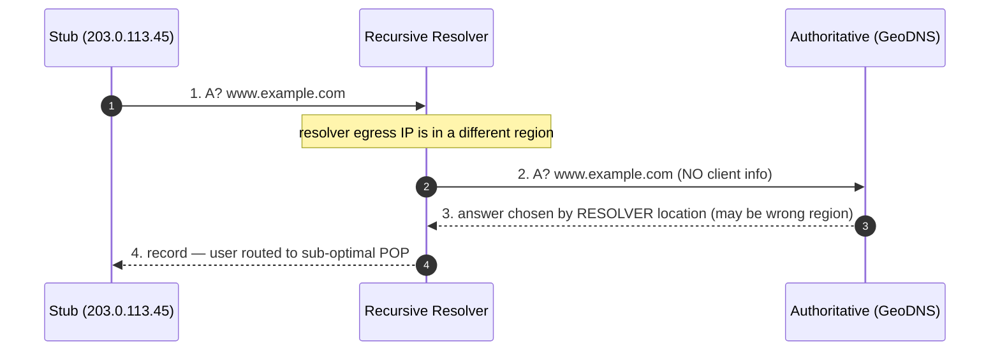

# GeoDNS & Anycast — Professional

<!-- level-focus -->
At professional level, focus on this question:

> How should teams adopt and operate **GeoDNS & Anycast** with measurable outcomes and limited coordination?

Use the smallest realistic scenario that exposes the decision and its failure behavior.
---

## 1. The Two Layers of "Geo": Routing vs. Application

"Geographic load balancing" is an overloaded phrase because two entirely different
mechanisms hide behind it, operating at different layers:

- **Anycast** works at **layer 3 (routing)**. The *same* IP address is reachable at
  many locations; the internet's routing fabric (BGP) decides which location a given
  packet reaches. Steering is implicit, per-packet, and controlled by inter-domain
  routing policy — the application is not consulted.
- **GeoDNS** works at **layer 7 (the DNS application)**. The authoritative server hands
  out *different* IP addresses to different queries based on where the query appears to
  originate. Steering is explicit, per-resolution, and controlled by the DNS operator's
  policy — but it only sees the *resolver's* location unless EDNS Client Subnet is used.

These are complementary and frequently stacked: GeoDNS returns a region-specific
**anycast VIP**, and anycast then absorbs the final hop within that region. The failure
domains differ, so it is essential to reason about them separately.

| Property | Anycast | GeoDNS |
|----------|---------|--------|
| Layer | 3 (IP routing / BGP) | 7 (DNS answers) |
| Decision maker | Transit/peer routers, per packet | Authoritative server, per query |
| Signal used | AS-path / routing policy | Resolver IP (or ECS client subnet) |
| Granularity of steering | Prefix (e.g., /24) | Per-name, per-answer |
| Reconvergence on failure | Seconds (BGP withdrawal) | TTL-bounded (client caches stale) |
| Client visibility | Invisible (same IP) | Visible (different IPs returned) |

---

## 2. Anycast at the Routing Layer: One Prefix, Many Origins

Anycast is not a protocol feature — it is a *deployment pattern* over ordinary BGP
(RFC 4271). The same IP prefix (say `192.0.2.0/24`) is **announced from multiple POPs**,
each of which either shares one origin AS or announces from distinct ASNs that belong to
the same operator. Every announcement is, from BGP's perspective, just another path to
reach that destination prefix.

The routing table on any given router therefore contains multiple candidate routes to
`192.0.2.0/24`. BGP's best-path algorithm collapses those candidates into **one**
next-hop for that router. The union of all clients whose nearest router selected a given
POP forms that POP's **catchment**.



Two invariants follow directly:

1. **No coordination between POPs is required.** Each POP simply announces the prefix;
   the network self-organises the catchments. This is why anycast withdrawal is such a
   clean failover primitive — pull the announcement at a POP and BGP re-steers its
   catchment to the next-best POP within reconvergence time.
2. **The same prefix must be reachable and identical at every POP.** Anycast is only
   safe for stateless or externally-synchronised workloads (DNS, HTTP with a shared
   backend, TLS-terminating proxies) because *any* POP may receive *any* packet, and
   mid-flow re-steering (path change) can silently break a stateful TCP connection.

---

## 3. BGP Best-Path Selection and Catchment Formation

To predict a catchment you must know how a router chooses among competing routes. BGP
best-path is a strict, ordered tie-break sequence (RFC 4271 §9.1 plus vendor extensions).
The routes that matter for anycast are usually distinguished only in the later steps,
because all announcements are for the *same* prefix. The canonical order:

1. **Highest `LOCAL_PREF`** — operator's own policy knob; overrides everything below it.
2. **Shortest `AS_PATH`** — fewest transit ASes to reach the origin. This is the dominant
   real-world differentiator between anycast POPs seen across the public internet.
3. **Lowest `ORIGIN`** type (IGP < EGP < INCOMPLETE).
4. **Lowest `MED`** — only compared between routes from the *same* neighbouring AS.
5. **eBGP over iBGP.**
6. **Lowest IGP metric to the BGP next-hop** ("hot-potato" — dump traffic to the nearest
   exit inside the local AS).
7. **Tie-breakers:** lowest router-ID, lowest peer address.

The practical consequence: an anycast operator steers catchments primarily by
**influencing AS-path length** (selective announcement, AS-path prepending to make a POP
*less* preferred) and by **negotiating `LOCAL_PREF` and communities** with peers. You do
*not* steer by latitude and longitude — those never appear in the algorithm.

---

## 4. Why Catchments Are Not Geography

The single most important professional insight: **catchments follow routing policy and
peering economics, not physical distance.** Several structural reasons:

- **AS-path length ≠ kilometres.** A client in Warsaw may reach a Frankfurt POP over a
  1-hop path but reach a *geographically closer* Berlin POP only via a 3-hop transit
  chain because the closer POP has no direct peering with that client's ISP. Shortest
  AS-path wins, so the farther POP can be selected.
- **Hot-potato routing.** A transit provider hands traffic to your prefix at the *first*
  exit that has a route, minimising *its* internal cost — which may fling a user's
  packets across a continent before they enter your network.
- **Peering vs. transit asymmetry.** Traffic reaching a POP via settlement-free peering
  is preferred by `LOCAL_PREF`, so a well-peered distant POP beats a transit-only near
  POP. Money, not metres.
- **Prefix aggregation and route leaks.** A more-specific announcement (a /24 vs. a
  covering /22) is always preferred regardless of AS-path; a mis-scoped more-specific at
  one POP can vacuum a global catchment.
- **Path asymmetry.** The forward path (client → POP) and the return path (POP → client)
  are chosen independently by different ASes, so RTT is *not* symmetric and a
  "closest" POP by forward AS-path may still deliver poor round-trip latency.

The operational takeaway: you **measure** catchments empirically (RIPE Atlas probes,
per-POP request-origin telemetry, `traceroute` from vantage points). You do not derive
them from a world map. When a POP is "serving the wrong continent," the fix lives in
BGP — prepending, community tagging, or withdrawing a leaked more-specific — not in any
geo-database.

---

## 5. Unicast vs. Anycast at the Routing Layer

| Dimension | Unicast (one IP → one location) | Anycast (one IP → many locations) |
|-----------|--------------------------------|-----------------------------------|
| Prefix origin | Single POP announces the prefix | Every POP announces the *same* prefix |
| Who steers the client | DNS answer / load balancer (L7) | BGP best-path per router (L3) |
| Steering signal | Application policy | AS-path, LOCAL_PREF, MED, IGP metric |
| Catchment control | Explicit, precise | Implicit, coarse (per-prefix), policy-driven |
| Failover | Requires DNS change + TTL wait, or LB health check | BGP withdrawal → reconverge in seconds |
| Statefulness | Safe for long-lived stateful TCP | Only safe if any POP can serve any packet, or flows are pinned |
| DDoS behaviour | Attack concentrates on one target | Attack is *dispersed* across catchments — key defensive property |
| Debuggability | Straightforward (one endpoint) | Hard — "which POP am I hitting?" varies by network position |
| Typical use | Origin servers, stateful APIs | DNS roots, CDN edges, DDoS-scrubbing frontends |

The DDoS row is the reason authoritative DNS and CDN edges are almost universally
anycast: a volumetric flood against an anycast prefix is naturally split across every
POP's catchment, so each POP absorbs only its local share instead of the whole attack
landing on a single machine.

---

## 6. GeoDNS: Resolver-Locality as a Proxy for Client Locality

GeoDNS answers a query with a location-appropriate record set. But a standard DNS query
carries **no information about the end user** — the authoritative server sees only the
source IP of the **recursive resolver** that forwards the query. GeoDNS therefore steers
on *resolver* location and *assumes* the resolver is near its users.

That assumption breaks for **centralised public resolvers** (large open resolvers whose
egress IPs may sit far from the actual user, or in a different country entirely). A user
in Sydney using a resolver that egresses in Singapore would, under plain GeoDNS, be
steered to a Singapore POP. EDNS Client Subnet exists precisely to repair this
resolver-vs-user mismatch by letting the resolver forward a truncated prefix of the
*client's* address to the authoritative server.



---

## 7. EDNS Client Subnet (RFC 7871): Wire Mechanics

EDNS Client Subnet (ECS) is an **EDNS0 option** (OPT pseudo-RR, option code 8) defined by
RFC 7871. The resolver includes a *prefix* of the client's address so the authoritative
server can tailor the answer. The option payload carries these fields:

| Field | Meaning |
|-------|---------|
| `FAMILY` | Address family: 1 = IPv4, 2 = IPv6 |
| `SOURCE PREFIX-LENGTH` | Number of significant bits the **resolver** is sending (e.g., 24 → send a /24) |
| `SCOPE PREFIX-LENGTH` | In the **response**, how many bits the **authoritative answer actually depends on** |
| `ADDRESS` | The client-subnet bits, truncated to `SOURCE PREFIX-LENGTH` and zero-padded to a byte boundary |

Two rules drive everything downstream:

- **The resolver truncates.** RFC 7871 explicitly directs resolvers to send *fewer* bits
  than the full client address (a /24 for IPv4, a /56 for IPv6 are the RFC's suggested
  privacy-preserving defaults). The full host address must never leave the resolver — ECS
  deliberately trades some steering precision for privacy.
- **`SCOPE` is set by the authoritative server in its reply** and tells the resolver the
  *granularity at which the answer varies.* If the authoritative answer is identical for
  the whole `/0` (no geo-differentiation for that name), it returns `SCOPE = 0`; if the
  answer depends on the full `/24` it sent, it echoes `SCOPE = 24`; it may even return a
  **larger** scope than the source, meaning "your query needs to be more specific."

```mermaid
sequenceDiagram
    autonumber
    participant Stub as Client 203.0.113.45
    participant Res as Resolver (ECS-aware)
    participant Auth as Authoritative + ECS
    Stub->>Res: 1. A? www.example.com
    Note over Res: truncate client /24 -> 203.0.113.0/24
    Res->>Auth: 2. A? www.example.com  OPT[ECS: family=1 source=24 scope=0 addr=203.0.113.0]
    Note over Auth: pick region for 203.0.113.0/24; answer varies at /24
    Auth-->>Res: 3. answer  OPT[ECS: source=24 SCOPE=24 addr=203.0.113.0]
    Note over Res: cache keyed by (name, type, 203.0.113.0/24) because SCOPE=24
    Res-->>Stub: 4. region-optimal record
```

The `SCOPE` field is the linchpin of correct caching: the resolver **must** key its cache
entry to the returned scope, not the source. If it caches a scope-24 answer as though it
covered a /8, it will serve one region's answer to a different region.

---

## 8. ECS and the Authoritative Cache-Key Explosion

Without ECS, an authoritative name's answer is cacheable per `(qname, qtype)` — a single
entry serves the whole internet. ECS **shatters the cache key into per-subnet entries**.

The cache key becomes `(qname, qtype, client-subnet@scope)`. If a name is answered with
`SCOPE = 24`, then there is a distinct cache entry for **every /24 that queries it**. The
theoretical IPv4 cardinality is ~16.7 million /24s; the practical working set is the set
of client /24s that actively query the name, which for a popular name is still hundreds of
thousands to millions of distinct entries.

The multiplier is exponential in the scope length. Roughly, for IPv4:

```
entries per name  ≈  number of distinct client subnets at the chosen SCOPE
worst case at /24 ≈  2^(32-24) per /16 present  =  256 subnets per /16
                     × active /16s  →  easily 10^5–10^6 live keys per hot name
```

This tax lands in three places:

1. **Authoritative server memory / response cache.** Answer computation and any internal
   memoisation now scale with subnet cardinality, not with name cardinality.
2. **Recursive resolver cache.** The resolver holds a separate cached answer per scoped
   subnet, so its DNS cache footprint for ECS names balloons; effective hit-rate per
   entry drops because each entry serves a narrower slice of traffic.
3. **CDN mapping / geo-database lookups.** Every distinct subnet may trigger a fresh
   mapping computation on cache-miss, increasing authoritative CPU.

**Scope discipline is the primary mitigation.** An authoritative operator returns the
*coarsest* `SCOPE` that still yields correct steering. If a whole /16 maps to the same
POP, return `SCOPE = 16` instead of `SCOPE = 24` — that immediately reduces the cache
cardinality by 256×. Returning `SCOPE = 0` for names that don't need geo-steering (e.g.,
records fronted by anycast anyway) opts them out of the explosion entirely while still
being ECS-compliant.

---

## 9. ECS × Resolver Caching Interaction

The resolver sits between the explosion and the client, and RFC 7871 imposes precise
caching obligations on it:

- **Key on returned `SCOPE`, not sent `SOURCE`.** A cached entry with `SCOPE = n` is valid
  only for clients within that same n-bit prefix. A subsequent query from a client in a
  *different* n-bit prefix is a cache **miss** and must be re-forwarded upstream with that
  client's subnet.
- **`SCOPE = 0` collapses back to a shared entry.** When the authoritative answer does not
  depend on client subnet, the resolver caches one entry for all clients — the ECS cost
  disappears for that name. This is why opting non-geo names out matters.
- **Non-ECS clients and privacy.** A resolver may be ECS-aware upstream but must still be
  able to serve clients that themselves send no ECS. RFC 7871 recommends resolvers *not*
  forward ECS to authoritatives that don't support it, and lets operators run an ECS
  allow-list so client subnets aren't leaked to servers that can't use them.
- **TTL still bounds staleness independently.** ECS scoping controls *which* answer is
  reused; the record TTL controls *how long*. Both must be honoured — a scope-24 entry
  still expires at its TTL.

The net effect: ECS multiplies the *number* of cache entries a resolver maintains, which
lowers per-entry reuse and raises miss traffic to the authoritative — the opposite of what
DNS caching normally optimises for. This is the fundamental tension: **ECS trades cache
efficiency for steering accuracy.**

---

## 10. ECS On vs. Off: Accuracy vs. Cache Cost

| Dimension | ECS OFF (steer on resolver IP) | ECS ON (steer on client subnet) |
|-----------|-------------------------------|----------------------------------|
| Steering signal | Resolver egress IP | Truncated client prefix (e.g., /24) |
| Accuracy for local resolvers | Good | Marginally better |
| Accuracy for centralised public resolvers | Poor (resolver ≠ user region) | Good — the primary reason ECS exists |
| Authoritative cache key | `(name, type)` — one entry per name | `(name, type, subnet@scope)` — up to millions per name |
| Resolver cache footprint | Small, high reuse | Large, low per-entry reuse |
| Authoritative CPU on miss | Low | Higher (per-subnet mapping) |
| Privacy | Client address never leaves resolver | Truncated client prefix exposed to authoritative |
| Correctness knob | n/a | `SCOPE` length — coarser = cheaper & less precise |
| Best when | Users are near their resolver; anycast fronts the answer | Users behind far-away public resolvers; fine geo-steering required |

The decision is not binary across your whole zone. The professional pattern is
**per-name**: enable ECS with a tight, well-chosen `SCOPE` only for the names whose
steering genuinely improves user latency, and return `SCOPE = 0` for everything else —
especially names already fronted by anycast, where L3 routing already does the geo-work
and ECS would only add cache cost with no accuracy gain.

---

## 11. Failure Modes and Correctness Traps

- **Scope-cache poisoning by a buggy resolver.** A resolver that keys on `SOURCE` instead
  of `SCOPE` serves one region's answer to another. Symptom: users in region A get region
  B's POP intermittently. Cause lives in the resolver, not the authoritative.
- **Over-broad `SCOPE` from the authoritative.** Returning `SCOPE = 0` while the answer
  actually varies causes the resolver to reuse a single answer for everyone — geo-steering
  silently disappears. Returning a too-narrow scope inflates cache cardinality needlessly.
- **ECS leak to non-supporting servers.** Forwarding client subnets to authoritatives that
  ignore ECS leaks client-locality data with no benefit. Use an allow-list.
- **Anycast + stateful flows.** A BGP reconvergence mid-connection re-steers packets to a
  new POP that has no TCP state → connection reset. Only front stateless or
  shared-backend workloads with anycast, or pin flows (e.g., stable ECMP hashing) so a
  given 5-tuple stays on one POP.
- **More-specific leak.** A stray /24 announced at one POP over-preferred by longest-prefix
  match can pull a global catchment onto a single site. Monitor announced prefixes and
  guard against route leaks.
- **Assuming forward RTT = reverse RTT.** Catchment measurement based on one-way AS-path
  hides poor return paths; always measure round-trip from real vantage points.

---

## Apply it

1. Define the user or business outcome that **GeoDNS & Anycast** should improve.
2. Assign one owner for code, contracts, operations, and incidents.
3. Split delivery into reversible increments that produce evidence early.
4. Publish responsibilities, escalation paths, and compatibility windows.
5. Stop or expand only when the agreed measures support that decision.

## Verify your work

- Each increment has an owner, rollback path, and observable exit condition.
- Adoption, reliability, delivery time, and coordination cost are measured.
- Incident and migration exercises prove that responsibility is executable.
- The old path is removed only after telemetry proves it is unused.

## Review questions

- Which measurable outcome justifies investing in GeoDNS & Anycast?
- Which team owns the full lifecycle and incident response?
- What reversible increment produces the earliest useful evidence?
- Which exit condition proves that migration or adoption is complete?
