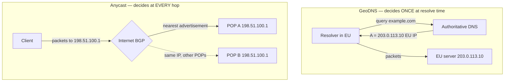
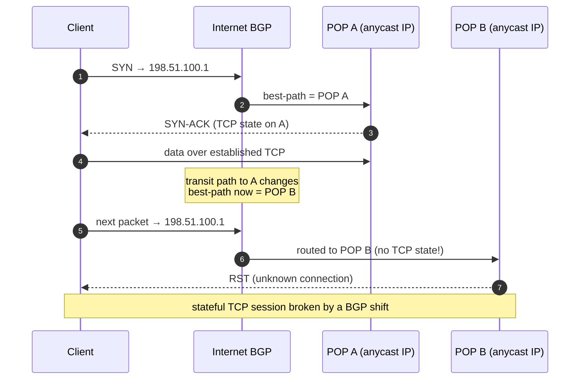
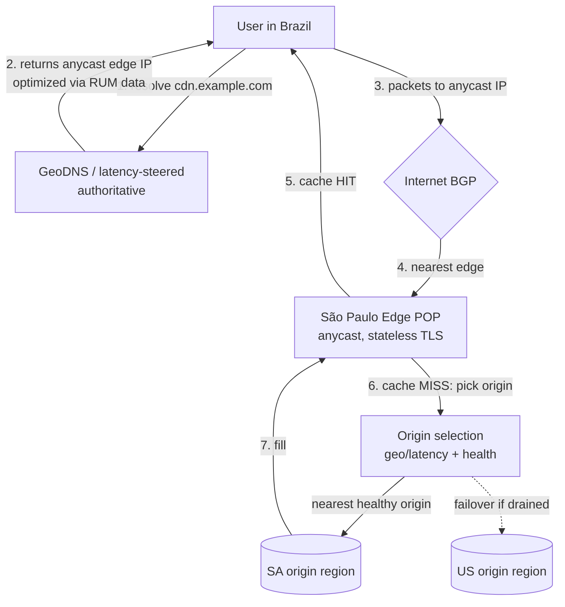

# GeoDNS & Anycast — Senior

<!-- level-focus -->
At senior level, focus on this question:

> Which system invariant is affected by **GeoDNS & Anycast** under failure, load, and change?

Use the smallest realistic scenario that exposes the decision and its failure behavior.
## 1. The Two Levers, Precisely

Both techniques answer "which of my many locations should serve this user?" but they answer at different layers, and that layer difference is the whole design.

- **GeoDNS** answers *at resolution time, in the control plane.* The authoritative DNS server inspects the resolver's location (or the client's, with ECS) and returns a **different A/AAAA answer** per region. Steering happens once, before any packet reaches your infrastructure. It is a **routing decision baked into a name→IP mapping**, cached for the TTL.
- **Anycast** answers *at every hop, in the data plane.* You advertise the **same IP prefix** from many POPs via BGP; the internet's routing fabric delivers each packet to the topologically nearest advertisement. Steering happens continuously, per-packet, and you do not control it — tens of thousands of independent networks do.

The consequences cascade from this one difference. GeoDNS steering is **sticky for a TTL** and reflects *your* explicit policy; anycast steering is **live** and reflects the *internet's* current view of shortest AS-path. GeoDNS lets you send Brazil to São Paulo with surgical intent; anycast might send Brazil to Miami because a transit provider's path there is shorter in BGP terms even though it is farther in milliseconds. GeoDNS failover takes a TTL to propagate; anycast failover is automatic the instant a POP withdraws its route — but that same automation is what makes anycast *flap*.

---

## 2. GeoDNS vs Anycast — The Core Comparison

| Dimension | GeoDNS (latency/geo steering) | Anycast (same IP, BGP-routed) |
|---|---|---|
| **Where the decision is made** | Control plane, at resolve time | Data plane, per-packet at every hop |
| **Who controls it** | You (your authoritative DNS policy) | The internet's BGP fabric (out of your hands) |
| **Steering accuracy** | High if you have good geo/latency data + ECS; can be surgical per-region | Approximate — follows shortest **AS-path**, which ≠ shortest RTT |
| **Reacts to congestion/latency in real time** | No — decision is frozen for the TTL | No directly, but path changes as BGP updates; sub-minute reconvergence |
| **Failover speed** | Bounded by TTL + resolver cache staleness (often minutes despite low TTL) | Near-instant on route withdrawal (seconds) — huge win for availability |
| **Statefulness** | Fine for stateful — a client keeps hitting the same IP for the TTL | **Risky for stateful TCP** — a mid-connection reroute lands packets at a different POP → RST |
| **Granularity** | Coarse: per-resolver, or per-/24 with ECS | Per-flow, but you cannot express "EU→Frankfurt" policy |
| **IP footprint** | Many IPs (one+ per region) | One IP (or one small prefix) advertised everywhere |
| **DDoS posture** | Attack concentrates on the target region's IPs | **Excellent** — attack traffic is absorbed and dispersed across all POPs |
| **Operational complexity** | DNS config + geo database maintenance | BGP peering, route health injection, prefix hygiene |
| **Cost** | Cheap (DNS features); geo-DB licensing | Requires your own ASN, IP space, peering/transit relationships |
| **Primary failure mode** | Stale/incorrect geo DB → users sent the wrong way | BGP misroute / route leak / flap → traffic to wrong or dead POP |

The headline: **GeoDNS gives you control and accuracy; anycast gives you failover speed, DDoS resilience, and a single IP.** They fail in opposite ways, which is exactly why serious architectures use both (§5).

---

## 3. Why Anycast Shifts and Flaps Under BGP

Anycast has no notion of "sessions." Each packet is independently routed to whichever POP currently wins the BGP best-path selection for its source. That winner can change at any moment because BGP is a distributed, path-vector protocol reconverging constantly across the whole internet.

Triggers that move a client from POP A to POP B **mid-stream**:

- A transit provider withdraws or re-announces a path (maintenance, link flap, congestion-driven de-pref).
- Your own POP adjusts its announcement (you drain it, or its route-health-injection daemon withdraws because a health check failed).
- A peer's route changes AS-path length or local-pref, tipping best-path selection.
- Route flap: a link bouncing up/down repeatedly re-advertises, oscillating the winner until dampening kicks in.

**Why this is fine for DNS/UDP.** A DNS query is a single request/response (often one UDP datagram). If the next query lands on a different POP, no state is lost — every POP can answer independently and identically. This is precisely why the root and TLD servers, and every large recursive resolver (1.1.1.1, 8.8.8.8), are anycast: the workload is stateless per request, so per-packet POP shifts are invisible.

**Why it endangers stateful TCP.** A long-lived TCP connection holds state (sequence numbers, TLS session, application context) *on one machine*. A mid-connection reroute delivers packets to a POP that never saw the handshake → immediate RST → connection reset. For short-lived HTTPS this is a rare, retryable blip; for long connections (large uploads, WebSockets, streaming, database protocols) it is a real outage for that flow.

**Why modern stateless edges tolerate it.** CDN/edge POPs are built so any POP can terminate any connection: TLS session tickets are shared or re-negotiable, requests are idempotent and short, and there is no per-connection server affinity beyond the request. A reroute costs at most one connection re-establishment. The design principle: **make the edge stateless enough that a POP shift is a reconnect, not a data-loss event.** In practice large anycast networks also keep POP announcements stable (they don't juggle prefixes) so shifts are the exception, not the norm — but you architect assuming they can happen.

---

## 4. Statefulness: The Deciding Axis

If you remember one rule, make it this: **the statefulness of the workload decides whether anycast is safe on the data path.**

| Workload | Behavior on POP shift | Anycast verdict |
|---|---|---|
| DNS query (UDP, single round trip) | Next query answered identically elsewhere | Ideal — anycast is the standard |
| Short HTTPS request (stateless edge) | At worst one reconnect; request retried | Safe — CDN default |
| Long upload / streaming / WebSocket | Mid-flow reroute → RST → visible failure | Risky — mitigate or avoid |
| Database / RPC session with affinity | State lost; must re-establish and possibly re-auth | Avoid on the anycast path |

Mitigations when you *must* run stateful traffic near anycast:

- **Keep announcements stable** — never flap prefixes for load reasons; use GeoDNS for that.
- **Anycast only the front door.** Terminate TCP/TLS at the anycast edge, then carry state internally over unicast to a specific backend. The volatile hop is only client↔edge, which is short.
- **Graceful drain** (§8) — stop attracting *new* flows before withdrawing, letting existing ones finish.
- **Make flows resumable** — chunked/resumable uploads, WebSocket auto-reconnect with offset, so a reset costs a retry, not a restart.

For genuinely long-lived stateful sessions where affinity matters, **GeoDNS is the safer lever**: the client resolves once to a stable regional IP and stays pinned there for the session, immune to BGP churn.

---

## 5. How CDNs Combine Both (Anycast Edge + Geo-Steered Origin)

Real global CDNs do not choose — they layer the two so each covers the other's weakness. Anycast gets the user to a *nearby edge fast and with DDoS resilience*; GeoDNS/latency steering then picks the *right origin or region* with accuracy anycast can't provide.

The division of labor:

- **DNS layer (GeoDNS + real-user-monitoring/latency steering):** decides *which anycast IP or edge cluster* to hand the user, using RUM/latency telemetry — better than raw geography, and it can pull a whole region out of rotation for maintenance by changing answers. Some providers return a *unicast* IP per POP here instead of anycast, using DNS itself as the geo-steerer; others hand out an anycast IP and let BGP do proximity.
- **BGP layer (anycast):** gets packets to the closest live edge and *absorbs DDoS* across the fleet. Its instant route-withdrawal failover means a dead POP stops receiving traffic in seconds — far faster than any DNS TTL.
- **Edge→origin layer (geo/latency steering again):** on cache miss, the edge chooses the nearest *healthy* origin/region, with explicit failover policy. This is stateful-ish and internal, so it uses accurate steering, not BGP guessing.

The synergy resolves both weaknesses: anycast's poor **accuracy** is corrected by DNS-layer RUM steering choosing the right cluster; GeoDNS's slow **failover** is corrected by anycast withdrawing dead POPs instantly within the cluster. You get accurate placement *and* fast failover — neither technique alone delivers both.

---

## 6. EDNS Client Subnet — Accuracy vs Privacy vs Cache Cost

GeoDNS accuracy hinges on knowing where the *client* is. Without help, the authoritative server sees only the **recursive resolver's** IP. If a user in Brazil uses a public resolver egressing from Virginia, GeoDNS sends them to a US edge — the classic "public DNS defeats GeoDNS" problem.

**EDNS Client Subnet (ECS, RFC 7871)** fixes accuracy: the recursive resolver forwards a truncated client prefix (typically a /24 for IPv4) in the query, so the authoritative server steers on the *client's* network, not the resolver's. The tradeoffs are real and you own them:

| Concern | Without ECS | With ECS |
|---|---|---|
| **Steering accuracy** | Poor when resolver ≠ client region | Good — steers on client /24 |
| **Privacy** | Only resolver IP leaked to auth | Client subnet leaked to every auth in the chain — a privacy regression, why some resolvers strip it |
| **Cache efficiency** | One cached answer per name (compact) | One answer **per client-subnet scope** → cache fragmentation, cardinality explosion, lower hit rate |
| **Resolver support** | Universal | Inconsistent; some public resolvers disable/limit ECS |

The cache cost is the sharp edge for senior design: ECS multiplies cache entries by the number of distinct client scopes you answer differently for. Coarse scopes (advertise a wide `SCOPE PREFIX-LENGTH`) keep the cache compact but blunt your accuracy; fine scopes maximize accuracy but shred the cache. Choose scope width to match how granular your POP map actually is — advertising /24 accuracy when your POPs only differ by continent just burns cache for nothing.

---

## 7. Failure Modes and How They Present

The failures below are the ones that page you. Each has a distinctive signature; recognizing the signature fast is the senior skill.

**BGP misroute / route leak.** A peer or transit provider announces or accepts your prefix incorrectly, pulling traffic toward the wrong POP or a black hole. Signature: a *sudden geographic block* of users sees latency spikes or timeouts; traffic graphs show a POP gaining load it shouldn't or losing load it should have. Anycast makes this both more likely (you depend on global BGP hygiene) and more contained (only the leaked prefix's users). Defenses: RPKI ROAs to authorize your announcements, prefix filtering with peers, and monitoring your prefixes from external vantage points.

**POP drain gone wrong / hard POP loss.** A POP fails or is drained abruptly. Anycast reconverges automatically — good — but if it drops *while holding live TCP flows*, those flows RST (§3). Signature: a spike of connection resets and retries localized to the users that POP served, then recovery as they re-establish on the next-nearest POP. A drain that withdraws routes *before* stopping traffic acceptance turns this from a reset storm into a clean handoff (§8).

**Geo database error — users sent the wrong way.** The IP-geolocation DB is stale or wrong: a new IP block is mapped to the wrong country, or a carrier re-IPs. GeoDNS then confidently steers a whole population to a distant region. Signature: a *specific ISP/ASN or IP range* shows persistently high latency while neighbors are fine — not a POP outage, a *mapping* outage. This is insidious because everything is "healthy": no errors, just users needlessly far from their data. Defenses: prefer RUM/latency-measured steering over pure IP-geo where possible, keep the geo DB fresh, and alert on per-ASN latency regressions, not just per-POP health.

**Uneven POP load.** Anycast distributes by *topology*, not by *capacity*. A POP near a dense population or a major peering hub attracts disproportionate traffic and saturates while others idle. Signature: one POP at 90% CPU/bandwidth while siblings sit at 30%, with no config explaining it — the internet's shape is the cause. Anycast gives you *no direct knob* to rebalance. The fix lives at the DNS layer: use GeoDNS/latency steering to shed load off the hot POP (hand some of its users a different edge), or add capacity/peering at the hot location. This is a concrete case where you *must* combine both techniques — anycast alone cannot balance load.

---

## 8. POP Drain: Doing It Safely

Draining a POP for maintenance is where the anycast/stateful tension bites in daily operations. The wrong order resets live connections; the right order is invisible to users.

**Wrong order (reset storm):** stop the POP → routes withdraw as the box dies → in-flight TCP flows suddenly reroute to another POP that has no state → RST storm → user-visible errors and retries.

**Right order (graceful drain):**

1. **Stop attracting new flows first.** Withdraw the anycast announcement (or de-preference it via AS-path prepending / lowered local-pref) so *new* connections route to other POPs. Simultaneously, if a DNS layer fronts this POP, pull it from DNS rotation so new resolutions stop pointing here.
2. **Let existing flows finish.** Keep the POP serving *established* connections for a drain window sized to your flow lifetimes (seconds for HTTP, longer for uploads/streams). New traffic is already going elsewhere.
3. **Verify the POP is quiet,** then take it down for maintenance. No RSTs, because nothing live remains.

The DNS layer and BGP layer cooperate here: DNS stops *new* resolutions cheaply and quickly for the front IP, while BGP withdrawal stops *new* packet flows for the anycast IP — and only *after* draining do you kill the node. This is the operational payoff of the layered design in §5.

---

## 9. When Each Technique Wins

**Anycast wins when:**

- The workload is **stateless per request** — DNS, resolvers, stateless HTTP/edge caching. POP shifts are free.
- You need **fast automatic failover** — route withdrawal beats any DNS TTL by orders of magnitude.
- You need **DDoS absorption** — one IP dispersed across a global fleet dilutes any attack.
- You want a **single, memorable IP** advertised everywhere (public DNS, root servers).

**GeoDNS / latency steering wins when:**

- You need **accurate, policy-driven placement** — "EU users to Frankfurt, always" — that BGP AS-path can't express.
- You must **balance load by capacity**, not topology — anycast can't rebalance a hot POP; DNS can shed it.
- The session is **long-lived and stateful with affinity** — pin the client to a stable regional IP for the session, immune to BGP churn.
- You want **regional maintenance control** — pull a whole region from rotation by changing answers.
- You **lack your own ASN/IP space and peering** — GeoDNS needs none of that.

**Use both (the real-world default) when:**

- You run a **global CDN or edge platform**: anycast for fast, DDoS-resilient proximity to a stateless edge; GeoDNS/RUM steering to correct anycast's accuracy at the DNS layer and to pick the right origin on cache miss; graceful drain to bridge the stateful gap. This is not belt-and-suspenders — each layer is *load-bearing* for a weakness the other cannot cover: anycast can't do accurate placement or capacity balancing; GeoDNS can't fail over in seconds or absorb DDoS.

---

## 10. Senior Checklist

- [ ] Every anycast IP carries only **stateless-tolerant** traffic; long-lived stateful flows are pinned via GeoDNS or terminated at the edge with unicast internal state.
- [ ] Anycast prefix announcements are **stable** — never flapped for load; RPKI ROAs published and peer prefix-filtering verified.
- [ ] Prefixes are **monitored from external vantage points**, not just internally, to catch route leaks and misroutes.
- [ ] Per-ASN / per-subnet **latency regressions alert independently** of per-POP health checks (to catch geo-DB mapping errors that look "healthy").
- [ ] GeoDNS steering uses **RUM/latency data** where available, not raw IP-geo alone; geo database refresh cadence is defined.
- [ ] **ECS scope width** is chosen to match actual POP granularity, with the cache-fragmentation cost understood and accepted.
- [ ] **POP drain runbook** withdraws routes / pulls DNS *before* stopping traffic acceptance; drain window sized to flow lifetimes; tested in a game day.
- [ ] A plan exists to **rebalance an overloaded POP** via the DNS layer, since anycast alone offers no load knob.

*Next step:* [GeoDNS & Anycast — Professional](professional.md)

---

## Apply it

1. State the system invariant that **GeoDNS & Anycast** must protect.
2. Mark ownership, state, and failure propagation at each boundary.
3. Compare two designs under load, dependency failure, and future change.
4. Define recovery and compatibility behavior before implementation.
5. Test the riskiest assumption with a focused experiment.

## Verify your work

- The experiment supports the design with evidence, not preference.
- Failure injection shows the blast radius and recovery path.
- Compatibility checks cover old and new callers or data.
- Operational signals reveal invariant violations and recovery progress.

## Review questions

- Which invariant must remain true when GeoDNS & Anycast fails?
- Where should recovery responsibility live, and why?
- Which assumption deserves an experiment before implementation?
- How can the design evolve without changing every consumer at once?
