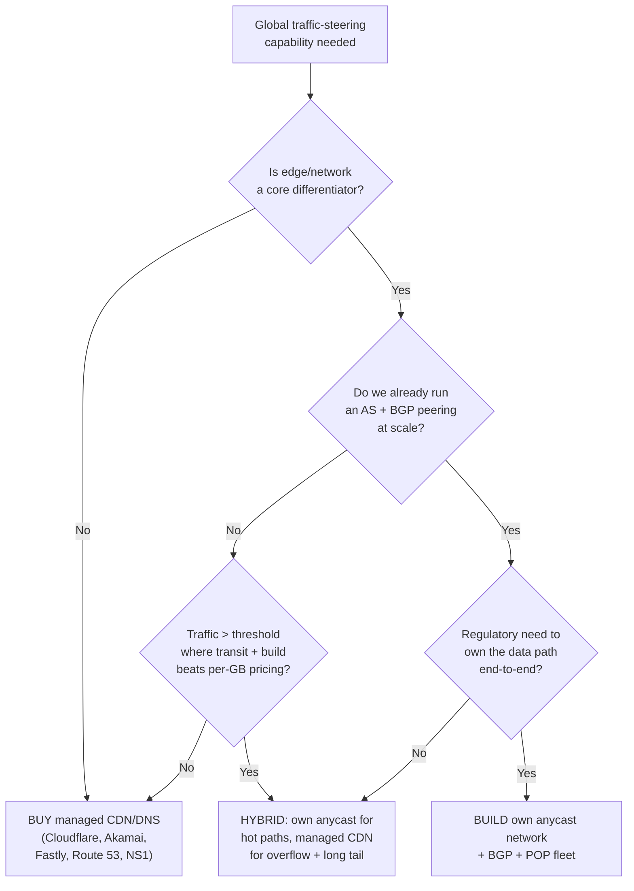
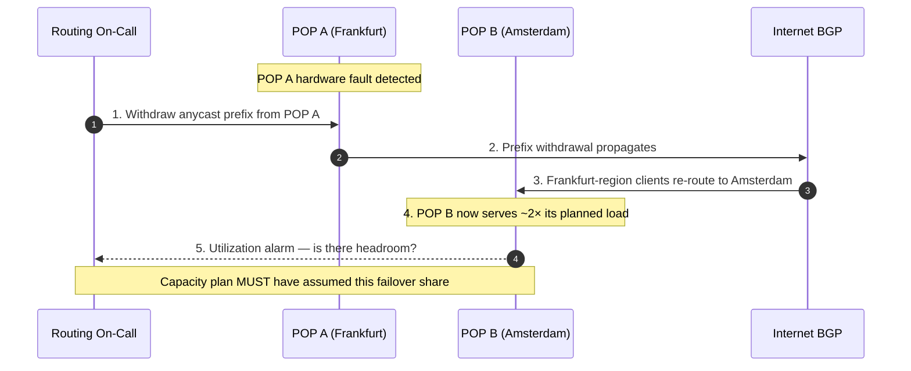
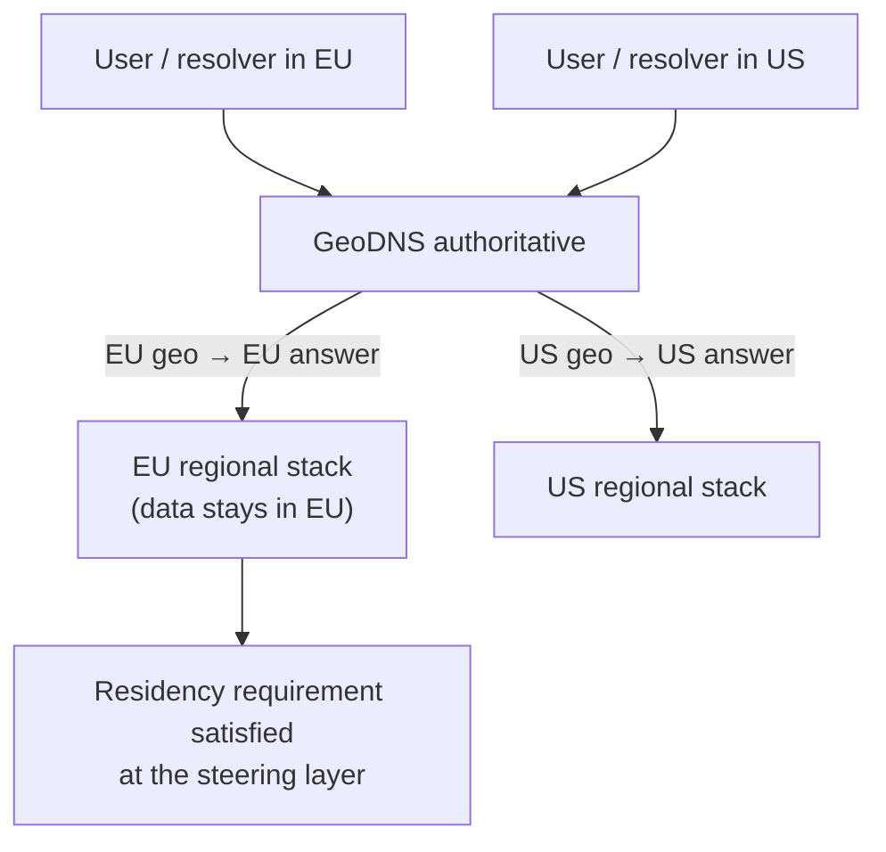
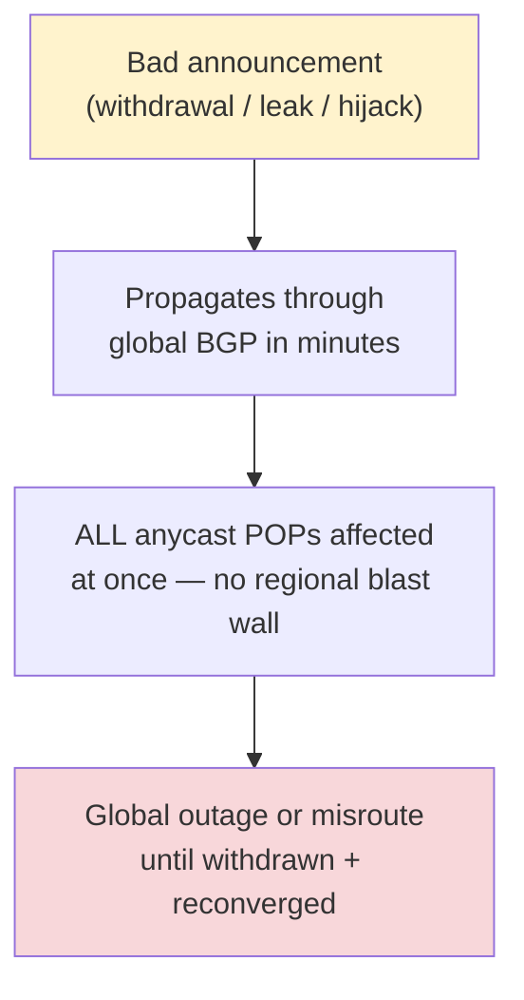
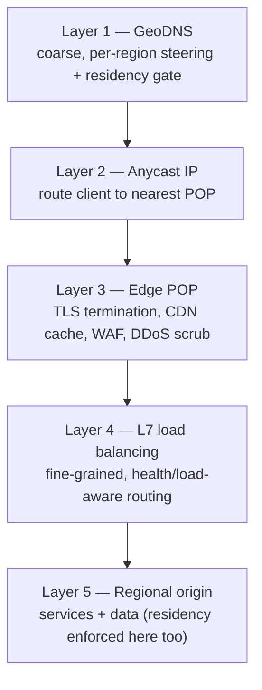

# GeoDNS & Anycast — Staff

> **Axis:** organizational scope & judgment — NOT deeper protocol theory (that is `professional.md`).
> This file answers the questions a Staff/Principal engineer actually gets asked in a
> planning review: *do we run our own anycast network and speak BGP, or do we buy a
> managed CDN/DNS that already has 300 POPs?* What does it cost — in dollars, in headcount,
> in blast radius — to steer global traffic ourselves? When does forcing a user into a
> region become a legal requirement rather than a performance nicety? What is our privacy
> stance on ECS? Where does all of this sit inside a *coherent edge strategy* rather than
> a pile of DNS hacks?

---

## Table of Contents

1. [Scope of Influence — Why This Is a Staff Decision](#1-scope-of-influence--why-this-is-a-staff-decision)
2. [The Two Mechanisms, Restated as Investments](#2-the-two-mechanisms-restated-as-investments)
3. [Build-vs-Buy: The Central Decision](#3-build-vs-buy-the-central-decision)
4. [The Real Operational Cost of Running Anycast](#4-the-real-operational-cost-of-running-anycast)
5. [Cost & ROI Lens — Where the Break-Even Actually Is](#5-cost--roi-lens--where-the-break-even-actually-is)
6. [Regulatory & Data-Residency Steering with GeoDNS](#6-regulatory--data-residency-steering-with-geodns)
7. [The ECS Privacy Stance](#7-the-ecs-privacy-stance)
8. [Blast Radius of a Bad BGP Announcement](#8-blast-radius-of-a-bad-bgp-announcement)
9. [Fitting Into a Broader Edge Strategy](#9-fitting-into-a-broader-edge-strategy)
10. [Evolution & Migration Path](#10-evolution--migration-path)
11. [When NOT to Use It](#11-when-not-to-use-it)
12. [Second-Order Consequences](#12-second-order-consequences)
13. [Staff Checklist](#13-staff-checklist)

---

## 1. Scope of Influence — Why This Is a Staff Decision

GeoDNS and anycast look like plumbing owned by one traffic team. They are not. A decision
to steer global traffic touches, at minimum:

- **The networking / edge team** — owns BGP sessions, POP capacity, peering contracts.
- **Product & SRE** — the choice sets your global tail-latency floor and your failover story.
- **Legal & compliance** — GeoDNS becomes the enforcement point for data-residency law.
- **Security** — anycast is your first-line DDoS absorber; a routing mistake is a global outage.
- **Finance / procurement** — the difference between a managed-CDN line item and building a
  network is the difference between an opex subscription and a multi-year capex + headcount plan.

The Staff job is not to configure a GeoDNS pool. It is to decide **whether this capability
should exist inside the company at all**, to price the alternative honestly, and to make the
decision reversible where possible. Most engineers over-index on the latency win and never
price the on-call rotation, the peering relationships, or the blast radius. That is the gap
you close.



The diagram is the entire chapter in miniature: **the default is BUY**, and every arrow away
from it must be justified with a differentiator, a scale threshold, or a legal mandate — not a
latency graph alone.

---

## 2. The Two Mechanisms, Restated as Investments

At this tier you stop describing *how* anycast and GeoDNS work and start pricing *what owning
each one commits the company to*.

| Mechanism | What it really is (org lens) | What owning it commits you to |
|---|---|---|
| **Anycast** | Announcing the *same* IP prefix from many POPs; BGP routes each client to the topologically nearest one | Running an Autonomous System, BGP sessions with transit + peers, POP capacity planning, and 24/7 routing on-call |
| **GeoDNS** | Returning *different* answers per resolver location, so different users reach different regions | A geo-IP database pipeline, a health-checked DNS control plane, and ownership of the data-residency policy encoded in it |

The critical insight for a Staff engineer: **you can buy GeoDNS behavior without owning a
network, but you cannot get true anycast benefits without an AS and peering.** A managed CDN
gives you *both* mechanisms as a product. That asymmetry is why the honest first question is
almost always "why not just buy this?"

---

## 3. Build-vs-Buy: The Central Decision

This is the table that belongs in the design review. It compares running your own anycast +
BGP + GeoDNS control plane against buying a managed CDN/DNS provider that already operates a
global POP fleet.

| Dimension | Build your own anycast/GeoDNS | Buy managed CDN/DNS |
|---|---|---|
| **Time to market** | 6–18 months (ASN, IP space, peering, POP buildout, control plane) | Days to weeks (change nameservers / CNAME) |
| **Expertise required** | Senior BGP/network engineers, on-call routing rotation, DDoS ops | Application config only; provider owns the hard parts |
| **Global footprint day 1** | Whatever you build (often < 20 POPs early) | 100s of POPs on 5 continents immediately |
| **Control** | Total — routing policy, steering logic, custom POP placement | Constrained to the provider's knobs and roadmap |
| **DDoS posture** | You absorb attacks with your own capacity | Provider's terabits of scrubbing capacity included |
| **Unit cost at scale** | Transit + hardware + people; cheap per-GB at very high volume | Per-GB egress + per-query DNS; expensive at hyperscale |
| **Blast radius of mistakes** | Global outage from one bad announcement — *your* mistake | Provider-side incidents (still real, but not your pager) |
| **Data-path ownership** | End-to-end — matters for some compliance regimes | Data traverses a third party's network |
| **Vendor lock-in** | None on providers; heavy lock-in to your own tooling | CDN-specific config, cache semantics, egress friction |
| **Best fit** | Hyperscaler; edge is the product; extreme, steady volume | Startups → mid-large; edge is a means, not the product |

**Reading of the table:** For roughly everyone below hyperscaler scale, **buy**. A three-engineer
startup announcing its own /24 to save DNS latency is a textbook example of paying senior-network
salaries to solve a problem a $200/month CDN plan already solved better. Companies build their own
anycast network only when (a) the edge *is* the product (a CDN, a DNS provider, a large ISP),
(b) volume is so large and steady that per-GB managed pricing dwarfs the fully-loaded cost of a
network, or (c) a regulator or a core-latency SLA forces end-to-end control of the path.

> 🎞️ **See it animated:** [BGP explained — Cloudflare Learning Center](https://www.cloudflare.com/learning/security/glossary/what-is-bgp/) · [What is anycast? — Cloudflare Learning Center](https://www.cloudflare.com/learning/cdn/glossary/anycast-network/)

---

## 4. The Real Operational Cost of Running Anycast

The line item nobody prices in the first draft is *people and relationships*, not machines.

**BGP expertise.** Anycast is BGP. You need engineers who can read a routing table, debug why a
prefix is being preferred over a shorter AS-path, configure route filters, and reason about
communities and MED. This is a scarce, senior skill set. It also cannot be a bus-factor of one:
routing is a 24/7 concern, so you are staffing a rotation, not hiring a person.

**Peering relationships.** Good anycast performance depends on *who you peer with*, not just how
many POPs you have. That means:

- Joining Internet Exchange Points (IXPs) in each metro and paying port fees.
- Negotiating settlement-free peering with major networks and eyeball ISPs.
- Buying transit from Tier-1 providers as a fallback.
- Maintaining these relationships over years — peering is a business-development function as
  much as an engineering one.

**POP capacity planning.** Because BGP routes clients to the *nearest* POP with no awareness of
that POP's load, a regional traffic surge or the loss of a neighboring POP can dump far more
traffic onto a site than provisioned. You must:

- Provision each POP for its worst-case share, not its average, including the load it inherits
  when an adjacent POP is withdrawn.
- Continuously reconcile geo-IP shifts, new peering, and demand growth against installed capacity.
- Accept that anycast gives you *coarse* load control — you cannot cleanly drain one client off a
  POP the way an L7 load balancer can; you withdraw the prefix and let BGP re-converge, which is
  blunt and global.



The lesson: **anycast trades fine-grained control for simplicity, and pushes the cost into
capacity planning and human expertise.** A managed CDN amortizes exactly these costs across all
its customers — which is precisely why buying is usually cheaper than it looks on the surface.

---

## 5. Cost & ROI Lens — Where the Break-Even Actually Is

Model the total cost of ownership, not the cloud bill.

```text
BUY (managed CDN/DNS) — costs scale with usage:
    egress_cost   = GB_served     × per_GB_rate
    dns_cost      = dns_queries   × per_query_rate  (often trivial)
    ---------------------------------------------------------------
    Mostly opex. Near-zero people cost. Scales linearly with traffic.

BUILD (own anycast network) — costs are mostly fixed + step-functions:
    people        = N × (senior_network_eng + on-call loading)   [dominant early]
    peering       = IXP_ports + transit_commits + cross-connects
    hardware      = POP_servers + routers, refreshed on a cycle
    ip_space      = ASN + IPv4/IPv6 allocations (acquisition + RIR fees)
    ---------------------------------------------------------------
    Heavy capex + fixed opex. Per-GB marginal cost approaches ~zero
    at very high volume, but the fixed base is large from day one.
```

The two cost curves cross at a **break-even traffic volume**. Below it, per-GB managed pricing is
cheaper because you never pay the large fixed base. Above it, your near-zero marginal cost wins.
The Staff error to avoid: computing break-even on the cloud bill alone and forgetting the fully
loaded people cost — the network only pays for itself once traffic is enormous *and* steady enough
to keep expensive engineers busy on it indefinitely.

Two decision rules worth stating explicitly:

- **Unit economics:** express the choice as *cost per GB served* and *cost per DNS query*, then ask
  at what volume the build curve dips under the buy curve. If you are not within a small multiple of
  that volume, buy.
- **Reversibility premium:** buying is a two-way door (swap CNAMEs to move providers). Building is a
  one-way door (you cannot un-hire a network team or un-sign peering contracts cheaply). Pay for
  reversibility until scale genuinely forces the one-way door.

---

## 6. Regulatory & Data-Residency Steering with GeoDNS

GeoDNS is not only a latency tool. At the org level it is frequently the **enforcement point for
law**. The requirement is often: *users in region X must have their data handled inside region X*
(driven by GDPR-style data-protection regimes, sectoral data-localization statutes, and
sovereignty requirements for public-sector customers).

GeoDNS makes this tractable: a resolver in the EU is answered with the IP of the EU regional stack;
a resolver elsewhere is answered with another region's stack. The traffic-steering layer becomes the
first gate that keeps a user's *request* — and therefore, downstream, their data — inside a legal
boundary.



Staff-level cautions that separate a real design from a naive one:

- **GeoDNS steers on the *resolver's* location, not the *user's*.** A user on a centralized public
  resolver, a corporate VPN, or a foreign DNS can be mapped to the wrong region. GeoDNS is therefore
  a **best-effort optimization, never a hard compliance boundary on its own.** ECS (see §7) narrows
  the gap but does not close it.
- **True residency enforcement is defense-in-depth.** GeoDNS routes to the right region; the
  *application and storage layers* must independently refuse to persist or replicate out-of-region
  data. Never let Legal believe a DNS record is the whole control.
- **The GeoDNS policy is now a compliance artifact.** Changes to the geo-mapping can have legal
  consequences, so the mapping belongs under change management and audit, not casual edits by whoever
  holds the DNS console.

---

## 7. The ECS Privacy Stance

EDNS Client Subnet (ECS, RFC 7871) lets a recursive resolver forward a truncated prefix of the
*client's* IP to your authoritative server, so GeoDNS can steer on the end user's real location
instead of the (often distant) resolver's. It materially improves steering accuracy for users
behind large centralized public resolvers.

It is also a **privacy trade-off that a Staff engineer must take a deliberate position on**, not a
default to leave on because it improves a latency metric.

| Position | Rationale | Cost |
|---|---|---|
| **Enable ECS** | Sharper geo-steering; better tail latency for users on distant public resolvers | Leaks a client-subnet prefix into the DNS path; reduces resolver-cache efficiency (per-subnet answers); more query volume |
| **Disable ECS** | Minimizes exposure of client network information; simpler, more cacheable answers | Coarser steering — users on centralized resolvers may be mapped to the resolver's location, not their own |

RFC 7871 itself frames ECS as a *privacy-sensitive* extension and recommends truncating the prefix
and honoring `SOURCE PREFIX-LENGTH 0` (a client opt-out). The Staff position, stated as policy:

- **Default to the minimum accuracy that meets the SLA.** If GeoDNS on the resolver's own IP is good
  enough, do not enable ECS just because you can.
- **If you enable it, minimize.** Send/accept the shortest prefix that still steers correctly, and
  honor opt-outs. Treat the client-subnet data as PII-adjacent in logging and retention.
- **Make it an explicit, documented choice.** "ECS is on because a former engineer flipped it for a
  latency graph" is not an acceptable answer when a privacy review asks why client subnets are in
  your DNS logs.

---

## 8. Blast Radius of a Bad BGP Announcement

If you build your own anycast, you own the single largest self-inflicted outage risk in the whole
strategy: **a bad BGP announcement is global by construction.** Because every POP announces the same
prefix, a routing mistake does not degrade one region — it can blackhole or misroute your entire
service everywhere at once.

The canonical failure classes:

- **Fat-finger withdrawal / re-announcement.** Withdrawing the anycast prefix (or announcing it with
  broken attributes) pulls the service off the Internet globally until it is fixed and re-converges.
  This is the mechanism behind several well-known large-scale self-outages.
- **Route leak.** Announcing prefixes you should not, or accepting/propagating routes you should not,
  redirecting traffic through the wrong path.
- **Prefix hijack (yours or a victim's).** Someone else announcing your prefix — or you accidentally
  announcing theirs — steering traffic to the wrong network. Anycast's "same IP everywhere" property
  is exactly what a hijack abuses.



Guardrails a Staff engineer mandates before signing off on running an AS:

- **RPKI + ROAs** so networks can cryptographically validate your prefix origin (mitigates hijacks
  and some leaks).
- **Strict prefix filters** with peers and transit; **maximum-prefix limits** on sessions.
- **Peer-locking / route-object hygiene** (IRR) so your intended origin is documented.
- **Staged change control for routing** — no direct, unreviewed announcements to production;
  automation with dry-run and per-region canarying where the topology allows.
- **A fast, rehearsed rollback** — the recovery from a bad announcement is another announcement, so
  the mean-time-to-repair is dominated by *detection + decision speed*, which you drill in game days.

The point for the build-vs-buy debate: this blast radius is a large hidden cost of BUILD, and a
large hidden *benefit* of BUY — when you buy, the provider's routing team, RPKI posture, and DDoS
scrubbing absorb this class of risk on your behalf.

---

## 9. Fitting Into a Broader Edge Strategy

GeoDNS and anycast are the *first hop* of an edge strategy, not the whole thing. A coherent Staff
narrative places them in a stack and refuses to solve at the DNS layer what belongs elsewhere.



Two judgments this layering forces:

- **Match the tool to the granularity.** DNS steering is coarse and cached (bounded by TTL), so it is
  right for *region selection* and wrong for *per-request* or fast-failover decisions — those belong
  to anycast withdrawal or, better, L7 health-aware balancing at the edge. Trying to do fine-grained
  failover by editing DNS records is a common anti-pattern (clients and resolvers hold stale answers
  for the TTL).
- **Don't run half a strategy.** If you build anycast but keep origins in one region, you paid for a
  global front door to a local building — you improved connection setup latency but not the
  round-trips that dominate. The edge investment only pays off end-to-end.

---

## 10. Evolution & Migration Path

Frame the decision as a staged journey, because most organizations grow *into* ownership rather than
starting there.

- **Stage 0 — single region, no steering.** One origin, one DNS answer. Correct for most products for
  a long time. Do not build global steering before you have global users.
- **Stage 1 — buy managed GeoDNS/CDN.** Turn on a provider's geo-routing and anycast POPs. Cheap,
  fast, reversible. This is where the vast majority of companies should stop, possibly forever.
- **Stage 2 — hybrid.** Keep the managed CDN for the long tail and overflow, but stand up your own
  anycast for the hottest, most cost-sensitive paths once volume approaches break-even (§5). This
  hedges vendor lock-in while capping the operational blast radius you take on.
- **Stage 3 — own the network.** Full AS + peering + POP fleet. Justified only for hyperscalers,
  CDNs/DNS providers, and large ISPs where the edge is the product.

**Reversibility is the whole game.** Moving from BUY to BUILD is a one-way door (network teams,
peering contracts, ASN); moving between managed providers is a two-way door (swap CNAMEs). Prefer the
two-way door until scale genuinely forces the one-way one. When you do migrate, do it prefix-by-prefix
and region-by-region behind DNS, using low TTLs during the cutover window so a bad step is recoverable
within minutes — and see the large-scale migration playbook for staging strategy.

---

## 11. When NOT to Use It

The most valuable Staff output is telling teams when *not* to reach for this.

- **Don't build your own anycast to save DNS latency at startup scale.** The latency win is real but
  tiny relative to the cost of a network team. Buy a CDN; you get anycast, GeoDNS, and DDoS scrubbing
  in one line item.
- **Don't use GeoDNS for fast failover.** Answers are cached for the TTL; clients and public resolvers
  will keep hitting a dead region after you change the record. Use anycast withdrawal or L7
  health-aware routing for failover; use GeoDNS for *steady-state region selection*.
- **Don't treat GeoDNS as a hard compliance boundary.** It steers on resolver location, is spoofable,
  and is best-effort. Enforce residency in the application and storage tiers as well (§6).
- **Don't enable ECS reflexively.** It leaks client-subnet data and hurts cache efficiency. Enable it
  only when steering accuracy genuinely requires it, and then minimize (§7).
- **Don't build a global front door to a single-region backend.** Without regional origins, most of
  the latency you paid to remove is still there (§9).

---

## 12. Second-Order Consequences

The effects that show up 6–12 months after the decision, not on launch day:

- **Operational:** running an AS means routing incidents are now *your* incidents, with global blast
  radius (§8). The pager load and the seniority required to answer it are permanent, not one-time.
- **Organizational (Conway's Law):** owning anycast tends to create a standing network/edge team with
  its own roadmap and its own gatekeeping over every service's traffic path. Buying keeps that
  capability outside your org chart. Choose deliberately — you are shaping the company's structure.
- **Security:** anycast is a genuine DDoS mitigation (attack traffic is absorbed across many POPs), so
  building it changes your security posture — for better on absorption, for worse on the new
  routing/hijack attack surface you now own.
- **Compliance drift:** once GeoDNS encodes residency policy, quiet edits to the geo-mapping become
  quiet compliance changes. Without change control, you drift out of compliance without noticing.
- **Cost surprise:** managed-CDN egress at hyperscale can become a very large, growing bill —
  the classic trigger that flips a mature company from BUY toward BUILD or HYBRID.

**The metric to watch to know the decision is going wrong:** track *fully-loaded cost per GB served*
and *routing-incident minutes* on the same dashboard. If cost-per-GB on the managed provider is
climbing toward your modeled build break-even, it is time to revisit HYBRID. If you built and your
routing-incident minutes dwarf the latency you gained, the network is not paying for itself.

---

## 13. Staff Checklist

- [ ] Decision captured as an ADR with the explicit default of **BUY** and a written justification for
      any move toward HYBRID/BUILD (differentiator, scale threshold, or legal mandate).
- [ ] Build-vs-buy modeled with **fully-loaded** cost (people + peering + hardware + IP space), not
      the cloud bill; break-even traffic volume identified and compared to current volume.
- [ ] If buying: vendor lock-in and egress-cost exposure documented; a two-way-door exit (CNAME swap)
      confirmed.
- [ ] If building: RPKI/ROAs, prefix filters, max-prefix limits, and a rehearsed BGP rollback are in
      place *before* the first production announcement.
- [ ] GeoDNS residency policy placed under change management and audited; application/storage tiers
      independently enforce residency (DNS is not the sole control).
- [ ] ECS stance is an explicit, documented policy (default off unless SLA requires it; minimize and
      honor opt-out if on).
- [ ] Blast-radius / game-day for a bad announcement rehearsed; detection + decision MTTR measured.
- [ ] "When NOT to use it" written down so smaller teams don't cargo-cult a hyperscaler's network.

*Next step:* [GeoDNS & Anycast — Interview](interview.md)
