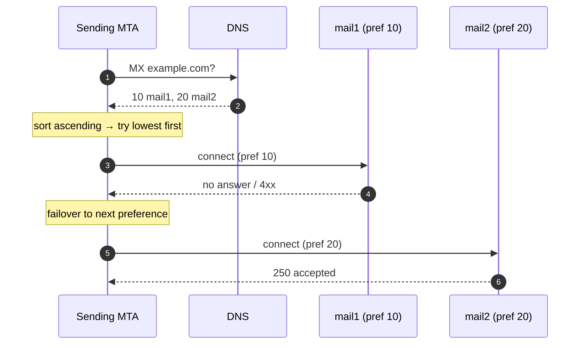
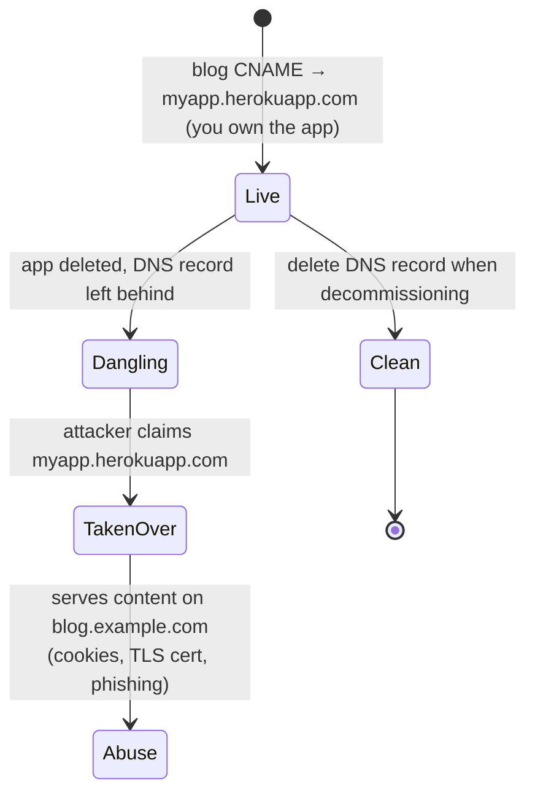
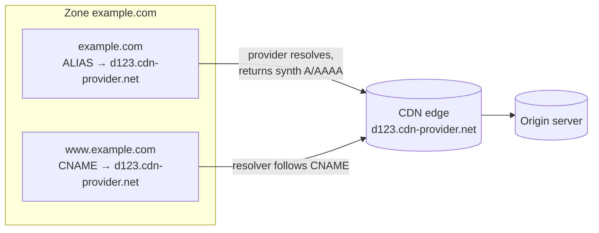

# DNS Record Types — Interview

A bank of interview questions on the DNS resource-record zoo — what each type carries, the rules that constrain how records combine, and the operational traps (apex CNAMEs, dangling records, wildcards) that separate an engineer who "knows A records" from one who owns a zone. Answers favor exact mechanics over trivia.

## Table of Contents

1. [Q1: A vs AAAA vs CNAME — what does each actually store?](#q1-a-vs-aaaa-vs-cname--what-does-each-actually-store)
2. [Q2: Why can't you put a CNAME on the zone apex?](#q2-why-cant-you-put-a-cname-on-the-zone-apex)
3. [Q3: What is ALIAS/ANAME and how does it fix the apex problem?](#q3-what-is-aliasaname-and-how-does-it-fix-the-apex-problem)
4. [Q4: How does the MX priority field work?](#q4-how-does-the-mx-priority-field-work)
5. [Q5: TXT records — what are SPF, DKIM, and DMARC and how do they differ?](#q5-txt-records--what-are-spf-dkim-and-dmarc-and-how-do-they-differ)
6. [Q6: NS vs SOA — what is each for?](#q6-ns-vs-soa--what-is-each-for)
7. [Q7: What is a PTR record and reverse DNS?](#q7-what-is-a-ptr-record-and-reverse-dns)
8. [Q8: What is a CAA record and what does it protect against?](#q8-what-is-a-caa-record-and-what-does-it-protect-against)
9. [Q9: What is an RRset and the TTL rule that governs it?](#q9-what-is-an-rrset-and-the-ttl-rule-that-governs-it)
10. [Q10: How do wildcard records work and where do they bite?](#q10-how-do-wildcard-records-work-and-where-do-they-bite)
11. [Q11: What is a dangling record and how does it enable subdomain takeover?](#q11-what-is-a-dangling-record-and-how-does-it-enable-subdomain-takeover)
12. [Q12: Can a name have both a CNAME and other records? Why not?](#q12-can-a-name-have-both-a-cname-and-other-records-why-not)
13. [Q13: How does a resolver follow a CNAME chain, and what limits it?](#q13-how-does-a-resolver-follow-a-cname-chain-and-what-limits-it)
14. [Q14: Scenario — point both the apex and www at a CDN. Walk me through it.](#q14-scenario--point-both-the-apex-and-www-at-a-cdn-walk-me-through-it)
15. [Q15: How do SRV and NS delegation differ from a plain A record?](#q15-how-do-srv-and-ns-delegation-differ-from-a-plain-a-record)
16. [Q16: A record change "isn't taking" for some users but works for others. Diagnose.](#q16-a-record-change-isnt-taking-for-some-users-but-works-for-others-diagnose)

---

## Q1: A vs AAAA vs CNAME — what does each actually store?

> An **A** record maps a name to a 32-bit IPv4 address (`example.com A 93.184.216.34`). An **AAAA** ("quad-A") record maps a name to a 128-bit IPv6 address (`example.com AAAA 2606:2800:220:1:248:1893:25c8:1946`) — same job, wider address family. A **CNAME** ("canonical name") does *not* store an address at all; it stores *another name*, declaring "this name is an alias — go resolve that one instead" (`www.example.com CNAME example.com`). The key distinction: A/AAAA are **terminal** answers a resolver can hand to the client, while a CNAME is an **indirection** the resolver must chase until it lands on an A/AAAA. A dual-stack host publishes both an A and an AAAA under the same name; the client picks based on its own connectivity (typically Happy Eyeballs, RFC 8305).

| Type | Stores | Terminal? | Typical use |
|------|--------|-----------|-------------|
| A | IPv4 address (32-bit) | Yes | Direct host → IPv4 |
| AAAA | IPv6 address (128-bit) | Yes | Direct host → IPv6 |
| CNAME | Another DNS name | No — must be followed | Alias one name onto another (e.g. onto a CDN hostname) |

---

## Q2: Why can't you put a CNAME on the zone apex?

> Because RFC 1034 §3.6.2 forbids a CNAME from **coexisting with any other record type at the same name**, and the apex (`example.com` — the naked/root domain, sometimes called the "bare" or "zone root") is *required* to carry an **SOA** record and one or more **NS** records to be a valid delegated zone. Put a CNAME there and you'd have `CNAME + SOA + NS` on one name, which the standard prohibits — the CNAME rule says "if a CNAME is present, no other data should be." So the apex physically cannot hold a CNAME without breaking the zone. This is not a vendor limitation; it is baked into the DNS data model. Subdomains like `www` are fine because they have no mandatory SOA/NS, so `www CNAME cdn.example.net` is legal.

---

## Q3: What is ALIAS/ANAME and how does it fix the apex problem?

> **ALIAS** (Route 53's name), **ANAME**, or a "CNAME flattening" feature (Cloudflare) is a **provider-side pseudo-record**. You configure it like a CNAME on the apex, but the authoritative server does the indirection itself: at query time it resolves the target hostname, then **synthesizes and returns an ordinary A/AAAA record** to the client. The client and resolver only ever see a normal A/AAAA answer — so no RFC is violated, because no CNAME actually appears in the zone. This lets you point `example.com` (apex) at a CDN or load-balancer hostname whose IPs change. The trade-offs: it only works while your DNS is hosted by a provider that supports it (it's non-portable, not a real DNS record type), the provider caches the upstream resolution and applies its own TTL, and health/geo behavior of the target may be flattened away. Route 53 alias records to AWS resources (ELB, CloudFront, S3) are the same idea and are free of query charges.

---

## Q4: How does the MX priority field work?

> An **MX** (Mail eXchanger) record has two parts: a **preference number** and a mail-server hostname — `example.com. MX 10 mail1.example.com.`. The preference is a 16-bit integer where **lower means more preferred**. A sending mail server sorts the MX set ascending and tries the lowest-numbered host first; if it can't connect, it falls through to the next. Equal preferences are load-balanced (the sender picks among them, usually randomly), giving you both **failover** (different numbers) and **spreading** (same number). Two rules that trip people: the MX target **must be a hostname with its own A/AAAA record, never an IP and never a CNAME** (RFC 2181 §10.3 forbids MX pointing at a CNAME), and a *null MX* (`MX 0 .` — a single dot) explicitly declares "this domain sends/receives no mail," which anti-spam systems honor.

---

## Q5: TXT records — what are SPF, DKIM, and DMARC and how do they differ?

> A **TXT** record holds arbitrary text strings; email authentication overloads it to publish policy. The three form a layered system:
> - **SPF** (Sender Policy Framework) — a TXT at the domain apex listing which IPs/hosts are *authorized to send* mail for the domain (`v=spf1 include:_spf.google.com -all`). The receiver checks the SMTP envelope-from against this list. It authenticates the **sending server**, not the message content.
> - **DKIM** (DomainKeys Identified Mail) — the sender signs the message with a private key; the **public key is published as a TXT** at `selector._domainkey.example.com`. The receiver fetches it and verifies the signature, proving the message wasn't altered and came from a key-holder. It authenticates the **message**.
> - **DMARC** (Domain-based Message Authentication) — a TXT at `_dmarc.example.com` (`v=DMARC1; p=reject; rua=...`) that ties SPF and DKIM together with **alignment** (the authenticated domain must match the visible `From:` header) and tells receivers what to do on failure (`none`/`quarantine`/`reject`) plus where to send aggregate reports.
>
> Mental model: SPF says *"who may send,"* DKIM says *"this message is intact and signed,"* DMARC says *"require alignment and here's the enforcement policy + reporting."* You want all three; DMARC without SPF/DKIM alignment does nothing.

---

## Q6: NS vs SOA — what is each for?

> Both live at the top of a zone and define its administrative structure, but they answer different questions. The **NS** (Name Server) records list the authoritative servers *for the zone* — they exist both in the parent zone (the **delegation**, telling resolvers where to go) and in the child zone itself (the authoritative copy). Resolvers walk NS records down the tree during resolution. The **SOA** (Start Of Authority) is a **single** record marking the apex of the zone and carrying its metadata: the primary master name server, the admin email (with `@` written as `.`), a **serial number** (bumped on every change so secondaries know to re-transfer), and the **refresh / retry / expire / minimum-TTL** timers that govern zone transfers and negative-cache TTL. In short: **SOA = one record describing the zone's parameters and change-tracking; NS = the set of servers authoritative for it.** Every zone must have exactly one SOA and at least one NS.

| | SOA | NS |
|---|-----|-----|
| Count per zone | Exactly one (at apex) | One or more |
| Purpose | Zone metadata: serial, timers, primary, admin | List of authoritative name servers |
| Lives in | Child zone only | Parent (delegation) **and** child zone |
| Drives | Zone-transfer timing, negative-cache TTL | Resolver delegation path |

---

## Q7: What is a PTR record and reverse DNS?

> A **PTR** (Pointer) record maps an **IP address back to a name** — the reverse of an A/AAAA. It's the mechanism behind *reverse DNS (rDNS)*. Because DNS is a name-indexed tree, you can't look up "who owns 93.184.216.34" directly; instead the IP is reversed and placed under a special domain: IPv4 addresses live under **`in-addr.arpa`** (so `93.184.216.34` → `34.216.184.93.in-addr.arpa PTR example.com.`), and IPv6 under **`ip6.arpa`** (nibble-reversed). Control over the reverse zone belongs to whoever was **delegated the IP block** — usually your ISP or cloud provider — so you often can't set your own PTR without asking them. The dominant real use is **outbound email reputation**: receiving mail servers reject or penalize senders whose sending IP has no PTR, or whose PTR doesn't forward-confirm (the PTR's name must itself resolve back to the same IP — "FCrDNS"). It's also used in logging and traceroute to show friendly host names.

---

## Q8: What is a CAA record and what does it protect against?

> A **CAA** (Certification Authority Authorization, RFC 8659) record lets a domain owner declare **which Certificate Authorities are allowed to issue TLS certificates** for that domain — `example.com. CAA 0 issue "letsencrypt.org"`. Before issuing, a compliant CA is *required* to check for a CAA record (walking up from the requested name toward the apex) and must refuse if a CAA set exists and doesn't authorize it. It defends against **mis-issuance**: a CA being tricked, compromised, or simply mis-configured into issuing a valid cert for your domain to an attacker. Common tags are `issue` (allowed CA for normal certs), `issuewild` (for wildcard certs specifically), and `iodef` (a URL/email to report violation attempts). CAA is a *policy control checked at issuance time*, not something browsers validate — so it doesn't stop an already-issued rogue cert, which is why it complements (not replaces) Certificate Transparency.

---

## Q9: What is an RRset and the TTL rule that governs it?

> An **RRset** (Resource Record Set) is the group of **all records sharing the same name, type, and class** — e.g. all the A records for `example.com` form one RRset. DNS treats an RRset as an **atomic unit**: caching, DNSSEC signing, and "does this exist" answers all operate on the whole set, not individual records. The critical rule: **every record in an RRset must have the same TTL.** RFC 2181 §5.2 mandates this — you cannot give one A record a 60-second TTL and its sibling a 3600-second TTL; resolvers may treat mixed TTLs as an error or normalize them, and DNSSEC signatures cover the RRset as a whole. TTL itself is the number of seconds a resolver may cache the answer before re-querying; it's the single biggest lever on how fast a change propagates. Lower it *before* a planned migration (so caches expire quickly), then raise it back afterward to cut query load.

---

## Q10: How do wildcard records work and where do they bite?

> A **wildcard** is a record whose owner name begins with a `*` label — `*.example.com A 203.0.113.9` — and it synthesizes an answer for **any name that doesn't otherwise exist** in the zone at that level: `anything.example.com`, `foo.example.com`, etc. all resolve to the wildcard. Three sharp edges: (1) A wildcard **only covers names with no other explicit records** — the moment `foo.example.com` has *any* record of *any* type, the wildcard no longer applies to `foo` at all (it stops "shadowing" that name for every type). (2) Wildcards **don't descend multiple labels the way people expect** — `*.example.com` matches `a.example.com` but the matching rules around deeper names and existing empty non-terminals are subtle (RFC 4592). (3) Operationally they're dangerous: a wildcard makes *every* typo and *every* probe resolve to a live server, which can mask misconfigurations, defeat "does this subdomain exist" checks, catch malicious `<anything>.example.com` traffic, and (combined with a permissive app) enable phishing on your own domain. Use them deliberately, scoped narrowly.

---

## Q11: What is a dangling record and how does it enable subdomain takeover?

> A **dangling record** is a DNS entry that still points at a resource **you no longer control**. The classic case: you create `blog.example.com CNAME myapp.herokuapp.com` (or an S3 bucket, an Azure/GitHub Pages endpoint, a decommissioned ELB), later delete the *app* but forget the *DNS record*. The CNAME now points at a hostname/endpoint that is **free for anyone to claim**. An attacker registers `myapp.herokuapp.com` on that provider, and because your DNS still directs `blog.example.com` there, they now serve content on **your subdomain** — with valid cookies scoped to `*.example.com`, the ability to obtain a TLS cert for the name, and full phishing credibility. This is **subdomain takeover**.

> Defenses: **delete the DNS record at the same time you delete the resource**, audit CNAMEs/ALIASes for targets that no longer resolve to something you own, and prefer providers that require domain-ownership verification before serving a claimed hostname.

---

## Q12: Can a name have both a CNAME and other records? Why not?

> No — with the sole exceptions of DNSSEC records (`RRSIG`, `NSEC`, `NSEC3`) that sign the CNAME itself. RFC 1034/2181 state that **if a CNAME exists at a name, no other data may exist there.** The reason is semantic: a CNAME means *"this name is merely an alias for another name — all its data lives at the target."* If you also had, say, an MX or TXT at that name, DNS would face a contradiction: is the data here, or over at the alias target? To keep resolution unambiguous, the answer is "a CNAME owns the name exclusively." This is exactly why the apex (which needs SOA + NS) can't be a CNAME, and why you can't put a CNAME and a TXT (e.g. for domain verification) on the same subdomain — you must either use ALIAS/flattening or restructure. Practical tell: many DNS providers will silently refuse or error when you try to add a second record type alongside a CNAME.

---

## Q13: How does a resolver follow a CNAME chain, and what limits it?

> When a resolver queries name `X` and the authoritative answer is a **CNAME to `Y`**, the resolver treats `Y` as the new query target and resolves it — repeating until it reaches a terminal A/AAAA (or the type it asked for). Servers often help by returning the CNAME **and** the target's A record together in one response (a "chained" answer) to save round trips. Two constraints keep it sane: resolvers enforce a **maximum chain length / loop guard** (a CNAME pointing back into the chain, `a→b→a`, is detected and dropped) and every hop that isn't served from cache costs **latency and extra queries** — a three-deep CNAME chain (`www → cdn → edge → A`) can add multiple sequential lookups on a cold cache. This is the core cost argument against deep aliasing and in favor of ALIAS/flattening at the apex, which collapses the indirection server-side into one A answer.

---

## Q14: Scenario — point both the apex and www at a CDN. Walk me through it.

> The CDN gives you a hostname like `d123.cdn-provider.net`, not fixed IPs, so you must alias — but the apex can't hold a CNAME. Standard solution:
>
> 1. **`www.example.com`** → a **CNAME** to `d123.cdn-provider.net`. Legal, because `www` has no mandatory SOA/NS. The CDN's own DNS then returns geo/health-optimized IPs.
> 2. **`example.com` (apex)** → an **ALIAS/ANAME/CNAME-flattening** record to the same `d123.cdn-provider.net`. Your DNS provider resolves the target at query time and returns synthesized **A/AAAA** records, satisfying the apex rules. (If your provider lacks ALIAS support you're stuck hard-coding the CDN's anycast IPs with A records — brittle, since they can change — which is why provider choice matters here.)
> 3. Decide the **canonical host** and redirect the other with an HTTP 301 (commonly apex → `www` or vice versa) so you don't split SEO/caches. This is an app/CDN-layer redirect, not DNS.
> 4. Set **TTLs low (e.g. 60–300s) before cutover**, then raise them after it's stable.
> 5. Add a **CAA** record so the CDN's CA can issue the TLS cert, and make sure both apex and www are on the cert (SAN or wildcard).

> Result: both names land on the CDN, the apex serves clean A/AAAA answers, and one canonical redirect keeps things tidy.

---

## Q15: How do SRV and NS delegation differ from a plain A record?

> A plain **A** record answers "what IP is this host?" An **SRV** (Service, RFC 2782) record answers "**where does *this service* run** for this domain?" — it encodes service, protocol, **priority**, **weight**, **port**, and target host (`_sip._tcp.example.com. SRV 10 60 5060 sipserver.example.com.`). SRV lets clients discover both the host *and* the port, with priority/weight for failover and weighted load-balancing — used by SIP, XMPP, Kerberos, LDAP, Minecraft, and Active Directory. **NS** delegation is different again: an NS record in a *parent* zone doesn't answer a query, it **hands responsibility for a sub-zone to other name servers** ("for everything under `sub.example.com`, go ask these servers"). So: A = terminal address, SRV = service+port discovery with LB semantics, NS = "not my zone, ask over there." All three are used together in real infrastructure.

---

## Q16: A record change "isn't taking" for some users but works for others. Diagnose.

> This is almost always **caching along the resolution path colliding with TTL**, and the fix is to reason about where the stale answer lives. Checklist, from most to least common:
> 1. **TTL not yet expired** — the old RRset was cached (by the user's OS stub resolver, their ISP's recursive resolver, or a corporate resolver) with, say, a 3600s TTL, and those caches keep serving it until it ages out. Users behind a resolver that already expired it see the new value; others don't. Lesson: **lower the TTL *before* the change**, not during.
> 2. **Multiple authoritative servers out of sync** — a secondary hasn't pulled the new zone because the SOA serial wasn't bumped or the transfer failed. Different resolvers hit different authoritatives and get different answers. Check the serial across all NS.
> 3. **A CDN/ALIAS layer caching upstream** — provider-side flattening caches the target resolution on its own TTL.
> 4. **Negative caching** — if the name previously returned NXDOMAIN, that negative answer is cached per the SOA minimum-TTL and can mask a newly-created record.
> 5. **Client-side pinning** — browsers and some apps cache DNS internally beyond the resolver TTL.
>
> Confirm by querying an authoritative server directly (bypassing caches) and comparing to what a public resolver returns; if the authoritative is correct but resolvers lag, it's caching/TTL and you wait it out or flush.

---

*Next step:* [DNS Load Balancing — Junior](../dns-load-balancing/junior.md)
