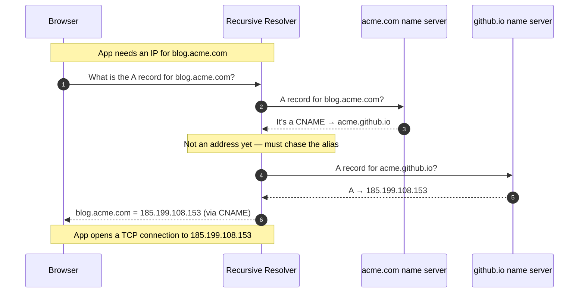

# DNS Record Types — Junior

<!-- level-focus -->
At junior level, focus on this question:

> How can I apply **DNS Record Types** in one small example and prove the result?

Use the smallest realistic scenario that exposes the decision and its failure behavior.
## 1. What a DNS record actually is

Strip away the tooling and a DNS record is a small tuple. Every record answers four questions at once:

```
  NAME          TYPE   VALUE                 TTL
  www.acme.com  A      93.184.216.34         300
  └─ the name   │      └─ the data           └─ how long
     you ask    │         you get back          to cache it
     about      └─ what KIND of answer
```

- **NAME** — the domain (or subdomain) being described. `www.acme.com`, `acme.com`, `mail.acme.com`.
- **TYPE** — a short label that tells you *how to interpret the value*. `A`, `AAAA`, `CNAME`, `MX`, `TXT`. Without the type, the value is meaningless: `93.184.216.34` could be an address, but a mail record's value is a hostname and a text record's value is arbitrary text.
- **VALUE** (also called *RDATA*, "record data") — the actual answer, whose shape depends entirely on the type.
- **TTL** — *time to live*, in seconds. It is a caching hint: "any resolver may remember this answer for up to N seconds before asking again." A low TTL (300 = 5 minutes) makes changes propagate fast; a high TTL (86400 = 1 day) reduces query load but makes changes slow to appear.

The single most important idea for a beginner: **you never query a name by itself — you query a (name, type) pair.** Asking "what is `acme.com`?" is ambiguous. You ask "what is the **A** record for `acme.com`?" and get back an IPv4 address, or "what is the **MX** record for `acme.com`?" and get back a mail server. The same name can hold different records of different types simultaneously, and that is completely normal.

A collection of all records for a domain, stored together, is called a **zone** (see §3). The authoritative name servers for a domain serve that domain's zone. This mapping of names and types to values is formally defined in RFC 1035, the foundational DNS specification.

---

## 2. The everyday records

You can go a long way with just five record types. Learn these first; the rest are variations on the same idea.

### A — name to IPv4 address

The workhorse. An `A` record maps a hostname to a 32-bit IPv4 address.

```
www.acme.com.   A   93.184.216.34
```

When your browser wants to reach `www.acme.com`, it ultimately needs an IP address to open a TCP connection to. The `A` record supplies it. A name can have **several** `A` records (pointing at several servers) — the resolver returns all of them and the client typically picks one, which is a simple form of load spreading.

### AAAA — name to IPv6 address

Identical in purpose to `A`, but for IPv6 (128-bit) addresses. The name "quad-A" comes from IPv6 addresses being four times the size of IPv4.

```
www.acme.com.   AAAA   2606:2800:220:1:248:1893:25c8:1946
```

A modern host commonly publishes **both** an `A` and an `AAAA` record. Clients that support IPv6 prefer the `AAAA`; older clients fall back to the `A`.

### CNAME — name to another name (an alias)

A `CNAME` ("canonical name") record says: "this name is just an alias — go look up *that other name* instead." It does **not** contain an address; it contains a name.

```
blog.acme.com.   CNAME   acme.github.io.
```

Here `blog.acme.com` is an alias for `acme.github.io`. A resolver seeing this must then look up the `A`/`AAAA` records of `acme.github.io` to finish the job (this two-step chase is diagrammed in §4). CNAMEs are how you point a subdomain at a third-party service (a CDN, a hosting platform, a status page) without hard-coding that service's IP address — if they change their IP, you don't have to touch your zone.

One firm rule to internalize now: **a name that has a CNAME cannot have any other record of the same name.** You cannot put a `CNAME` and an `MX` on `blog.acme.com` at once. This is why you almost never see a CNAME at the *root* of a domain (`acme.com` itself), because the root must carry `NS` and `SOA` records — see §7 and the ALIAS/ANAME workaround introduced at the Middle tier.

### MX — mail exchanger

An `MX` record tells other mail servers *where to deliver email* for a domain. Its value is a hostname (not an IP) plus a **priority** number; lower priority is tried first.

```
acme.com.   MX   10   mail1.acme.com.
acme.com.   MX   20   mail2.acme.com.
```

Mail for `bob@acme.com` goes to `mail1.acme.com` first (priority 10); if that server is unreachable, senders fall back to `mail2.acme.com` (priority 20). Note the target hostname must itself resolve via an `A`/`AAAA` record — an MX cannot point at an IP directly, and per convention it should not point at a CNAME.

### TXT — free-form text

A `TXT` record holds arbitrary text attached to a name. Originally for human-readable notes, it is now the universal place to publish **machine-readable proofs and policies** — most importantly for email security and domain-ownership verification.

```
acme.com.   TXT   "v=spf1 include:_spf.google.com ~all"
acme.com.   TXT   "google-site-verification=abc123..."
```

The first line is an **SPF** record declaring which servers may send mail as `acme.com` (anti-spoofing). The second proves to Google that you control the domain. You'll meet SPF, DKIM, and DMARC — all carried in TXT records — in more depth at the Middle tier.

---

## 3. A concrete example zone

Here is a small but realistic zone file for the fictional domain `acme.com`. A zone file is simply the authoritative list of all records for a domain, written in the text format described in RFC 1035. Read it top to bottom.

```dns
; --- zone file for acme.com ---
$TTL 3600                    ; default TTL: 1 hour, unless overridden per-record

; SOA: the "start of authority" — metadata about the zone itself
acme.com.   IN  SOA   ns1.acme.com. hostmaster.acme.com. (
                        2026070101   ; serial (bump on every edit)
                        7200         ; refresh
                        3600         ; retry
                        1209600      ; expire
                        300 )        ; negative-cache TTL

; NS: which name servers are authoritative for this zone
acme.com.       IN  NS    ns1.acme.com.
acme.com.       IN  NS    ns2.acme.com.

; the name servers themselves need addresses ("glue")
ns1.acme.com.   IN  A     198.51.100.1
ns2.acme.com.   IN  A     198.51.100.2

; the apex (root of the domain) points straight at web servers
acme.com.       IN  A     93.184.216.34
acme.com.       IN  AAAA  2606:2800:220:1:248:1893:25c8:1946

; www is another A record (could be a CNAME to a CDN in real life)
www.acme.com.   IN  A     93.184.216.34

; blog is delegated to a hosting provider via a CNAME alias
blog.acme.com.  IN  CNAME acme.github.io.

; mail routing
acme.com.       IN  MX    10 mail1.acme.com.
acme.com.       IN  MX    20 mail2.acme.com.
mail1.acme.com. IN  A     203.0.113.10
mail2.acme.com. IN  A     203.0.113.11

; email policy + domain verification
acme.com.       IN  TXT   "v=spf1 include:_spf.google.com ~all"
```

A few things to notice, because they teach the model:

- The **same name `acme.com` appears many times** — with `SOA`, `NS`, `A`, `AAAA`, `MX`, and `TXT` records. That is exactly the "one name, many types" idea from §1.
- `IN` is the *class* (`IN` = Internet). You will see it on every line; for all practical purposes it is always `IN`.
- The trailing dot on `acme.com.` matters: it means "fully qualified, this is the absolute name." A name without the trailing dot is treated as relative to the zone.
- Every record type you met in §2 is present. `SOA` and `NS` (introduced fully at the Middle tier) are *required* for the zone to exist at all — they identify who is in charge.

---

## 4. How a CNAME resolves to an address

The `CNAME` chase is the one flow every beginner should be able to draw. When you ask for the address of an aliased name, the resolver has to follow the alias to a real address before it can answer you. Here is a browser resolving `blog.acme.com`, which is a CNAME for `acme.github.io`.



The key insight from the diagram: the browser asked one simple question ("give me the address of `blog.acme.com`"), but the resolver did **two** lookups behind the scenes — first discovering the CNAME, then resolving the target's `A` record. The browser never sees the intermediate step; it just gets a usable IP. This is why an extra CNAME hop adds a small amount of latency to the *first* lookup (before caching), and why deeply chained CNAMEs (alias → alias → alias) are discouraged.

---

## 5. Looking records up with `dig`

`dig` (domain information groper) is the standard command-line tool for querying DNS. The pattern is always `dig NAME TYPE`. Learn to read its output and you can debug most everyday DNS problems.

**Ask for an A record:**

```bash
dig acme.com A
```

The important part of the response is the ANSWER section:

```
;; ANSWER SECTION:
acme.com.   3600   IN   A   93.184.216.34
```

Read left to right, this is exactly the tuple from §1: **name** `acme.com.`, **TTL** `3600`, class `IN`, **type** `A`, **value** `93.184.216.34`.

**Ask for the mail servers:**

```bash
dig acme.com MX
```

```
;; ANSWER SECTION:
acme.com.   3600   IN   MX   10 mail1.acme.com.
acme.com.   3600   IN   MX   20 mail2.acme.com.
```

**Ask for a CNAME and watch the chase:**

```bash
dig blog.acme.com A
```

```
;; ANSWER SECTION:
blog.acme.com.    3600   IN   CNAME   acme.github.io.
acme.github.io.   30     IN   A       185.199.108.153
```

Notice `dig` returned *both* the CNAME and the final `A` record it chased — the same two-step flow you saw in §4, now visible in one answer.

Two handy variants for beginners:

```bash
dig acme.com ANY        # ask for everything (often filtered by servers now)
dig +short acme.com A   # print just the value: 93.184.216.34
```

`+short` strips all the framing and prints only the answer's value — perfect for scripts or a quick sanity check.

---

## 6. Comparison table of the common types

This is the reference to memorize. It covers the everyday five plus the structural and specialized records you will keep bumping into; the ones marked *(Middle)* are introduced fully at the next tier but listed here so you recognize them in a zone.

| Type | Purpose | Example value |
|------|---------|---------------|
| **A** | Name → IPv4 address | `93.184.216.34` |
| **AAAA** | Name → IPv6 address | `2606:2800:220:1:248:1893:25c8:1946` |
| **CNAME** | Name → another name (alias) | `acme.github.io.` |
| **MX** | Where to deliver mail (priority + host) | `10 mail1.acme.com.` |
| **TXT** | Free-form / policy text (SPF, verification) | `"v=spf1 include:_spf.google.com ~all"` |
| **NS** *(Middle)* | Which servers are authoritative for a zone | `ns1.acme.com.` |
| **SOA** *(Middle)* | Zone metadata (serial, timers, primary NS) | `ns1.acme.com. hostmaster... 2026070101 ...` |
| **SRV** *(Middle)* | Service location: host + port + priority/weight | `10 60 5060 sip.acme.com.` |
| **PTR** *(Middle)* | Reverse lookup: IP → name | `www.acme.com.` |
| **CAA** *(Middle)* | Which CAs may issue TLS certs for the name | `0 issue "letsencrypt.org"` |
| **ALIAS/ANAME** *(Middle)* | CNAME-like alias usable at the apex | `acme.github.io.` (provider-specific) |
| **wildcard** *(Middle)* | Catch-all for any unmatched subdomain | `*.acme.com. A 93.184.216.34` |

You don't need to master the *(Middle)* rows yet. The goal for now is recognition: when you see `NS` or `SRV` or a `*` in a zone, you know it's a legitimate record type with a specific job, not a typo.

---

## 7. Common beginner mistakes

A short list of traps that catch nearly everyone once:

- **Putting a CNAME on the apex.** `acme.com` (the bare domain, no subdomain) must carry `SOA` and `NS` records, and a name with a CNAME can hold *no other records*. So a CNAME at the apex is invalid. The everyday need — "I want `acme.com` itself to point at my CDN" — is solved with `ALIAS`/`ANAME` records at the Middle tier.

- **Pointing an MX or NS at a CNAME.** MX and NS targets must resolve directly via `A`/`AAAA`. Aiming them at an alias is non-conformant and breaks on strict resolvers. Always point them at a real hostname with an address record.

- **Expecting instant changes.** After you edit a record, old answers stay cached across the internet for up to the **TTL** you previously published. If a record had TTL 86400, a change can take a day to be seen everywhere. Lower the TTL *before* a planned change, not after.

- **Confusing "no record" with "no answer."** `dig acme.com AAAA` returning nothing in the ANSWER section usually means the name has no IPv6 record — not that the domain is broken. Check the record type you actually asked for.

- **Forgetting the trailing dot in zone files.** `www` without a trailing dot inside the `acme.com` zone means `www.acme.com.`; `www.example.net` *without* the dot accidentally becomes `www.example.net.acme.com.`. When in doubt, fully qualify with a trailing dot.

The mental model to carry forward: a record is `(name, type, value, TTL)`; you query a *pair* of name-and-type; a zone is the full set of a domain's records; and the type is what makes the value mean something. Everything at the Middle and Senior tiers — the structural records, security records, and the mechanics of propagation — builds directly on this foundation.

---

*References:* RFC 1035 (Domain Names — Implementation and Specification), MDN Web Docs "What is DNS?", Cloudflare Learning Center "DNS records."

*Next step:* [DNS Record Types — Middle](middle.md)

---

## Apply it

1. Choose one small, known input for **DNS Record Types**.
2. Predict the output or observable behavior.
3. Run the smallest example or probe that exercises the concept.
4. Change one input to trigger a failure or boundary case.
5. Explain the evidence using the guide's vocabulary.

## Verify your work

- Record the exact input, command or code path, and output.
- Repeat the probe and confirm the result is consistent.
- Show one expected success and one expected failure.
- Resolve any difference between the prediction and the evidence.

## Review questions

- What problem does DNS Record Types solve in the example?
- Which input changes the observed result, and why?
- What is the smallest useful success check?
- Which beginner mistake would your evidence catch?
