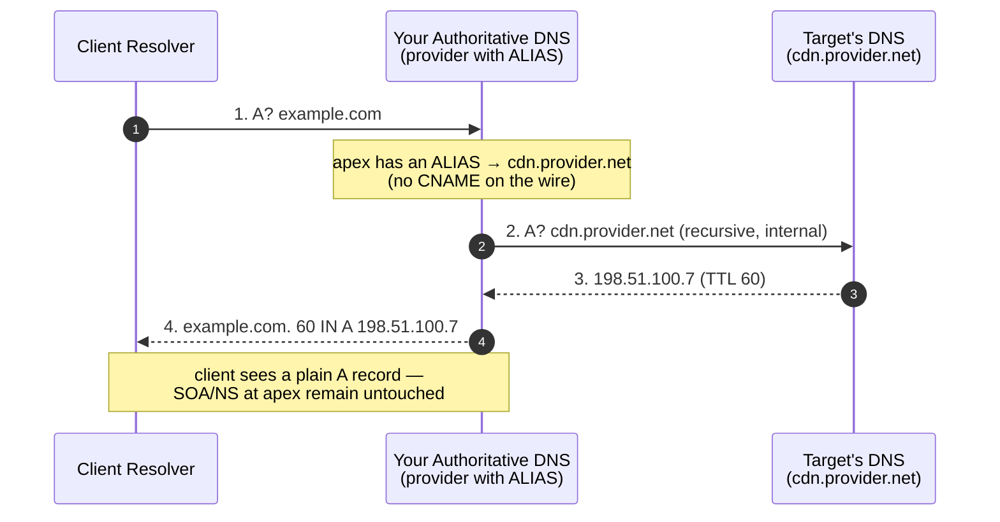
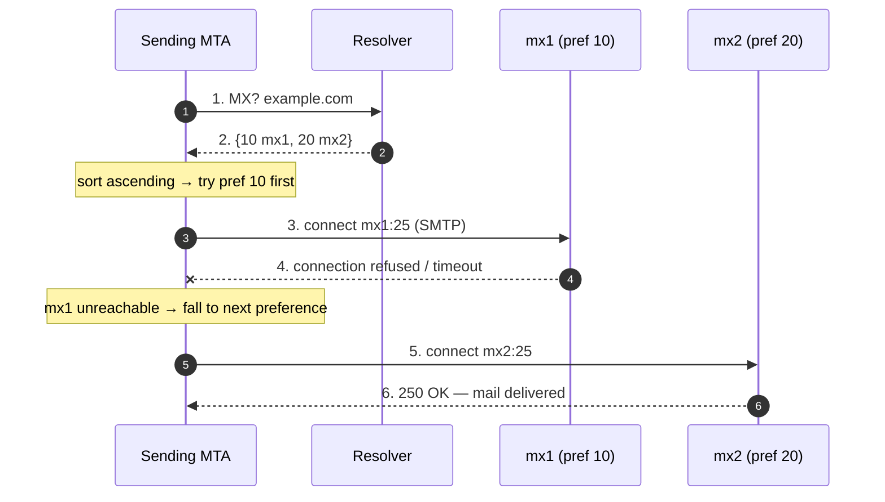
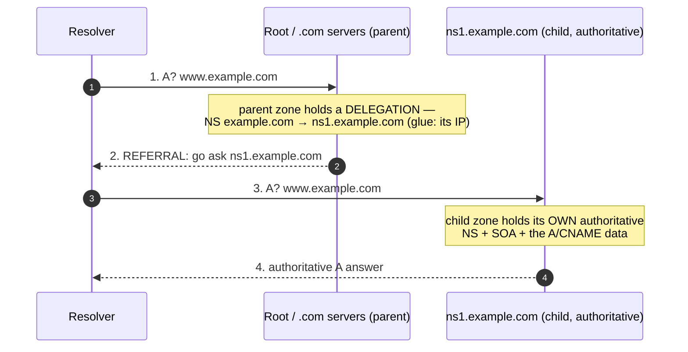

# DNS Record Types — Middle

<!-- level-focus -->
At middle level, focus on this question:

> Where does **DNS Record Types** belong in a maintainable component, and which trade-off selects the design?

Use the smallest realistic scenario that exposes the decision and its failure behavior.
---

## 1. The record set as a typed key-value store

A DNS zone is not a bag of "domain → IP" rows. It is a set of **resource records (RRs)**, each a 5-tuple:

```
NAME    TTL    CLASS   TYPE    RDATA
```

`CLASS` is almost always `IN` (Internet). `TYPE` selects the wire format of `RDATA`. Records sharing the same `NAME` + `TYPE` form an **RRset** — the atomic unit of caching, DNSSEC signing, and the answer a resolver returns. A query is always *(NAME, TYPE)* → *RRset*; there is no partial answer.

Two invariants from **RFC 1035 §3.2** and **RFC 2181 §5** govern everything below:

- **All records in an RRset share one TTL.** A resolver caches the whole set as a unit. Mixing TTLs inside an RRset is a spec violation (RFC 2181 §5.2).
- **A `CNAME` cannot coexist with any other data at the same name** (RFC 1034 §3.6.2). This single rule is the root of the apex problem in §2.

```
; a minimal zone excerpt — one NAME, several TYPEs
example.com.        3600  IN  A      203.0.113.10       ; RRset #1
example.com.        3600  IN  AAAA   2001:db8::10       ; RRset #2 (same name, different type)
example.com.        3600  IN  MX     10 mail.example.com.
www.example.com.    3600  IN  CNAME  example.com.       ; RRset #3 (different name)
```

Query it directly:

```
$ dig +short A example.com
203.0.113.10
$ dig +short AAAA example.com
2001:db8::10
```

The mental model for the rest of this tier: **pick the type by the question the client is asking**, and respect the RRset rules — most production DNS incidents are RRset-rule violations in disguise.

---

## 2. A / AAAA vs CNAME — and the apex-CNAME problem

| Record | RDATA | Answers the question | Terminal? |
|--------|-------|----------------------|-----------|
| `A`    | 32-bit IPv4 address | "What IPv4 address?" | Yes — final answer |
| `AAAA` | 128-bit IPv6 address | "What IPv6 address?" | Yes — final answer |
| `CNAME`| a single canonical domain name | "What other name should I look up instead?" | No — resolver must re-query the target |

A `CNAME` is an **alias**: it says "this name has no data of its own; go resolve *that* name instead." A resolver receiving a `CNAME` restarts resolution at the target and follows the chain until it hits an `A`/`AAAA` (or `NXDOMAIN`).

```
$ dig www.example.com A
;; ANSWER SECTION:
www.example.com.   300  IN  CNAME   lb-prod.cloudprovider.net.
lb-prod.cloudprovider.net.  60  IN  A  198.51.100.7
```

Two records come back: the `CNAME` and the resolved `A`. The client uses `198.51.100.7`, but the *cacheable indirection* means the CDN/LB provider can change the underlying IP behind `lb-prod.cloudprovider.net` without you touching your zone. That decoupling is the entire reason `CNAME` exists.

### The apex-CNAME problem

The **apex** (a.k.a. **zone root** or **naked domain**) is `example.com` with no subdomain label. You *want* `example.com` to point at your CDN/load-balancer hostname — a `CNAME` — but you **cannot** put a `CNAME` there. Two hard rules collide:

1. **RFC 1034 §3.6.2:** a `CNAME` forbids any other RRset at the same name.
2. The apex is **required** to carry `SOA` and `NS` records (§7). Every zone has them at its root.

So a `CNAME` at the apex would have to coexist with mandatory `SOA`/`NS` — which the spec forbids. Authoritative servers reject it; resolvers that receive such a mix behave undefined.

The naive fix — hardcode the provider's current IP as an apex `A` record — works until the provider rotates that IP (which they do, silently, for scaling and failover). You then serve traffic to a dead or reassigned address. This is exactly the failure mode §3 solves.

---

## 3. ALIAS / ANAME / CNAME flattening — how apex aliasing is faked

Because the protocol forbids apex `CNAME`, DNS providers invented a **server-side** trick. `ALIAS` (Route 53 calls it "alias", others call it `ANAME`, Cloudflare calls it "CNAME flattening") is **not a wire record type** — resolvers never see it. It is a provider-side instruction: *"at query time, resolve the target hostname yourself and return its current `A`/`AAAA` as if I owned those addresses."*



The provider re-resolves on its own schedule (typically bounded by the target's TTL), so when the target rotates IPs your apex answer tracks it — without a wire `CNAME` and without violating the RRset rules.

### CNAME vs ALIAS/ANAME — decision table

| Property | `CNAME` (real wire record) | `ALIAS` / `ANAME` / flattening (provider feature) |
|----------|----------------------------|---------------------------------------------------|
| Standardized wire type? | Yes (RFC 1035) | No — resolved server-side to `A`/`AAAA` |
| Allowed at zone apex? | **No** (RFC 1034 §3.6.2) | **Yes** — the whole point |
| Coexists with other RRsets at same name? | No | Yes (apex keeps `SOA`/`NS`/`MX`) |
| Extra client round-trip? | Yes (client follows the chain) | No — one flat `A`/`AAAA` returned |
| Tracks target IP changes? | Yes (target owns its `A`) | Yes (provider re-resolves) |
| Portable across DNS providers? | Fully portable | **Provider-specific** — behavior/limits vary |
| Health-check / failover aware? | No | Sometimes (e.g. Route 53 alias to ELB) |

**Rule of thumb:** use a real `CNAME` for any subdomain (`www`, `api`, `assets`); use `ALIAS`/`ANAME` only where you must — the apex — and know it ties you to that provider's implementation.

---

## 4. MX — mail routing and priority semantics

`MX` (Mail eXchanger) tells sending mail servers *where* to deliver mail for a domain. Its RDATA is two fields: **preference** (a 16-bit integer, lower = higher priority) and a **mail-server hostname**.

```
example.com.   3600  IN  MX   10  mx1.example.com.
example.com.   3600  IN  MX   20  mx2.example.com.
example.com.   3600  IN  MX   30  mx-backup.thirdparty.net.
```

Semantics (RFC 5321 §5.1):

- A sender sorts candidate hosts by **ascending preference** and tries the lowest first.
- **Equal preference → the sender load-balances** across those hosts (round-robin / random). Use equal values to spread inbound load; use different values to define primary vs failover.
- The MX **target must be a hostname with `A`/`AAAA`**, never an IP literal, and — per RFC 2181 §10.3 — the target **must not be a `CNAME`**. Point `MX` at a name that itself has address records.



**Null MX** (RFC 7505): a domain that sends but never receives mail publishes exactly `MX 0 .` (preference 0, root as the "host"). This is an explicit "we accept no mail" signal — cleaner than omitting `MX`, which forces senders to fall back to the apex `A` record.

```
example.com.   3600  IN  MX   0  .      ; RFC 7505 — this domain receives no mail
```

---

## 5. SRV — service location and its RDATA format

`SRV` (RFC 2782) generalizes `MX` to **any service**: it locates the host **and port** for a named service+protocol, with both priority and weight. The owner name is structured:

```
_service._proto.name.   TTL   IN   SRV   priority weight port target
```

Concrete example — a SIP service and a Minecraft/XMPP-style lookup:

```
_sip._tcp.example.com.      3600  IN  SRV  10 60 5060 sip1.example.com.
_sip._tcp.example.com.      3600  IN  SRV  10 40 5060 sip2.example.com.
_sip._tcp.example.com.      3600  IN  SRV  20  0 5060 sip-backup.example.com.
```

| Field | Meaning | Selection rule |
|-------|---------|----------------|
| **priority** | primary/failover tier (like MX preference) | try lowest priority first |
| **weight** | relative share *within* one priority | probability-weighted random among equal-priority hosts |
| **port** | TCP/UDP port to connect to | client dials `target:port` |
| **target** | hostname (must have `A`/`AAAA`, not `CNAME`) | resolve to address, then connect |

Selection algorithm: pick the lowest **priority** group; within it, distribute connections **proportional to weight** (here sip1 gets 60/100, sip2 gets 40/100). Only if the whole priority-10 group is unreachable does the client fall to priority 20. This gives you both **failover** (priority) and **load-balancing** (weight) in one record — something `MX` cannot express.

```
$ dig +short SRV _sip._tcp.example.com
10 60 5060 sip1.example.com.
10 40 5060 sip2.example.com.
20 0 5060 sip-backup.example.com.
```

`SRV` powers Kerberos, LDAP, SIP, XMPP, Minecraft, and Kubernetes headless-service discovery. Note: HTTP historically ignored `SRV`; modern deployments use `HTTPS`/`SVCB` records instead — that is Senior-tier material.

---

## 6. TXT — the overloaded record: SPF, DKIM, DMARC, verification

`TXT` RDATA is one or more character-strings (RFC 1035 §3.3.14) — free-form text. Because it is unstructured, four unrelated systems all camp on it, distinguished only by prefix conventions and owner names.

### 6.1 SPF — which servers may send as this domain

**SPF** (RFC 7208) publishes the list of hosts authorized to send mail *from* your domain, as a single `TXT` at the apex starting with `v=spf1`:

```
example.com.   3600  IN  TXT  "v=spf1 ip4:203.0.113.0/24 include:_spf.google.com -all"
```

- `ip4:` / `ip6:` — literal authorized ranges. `include:` — delegate to another domain's SPF (e.g. your mail provider).
- The final qualifier is the policy: `-all` (hard fail — reject anything else), `~all` (soft fail — accept but mark), `?all` (neutral).
- **Only one `v=spf1` TXT per domain** is legal; two SPF records is a `permerror`. SPF also caps DNS lookups (from `include`/`a`/`mx`) at **10** — exceeding it is a `permerror` too.

### 6.2 DKIM — cryptographic signing key

**DKIM** publishes a public key at a **selector** subdomain under `_domainkey`. The sending server signs each message; the receiver fetches this key to verify the signature.

```
selector1._domainkey.example.com.  3600  IN  TXT  "v=DKIM1; k=rsa; p=MIGfMA0GCSq...QAB"
```

The `p=` value is the base64 public key (often split across multiple quoted strings because a single `TXT` string maxes at 255 bytes — concatenated on the wire).

### 6.3 DMARC — policy tying SPF+DKIM together

**DMARC** lives at the fixed name `_dmarc.<domain>` and tells receivers what to do when SPF/DKIM **alignment** fails, plus where to send aggregate reports:

```
_dmarc.example.com.  3600  IN  TXT  "v=DMARC1; p=reject; rua=mailto:dmarc@example.com; pct=100; adkim=s; aspf=s"
```

`p=none|quarantine|reject` is the enforcement level; `rua=` is the aggregate-report address; `pct=` ramps enforcement. Together SPF + DKIM + DMARC are the anti-spoofing triad — all three ride on `TXT`.

### 6.4 Domain-ownership verification

Providers (Google, AWS, Microsoft, TLS CAs) ask you to publish a **random token** as `TXT` to prove you control the zone:

```
example.com.   300  IN  TXT  "google-site-verification=rX<random>Zk"
_acme-challenge.example.com.  120  IN  TXT  "R2k4...dns-01-token...Uw"   ; ACME DNS-01
```

| Purpose | Owner name | Prefix / marker | Governing spec |
|---------|-----------|-----------------|----------------|
| SPF | apex | `v=spf1 ` | RFC 7208 |
| DKIM | `<selector>._domainkey.` | `v=DKIM1; ` | RFC 6376 |
| DMARC | `_dmarc.` | `v=DMARC1; ` | RFC 7489 |
| Ownership / ACME | apex or `_acme-challenge.` | provider-specific token | provider / RFC 8555 |

```
$ dig +short TXT example.com
"v=spf1 ip4:203.0.113.0/24 include:_spf.google.com -all"
"google-site-verification=rX...Zk"
$ dig +short TXT _dmarc.example.com
"v=DMARC1; p=reject; rua=mailto:dmarc@example.com"
```

**Operational trap:** multiple unrelated `TXT` records at the apex form one RRset. Adding a verification token does not disturb SPF — they are separate strings in the set — but two `v=spf1` strings *do* break SPF. Keep exactly one of each policy record.

---

## 7. NS / SOA — delegation and zone authority

These two types define **where a zone lives** and **who is authoritative** for it.

### 7.1 SOA — Start Of Authority

Every zone has **exactly one** `SOA` at its apex. It carries the zone's administrative and cache-control parameters (RFC 1035 §3.3.13):

```
example.com.  3600  IN  SOA  ns1.example.com. hostmaster.example.com. (
                              2026070101  ; serial   — bump on every change
                              7200        ; refresh  — secondary re-checks every 2h
                              3600        ; retry    — retry after failed refresh
                              1209600     ; expire   — secondary stops serving after 14d
                              300 )       ; minimum  — negative-cache TTL (NXDOMAIN)
```

- **serial** — secondaries compare it to decide whether to pull a fresh zone transfer. Forgetting to bump it is the #1 "my change didn't propagate" cause.
- **minimum** — per RFC 2308, this is the **negative caching TTL**: how long resolvers cache an `NXDOMAIN`/`NODATA` for names in this zone.

### 7.2 NS — delegation

`NS` records name the authoritative servers for a zone. They appear in **two places** and the distinction matters:



- The **parent** zone (`.com`) holds delegation `NS` records pointing at your nameservers, plus **glue** `A`/`AAAA` records when a nameserver is inside the delegated zone itself (needed to break the chicken-and-egg lookup).
- The **child** zone holds its *own* apex `NS` set (authoritative copy). RFC 2181 §5.4.1: on any disagreement, the **child's** authoritative `NS` is the source of truth; the parent's is only a hint used to find the child.

```
$ dig +short NS example.com
ns1.example.com.
ns2.example.com.
$ dig SOA example.com +short
ns1.example.com. hostmaster.example.com. 2026070101 7200 3600 1209600 300
```

---

## 8. PTR — reverse DNS and the `.arpa` tree

`PTR` maps an **IP address back to a name** — the inverse of `A`/`AAAA`. Reverse lookups live in a special reversed-nibble tree under `in-addr.arpa` (IPv4) and `ip6.arpa` (IPv6). The address is reversed because DNS is hierarchical **most-significant-label-last**, but IPs are most-significant-**first**.

```
; forward:  198.51.100.7  →  mail.example.com
; reverse:  7.100.51.198.in-addr.arpa  →  mail.example.com
7.100.51.198.in-addr.arpa.  3600  IN  PTR  mail.example.com.
```

```
$ dig +short -x 198.51.100.7        # -x builds the reversed .arpa name for you
mail.example.com.
```

Key operational facts:

- **You rarely control your own PTR.** The owner of the IP block (your cloud provider / ISP) controls `in-addr.arpa` delegation. Setting reverse DNS usually means a provider console/API call, not a zone edit.
- **Mail depends on it.** Receiving MTAs check that the sending IP has a `PTR`, and often that it **forward-confirms** (the `PTR` name's `A` resolves back to the same IP — "FCrDNS"). Missing or mismatched reverse DNS is a top cause of legitimate mail being rejected or spam-scored.
- `PTR` is **not** a security control — it is advisory metadata; never authorize based on `PTR` alone.

---

## 9. CAA — constraining certificate issuance

`CAA` (Certification Authority Authorization, **RFC 6844**, updated by RFC 8659) lets a domain declare **which Certificate Authorities may issue TLS certificates** for it. Every publicly-trusted CA is **required** to check `CAA` before issuance — so this record is a real, enforced control against mis-issuance.

RDATA is three fields: **flags**, **tag**, **value**.

```
example.com.  3600  IN  CAA  0 issue "letsencrypt.org"
example.com.  3600  IN  CAA  0 issuewild "letsencrypt.org"
example.com.  3600  IN  CAA  0 iodef "mailto:security@example.com"
```

| Tag | Meaning |
|-----|---------|
| `issue` | this CA (by domain) may issue **non-wildcard** certs; `issue ";"` means **no CA may issue** |
| `issuewild` | this CA may issue **wildcard** certs (overrides `issue` for wildcards) |
| `iodef` | URL/mailto where a CA reports a **blocked** issuance attempt |

- The **flags** octet: bit 0 is the *critical* flag — if set and a CA doesn't understand the tag, it must refuse issuance.
- CAA is checked with **tree-climbing**: a CA looks up `CAA` at the requested name, and if absent, walks up to the parent domain until it finds a set or reaches the apex. So a policy at `example.com` covers `www.example.com` unless overridden.

```
$ dig +short CAA example.com
0 issue "letsencrypt.org"
0 iodef "mailto:security@example.com"
```

**Practical effect:** publishing `CAA 0 issue "letsencrypt.org"` means DigiCert, Sectigo, etc. will *refuse* to issue for your domain even if an attacker passes their (weaker) domain-validation check. It shrinks the mis-issuance attack surface from "any CA on earth" to "the ones you named."

---

## 10. Operational cheat-sheet and `dig` recipes

Pick the type by the client's actual question:

| Question the client is asking | Record | Note |
|-------------------------------|--------|------|
| What IPv4/IPv6 address? | `A` / `AAAA` | terminal answer |
| What other name should I resolve? | `CNAME` | subdomains only — never at apex |
| Apex must alias a hostname | `ALIAS`/`ANAME` | provider feature, not a wire type (§3) |
| Where do I deliver mail? | `MX` | preference-sorted; target needs `A`, not `CNAME` |
| Where is this service (host+port)? | `SRV` | `_svc._proto` name; priority + weight + port |
| Send-policy / signing / anti-spoof | `TXT` | SPF, DKIM, DMARC, verification |
| Who's authoritative / cache params? | `NS` / `SOA` | delegation + zone metadata at apex |
| What name owns this IP? | `PTR` | reversed `.arpa` name; provider-controlled |
| Which CA may issue my certs? | `CAA` | enforced by every public CA |

`dig` recipes worth memorizing:

```
$ dig A example.com                 # full answer incl. TTL, flags, authority
$ dig +short AAAA example.com       # value only
$ dig +trace www.example.com        # walk delegation root → TLD → authoritative
$ dig MX example.com +short
$ dig SRV _sip._tcp.example.com +short
$ dig TXT _dmarc.example.com +short
$ dig -x 198.51.100.7 +short        # reverse PTR
$ dig CAA example.com +short
$ dig +noall +answer NS example.com # just the ANSWER section
$ dig @ns1.example.com SOA example.com   # query a specific authoritative server directly
```

Three rules that prevent most incidents:

1. **Respect the RRset laws** — one TTL per set; `CNAME` alone at its name; never `CNAME` at the apex, `MX` target, or `SRV`/`NS` target.
2. **Bump the SOA serial** on every zone edit, or secondaries silently serve stale data.
3. **Exactly one policy record each** — one `v=spf1`, one `_dmarc`; duplicate SPF/DMARC breaks silently and only shows up in bounced mail or DMARC reports.

---

*References:* RFC 1034/1035 (DNS concepts & implementation), RFC 2181 (clarifications — RRset & TTL rules), RFC 2308 (negative caching), RFC 2782 (`SRV`), RFC 5321/7505 (SMTP / null `MX`), RFC 6376 (DKIM), RFC 7208 (SPF), RFC 7489 (DMARC), RFC 6844/8659 (`CAA`).

---

*Next step:* [DNS Record Types — Senior](senior.md)

---

## Apply it

1. Find a real component where **DNS Record Types** affects an interface or dependency.
2. Write two plausible choices and the constraint that favors each one.
3. Make the smallest reversible change at that boundary.
4. Exercise the component alone, then exercise the integrated flow.
5. Keep the decision note with the evidence that selected the option.

## Verify your work

- A focused check proves the local behavior.
- An integrated check proves callers and dependencies still agree.
- Logs, traces, compiler output, or benchmarks expose the boundary.
- Reverting the change restores the previous behavior without unrelated edits.

## Review questions

- Which boundary is most affected by DNS Record Types?
- What constraint would make you choose the alternative design?
- How would you isolate a local defect from an integration defect?
- What evidence shows that the change remains maintainable?
