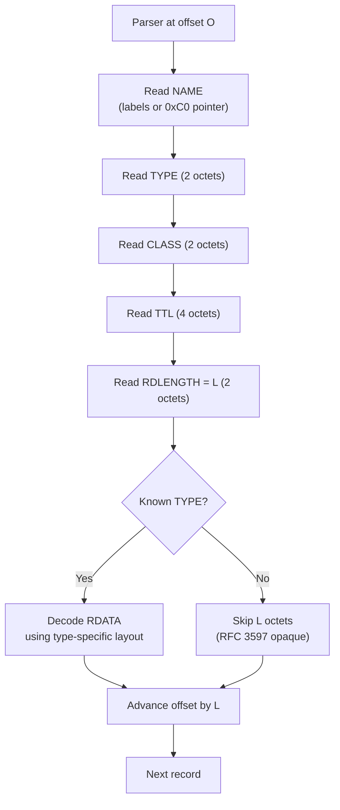
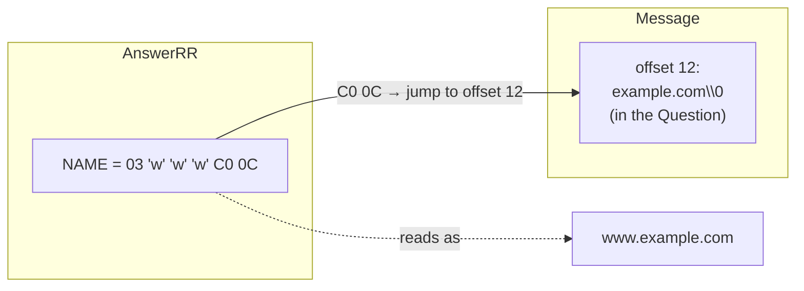
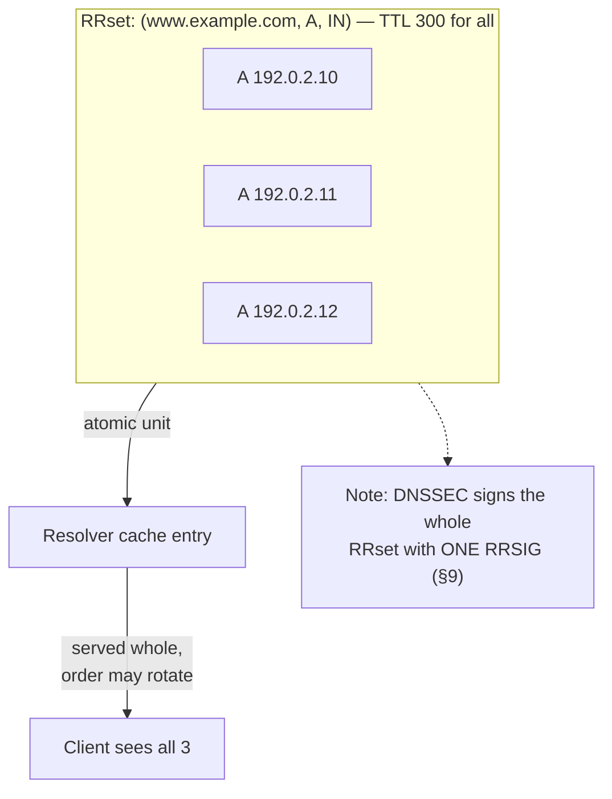
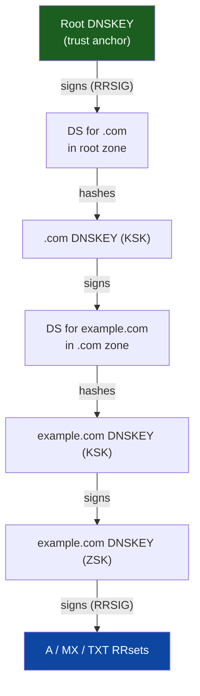

# DNS Record Types — Professional

<!-- level-focus -->
At professional level, focus on this question:

> How should teams adopt and operate **DNS Record Types** with measurable outcomes and limited coordination?

Use the smallest realistic scenario that exposes the decision and its failure behavior.
---

## 1. The Resource Record Wire Format

Every DNS resource record (RR) — whether it lives in the Answer, Authority, or
Additional section of a message — shares one common on-the-wire structure defined
in **RFC 1035 §4.1.3**. There are six fields, in this fixed order:

```text
                                1  1  1  1  1  1
  0  1  2  3  4  5  6  7  8  9  0  1  2  3  4  5
+--+--+--+--+--+--+--+--+--+--+--+--+--+--+--+--+
|                                               |
/                     NAME                      /   variable, domain-name form
/                                               /
+--+--+--+--+--+--+--+--+--+--+--+--+--+--+--+--+
|                     TYPE                      |   16 bits
+--+--+--+--+--+--+--+--+--+--+--+--+--+--+--+--+
|                     CLASS                     |   16 bits
+--+--+--+--+--+--+--+--+--+--+--+--+--+--+--+--+
|                      TTL                      |   32 bits (unsigned)
|                                               |
+--+--+--+--+--+--+--+--+--+--+--+--+--+--+--+--+
|                   RDLENGTH                    |   16 bits (length of RDATA)
+--+--+--+--+--+--+--+--+--+--+--+--+--+--+--+--+
/                     RDATA                      /   variable, RDLENGTH octets
/                                               /
+--+--+--+--+--+--+--+--+--+--+--+--+--+--+--+--+
```

| Field | Width | Meaning |
|-------|-------|---------|
| `NAME` | variable | The owner name — the domain this record is *about*, in DNS name encoding (§2). May be a compression pointer. |
| `TYPE` | 16 bits | The RR type code: A=1, NS=2, CNAME=5, SOA=6, PTR=12, MX=15, TXT=16, AAAA=28, SRV=33, DS=43, RRSIG=46, NSEC=47, DNSKEY=48. |
| `CLASS` | 16 bits | Almost always `IN` (Internet) = 1. CH (Chaos)=3 survives for `version.bind` TXT queries. |
| `TTL` | 32 bits | Unsigned seconds a resolver may cache the record. RFC 2181 §8 clarifies the high bit: values with bit 31 set MUST be treated as **0**, so the effective maximum TTL is 2³¹−1 (~68 years). |
| `RDLENGTH` | 16 bits | The exact octet count of the RDATA that follows. Lets a parser skip an unknown type without understanding it. |
| `RDATA` | `RDLENGTH` octets | The type-specific payload. Its structure is defined *per TYPE* (§3). |

Two properties are worth internalizing:

- **`RDLENGTH` makes the format self-delimiting.** A resolver that has never
  heard of a new type (say `HTTPS`, type 65) can still parse past it: read
  `RDLENGTH`, skip that many octets, continue. This is the "unknown RR" handling
  formalized in **RFC 3597**, and it is why DNS can add record types without a
  flag day.
- **All integers are big-endian (network byte order)** and the header preceding
  these records (ID, flags, section counts) is likewise 16-bit big-endian. There
  is no alignment padding — fields are packed octet-by-octet.



---

## 2. Domain Names on the Wire and Name Compression

A domain name is **not** an ASCII string with dots. On the wire (RFC 1035 §3.1)
it is a sequence of **labels**, each prefixed by a one-octet length, terminated
by a zero-length label (the root):

```text
www.example.com  encodes as:
  03 'w' 'w' 'w'   06 'e' 'x' 'a' 'm' 'p' 'l' 'e'   03 'c' 'o' 'm'   00
  \__len 3__/      \________len 6________________/   \__len 3__/     root
```

Constraints baked into the encoding:

- A single label is 1–63 octets. The length octet's **top two bits are reserved**;
  values `0b11xxxxxx` (`0xC0`+) are *not* a length — they signal a compression
  pointer. This is why labels cannot exceed 63 (`0x3F`).
- A full name (with length octets) is at most **255 octets**.
- Comparison is case-insensitive for ASCII (RFC 4343), but the original case
  SHOULD be preserved; DNSSEC canonical form (§9) lowercases it.

**Name compression (RFC 1035 §4.1.4).** Because names repeat constantly inside a
message (every record under `example.com` shares that suffix), a name may end
with a **pointer** instead of more labels. A pointer is two octets: the top two
bits are `11`, and the remaining 14 bits are an **offset from the start of the
DNS message** to where the rest of the name lives.

```text
Pointer octets:
  1  1 | 14-bit OFFSET
  0xC0 | .............   → e.g. C0 0C  = pointer to offset 0x000C (12)
```



A name in a record is therefore a **sequence of labels, optionally ending in a
pointer**. Rules a correct parser must enforce:

- A pointer must point *backward* (to an earlier offset) — RFC 1035 requires
  pointers reference a *prior* occurrence; forward/self pointers are a classic
  parsing-loop attack vector, so implementations bound the number of jumps.
- Only the **name fields** (owner NAME, and names *inside* certain RDATA like NS,
  CNAME, MX exchange, SOA MNAME/RNAME) are compressed. **RFC 3597** froze this:
  for record types defined after it, RDATA names MUST NOT use compression, so
  that generic parsers can copy RDATA opaquely. Older types (NS, MX, SOA, CNAME,
  PTR) may compress their embedded names.

This is why `RDLENGTH` is measured *as encoded* — if an MX exchange name is
compressed, the `RDLENGTH` counts the pointer's two octets, not the expanded name.

---

## 3. RDATA Encoding Per Record Type

The RDATA field is where the six-field envelope's meaning specializes. The table
below is the core reference of this document — the exact byte layout per type.

| TYPE (code) | RDATA layout | RDLENGTH (typical) | Notes |
|-------------|--------------|--------------------|-------|
| **A** (1) | 4 octets: IPv4 address, network order | 4 | `192.0.2.1` → `C0 00 02 01`. |
| **AAAA** (28) | 16 octets: IPv6 address, network order | 16 | RFC 3596. No `::` compression on the wire — full 128 bits. |
| **NS** (2) | one `<domain-name>` (compressible) | variable | Authoritative name server for the zone. |
| **CNAME** (5) | one `<domain-name>` (compressible) | variable | Canonical name / alias target. |
| **PTR** (12) | one `<domain-name>` (compressible) | variable | Reverse lookup target (`1.2.0.192.in-addr.arpa` → host). |
| **MX** (15) | 16-bit `PREFERENCE` + one `<domain-name>` `EXCHANGE` | 2 + name | Lower preference = higher priority. RFC 1035. |
| **SOA** (6) | `MNAME` + `RNAME` (two names) + five 32-bit fields | 2 names + 20 | Zone apex authority (§6). RFC 1035. |
| **TXT** (16) | one or more `<character-string>` (1-octet len + data) | ≥1 | Length-prefixed chunks, each ≤255 (§7). |
| **SRV** (33) | 16-bit PRIORITY + 16-bit WEIGHT + 16-bit PORT + `TARGET` name | 6 + name | RFC 2782. TARGET **not** compressed. |
| **DS** (43) | 16-bit KEYTAG + 8-bit ALG + 8-bit DIGEST-TYPE + DIGEST | 4 + digest | Delegation Signer (§9). RFC 4034. |
| **DNSKEY** (48) | 16-bit FLAGS + 8-bit PROTOCOL(=3) + 8-bit ALG + PUBLIC-KEY | 4 + key | Zone/key-signing key (§9). RFC 4034. |
| **RRSIG** (46) | 18 fixed octets + SIGNER'S NAME + SIGNATURE | 18 + name + sig | Signature over an RRset (§9). RFC 4034. |
| **NSEC** (47) | NEXT DOMAIN NAME + Type Bit Maps | name + bitmap | Authenticated denial of existence (§9). RFC 4034. |

### A and AAAA — the fixed-length address records

The simplest RDATA. An **A** record's RDATA is exactly four octets — the raw
IPv4 address in network byte order, `RDLENGTH = 4`. An **AAAA** record is exactly
sixteen octets — the full 128-bit IPv6 address, `RDLENGTH = 16`. There is *no*
textual form on the wire: the `::` zero-compression and hex-colon notation are
presentation-format conveniences only. A parser reads four (or sixteen) octets;
anything else for these types is malformed.

### MX — preference plus exchange

```text
MX RDATA:
  +--+--+                       16-bit PREFERENCE (unsigned)
  | PREFERENCE |
  +--+--+--------------------+
  /        EXCHANGE           /   a <domain-name> (may be compressed)
  +---------------------------+
```

`10 mail.example.com.` encodes as `00 0A` (preference 10) followed by the name
encoding of `mail.example.com`. Multiple MX records form an RRset; the resolver
sorts by ascending PREFERENCE and load-balances among equal preferences.

---

## 4. The RRset Concept and RFC 2181

An individual RR is not the true unit of DNS data. The unit is the **RRset**:
*all records sharing the same (NAME, TYPE, CLASS)* form one indivisible set.
**RFC 2181 §5** codifies this.

Key RFC 2181 rules a professional must know cold:

- **RRsets are atomic.** A resolver takes an RRset whole or not at all. You cannot
  cache three of the four A records for a name and drop one; the cache holds the
  complete set or nothing. This is what makes DNS round-robin and multi-A
  load spreading coherent.
- **All records in an RRset share one TTL.** RFC 2181 §5.2: if a server ever
  receives an RRset whose members carry *different* TTLs, it MUST treat the whole
  set as having a single TTL. Historically implementations picked the lowest;
  RFC 2181 says receivers should treat them as the same and the authority MUST
  emit them identical. Divergent TTLs are a zone-file error.
- **RRset ordering is not significant.** The order of records within an Answer
  section carries no meaning; a server may (and often does) rotate it for
  round-robin, but a resolver must not attach semantics to position.
- **Ranking / trustworthiness of data** (RFC 2181 §5.4.1): data from the Answer
  section of an authoritative, aa-bit response outranks Additional-section glue.
  A resolver must not let low-trust data overwrite high-trust cached data.



The RRset is also the granularity of **DNSSEC signing**: one `RRSIG` covers one
entire RRset, not one record. This is the deepest reason RRsets are atomic — you
cannot verify a signature over a subset.

---

## 5. CNAME-and-Other-Data Prohibition

A CNAME record maps an owner name to a *canonical* name; the alias name is meant
to be a pure redirection. **RFC 1034 §3.6.2** and **RFC 2181 §10.1** impose a
hard rule: **if a CNAME RR exists at a name, no other data may exist at that same
name** (with the DNSSEC exception below).

Why the encoding forbids it: a CNAME says "this name has *no data of its own*;
follow the alias." If an A record *and* a CNAME both existed at `foo.example.com`,
a resolver could not tell whether to return the A record or chase the CNAME — the
name's identity is ambiguous. So:

```text
INVALID zone data:
  foo.example.com.  CNAME  bar.example.com.
  foo.example.com.  A      192.0.2.5          ← illegal: CNAME + other data

VALID:
  foo.example.com.  CNAME  bar.example.com.   ← CNAME alone
  bar.example.com.  A      192.0.2.5          ← real data at the canonical name
```

Two important consequences and one exception:

- **No CNAME at a zone apex.** The apex (`example.com.` itself) must carry SOA and
  NS records, so by the prohibition it cannot also be a CNAME. This is why apex
  aliasing needs provider-specific hacks (ALIAS/ANAME) or the newer `HTTPS`/`SVCB`
  records, not a plain CNAME.
- **CNAME chains** are legal (`a → b → c → A`), but resolvers bound chain length
  to prevent loops, and each hop costs a round trip unless the server returns the
  chain in one answer.
- **DNSSEC exception:** a CNAME *may* coexist with `RRSIG` and `NSEC`/`NSEC3`
  records at the same name (RFC 4034), because those are meta-records describing
  the CNAME itself, not competing user data.

---

## 6. The SOA Record in Detail

The **SOA** (Start of Authority) record sits at the apex of every zone and defines
its authority parameters. Its RDATA (RFC 1035 §3.3.13) is two names followed by
five 32-bit unsigned integers — a fixed 20 octets *after* the two names:

```text
SOA RDATA:
  MNAME    <domain-name>   primary master name server for the zone
  RNAME    <domain-name>   responsible party mailbox (first label '.' = '@')
  SERIAL   32 bits         zone version number (RFC 1982 serial arithmetic)
  REFRESH  32 bits         secondary re-check interval (seconds)
  RETRY    32 bits         retry interval after a failed refresh (seconds)
  EXPIRE   32 bits         give-up interval; secondary stops answering if stale
  MINIMUM  32 bits         (redefined by RFC 2308 as) negative-caching TTL
```

| Field | Width | Role | Wire example |
|-------|-------|------|--------------|
| `MNAME` | name | Primary master; target of `NOTIFY`, source of AXFR. | `ns1.example.com` |
| `RNAME` | name | Admin mailbox with `@`→first-dot substitution (`hostmaster@example.com` → `hostmaster.example.com`). | encoded name |
| `SERIAL` | 32b | Version; secondaries transfer only when it increases (mod-2³² compare). | `2024010101` |
| `REFRESH` | 32b | How often a secondary polls the master's serial. | `7200` |
| `RETRY` | 32b | Wait before retrying a failed refresh. | `3600` |
| `EXPIRE` | 32b | If unrefreshed this long, secondary declares the zone dead. | `1209600` |
| `MINIMUM` | 32b | Per RFC 2308, the TTL for **negative** (NXDOMAIN/NODATA) answers. | `3600` |

Two subtleties:

- **SERIAL uses serial-number arithmetic (RFC 1982).** Comparisons are modulo
  2³²: `s1` is "newer" than `s2` if `0 < (s1 − s2) mod 2³² < 2³¹`. This is why you
  can wrap around zero without breaking zone transfer, but also why a botched jump
  can leave secondaries permanently convinced they are up to date.
- **MINIMUM was repurposed.** Originally it was a default TTL floor; RFC 2308
  redefined it as the negative-caching TTL, and the modern default zone TTL is set
  by the `$TTL` directive, not SOA MINIMUM.

---

## 7. Character-Strings: TXT and the Length-Prefix Model

A `<character-string>` (RFC 1035 §3.3) is a length-prefixed blob: **one octet of
length L (0–255) followed by L octets of data**. It is *not* NUL-terminated and it
is *not* limited to printable ASCII on the wire.

A **TXT** record's RDATA is **one or more** back-to-back character-strings:

```text
TXT RDATA for "v=spf1 include:_spf.example.com ~all":
  +----+--------------------------------------------------+
  | 26 |  v = s p 1 ...  (0x26 = 38 octets of text)        |
  +----+--------------------------------------------------+
       ^ length octet    ^ exactly that many data octets
```

Consequences that trip people up:

- **The 255-octet ceiling is per chunk, not per record.** A long TXT value (e.g.,
  a DKIM public key) is split into multiple 255-octet character-strings *inside
  one RR*. Consumers concatenate them. `RDLENGTH` bounds the whole thing; each
  inner length octet bounds its chunk.
- **Multiple strings vs. multiple records are different.** `("a" "b")` in one RR
  is two character-strings that concatenate to `ab`; two separate TXT RRs are two
  members of the RRset with independent meaning. SPF/DKIM parsers must handle the
  concatenation case.
- Presentation format quotes strings and escapes special bytes (`\255`, `\"`), but
  the wire form is just length+bytes. This length-prefix design is shared by
  HINFO, NAPTR flags, and other "text-ish" fields.

---

## 8. SRV: Service Location Encoding

The **SRV** record (RFC 2782) generalizes MX-style prioritized load balancing to
*any* service, and adds an explicit port. Its owner name is structured
(`_service._proto.name`, e.g. `_sip._tcp.example.com`), and its RDATA is three
16-bit integers followed by a target name:

```text
SRV RDATA:
  +--+--+     PRIORITY  (16 bits) — lower is tried first (like MX preference)
  +--+--+     WEIGHT    (16 bits) — relative share among equal-priority targets
  +--+--+     PORT      (16 bits) — TCP/UDP port of the service
  /  ...  /   TARGET    (<domain-name>) — host offering the service
  +-------+
```

| Sub-field | Width | Selection role |
|-----------|-------|----------------|
| `PRIORITY` | 16b unsigned | Client contacts the lowest-priority group first; only falls to higher values if all lower fail. |
| `WEIGHT` | 16b unsigned | Within one priority, servers are chosen proportionally to weight (weighted random). Weight 0 = last resort. |
| `PORT` | 16b unsigned | The port to connect to — SRV decouples service location from the well-known port. |
| `TARGET` | name | Hostname; a single dot `.` means "service explicitly not available here." |

Two encoding rules specific to SRV:

- **TARGET MUST NOT be compressed** (RFC 2782, consistent with RFC 3597). A
  parser copying RDATA must not expect a pointer inside the TARGET.
- **TARGET must resolve to an A/AAAA, not a CNAME** (RFC 2782). SRV explicitly
  forbids the target being an alias, so the extra indirection is avoided.

The selection algorithm — sort by PRIORITY ascending, then within a priority do a
weighted random draw across WEIGHT values — is the reason SRV can express both
failover (priority tiers) and load balancing (weights) in one record type.

---

## 9. DNSSEC Record Types at the Format Level

DNSSEC (RFC 4033/4034/4035) adds four record types that let a resolver
cryptographically validate answers. At the format level:

### DNSKEY (48) — the public keys

```text
DNSKEY RDATA:
  FLAGS      16 bits   bit 7 = Zone Key (ZK); bit 15 = SEP (key-signing key)
  PROTOCOL    8 bits   MUST be 3
  ALGORITHM   8 bits   e.g. 8 = RSASHA256, 13 = ECDSAP256SHA256
  PUBLIC KEY  variable algorithm-specific public key material
```

FLAGS `256` (ZK bit set) marks a Zone-Signing Key; `257` (ZK + SEP) marks a
Key-Signing Key. The **key tag** is a 16-bit checksum computed over the DNSKEY
RDATA — not stored, but recomputed to match RRSIG/DS references.

### RRSIG (46) — the signature over an RRset

```text
RRSIG RDATA (18 fixed octets, then two variable fields):
  TYPE COVERED    16 bits   which RRset TYPE this signs (e.g. 1 = A)
  ALGORITHM        8 bits   matches the DNSKEY algorithm
  LABELS           8 bits   label count in the owner name (wildcard detection)
  ORIGINAL TTL    32 bits   the RRset's TTL as signed (before caching decay)
  SIG EXPIRATION  32 bits   signature validity end (seconds since 1970, RFC 1982)
  SIG INCEPTION   32 bits   signature validity start
  KEY TAG         16 bits   which DNSKEY signed this
  SIGNER'S NAME   <name>    the signing zone (NOT compressed)
  SIGNATURE       variable  the raw signature bytes
```

One RRSIG covers exactly one RRset (§4). Validation recomputes the **canonical
form** of the RRset — owner names lowercased, records sorted by RDATA in canonical
order, `ORIGINAL TTL` substituted — then verifies the signature with the DNSKEY
identified by `KEY TAG` + `SIGNER'S NAME`. `ORIGINAL TTL` exists precisely because
a cached record's TTL counts down, which would otherwise break the signed bytes.

### DS (43) — the delegation link between zones

```text
DS RDATA:
  KEY TAG      16 bits   identifies the child's DNSKEY being vouched for
  ALGORITHM     8 bits   the DNSKEY's algorithm
  DIGEST TYPE   8 bits   1 = SHA-1, 2 = SHA-256 (preferred)
  DIGEST       variable  hash of the child's (KSK) DNSKEY
```

A **DS record lives in the parent zone** and hashes the child's Key-Signing Key,
forming the chain of trust: parent's signed DS → child's DNSKEY → child's RRSIGs.
This is why DNSSEC validation walks from the root down.

### NSEC (47) — authenticated denial of existence

```text
NSEC RDATA:
  NEXT DOMAIN NAME   <name>    the next existing owner name in canonical order
  TYPE BIT MAPS      variable  bitmap of the TYPEs that DO exist at this name
```

NSEC proves a name or type does **not** exist by pointing to the next name in
canonical order (so a queried name falling "between" two NSEC names is provably
absent) and by listing, in the bitmap, exactly which types the current name has.
Its weakness — it leaks the whole zone by chaining (zone walking) — is what NSEC3
(RFC 5155) addresses with hashed names.



Every arrow is a record type doing structural work: `DS` hashes down, `DNSKEY`
holds keys, `RRSIG` signs, and `NSEC` fills the gaps for names that don't exist.

---

## 10. A Worked Wire-Format Decode

Consider an Answer record for `www.example.com. 300 IN A 192.0.2.10`, appearing
in a message where `example.com` was already encoded at offset `0x000C` (the
Question). The bytes on the wire:

```text
Offset  Bytes            Field / meaning
------  ---------------  ------------------------------------------------
        03 77 77 77      NAME: label len 3, "www"
        C0 0C            NAME: compression pointer → offset 12 (example.com)
        00 01            TYPE  = 1  (A)
        00 01            CLASS = 1  (IN)
        00 00 01 2C      TTL   = 300 seconds
        00 04            RDLENGTH = 4
        C0 00 02 0A      RDATA = 192.0.2.10
```

Reading it as the algorithm in §1 would:

1. `NAME` — decode `03 'www'`, then hit `C0 0C`, a pointer; jump to offset 12,
   read `example.com`, splice: full owner name = `www.example.com`. The name cost
   only **6 octets** on the wire thanks to compression.
2. `TYPE 0x0001` → A; `CLASS 0x0001` → IN.
3. `TTL 0x0000012C` → 300 (bit 31 clear, so used as-is per RFC 2181 §8).
4. `RDLENGTH 0x0004` → decode 4 octets of A-type RDATA: `C0 00 02 0A` =
   `192.0.2.10`.
5. Advance the parser by exactly `RDLENGTH` and continue to the next record.

Now suppose the same message carried a second A record for the same name,
`192.0.2.11`. Both records share `(www.example.com, A, IN)`, so per §4 they are
**one RRset** with **one TTL of 300**, cached atomically, and — if the zone is
signed — covered by a **single RRSIG** whose `TYPE COVERED = 1`, `ORIGINAL TTL =
300`, and `SIGNER'S NAME = example.com`. The wire format, the RRset abstraction,
and DNSSEC all reference the *same* six-field envelope from §1 — that envelope is
the through-line of everything in this document.

---

### Professional Checklist
- [ ] Can decode any RR from raw octets: NAME (with pointers), TYPE, CLASS, TTL,
      RDLENGTH, RDATA — and skip an unknown type using RDLENGTH (RFC 3597).
- [ ] Know each type's RDATA layout: A=4, AAAA=16, MX=pref+name, SOA=2 names+5×32b,
      TXT=length-prefixed chunks, SRV=priority/weight/port/target.
- [ ] Treat the RRset — not the RR — as the atomic unit; one TTL per set, order
      insignificant, one RRSIG per set (RFC 2181, RFC 4034).
- [ ] Enforce the CNAME-and-other-data prohibition (with the DNSSEC exception).
- [ ] Understand name compression rules and why post-RFC-3597 types forbid it.
- [ ] Map the DNSSEC chain of trust to concrete records: DS→DNSKEY→RRSIG, NSEC for
      denial.


---

## Apply it

1. Define the user or business outcome that **DNS Record Types** should improve.
2. Assign one owner for code, contracts, operations, and incidents.
3. Split delivery into reversible increments that produce evidence early.
4. Publish responsibilities, escalation paths, and compatibility windows.
5. Stop or expand only when the agreed measures support that decision.

## Verify your work

- Each increment has an owner, rollback path, and observable exit condition.
- Adoption, reliability, delivery time, and coordination cost are measured.
- Incident and migration exercises prove that responsibility is executable.
- The old path is removed only after telemetry proves it is unused.

## Review questions

- Which measurable outcome justifies investing in DNS Record Types?
- Which team owns the full lifecycle and incident response?
- What reversible increment produces the earliest useful evidence?
- Which exit condition proves that migration or adoption is complete?
