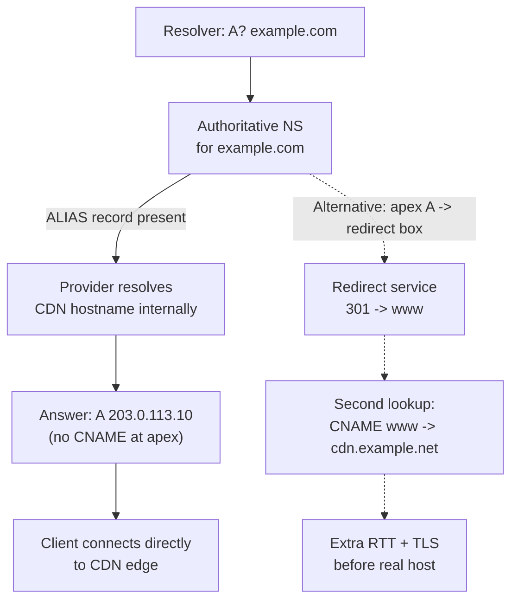
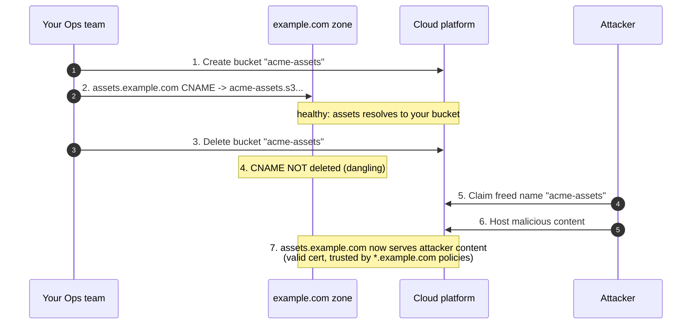

# DNS Record Types — Senior

<!-- level-focus -->
At senior level, focus on this question:

> Which system invariant is affected by **DNS Record Types** under failure, load, and change?

Use the smallest realistic scenario that exposes the decision and its failure behavior.
## 1. Apex-domain hosting behind a CDN or LB: ALIAS vs redirect vs CNAME

The apex domain (also called the zone apex, root, or naked domain — `example.com` with no label in front) is where a whole class of real-world DNS pain concentrates. The reason is a hard rule in RFC 1034/2181: a `CNAME` cannot coexist with any other record at the same name. The apex *must* carry `SOA` and `NS` records — that is what makes it a zone. Therefore the apex can never be a `CNAME`. But CDNs and cloud load balancers hand you a *hostname* (e.g., `d123.cloudfront.net`, `my-alb-1234.us-east-1.elb.amazonaws.com`), not a stable IP, precisely so they can move traffic, scale, and fail over behind that name. So you have a hostname you must resolve dynamically, at a place where `CNAME` is forbidden. That collision is the entire problem.

There are three ways out, and choosing between them is a senior decision:

- **ALIAS / ANAME / flattened CNAME (provider-side resolution).** Route 53 `ALIAS`, Cloudflare `CNAME flattening`, NS1/DNSimple `ALIAS`, Azure `alias record`. The authoritative server stores a pointer to the target hostname but, at query time, resolves that hostname itself and answers the client with plain `A`/`AAAA` records. To the resolver it looks like a normal address record at the apex — no CNAME, no rule violation — but you keep the CDN's ability to change IPs. This is the correct default for apex-behind-CDN. The tradeoffs: it only works if your DNS provider supports it (it is not a standard record type, it is provider magic), the provider must keep the target's TTL and health in sync, and it usually only works cleanly when the DNS provider and the target are the same vendor or explicitly integrated (Route 53 ALIAS to an AWS resource is free and health-aware; ALIAS to an arbitrary third-party hostname re-resolves on the provider's schedule).

- **HTTP redirect at the apex to `www` (redirect service).** Point the apex at a tiny redirect endpoint (an S3 redirect bucket, a CDN redirect rule, an nginx `return 301`) that issues `301 https://www.example.com/...`, and put the real `CNAME` on `www`. This sidesteps the apex-CNAME rule entirely because the apex only needs a stable IP for a box that does nothing but redirect. Cost: every apex hit pays one extra round trip (TCP + TLS + one HTTP request) before it lands on the real host, and you now own a redirect service that must itself be highly available and TLS-terminated. It is a legitimate pattern when your provider has no ALIAS support, but it is strictly worse for latency than ALIAS.

- **Static apex `A` records (do not).** Hard-coding the CDN's current IPs at the apex works until the CDN rotates them — which they do, silently, as part of normal operation. You will get intermittent failures and stale routing. Never pin CDN/LB IPs.



The rule to carry into every design review: **apex + CDN/LB = ALIAS if the provider supports it; redirect-to-www only as a fallback; never pin IPs.** For non-apex hosts (`www`, `api`, `assets`), a plain `CNAME` to the CDN hostname is correct and simplest — the coexistence rule does not bite there because those names carry no SOA/NS.

> 🎞️ **See it animated:** [How DNS works (interactive)](https://howdns.works/) · [DNSViz — visualize a zone's resolution](https://dnsviz.net/)

## 2. CNAME chains: latency and lookup cost

A `CNAME` is an alias: "this name is really that name; go ask again." Every hop in a chain is another name the resolver must resolve. Chains form naturally when you layer indirection — `www.example.com` → `example.com.cdn-provider.net` → `geo-pop-7.cdn-provider.net` → `A` — and each layer feels reasonable in isolation. The cost is real and paid on every *cold* resolution:

- **Resolution cost.** A resolver that has nothing cached must, in the worst case, walk each alias target down its own delegation chain. A three-hop CNAME chain where each target lives in a different zone can mean several extra round trips to different authoritative servers before an address is returned. RFC 1034 explicitly warns that CNAME chains should be short; many resolvers cap chain-following (commonly around 8–16 hops) and will `SERVFAIL` past the limit.
- **What caching does and does not save.** Once each link is cached, subsequent lookups collapse to a local cache read — the chain cost is a *cold-start* tax, not a steady-state one. But cold starts happen constantly at scale: TTL expiry, cache eviction, the long tail of resolvers worldwide, and the first user in every new geography. Your p99 DNS time, not your median, is what the chain inflates.
- **TTL interaction.** A chain is only as fresh as its shortest TTL and only as slow-to-change as its longest. A 30-second TTL on the last hop buys you nothing if a 1-hour TTL sits above it — the whole chain is effectively pinned at the max TTL for change purposes, while re-resolution frequency is driven by the min. This asymmetry surprises people.

Senior guidance: **flatten what you can.** If your DNS provider supports ALIAS/flattening, collapse `www`'s chain into direct `A`/`AAAA` answers served from the authoritative edge — you trade a multi-hop client resolution for a single provider-side lookup that is cached at the authoritative layer. Keep intentional CNAMEs (e.g., pointing at a CDN so the provider can steer traffic) but resist accidental stacking. Audit chains with `dig +trace` and flag any chain longer than two hops for review.

## 3. Record-choice decision table

The artifact to paste into a design doc. It maps an architectural intent to the correct record and the reasoning.

| Intent | Correct record | Why / constraint |
|---|---|---|
| Apex domain behind CDN/LB | **ALIAS/ANAME** (or redirect-to-www fallback) | CNAME forbidden at apex; ALIAS answers with A/AAAA while tracking the CDN hostname |
| `www`/`api`/`assets` behind CDN/LB | **CNAME** → provider hostname | Lets the provider steer IPs; coexistence rule does not apply off-apex |
| Fixed host, you own the IP | **A** (IPv4) / **AAAA** (IPv6) | Direct, one lookup, no chain; only when the IP is stable |
| Mail routing for a domain | **MX** (+ priorities) | Names the receiving mail servers; MX target must be an A/AAAA, never a CNAME (RFC 2181) |
| Sender authorization (email) | **TXT** (SPF) | Lists IPs/hosts allowed to send as the domain |
| Message signing (email) | **TXT** (DKIM `selector._domainkey`) | Publishes the public key verifying DKIM signatures |
| Policy for SPF/DKIM failures | **TXT** (DMARC `_dmarc`) | Tells receivers what to do on auth failure + where to send reports |
| Service discovery (host+port) | **SRV** (`_service._proto.name`) | Returns target host **and port** with priority/weight; the only record that carries a port |
| Restrict who can issue certs | **CAA** | Names permitted CAs at issuance time; violation blocks issuance |
| Verify domain ownership | **TXT** | Ad-hoc proof tokens for ACME/SaaS onboarding |
| Reverse lookup (IP → name) | **PTR** (in `in-addr.arpa`) | Lives in the IP-space zone, not your forward zone; matters for mail rep |
| Catch-all for undefined subdomains | **wildcard** (`*.example.com`) | Answers any unmatched label; see §6 for the sharp edges |

Two rows senior engineers routinely get wrong: **MX and NS targets must resolve to address records, not to a CNAME.** Pointing an MX at a CNAME is a spec violation (RFC 2181 §10.3) that some mail servers tolerate and others reject — a classic intermittent-delivery bug.

## 4. Email deliverability design: MX + SPF + DKIM + DMARC

Deliverability is not one record — it is a four-record system where each layer answers a different receiver question. Miss one and your legitimate mail lands in spam; misconfigure one and attackers spoof your domain. As the owner you design all four together.

- **MX — where mail goes.** `MX 10 mail1.example.com.` names the receiving servers with a priority (lower = preferred); ties are load-balanced. This is inbound routing only. The target must be an `A`/`AAAA`, never a CNAME.
- **SPF (published as TXT) — who may send.** `v=spf1 include:_spf.google.com ip4:203.0.113.0/24 -all` lists the hosts/IPs authorized to send *as* your domain. The receiver checks the sending IP against this list. Watch the **10-DNS-lookup limit**: each `include`/`a`/`mx`/`ptr`/`exists` mechanism costs a lookup, and exceeding ten yields a `permerror` that fails SPF entirely. Nesting several ESP `include`s is the usual way people blow the budget — flatten or consolidate. End with `-all` (hard fail) once you are confident all senders are enumerated; `~all` (soft fail) while you gather data.
- **DKIM (published as TXT at `selector._domainkey`) — is the message intact and from us.** The sending server signs headers/body with a private key; the receiver fetches the public key from `selector._domainkey.example.com` and verifies. Because you control the selector, you can rotate keys and run multiple selectors (per-ESP) simultaneously. DKIM survives forwarding (SPF does not), which is why DMARC needs both.
- **DMARC (published as TXT at `_dmarc`) — what to do on failure, and tell me about it.** `v=DMARC1; p=reject; rua=mailto:dmarc@example.com; adkim=s; aspf=s`. DMARC ties SPF/DKIM results to the *visible* `From:` domain via **alignment** — a message can pass raw SPF/DKIM yet fail DMARC if the authenticated domain does not align with `From:`. This is what actually stops spoofing. Roll out in stages: `p=none` (monitor via aggregate reports) → `p=quarantine` → `p=reject`. Never jump straight to `reject` — you will silently drop legitimate mail you did not know about.

```mermaid
sequenceDiagram
    autonumber
    participant S as Sender MTA
    participant R as Receiver MTA
    participant D as DNS (your zone)
    S->>R: 1. SMTP: MAIL FROM + DKIM-signed message
    R->>D: 2. TXT? example.com (SPF)
    D-->>R: 3. v=spf1 ... -all
    R->>D: 4. TXT? selector._domainkey.example.com (DKIM key)
    D-->>R: 5. public key
    R->>D: 6. TXT? _dmarc.example.com (policy)
    D-->>R: 7. p=reject; alignment rules
    Note over R: 8. Check SPF pass AND/OR DKIM pass,<br/>then verify each aligns with From:
    Note over R: 9. On DMARC fail -> apply p= policy (reject),<br/>send aggregate report to rua=
```

The design principle: **SPF and DKIM are mechanisms; DMARC is the policy that makes them enforceable through alignment.** Ship all four, ramp DMARC by stages, and watch aggregate reports before tightening.

## 5. SRV-based service discovery

`SRV` is the one record that returns a **port** alongside a target host, which makes it the DNS-native answer to "where does service X live and on what port?" Its name follows the strict form `_service._proto.name` (e.g., `_sip._tcp.example.com`, `_ldap._tcp.example.com`, `_xmpp-server._tcp.example.com`). The record body carries four fields:

```
_service._proto.name  TTL  IN  SRV  <priority> <weight> <port> <target>
_sip._tcp.example.com. 300 IN  SRV  10 60 5060 sip1.example.com.
_sip._tcp.example.com. 300 IN  SRV  10 40 5060 sip2.example.com.
_sip._tcp.example.com. 300 IN  SRV  20  0 5060 sip-backup.example.com.
```

- **Priority** works like MX: lowest first; only fall to a higher number when all lower ones are unreachable — this gives you tiers (primary DC, then backup DC).
- **Weight** distributes load *within* a priority tier proportionally (60/40 above), giving DNS-level weighted balancing without a load balancer.
- **Port + target** let the client connect without hardcoding a port; the target must be a real `A`/`AAAA`, not a CNAME.

Where SRV shines and where it does not: it is the backbone of protocol discovery (SIP, XMPP, LDAP, Kerberos, Minecraft, and internal Consul/`.consul` service names). It is genuinely useful for internal service discovery when clients speak SRV. The catch is **client support**: most HTTP clients and browsers ignore SRV entirely — you cannot make a web browser honor an SRV record for a website. So SRV is excellent for protocol-aware clients and service meshes, and a non-starter for the public web, where you fall back to A/AAAA/CNAME plus a load balancer. Treat SRV as a tool for controlled client ecosystems, not the open internet.

## 6. Wildcard records and their risks

A wildcard record (`*.example.com`) synthesizes an answer for any label that has no explicit record. `* IN A 203.0.113.9` means `anything.example.com`, `random.example.com`, and `typo123.example.com` all resolve to the same address. It is convenient for multi-tenant apps (`{tenant}.app.example.com`) and catch-all handlers. The risks are what make it a senior-review item:

- **It masks typos and non-existent hosts.** A wildcard answers `foo.example.com` even when `foo` was never provisioned, so misconfigurations return "success" instead of `NXDOMAIN`. Monitoring that relies on NXDOMAIN to catch dead references goes blind.
- **Wildcards do not descend and do not override.** RFC 4592 is subtle: `*.example.com` matches `x.example.com` but **not** `x.y.example.com` (a wildcard covers exactly one level below its position), and any *explicitly present* name — even an unrelated record type at that name — stops the wildcard from applying there. Engineers routinely expect a wildcard to blanket the whole subtree; it does not.
- **It expands attack surface for takeover and abuse.** A wildcard pointing at a shared platform means *every* unclaimed name under it resolves to that platform, widening the blast radius of the subdomain-takeover problem in §8 and enabling attackers to serve content from arbitrary-looking hostnames on your brand.
- **It interacts badly with CAA and TLS.** A wildcard *DNS* record is unrelated to a wildcard *TLS certificate* — do not conflate them — but a broad DNS wildcard plus a broad wildcard cert is a lot of trust concentrated in one place.

Guidance: prefer explicit records; use wildcards only for genuinely open-ended, controlled namespaces (tenant subdomains you fully own the routing for), scope them as narrowly as possible, and pair them with monitoring that does not depend on NXDOMAIN.

## 7. CAA: locking down certificate issuance

A `CAA` (Certification Authority Authorization) record tells Certificate Authorities *which* CAs are allowed to issue certificates for your domain. Since 2017 all publicly-trusted CAs are **required** by CA/Browser Forum rules to check CAA before issuance — so this record is an enforced control, not advisory.

```
example.com.  CAA 0 issue "letsencrypt.org"
example.com.  CAA 0 issuewild "digicert.com"
example.com.  CAA 0 iodef "mailto:security@example.com"
```

- **`issue`** authorizes a CA for standard certs; **`issuewild`** governs wildcard certs specifically; an empty value (`issue ";"`) forbids issuance entirely.
- **`iodef`** gives the CA a channel to report a policy-violating issuance attempt — a security signal you should be receiving.
- CAA checks the exact name and walks *up* the tree (the CA checks `sub.example.com`, then `example.com`), so a policy at the apex covers subdomains unless overridden.

The threat this closes: without CAA, *any* trusted CA in the world can issue a cert for your domain, so a single compromised or tricked CA is enough for an attacker to obtain a valid cert and impersonate you. CAA shrinks that from "any CA on earth" to "the two CAs I explicitly named." It is a five-minute change with outsized security value — every domain you own should have a CAA policy. Pair it with **CAA plus DNSSEC** where possible so an attacker cannot forge the CAA answer itself, and monitor Certificate Transparency logs for certs issued outside your policy.

## 8. Failure modes: loops, dangling records, subdomain takeover

Three failure classes dominate DNS incidents at the record layer.

**CNAME loops.** `a.example.com` → `b.example.com` → `a.example.com`. Resolvers detect the cycle and return `SERVFAIL` (or hit their chain limit), so the name is simply unresolvable — a hard outage for anything behind it. Loops usually arise from two teams each pointing at the other, or a copy-paste that targets the record's own name. Detection: `dig +trace` and periodic zone linting that walks every CNAME target.

**Dangling records → subdomain takeover.** This is the highest-severity record-layer risk. You create `assets.example.com CNAME my-bucket.s3.amazonaws.com` (or a CDN distribution, a Heroku app, a GitHub Pages site). Later you decommission the bucket/app but **forget to delete the DNS record**. The name now points at a resource *you no longer control but that the platform will happily re-assign*. An attacker registers the freed resource name, and now serves content from `assets.example.com` — a real subdomain of your brand, often eligible for a valid TLS cert and trusted by users, cookies, and CORS/CSP rules scoped to `*.example.com`.



Defenses: **delete DNS records in the same change that decommissions the resource** (make it a checklist/IaC-enforced step so the record and resource have coupled lifecycles); run continuous dangling-CNAME scanning that flags targets pointing at unclaimed/`NXDOMAIN` platform resources; and prefer verification tokens/ownership binding where the platform offers it. Wildcards (§6) amplify this — a wildcard over a shared platform is a takeover waiting for a claim.

**Stale/orphaned A records.** Similar to dangling CNAMEs but with a hardcoded IP that gets re-assigned to another tenant in your cloud provider's pool. Same fix: couple record lifecycle to resource lifecycle and never pin ephemeral IPs.

## 9. TTL vs record-change coordination

The TTL is a promise to resolvers: "you may cache this answer for N seconds." That promise is the single biggest lever — and trap — in any DNS change. The asymmetry to internalize:

- **A record does not "change" the moment you edit the zone.** Every resolver that already cached the old value keeps serving it until its copy expires — up to the *old* TTL that was in effect *when it cached*. If your TTL is 3600 s, a change can take up to an hour to fully propagate, and lowering the TTL *now* does nothing for answers already cached at the old high value.
- **Therefore you pre-lower the TTL.** The standard migration recipe: (1) well before the change, drop the TTL to something small (30–60 s) and wait *at least the old TTL* so every cache has re-fetched the low-TTL version; (2) make the actual record change — it now propagates within the low TTL; (3) after the change has settled and you are confident, raise the TTL back up to reduce query load and improve resilience. Skipping step 1 is the classic mistake that turns a "quick DNS cutover" into an hour of split-brain traffic.
- **TTL is a cost/agility tradeoff.** Low TTL = fast changes and failover, but more queries hitting your authoritative servers (higher cost, larger blast radius if authoritative DNS has an incident) and a harder dependency on DNS uptime. High TTL = cheap, resilient to authoritative outages, but slow to change. Choose per record: keep failover-critical records (LB/CDN targets) at low TTL by design; keep stable infrastructure (MX, NS) at higher TTL.
- **Negative caching bites too.** `NXDOMAIN` responses are cached according to the SOA minimum/`MINIMUM` field (RFC 2308). If you create a name that resolvers recently cached as non-existent, they may keep returning `NXDOMAIN` for the negative-cache duration. Provision names *before* you announce them.

| Scenario | TTL strategy | Reasoning |
|---|---|---|
| Planned cutover/migration | Pre-lower to 30–60 s, wait ≥ old TTL, change, then raise | Guarantees caches hold the low TTL before the switch |
| Active-active failover target | Keep low (30–120 s) permanently | Fast recovery outweighs extra query cost |
| Stable MX / NS records | High (1–24 h) | Rarely change; resilience + low query load matter more |
| Rolling out a new subdomain | Provision + verify before announcing | Avoids negative-cache NXDOMAIN sticking |
| Emergency IP change with high TTL already live | You are stuck for up to the old TTL | Why you keep critical records low *before* you need them |

The senior discipline: **TTL is a decision you make in advance, not during the incident.** The time to have a low TTL is before you need to change the record — you cannot retroactively shorten a cache entry that is already out in the world.

## 10. Key takeaways

- **Apex + CDN/LB = ALIAS/flattening**, not CNAME (forbidden at apex) and not pinned IPs; redirect-to-`www` is a fallback that costs an extra RTT.
- **CNAME chains are a cold-start latency tax** capped by resolver hop limits; flatten accidental chains, keep intentional ones ≤ 2 hops, and remember a chain's freshness is governed by its longest TTL.
- **MX and NS targets must resolve to A/AAAA, never a CNAME** — the intermittent-delivery bug that RFC 2181 warns about.
- **Deliverability is a four-record system:** MX (routing) + SPF (who may send, ≤10 lookups, end `-all`) + DKIM (signing, per-selector keys) + DMARC (alignment-enforced policy, ramp `none → quarantine → reject`).
- **SRV is the only record with a port**; use it for protocol-aware clients and service meshes, never for the public web where clients ignore it.
- **Wildcards mask typos, cover exactly one level, are overridden by explicit names, and widen takeover blast radius** — prefer explicit records and scope wildcards tightly.
- **CAA is CA/Browser-Forum-enforced** issuance control — every domain should name its allowed CAs and set `iodef`; pair with DNSSEC.
- **Dangling records → subdomain takeover** is the top record-layer risk; couple DNS-record lifecycle to resource lifecycle and scan continuously.
- **TTL is decided in advance:** pre-lower before a cutover, keep failover-critical records low by design, mind negative caching, and never expect a live change to shorten caches already out in the world.

---

*Next step:* [DNS Record Types — Professional](professional.md)

---

## Apply it

1. State the system invariant that **DNS Record Types** must protect.
2. Mark ownership, state, and failure propagation at each boundary.
3. Compare two designs under load, dependency failure, and future change.
4. Define recovery and compatibility behavior before implementation.
5. Test the riskiest assumption with a focused experiment.

## Verify your work

- The experiment supports the design with evidence, not preference.
- Failure injection shows the blast radius and recovery path.
- Compatibility checks cover old and new callers or data.
- Operational signals reveal invariant violations and recovery progress.

## Review questions

- Which invariant must remain true when DNS Record Types fails?
- Where should recovery responsibility live, and why?
- Which assumption deserves an experiment before implementation?
- How can the design evolve without changing every consumer at once?
