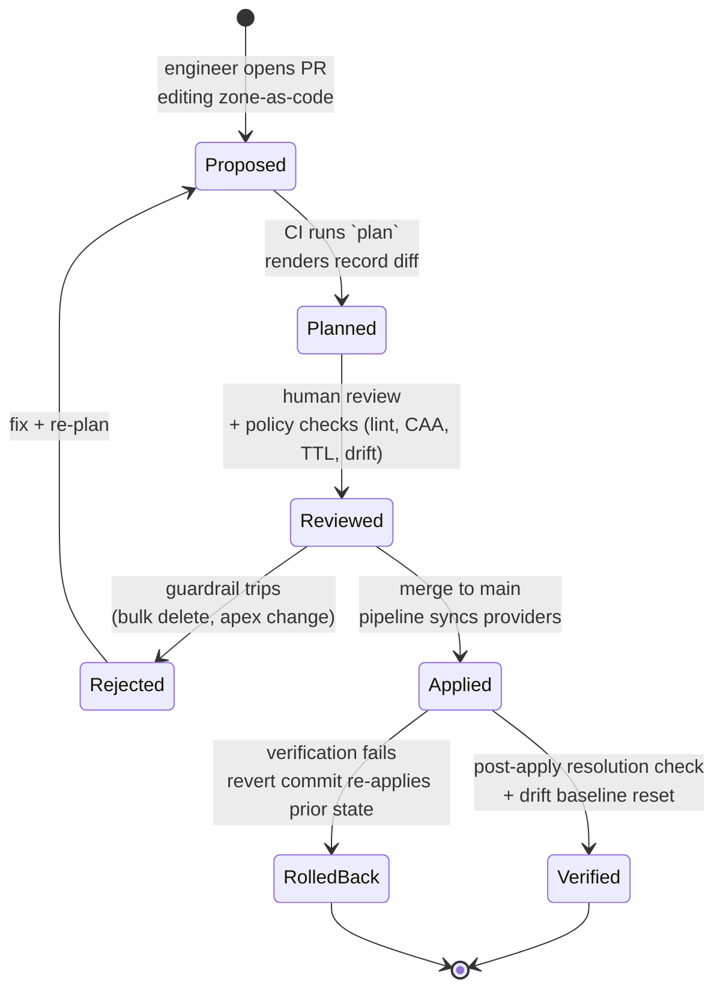
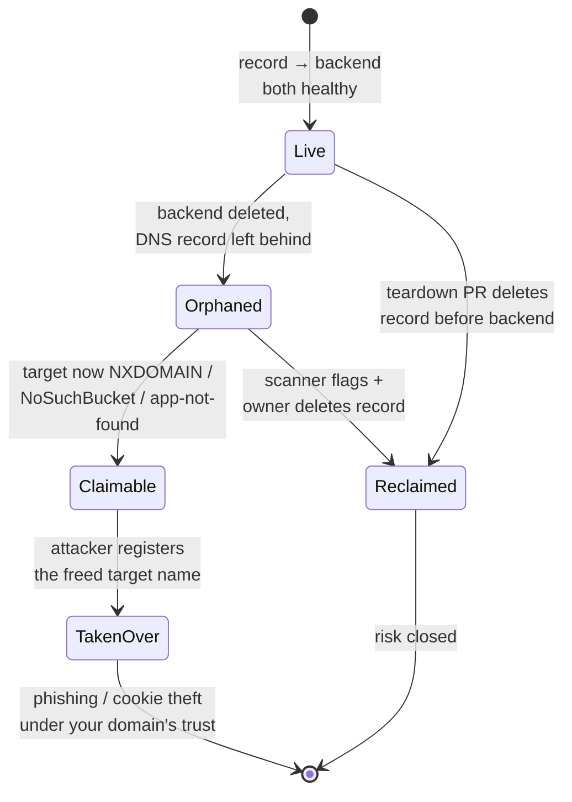

# DNS Record Types — Staff

At Staff and Principal scope, DNS record types stop being a lookup of "which RR do I need" and become a *governance surface*. A zone is a distributed, globally-cached, security-critical config store that dozens of teams write to — often through a web console, with no review, no history, and no owner. The interesting failures are not "the record was wrong for five minutes"; they are a dangling `CNAME` that hands an attacker your subdomain a year after the backend was deleted, an SPF record that silently caps at ten DNS lookups and starts bouncing payroll email, or a CAA record nobody set that lets any CA in the world mint a cert for your apex. This page treats records as configuration-as-code with blast radius, ownership, and a change-management story — not as protocol trivia.

## Table of Contents

1. [The framing: a zone is a shared config store, not a form](#1-the-framing-a-zone-is-a-shared-config-store-not-a-form)
2. [DNS-as-code: zone files in git, Terraform, OctoDNS](#2-dns-as-code-zone-files-in-git-terraform-octodns)
3. [The change pipeline and blast radius of a bad edit](#3-the-change-pipeline-and-blast-radius-of-a-bad-edit)
4. [Record sprawl, ownership, and drift detection](#4-record-sprawl-ownership-and-drift-detection)
5. [Dangling records and subdomain takeover governance](#5-dangling-records-and-subdomain-takeover-governance)
6. [Email authentication as a cross-team program: SPF/DKIM/DMARC](#6-email-authentication-as-a-cross-team-program-spfdkimdmarc)
7. [CAA: constraining CA issuance org-wide](#7-caa-constraining-ca-issuance-org-wide)
8. [Multi-provider record sync and the tooling comparison](#8-multi-provider-record-sync-and-the-tooling-comparison)
9. [When to standardize vs let teams self-serve](#9-when-to-standardize-vs-let-teams-self-serve)
10. [Staff-level takeaways](#10-staff-level-takeaways)

---

## 1. The framing: a zone is a shared config store, not a form

Every DNS record is a small piece of globally-published, aggressively-cached configuration that some external party — a browser, a mail server, a certificate authority, a monitoring probe — will trust and act on. A zone with a few thousand records is a config store with a few thousand keys, written by everyone from the platform team to a contractor who needed a quick vanity hostname for a demo.

Three properties make records a Staff-level concern rather than a per-team convenience:

- **Global blast radius with cache lag.** A record change is not a deploy you can roll back in seconds. Resolvers worldwide cache by TTL; a mistake published with a 24-hour TTL is a 24-hour outage for the unlucky fraction of clients that pulled the bad value, and you cannot force-evict their caches. The TTL you chose *before* the incident is the recovery time you are stuck with *during* it.
- **Cross-actor trust.** `MX`, `TXT` (SPF/DKIM/DMARC), and `CAA` records are not consumed by your systems — they are consumed by Google's mail servers, Let's Encrypt's issuance pipeline, and every recipient's spam filter. A wrong record here does not break your service; it breaks *other people's trust decisions about you*, which is harder to detect and slower to fix.
- **No natural owner.** A `A`/`AAAA` record for `api.example.com` has an obvious owner. A `TXT` record named `_acme-challenge.legacy-app` from a project that shipped three years ago has none. Records accumulate; nothing deletes them. Ownership decays to zero, and unowned records are exactly the ones that become takeover vectors.

The Staff mistake is to treat DNS as an operational chore delegated to whoever holds the registrar login. The Principal move is to treat the zone as a first-class, version-controlled, reviewed, and owned artifact — with the same rigor you apply to production code — because it *is* production config, just published to the whole internet.

## 2. DNS-as-code: zone files in git, Terraform, OctoDNS

The foundational Staff decision is to make the git repository the source of truth and the DNS provider a *render target*, not the other way around. Once the desired state lives in a reviewed repo, every property you want — history, review, rollback, drift detection, blast-radius limits — follows from tooling you already run for application code.

Three broad approaches exist, in rough order of maturity:

- **Terraform / OpenTofu with a provider's DNS resource.** Records become HCL resources; `plan` shows the diff; state tracks reality. Strong where DNS is one slice of a larger IaC estate (the same repo provisions the load balancer *and* its `A` record). Weakness: state-file friction, per-provider resource schemas, and awkward bulk operations across thousands of flat records.
- **OctoDNS (declarative YAML → many providers).** Purpose-built for DNS: you describe zones in YAML, and it syncs to one or more providers with a `--dry-run` plan and change-count guardrails. Its native multi-provider model makes it the natural choice when you run more than one DNS vendor. Weakness: it owns DNS and nothing else, so cross-resource coupling (record depends on the LB it points at) lives outside it.
- **DNSControl (declarative JavaScript DSL → many providers).** Similar declarative multi-provider posture with a programmable config language, useful when you want loops and helpers to generate records.

The unifying principle is a **reconcile loop**: declared state in git, actual state at the provider, and a planner that computes and applies the delta under review. What you standardize is not the tool but the *invariant* — no record reaches a public resolver except by merging to `main`.

The payoff of this pipeline is not tidiness — it is that a DNS change now carries a diff a reviewer can read, an author accountable in `git blame`, an automatic revert path (revert the commit, re-apply), and a place to hang policy checks *before* anything is published.

## 3. The change pipeline and blast radius of a bad edit

A single-character DNS edit can be the largest-blast-radius change in your organization. Deleting the apex `A` record for `example.com`, or repointing the `MX` to nowhere, is a total outage that no application deploy could cause. Staff work is to make the *destructive* changes hard and the *safe* changes easy, and to bound how far any single change can propagate.

Concrete guardrails that belong in the pipeline:

- **Change-count limits.** Reject a plan that deletes or modifies more than N records without explicit override. Both OctoDNS (change-count thresholds) and disciplined Terraform review exist to stop a bad refactor from wiping a zone. A plan touching 400 records when the PR "renames one host" is a bug, not a change.
- **Protected records.** The apex `A`/`AAAA`, the `NS` set, the `MX`, the `SOA`, and the org `CAA` are the crown jewels. Treat them like protected branches: edits to them require a second reviewer and often a break-glass note. Most incidents come from an automated refactor touching a record no human meant to touch.
- **TTL discipline as blast-radius control.** TTL is your recovery-time knob. Before a risky migration, *lower* the TTL (e.g. to 60 s) a full day ahead so caches worldwide already hold the short value; make the switch; then raise it back once stable. A migration planned at a 3600 s TTL means an hour of stale answers is baked in before you start.
- **Staged apply.** For records fronting many resolvers, apply to a canary provider or a low-traffic geography, verify resolution, then fan out — the DNS analogue of a progressive rollout.
- **Post-apply verification.** After sync, resolve the changed names from multiple public resolvers (1.1.1.1, 8.8.8.8, an authoritative dig) and assert the answer matches intent. A silent partial-propagation failure caught by a bot is a non-incident; caught by a customer it is a Sev-1.

The judgment call is where to put friction. Put it on the *irreversible and high-fanout* records; keep the long tail of app hostnames a fast self-serve path (Section 9). Friction applied uniformly just teaches teams to route around DNS-as-code entirely.

## 4. Record sprawl, ownership, and drift detection

Zones only grow. Every launch adds records; almost no cleanup removes them. After a few years a mature org's zone is an archaeological dig of demos, decommissioned services, and one-off verification `TXT`s. Sprawl is not cosmetic — every stale record is latent risk (Section 5) and every unmanaged record is a hole in your as-code guarantee.

Two disciplines contain it:

- **Ownership metadata.** Attach an owner to every record — a team tag in the as-code file, or an accompanying `TXT`/annotation convention. A record whose owner cannot be named is a record that will not be maintained, patched, or deleted. Make "who owns this" answerable by `grep`, not by asking around.
- **Drift detection.** Run the reconcile planner on a schedule (not just on PR) and alert on any non-empty diff between git and the provider. A non-empty scheduled diff means someone changed a record *out of band* — through the console, bypassing review. That is both a security signal (unreviewed public config change) and a correctness signal (the next `apply` from git will silently revert their emergency fix, possibly re-breaking what they were fixing). Drift is the leading indicator that your as-code story has a hole in it.

| Concern | Manual console / registrar UI | IaC (Terraform / OctoDNS in git) | Multi-provider sync (OctoDNS/DNSControl) |
| --- | --- | --- | --- |
| Change history / audit | None (or opaque provider log) | Full `git log` + `blame` | Full, per-provider render tracked |
| Review before publish | None | PR review + CI policy checks | PR review + per-provider dry-run |
| Rollback | Manual re-edit from memory | Revert commit, re-apply | Revert commit, re-sync all providers |
| Drift detection | Impossible | Scheduled `plan` diff alerts | Scheduled diff across all providers |
| Bulk-mistake blast radius | Unbounded (one careless UI action) | Bounded by change-count guardrails | Bounded, applied atomically per plan |
| Provider portability | Locked to that console | Provider-specific resources | Provider-agnostic, N targets at once |
| Ownership traceability | None | Owner tag in source, greppable | Owner tag in source, greppable |
| Time-to-first-record (small team) | Seconds | Minutes (PR cycle) | Minutes (PR cycle) |

The table's bottom row is the honest cost: as-code adds latency to the *simple* case. That is precisely the tension Section 9 resolves — you do not pay PR latency to buy governance you do not need on a throwaway hostname.

## 5. Dangling records and subdomain takeover governance

Subdomain takeover is the highest-severity, lowest-visibility DNS failure, and it is a pure *governance* failure — the DNS layer is working exactly as configured; the configuration just points at something an attacker now controls.

The mechanism: `app.example.com` is a `CNAME` to a cloud resource — an S3 bucket, an App Service, a CDN distribution, a Heroku app, a GitHub Pages site. The team deletes the backend but forgets the DNS record. The `CNAME` now dangles, resolving to a provider hostname that no longer has an owner. An attacker registers that same bucket/app name on the provider, and now *they* serve content at your subdomain — with your domain's trust, your cookies' scope, and your ability to pass domain-validated cert issuance. It becomes phishing that lands on your real domain, or cookie theft against the parent domain.

The governance program that prevents it:

- **Deletion order as policy.** Tearing down a service means: delete the DNS record *first* (or in the same change), *then* the backend. Because DNS is as-code, the record deletion is part of the same reviewed PR that decommissions the infrastructure — the two can be coupled, which is exactly what manual consoles cannot guarantee.
- **Continuous dangling-record scanning.** Periodically resolve every `CNAME` and `A`/`AAAA` in the zone and check whether the target is claimable — an NXDOMAIN target, a `NoSuchBucket`, a cloud "app not found" fingerprint. Any hit is a takeover-in-waiting. This is the single highest-ROI DNS security control at scale, and it must run against the *live* zone, not just the git state (drifted records are the most dangerous).
- **Ownership closes the loop.** When the scanner flags `legacy-app.example.com`, the owner tag from Section 4 is what turns "an alert" into "a ticket assigned to a named team today" instead of a finding that ages out.

The Principal insight: takeover is not a bug in DNS or in the cloud provider — it is the *absence of a deletion discipline*. The fix is organizational (deletion order, scanning, ownership), and the as-code pipeline is what makes that discipline enforceable rather than aspirational.

## 6. Email authentication as a cross-team program: SPF/DKIM/DMARC

Email authentication is where "one `TXT` record" reveals itself as a multi-team, multi-quarter program. SPF, DKIM, and DMARC are all published as DNS records, but they encode the sending behavior of *every* system in the company that emits mail — marketing's ESP, the billing platform, the CI system's alert emails, the recruiting tool, the shared inbox. Get it wrong and you either let anyone spoof your domain or you bounce your own payroll.

The three records and their record-level pitfalls:

- **SPF (`TXT` at the domain).** Lists the IPs/hosts allowed to send as your domain. Its infamous trap is a **hard limit of 10 DNS lookups** during evaluation; each `include:` (one per SaaS sender) consumes lookups, and exceeding ten yields a `PermError` that causes receivers to fail or ignore SPF entirely. A large org with a dozen mail-sending vendors silently blows this budget. Mitigations — SPF flattening, consolidating senders, macro tricks — are all ways of managing a *shared, finite record-level budget* across teams. This is the canonical example of a record type whose constraint forces org coordination.
- **DKIM (`TXT`/`CNAME` at `selector._domainkey`).** Publishes public keys so receivers can verify a cryptographic signature each sender applies. Every distinct sending system needs its own *selector*, so DKIM sprawls into many records, and key rotation is a DNS change coordinated with the mail platform. Orphaned selectors from retired senders are their own cleanup problem.
- **DMARC (`TXT` at `_dmarc`).** Ties SPF and DKIM together with a policy (`p=none|quarantine|reject`) and an alignment requirement, plus `rua`/`ruf` addresses that receive aggregate reports. DMARC is the *program driver*: you start at `p=none` (monitor only), read the aggregate reports to discover every legitimate sender you did not know about, bring each into SPF/DKIM alignment, and only then ratchet the policy toward `p=reject`. Jumping straight to `reject` is how you discover — via bounced invoices — that a business-critical system was sending unauthenticated mail.

The Staff framing: SPF/DKIM/DMARC is a **discovery-then-enforcement rollout**, not a config task. `p=none` is your telemetry phase; the reports are your inventory of shadow senders; the DNS records are the enforcement point. Owning it means owning the cross-team census of who sends mail as the company — which no single team knows at the start. The DNS records are trivial; the coordination is the work.

## 7. CAA: constraining CA issuance org-wide

The `CAA` (Certification Authority Authorization) record lets a domain declare *which* certificate authorities are permitted to issue certificates for it. Public CAs are required to check `CAA` before issuance, so a well-set `CAA` record turns "any of ~50 public CAs could issue a cert for our domain" into "only the CAs we named can." It is one of the cheapest, highest-leverage org-wide controls in DNS, and it is almost always absent by default.

Why it is a Staff-level lever:

- **It caps mis-issuance blast radius.** Without `CAA`, a social-engineering or validation-bypass attack against *any* trusted CA can mint a cert for your domain. With `CAA` restricting issuance to, say, your two chosen CAs, that entire class of attack against the other ~48 is closed at the DNS layer, cheaply and globally.
- **It encodes and enforces a certificate-provider standard.** If the org has decided to use two specific CAs, `CAA` is how that decision becomes *enforced* rather than documented. A team that tries to buy a cert from an unapproved CA gets a hard failure at issuance — the policy self-enforces without a human gate.
- **It carries operational hooks.** The `iodef` property names a contact address that a CA *should* notify on a `CAA`-violating issuance attempt — a free tripwire signaling that someone is trying to get a cert you did not authorize.

The judgment: set `CAA` at the apex as an org-wide default, and treat additions to the allowed-CA list as a reviewed, protected-record change (Section 3) — because loosening `CAA` is loosening a security control for the whole domain tree. The pitfall to avoid is setting `CAA` too tightly *after* teams already depend on an automated cert flow (e.g. ACME via Let's Encrypt): omit the CA your automation uses and every renewal starts failing. Roll `CAA` out the same discovery-first way as DMARC — inventory who issues your certs, *then* constrain.

## 8. Multi-provider record sync and the tooling comparison

Beyond a certain scale, a single DNS provider is a single point of failure for the entire company's reachability — a provider outage takes down resolution for every service at once, and no application redundancy helps because clients cannot even find your load balancers. The mitigation is **multi-provider DNS**: publish the same authoritative zone to two independent providers and list both in your `NS` set, so resolvers fail over automatically. This is a resilience decision made at the record/zone level, and it is what makes provider-agnostic as-code tooling (OctoDNS, DNSControl) non-optional rather than a preference.

The record-level complications multi-provider introduces:

- **Non-portable record types.** Provider-specific constructs — `ALIAS`/`ANAME` at the apex (a `CNAME`-like flattening the standard forbids at the zone apex), weighted/geo/latency routing records, health-checked failover records — do not translate one-to-one across providers. Your as-code layer must either normalize them or accept that some behavior is single-provider-only. This constrains which advanced routing features you can use if you want true redundancy.
- **Sync consistency.** The two providers must converge to the same answers within an acceptable window. A change applied to provider A but not B yields *split-brain resolution* where clients get different answers depending on which nameserver they hit — a nasty, hard-to-reproduce class of bug. The sync tool applying atomically-per-plan to all targets is what keeps them consistent.
- **`SOA` and serial coordination.** Zone transfer semantics and serial numbers differ per provider; the as-code tool abstracts this, which is precisely why you do not want to hand-manage two providers through two consoles.

| Capability | Terraform / OpenTofu | OctoDNS | DNSControl |
| --- | --- | --- | --- |
| Primary model | Imperative-ish resources + state | Declarative YAML → sync | Declarative JS DSL → sync |
| Native multi-provider fan-out | Awkward (per-provider resources/state) | First-class (many targets) | First-class (many targets) |
| Dry-run / plan before apply | `terraform plan` | `--dry-run` with change diff | `preview` |
| Bulk-change guardrail | Via review discipline | Built-in change-count limits | Via review discipline |
| Cross-resource coupling (LB + its record) | Strong (one graph) | Out of scope (DNS only) | Out of scope (DNS only) |
| Best fit | DNS as one slice of a broader IaC estate | DNS-first shop, multiple providers | DNS-first shop wanting a programmable config |

The takeaway is not "pick the winner." It is that **multi-provider resilience and provider-agnostic tooling are the same decision** — you adopt OctoDNS/DNSControl-style declarative sync *because* you want to survive a provider outage, and you accept the loss of some provider-specific record features as the price of that portability.

## 9. When to standardize vs let teams self-serve

The central Staff judgment is calibrating friction. Route every DNS change through heavyweight review and teams stop using the platform and start hoarding console access — recreating the ungoverned, un-auditable world you were trying to leave. Let everything self-serve with no guardrails and you get sprawl, dangling records, and a spoofable domain. The answer is a **tiered model** keyed to blast radius, not a single policy.

- **Standardize and protect (high friction, second reviewer):** the apex `A`/`AAAA`, `NS`, `SOA`, `MX`, the org `CAA`, and the SPF/DKIM/DMARC records. These have company-wide, cross-actor, hard-to-reverse blast radius. They should change rarely, deliberately, and never by self-serve. Own these as a platform team.
- **Self-serve within guardrails (low friction, automated checks):** the long tail of app hostnames — `A`/`AAAA`/`CNAME` for services a team owns, under a namespace delegated to that team, merged via the normal PR pipeline with automated lint, dangling-record, and change-count checks but no manual platform gate. This is where fast iteration lives, and it is the majority of records.
- **Delegate subzones for true autonomy:** for teams or environments that churn records constantly (per-PR preview environments, ephemeral test infra), delegate a whole subzone (`*.dev.example.com`, `*.eu.example.com`) with its own `NS`, so the team's rapid changes never touch the parent zone's blast radius. Delegation is the org-scale primitive: it lets you *decentralize the fast case* while *centralizing the dangerous case*.

The meta-principle: **standardization tracks blast radius, not record type.** An `A` record can be either self-serve (a team's app host) or crown-jewel (the apex) — the record *type* does not tell you which; the *blast radius* does. Staff work is drawing that line, encoding it as protected-record rules and subzone delegation, and revisiting it as the org grows — not writing a policy that says "all DNS changes require approval," which is how you guarantee everyone routes around DNS-as-code within a quarter.

## 10. Staff-level takeaways

- **A zone is production config published to the whole internet.** Version it, review it, own it, and detect drift on it with the same rigor as application code — because a bad record has larger blast radius than most deploys and no fast rollback.
- **The git repo is the source of truth; the provider is a render target.** DNS-as-code (Terraform / OctoDNS / DNSControl) is what buys you history, review, rollback, and enforceable policy; everything else in this page depends on that inversion.
- **TTL is your recovery-time knob, chosen before the incident.** Lower it ahead of risky changes so caches worldwide already hold the short value; you cannot force-evict a mistake published at a long TTL.
- **Subdomain takeover is a deletion-discipline failure, not a DNS bug.** Delete the record before the backend, scan the live zone continuously for claimable targets, and use ownership tags to turn findings into assigned tickets.
- **SPF/DKIM/DMARC and CAA are discovery-then-enforcement programs.** Start in monitor mode (`p=none`, inventory senders / CA issuers), then ratchet to enforcement — and respect the record-level constraints (SPF's 10-lookup cap, CAA breaking automated renewals).
- **Multi-provider resilience and provider-agnostic tooling are one decision.** Adopt declarative multi-provider sync to survive a DNS provider outage, and accept the loss of some provider-specific routing records as its price.
- **Standardize by blast radius, not by record type.** Protect the crown jewels with high friction; delegate subzones so the fast, high-churn case stays self-serve — uniform friction just teaches teams to route around governance.

*Next step:* [DNS Record Types — Interview](interview.md)
