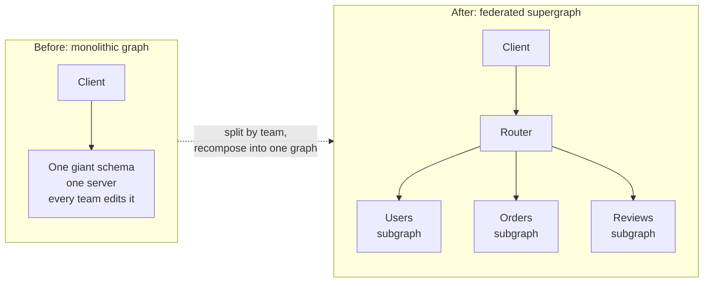
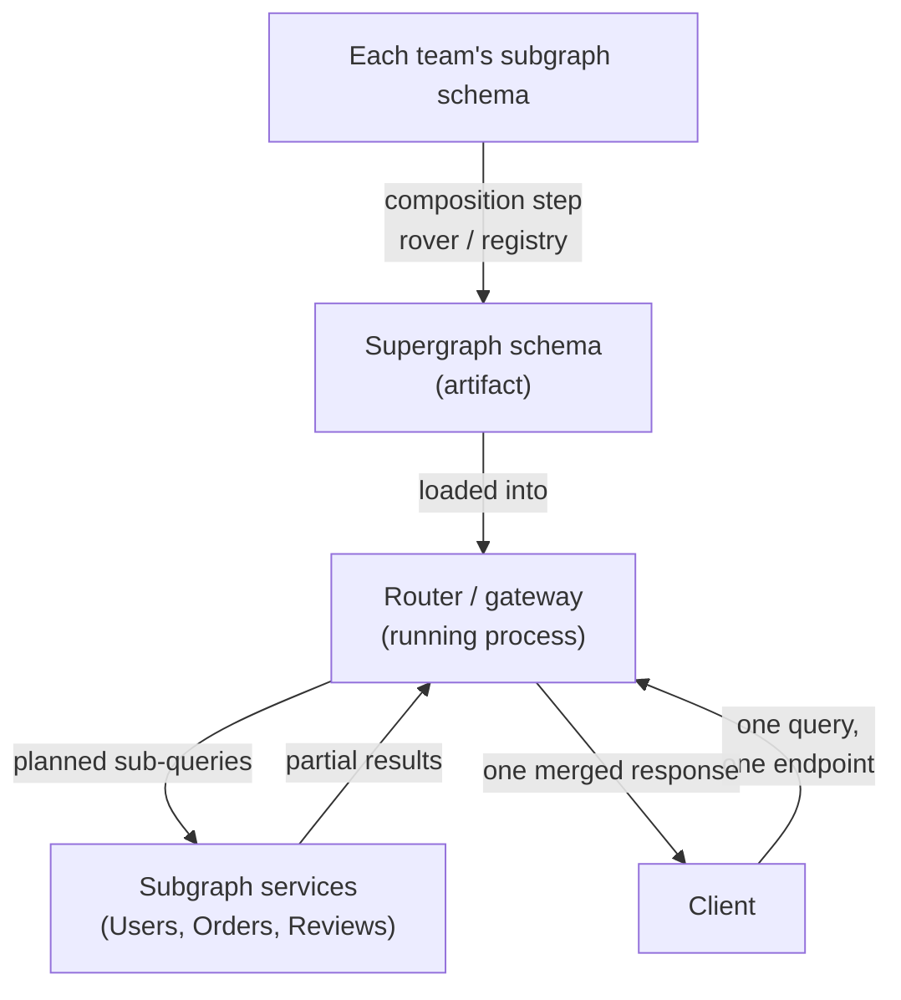
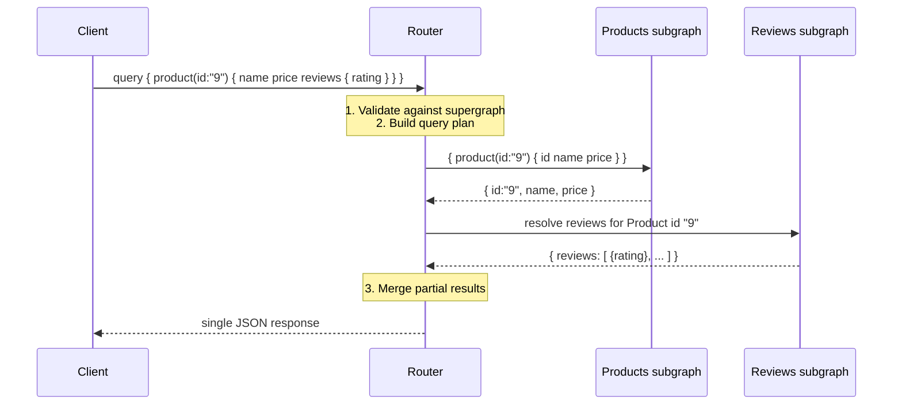

# GraphQL Federation — Junior

<!-- level-focus -->
At junior level, focus on this question:

> How can I apply **GraphQL Federation** in one small example and prove the result?

Use the smallest realistic scenario that exposes the decision and its failure behavior.
## 1. A quick GraphQL recap

GraphQL is a query language for APIs. Before we talk about federation, pin down four ideas.

**One endpoint.** A REST API has many URLs (`/users/42`, `/users/42/orders`, `/products/9`). A GraphQL API has a single endpoint, usually `POST /graphql`. The client describes what it wants in the request body, not in the URL.

**The client asks for exactly the fields it needs.** No more, no less. If the client only needs a user's name and email, it asks for those two fields and nothing else comes back. This avoids *over-fetching* (getting fields you throw away) and *under-fetching* (having to make a second call for missing data).

```graphql
query {
  user(id: "42") {
    name
    email
  }
}
```

The response mirrors the shape of the query:

```json
{
  "data": {
    "user": {
      "name": "Ada Lovelace",
      "email": "ada@example.com"
    }
  }
}
```

**Schema and types.** The API is described by a strongly-typed **schema**. It declares object types, their fields, and the field types. The schema is a contract: the server promises these shapes, and tools can validate a query against it before it ever runs.

```graphql
type User {
  id: ID!
  name: String!
  email: String!
}

type Query {
  user(id: ID!): User
}
```

The `!` means the field is non-null (always present). `ID` and `String` are scalar types.

**Query vs mutation.** A **query** reads data (no side effects). A **mutation** writes data (create, update, delete). They look similar but live under different root types (`Query` and `Mutation`), which makes read/write intent explicit.

```graphql
mutation {
  updateEmail(userId: "42", email: "ada@newmail.com") {
    id
    email
  }
}
```

That is the whole GraphQL surface we need. Federation does not change any of it for the client — the client still sends a normal query to one endpoint.

---

## 2. The problem federation solves

A GraphQL schema is one connected graph of types. In a small app, one team owns the whole schema in one server. That is fine.

Now scale to a large company: a Users team, an Orders team, a Reviews team, a Products team. If they all share **one monolithic GraphQL schema in one codebase**, problems pile up:

- **Contention.** Every team edits the same schema file and the same server. Deploys collide; a bug in Reviews can take down Users.
- **Ownership is blurry.** Who owns the `Product` type when Products defines it but Reviews wants to add a `reviews` field to it? In a monolith the answer is "everyone edits the same file," which is a recipe for merge conflicts and unclear responsibility.
- **Coupled release cadence.** The Orders team cannot ship on their own schedule because the whole graph deploys as one unit.
- **Scaling limits.** One server, one process, one team's operational bottleneck for the entire API.

The naive alternative — give each team its *own separate* GraphQL API — breaks the best part of GraphQL: clients want **one** graph, not four endpoints they have to stitch together on the frontend.

**Federation is the answer to both.** Each team runs its own small GraphQL service (a *subgraph*). A composition layer merges them into one unified schema (a *supergraph*) that clients query as if it were a single API. Teams get independence; clients get one graph.



The client experience is identical in both pictures: one endpoint, one schema. What changed is *who owns what* behind the endpoint.

---

## 3. Subgraph, supergraph, gateway/router

Three words carry the whole model. Learn them precisely.

**Subgraph.** A single team's own GraphQL service. It has its own schema, its own resolvers, its own database, and deploys independently. Each subgraph only declares the types and fields it actually owns. The Users subgraph knows about `User`; it does not know or care that Orders exist.

**Supergraph.** The single, composed schema that results from merging all subgraph schemas together. It is not a running server by itself — it is a *composition artifact*, a schema document that describes the whole graph plus a map of which subgraph can resolve which field. Composition happens with a tool (for example, Apollo Federation's `rover` CLI, or a managed registry).

**Gateway / router.** The one process clients actually talk to. It holds the composed supergraph. When a query arrives, the router:

1. Validates the query against the supergraph schema.
2. Builds a **query plan** — figures out which subgraph must answer which part of the query.
3. Sends the right sub-queries to the right subgraphs.
4. Stitches the pieces back into a single response and returns it to the client.

The words "gateway" and "router" are used interchangeably in most tooling; newer Apollo terminology prefers "router" (a fast, Rust-based component), while older docs say "gateway." For a junior, treat them as the same role: *the single front door that plans and merges.*

Here is the relationship, staged:



Note the two distinct phases: **composition** (build-time — subgraphs → supergraph) and **execution** (run-time — router plans and calls subgraphs). Confusing these two is the most common early mistake.

---

## 4. One type, owned by one service, extended by another

This is the idea that makes federation click. A single type can be *owned* by one subgraph and *extended* by others.

Take `Product`. The Products team owns it — they define its identity and core fields:

```graphql
# Products subgraph
type Product @key(fields: "id") {
  id: ID!
  name: String!
  price: Int!
}
```

The `@key(fields: "id")` directive is the federation magic. It says: "`Product` is an *entity*, and any other subgraph can refer to a `Product` by its `id`." The `id` is the shared reference the router uses to line up the same product across services.

Now the Reviews team wants to attach reviews to products. They do **not** own `Product`, and they do not copy its fields. They reference the entity by its key and add only *their* field:

```graphql
# Reviews subgraph
type Product @key(fields: "id") {
  id: ID!
  reviews: [Review!]!
}

type Review {
  id: ID!
  text: String!
  rating: Int!
}
```

Reviews contributes `reviews`; Products contributes `name` and `price`. After composition, the supergraph presents **one** `Product` type with all fields merged:

```graphql
# Composed supergraph (what the client sees)
type Product {
  id: ID!
  name: String!
  price: Int!
  reviews: [Review!]!
}
```

A client can now ask for a product's name, price, and reviews in a single query — even though two different teams, two different services, and two different databases supply those fields. The client never sees the seam.

```graphql
query {
  product(id: "9") {
    name        # from Products subgraph
    price       # from Products subgraph
    reviews {   # from Reviews subgraph
      rating
      text
    }
  }
}
```

The router uses the `id` key to fetch the base product from Products, then hands that `id` to Reviews to fetch the reviews, then merges. That handoff-by-key is the core mechanism, and it is what the Middle tier explains in detail (entities and reference resolvers).

---

## 5. How a federated query flows

Let's trace the query above end-to-end so the moving parts are concrete.



Step by step:

1. The client sends one query to the router. It has no idea more than one service is involved.
2. The router validates and plans: `name`/`price` live in Products, `reviews` live in Reviews.
3. It calls Products first to get the product (including its `id` key).
4. It passes that `id` to Reviews to fetch the matching reviews.
5. It merges both partials into one response shaped exactly like the client's query.

The client gets back a single, coherent object. All the fan-out, the key handoff, and the merge are the router's job.

---

## 6. REST vs GraphQL vs Federation

A side-by-side to keep the levels straight. Note that federation is not "a different API style" for the client — from the outside it *is* GraphQL. The difference is in how the backend is organized.

| Aspect | REST | Single GraphQL | Federated GraphQL |
| --- | --- | --- | --- |
| Endpoints for the client | Many URLs | One endpoint | One endpoint |
| Data fetching | Fixed per endpoint (often over/under-fetch) | Client picks exact fields | Client picks exact fields |
| Schema / contract | Per-endpoint, often informal | One typed schema | One composed schema (supergraph) |
| Who owns the schema | Whoever owns each endpoint | Usually one team / one codebase | Each team owns its subgraph |
| Backend structure | Many services, client stitches | One server | Many subgraph services, router stitches |
| Independent team deploys | Yes (but client stitches) | No — shared schema | Yes — per subgraph |
| Client sees the split? | Yes (multiple calls) | N/A | No (router hides it) |

The winning combination federation targets: the *client simplicity* of one GraphQL endpoint **plus** the *team independence* of separate services — without pushing stitching work onto the frontend.

---

## 7. Key terms recap

| Term | Meaning |
| --- | --- |
| **Schema** | The typed contract describing types and fields. |
| **Query / Mutation** | Read operation / write operation. |
| **Subgraph** | One team's independent GraphQL service, owning its slice of the graph. |
| **Supergraph** | The merged schema composed from all subgraphs (a build-time artifact). |
| **Router / Gateway** | The single front-door process that plans queries and merges results. |
| **Entity** | A type (marked with `@key`) that can be referenced and extended across subgraphs. |
| **`@key`** | The directive naming the field(s) that uniquely identify an entity across services. |
| **Composition** | The build-time step that merges subgraph schemas into a supergraph. |
| **Query plan** | The router's run-time plan of which subgraph answers which part of a query. |

---

## 8. What to remember

- GraphQL gives the client **one endpoint** and **exactly the fields it asks for**, described by a **typed schema**; queries read, mutations write.
- A single monolithic GraphQL schema does **not scale across teams** — contention, blurry ownership, coupled deploys.
- Federation splits the graph into **subgraphs** (owned per team), composes them into one **supergraph**, and serves it through a **router**.
- A type is **owned by one subgraph** and can be **extended by others** via an `@key` entity reference; each subgraph contributes only its own fields.
- The client never sees the split. It sends one query; the router plans, fans out, and merges.
- Two phases to keep separate: **composition** (build-time, subgraphs → supergraph) and **execution** (run-time, router → subgraphs → merge).

Learn the details next: how entities and reference resolvers actually pass keys between subgraphs, and how the router builds a query plan. See the GraphQL spec at [graphql.org](https://graphql.org/) and Apollo Federation docs at [apollographql.com/docs](https://www.apollographql.com/docs/).

*Next step:* [GraphQL Federation — Middle](middle.md)

---

## Apply it

1. Choose one small, known input for **GraphQL Federation**.
2. Predict the output or observable behavior.
3. Run the smallest example or probe that exercises the concept.
4. Change one input to trigger a failure or boundary case.
5. Explain the evidence using the guide's vocabulary.

## Verify your work

- Record the exact input, command or code path, and output.
- Repeat the probe and confirm the result is consistent.
- Show one expected success and one expected failure.
- Resolve any difference between the prediction and the evidence.

## Review questions

- What problem does GraphQL Federation solve in the example?
- Which input changes the observed result, and why?
- What is the smallest useful success check?
- Which beginner mistake would your evidence catch?
