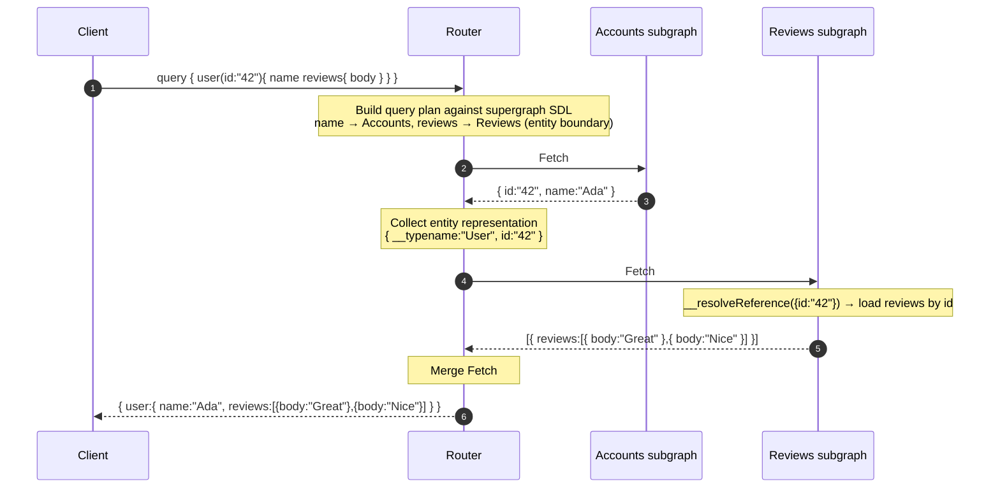

# GraphQL Federation — Middle

<!-- level-focus -->
At middle level, focus on this question:

> Where does **GraphQL Federation** belong in a maintainable component, and which trade-off selects the design?

Use the smallest realistic scenario that exposes the decision and its failure behavior.
## 1. The core problem: one type, many owners

A single business object is usually described by more than one team. A `User` has a name and email owned by the Accounts team, but also a list of `reviews` owned by the Reviews team. In a monolithic schema you would put every field on one `User` type in one service. Federation lets each team keep its own subgraph and still contribute fields to the **same logical `User` type**.

The router's job is to make those contributions look like one type to the client. To do that it needs two things:

- A way to **identify** the same object across subgraphs (a stable key).
- A way to **fetch** an object by that key from whichever subgraph owns a requested field.

Those two mechanisms are the `@key` directive and the reference resolver.

---

## 2. Entities and the `@key` directive

An **entity** is a type that can be referenced and resolved across subgraph boundaries. You declare an entity by adding a `@key` directive naming the field(s) that uniquely identify an instance.

Accounts subgraph — it **defines** the entity and owns identity plus profile fields:

```graphql
type User @key(fields: "id") {
  id: ID!
  name: String!
  email: String!
}
```

Reviews subgraph — it **references** the same entity to attach its own fields:

```graphql
type User @key(fields: "id") {
  id: ID!            # the key fields must be present so the router can match instances
  reviews: [Review!]!
}

type Review @key(fields: "id") {
  id: ID!
  body: String!
  author: User!
}
```

Both subgraphs declare `@key(fields: "id")`. That shared key tells the router: *a `User` in the Reviews subgraph with `id: "42"` is the same `User` as `id: "42"` in the Accounts subgraph.* The key can be a single field, a compound of several (`@key(fields: "id sku")`), or nested (`@key(fields: "org { id } sku")`). A type may declare multiple `@key`s if different subgraphs identify it by different fields.

---

## 3. Reference resolvers: `__resolveReference` and `_entities`

When the router needs a `User` from a subgraph, it does not run a top-level query field. Instead every federated subgraph exposes a hidden entry point, the `_entities` field, which takes a list of **entity representations** — minimal objects containing the `__typename` and the key fields:

```graphql
# The router calls this generated field, never the client
query {
  _entities(representations: [{ __typename: "User", id: "42" }]) {
    ... on User { reviews { body } }
  }
}
```

The subgraph library maps each representation to a **reference resolver** — in Apollo Server this is the `__resolveReference` function on the type:

```js
const resolvers = {
  User: {
    // representation = { __typename: "User", id: "42" }
    __resolveReference(representation) {
      return { id: representation.id };   // load reviews from this id
    },
    reviews(user) {
      return db.reviewsByUserId(user.id);
    },
  },
};
```

`__resolveReference` receives the representation and returns the object (or a promise for it), which the subgraph's field resolvers then flesh out. This is the single most important mechanism in federation: it is how one subgraph "continues" resolving an object that another subgraph started.

---

## 4. Schema composition and the supergraph SDL

The router does not read the subgraph schemas directly at runtime. Instead, **composition** merges all subgraph schemas into one artifact called the **supergraph SDL**.

- Each subgraph publishes its **subgraph SDL** (its schema plus federation directives).
- A composition step (`rover supergraph compose` locally, or managed composition in Apollo GraphOS) validates that the subgraphs are compatible — shared entities agree on their keys, extended fields exist, types don't conflict — and produces the supergraph SDL.
- The supergraph SDL embeds, for every field, **which subgraph can resolve it** (via internal `@join__*` directives). This routing map is exactly what the query planner needs.

Composition **fails fast** on incompatibilities: if the Reviews subgraph references `User.email` without declaring it `@external`, or two subgraphs both claim to own the same non-shareable field, composition errors before anything reaches production. This is the compile-time safety net of federation.

---

## 5. Extending a type across subgraphs: `@external`, `@requires`, `@provides`

Sometimes a subgraph needs to *use* a field it does not own — usually to compute one of its own fields. Three directives coordinate this.

**`@external`** marks a field as owned by another subgraph but declared here so it can be referenced. It is a "this field lives elsewhere" annotation.

**`@requires`** says a resolver in this subgraph needs the value of an external field to do its work. The router must fetch that field first and pass it in.

```graphql
# Shipping subgraph needs the product's weight (owned by Products) to compute a rate
type Product @key(fields: "sku") {
  sku: ID!
  weight: Float! @external
  shippingEstimate: Float! @requires(fields: "weight")
}
```

Here the router resolves `weight` from the Products subgraph, then hands it to the Shipping subgraph's `_entities` call so `shippingEstimate` can be computed.

**`@provides`** is the optimization mirror: a subgraph declares it can *return* an external field along an object it already fetched, letting the router **skip** a second subfetch for that path.

```graphql
type Review @key(fields: "id") {
  id: ID!
  # This subgraph can supply author.name inline when returning a review,
  # so the router need not round-trip to Accounts for that specific path.
  author: User! @provides(fields: "name")
}
```

`@requires` costs an extra dependency (fetch-before-compute); `@provides` saves a fetch (deliver-alongside). Both are hints the query planner reads from the supergraph SDL.

---

## 6. The federation directives at a glance

| Directive | Placed on | Meaning | Effect on the router |
|---|---|---|---|
| `@key(fields: …)` | Entity type | These fields uniquely identify an instance | Enables cross-subgraph reference and `_entities` lookups |
| `@external` | Field | This field is owned by another subgraph | Marks the field as non-resolvable here; used only for reference |
| `@requires(fields: …)` | Field | Resolving this field needs an external field's value | Router fetches the required field first, passes it in the representation |
| `@provides(fields: …)` | Field | This subgraph can also return the named external field on this path | Router may skip a subfetch for that field on that path |
| `@shareable` | Field / type | Multiple subgraphs may resolve this same field | Allows non-conflicting duplicate ownership during composition |

`@key`, `@requires`, and `@provides` all take a **field set** — a space-separated selection (possibly nested) describing which fields participate.

---

## 7. Query planning: how the router fans out and merges

When a client query arrives, the router builds a **query plan**: an ordered tree of **fetches**, each targeting one subgraph, with dependencies between them.

1. **Parse and match** the operation against the supergraph SDL to learn which subgraph owns each requested field.
2. **Group** fields by owning subgraph into fetch nodes.
3. **Order** the fetches by dependency. Fields reached through an entity boundary depend on first obtaining that entity's key from the owning subgraph.
4. **Execute**: send each fetch; entity subfetches use the `_entities(representations: …)` field, passing the keys collected from earlier results.
5. **Merge**: splice each subfetch's partial result back into the assembled response tree at the correct path, then return one response to the client.

The planner also parallelizes independent fetches and batches representations (many `User` keys in one `_entities` call rather than one call per user), which is how it avoids the N+1 explosion that naive schema stitching suffers.

---

## 8. Traced example: one query across two subgraphs

Client query:

```graphql
query {
  user(id: "42") {
    name          # owned by Accounts
    reviews {     # owned by Reviews
      body
    }
  }
}
```

The router sees that `user` and `name` are owned by Accounts, but `reviews` is owned by Reviews. It plans: fetch the user from Accounts (which yields the `id` key), then fetch reviews from Reviews via `_entities` using that key, then merge.



Walking the steps:

- **Fetch #1** runs against Accounts. The router silently adds the key field `id` to the selection even though the client only asked for `name`, because it needs the key to cross the boundary.
- Between fetches, the router builds the **representation** `{ __typename: "User", id: "42" }` from Fetch #1's result. This is the handoff object.
- **Fetch #2** runs against Reviews through the generated `_entities` field. Reviews' `__resolveReference` receives `{ id: "42" }`, loads the reviews, and its field resolvers return `body`.
- The router **merges** Fetch #2's `reviews` array into the `User` object produced by Fetch #1, matching by path, and returns a single unified response. The client never learns two services were involved.

Had the client requested only `name`, the planner would emit **just Fetch #1** — subgraphs are only contacted for fields actually selected.

---

## 9. Key takeaways

- An **entity** is a type resolvable across subgraphs; `@key` names its identifying fields and is the glue that lets the router match the same object in different services.
- Cross-subgraph resolution runs through the generated **`_entities`** field and each type's **`__resolveReference`** function — the mechanism by which one subgraph continues resolving an object another began.
- **Composition** merges subgraph SDLs into the **supergraph SDL**, embedding the field-to-subgraph routing map and failing fast on incompatibilities.
- **`@external`/`@requires`/`@provides`** coordinate fields borrowed across boundaries: `@requires` adds a fetch-before-compute dependency, `@provides` removes a redundant subfetch.
- The router turns each query into a **query plan** of ordered, dependency-aware, batched fetches, then **merges** the partial results into one response — parallelizing independent branches and batching entity keys to avoid N+1.

*Next step:* [GraphQL Federation — Senior](senior.md)

---

## Apply it

1. Find a real component where **GraphQL Federation** affects an interface or dependency.
2. Write two plausible choices and the constraint that favors each one.
3. Make the smallest reversible change at that boundary.
4. Exercise the component alone, then exercise the integrated flow.
5. Keep the decision note with the evidence that selected the option.

## Verify your work

- A focused check proves the local behavior.
- An integrated check proves callers and dependencies still agree.
- Logs, traces, compiler output, or benchmarks expose the boundary.
- Reverting the change restores the previous behavior without unrelated edits.

## Review questions

- Which boundary is most affected by GraphQL Federation?
- What constraint would make you choose the alternative design?
- How would you isolate a local defect from an integration defect?
- What evidence shows that the change remains maintainable?
