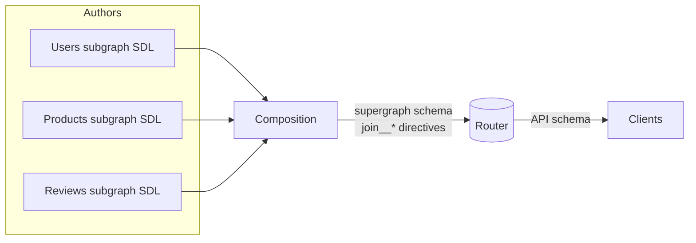
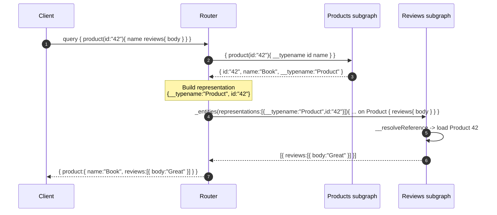
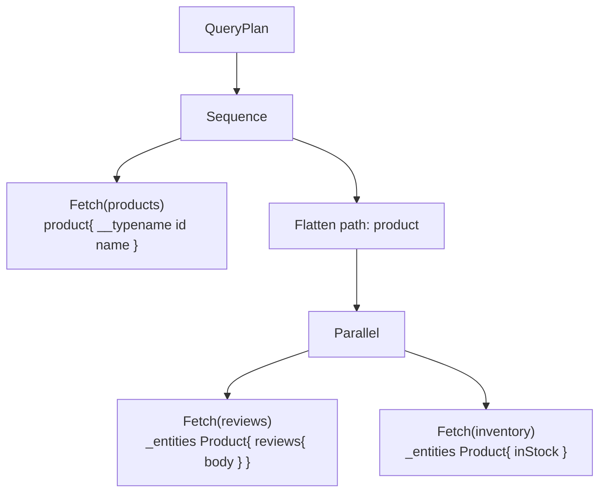

# GraphQL Federation — Professional

<!-- level-focus -->
At professional level, focus on this question:

> How should teams adopt and operate **GraphQL Federation** with measurable outcomes and limited coordination?

Use the smallest realistic scenario that exposes the decision and its failure behavior.
## 1. The three schemas

Federation manipulates three distinct schema artifacts. Confusing them is the most common source of debugging pain.

- **Subgraph schema** — what a service author writes. It is a normal GraphQL SDL enriched with federation directives (`@key`, `@shareable`, `@external`, …). Each subgraph also automatically exposes federation machinery: the `_entities` and `_service` root query fields, the `_Entity` union, and the `_Any` scalar.
- **Supergraph schema** — the machine-facing artifact produced by **composition**. It contains every type and field from every subgraph, annotated with `@join__*` directives that record *which subgraph can resolve which field* and *how entities are keyed*. This is the router's routing table; humans rarely read it.
- **API schema** — the client-facing schema derived from the supergraph by stripping all federation/`@join__` internals and everything marked `@inaccessible`. This is what appears in introspection and IDE tooling.

The router (gateway) loads the supergraph, exposes the API schema to clients, and uses the `@join__*` annotations to plan and execute.



---

## 2. Entities and the `_entities` resolution protocol

An **entity** is a type that can be uniquely identified across subgraphs and whose fields may be contributed by more than one subgraph. It is declared with `@key`:

```graphql
# products subgraph — defines and "owns" the entity's identity
type Product @key(fields: "id") {
  id: ID!
  name: String!
  price: Int!
}
```

Another subgraph can **extend** the same entity by referencing the same key and marking non-owned fields as satisfiable elsewhere:

```graphql
# reviews subgraph — contributes reviews to Product
type Product @key(fields: "id") {
  id: ID!            # part of the key, resolvable here
  reviews: [Review!]!
}
```

### The entity fetch mechanism

The router never asks a subgraph "give me Product 42" through a normal field. Instead every federated subgraph implements a synthetic root field:

```graphql
union _Entity = Product | Review | User
scalar _Any

type Query {
  _entities(representations: [_Any!]!): [_Entity]!
  _service: _Service!
}
```

A **representation** is a minimal JSON object carrying the entity's `__typename` plus its key fields — exactly the data needed to re-identify it in the target subgraph:

```json
{ "__typename": "Product", "id": "42" }
```

The subgraph resolves each representation via `__resolveReference` (or the reference-resolver equivalent), returning the entity object; the runtime then resolves the requested fields on it.

```javascript
const resolvers = {
  Product: {
    __resolveReference(representation) {
      // representation === { __typename: "Product", id: "42" }
      return db.products.findById(representation.id);
    },
  },
};
```



The `representations` argument is a **list** by design — it is the seam that makes batched entity resolution (and thus DataLoader) possible: the router flattens many entities of the same type into one `_entities` call.

---

## 3. The query planner in rigor

The planner turns one client operation into an executable **query plan** — a tree of fetch operations against subgraphs plus the data-shuffling nodes that stitch results together. The pipeline:

1. **Parse & validate** the incoming operation against the API schema.
2. **Determine field ownership.** For every field in the selection set, consult the supergraph's `@join__field`/`@join__type` annotations to learn which subgraph(s) can resolve it.
3. **Group into fetches.** Contiguous fields resolvable in the same subgraph collapse into a single subgraph operation. Each such group becomes a `Fetch` node.
4. **Insert entity boundaries.** When the selection crosses from subgraph *A* to subgraph *B* on an entity, the planner emits: a `Fetch` from *A* that additionally requests the entity's key fields (plus `__typename`), a `Flatten` that extracts those into representations, and a `Fetch` against *B*'s `_entities`.
5. **Order the fetches.** Independent fetches are wrapped in a `Parallel` node; fetches with a data dependency (B needs A's output) are wrapped in a `Sequence` node.
6. **Optimize.** Merge redundant fetches, dedupe representations, and choose the cheapest resolving subgraph when a `@shareable` field is available in several.

The output is a plan the router executes deterministically. It is worth inspecting real plans during development (Apollo's tooling can emit them) because the plan is the single best predictor of latency and subgraph fan-out.



Here the first fetch must complete before either entity fetch (they need the `id`), so it sits in a `Sequence`; the two entity fetches are independent of each other and run under `Parallel`.

---

## 4. Query-plan node types

| Node | Role | Semantics |
|------|------|-----------|
| `Fetch` | Leaf operation | Sends one GraphQL operation to exactly one subgraph. Carries the operation, the variables, and (for entity fetches) the `representations` it consumes. |
| `Sequence` | Ordering | Executes its children strictly in order; used when a later fetch depends on data produced by an earlier one. Adds latency = sum of children. |
| `Parallel` | Concurrency | Executes its children concurrently; used for independent fetches. Adds latency = max of children. |
| `Flatten` | Data reshaping | Walks a path in the partially assembled result, gathers entity references (key fields + `__typename`) into a `representations` array, and feeds them to the next entity `Fetch`. |

The planner's whole job is to **maximize `Parallel` and minimize `Sequence` depth** while emitting the fewest `Fetch` nodes. Every additional `Sequence` level is a serialized network round trip added to tail latency.

---

## 5. Federation v2 directives, formally

Federation v2 replaced the v1 `extend type` convention with a richer, composable directive algebra. The core set:

| Directive | Applies to | Meaning |
|-----------|-----------|---------|
| `@key(fields:)` | object/interface | Declares a resolvable identity for an entity. Multiple `@key`s allow different lookup keys. `resolvable: false` marks a *reference-only* key (this subgraph can name the entity but not resolve it). |
| `@external` | field | The field is defined here only to satisfy a `@key`/`@requires`/`@provides`; this subgraph does **not** resolve its value. |
| `@requires(fields:)` | field | To resolve this field, the router must first fetch the named `@external` fields from the owning subgraph and pass them in. Creates a fetch dependency. |
| `@provides(fields:)` | field | Declares that, when reached through this field, the subgraph can *also* return the named fields of a referenced entity, letting the planner skip an extra entity fetch. |
| `@shareable` | field/object | Explicitly allows the same field to be resolved by more than one subgraph (value types, or overlapping entity fields). Without it, duplicate resolution is a composition error. |
| `@override(from:)` | field | Migrates ownership of a field from another subgraph to this one — the planner routes the field here instead. Supports progressive rollout via labels/percentages. |
| `@inaccessible` | any element | Present in the supergraph but removed from the API schema. Used to hide an element until every subgraph exposes it, avoiding a broken client-facing schema mid-migration. |
| `@tag(name:)` | any element | Attaches metadata used by contracts/tooling to build filtered variant schemas; no runtime resolution effect. |

Two rules capture most of the intent:

- **`@shareable` is the opt-in for duplication.** Federation v2 assumes a field has exactly one owner. Any field resolvable in two subgraphs must be `@shareable` in both, or composition fails.
- **`@external` + (`@requires` | `@provides` | `@key`) is the only legitimate reason to redeclare a field you don't own.** A bare `@external` field is meaningless and flagged.

---

## 6. `@requires` and forced sequential fetches

`@requires` is the directive with the sharpest performance edge. Consider a `shipping` subgraph computing an estimate that depends on the product's weight, which is owned by `products`:

```graphql
# shipping subgraph
type Product @key(fields: "id") {
  id: ID!
  weight: Int! @external          # owned by products, not resolved here
  shippingEstimate: Int! @requires(fields: "weight")
}
```

The resolver receives `weight` in the representation:

```javascript
Product: {
  shippingEstimate(product) {
    // product.weight was supplied by the router
    return computeEstimate(product.weight, product.id);
  },
}
```

Because `shippingEstimate` **cannot** be computed until `weight` is fetched from `products`, the planner is forced to emit a **`Sequence`**: fetch `weight` from `products`, `Flatten` it into representations, then fetch `shippingEstimate` from `shipping`. No amount of parallelism removes this round trip — it is intrinsic to the data dependency you declared. `@requires` is therefore a deliberate latency trade: it keeps a computation next to its logic at the cost of an extra serialized hop. Prefer `@provides` (which *avoids* an entity fetch) where the data can travel with an existing fetch instead.

---

## 7. Value types vs entities

Not every shared type is an entity.

- A **value type** is a plain object/enum/scalar with the same shape in multiple subgraphs and **no `@key`** — e.g. a `Money { amount, currency }` or a `PageInfo`. Its fields must be `@shareable` (or identical enums/scalars) so composition merges the definitions instead of rejecting them. Value types are copied, not resolved across a boundary — there is no cross-subgraph fetch for them.
- An **entity** has one or more `@key`s and a distributed identity. It *can* be fetched across subgraph boundaries via `_entities`.

Deciding between them is a modeling decision: if two subgraphs must contribute *different fields* to the *same object instance*, it is an entity. If they merely both know the *same immutable shape*, it is a value type. Misclassifying an entity as a value type silently duplicates data and loses the join; misclassifying a value type as an entity forces needless `_entities` round trips.

---

## 8. DataLoader batching inside a subgraph

The router already batches at the boundary: all representations of one type reaching one subgraph arrive in a single `_entities(representations: [...])` call. But *within* a subgraph, resolving each representation naively still triggers the classic N+1 — one database call per `__resolveReference`. DataLoader closes that gap by coalescing per-request loads into one batched backend call:

```javascript
const productLoader = new DataLoader(async (ids) => {
  const rows = await db.products.findByIds(ids);       // one query for all ids
  const byId = new Map(rows.map(r => [r.id, r]));
  return ids.map(id => byId.get(id) ?? null);          // preserve order & arity
});

const resolvers = {
  Product: {
    __resolveReference(rep) {
      return productLoader.load(rep.id);               // batched + de-duped
    },
  },
};
```

Two invariants the loader batch function must uphold: return an array **the same length and order** as the input keys, and put `null`/`Error` in the slot of a missing key. Instantiate the loader **per request** so its cache never leaks across users. With this in place, an `_entities` call for 100 products is a single backend query, and the boundary batching plus in-subgraph batching compose into an end-to-end batched path.

---

## 9. Composition, satisfiability, hints and errors

Composition is a static algorithm run before any query executes. It merges subgraph schemas into a supergraph and, critically, **proves the result is queryable**. Its outputs are one of:

- **Errors** — composition failed; no supergraph is produced. Typical causes: a field resolvable by two subgraphs without `@shareable`; incompatible types for the same field across subgraphs; an entity extended in a subgraph that has no matching `@key`; an `@requires`/`@provides` referencing a field that does not exist.
- **Hints** — composition succeeded but flags something suspect (e.g. an inconsistent default value, an unused `@override`, an overly broad `@shareable`). Hints are advisory, not blocking.
- **Success** — a supergraph schema.

The subtle part is the **satisfiability check**. Even when every subgraph is individually valid, the planner must be able to reach every field of every type *for every possible entry path*. Consider an entity whose only `@key` lives in subgraph A, with a field only in subgraph B — but B has no way to be entered except through that field. If there is no path that produces the key needed to jump into B, some query shapes are **unsatisfiable**, and composition rejects the supergraph with a "cannot satisfy" error naming the unreachable field and the missing key. Satisfiability failures are the federation-specific errors that surprise teams the most; they are always about a *missing resolvable key on a path*, not about the field's own definition.

---

## 10. Managed federation and the schema registry

Running composition on the router at startup (**local composition**) couples deploys and offers no safety net. **Managed federation** moves composition out of the router and into a **schema registry**:

1. Each subgraph **publishes** its schema to the registry on deploy (`rover subgraph publish`).
2. The registry **composes** the supergraph centrally and validates it.
3. On success it produces a **launch** and hands the router a new supergraph via **uplink** — the router hot-reloads with **zero restart**.
4. The router reports operation traces back, enabling usage-aware checks.

The registry's real leverage is **schema checks in CI**. Before a subgraph merges, `rover subgraph check` runs two gates:

- **Composition check** — would this change still compose with the *current* versions of every other subgraph? Catches cross-subgraph breakage before it ships.
- **Operation check** — does this change break any operation observed in recent production traffic? This turns "is this a breaking change?" from a guess into a data-backed verdict; fields nobody queries can be removed freely, fields under live traffic are flagged.

The rollout flow becomes: publish → compose → launch → router uplink, each step recorded so a bad launch can be pinpointed and rolled back to a prior supergraph. This is what makes many independently deploying teams safe on one graph: the registry is the arbiter that refuses to assemble an incoherent or client-breaking supergraph.

---

## 11. Checklist

- I can name the three schemas (subgraph, supergraph, API) and what each is for.
- I can trace an `_entities` round trip: representation → `__resolveReference` → resolved fields.
- I can read a query plan and identify `Fetch`, `Flatten`, `Sequence`, `Parallel` nodes and why each appears.
- I know why `@requires` forces a `Sequence` and how `@provides` avoids an extra fetch.
- I can distinguish a value type (`@shareable`, no key) from an entity (`@key`, distributed identity).
- I batch entity resolution with a per-request DataLoader that preserves key order and arity.
- I understand composition errors vs hints and what a satisfiability failure actually means.
- I know how managed federation's composition checks and operation checks gate a CI merge and drive a launch/rollback.


---

## Apply it

1. Define the user or business outcome that **GraphQL Federation** should improve.
2. Assign one owner for code, contracts, operations, and incidents.
3. Split delivery into reversible increments that produce evidence early.
4. Publish responsibilities, escalation paths, and compatibility windows.
5. Stop or expand only when the agreed measures support that decision.

## Verify your work

- Each increment has an owner, rollback path, and observable exit condition.
- Adoption, reliability, delivery time, and coordination cost are measured.
- Incident and migration exercises prove that responsibility is executable.
- The old path is removed only after telemetry proves it is unused.

## Review questions

- Which measurable outcome justifies investing in GraphQL Federation?
- Which team owns the full lifecycle and incident response?
- What reversible increment produces the earliest useful evidence?
- Which exit condition proves that migration or adoption is complete?
