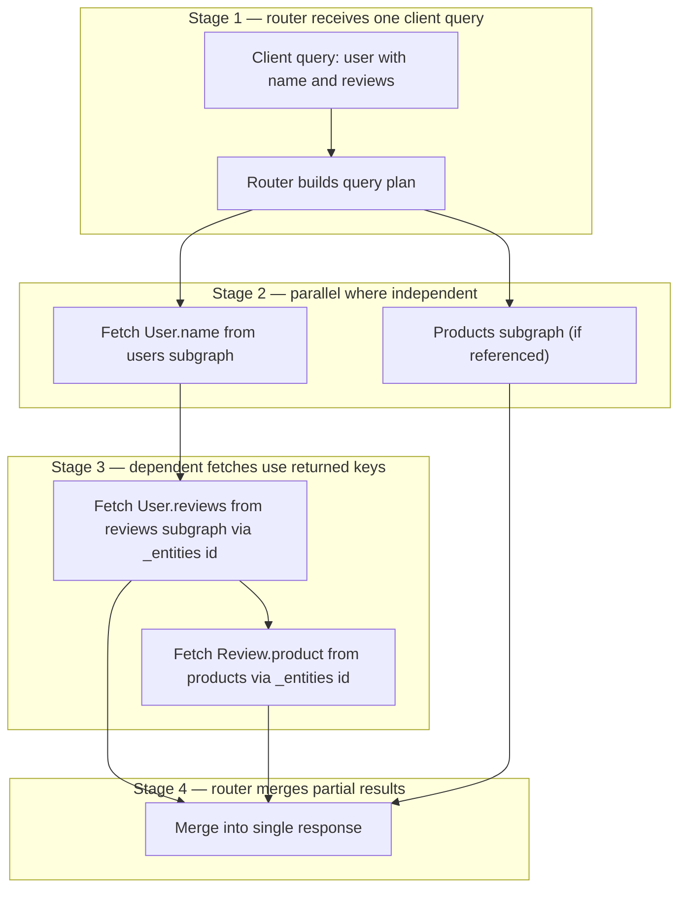
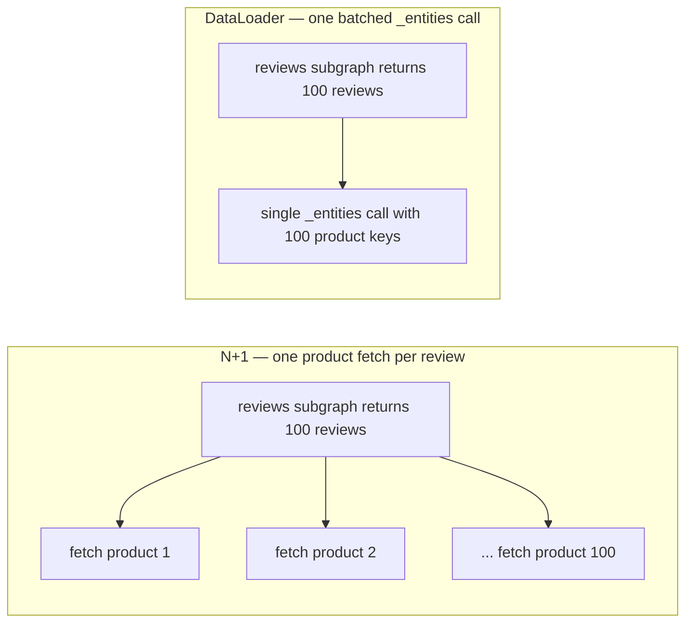

# GraphQL Federation — Senior

<!-- level-focus -->
At senior level, focus on this question:

> Which system invariant is affected by **GraphQL Federation** under failure, load, and change?

Use the smallest realistic scenario that exposes the decision and its failure behavior.
## 1. When federation is worth it

Federation solves an **organizational** problem before it solves a technical one. Its value is letting multiple teams ship to one client-facing graph *without* a shared repo, a shared deploy, or a merge bottleneck. If you do not have that pain, you are paying for infrastructure you do not need.

**Signals that federation earns its cost:**

- Multiple teams each own distinct domains (users, catalog, orders, payments) and want independent deploy cadence.
- Clients (web, mobile, partners) want *one* endpoint and one type system instead of stitching many APIs themselves.
- Entities are naturally shared — an `Order` references a `User` and `Product` owned by other teams — and you want cross-domain queries resolved server-side.
- You need per-subgraph autonomy: schema evolution, ownership, and on-call all follow team boundaries.

**Signals it is overkill:**

- A single team, or a handful of engineers. One monolithic GraphQL schema in one service is simpler to build, test, and reason about — no gateway, no composition, no cross-service fan-out.
- Low query volume where the operational cost of a router tier dwarfs the benefit.
- Domains that rarely cross-reference each other — the fan-out you would gain is theoretical.

The honest default for a small org is **a single monolithic graph**. Reach for **schema-stitching** only if you must merge a few legacy services quickly and cannot re-own their schemas; it is manual, brittle glue that federation was designed to replace. Adopt **federation** when team count and cross-domain entity sharing make the monolith the bottleneck — not before.

> Rule of thumb: federation is a solution to *Conway's Law*. If your org chart has one box, your graph should too.

---

## 2. Federation vs the alternatives

| Dimension | Monolithic GraphQL | Schema stitching | Apollo Federation | BFF (per-client) | Plain REST |
|---|---|---|---|---|---|
| Best for | Small org, one team | Merging legacy services fast | Many teams, one client graph | Client-specific aggregation | Simple CRUD, wide caching |
| Team autonomy | Low (shared schema/deploy) | Medium (manual glue) | High (independent subgraphs) | Medium | High |
| Composition | N/A (one schema) | Manual, in gateway code | Declarative, `@key`-driven | Hand-written per client | N/A |
| Cross-domain entities | Native (same process) | Awkward, hand-wired | First-class (`@key` + `_entities`) | Hand-aggregated | Client joins |
| N+1 risk | In-process (DataLoader) | Across services, manual | Across services, needs batching | Depends | Client-side |
| Operational cost | Lowest | Medium | Highest (router + registry) | Medium | Low |
| Caching | Hard (POST, deep queries) | Hard | Hard | Easier per-client | Easiest (HTTP semantics) |
| When it fails | Team merge conflicts | Fragile, unmaintained glue | Distributed monolith if boundaries blur | Endpoint sprawl | Under/over-fetching |

A **BFF** is orthogonal, not a competitor: you can put a BFF *in front of* a supergraph to tailor payloads per client, or run BFFs *instead of* federation when only aggregation (not shared ownership) is the need. Federation shines when the graph itself must be co-owned; a BFF shines when one client's shape differs sharply from another's.

---

## 3. How composition and query planning work

Each subgraph declares which types it owns and which it *extends*. An **entity** is a type with a `@key` — a primary key the router uses to fetch that entity's fields from whichever subgraph owns them. A subgraph that only contributes fields to an entity resolves them via the special `_entities` query, given the key.

```graphql
# users subgraph (owns User)
type User @key(fields: "id") {
  id: ID!
  name: String!
}

# reviews subgraph (extends User with reviews)
type User @key(fields: "id") {
  id: ID!
  reviews: [Review!]!   # resolved here via _entities({ id })
}
```

Composition merges these into one supergraph schema. At request time the router builds a **query plan**: an ordered set of subgraph fetches with dependencies between them. Fields the client asked for get routed to their owning subgraph; entity references get resolved by passing keys to the owner.



The plan's shape is what determines performance. Independent branches run in parallel; dependent branches (I need the `User` key before I can fetch its `reviews`) run in sequence and stack on the critical path.

---

## 4. The N+1 problem across subgraphs

In a monolith, N+1 is an in-process resolver problem solved by a per-request **DataLoader** that batches keys and dedupes. In federation the same hazard reappears *across the network*, which makes it far more expensive.

Consider a query for 100 reviews, each referencing a product owned by another subgraph. A naive resolver fires one `_entities` fetch per review — 1 fetch for the list, then 100 fetches for products. Across a network boundary, that is 100 round trips of latency and connection overhead.



The router *batches entity fetches*: it collects all product keys referenced across the 100 reviews and issues **one** `_entities` call with a list of representations. But the batching is only as good as the receiving subgraph's resolver — inside the products subgraph, the `__resolveReference` for `_entities` must itself use a DataLoader (or a single `WHERE id IN (...)` query) or you have simply moved the N+1 from the network into the database.

**The senior discipline:** batching must hold at *every* hop. Router batches keys to the subgraph; the subgraph's reference resolver batches those keys to its datastore. A single un-batched resolver anywhere collapses the whole plan back to N+1.

---

## 5. Query-plan latency: the critical path

A federated response is only as fast as the longest dependency chain in its query plan. Total latency is **not** the sum of all subgraph fetches — parallel branches overlap — but the **critical path**: the deepest sequential chain plus the router's own plan/merge overhead.

Latency drivers to reason about:

- **Sequential depth.** Each entity hop that depends on a previous fetch's keys adds a full round trip. `User → reviews → product → seller` is four serial hops if each key is only known after the prior fetch. Flattening entity relationships or co-locating hot fields reduces depth.
- **Fan-out width.** Wide parallel fan-out is cheap in wall-clock time but expensive in load: one client query can multiply into dozens of subgraph requests. Tail latency (p99 of the slowest branch) dominates the response.
- **Router overhead.** Planning, request rewriting, and result merging are not free at high query complexity. Persisted/cached query plans amortize planning cost.
- **Slowest subgraph = slowest response.** Because the router must merge, one lagging subgraph stalls the whole response unless you allow partial results (see [§8](#8-error-handling-and-partial-results)).

Practical levers: cap query depth and complexity at the router, use `@requires`/`@provides` to let a subgraph return a field locally instead of forcing an extra hop, keep entity keys cheap to resolve, and monitor per-subgraph p99 because the supergraph inherits the worst one.

---

## 6. Ownership boundaries and shared types

The single biggest failure mode of federation is the **distributed monolith**: subgraphs so entangled that no team can deploy without coordinating, giving you all the network cost of microservices with none of the autonomy.

Boundary principles:

- **One owner per entity.** Exactly one subgraph owns an entity's identity and canonical fields (the `@key` and core attributes). Others *extend* it with fields they own. If two subgraphs fight over who owns `User.email`, the boundary is wrong.
- **Value objects vs entities.** Small shared value objects (a `Money` or `Address` type) are fine to duplicate or share; they have no identity to own. Entities have identity and must have a single home.
- **Extend, don't reach across.** A subgraph adds *its* fields to a shared entity; it does not read another subgraph's private data. Cross-domain data flows through the graph, not around it.
- **Contracts, not implementations.** Teams depend on the *composed schema* as a contract. Breaking changes are caught at composition time by a schema registry before they reach production — this is what makes independent deploys safe.

If you find that shipping one team's feature routinely forces coordinated deploys across three subgraphs, your boundaries follow data instead of ownership. Redraw them along team lines.

---

## 7. Auth and authorization across subgraphs

Authentication and authorization span the whole request but must be enforced consistently across services that a single query touches.

- **Authenticate once, propagate identity.** The router validates the incoming credential (typically a JWT), then forwards the verified identity to every subgraph — commonly as trusted headers or a signed context. Subgraphs live behind the router and trust it; they must *not* be reachable directly from the internet, or the propagation trust model breaks.
- **Authorize where the data lives.** The subgraph that owns a field is the right place to enforce field-level authorization, because only it knows the resource's ownership and sensitivity. Router-level auth handles coarse gates (is this operation allowed at all); subgraph-level auth handles fine-grained field access.
- **Field-level authz composes awkwardly.** A single client query can touch fields with different authorization rules across subgraphs. Each subgraph enforces its own; the router must merge results where some fields are authorized and others are denied — which pushes you toward partial results plus errors rather than an all-or-nothing failure.
- **Do not leak the topology.** Clients see one schema; auth errors should not reveal which subgraph rejected them or expose the internal service map.

The mental model: the router is the trust boundary and identity source; each subgraph is the authority on its own fields.

---

## 8. Error handling and partial results

GraphQL's execution model returns `data` and `errors` together, and federation leans on this hard. When one subgraph fails, the router can still return the fields other subgraphs successfully resolved, placing `null` at the failed path and an entry in `errors`.

- **Partial success is normal, not exceptional.** A single query fanning to five subgraphs may get four good responses and one timeout. Returning the four with a scoped error is usually better than failing the whole operation — but only if the client can tolerate nulls at those paths. Schema nullability decides this: a non-null field failure propagates `null` up to the nearest nullable ancestor, potentially wiping out a large branch. Design nullability with partial-failure blast radius in mind.
- **Distinguish failure modes.** Subgraph timeout, subgraph 5xx, entity-not-found, and authorization-denied are different and should map to distinguishable error entries (with `extensions.code`) so clients react correctly.
- **Timeouts and fallbacks per subgraph.** Give each subgraph fetch its own timeout so a slow one does not hold the entire response. Combine with circuit breaking so a persistently failing subgraph degrades gracefully rather than dragging every query down.
- **Do not lose the successful data.** The whole point of returning `data` alongside `errors` is that a failure in one branch should not discard work already done in others.

---

## 9. Caching a federated graph

Caching is where federation is genuinely harder than REST, and seniors should set expectations accordingly.

Why it is hard:

- **POST, not GET.** GraphQL queries are POST bodies, so naive HTTP/CDN caching keyed on URL does not apply. You need query-aware caching (persisted queries with a stable hash as the cache key) to get CDN-level caching back.
- **Per-query shape.** Every client selects a different field set, so response-level caching has low hit rates unless queries are persisted/registered and thus finite.
- **Composed responses have mixed TTLs.** A single response blends fields from subgraphs with wildly different volatility — a product name (cache for hours) beside a live inventory count (cache for seconds). A single response TTL must take the minimum, wasting caching potential on the stable fields.

Where to cache instead:

- **Entity/field-level caching inside subgraphs.** Cache the expensive resolver results at the source, keyed by entity key. This survives across many differently-shaped client queries because it caches the *data*, not the response.
- **Cache the `_entities` results.** Since batched entity fetches are the hot path, caching per-key entity resolutions gives the widest reuse.
- **Persisted query plans.** Cache the *plan* for a known query hash so the router skips re-planning; this reduces router CPU, distinct from data caching.
- **`@cacheControl` hints** let subgraphs declare per-field cache policy that the router can aggregate — but remember the response TTL collapses to the least-cacheable field.

The takeaway: push caching down to entity resolvers where data is stable and reusable, and use persisted queries to recover HTTP/CDN caching at the edge. Do not expect REST-style response caching to just work.

---

## 10. Senior takeaways

- Federation is an **org-scaling** tool. If you have one team, a monolithic graph is the right answer; schema-stitching is a legacy stopgap, not a goal.
- The router's **query plan** is the performance contract. Latency is the *critical path* (deepest dependency chain), not the sum of fetches — flatten entity depth and parallelize independent branches.
- **N+1 lives at every hop.** The router batches `_entities` keys, but each subgraph's reference resolver must also batch to its datastore or you have just relocated the problem.
- **One owner per entity.** Blurred boundaries produce a distributed monolith — network cost without deploy autonomy.
- **Authenticate at the router, authorize at the owning subgraph.** Field-level authz forces you toward partial results.
- **Partial results are a feature.** Return `data` with scoped `errors`; design schema nullability so one failed branch does not null out the whole response.
- **Caching is harder than REST.** Push it into entity resolvers keyed by entity key, and use persisted queries to reclaim edge caching.

Consult the canonical references for directive semantics and router configuration: the Apollo Federation docs at apollographql.com/docs and the language spec at graphql.org.

*Next step:* [GraphQL Federation — Professional](professional.md)

---

## Apply it

1. State the system invariant that **GraphQL Federation** must protect.
2. Mark ownership, state, and failure propagation at each boundary.
3. Compare two designs under load, dependency failure, and future change.
4. Define recovery and compatibility behavior before implementation.
5. Test the riskiest assumption with a focused experiment.

## Verify your work

- The experiment supports the design with evidence, not preference.
- Failure injection shows the blast radius and recovery path.
- Compatibility checks cover old and new callers or data.
- Operational signals reveal invariant violations and recovery progress.

## Review questions

- Which invariant must remain true when GraphQL Federation fails?
- Where should recovery responsibility live, and why?
- Which assumption deserves an experiment before implementation?
- How can the design evolve without changing every consumer at once?
