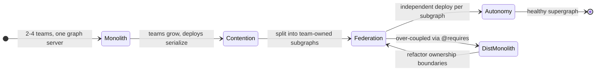

# GraphQL Federation — Staff

Federation is not primarily a technology decision. It is an organizational one dressed in schema syntax. The technical machinery — a router composing subgraphs into a supergraph via `@key`, `@requires`, `@external` — exists to serve one goal: let many teams ship one client-facing graph without a central schema team becoming the bottleneck. At staff level your job is not to explain how `_entities` resolution works. It is to decide whether your org should federate at all, who owns the graph as a product, where the governance chokepoints sit, and how to keep a fleet of subgraphs from collapsing into a distributed monolith. This file is about judgment, ownership, and framing — not resolver internals.

## Contents

1. [Federation as a Conway's-law solution](#1-federation-as-a-conways-law-solution)
2. [The graph as a shared product](#2-the-graph-as-a-shared-product)
3. [Governance: the schema registry as chokepoint](#3-governance-the-schema-registry-as-chokepoint)
4. [The distributed-monolith failure mode](#4-the-distributed-monolith-failure-mode)
5. [When federation is org-premature](#5-when-federation-is-org-premature)
6. [Ownership: platform team, subgraphs, incidents](#6-ownership-platform-team-subgraphs-incidents)
7. [Buy vs self-host](#7-buy-vs-self-host)
8. [Framing to leadership](#8-framing-to-leadership)
9. [Staff checklist](#9-staff-checklist)

---

## 1. Federation as a Conway's-law solution

A single monolithic GraphQL server forces every team that contributes types and resolvers into one deploy pipeline, one codebase, and one on-call rotation. That works at three teams. It does not work at thirty. The schema becomes a merge-conflict battleground, deploys serialize behind the slowest team, and a central "graph team" ends up gatekeeping every field addition.

Federation inverts this. Each team owns a **subgraph** — its own service, repo, deploy cadence, and on-call. A **router** (gateway) composes those subgraphs into one **supergraph** that clients query as if it were monolithic. The org chart and the graph structure are decoupled: the client sees one graph; the org ships as N independent teams.

This is Conway's law used deliberately. You are not fighting the fact that teams ship independently — you are encoding it into the architecture so that team boundaries become subgraph boundaries. The payoff is **deploy autonomy**: the Reviews team ships a new field on `Product.reviews` without coordinating a release with the Catalog team that owns `Product` itself.

The cost is that "one graph" is now a fiction maintained by tooling and governance rather than by a single codebase. Everything below is about maintaining that fiction well.

The two exit paths from `Federation` are the whole staff story: autonomy is the reward, distributed monolith is the trap. Both are organizational outcomes, not technical ones.

---

## 2. The graph as a shared product

The moment you federate, the supergraph stops being any one team's asset and becomes a **shared product** consumed by every client (web, mobile, partners). Shared products without an owner and rules degrade fast. Three things need governance from day one:

- **Naming conventions.** `Product`, `product`, `ProductItem`, `CatalogProduct` — without a style guide, four teams invent four vocabularies and the client-facing graph reads like four different APIs stitched together. Enforce a naming style guide: type casing, field casing, pluralization of connection fields, mutation naming (`verbNoun`), enum value conventions, nullability defaults.
- **Shared-type ownership.** The entity `Product` may be defined by Catalog but extended by Reviews, Pricing, and Inventory. Who owns the canonical `@key`? Who arbitrates when Pricing wants to add a field that conflicts with Catalog's model? Every shared entity needs a **designated owning team** — the tie-breaker, not the sole author.
- **A schema review board.** A lightweight cross-team body (or async review process) that approves shared-type changes, new root fields, and deprecations. Not a gate on every field — that recreates the central bottleneck — but a gate on *cross-cutting* decisions: entity keys, breaking changes, and additions to `Query`/`Mutation`.

The failure mode when this is absent: the graph accumulates duplicate types (`User` and `Account` and `Member` for the same concept), inconsistent nullability, and orphaned deprecated fields nobody removes. Clients feel it as an incoherent API even though each subgraph is individually clean.

Treat the graph like a public API product: it has a style guide, a changelog, deprecation policy, and an owner. The owner is the platform team (§6), but the *authors* are every product team.

---

## 3. Governance: the schema registry as chokepoint

A style guide that lives in a wiki is advisory. Governance only bites when it sits in CI. The **schema registry** plus **schema checks** is that chokepoint — the single place where "you can't break the graph" is mechanically enforced.

**Managed federation** flips the composition model. Instead of the router reading subgraph schemas live at startup (which risks a bad subgraph taking down composition in production), subgraphs **publish** their schema to a registry. The registry composes the supergraph, validates it, and hands the router a pre-validated **supergraph schema**. The router pulls config from the registry, not from live introspection. See the Apollo docs on managed federation at apollographql.com/docs.

The governance leverage is **schema checks in CI**:

- A subgraph opens a PR changing its schema.
- CI runs a check against the registry: does this compose cleanly with all *other* subgraphs? Does it introduce a **breaking change** to a field that clients still use (validated against recent operation traffic)?
- A breaking change against live traffic **fails the check and blocks the merge**.

This is the one point where a decentralized graph gets centralized safety. It is worth protecting fiercely. Without schema checks, federation gives every team a loaded gun pointed at the supergraph: one team renames a field, three clients break in production, and nobody caught it because each subgraph tested in isolation.

| Governance mechanism | What it prevents | Where it lives | Blocks a deploy? |
|---|---|---|---|
| Naming style guide | Incoherent vocabulary | Docs + linter | Optional (lint) |
| Schema review board | Bad shared-type / entity-key decisions | Async review | Only cross-cutting changes |
| Schema composition check | Subgraph that won't compose | CI, via registry | Yes |
| Breaking-change check (vs traffic) | Silently breaking live clients | CI, via registry | Yes |
| Deprecation policy | Orphaned fields, unbounded schema growth | Registry + review | No (tracked, not blocked) |

The middle two rows are the teeth. Everything else is hygiene. A staff engineer's first governance investment is making the composition check and breaking-change check mandatory, non-bypassable CI gates on every subgraph repo.

---

## 4. The distributed-monolith failure mode

Federation's promise is deploy autonomy. The way you lose it is **coupling subgraphs through the schema** until they can no longer deploy independently — a distributed monolith with the operational cost of microservices and the coordination cost of a monolith.

The primary vector is over-use of `@requires` and `@external`. When subgraph B's resolver `@requires` fields from subgraph A to compute its own field, B is now runtime-coupled to A. A change to A's field shape ripples into B. A latency spike or outage in A degrades B's field. Chains of `@requires` across four subgraphs mean a single query fans out synchronously and any one hop can fail the whole thing.

Symptoms that you have built a distributed monolith:

- Teams routinely **coordinate releases** ("we can't ship until Catalog ships first"). The autonomy is gone.
- One subgraph's incident **cascades** into fields owned by three other subgraphs.
- Entity boundaries don't match team boundaries — two teams edit the same entity's core fields constantly.
- Query plans fan out to deep chains of `@requires`, and p99 latency is dominated by the slowest subgraph in the chain.

The fix is organizational before it is technical. Draw entity ownership so that a subgraph owns a *cohesive* slice of the domain that maps to a team. Minimize cross-subgraph `@requires`; prefer that each subgraph resolve its own fields from its own data, joined only by the entity key. If two subgraphs are constantly reaching into each other, the boundary is wrong — either merge them or move the field. Coupling in the schema is a signal that the org boundary and the domain boundary disagree.

Staff heuristic: the number of cross-subgraph `@requires` edges is a coupling metric. Track it. If it grows faster than the number of subgraphs, you are federating the wiring, not the ownership.

---

## 5. When federation is org-premature

Federation is a scaling solution for a *people* problem — many teams contending over one graph. Applied before you have that problem, it is pure overhead: you pay for a router, a registry, composition tooling, cross-team governance, and multi-service operations to solve contention that does not yet exist.

| Signal | Federate now | Defer (plain GraphQL / REST first) |
|---|---|---|
| Team count contributing to the graph | Many (roughly 5+, growing) | 1-3 teams |
| Deploy contention | Deploys serialize, merge conflicts frequent | One team ships freely |
| Domain boundaries | Clear, stable, team-aligned | Still shifting, unclear ownership |
| Platform capacity | A team can own router + registry | No one to own the platform layer |
| Client need for one graph | Real: many clients, one unified surface | Single client, or REST is fine |
| GraphQL maturity | Team already runs GraphQL well | Still learning GraphQL basics |

If the right column dominates, federation is premature. The correct move is usually a **plain (monolithic) GraphQL server**, or even REST, until the contention is real. A single GraphQL server scales technically far past where most orgs sit; the reason to federate is almost never throughput — it is team autonomy.

Two anti-patterns to name explicitly:

- **Federating a two-team org** because federation is fashionable. You inherit distributed-systems complexity to solve a problem a shared repo and code review would handle.
- **Federating before GraphQL competence.** If teams can't design a clean single schema, giving each team its own subgraph multiplies the inconsistency, not divides it. Master the schema design skill first, then distribute it.

The staff move is often to *say no* — or "not yet" — and to define the concrete trigger (team count, deploy contention) that will make the answer yes later.

---

## 6. Ownership: platform team, subgraphs, incidents

Federation only works with a clear split between the **platform team** that owns the shared machinery and the **product teams** that own subgraphs.

| Concern | Platform team owns | Product (subgraph) team owns |
|---|---|---|
| Router / gateway | Yes — config, scaling, deploy | No |
| Schema registry & CI checks | Yes — the gates and tooling | No |
| Supergraph composition | Yes — composition health | No |
| Their subgraph's schema & resolvers | No | Yes |
| Their subgraph's data & latency | No | Yes |
| Their subgraph's on-call | No | Yes |
| Style guide & review process | Yes — steward | Contributes, follows |
| Naming / breaking-change policy | Yes — defines | Complies |

The platform team owns the *graph as infrastructure*: router, registry, checks, style guide. It does **not** own domain schemas — that would recreate the central bottleneck. It owns the rules and the plumbing; product teams own the content.

**Cross-team incident ownership** is the hardest operational question federation creates. A query fails. Which subgraph broke it? The router traces a query plan that fans out to N subgraphs — the failure could be in any of them, or in composition, or in the router itself. Without per-subgraph tracing you get finger-pointing: the client team reports "the query is broken," and four subgraph teams each say "not my field."

Resolve this with instrumentation and a runbook:

- **Distributed tracing** on the query plan so a failed query attributes the error to the specific subgraph resolver that threw. This is non-negotiable operational tooling — fund it before you scale subgraph count.
- **Clear escalation ownership**: the platform team owns router/composition incidents; the subgraph team owns its own field failures. The registry tells you who owns any given field.
- **A blameless triage path**: platform team acts as first responder to route the incident to the owning subgraph, not to fix domain logic.

If you cannot answer "whose subgraph broke this query" from a trace in under a minute, your federation is not production-ready regardless of how clean the schema composes.

---

## 7. Buy vs self-host

The router, registry, and schema-check tooling can be bought (Apollo GraphOS, the managed federation platform) or self-hosted (open-source router plus a self-built or open registry). This is a classic build-vs-buy call, and the right answer depends on platform-team capacity more than on cost.

| Dimension | Buy (managed platform, e.g. GraphOS) | Self-host |
|---|---|---|
| Registry & schema checks | Provided, maintained | You build and run |
| Router operations | Managed config, updates | You operate and patch |
| Time to first supergraph | Fast | Slow |
| Recurring cost | Subscription | Infra + platform-team salaries |
| Control / data residency | Vendor-dependent | Full control |
| Platform-team burden | Low | High — a real ongoing product |

The decision that actually matters: **do you have a platform team willing to own a registry and CI-check tooling as a product forever?** If not, buy — because a half-maintained self-hosted registry is worse than no registry (teams route around it, and the governance chokepoint leaks). If you have strong platform capacity, strict data-residency needs, or scale where subscription cost outweighs headcount, self-host is defensible. For most orgs adopting federation, buying the governance layer and self-hosting nothing until you outgrow it is the lower-risk path. Consult current capabilities at apollographql.com/docs before committing either way.

---

## 8. Framing to leadership

Leadership does not fund "GraphQL Federation." They fund outcomes. Frame it in their language:

- **The problem, not the tech.** "Thirty teams share one API surface and can't ship without colliding. Deploys serialize; a central schema team is the bottleneck." That is a velocity and org-scaling problem leadership already feels.
- **The outcome.** "Each team ships its slice of the graph independently, on its own cadence, while clients still see one unified API." Deploy autonomy and one coherent client surface — measurable as deploy frequency and reduced cross-team coordination.
- **The cost, honestly.** A platform team to own the router and registry; new governance process; distributed-systems operational overhead; a real risk of building a distributed monolith if boundaries are drawn poorly. Do not undersell this.
- **The precondition.** "This pays off at our team count and contention. Below that, it's overhead — so we federate when X teams contend, not before." Naming the trigger builds credibility and prevents premature adoption.
- **Buy vs build framing.** "We can buy the governance platform and stand this up in weeks, or self-host and fund a platform team to run it indefinitely." Tie it to headcount, not license line items.

The staff signal to leadership is that you are treating the graph as a **product with an owner and a lifecycle**, that you know the failure modes (distributed monolith, premature adoption, orphaned governance), and that you have named the concrete trigger and the ownership model. Enthusiasm for the technology is not the pitch; disciplined scoping of when and how is.

---

## 9. Staff checklist

- Federation is a Conway's-law tool: subgraph boundaries mirror team boundaries to buy deploy autonomy.
- The supergraph is a shared product — it needs a style guide, shared-type owners, and a review board for cross-cutting changes.
- The registry + schema checks in CI are the governance chokepoint; make composition and breaking-change checks mandatory, non-bypassable gates.
- Watch cross-subgraph `@requires` as a coupling metric; runaway coupling is the distributed-monolith trap.
- Federation is org-premature below ~5 contending teams or without a platform team to own the machinery; be willing to say "not yet" and name the trigger.
- Split ownership cleanly: platform team owns router/registry/checks/style guide; product teams own their subgraph schema, data, and on-call.
- Fund distributed tracing so any failed query attributes to the owning subgraph — incident ownership must be answerable in under a minute.
- Buy the governance layer unless you have a platform team committed to owning a registry as a product forever.
- Frame to leadership as velocity and org-scaling, with honest cost and a named adoption trigger.

*Next step:* [GraphQL Federation — Interview](interview.md)
