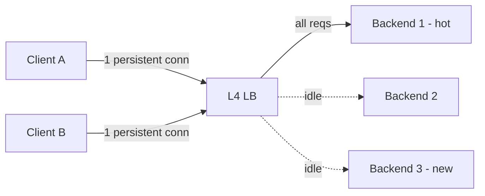

# gRPC and Streaming — Interview

A tiered question bank, fundamentals first, then staff-level judgment. Each answer is a self-contained, senior-grade response you can adapt to your own war stories.

1. What is gRPC, and why HTTP/2 + Protobuf?
2. What are the four call types?
3. Protobuf vs JSON — what actually changes?
4. How does Protobuf schema evolution stay backward/forward compatible?
5. Why does gRPC break L4 load balancing, and how do you fix it?
6. How do deadlines and cancellation propagate?
7. How does streaming back-pressure work?
8. Why can't browsers speak gRPC directly, and what is grpc-web?
9. When gRPC vs REST vs GraphQL?
10. What's the debuggability trade-off, and how do you mitigate it?
11. How do you version a gRPC service in production?
12. How do errors and status codes work compared to HTTP?
13. (Staff) How do you govern `.proto` at org scale?
14. (Staff) When would you *not* choose gRPC?

---

## Q1: What is gRPC, and why HTTP/2 + Protobuf?

gRPC is a Remote Procedure Call framework: you define services and messages in a `.proto` file, and code generation gives you strongly-typed client stubs and server skeletons in many languages. Calling a remote method looks like calling a local one. Two choices define it. First, **HTTP/2** as the transport — it multiplexes many concurrent requests over a single long-lived TCP connection (no head-of-line blocking at the HTTP layer), supports full-duplex streaming, uses HPACK header compression, and lets the server push flow-control back to the client. Second, **Protocol Buffers** as the interface definition language and wire format — a compact binary encoding driven by a shared schema. Together they give you low latency, small payloads, bidirectional streaming, and a machine-checked contract. The `.proto` file is the single source of truth that both sides compile against, which is the real value: the contract can't drift silently because both client and server are generated from it.

## Q2: What are the four call types?

gRPC supports four method shapes, chosen by putting `stream` on the request, response, both, or neither:

| Call type | Signature shape | Client sends | Server sends | Typical use |
|---|---|---|---|---|
| Unary | `rpc M(Req) returns (Resp)` | one | one | Ordinary request/response (the 90% case) |
| Server streaming | `rpc M(Req) returns (stream Resp)` | one | many | Subscriptions, large result sets, progress feeds |
| Client streaming | `rpc M(stream Req) returns (Resp)` | many | one | Uploads, metric/telemetry ingestion, batching |
| Bidirectional streaming | `rpc M(stream Req) returns (stream Resp)` | many | many | Chat, real-time sync, interactive protocols |

All four ride the same HTTP/2 connection. Bidirectional streaming is genuinely full-duplex: both sides can send independently, not lock-step ping-pong. Streams are ordered per-stream but the framework guarantees delivery order only within a single stream, not across streams.

## Q3: Protobuf vs JSON — what actually changes?

Three axes: size, speed, and contract. **Size** — Protobuf encodes fields as `(field-number, wire-type)` tags plus packed binary values; there are no field names on the wire and numbers are varint-encoded, so payloads are typically 3–10x smaller than the equivalent JSON. **Speed** — parsing is a linear scan over a length-prefixed binary buffer with no string tokenizing, number parsing, or whitespace handling, so serialization/deserialization is markedly faster and produces far less garbage. **Contract** — this is the one people underweight: Protobuf messages are defined by a schema, so the types, field presence rules, and enums are known ahead of time and generated into code. JSON is schemaless by default (you bolt on JSON Schema or OpenAPI separately, and nothing enforces it at runtime). The cost is that Protobuf is not human-readable on the wire — you can't `curl` and eyeball it — which is the debuggability tax discussed in Q10.

## Q4: How does Protobuf schema evolution stay backward/forward compatible?

Compatibility hinges on **field numbers, not field names**. The number is the identity on the wire; the name is only for the generated code. This gives a set of safe rules:

- **Never reuse or renumber a field.** Adding a new field with a new number is always safe — old readers skip unknown fields (forward compatibility), new readers see the default for a field an old writer didn't send (backward compatibility).
- **Renaming a field** is safe on the wire (number unchanged) but breaks source that referenced the old name.
- **Deleting a field:** stop using it, then `reserve` its number and name so no one can accidentally recycle them: `reserved 4, 7; reserved "old_field";`. Recycling a number is the classic corruption bug — an old client writes into number 4 expecting an `int32`, a new client reads number 4 as a `string`, and you get silent garbage.
- **Type changes** are only safe within wire-compatible groups (e.g. `int32`/`int64`/`bool`/`enum` are all varints and interchange-ish), otherwise they corrupt.
- **Enums** should carry a zero value (`UNSPECIFIED = 0`) as the default; unknown enum values are preserved as their integer by newer proto3 runtimes rather than dropped.

The whole model is designed so that services deploy independently: a producer and consumer on different schema versions must interoperate, because you never deploy them atomically.

## Q5: Why does gRPC break L4 load balancing, and how do you fix it?

A layer-4 (connection-level) load balancer distributes *connections*, not requests. gRPC opens **one long-lived HTTP/2 connection** and multiplexes thousands of requests over it. So an L4 balancer pins that whole connection — and all its traffic — to a single backend. Scale up your backend pool from 3 to 30 pods and existing clients keep hammering their original 3, leaving the new 27 idle. This is the single most common gRPC production surprise.

Fixes, roughly in order of preference:
- **Client-side (look-aside / round-robin) load balancing** — the client resolves all backend addresses and round-robins requests across its own set of subchannels. This is per-request and does the right thing.
- **A layer-7 / gRPC-aware proxy** (Envoy, Linkerd, or a service mesh) that terminates HTTP/2 and load-balances individual streams across backends.
- **Proxyless service mesh via xDS**, where the gRPC client gets endpoint updates from a control plane.
- A blunt stopgap: **`MAX_CONNECTION_AGE`** on the server so connections periodically drain and re-resolve, spreading load over time — mitigation, not a real balancer.

## Q6: How do deadlines and cancellation propagate?

Every gRPC call carries a **deadline** (an absolute point in time, set client-side, propagated in metadata) rather than a per-hop timeout. When A calls B calls C, the *remaining* deadline flows down the chain, so a downstream service knows how long the whole caller is still willing to wait and won't do work that's already doomed. If the deadline passes, the RPC fails with `DEADLINE_EXCEEDED`. **Cancellation** propagates the same way through the context: if the client disconnects, hits its deadline, or explicitly cancels, that signal travels down and each server should observe its context being cancelled and abandon in-flight work — stop the query, release the goroutine/thread, don't write the response. The discipline this enforces is: always set a deadline (never rely on a default of infinity), always propagate the incoming context rather than creating a fresh unbounded one, and always check for cancellation on long operations. Missing this is how one slow dependency turns into a fleet-wide thread/goroutine pileup.

## Q7: How does streaming back-pressure work?

Back-pressure is inherited almost for free from **HTTP/2 flow control**. Each stream and the whole connection have a receive window; the receiver advertises how many bytes it's ready to accept, and the sender must not exceed it. If a consumer reads slowly, its window doesn't refill, and the producer's writes block once the window is exhausted. That signal flows all the way back to the application: a server streaming faster than the client can consume will find its `Send` calls blocking, which is exactly the coupling you want — the fast producer is throttled to the slow consumer's rate instead of buffering unbounded memory. In practice you still design around it: treat a blocking `Send` as a real signal, don't spawn an unbounded goroutine per message, and set flow-control window sizes appropriately for high-bandwidth-delay-product links. The contrast is a naive queue-based system where a fast producer silently fills a buffer until OOM; HTTP/2 makes the queue depth a bounded, self-regulating window.

## Q8: Why can't browsers speak gRPC directly, and what is grpc-web?

Browsers don't give JavaScript enough control over the HTTP/2 frame layer — you can't manage trailers, read/write raw binary frames, or control the connection the way gRPC's protocol requires (gRPC uses HTTP/2 trailers to carry final status, and browser `fetch`/`XHR` don't expose them). So a browser can't be a native gRPC client. **grpc-web** is the bridge: a slightly different wire protocol that a browser *can* speak, terminated by a proxy (Envoy's gRPC-Web filter, or an in-process gateway) that translates grpc-web to real gRPC toward your backends. The catch is that grpc-web is limited: unary and **server streaming** work, but **client streaming and bidirectional streaming are not supported** in the browser (you fall back to WebSocket/SSE for those). So browser-facing gRPC always means "grpc-web + a translating proxy, and forget bidi streaming from the browser."

## Q9: When gRPC vs REST vs GraphQL?

| Dimension | gRPC | REST | GraphQL |
|---|---|---|---|
| Wire format | Binary (Protobuf) | Text (usually JSON) | JSON |
| Contract | Strong, code-generated `.proto` | OpenAPI (optional, bolted on) | Strong, typed schema |
| Streaming | First-class (4 modes) | Awkward (SSE/chunked) | Subscriptions (over WS) |
| Browser-native | No (needs grpc-web + proxy) | Yes | Yes |
| Best fit | Internal service-to-service, low-latency, polyglot | Public APIs, cacheable resources, broad reach | Aggregating many backends, client-shaped data, mobile |
| Caching | Poor (opaque binary, POST-like) | Excellent (HTTP caching) | Poor (single POST endpoint) |
| Debuggability | Low (binary) | High (curl/browser) | Medium (introspection) |

Rules of thumb: **gRPC for east-west traffic** — service-to-service inside your perimeter where you control both ends, want low latency, streaming, and enforced contracts across many languages. **REST for public, north-south APIs** where reach, HTTP caching, and "any HTTP client can call it" matter. **GraphQL when clients need to shape their own queries** across many underlying sources and you want to avoid over/under-fetching (mobile, rich UIs). These aren't exclusive: a common pattern is GraphQL or REST at the edge, gRPC between the internal services behind it.

## Q10: What's the debuggability trade-off, and how do you mitigate it?

The binary wire format that makes gRPC fast also makes it opaque. You can't `curl` an endpoint and read the body, you can't eyeball a payload in a packet capture, and standard HTTP tooling shows you framed bytes instead of a message. Mitigations: use **`grpcurl`** (like curl for gRPC) with **server reflection** enabled so tools can discover the schema at runtime; keep the `.proto` files accessible so anyone can decode a message; lean on **structured logging and distributed tracing** (OpenTelemetry) since you can't reconstruct calls from raw traffic; and in a mesh, use the proxy's observability (Envoy access logs, tap filters). The honest interview answer is that gRPC trades human-readable, universally-tooled traffic for performance and contract safety, so you *have* to invest in the gRPC-native tooling to get your debuggability back — it doesn't come free from the browser DevTools the way REST does.

## Q11: How do you version a gRPC service in production?

Two layers. **Schema-level evolution** (Q4) handles most change: add fields, never renumber, reserve deleted numbers — this lets you evolve a service in place without a new version at all, and it's the preferred path. **Service/package-level versioning** handles breaking changes you truly can't make compatibly: put the version in the proto package and service name, e.g. `package myco.orders.v1;` with `service OrderServiceV1`, and stand up `v2` alongside `v1`. Run both, migrate clients, then deprecate and remove `v1` once traffic drains. Because you never deploy client and server atomically, backward compatibility isn't optional — a rollout is always a window where mixed versions coexist. The key mental model: prefer additive, wire-compatible changes; reserve hard version bumps for genuine breaks, and always overlap the versions rather than cutting over.

## Q12: How do errors and status codes work compared to HTTP?

gRPC has its own **status code** enum (`OK`, `NOT_FOUND`, `INVALID_ARGUMENT`, `PERMISSION_DENIED`, `DEADLINE_EXCEEDED`, `UNAVAILABLE`, `RESOURCE_EXHAUSTED`, `INTERNAL`, etc.), returned in HTTP/2 **trailers** at the end of the response along with a message and optional structured error details (`google.rpc.Status` with typed detail messages). This is richer than raw HTTP status: you distinguish "the request was malformed" (`INVALID_ARGUMENT`) from "you're not allowed" (`PERMISSION_DENIED`) from "try again, I'm briefly down" (`UNAVAILABLE`, which is retry-safe) using a fixed, well-defined vocabulary. Two practical consequences: retry policy keys off these codes (retry `UNAVAILABLE`, don't retry `INVALID_ARGUMENT`), and because status lives in trailers, a client can start streaming a response and only learn it failed at the end — relevant for streaming error handling.

## Q13 (Staff): How do you govern `.proto` at org scale?

Once hundreds of services share Protobuf contracts, ad-hoc `.proto` files become a liability, so you treat the schema as governed infrastructure:

- **A central schema repository / registry** as the source of truth (a monorepo `proto/` tree or a dedicated registry like Buf Schema Registry). Every service consumes generated code from there, not hand-copied protos.
- **Automated breaking-change detection in CI** (`buf breaking`) that fails the PR if a change violates compatibility rules — renumbering a field, changing a type, un-reserving a number. This turns Q4's discipline into an enforced gate instead of a tribal convention.
- **Lint and style rules** (`buf lint`) so field naming, package versioning, and enum-zero-value conventions are uniform across teams.
- **Ownership and review** — protos have code owners; changing a widely-consumed message requires the owning team's sign-off because the blast radius is every consumer.
- **Consistent codegen and distribution** — one pipeline generates stubs for all target languages and publishes versioned artifacts, so a Go service and a Java service can't drift on how the same message is generated.

The staff insight is that the `.proto` *is* the API, so the governance problem is API governance: discoverability, compatibility enforcement, ownership, and blast-radius awareness — not just "check the file into git."

## Q14 (Staff): When would you *not* choose gRPC?

Reach for something else when: (1) **the API is public / third-party facing** — external developers expect REST + JSON, HTTP caching, and universal tooling; gRPC's browser story (grpc-web + proxy, no bidi) is friction you'd be imposing on every integrator. (2) **You need HTTP caching / CDN behavior** — gRPC calls are opaque binary POST-like requests that CDNs and reverse proxies can't cache on content; cacheable read APIs belong in REST. (3) **Browser is a first-class client and you need full-duplex streaming** — grpc-web can't do bidi, so WebSockets may be simpler. (4) **The org lacks the tooling maturity** — without schema governance, tracing, and grpc-native debug tooling, teams struggle with the opacity; the operational cost can outweigh the perf win for a low-traffic internal tool. (5) **Simple, low-volume internal calls** where REST is "good enough" and the team already knows it — introducing Protobuf codegen and a mesh for a service handling ten requests a minute is over-engineering. The staff framing: gRPC's advantages (perf, streaming, enforced polyglot contracts) pay off at scale and inside your perimeter; at the edge, at low volume, or without the supporting platform, its costs (opacity, browser limits, no caching, tooling burden) can dominate.

---

*Next step:* [Versioning and Deprecation — Junior](../versioning-and-deprecation/junior.md)
