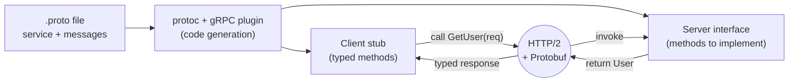
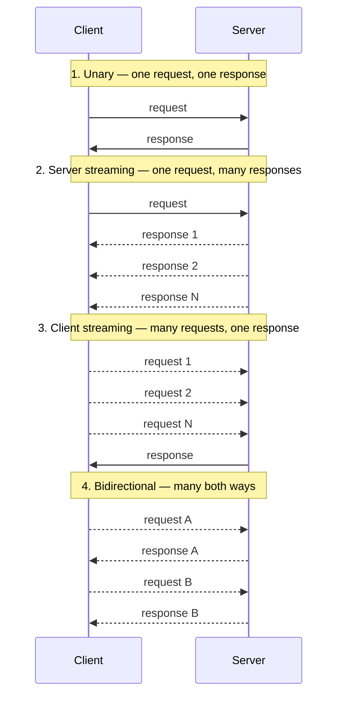

# gRPC and Streaming — Junior

<!-- level-focus -->
At junior level, focus on this question:

> How can I apply **gRPC and Streaming** in one small example and prove the result?

Use the smallest realistic scenario that exposes the decision and its failure behavior.
## 1. What gRPC is

**RPC** (Remote Procedure Call) means calling a function that runs on another machine and getting a result back — the network hop is hidden behind an ordinary-looking method call. gRPC is Google's open-source RPC framework built on three pillars:

- **A contract** written in a `.proto` file that defines the service (its methods) and the messages those methods send and receive.
- **Code generation**: a compiler reads the `.proto` and emits client and server code in your language, so both sides agree on types by construction.
- **A fast transport**: Protocol Buffers over HTTP/2.

Because the contract comes first and both sides are generated from it, the client and server cannot drift apart on field names or types. This is what "contract-first" means, and it is the biggest difference in mindset from hand-written REST clients.

---

## 2. The `.proto` contract and code generation

A `.proto` file has two ingredients: **messages** (the data shapes) and a **service** (the callable methods). Each field carries a type and a stable **field number** that identifies it on the wire.

```proto
syntax = "proto3";

message GetUserRequest {
  int64 user_id = 1;
}

message User {
  int64 id = 1;
  string name = 2;
  string email = 3;
}

service UserService {
  rpc GetUser(GetUserRequest) returns (User);
}
```

You run the Protocol Buffer compiler (`protoc`, with a gRPC plugin) over this file. It produces two things: **message classes** for serializing/deserializing the data, and a **client stub** plus a **server interface**. You call methods on the stub; you implement methods on the server interface.



The staged flow: **write the contract → generate code → the client calls a typed stub → the request travels as Protobuf over HTTP/2 → the server implementation runs → the typed response comes back.**

---

## 3. Protocol Buffers vs JSON

Protocol Buffers ("Protobuf") is a **binary, typed, schema-driven** serialization format. JSON is **text-based, self-describing, and schema-less**. The differences follow from that:

| Aspect | Protocol Buffers | JSON |
| --- | --- | --- |
| Encoding | Binary | Text (UTF-8) |
| Field identity on wire | Field number (e.g. `1`, `2`) | Field name string (`"email"`) |
| Size | Compact — no field names, packed integers | Larger — names repeated on every object |
| Types | Declared in schema, enforced | Inferred at parse time, loose |
| Human-readable | No (needs the schema to decode) | Yes |
| Schema required | Yes (`.proto`) | No |

Because field **numbers** rather than **names** are sent, a Protobuf payload does not repeat `"user_id"` and `"email"` for every record — it sends `1` and `3`. That makes it smaller and faster to parse. The cost is that you cannot read the bytes without the schema, and you always need the `.proto` to make sense of the data.

Field numbers are also how gRPC stays **backward-compatible**: you can add a new field with a new number, and old code simply ignores what it does not recognize. Never reuse or renumber an existing field.

---

## 4. HTTP/2 in one sentence

gRPC runs over **HTTP/2**, which lets many independent requests and responses (called streams) share a single long-lived connection at the same time — this multiplexing is what makes gRPC's streaming call types practical.

---

## 5. The four call types

The `rpc` declaration in a `.proto` decides the shape of a call by adding the `stream` keyword to the request, the response, both, or neither.

```proto
service Chat {
  rpc Lookup(Query) returns (Result);                        // unary
  rpc Subscribe(Query) returns (stream Event);               // server streaming
  rpc Upload(stream Chunk) returns (Summary);                // client streaming
  rpc Converse(stream Message) returns (stream Message);     // bidirectional
}
```



| Call type | Client sends | Server sends | Typical use |
| --- | --- | --- | --- |
| Unary | One message | One message | Ordinary request/response (like a REST call) |
| Server streaming | One message | A stream of messages | Live feed, large result set, progress updates |
| Client streaming | A stream of messages | One message | Uploading chunks, batching many events into one result |
| Bidirectional | A stream of messages | A stream of messages | Chat, real-time sync, long-lived interactive sessions |

**Unary** is the everyday case and behaves like a normal function call. The three streaming modes exploit HTTP/2's ability to keep sending messages on one open connection without a new round trip each time.

---

## 6. gRPC vs REST — when to use which

Both let services talk over the network; they optimize for different things.

| Dimension | gRPC | REST / JSON |
| --- | --- | --- |
| Transport | HTTP/2 | Usually HTTP/1.1 |
| Payload | Protobuf (binary) | JSON (text) |
| Contract | `.proto`, generated code | Often informal or OpenAPI |
| Streaming | Built-in, four call types | Limited (polling, SSE, WebSocket) |
| Browser support | Needs a proxy (gRPC-Web) | Native |
| Human-readable payloads | No | Yes |
| Best fit | Service-to-service, low latency, streaming | Public APIs, browsers, broad tooling |

**Reach for gRPC when:** you control both ends (internal microservices), you want a strict shared contract and generated clients, you need streaming, or latency and payload size matter.

**Stay with REST/JSON when:** the API is public or browser-facing, consumers are unknown or diverse, human-readable payloads help debugging, or you want maximum tooling and caching support out of the box.

---

## 7. Key takeaways

- gRPC is **contract-first RPC**: the `.proto` defines the service and messages, and code is generated from it so client and server stay in sync.
- **Protocol Buffers** are compact binary and typed; they send field numbers, not names, which makes payloads smaller than JSON but unreadable without the schema.
- gRPC runs over **HTTP/2**, which multiplexes many streams on one connection and enables streaming calls.
- There are **four call types**: unary, server streaming, client streaming, and bidirectional — chosen by where you put the `stream` keyword.
- Prefer gRPC for internal, high-performance, streaming service-to-service calls; prefer REST/JSON for public, browser-facing, human-readable APIs.

Authoritative references: the gRPC docs at grpc.io and the Protocol Buffers docs at protobuf.dev.

*Next step:* [gRPC and Streaming — Middle](middle.md)

---

## Apply it

1. Choose one small, known input for **gRPC and Streaming**.
2. Predict the output or observable behavior.
3. Run the smallest example or probe that exercises the concept.
4. Change one input to trigger a failure or boundary case.
5. Explain the evidence using the guide's vocabulary.

## Verify your work

- Record the exact input, command or code path, and output.
- Repeat the probe and confirm the result is consistent.
- Show one expected success and one expected failure.
- Resolve any difference between the prediction and the evidence.

## Review questions

- What problem does gRPC and Streaming solve in the example?
- Which input changes the observed result, and why?
- What is the smallest useful success check?
- Which beginner mistake would your evidence catch?
