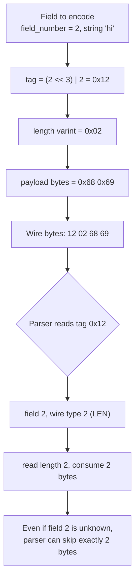
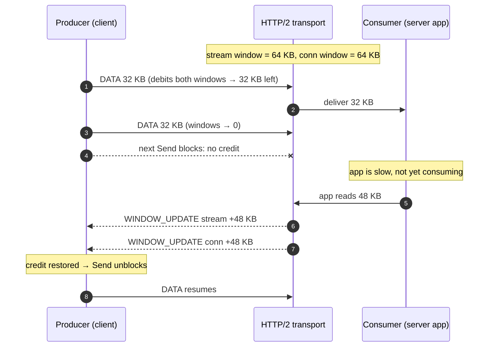

# gRPC and Streaming — Professional

<!-- level-focus -->
At professional level, focus on this question:

> How should teams adopt and operate **gRPC and Streaming** with measurable outcomes and limited coordination?

Use the smallest realistic scenario that exposes the decision and its failure behavior.
---

## 1. The layered model

A single gRPC call is a projection through four layers. Understanding which layer owns which property is the whole game.

| Layer | Unit | Owns |
|-------|------|------|
| Protobuf | message | Serialization, schema evolution, field numbers |
| gRPC framing | length-prefixed message | Compression flag, message length, one or many messages per direction |
| HTTP/2 | frame (HEADERS, DATA, WINDOW_UPDATE, ...) | Multiplexing, flow control, header compression (HPACK), stream lifecycle |
| TCP | segment | Reliable ordered byte stream, congestion control |

A gRPC method maps to exactly one HTTP/2 stream. The path is `/{package}.{Service}/{Method}`. Request metadata rides in the initial `HEADERS` frame; the payload rides in `DATA` frames; trailing status (`grpc-status`, `grpc-message`) rides in a final trailing `HEADERS` frame — this is why gRPC requires HTTP trailers and cannot run over HTTP/1.1 unmodified. See the transport spec at [grpc.io](https://grpc.io/docs/what-is-grpc/core-concepts/).

The four call types differ only in how many messages flow on the stream in each direction:

- **Unary** — one request message, one response message.
- **Server streaming** — one request, a sequence of responses.
- **Client streaming** — a sequence of requests, one response.
- **Bidirectional streaming** — independent sequences in both directions on the same stream.

All four use the identical framing; streaming is not a different protocol, only a different message count on the same HTTP/2 stream.

---

## 2. Protobuf wire format in detail

Protobuf does not serialize field names. On the wire, each field is a **key–value pair** where the key is a varint-encoded **tag** and the value's encoding is determined by the tag's wire type. The canonical reference is the [Protobuf encoding spec](https://protobuf.dev/programming-guides/encoding/).

The tag packs the field number and the wire type into a single varint:

```
tag = (field_number << 3) | wire_type
```

The low 3 bits are the wire type; everything above is the field number. This is why field number 1 with wire type 0 (varint) encodes as tag `0x08` — `(1 << 3) | 0 = 8`. It also explains a real cost cliff: field numbers 1–15 fit their tag in a single byte (4 bits of field number + 3 bits of wire type = 7 bits, fitting one varint byte), while 16–2047 need two bytes. **Reserve field numbers 1–15 for the hottest, highest-frequency fields.**

The six wire types:

| Wire type | Name | Used for | Value encoding |
|-----------|------|----------|----------------|
| 0 | VARINT | int32, int64, uint32, uint64, bool, enum, sint* | Varint (ZigZag for sint) |
| 1 | I64 | fixed64, sfixed64, double | 8 bytes, little-endian |
| 2 | LEN | string, bytes, embedded messages, packed repeated | Varint length prefix + bytes |
| 3 | SGROUP | group start (deprecated) | — |
| 4 | EGROUP | group end (deprecated) | — |
| 5 | I32 | fixed32, sfixed32, float | 4 bytes, little-endian |

Wire types 3 and 4 (start/end group) are legacy and should never appear in new schemas. Nearly all modern messages use types 0, 1, 2, and 5.

Because the value encoding is fully determined by the wire type in the tag, a parser can skip any field it does not recognize: read the tag, look at the low 3 bits, and consume the right number of bytes (a varint, 4 bytes, 8 bytes, or a length-prefixed run). This skip-the-unknown ability is the mechanical foundation of forward compatibility.

---

## 3. Varint, ZigZag, and length-delimited encoding

**Varint.** Integers are stored in a variable number of bytes, 7 payload bits per byte. The most significant bit (the *continuation bit*) is 1 if more bytes follow, 0 on the final byte. Bytes are emitted least-significant-group first. The value `300` (binary `100101100`) encodes as:

```
300 = 0b1_0010_1100
7-bit groups (LSB first): 0101100  0000010
add continuation bits:    10101100 00000010
bytes:                    0xAC     0x02
```

Small numbers cost one byte; this is why Protobuf is compact for the common case of small IDs and counts.

**ZigZag (sint32 / sint64).** Plain varint encoding of a negative two's-complement `int32` is catastrophic: `-1` sign-extends to 64 bits of ones and costs the maximum 10 bytes. ZigZag maps signed integers to unsigned so that small-magnitude negatives stay small:

```
encode(n) = (n << 1) ^ (n >> 31)     // for sint32; >> 63 for sint64
0 → 0, -1 → 1, 1 → 2, -2 → 3, 2 → 4, ...
```

Use `sint32`/`sint64` whenever a field is frequently negative; use plain `int32`/`int64` only when values are almost always non-negative.

**Length-delimited (wire type 2).** Strings, bytes, embedded messages, and packed repeated fields are prefixed with a varint byte-length, then that many raw bytes. Embedded messages are simply their own serialized bytes wrapped in a length prefix — the format is recursive and self-describing enough to skip.



---

## 4. Packed repeated fields and unknown fields

**Packed repeated.** In proto3, repeated scalar numeric fields are **packed by default**: instead of one tag per element, the encoder writes a single LEN field whose payload is the concatenated varints (or fixed-width values) of every element. A `repeated int32` of `[3, 270, 86942]` becomes one tag + one length + three varints, not three tag+value pairs. This removes per-element tag overhead and improves cache locality on decode. Non-scalar repeated fields (messages, strings) cannot be packed — each element is its own length-delimited field.

**Unknown fields.** When a parser encounters a tag whose field number is not in its schema, it does not error. It reads the wire type, skips the correct number of bytes, and — crucially — **retains the raw bytes as unknown fields**. On re-serialization those bytes are written back out unchanged. This preserve-and-forward behavior means an intermediary running an older `.proto` can pass a newer message through without silently dropping the fields it does not understand. (Note: proto3 historically discarded unknown fields in some runtimes; modern proto3 retains them, matching proto2. Do not rely on drop-vs-retain for security — validate explicitly.)

---

## 5. Forward and backward compatibility rules

Schema evolution correctness follows directly from the encoding. The rules that matter in review:

- **Never reuse a field number.** Field numbers are the only identity on the wire. Reusing a retired number makes new writers collide with old readers. Use `reserved 4, 5;` and `reserved "old_name";` to fence off retired numbers and names.
- **Adding a field is safe.** Old readers skip the unknown tag; new readers see the default (0, empty, or false) when an old writer omits it.
- **Removing a field:** reserve its number; do not delete-and-reuse.
- **Wire-compatible type changes** (e.g. `int32` ↔ `int64` ↔ `uint32` ↔ `bool`, all wire type 0) are tolerated because the wire type is identical — but semantics can truncate. `sint32` and `int32` are **not** interchangeable because ZigZag changes the byte layout.
- **`optional` in proto3** restores explicit field presence (has-a-value vs default), distinct from the implicit-presence default. This matters for distinguishing "field set to zero" from "field absent."
- **Enums must have a zero value** as the first entry, used when an unknown enum value arrives (open enums preserve the raw number).

The invariant: field number + wire type is a contract; field name and language type are not.

---

## 6. HTTP/2 framing and the gRPC message frame

gRPC messages are carried inside HTTP/2 `DATA` frames using a small **Length-Prefixed-Message** framing that sits *between* HTTP/2 and Protobuf:

```
[ 1 byte: compressed-flag ] [ 4 bytes: message length, big-endian ] [ message bytes ]
```

The compressed-flag (0 or 1) says whether the message body is compressed with the message-level codec negotiated for the stream. Multiple such length-prefixed messages can be concatenated across `DATA` frames — this is exactly how streaming works: each `Send` writes one length-prefixed message, and HTTP/2 flow control governs how fast those bytes drain. HTTP/2 framing itself is defined in [RFC 9113](https://www.rfc-editor.org/rfc/rfc9113).

Header metadata is HPACK-compressed in `HEADERS` frames. Repeated calls to the same service reuse HPACK's dynamic table so that `:path`, `content-type: application/grpc`, and stable custom metadata cost only a table-index reference after the first request.

---

## 7. HTTP/2 flow control and gRPC back-pressure

HTTP/2 flow control is what turns gRPC streaming into a **back-pressured** transport rather than an unbounded firehose. It operates at two levels simultaneously:

- **Connection level** — a single window shared across every stream on the connection.
- **Stream level** — a per-stream window, one for each active stream.

A sender may transmit `DATA` bytes only while *both* the connection window and that stream's window are positive. Each `DATA` frame's payload debits both windows. The receiver replenishes credit by emitting `WINDOW_UPDATE` frames — one for the connection, one per stream — as it consumes buffered bytes. When a receiver's application layer is slow to read, it stops sending `WINDOW_UPDATE`, the windows drain to zero, and the sender blocks. That block propagates up into the gRPC library, which stops accepting `Send` calls — the application feels back-pressure. This is the mechanism behind graceful degradation in streaming pipelines: a slow consumer automatically throttles a fast producer without any application-level protocol.



Tuning levers: the initial window size (`SETTINGS_INITIAL_WINDOW_SIZE`) and, in many implementations, a **BDP-based dynamic window** that grows the window to match the bandwidth-delay product on high-latency links. A too-small window on a high-BDP path caps throughput because the sender stalls waiting for `WINDOW_UPDATE` round trips; a too-large window weakens back-pressure and inflates memory.

---

## 8. Head-of-line blocking and why HTTP/3 helps

HTTP/2 multiplexes many streams onto one TCP connection. That solves *application-level* head-of-line (HOL) blocking — a slow stream no longer stalls others at the HTTP layer. But it introduces *transport-level* HOL blocking: because TCP delivers a single ordered byte stream, one lost segment stalls **every** multiplexed stream until that segment is retransmitted and delivered, even for streams whose bytes already arrived. Under packet loss, HTTP/2's multiplexing advantage inverts into a shared penalty.

HTTP/3 runs gRPC over **QUIC**, which implements streams *inside* the transport with per-stream ordering. A lost packet blocks only the stream whose bytes it carried; other streams keep delivering. QUIC also folds the TLS handshake into the transport for lower connection-setup latency and supports connection migration across IP changes. HTTP/3 is defined in [RFC 9114](https://www.rfc-editor.org/rfc/rfc9114).

| Property | gRPC over HTTP/2 (TCP) | gRPC over HTTP/3 (QUIC) |
|----------|------------------------|-------------------------|
| Transport | TCP + TLS | UDP + integrated TLS 1.3 |
| Multiplexing | Yes, application-level | Yes, transport-level streams |
| HOL blocking under loss | Yes — one loss stalls all streams | No — loss isolated to its stream |
| Handshake round trips | TCP + TLS (2–3 RTT, or 1 with TLS 1.3) | 1-RTT, 0-RTT resumption |
| Connection migration | No (breaks on IP change) | Yes (connection ID survives) |
| Flow control | Per-stream + connection windows | Per-stream + connection, in QUIC |
| Maturity for gRPC | Universal | Growing; verify library support |

For lossy or long-fat networks (mobile, cross-region), HTTP/3 materially improves tail latency; on clean datacenter links the two are close and HTTP/2 remains the default.

---

## 9. Connection management: keepalive, GOAWAY, max-concurrent-streams

Long-lived HTTP/2 connections need explicit liveness and lifecycle machinery.

- **Keepalive / PING.** gRPC sends HTTP/2 `PING` frames to detect dead peers and idle-broken NAT/load-balancer connections. Misconfigured aggressive client pings trigger the server's `ENHANCE_YOUR_CALM` GOAWAY; the server enforces a minimum ping interval (`GRPC_ARG_HTTP2_MIN_RECV_PING_INTERVAL_WITHOUT_DATA`). Align client `keepalive_time` with the server's permitted minimum, and set `keepalive_timeout` for how long to wait for the PING ack before declaring the connection dead.
- **GOAWAY.** A graceful-shutdown signal carrying the last stream ID the sender will service. Streams below that ID complete; new streams must open a fresh connection. This is how servers drain during deploys and how load balancers rebalance without dropping in-flight RPCs. Clients must handle GOAWAY by transparently reconnecting.
- **`SETTINGS_MAX_CONCURRENT_STREAMS`.** Caps how many streams a peer may have open at once on one connection (commonly ~100). Because a gRPC channel typically holds **one** HTTP/2 connection, a high-throughput client can saturate this cap and queue new RPCs. The fix is multiple subchannels / connections, which is why gRPC channels can be configured to spread load across several connections and why L4 (connection-level) load balancing under-serves gRPC — see §10.

---

## 10. Load balancing: lookaside and xDS proxyless

gRPC's persistent multiplexed connections defeat naive connection-level (L4) load balancing: a client opens one connection and pins all its RPCs to a single backend for the connection's lifetime, so new backends receive no traffic and hot backends stay hot. gRPC needs **request-level** (L7) balancing that is aware of individual RPCs.

Two families solve this:

- **Lookaside (a.k.a. "look-aside" or external) load balancing.** The client asks a separate *load-balancing service* for the current set of backend addresses and a policy, then makes RPCs directly to backends itself, applying a pick policy (`round_robin`, `pick_first`, weighted) per RPC. Data traffic never traverses a proxy; only the address/weight metadata does. This keeps the data path direct while centralizing endpoint discovery.
- **xDS / proxyless service mesh.** gRPC clients speak the **xDS** APIs (LDS/RDS/CDS/EDS) directly to a control plane (e.g. an Envoy-compatible one), receiving listeners, routes, clusters, and endpoints. The gRPC library itself becomes the data-plane proxy — hence *proxyless*. It gets mesh features (traffic splitting, canaries, outlier detection, weighted locality routing) without a per-pod sidecar hop, at the cost of building those features into the client library. See [grpc.io](https://grpc.io/docs/guides/xds/).

The trade-off: lookaside is simpler and language-agnostic but adds a discovery dependency; proxyless xDS is powerful and low-latency but couples clients to the xDS control-plane contract and requires library support.

---

## 11. Deadline propagation semantics

A gRPC **deadline** is an absolute point in time, not a per-hop timeout. The client sets it, and it is transmitted on the wire as `grpc-timeout` metadata (a relative duration the receiver converts back to an absolute instant against its own clock). The critical property is **propagation**: in a call chain A → B → C, when B makes its downstream call to C it should pass along the *remaining* time from A's deadline, so the whole tree respects one budget. A downstream hop must never be granted more time than its caller has left.

Consequences to enforce:

- Propagate the incoming deadline into every outgoing RPC (idiomatically, derive the child context from the request context). A hard-coded fresh timeout on a downstream call breaks the budget and lets orphaned work continue after the client has given up.
- When the deadline expires, the RPC fails with `DEADLINE_EXCEEDED`, and the transport cancels the stream (an HTTP/2 `RST_STREAM`), which cascades cancellation downstream — servers should honor context cancellation to stop wasted work.
- Deadlines are the primary defense against resource exhaustion from slow or hung dependencies; every RPC in a production system should carry one.

---

## 12. Compression and interceptors

**Compression** in gRPC operates at the **message level**, negotiated per call via the `grpc-encoding` header (e.g. `gzip`), with the peer advertising supported codecs in `grpc-accept-encoding`. The 1-byte compressed-flag in each length-prefixed frame (§6) marks whether that specific message was compressed, so a stream can mix compressed and uncompressed messages. Compression trades CPU for bytes-on-wire — worthwhile for large or highly redundant payloads, counterproductive for tiny messages where framing and CPU dominate. This is distinct from HTTP/2 HPACK, which compresses *headers* only.

**Interceptors** are gRPC's middleware: composable hooks wrapping the RPC invocation on both client and server, for unary and streaming calls. They are the correct home for cross-cutting concerns — authentication and token propagation, distributed-tracing span injection, metrics and logging, retry/hedging policy, deadline enforcement, and payload validation. Interceptors chain in a defined order; ordering matters (authentication before business metrics; tracing outermost so it captures the full latency). Keeping these concerns in interceptors rather than in method handlers is what keeps a large gRPC surface consistent and observable.

---

## Apply it

1. Define the user or business outcome that **gRPC and Streaming** should improve.
2. Assign one owner for code, contracts, operations, and incidents.
3. Split delivery into reversible increments that produce evidence early.
4. Publish responsibilities, escalation paths, and compatibility windows.
5. Stop or expand only when the agreed measures support that decision.

## Verify your work

- Each increment has an owner, rollback path, and observable exit condition.
- Adoption, reliability, delivery time, and coordination cost are measured.
- Incident and migration exercises prove that responsibility is executable.
- The old path is removed only after telemetry proves it is unused.

## Review questions

- Which measurable outcome justifies investing in gRPC and Streaming?
- Which team owns the full lifecycle and incident response?
- What reversible increment produces the earliest useful evidence?
- Which exit condition proves that migration or adoption is complete?
