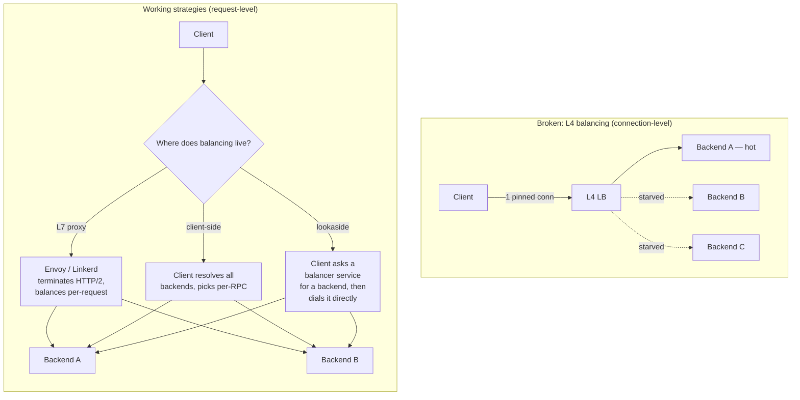

# gRPC and Streaming — Senior

<!-- level-focus -->
At senior level, focus on this question:

> Which system invariant is affected by **gRPC and Streaming** under failure, load, and change?

Use the smallest realistic scenario that exposes the decision and its failure behavior.
## 1. When gRPC Fits and When It Hurts

The core value proposition: a strongly-typed contract (`.proto`), compact binary framing (Protobuf), HTTP/2 multiplexing (many concurrent calls over one connection), and native streaming in both directions. Those properties map onto a specific shape of problem.

**gRPC fits when:**

- **Internal service-to-service.** You control both ends, you own the network, and human-readability is not a requirement. The typed contract eliminates a whole class of drift bugs.
- **Latency and throughput matter.** Binary framing plus HTTP/2 header compression (HPACK) plus connection reuse cuts per-call overhead versus JSON-over-HTTP/1.1.
- **Streaming is native to the problem.** Telemetry ingestion, live feeds, chunked uploads/downloads, and long-lived bidirectional sessions are first-class, not bolted on.
- **Polyglot fleet.** A single `.proto` generates idiomatic clients and servers for Go, Java, Python, Rust, C++, etc. The contract is the lingua franca.

**gRPC hurts when:**

- **Browser clients.** Browsers cannot speak raw gRPC (no access to HTTP/2 trailers and framing at the fetch layer). You need **grpc-web** plus a proxy (Envoy or the grpc-web proxy) that translates. That is real operational cost for a browser-facing API.
- **Human debuggability.** You cannot `curl` a gRPC endpoint and read the body. You need `grpcurl`, reflection, or generated clients. Incident response is slower for people who live in shell tools and browser dev-tools.
- **Public / third-party APIs.** External developers expect REST + JSON + OpenAPI. Shipping `.proto` files and forcing codegen on partners raises the integration barrier. Public APIs are usually REST or GraphQL for a reason.
- **Simple CRUD with no streaming and no perf pressure.** The tooling, codegen build step, and proxy overhead are not worth it for a low-traffic internal admin API.

The senior heuristic: **gRPC is the default for the interior of a distributed system; REST/GraphQL is the default at the edge where humans and third parties live.** Many mature architectures run gRPC internally and expose a REST/GraphQL gateway at the perimeter — often auto-generated from the same `.proto` via a transcoding gateway.

---

## 2. gRPC vs REST vs GraphQL — the Decision

| Dimension | gRPC | REST | GraphQL |
|---|---|---|---|
| Transport | HTTP/2 (required) | HTTP/1.1 or /2 | HTTP (usually POST) |
| Payload | Protobuf (binary) | JSON (usually) | JSON |
| Contract | `.proto`, compile-time | OpenAPI (optional) | SDL schema, enforced |
| Streaming | Native, bidirectional | SSE / WebSocket bolt-on | Subscriptions (over WS) |
| Browser support | Needs grpc-web + proxy | Native | Native |
| Human-debuggable | Poor (needs grpcurl) | Excellent (curl) | Good (playground) |
| Over/under-fetching | Fixed messages | Common problem | Client picks fields |
| Caching (HTTP) | Weak (POST-like semantics) | Strong (verbs, ETags) | Weak (single endpoint) |
| Best fit | Internal, low-latency, polyglot | Public, CRUD, cache-friendly | Aggregation, varied clients |

Read this table as three questions:

1. **Who is the client?** Browsers and third parties → REST/GraphQL. Your own services → gRPC.
2. **What is the traffic shape?** High-fan-out, low-latency, streaming → gRPC. Read-heavy, cache-friendly, resource-oriented → REST. Diverse clients that each want a different slice of a rich graph → GraphQL.
3. **What is the operational cost you can absorb?** gRPC buys performance and type-safety at the cost of proxies, codegen, and debuggability. That trade is worth it inside the mesh and rarely worth it at the edge.

These are not mutually exclusive. A common mature topology is **GraphQL or REST at the edge → gRPC between services**, with the edge layer acting as a translator and aggregator.

---

## 3. The Load-Balancing Problem

This is the single most common way gRPC deployments go wrong, and it stems directly from HTTP/2's design.

HTTP/1.1 opens a new connection (or short-lived keep-alive) per request. An L4 (TCP) load balancer distributing HTTP/1.1 connections spreads request load naturally, because there are many connections.

HTTP/2 multiplexes **all** requests over a **single, long-lived** connection. A gRPC client typically opens one connection to a backend and keeps it open, sending thousands of RPCs down it. Now put an L4 load balancer in front: it balances **connections**, not requests. The client picks one backend, pins the connection, and sends every request there. The other backends starve. Add ten more replicas and the client still hammers the one it connected to.

**The fix is to move balancing to L7 or to the client.** Four strategies:



| Strategy | Where decision is made | Pros | Cons |
|---|---|---|---|
| **L7 proxy** (Envoy, Linkerd, service mesh) | Proxy terminates HTTP/2, rebalances every stream | Transparent to client; central policy, mTLS, retries | Extra hop + latency; proxy must scale; operational surface |
| **Client-side LB** (grpc name resolver + round-robin/pick-first) | In the client library | No extra hop; lowest latency | Every client re-implements policy; needs service discovery integration |
| **Lookaside / external LB** | A dedicated balancer service tells the client which backend to dial | Centralized, smart policy without a data-path hop | Extra moving part (the lookaside service) that must be HA |
| **Proxyless service mesh** (xDS to the gRPC library) | Control plane (e.g. Istio via xDS) programs the gRPC client directly | Mesh policy without a sidecar hop | Requires xDS-capable gRPC + a control plane |

Two operational corollaries seniors watch for:

- **Scaling up replicas does not rebalance existing connections.** New backends get zero traffic from clients that are already connected until those connections churn. Force periodic connection recycling (`MAX_CONNECTION_AGE`) so autoscaling actually helps.
- **Headless/DNS discovery matters.** For client-side LB, the client must resolve **all** endpoints (e.g. a Kubernetes headless service returning all pod IPs), not a single virtual IP — otherwise you are back to pinning.

---

## 4. Deadlines and Cancellation Propagation

REST timeouts are typically per-hop and local: each client sets a socket timeout and forgets about it. gRPC treats time as a **budget that travels with the call**. A deadline is an absolute point in time carried in call metadata; every hop in the chain sees the remaining budget, and when it expires, work is cancelled everywhere downstream.

```mermaid
sequenceDiagram
    participant U as Gateway (deadline=500ms)
    participant A as Service A
    participant B as Service B
    participant D as Database

    U->>A: RPC (deadline: now+500ms)
    Note over A: 120ms elapsed → 380ms left
    A->>B: RPC (propagates deadline, ~380ms left)
    Note over B: 300ms elapsed → 80ms left
    B->>D: query (must finish in <80ms)
    Note over D: query takes 150ms
    D--xB: deadline exceeded
    B--xA: DEADLINE_EXCEEDED (cancel)
    A--xU: DEADLINE_EXCEEDED
    Note over U,D: Whole chain unwinds; B and D<br/>stop wasting work on a dead request
```

Why this is a **discipline**, not a config value:

- **Propagate, do not reset.** Each service must pass the incoming deadline down (the gRPC library does this by default through the `context`/`Context`). A service that sets a fresh independent timeout on its downstream call breaks the budget and can hold work after the caller has already given up.
- **Cancellation frees resources.** When the deadline fires or the client disconnects, the cancellation signal propagates. Downstream services should observe it (`ctx.Done()`, cancelled context) and **stop the work** — abort the DB query, close the stream, release the goroutine/thread. Ignoring cancellation is how a timed-out request keeps burning CPU and a connection for another 10 seconds.
- **Always set a deadline on the client side.** A call with no deadline can hang forever, pin a stream, and — under back-pressure — cascade into resource exhaustion. "No deadline" is a latent outage.
- **Budget-aware fan-out.** If A calls B and C in parallel with 380ms left, both get ~380ms; if sequential, the second gets what the first left behind. Seniors reason about the deadline the way they reason about an error budget.

The failure mode this prevents is **retry/timeout amplification**: without propagated deadlines, an outer request can retry while inner services are still grinding on the original attempt, multiplying load exactly when the system is already stressed.

---

## 5. The Error Model

gRPC does not use HTTP status codes for application errors. It uses its own set of **status codes** returned in HTTP/2 trailers. There are ~16 canonical codes; the ones seniors reason about constantly:

| Code | Meaning | Typical use / retry posture |
|---|---|---|
| `OK` | Success | — |
| `INVALID_ARGUMENT` | Client sent bad data | Do **not** retry; fix the request |
| `NOT_FOUND` | Resource missing | Do not retry |
| `ALREADY_EXISTS` | Idempotency conflict | Do not retry |
| `DEADLINE_EXCEEDED` | Budget ran out | Retry only if idempotent and budget remains |
| `RESOURCE_EXHAUSTED` | Rate-limited / quota | Retry with backoff |
| `UNAVAILABLE` | Transient — server down/overloaded | **Retryable** — the canonical "try again" |
| `FAILED_PRECONDITION` | State not right for the op | Fix state, do not blind-retry |
| `UNAUTHENTICATED` / `PERMISSION_DENIED` | AuthN / AuthZ | Do not retry |
| `INTERNAL` | Server bug / invariant broken | Investigate; not client-retryable |

Two design points:

- **Status code vs rich error.** The status code is a coarse, machine-actionable category. For anything richer (which field was invalid, retry-after hints, quota details), use the **rich error model**: attach structured details (`google.rpc.Status` with typed `details` such as `ErrorInfo`, `BadRequest`, `RetryInfo`, `QuotaFailure`) as Protobuf `Any` payloads. Clients decode the details; middleware and dashboards key off the status code.
- **Retry policy belongs to the code, not the caller's intuition.** gRPC service config lets you declare per-method retry policy: which status codes are retryable (`UNAVAILABLE`, `RESOURCE_EXHAUSTED`), backoff, and max attempts. Combine with **idempotency**: only retry non-mutating or idempotent methods automatically, or you risk duplicate side effects.

Mapping to REST at the edge is a deliberate translation step: `INVALID_ARGUMENT` → 400, `NOT_FOUND` → 404, `PERMISSION_DENIED` → 403, `UNAVAILABLE` → 503, `RESOURCE_EXHAUSTED` → 429, `DEADLINE_EXCEEDED` → 504. Do this in the gateway, once, consistently.

---

## 6. Streaming Back-Pressure and Stream Lifecycle

gRPC has four call types: **unary**, **server-streaming**, **client-streaming**, and **bidirectional streaming**. The last three introduce lifecycle problems that unary calls never have.

**Back-pressure.** HTTP/2 provides flow control via stream and connection windows. If the receiver stops reading, the window fills and the sender's writes block — the transport applies back-pressure automatically. This is a feature: a slow consumer naturally throttles a fast producer instead of causing unbounded memory growth. The danger is **defeating** it: buffering the entire stream into memory before processing, or spawning an unbounded queue between the receive loop and the worker, converts a well-behaved back-pressured stream into an OOM. Respect the read cadence; process as you receive.

**Long-lived stream lifecycle.** A bidirectional stream can live for minutes or hours. Over that window:

- **Connections die.** Load-balancer idle timeouts, NAT gateways, proxy connection-age limits, and rolling deployments all sever long-lived streams. Treat disconnection as normal, not exceptional.
- **Reconnection is the client's job.** The client must detect stream termination, **reconnect with backoff and jitter**, and **resume** from a known position. For an event stream, that means the server supports a resume token / cursor / last-acked offset so reconnection does not replay from the beginning or drop events. Design the resume contract up front; it is not free.
- **Keepalive.** Configure gRPC keepalive pings so idle streams are not silently reaped by intermediaries, and so the client detects a dead peer promptly rather than hanging on a half-open connection. Tune it against the proxy/LB idle timeouts — too aggressive and you add load or trip anti-abuse limits, too lax and you sit on zombie streams.
- **Half-close semantics.** In client-streaming and bidi, the client signals "no more messages" (half-close) while the server may still be sending. Both sides must handle the case where one direction ends before the other. Leaking the server-side handler because you never observed the client's half-close is a classic goroutine/thread leak.

The senior framing: **a stream is a stateful session, not a request.** It needs the same care you give any long-lived connection — heartbeats, reconnection strategy, resumable position, bounded buffering, and explicit teardown.

---

## 7. Schema Evolution with Protobuf

Protobuf's wire format is keyed by **field number**, not field name. This is the entire basis of safe evolution: names are cosmetic, numbers are the contract.

Rules that keep old and new binaries interoperable:

- **Never reuse or change a field number.** The number is the identity on the wire. Renaming a field is safe (names aren't on the wire in binary); renumbering is a silent data-corruption bug.
- **Never change a field's type incompatibly.** Some changes are wire-compatible (`int32`↔`int64`↔`bool` etc. share varint encoding), many are not. Treat type changes as breaking unless you have verified wire compatibility.
- **Adding fields is safe.** New fields with new numbers are ignored by old readers and default-valued for new readers reading old data. This is how you extend a message without a lockstep deploy.
- **Removing fields → `reserved`.** When you delete a field, mark its number (and ideally its name) `reserved` so no future edit accidentally reuses it: `reserved 4, 7; reserved "old_email";`. This prevents a later engineer from re-assigning number 4 to a different meaning and silently misreading old data.
- **Beware required-ness and defaults.** proto3 has no `required` and no presence for scalars by default (a zero and an unset value look the same on the wire unless you use `optional`/wrappers). Do not encode "unset vs zero" semantics in a plain scalar; use `optional`, wrapper types, or an explicit sentinel.
- **Enums: reserve deleted values, keep a zero default.** The zero value should be an `UNSPECIFIED` so an unknown/absent enum decodes to a safe default rather than a real meaning.

The operational payoff: with field-number discipline, producers and consumers can deploy independently and roll back safely — which is precisely what you need across a large gRPC fleet where you cannot deploy every service at once. Schema evolution done right is what makes gRPC's tight coupling (a shared contract) survive continuous deployment.

---

## 8. Senior Checklist

- **Choose by client and traffic shape.** gRPC inside the mesh; REST/GraphQL at the edge. Don't force gRPC on browsers or third parties without grpc-web + proxy justification.
- **Solve load balancing explicitly.** L4 balancing over HTTP/2 pins connections — pick L7 proxy, client-side, lookaside, or proxyless-xDS, and recycle connections (`MAX_CONNECTION_AGE`) so autoscaling rebalances.
- **Deadlines are a propagated budget.** Always set one; propagate, never reset; honor cancellation to stop wasted work and prevent retry amplification.
- **Use the status-code + rich-error model.** Reserve automatic retries for `UNAVAILABLE`/`RESOURCE_EXHAUSTED` on idempotent methods; translate codes to HTTP once at the gateway.
- **Treat streams as sessions.** Respect back-pressure (no unbounded buffering), configure keepalive, and design resumable reconnection with backoff and a resume token.
- **Evolve schemas by field number.** Add freely, `reserved` on delete, never reuse numbers, `UNSPECIFIED` zero enum — so services deploy and roll back independently.

*Next step:* [gRPC and Streaming — Professional](professional.md)

---

## Apply it

1. State the system invariant that **gRPC and Streaming** must protect.
2. Mark ownership, state, and failure propagation at each boundary.
3. Compare two designs under load, dependency failure, and future change.
4. Define recovery and compatibility behavior before implementation.
5. Test the riskiest assumption with a focused experiment.

## Verify your work

- The experiment supports the design with evidence, not preference.
- Failure injection shows the blast radius and recovery path.
- Compatibility checks cover old and new callers or data.
- Operational signals reveal invariant violations and recovery progress.

## Review questions

- Which invariant must remain true when gRPC and Streaming fails?
- Where should recovery responsibility live, and why?
- Which assumption deserves an experiment before implementation?
- How can the design evolve without changing every consumer at once?
