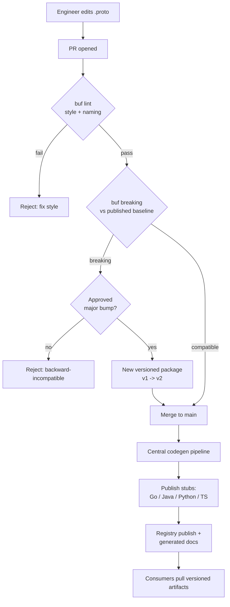
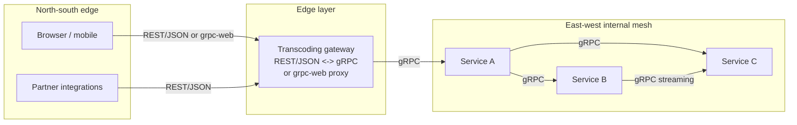

# gRPC and Streaming — Staff

The staff question is not "is gRPC fast?" — it is "what does adopting gRPC as the *default internal contract* cost the organization, who governs the `.proto`, and where does the boundary between internal gRPC and edge REST fall?" gRPC is cheap to prototype and expensive to run as a platform. The winning move is rarely a technology bet; it is the decision to treat the `.proto` as a first-class, versioned, governed artifact — and to be honest with leadership about the debuggability tax you are taking on in exchange for type-safe, polyglot, streaming RPC.

---

## Table of Contents

1. [The org-level thesis](#1-the-org-level-thesis)
2. [The `.proto` as the cross-team contract](#2-the-proto-as-the-cross-team-contract)
3. [Schema registry and the proto monorepo](#3-schema-registry-and-the-proto-monorepo)
4. [Governance: backward-compat CI gates and field-number discipline](#4-governance-backward-compat-ci-gates-and-field-number-discipline)
5. [Codegen as a platform service](#5-codegen-as-a-platform-service)
6. [Internal gRPC vs edge REST](#6-internal-grpc-vs-edge-rest)
7. [The debuggability and tooling tax](#7-the-debuggability-and-tooling-tax)
8. [When to standardize on gRPC vs keep REST](#8-when-to-standardize-on-grpc-vs-keep-rest)
9. [Migration strategy](#9-migration-strategy)
10. [Framing to leadership](#10-framing-to-leadership)
11. [Staff signals](#11-staff-signals)

---

## 1. The org-level thesis

At one or two services, gRPC vs REST is an aesthetic choice. At fifty services owned by twelve teams in five languages, the choice is about **coordination cost**. Three forces make gRPC attractive at that scale:

- **Type-safe polyglot contracts.** A Go service and a Python service agree on wire format without hand-written client SDKs. The `.proto` *is* the SDK.
- **Streaming as a first-class primitive.** Server-streaming, client-streaming, and bidi are native, not bolted on via SSE or WebSocket conventions.
- **Efficiency at fan-out.** Binary Protobuf + HTTP/2 multiplexing measurably lowers CPU and bytes-on-wire for chatty east-west traffic.

But each of these arrives with a governance obligation. A shared contract that anyone can change is a shared *liability*. The value of gRPC is unlocked only when the org invests in the machinery around the `.proto` — registry, linting, compat gates, codegen pipeline. **Staff engineers sell the machinery, not the RPC.** If you adopt gRPC without that investment, you get the debuggability tax with none of the coordination benefit.

---

## 2. The `.proto` as the cross-team contract

Reframe the `.proto` file from "a serialization schema" to "the interface control document between two teams." Once you accept that reframe, several policies follow automatically:

- **The `.proto` is owned, reviewed, and versioned like an API** — because it *is* the API. The producing team owns it; consuming teams have review rights on breaking changes.
- **Generated code is disposable; the `.proto` is the source of truth.** No one hand-edits generated stubs. If a client needs a shape the `.proto` does not express, the fix is a proposal against the `.proto`, not a local patch.
- **Semantics live next to the schema.** Field comments, deprecation notices, and required/optional intent belong in the `.proto` because that is what every consumer reads. Out-of-band docs drift; in-`.proto` docs ship with codegen.

The failure mode this prevents: two teams silently diverging on what field `7` means because there was never a single authoritative definition. When the contract is a governed file, "what does this field mean?" has exactly one answer.

---

## 3. Schema registry and the proto monorepo

There are two dominant topologies for hosting `.proto` files org-wide, and the choice shapes your tooling for years.

| Dimension | Proto monorepo (all `.proto` in one repo) | Distributed + schema registry (e.g. Buf Schema Registry) |
|---|---|---|
| Single source of truth | The repo | The registry module graph |
| Cross-service dependency resolution | Filesystem paths, trivial | Versioned module imports |
| Breaking-change detection | Runs against `main` in-repo | Runs against last published version in registry |
| Team autonomy | Lower — one repo, shared CI | Higher — each team owns its module |
| Discoverability | `grep` the tree | Registry browse/search UI |
| Best fit | Tight org, few languages, strong central platform team | Many teams, partner-facing schemas, polyglot at scale |

Both are legitimate. A monorepo of `.proto` files with a good build (`buf` at the root) gives you atomic cross-service changes and dead-simple dependency resolution — excellent for a cohesive org. A schema registry (Buf's BSR, `buf.build`) gives you versioned modules, hosted docs, and remote codegen — better when teams are numerous, autonomous, or when partners consume schemas. **The wrong answer is neither: hand-copied `.proto` files pasted between repos, which guarantees silent skew.**

Whichever you pick, standardize the *build tool*. `buf` is the de facto choice: it replaces raw `protoc` invocations with a declarative config, gives you linting, breaking-change detection, and a consistent dependency model. Standardizing the tool is worth more than standardizing the topology.

---

## 4. Governance: backward-compat CI gates and field-number discipline

This is the load-bearing section. Governance is what converts "we use gRPC" into "our contracts are safe to evolve."

### The governance flow

### Field-number discipline

The single most important operational rule: **field numbers are permanent identifiers, not positions.** The org-wide policies that flow from this:

- **Never reuse a field number.** A retired field's number is retired forever. Reusing it means an old client decodes new bytes into the wrong field — a silent, type-confused data corruption bug that no test catches.
- **`reserved` retired numbers and names.** When you delete a field, add `reserved 7;` and `reserved "old_name";`. This makes the compiler enforce the rule so humans do not have to remember it.
- **Prefer `optional` / explicit presence over required.** Proto3's "no required" is a feature: it means adding and removing fields is compatible by construction. Governance should discourage patterns that fake requiredness at the schema level.
- **Additive-only within a major version.** New fields get new numbers. Changing a field's type or number is a breaking change and forces a new versioned package.

### What the CI gate actually enforces

`buf breaking` compares the PR's `.proto` against a **baseline** — either the last published module version (registry mode) or `main` (monorepo mode). It fails the build on wire-incompatible changes: type changes, number reuse, deletion of non-`reserved` fields, enum value removal. The gate is non-negotiable and runs before merge. **A breaking change is not blocked by policy alone — it is blocked by the build turning red.** Policy that depends on reviewer vigilance fails at scale; policy encoded in CI does not.

---

## 5. Codegen as a platform service

Polyglot codegen is where the platform-team investment pays off — or where it fragments into chaos. The anti-pattern is every team running its own `protoc` with its own plugin versions and its own generated-code conventions. You end up with six subtly different Go stubs and no one able to reason about the whole.

Treat codegen as a **centrally owned platform service**:

- **One pipeline generates stubs for every supported language** from the merged `.proto`. Languages are a platform decision (which we support), not a per-team decision.
- **Generated artifacts are published to language-native package registries** — Go modules, Maven, PyPI, npm — versioned to match the `.proto` version. Consumers depend on a published artifact, never on running codegen themselves.
- **Plugin and runtime versions are pinned centrally.** A `protoc-gen-go` upgrade is a platform rollout, coordinated and tested, not twelve independent surprises.
- **Remote codegen** (BSR-hosted generation) removes the local toolchain entirely for many teams — they `go get` a generated module and never touch `protoc`.

The staff framing: codegen-as-a-service turns "every team maintains a build toolchain" into "the platform team maintains one." That is a real headcount and reliability argument, and it is the argument that justifies the platform team's existence.

---

## 6. Internal gRPC vs edge REST

The most consequential architectural decision is the **boundary**: gRPC internally, something else at the edge. gRPC is superb for east-west (service-to-service) traffic and weak at the north-south (browser/partner) edge, because browsers cannot speak raw gRPC and partners do not want to.

Three edge strategies, in decreasing order of how much you should default to them:

- **Transcoding gateway (REST/JSON ↔ gRPC).** Annotate the `.proto` with HTTP mappings; a gateway (Envoy's gRPC-JSON transcoder, or grpc-gateway) exposes a REST/JSON facade generated from the same `.proto`. One contract, two surfaces. This is the strong default for external and browser consumers — they get familiar JSON, you keep one source of truth.
- **grpc-web.** Lets browsers speak a gRPC dialect through a proxy. Reasonable when you control the frontend and want typed clients, but it needs a proxy and the ecosystem is thinner than plain REST.
- **Native gRPC at the edge.** Only for partner integrations that explicitly want it and can operate the tooling. Most external consumers cannot and will not.

### Signal comparison

| Signal | Internal (east-west) | Edge (north-south) |
|---|---|---|
| Consumer | Your own services | Browsers, partners, the public |
| Wire format | gRPC / Protobuf | REST / JSON (default) |
| Priority | Efficiency, streaming, type safety | Approachability, curl-ability, broad compatibility |
| Tooling maturity of consumer | High (your platform) | Unknown / low |
| Contract source | `.proto` | `.proto` + HTTP annotations, one truth |
| Streaming | Native bidi | SSE / WebSocket / long-poll fallback |

The rule: **push gRPC as deep into the mesh as you like; do not push it past the edge unless the consumer asked for it.**

---

## 7. The debuggability and tooling tax

Staff engineers must name the cost honestly, because it is real and it is paid daily. Binary Protobuf over HTTP/2 is not human-readable, and that breaks the muscle memory an org has built around HTTP/JSON.

- **No `curl`, no eyeball debugging.** You cannot read a gRPC frame in a packet capture or paste one into a chat. You need `grpcurl` and server reflection — extra tooling every engineer must learn and every service must enable.
- **Observability requires investment.** Standard HTTP access logs, WAFs, and API gateways understand JSON and status codes out of the box; many understand gRPC poorly. Distributed tracing must be wired through gRPC interceptors, and status-code semantics (gRPC codes vs HTTP codes) differ.
- **Browser dev-tools do not decode it.** Frontend engineers lose the network tab as a debugging surface unless you run grpc-web with tooling.
- **Load balancers must be HTTP/2-aware and connection-aware.** gRPC multiplexes many calls over one long-lived connection, which breaks naive L4 load balancing — you need L7 or client-side balancing, another operational skill.

None of these is disqualifying. All of them are line items. The mistake is discovering them *after* rollout. **Budget the tooling tax up front:** mandate server reflection, ship a `grpcurl`-based debugging runbook, standardize interceptors for logging/tracing/metrics, and pick an HTTP/2-aware proxy — before the first service ships, not after the first outage.

---

## 8. When to standardize on gRPC vs keep REST

The staff judgment is knowing that "standardize on gRPC" is a *scope* decision, not a binary. Match the tool to the traffic.

**Lean toward gRPC when:**
- High-volume east-west, service-to-service traffic where CPU and bytes matter.
- Polyglot backend where hand-maintaining client SDKs is a tax.
- Streaming is a genuine requirement (telemetry, feeds, chat, progress), not a nice-to-have.
- You have — or will fund — a platform team to own the registry, codegen, and governance.

**Keep REST when:**
- The consumer is a browser, a partner, or the public internet.
- The surface is low-volume and human-debuggability matters more than efficiency.
- The team is small and cannot absorb the tooling tax without slowing delivery.
- Third-party ecosystems (webhooks, integrations, docs portals) expect JSON.

**The pragmatic org default:** *gRPC internal, REST at the edge, one `.proto` transcoded to both.* This gets the coordination and efficiency benefits where the traffic justifies them and preserves approachability where consumers need it. "gRPC everywhere including the browser" is almost always over-reach; "REST everywhere including hot internal paths" leaves efficiency and type safety on the table.

---

## 9. Migration strategy

You do not migrate an org to gRPC in a big bang. You do it service by service, along dependency edges, with the boundary architecture as the target state.

1. **Establish the platform first.** Registry (or monorepo + `buf`), CI compat gates, and codegen pipeline must exist *before* the first real migration. Migrating onto ungoverned `.proto` files just relocates your chaos.
2. **Start with a high-value internal edge.** Pick one chatty, high-volume service-to-service link where efficiency or streaming clearly pays. Prove the pattern and build the runbooks there.
3. **Introduce the transcoding gateway early.** Even the first gRPC service should be reachable via REST/JSON through the gateway, so no consumer is forced to adopt gRPC tooling on your schedule.
4. **Migrate inward along call graphs.** Convert edges, not whole services at once. A service can accept gRPC from upstream while still calling downstream over REST during transition.
5. **Keep REST facades for external and slow-moving consumers indefinitely.** "Migration" does not mean "delete all REST." It means REST retreats to the edge, where it belongs.
6. **Measure and report.** Track adoption, contract-break-rate caught by CI, and the efficiency wins. The metrics are what keep leadership funding the platform.

---

## 10. Framing to leadership

Leadership does not fund "RPC frameworks." They fund reduced coordination cost, faster integration, and lower infrastructure spend. Translate accordingly:

- **Frame it as a contract-governance investment, not a protocol swap.** "We are making the interface between teams a versioned, machine-checked artifact so that a team can evolve its API without breaking its consumers — and the build, not a reviewer, guarantees it." That is a reliability and velocity story.
- **Name the tax explicitly.** Do not let the debuggability cost surface as a surprise post-incident. "We are trading `curl`-ability for type safety and efficiency; here is the tooling budget that buys back the debuggability." Naming a cost you have already mitigated builds far more credibility than omitting it.
- **Make it a platform-team ROI argument.** "One central codegen pipeline replaces twelve teams each maintaining a build toolchain." That is concrete headcount leverage.
- **Scope it honestly.** "gRPC internally where traffic justifies it, REST at the edge — not gRPC everywhere." Right-scoping signals judgment and pre-empts the "why can't the browser call it directly?" objection.
- **Tie to a metric leadership already tracks.** East-west infra spend, integration lead time, or production incidents from contract breaks — pick the one your org measures and show the delta.

The anti-signal at this level is enthusiasm for the technology. The signal is a clear-eyed cost/benefit with the governance machinery costed in and the boundary drawn deliberately.

---

## 11. Staff signals

- Treats the `.proto` as the governed cross-team contract, and invests in the registry/monorepo + `buf` machinery that makes it safe to evolve.
- Encodes field-number discipline and backward-compat rules in **CI gates**, not in reviewer memory — the build turns red, not a person.
- Owns codegen as a platform service with pinned tool versions and published artifacts, not twelve independent `protoc` invocations.
- Draws the internal-gRPC / edge-REST boundary deliberately and transcodes one `.proto` to both surfaces rather than pushing gRPC to the browser.
- Names the debuggability tax to leadership up front and budgets the tooling that buys it back.
- Scopes adoption to where traffic justifies it and reports adoption/break-rate/efficiency metrics that keep the platform funded.

---

*Next step:* [gRPC and Streaming — Interview](interview.md)
