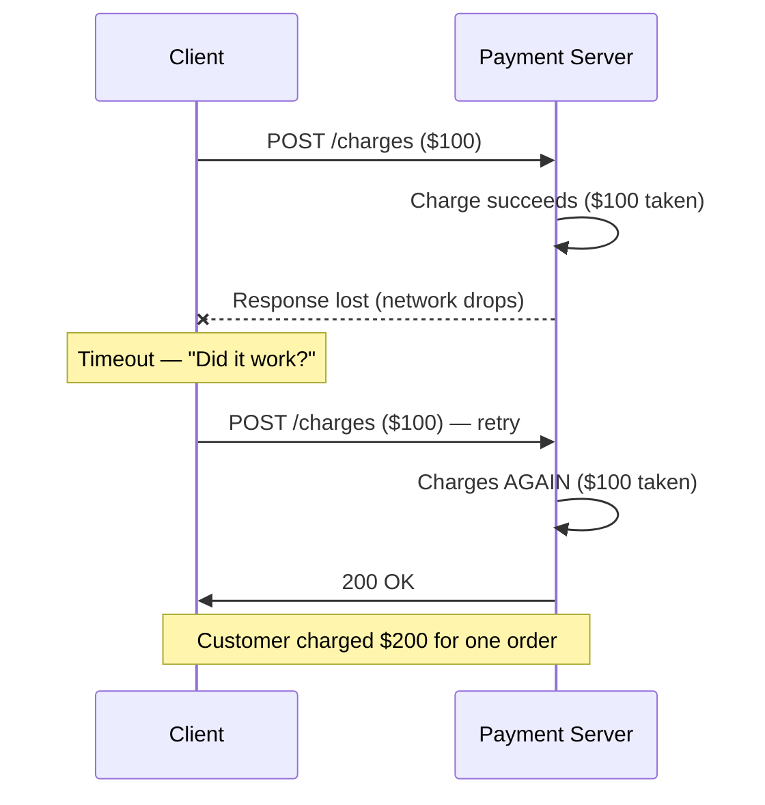
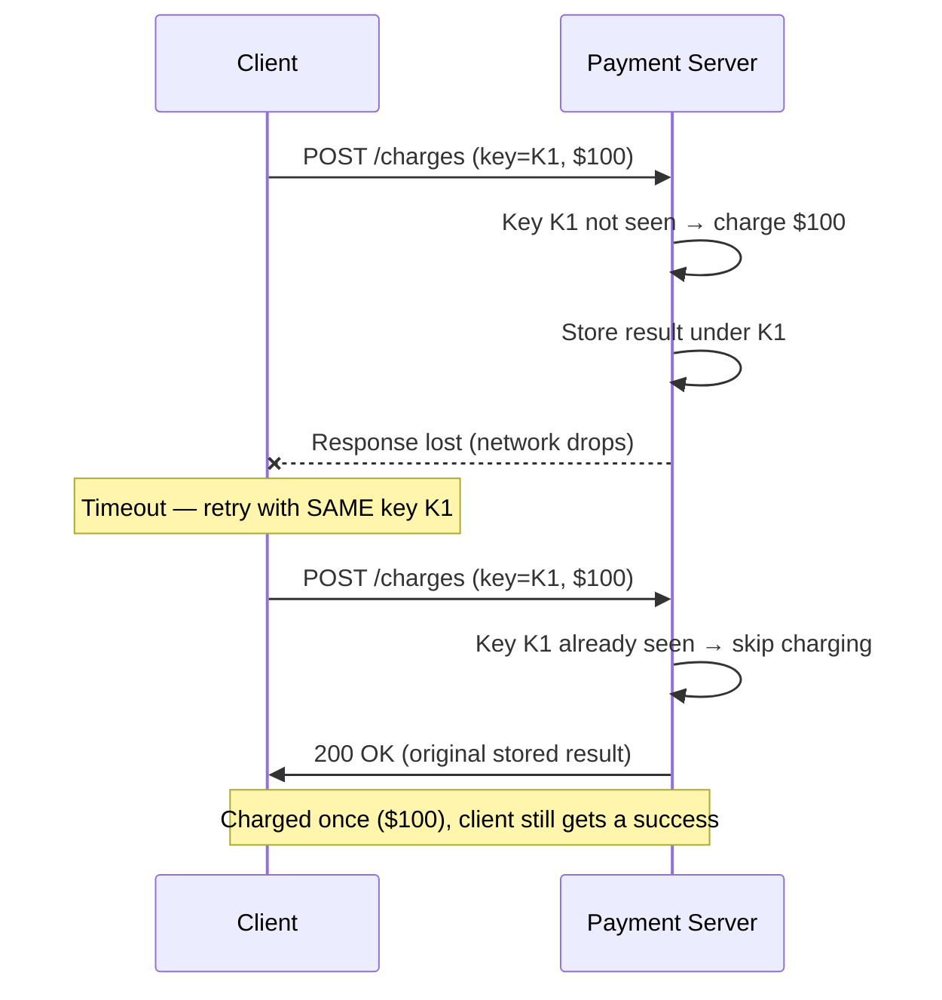

# Idempotency and Retries — Junior

<!-- level-focus -->
At junior level, focus on this question:

> How can I apply **Idempotency and Retries** in one small example and prove the result?

Use the smallest realistic scenario that exposes the decision and its failure behavior.
## 1. What "idempotent" means

An operation is **idempotent** if performing it more than once has the same result as performing it exactly once.

Everyday examples make the idea concrete:

- Pressing a floor button in an elevator twice does not summon two elevators — the floor is either requested or it is not. **Idempotent.**
- Setting your thermostat to 21°C, then setting it to 21°C again, leaves it at 21°C. **Idempotent.**
- Withdrawing $50 from an ATM twice takes out $100. **Not idempotent** — each call changes the balance further.

In an API, "same result" means the same *effect on server state*, not necessarily a byte-for-byte identical response. A retried request should not create a second row, send a second email, or move money a second time.

> Idempotency is a promise about **effects**: no matter how many identical requests arrive, the world changes at most once.

---

## 2. Why retries are necessary

Networks are unreliable. Requests get lost, responses get lost, servers restart, and timeouts fire. A client that gives up on the first hiccup would be fragile, so clients retry.

The hard part is that a **timeout is ambiguous**. When a client's request times out, it does not know which of these happened:

| What the client saw | What actually happened on the server |
|---------------------|--------------------------------------|
| Timeout, no response | Request never arrived — nothing happened |
| Timeout, no response | Request arrived, server crashed before acting — nothing happened |
| Timeout, no response | Request succeeded, but the **response** was lost on the way back |

From the client's side all three look identical: silence. If the client retries, cases 1 and 2 are fine (the work still needs doing), but case 3 is dangerous — the work was already done, and retrying repeats it.

This is why retries and idempotency go together. Retries make the system resilient; idempotency makes those retries **safe**.

---

## 3. The double-charge problem

The classic failure is a payment. A checkout button sends `POST /charges` to charge a customer $100.



The server did nothing wrong on either request — it faithfully processed both `POST`s. The problem is that a plain `POST` has no way to recognize the second request as a *repeat* of the first. Without extra information, the server treats the retry as a brand-new charge.

---

## 4. Which HTTP methods are naturally idempotent

HTTP defines whether a method is expected to be idempotent. This is a specification-level contract (see [RFC 9110, §9.2.2](https://www.rfc-editor.org/rfc/rfc9110#name-idempotent-methods)), not something the framework enforces for you — but well-behaved APIs honor it.

| Method | Idempotent? | Typical use | Why |
|--------|-------------|-------------|-----|
| `GET` | Yes | Read a resource | Reading changes nothing; repeat freely |
| `PUT` | Yes | Replace a resource with a full new value | Setting a resource to value *X* twice leaves it at *X* |
| `DELETE` | Yes | Remove a resource | Deleting an already-deleted resource still leaves it deleted |
| `POST` | **No** | Create a new resource / submit an action | Each call typically creates a *new* thing, so repeats duplicate |

`GET`, `PUT`, and `DELETE` are safe to retry as-is. `POST` is the troublemaker: "charge the card," "place the order," "send the message" — each is meant to happen once, and each retry risks a duplicate. The rest of this topic is really about making `POST`-style operations safe to retry.

> `PUT` is idempotent because it says *"make the resource equal to this."* `POST` is not, because it says *"do this action / create a new item."* Two `PUT`s of the same body converge; two `POST`s stack up.

See MDN's overview of [idempotent methods](https://developer.mozilla.org/en-US/docs/Glossary/Idempotent) for a fuller list.

---

## 5. Idempotency keys

We cannot make `POST` idempotent by wishing it so — but we can add a mechanism. The standard trick is an **idempotency key**.

The idea:

1. Before sending, the **client** generates a unique key for this specific operation — usually a random UUID such as `a1b2c3d4-...`. This one key belongs to one logical action ("this checkout"), and the client reuses the *same* key on every retry of that action.
2. The client sends the key alongside the request, commonly in a header:

   ```http
   POST /charges HTTP/1.1
   Idempotency-Key: a1b2c3d4-e5f6-7890-abcd-ef1234567890
   Content-Type: application/json

   { "amount": 100, "currency": "USD" }
   ```

3. The **server** remembers keys it has already processed. When a request arrives:
   - **New key** → do the work, store the result under that key, return it.
   - **Seen key** → skip the work, return the *stored* result from the first time.

The key turns "is this a duplicate?" from an unanswerable question into a simple lookup. The client's job is small: generate one key per action and resend it on retry. The server's job is to deduplicate.

---

## 6. How a key stops a double effect

Replaying the double-charge scenario, this time with an idempotency key:



The second request carries the same `K1`. The server recognizes it, does **not** charge again, and returns the result it saved the first time. The customer is charged exactly once, and the client still receives the success response it needed. Retry safety achieved.

---

## 7. Key takeaways

- **Idempotent** = applying an operation once or many times has the same effect.
- **Retries are necessary** because networks fail and timeouts are ambiguous — the client often cannot tell whether its request succeeded.
- The dangerous case is a **lost response**: the work was done, but the client thinks it failed and retries.
- `GET`, `PUT`, `DELETE` are **naturally idempotent** and safe to retry. `POST` is **not**.
- An **idempotency key** makes `POST`-style operations safe: the client sends a unique key (reused across retries), and the server deduplicates — doing the work once and returning the stored result for any repeat.

*Next step:* [Idempotency and Retries — Middle](middle.md)

---

## Apply it

1. Choose one small, known input for **Idempotency and Retries**.
2. Predict the output or observable behavior.
3. Run the smallest example or probe that exercises the concept.
4. Change one input to trigger a failure or boundary case.
5. Explain the evidence using the guide's vocabulary.

## Verify your work

- Record the exact input, command or code path, and output.
- Repeat the probe and confirm the result is consistent.
- Show one expected success and one expected failure.
- Resolve any difference between the prediction and the evidence.

## Review questions

- What problem does Idempotency and Retries solve in the example?
- Which input changes the observed result, and why?
- What is the smallest useful success check?
- Which beginner mistake would your evidence catch?
