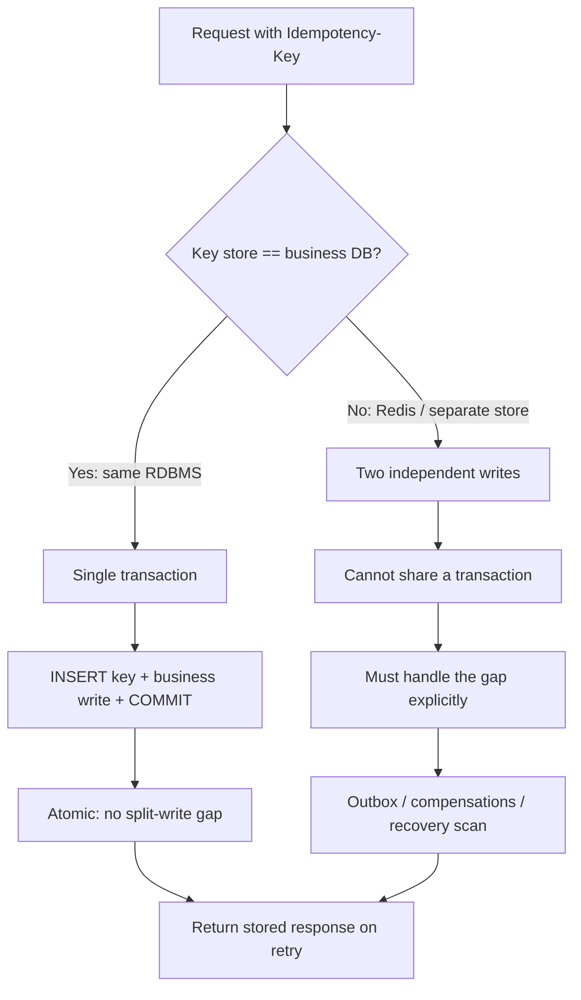
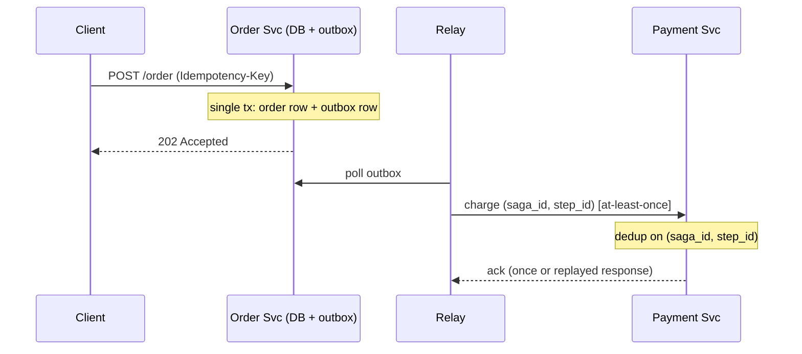
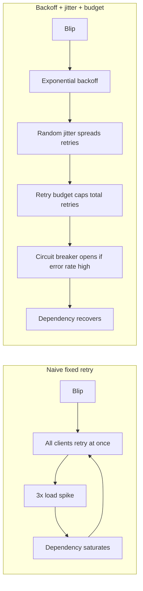

# Idempotency and Retries — Senior

<!-- level-focus -->
At senior level, focus on this question:

> Which system invariant is affected by **Idempotency and Retries** under failure, load, and change?

Use the smallest realistic scenario that exposes the decision and its failure behavior.
## 1. The core failure mode: key stored, work not done

The single most common idempotency bug is a **split write**: the system records the idempotency key in one place and performs the business effect in another, and a crash lands in the gap between them.

There are two symmetric failures:

- **Key stored, work not done.** You persist the key first, then crash before the charge. The retry sees the key, assumes "already handled," and returns success. The customer was never charged. Silent data loss.
- **Work done, key not stored.** You perform the charge first, then crash before recording the key. The retry sees no key and charges again. Double charge.

The only robust fix is to make **the key write and the business write commit or roll back together** — one atomic unit. If they are in the same relational transaction, the "gap" ceases to exist: either both are durable or neither is.

```sql
BEGIN;
  INSERT INTO idempotency_keys (key, request_hash, status)
  VALUES ($1, $2, 'in_progress');   -- fails on duplicate key → concurrent retry
  INSERT INTO payments (id, amount, ...) VALUES (...);
  UPDATE idempotency_keys SET status='done', response=$3 WHERE key=$1;
COMMIT;
```

If the key table and the business table live in different datastores, you no longer have one transaction — you have a distributed commit problem, and you must fall back on the outbox/saga techniques in [section 5](#5-idempotency-across-distributed-writes-and-sagas).

---

## 2. Where to store the key: Redis vs the transactional DB

The storage choice is dominated by one property: **can the key write be atomic with the business write?**



| Dimension | Idempotency key in the transactional DB | Idempotency key in Redis |
| --- | --- | --- |
| Atomicity with business write | Native — same transaction | Impossible — separate systems |
| Split-write risk | Eliminated | Must be engineered around |
| Latency of the check | One extra row read/insert | Sub-millisecond |
| TTL / expiry | Manual (cron, partitioning) | Native `EX`, easy |
| Durability | Strong (WAL, replication) | Weaker unless AOF `fsync`+replication tuned |
| Best used as | Source of truth | Fast pre-check / lock, not the source of truth |

**Recommended pattern.** Use the transactional DB as the *source of truth* for the key (co-located with the business data so it commits atomically). Optionally put a Redis check *in front* as a cheap fast-path to short-circuit obvious duplicates and to hold a short-lived lock that serializes concurrent retries of the same key. Never let Redis be the only record — a Redis eviction or restart must not turn into a double charge.

**Concurrency within the same key.** Two retries can arrive simultaneously (client timed out and retried while the first is still in flight). Handle it with a unique constraint on the key plus a status field: the first inserter wins `in_progress`; the second either blocks on the row lock, or gets a duplicate-key error and returns `409 Conflict` (request still processing) so the client backs off rather than racing.

---

## 3. Natural idempotency vs bolt-on keys

The cheapest idempotency is the kind you never have to bolt on. If the operation is *inherently* repeat-safe, retries are free and you carry no key-storage machinery.

| | Natural idempotency | Bolt-on idempotency key |
| --- | --- | --- |
| Mechanism | Operation semantics (upsert by business key, `PUT`, set-absolute-value) | Client-supplied key + server-side dedup store |
| Example | `PUT /accounts/42 {email}`; `UPDATE balance SET x=100` | `POST /charges` with `Idempotency-Key: uuid` |
| Storage cost | None | A dedup table + TTL + cleanup |
| Repeat safety | Guaranteed by design | Guaranteed only while the key is retained |
| Where it breaks | Relative/cumulative effects (`balance += 10`) | Key expired, lost, or reused with a different body |
| Design effort | Model the operation as a *state assertion* | Add key plumbing to every write endpoint |

**Design rules of thumb:**

- Prefer **absolute over relative** effects. `set_status = 'shipped'` is idempotent; `increment_shipped_count` is not.
- Prefer **upsert by a business-meaningful key** over blind insert. A transfer keyed on `(source, dest, client_ref)` naturally collapses duplicates.
- Reserve **bolt-on keys for genuinely non-idempotent creates** — charging a card, sending an email, minting a resource — where you cannot express the effect as a state assertion.
- When you do use a key, **bind it to the request body hash**. If the same key arrives with a *different* payload, that is a client bug — reject with `422`, don't silently replay the old response.

---

## 4. Exactly-once is a myth: effectively-once

Over an unreliable network you cannot achieve exactly-once *delivery*. The sender never learns whether a lost acknowledgment means "message lost" or "response lost," so it must either risk zero deliveries (at-most-once) or risk duplicates (at-least-once). There is no third option at the transport layer.

What you *can* build is **effectively-once processing** = at-least-once delivery + an idempotent consumer. The network delivers duplicates freely; the consumer deduplicates so the *observable effect* happens once.

| Claim | Reality |
| --- | --- |
| Exactly-once delivery | Impossible over an unreliable channel (the Two Generals problem) |
| At-most-once | Send once, never retry → messages silently lost on failure |
| At-least-once | Retry until acked → duplicates guaranteed on ack loss |
| Effectively-once (the achievable goal) | At-least-once delivery + idempotent consumer → effect applied once |

The senior insight: **push all correctness into the consumer's idempotency, and make delivery aggressively at-least-once.** Don't chase transport-level "exactly-once" flags; they are almost always exactly-once *within one broker's boundary* and evaporate the moment the effect crosses into your database or a third-party API.

---

## 5. Idempotency across distributed writes and sagas

Single-transaction atomicity ([section 1](#1-the-core-failure-mode-key-stored-work-not-done)) evaporates when the business effect spans services. A retried saga must not re-run steps that already committed.

Two complementary techniques:

- **Transactional outbox.** Write the business row and an "event to publish" row in the *same* local transaction. A separate relay reads the outbox and publishes at-least-once. This makes the *decision to publish* atomic with the write, closing the split-write gap even though publishing itself is async.
- **Idempotent saga steps.** Every step and every compensation must be individually idempotent and keyed (e.g. by `saga_id + step_id`). On retry, a step that finds its own effect already recorded returns success without repeating. Compensations must tolerate being run against a step that never actually applied (retry may have failed before the effect), so they too must be idempotent.



The key takeaway: across services, **idempotency keys become the join key for deduplication at every hop**, and the outbox is what preserves atomicity where a shared transaction is no longer available.

---

## 6. The retry storm and how to survive it

Retries are a load multiplier. When a dependency slows down, every caller retries, the retries pile onto the already-struggling dependency, and the whole system enters a self-sustaining **retry storm / thundering herd**. This is how a brief blip becomes a full outage.



The defenses, layered:

- **Exponential backoff.** Space retries out geometrically (e.g. 200ms, 400ms, 800ms) so a struggling dependency gets breathing room.
- **Jitter.** Add randomness to the delay. Without jitter, all clients that failed at the same instant retry at the same instant — synchronized waves. Full jitter (`random(0, backoff)`) is the standard fix.
- **Retry budgets.** Cap retries as a fraction of total requests (e.g. retries may not exceed 10% of the request rate). This bounds the *maximum* amplification no matter how many callers fail. Far safer than a per-request retry count alone.
- **Circuit breakers.** Once error rate crosses a threshold, stop calling the dependency entirely for a cooldown, fail fast, then probe with a trickle before reopening. This converts a storm into an immediate, cheap failure.
- **Load shedding on the server.** The receiving service should shed excess load *early* (reject at the edge before doing work) rather than degrade for everyone.
- **`429 Too Many Requests` + `Retry-After`.** The server tells the client *when* to come back. A well-behaved client honors `Retry-After` instead of hammering. This is cooperative flow control — the server's only lever to shape client retry timing.

Retry only what is safe: retry on `408/429/5xx` and network timeouts, **never** on `4xx` other than `429` (a `400` will fail identically forever). And only retry **idempotent** operations blindly — for non-idempotent ones, the idempotency key from earlier sections is what makes the retry safe.

---

## 7. Client vs server responsibilities

Idempotency is a contract, and both sides own part of it.

| Responsibility | Client | Server |
| --- | --- | --- |
| Generate a stable idempotency key | Yes — same key for the same logical operation across retries | — |
| Persist the key across process restarts | Yes — a key that changes on retry is useless | — |
| Backoff, jitter, retry budget | Yes | — |
| Honor `Retry-After` / `429` | Yes | Emits it |
| Deduplicate by key | — | Yes — atomic with the write |
| Bind key to request body | Sends consistent body | Rejects key reuse with a different body (`422`) |
| Define key retention window | Aware of it | Yes — TTL, and reject keys past it |
| Return the *stored* response on replay | — | Yes — same status and body as the original |

A frequent senior-level mistake is assuming the server's idempotency alone is enough. If the *client* generates a fresh key on each retry, the server sees distinct requests and the whole scheme collapses. The key must be generated **once, before the first attempt,** and reused for every retry of that same intent.

---

## 8. Poison messages, dead-letter, and ordering

**Poison messages.** An at-least-once queue will redeliver a message that *always* fails (malformed payload, a bug, a permanently-missing dependency). Without a limit, it redelivers forever, blocking the queue and burning capacity. The fix is a **retry count + dead-letter queue (DLQ)**: after N failed deliveries, route the message to a DLQ for out-of-band inspection instead of retrying indefinitely. The DLQ is your poison-message quarantine and your incident-forensics record.

**Ordering vs idempotency — they are different guarantees.** Idempotency says "applying this twice equals applying it once." It says nothing about *sequence*. If order matters (e.g. `create` must precede `update`), idempotency alone won't save you: an at-least-once system can deliver `update` before `create`, or replay an old `update` after a newer one.

- Idempotency protects against **duplicates**.
- Ordering protects against **reordering**.

To get both, add a **monotonic version/sequence number** to each message and have the consumer reject or ignore any message whose version is older than what it has already applied (last-writer-wins by version). This makes each apply both idempotent *and* order-tolerant: replays and out-of-order arrivals are discarded, and only forward progress is accepted. Note that strict global ordering usually costs you parallelism (single-partition, single-consumer), so scope ordering to a partition key (e.g. per-account) rather than demanding it globally.

---

## 9. Senior checklist

- The idempotency key write is **atomic** with the business write (same transaction, or outbox if cross-service).
- The transactional DB — not Redis alone — is the **source of truth** for keys.
- Operations are made **naturally idempotent** wherever possible; bolt-on keys are reserved for true non-idempotent creates.
- Keys are **bound to the request body**; reuse with a different body is rejected.
- You target **effectively-once** (at-least-once + idempotent consumer), not mythical exactly-once.
- Retries use **exponential backoff + jitter**, are governed by a **retry budget**, and only fire on retryable status codes.
- **Circuit breakers** and **load shedding** cap the blast radius; the server emits `429` + `Retry-After`.
- Poison messages hit a **DLQ** after a bounded retry count.
- Where sequence matters, ordering is handled **separately** from idempotency via monotonic versions.

*Next step:* [Idempotency and Retries — Professional](professional.md)

---

## Apply it

1. State the system invariant that **Idempotency and Retries** must protect.
2. Mark ownership, state, and failure propagation at each boundary.
3. Compare two designs under load, dependency failure, and future change.
4. Define recovery and compatibility behavior before implementation.
5. Test the riskiest assumption with a focused experiment.

## Verify your work

- The experiment supports the design with evidence, not preference.
- Failure injection shows the blast radius and recovery path.
- Compatibility checks cover old and new callers or data.
- Operational signals reveal invariant violations and recovery progress.

## Review questions

- Which invariant must remain true when Idempotency and Retries fails?
- Where should recovery responsibility live, and why?
- Which assumption deserves an experiment before implementation?
- How can the design evolve without changing every consumer at once?
