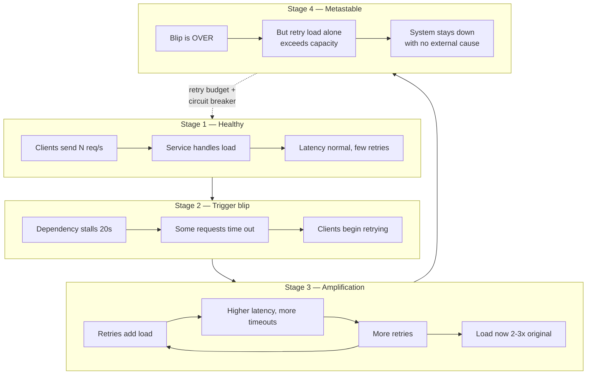

# Idempotency and Retries — Staff

At staff scale, idempotency and retries stop being a coding technique and become a **fleet property**. The question is no longer "does *this* endpoint dedupe correctly?" but "can I guarantee that no team in the org ships a money-moving endpoint that double-charges, and that a 30-second dependency blip does not turn into a 4-hour self-inflicted outage because 800 pods all retried in lockstep?" Those two failure modes — silent duplicate side effects and coordinated retry storms — are the two things a staff engineer owns here. Both are prevented by *defaults and governance*, not by asking each team to be careful.

## Contents

1. [The two org-wide failure modes](#1-the-two-org-wide-failure-modes)
2. [Platform-owned vs team-owned retry](#2-platform-owned-vs-team-owned-retry)
3. [The metastable retry-storm loop](#3-the-metastable-retry-storm-loop)
4. [Retry budgets and circuit breakers as fleet policy](#4-retry-budgets-and-circuit-breakers-as-fleet-policy)
5. [Making idempotency a review-gate](#5-making-idempotency-a-review-gate)
6. [The cost of not standardizing](#6-the-cost-of-not-standardizing)
7. [Observability: retry-rate and amplification](#7-observability-retry-rate-and-amplification)
8. [Client SDKs owning retry](#8-client-sdks-owning-retry)
9. [Framing the retry outage to leadership](#9-framing-the-retry-outage-to-leadership)
10. [Idempotency as a partner contract](#10-idempotency-as-a-partner-contract)
11. [Staff judgment checklist](#11-staff-judgment-checklist)

---

## 1. The two org-wide failure modes

Everything below serves one of two goals. Keep them separate in your head — they have different owners, different blast radii, and different fixes.

| | Duplicate side effect | Retry storm / metastability |
|---|---|---|
| **Symptom** | A customer is charged twice; an order ships twice; a webhook fires twice | A brief dependency blip becomes a sustained fleet-wide outage that outlives the trigger |
| **Root cause** | A side-effecting endpoint is not idempotent; a retry replayed a write | Uncoordinated retries multiply load exactly when the system is weakest |
| **Blast radius** | One customer, one transaction — but thousands of times across the fleet | The entire dependency and everything upstream of it |
| **Fix owner** | Endpoint author + review-gate | Platform / shared client library |
| **Prevention** | Mandatory idempotency keys on side-effecting endpoints | Retry budgets, backoff+jitter, circuit breakers as defaults |
| **When it bites** | Steady state, silently, for months | Suddenly, during an incident, catastrophically |

The trap is treating these as one problem. "We added idempotency keys" does nothing for retry storms. "We added exponential backoff" does nothing for double-charges. A staff engineer must drive **both** as platform defaults.

---

## 2. Platform-owned vs team-owned retry

The single highest-leverage decision is *who owns retry logic*. If every team writes its own, you will have as many subtly-wrong retry loops as you have teams — and the failures compound, because they all hit the same shared dependencies.

| Dimension | Team-owned (per-service, hand-rolled) | Platform-owned (shared middleware/SDK) |
|---|---|---|
| Backoff correctness | Varies; often fixed-delay, no jitter | Exponential + full jitter, tuned once |
| Retry budget | Usually none — retries unbounded | Enforced budget (e.g. ≤10% of requests) |
| Idempotency-Key header | Ad hoc name, or missing | Standard header, auto-generated |
| Retryable-error classification | Each team re-decides (often retries 400s) | Central, correct (retry 429/503/timeout only) |
| Circuit breaking | Rare | Built-in, shared trip state |
| Change velocity | N teams must each fix a bug | Fix once, roll out fleet-wide |
| Observability | Inconsistent or absent | Uniform retry metrics for free |
| Failure correlation | Uncorrelated, unmeasurable | Coordinated, deliberately jittered |

The staff move is to make the *correct* path the *easy* path: a shared HTTP client (or service-mesh sidecar) where retries, backoff, jitter, budgets, and the `Idempotency-Key` header are on by default and hard to disable. Teams should have to write code to be *wrong*, not to be right. "Every team reinvents retry" is not a productivity problem — it is a reliability liability, because their bugs share your dependencies.

---

## 3. The metastable retry-storm loop

A metastable failure is one where the *trigger* is gone but the system stays down because a feedback loop now sustains it. Uncoordinated retries are the classic engine. The staged diagram below shows how a transient blip crosses into a self-sustaining outage.

The critical insight for leadership and for design: in Stage 4 the *original cause has vanished*. Restarting the dependency does not help, because the sustained load is now retries. The only exits are (a) shed the retry load — retry budgets and circuit breakers — or (b) drop request volume hard (load shedding). Backoff+jitter alone reduces the *slope* of Stage 3 but a budget-less fleet can still reach Stage 4. This is why jitter is necessary but not sufficient, and why a retry budget is the load-bearing control.

---

## 4. Retry budgets and circuit breakers as fleet policy

Three controls, applied *as fleet defaults*, keep the loop from closing:

- **Exponential backoff with full jitter.** Fixed delays synchronize the fleet — every client retries at the same instant, producing thundering herds. Full jitter (`sleep = random(0, base * 2^attempt)`) spreads retries across the window and is the single cheapest storm dampener. Mandate it in the shared client; do not let teams pick "retry after 1s."
- **Retry budgets.** Cap retries as a *fraction* of total requests (e.g. a service may spend at most 10-20% of its request volume on retries in any window). When the budget is exhausted, additional failures fail fast instead of retrying. This is what actually breaks the Stage-3 loop: it bounds amplification no matter how bad the dependency gets. A budget is strictly better than a per-request retry cap because it is a *fleet-level* control, not a per-caller one.
- **Circuit breakers.** When a downstream is failing past a threshold, trip open and stop sending — give it room to recover instead of pounding it. Breakers convert "retry forever" into "back off entirely," which is the correct behavior during a metastable event.

Policy, not suggestion: these must be **on by default** in the platform client and require an explicit, reviewed exception to disable. A retry budget that any team can silently set to infinity is not a policy. Treat the default budget, the jitter formula, and the breaker thresholds as governed platform config, versioned and owned centrally.

---

## 5. Making idempotency a review-gate

For the duplicate-side-effect failure mode, the governance lever is a **mandatory review gate**: no endpoint that moves money or creates externally-visible side effects ships without idempotency.

Endpoints that MUST be idempotent (gate blocks the merge otherwise):

| Endpoint class | Why it must be idempotent | Mechanism |
|---|---|---|
| Payments / charges | Double-charge is a customer-trust and regulatory event | Server-stored `Idempotency-Key` → dedupe |
| Order / booking creation | Duplicate orders, double inventory decrement | Idempotency key or natural unique key |
| Fund transfers / payouts | Money leaves twice | Key + ledger-level dedupe |
| Outbound webhooks | Partners receive events twice | Event ID + at-least-once + partner-side dedupe |
| Account / entitlement mutation | Duplicate grants, billing drift | Key or conditional (compare-and-set) update |
| Email/SMS side effects | Duplicate notifications, spam complaints | Dedupe key on the send |

Naturally-idempotent operations (`PUT` replace, `DELETE`, pure reads) satisfy the gate for free — the point is not to bolt keys onto everything, but to ensure *non-idempotent side effects* are provably safe to repeat. Encode the gate mechanically: a CI check or API-linter rule that flags any `POST`/side-effecting route on the money/orders surface lacking a declared idempotency strategy, plus a human sign-off in the design review. Governance that lives only in a wiki page is not a gate.

---

## 6. The cost of not standardizing

Make the counterfactual concrete when you argue for the platform investment. Without standardization, each team independently:

- Picks a different (or no) idempotency-key header, so cross-service and partner integrations can't dedupe uniformly.
- Writes a retry loop that retries non-idempotent `POST`s — the exact combination that produces double-charges.
- Ships fixed-delay retries with no budget — a latent retry storm waiting for a bad day.
- Gets the retryable-error set wrong (retries a `400`, gives up on a `429`).

The cost is not hypothetical. It is *one subtle double-charge bug per team per year*, each surfacing as a support escalation, a refund, a trust hit, and — for payments — potential regulatory attention. Multiply by team count and time. The platform library is cheaper than the aggregate of those bugs, and far cheaper than one retry-storm outage. Frame the investment as **buying out a recurring tax**, not as a nice-to-have.

---

## 7. Observability: retry-rate and amplification

You cannot govern what you cannot see. Uniform, platform-emitted metrics turn retries from an invisible risk into a monitored signal:

- **Retry rate** per service/dependency — retries as a fraction of total requests. This is the leading indicator of a forming storm; it climbs before latency does.
- **Amplification factor** — outbound requests to a dependency ÷ inbound requests that triggered them. A factor > 1 that trends upward *is* the Stage-3 loop, measured directly.
- **Retry-budget exhaustion** events — how often the budget kicks in. Frequent exhaustion means a dependency is genuinely unhealthy *or* a threshold is misconfigured.
- **Idempotency-key hit rate** — how often the dedupe store returns a cached result. A spike means clients are retrying heavily; a near-zero rate on a payments endpoint means the key path may be broken (a silent correctness risk).

Alarm on *amplification*, not just on error rate — amplification catches the storm while it is still recoverable. A retry-rate dashboard visible to every on-call, plus an "amplification > threshold" page, is the observability floor for a fleet that retries.

---

## 8. Client SDKs owning retry

Whenever *your* platform is the thing being called — internal clients or external partners — the most reliable way to make retries correct is to **own the client**. If teams and partners hand-write retry loops, you inherit every mistake as load on your servers.

A well-owned SDK:

- Generates and attaches the standard `Idempotency-Key` automatically, so a retried request is always dedupe-able.
- Retries only idempotent/declared-safe operations, with exponential backoff + full jitter baked in.
- Respects `Retry-After` and honors server-side backpressure (`429`/`503`) instead of hammering.
- Carries a client-side retry budget so a single misbehaving client can't storm your fleet.

The design principle: **make it impossible for the caller to retry incorrectly.** The SDK is where "every team can't get it wrong" actually becomes true — teams can't reinvent the retry loop if they never write one. This is a stronger guarantee than documentation, and for external partners it is often the *only* control you have over their retry behavior.

---

## 9. Framing the retry outage to leadership

When retries cause an outage, leadership's instinct is "the dependency failed." The staff engineer's job is to reframe: **the dependency blipped; our retry behavior turned the blip into an outage.** That reframing changes the fix.

A leadership-grade explanation:

> "A downstream service was slow for 20 seconds. Normally that is invisible. But because our services retry aggressively and without coordination, the retries multiplied load 3x at the exact moment the system was weakest. That kept the system overloaded *after* the downstream recovered — the outage outlived its cause by hours. This is a known failure class called metastable failure. The fix is not 'make the downstream never blip' — that is impossible. The fix is capping how much of our traffic can be retries (retry budgets) and stopping calls to a failing service entirely (circuit breakers), so a blip stays a blip."

Two things this framing buys you: (1) it moves the org off the unwinnable goal of zero dependency failures and onto the winnable goal of *bounded amplification*; (2) it justifies platform investment in shared retry infrastructure as outage-prevention, which leadership funds, rather than as tech debt, which they defer. Name the failure class — "metastable" — because a named, recognized pattern gets a budget.

---

## 10. Idempotency as a partner contract

With external partners, idempotency is not an implementation detail — it is a **correctness contract you publish and honor**. Partners will retry (their network, their timeouts, their bugs are outside your control), so the contract is what protects both sides from duplicates.

The contract terms a staff engineer defines:

- **The header.** A single, documented `Idempotency-Key` header, its format (opaque, client-generated, e.g. a UUID), and the requirement that partners send one on all side-effecting calls.
- **The guarantee.** "The same key returns the same result and the operation executes at most once," including the retention window (how long keys are remembered) and behavior after expiry.
- **Conflict semantics.** What happens when the same key arrives with a *different* payload — reject with a clear error, never silently execute.
- **In-flight handling.** What a retry sees while the original is still processing — a defined "in progress" response, not a second execution.

Publishing this contract lets partners build correct retry logic against you, and lets *you* absorb their inevitable retries safely. For payments and similar surfaces, this contract is effectively a compliance boundary: it is the written promise that a partner's retry cannot cause a double charge. Treat it with the same rigor as an API version guarantee — breaking it silently is a trust-destroying event.

---

## 11. Staff judgment checklist

- Are retries, backoff+jitter, budgets, and the `Idempotency-Key` header **defaults** in a shared client/middleware — not per-team reinventions?
- Is there a **review-gate** (mechanical + human) blocking any money/side-effecting endpoint that isn't provably safe to repeat?
- Do you have a **retry budget** and **circuit breakers** as governed fleet policy, so a blip can't go metastable?
- Do dashboards show **retry rate** and **amplification factor**, with a page on amplification, not just error rate?
- Do your **client SDKs** make it impossible for internal callers and partners to retry incorrectly?
- Can you **explain a retry-caused outage to leadership** as a metastable-amplification problem with a bounded-amplification fix — and get the platform work funded?
- Is idempotency published as a **written partner contract** with retention, conflict, and in-flight semantics — treated as a correctness/compliance boundary?

If the answer to any of these is "each team handles it themselves," that is the gap to close. At staff scale, correct-by-default beats careful-by-request every time.

*Next step:* [Idempotency and Retries — Interview](interview.md)