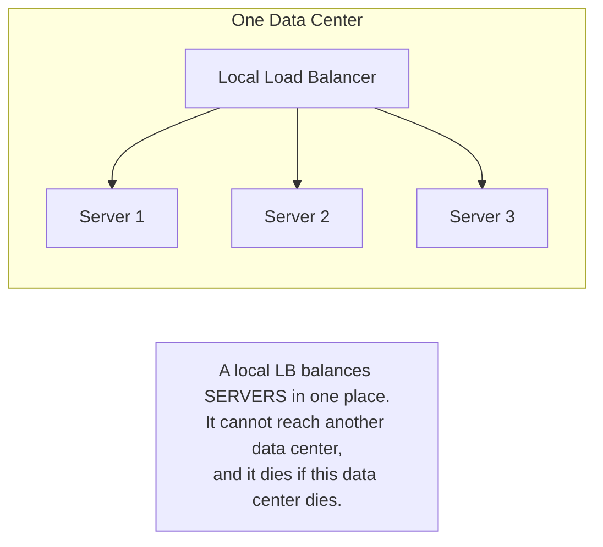
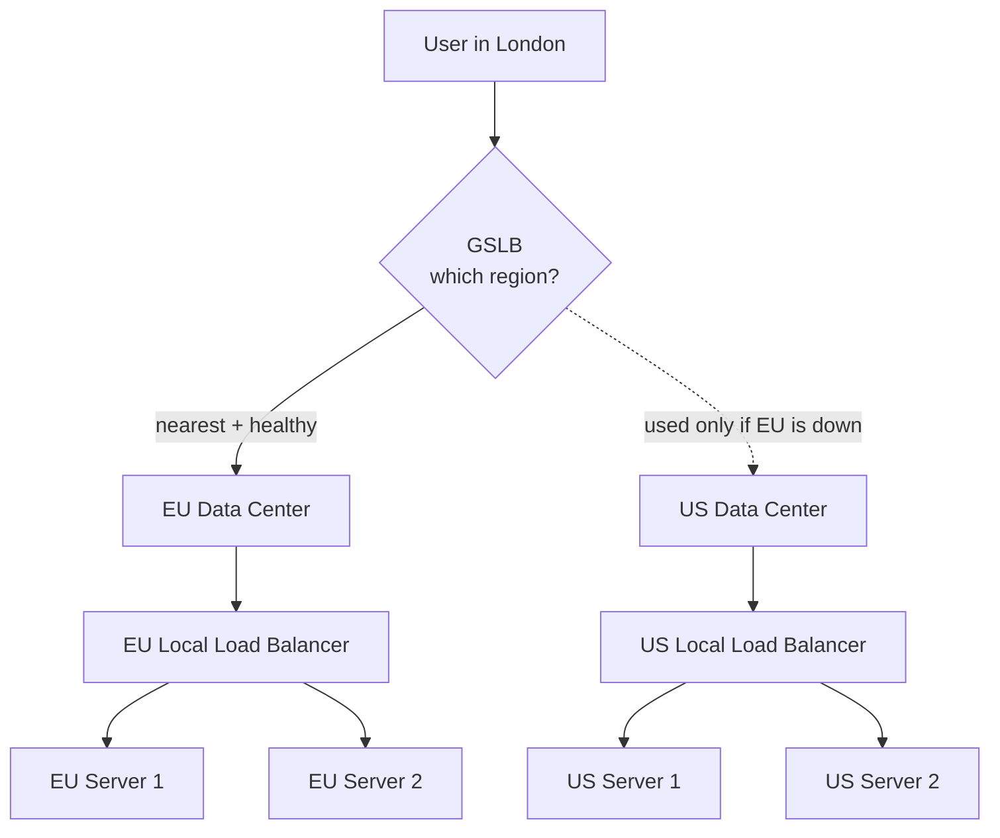
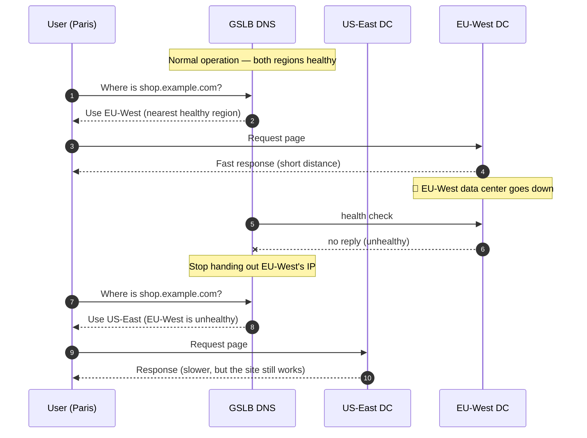

# Global Server Load Balancing — Junior

<!-- level-focus -->
At junior level, focus on this question:

> How can I apply **Global Server Load Balancing** in one small example and prove the result?

Use the smallest realistic scenario that exposes the decision and its failure behavior.
## 1. What Is It?

**Global Server Load Balancing (GSLB)** is load balancing across whole **data centers and
regions** instead of across servers in one place. Its job is to look at a user, decide which
region should serve them, and send them there — while quietly steering everyone *away* from a
region that is down or overloaded.

You have already used this without knowing. When you open Netflix, Instagram, or your bank's
app, you are not talking to "the server." You are talking to whichever of the company's many
data centers is closest and healthiest for you. A user in São Paulo and a user in Frankfurt
type the same domain name and get answers from two different continents. The thing that made
that decision is GSLB.

The name is a little misleading: GSLB does not usually balance individual *servers* at all.
It balances **locations**. Inside each location, an ordinary local load balancer (§8.1–§8.6)
still spreads traffic across the actual machines. GSLB is the layer *above* that.

## 2. The Problem a Normal Load Balancer Cannot Solve

A normal (local) load balancer lives inside **one** data center. It sits in front of a pool
of app servers and spreads requests across them: server 1, server 2, server 3, round and
round. It is excellent at this. But it has two hard limits:

1. **It cannot help with distance.** If all your servers are in Virginia and a user is in
   Tokyo, every request crosses an ocean — roughly 150+ ms each way — no matter how the local
   LB balances them. Balancing three servers in Virginia does nothing for the Tokyo user's
   latency.

2. **It cannot survive its own data center dying.** If the whole Virginia site loses power,
   the local load balancer goes down *with it*. It cannot redirect traffic to a site it is not
   part of — it does not even know other sites exist.

To fix both, you need something that sits **outside and above** any single data center, sees
all of them, and decides which one each user should reach. That is GSLB.

## 3. The Mental Model: One Level Up

Think of it as the exact same idea as a normal load balancer, applied one level higher.

- A **local load balancer** answers: *"Which server in this room handles this request?"*
- A **global load balancer (GSLB)** answers: *"Which room (data center) should this user go to
  at all?"*

The two work as a stack, not as competitors:

The GSLB picks the **region**. Once the user arrives, the region's **local LB** picks the
**server**. Neither replaces the other — you need both to run a global service.

## 4. How Users Actually Get Sent to a Region (DNS and Anycast)

The natural next question: a local LB can physically forward a packet because the servers are
right next to it. But a global LB is not standing between a Tokyo user and a Virginia server.
So *how* does it steer people?

There are two common mechanisms, and at this level you only need the shape of each.

**Mechanism A — Smart DNS (the most common).**
Every request starts by turning a domain name into an IP address ("what is the address for
`shop.example.com`?"). GSLB hijacks *that* step. Instead of always returning the same IP, the
GSLB's DNS looks at *where the question came from* and answers with the IP of the best region:

- A DNS query arriving from Europe → answer with the **EU** data center's IP.
- A DNS query arriving from North America → answer with the **US** data center's IP.
- If the EU data center is failing its health check → stop handing out the EU IP entirely;
  answer everyone with the US IP instead.

The user's browser then connects straight to whatever IP it was given. GSLB never touches the
actual traffic — it just controls *which door the user is told to walk through*.

**Mechanism B — Anycast.**
Here, multiple data centers **advertise the same IP address** to the internet. The internet's
own routing then delivers each user to the topologically nearest one automatically. If a region
withdraws its advertisement (because it went down), traffic re-routes to the next-nearest region
without the user doing anything. Anycast is common for CDNs and DNS itself.

> 🎞️ **See it explained:** [What is GSLB? (Cloudflare Learning)](https://www.cloudflare.com/learning/cdn/glossary/global-server-load-balancing-gslb/) · [What is Anycast? (Cloudflare Learning)](https://www.cloudflare.com/learning/cdn/glossary/anycast-network/)

## 5. Worked Example: US Users, EU Users, and a Region That Dies

Imagine one service, `shop.example.com`, running in two data centers: **US-East** and
**EU-West**. Follow one healthy user, then watch a whole region fail.

Walk through what happened:

- **Steps 1–4 (normal):** The Paris user is sent to EU-West because it is nearest. Latency is
  low; everyone is happy. A user in New York asking the same question would be sent to US-East
  by the same logic.
- **Steps 5–7 (failure):** EU-West stops answering its health check. GSLB notices and stops
  telling anyone to use EU-West's IP.
- **Steps 8–10 (failover):** The Paris user's next lookup is answered with US-East. Their
  requests now cross to the US — noticeably slower, but the **site stays up**. This is the
  whole point: a dead region degrades performance for some users instead of taking the service
  offline. When EU-West's health check passes again, GSLB resumes sending Europeans back to it.

The one honest caveat, even at this level: DNS answers are **cached** for a while (their TTL),
so failover is not instant — some users keep the old answer until their cache expires. Middle
level digs into this.

## 6. Routing Policies: How "Best Region" Gets Decided

"Send the user to the best region" hides a choice: *best by what measure?* GSLB is configured
with a **routing policy** that answers this. The common ones:

| Policy | "Best region" means… | Typical use |
|--------|----------------------|-------------|
| **Geo / geo-proximity** | The region geographically nearest the user | Lowest latency; the default mental model |
| **Latency-based** | The region with the fastest measured network time to the user | Nearest by *road distance* isn't always fastest — this measures reality |
| **Weighted** | Send X% here, Y% there, per configured weights | Gradual rollouts; shifting load off a strained region |
| **Failover (active-passive)** | Always the primary region; the backup only when the primary is unhealthy | Simple disaster recovery |
| **Geofencing / compliance** | The region a user's country is *required* to use | Data-residency laws (e.g., EU user data stays in the EU) |

Every one of these policies is **gated by health**: a region is only ever a candidate if it is
passing its health check. Geo-routing that would send a European to a dead EU region instead
sends them to the next-best healthy region. Health always wins.

## 7. Local LB vs Global LB

| Dimension | Local Load Balancer (§8.1–8.6) | Global Load Balancer / GSLB |
|-----------|-------------------------------|-----------------------------|
| **What it balances** | Servers within one data center | Whole data centers / regions |
| **Scope** | One building/site | The entire planet |
| **Main mechanism** | Forwards packets/connections directly | Steers via DNS answers or Anycast routing |
| **Main goal** | Spread load evenly; hide dead servers | Send users to a near, healthy region; survive a region outage |
| **Distance / latency** | Cannot reduce cross-continent latency | Reduces it by choosing a nearby region |
| **Survives its own site dying?** | No — it dies with the site | Yes — that is its core job |
| **Failure it handles** | A single server crashes | A whole data center/region crashes |
| **Speed of reaction** | Near-instant (in-path) | Delayed by DNS caching (TTL) |

The one-line summary: **a local LB picks a server; a global LB picks a data center.** They
stack — GSLB routes you to a region, and that region's local LB routes you to a machine.

## 8. Key Terms

| Term | Definition |
|------|-----------|
| GSLB | Global Server Load Balancing — routing users across data centers/regions, not just servers |
| Region / Data Center | A physical location where a copy of the service runs |
| Local (server) load balancer | Balances traffic across servers *inside* one data center |
| DNS-based routing | Steering users by returning a region-specific IP address in the DNS answer |
| Anycast | Multiple data centers sharing one IP; the network delivers users to the nearest one |
| Health check | A periodic probe that tells GSLB whether a region is alive and usable |
| Failover | Automatically shifting users off a failed region onto a healthy one |
| Routing policy | The rule that defines which region is "best" (geo, latency, weighted, failover…) |
| Latency | Round-trip time between a user and a data center; lower when the region is nearer |
| TTL (Time To Live) | How long a DNS answer is cached before the user asks again |

## 9. Common Mistakes at This Level

1. **Confusing GSLB with a local load balancer.** They operate at different levels: local =
   servers in one place, global = data centers across the world. GSLB does *not* replace the
   local LB; it sits above it.
2. **Assuming failover is instant.** Because DNS answers are cached (TTL), some users keep
   pointing at the dead region until their cache expires. GSLB failover is fast, not instant.
3. **Thinking "nearest" always means "fastest."** The geographically closest region can have a
   slower network path. That is exactly why latency-based routing exists.
4. **Forgetting that each region needs its own copy of the data.** GSLB can send a European to
   the US region only if the US region can actually serve them — which means the data has to be
   there too. GSLB routes traffic; it does not replicate your database for you.
5. **Ignoring the health check.** Without health checks, GSLB will happily keep sending users to
   a region that is already on fire.

## 10. Hands-On Exercise

You run one website, `photos.example.com`, from two data centers: **US-East** and **EU-West**.

On paper, answer:

1. A user in Madrid loads the site. Which region should GSLB send them to, and why?
2. A user in Chicago loads the site at the same moment. Which region, and why?
3. EU-West's data center loses power. Describe, step by step, what GSLB does so the Madrid user
   can still use the site. What changes about their experience?
4. When EU-West comes back online and passes its health check again, what should happen to new
   Madrid users?
5. Bonus: why is failover for the Madrid user *not* truly instant? (Hint: think about what the
   browser cached.)

Sketch the two-region setup, mark where GSLB sits versus where each local load balancer sits,
and draw the arrow that moves when EU-West dies.

---

*Next step:* [Global Server Load Balancing — Middle](middle.md)

---

## Apply it

1. Choose one small, known input for **Global Server Load Balancing**.
2. Predict the output or observable behavior.
3. Run the smallest example or probe that exercises the concept.
4. Change one input to trigger a failure or boundary case.
5. Explain the evidence using the guide's vocabulary.

## Verify your work

- Record the exact input, command or code path, and output.
- Repeat the probe and confirm the result is consistent.
- Show one expected success and one expected failure.
- Resolve any difference between the prediction and the evidence.

## Review questions

- What problem does Global Server Load Balancing solve in the example?
- Which input changes the observed result, and why?
- What is the smallest useful success check?
- Which beginner mistake would your evidence catch?
