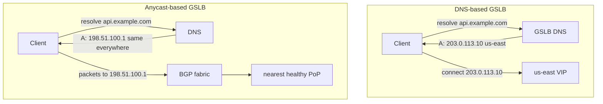
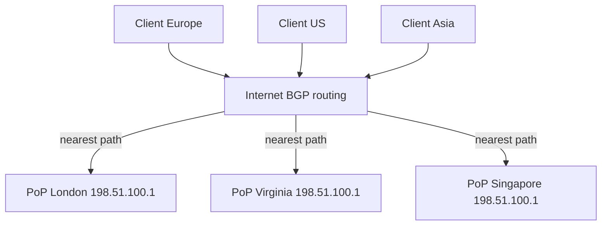

# Global Server Load Balancing — Middle

<!-- level-focus -->
At middle level, focus on this question:

> Where does **Global Server Load Balancing** belong in a maintainable component, and which trade-off selects the design?

Use the smallest realistic scenario that exposes the decision and its failure behavior.
## 1. Recap: What GSLB Must Do

**Global Server Load Balancing (GSLB)** is the layer that decides *which datacenter, region, or
Point of Presence (PoP)* a client should be sent to — before any per-server load balancer inside
that region ever sees the request. A regional L4/L7 load balancer answers "which of my backends?";
GSLB answers the strictly earlier question "which of my *sites*?".

At the middle level you should be able to reason about the three jobs GSLB performs, because every
implementation choice is a trade-off between them:

- **Proximity routing** — send each client to the site that gives the lowest latency. This is
  usually the geographically or network-topologically nearest healthy site, but "nearest" and
  "fastest" are not always the same (see §8).
- **Health-aware failover** — never hand a client a site that is down. When a region fails, GSLB
  must stop directing traffic there and steer it to a surviving region.
- **Traffic engineering** — deliberately shape the split across sites for reasons other than
  latency: capacity limits, cost, canary rollouts, or draining a region for maintenance.

The central difficulty is that GSLB operates at the *entry point* of the request, where you have
very few levers. In practice there are only two places to make the "which site?" decision: **the
name-resolution step (DNS)** or **the network-routing step (BGP/anycast)**. Those are the two
styles this file is about.

---

## 2. The Two Implementation Styles

Because a client must first turn a hostname into an IP and then route packets to that IP, GSLB can
hook into either step:

- **DNS-based GSLB** intervenes at resolution time. An authoritative, GSLB-aware DNS server returns
  *different IP addresses to different resolvers* based on the resolver's location, measured
  latency, configured weights, and — critically — the current health of each site. The client then
  connects to whichever regional VIP it was handed. Each region has a **distinct IP**.
- **Anycast-based GSLB** intervenes at routing time. Every PoP advertises the **same IP address**
  into BGP. The internet's routing fabric delivers each client's packets to the "nearest" PoP by
  BGP path metrics. There is no per-client decision inside your system — the network does the
  steering for you.



The rest of the file drills into each style, then compares them head to head.

---

## 3. Style 1 — DNS-Based GSLB

In DNS-based GSLB, you run (or buy) an **authoritative DNS service that is health-aware and
location-aware**. When a recursive resolver asks "what is the address of `api.example.com`?", the
GSLB DNS does not return a fixed record. It runs a decision at answer time:

1. Determine the *asker's* location. The GSLB sees the IP of the **recursive resolver** (e.g. the
   ISP's DNS or `8.8.8.8`), not the end user. Optionally the resolver forwards the client subnet via
   **EDNS Client Subnet (ECS)**, which gives a much better location signal.
2. Look at the pool of candidate sites and drop any that are currently marked unhealthy.
3. Apply the configured routing policy (geo / latency / weighted / failover — §8) to the surviving
   healthy set.
4. Return the winning site's IP as an `A`/`AAAA` record, stamped with a **short TTL**.

The two knobs that define this style are the **health check** (what makes a site eligible) and the
**TTL** (how long the client is allowed to cache the answer). A short TTL — commonly 30–60 seconds
— is what makes DNS-based failover *possible*: a resolver that cached a now-dead region will re-ask
soon, and get a healthy answer.

```text
GSLB DNS decision (pseudocode):
  answer(query, resolver_ip):
    site_pool   = sites_for(query.name)
    healthy     = [s for s in site_pool if s.health == UP]
    if healthy is empty:
        return SERVFAIL or last-resort record   # never black-hole silently
    chosen = policy.select(healthy, resolver_ip)  # geo | latency | weighted | failover
    return A_record(chosen.ip, ttl=30)
```

**Strengths.** It is protocol-agnostic (works for any TCP/UDP service, not just HTTP), needs no
control over the network fabric, and is trivial to deploy on top of any managed DNS. Routing policy
is expressive: you can weight, geo-fence, and blend policies per record.

**Weaknesses.** You are steering *resolvers*, not users, and you cannot force clients to obey your
TTL. Both problems are covered in §5.

---

## 4. Health-Aware DNS Answers and Failover

The value of DNS-based GSLB comes almost entirely from **taking unhealthy sites out of the answer
set**. The GSLB continuously health-checks every site's VIP (§9). A site that fails its checks is
marked `DOWN`, and the DNS decision in §3 simply stops offering it.

The staged sequence below shows the happy path, a region failure, and the failover — and exposes
exactly where cached TTLs delay recovery.

```mermaid
sequenceDiagram
    autonumber
    participant U as User
    participant R as Recursive Resolver
    participant G as GSLB DNS
    participant E as us-east VIP
    participant W as us-west VIP

    Note over G,E: Steady state — us-east healthy
    U->>R: resolve api.example.com
    R->>G: query (cache empty)
    G-->>R: A 203.0.113.10 (us-east), TTL 30
    R-->>U: 203.0.113.10
    U->>E: HTTPS request  ✅

    Note over G,E: us-east fails; health check flips it DOWN
    G-xE: health probe times out (3 misses)
    Note over G: us-east marked DOWN

    Note over R: Resolver still holds cached A for up to TTL(30s)
    U->>E: HTTPS request  ❌ (blackholed until TTL expires)

    Note over R: After TTL expiry, resolver re-queries
    U->>R: resolve api.example.com
    R->>G: query (cache expired)
    G-->>R: A 198.51.100.20 (us-west), TTL 30
    R-->>U: 198.51.100.20
    U->>W: HTTPS request  ✅
```

The key observation: **detection is fast, but propagation is bounded below by the TTL.** Even a
perfect health check that flips a region `DOWN` in 3 seconds cannot help a resolver that cached the
old answer for another 27 seconds. That gap is the crux of the next section.

---

## 5. The DNS-TTL-vs-Failover-Speed Problem

DNS-based GSLB inherits a fundamental tension from DNS caching:

- **Long TTL** → resolvers cache aggressively → fewer DNS queries, lower DNS load and latency, but
  **slow failover**: a dead region keeps receiving traffic until every cached record expires.
- **Short TTL** → fast failover, but resolvers re-query constantly → higher DNS QPS, and every cache
  miss adds a resolution round-trip to the connection setup latency.

You would like a 5-second TTL for instant failover. The problem is that **clients and resolvers do
not honor TTLs faithfully**:

- Many recursive resolvers enforce a **minimum TTL floor** (often 30–60 s), ignoring your smaller
  value.
- Browsers and OS stub resolvers keep their **own DNS caches** that outlive the record TTL.
- Some clients (notably JVM-based ones with `networkaddress.cache.ttl`) historically cached DNS
  answers for the process lifetime.

So the *effective* failover time is `TTL + resolver_slack + client_cache`, and you control only the
first term. Realistic DNS-GSLB failover lands in the **tens of seconds to a couple of minutes**,
not milliseconds. Mitigations at this level:

- Set a short-but-honored TTL (30–60 s) and accept the residual delay.
- Return **multiple `A` records** so a client that already cached the answer can retry the *second*
  IP when the first connection fails — client-side failover masks part of the DNS delay.
- For truly fast failover, move the failover decision off DNS entirely and onto **anycast** (§6),
  where a withdrawn BGP route reroutes in seconds without touching any cache.

> This TTL-vs-failover-speed trade-off is *the* defining limitation of DNS-based GSLB, and the main
> reason anycast exists as an alternative.

---

## 6. Style 2 — Anycast-Based GSLB

Anycast flips the model. Instead of handing different IPs to different clients, **every PoP
advertises the same IP prefix into BGP**. The global routing table then contains many equally-valid
paths to that prefix, and each router forwards packets toward the PoP that is *closest by BGP
metrics* (AS-path length, local preference, IGP cost). From the client's perspective there is one
IP; from the network's perspective there are many origins and it picks the nearest.



The decision that DNS-GSLB makes explicitly (in software, per query) is here made *implicitly* by
the routing fabric, continuously, for every packet. There is no TTL, no per-client answer, and no
resolver in the failover path.

**Strengths.** Failover is fast and cache-free: withdraw the BGP advertisement from a dead PoP and
the world reroutes in seconds. Proximity is decided by the network, which already knows real
topology. It presents a single stable IP, simplifying client and firewall configuration.

**Weaknesses.** It requires operating your own IP space and BGP — you need portable prefixes and
peering, which is why anycast GSLB is the domain of CDNs, DNS providers, and large infra teams, not
a two-region startup. "Nearest by BGP" is not always "lowest latency" (BGP optimizes AS-path, not
milliseconds). And because routing can change mid-connection during BGP churn, **long-lived stateful
TCP connections can be reset** if they get re-pinned to a different PoP — which is why anycast is
most comfortable for short/stateless flows (DNS, HTTP request/response, QUIC with connection
migration) and TCP-terminating edges that keep state local.

---

## 7. Anycast Reroute on PoP Failure

Failover in anycast is a routing event, not a caching event. When a PoP dies (or is drained), it
**withdraws its BGP advertisement**. Neighboring routers remove that path; their next-best path now
points at a surviving PoP; convergence happens across the affected region in seconds.

```mermaid
sequenceDiagram
    autonumber
    participant U as User (Europe)
    participant BGP as Internet routers
    participant L as PoP London
    participant F as PoP Frankfurt

    Note over L,F: Both advertise 198.51.100.1/24
    U->>BGP: packets to 198.51.100.1
    BGP->>L: nearest path = London ✅

    Note over L: London PoP fails / health-triggered drain
    L--xBGP: WITHDRAW 198.51.100.1/24
    Note over BGP: routers recompute; next-best = Frankfurt

    U->>BGP: packets to 198.51.100.1
    BGP->>F: nearest path = Frankfurt ✅
```

Compare this to §4: no client or resolver cache stands between detection and recovery. The failover
time is dominated by **BGP convergence**, not by any TTL. Health-triggered anycast — where a local
agent withdraws the route the instant the PoP fails its own health check — is how CDNs achieve
seconds-level regional failover.

---

## 8. Routing Policies (Geo, Latency, Weighted, Failover)

Whichever style you use, GSLB selects among healthy sites using one or more **routing policies**.
These are most visible and configurable in DNS-based GSLB, but the underlying intents apply to both.

- **Geolocation / Geoproximity** — map the client's location to a site by geography (continent,
  country, region). Use it for data-residency ("EU users must hit the EU region") and coarse
  proximity. Weakness: geographic distance ≠ network distance; a physically near site can be far in
  latency due to peering.
- **Latency-based** — route to the site with the lowest *measured* network latency from the
  client's region, using the provider's continuously-measured latency map. This directly optimizes
  the thing users feel, and is usually the right default for performance.
- **Weighted** — split traffic across sites by configured percentages (e.g. 90/10). This is the
  workhorse for **canary rollouts**, **A/B tests**, **gradual migration** between regions, and
  **capacity-aware** distribution when one region has more headroom.
- **Failover (active-passive)** — send all traffic to a primary; only if the primary's health check
  fails, send it to a secondary. This is the classic disaster-recovery pattern for a hot-standby
  region.

| Policy | Selects by | Primary use case | Watch out for |
|---|---|---|---|
| Geolocation | Client's geographic region | Data residency, compliance | Geography ≠ latency; unmapped regions need a default |
| Latency-based | Measured RTT to each site | Best user-perceived performance | Depends on provider's latency map freshness |
| Weighted | Configured percentages | Canary, A/B, migration, capacity | Weights are static unless you automate them |
| Failover | Health of primary vs standby | Disaster recovery / hot standby | Standby must be kept warm and tested |

Policies compose. A common real setup is **geo first (residency), then latency within the allowed
region, with a failover fallback**, and a mandatory **default answer** so a client from an unmapped
location is never left without a record.

---

## 9. Health-Checking Regions

Everything above depends on GSLB knowing which sites are healthy. GSLB health checks differ from a
regional load balancer's checks in scope: they probe **the region's public entry point**, not
individual backend servers.

- **What to probe.** Prefer an application-level check — an HTTP(S) `GET /healthz` that returns
  `200` only when the region can actually serve requests (dependencies reachable, not draining) —
  over a bare TCP-connect or ping, which can pass while the app is broken.
- **Where to probe from.** A single vantage point can be fooled by a partial network partition
  between the checker and the region. Robust GSLB checks from **multiple geographic vantage points**
  and aggregates (e.g. majority-healthy) to avoid flapping on a single-path failure.
- **Failure thresholds and hysteresis.** Require N consecutive failures before marking `DOWN` and M
  consecutive successes before marking `UP`. This prevents a single dropped probe from ripping a
  region out of rotation, and prevents rapid oscillation ("flapping").
- **Calculated / nested health.** Combine child checks (each backend, each dependency) into a parent
  status so a region is only `UP` when the whole entry path is serving. Route 53 exposes this as
  *calculated health checks*.

The health check interval and threshold set the *detection* half of failover time; the TTL (DNS) or
BGP convergence (anycast) sets the *propagation* half. Tune both together — a 5-second detection is
wasted behind a 300-second TTL.

---

## 10. DNS-GSLB vs Anycast-GSLB — Comparison

| Dimension | DNS-based GSLB | Anycast-based GSLB |
|---|---|---|
| Where the decision is made | At name resolution (per query, in software) | At packet routing (per packet, by BGP) |
| IP addressing | One distinct IP per region | One shared IP across all PoPs |
| Failover speed | Bounded by TTL + resolver/client caching (tens of seconds to minutes) | Bounded by BGP convergence (seconds), cache-free |
| Proximity signal | Resolver location / EDNS Client Subnet / latency map | BGP path metrics (AS-path, local-pref) |
| Routing-policy expressiveness | High — geo, latency, weighted, failover, blended | Low — network picks nearest; steering needs BGP tricks |
| Client-visible steering | Yes — you steer resolvers, not users | No — transparent to the client |
| Long-lived TCP stability | Stable (fixed IP per region) | Can reset if route re-pins mid-flow |
| Operational prerequisites | Any managed authoritative DNS | Own IP space + BGP + peering |
| Typical adopters | Most application teams, multi-region apps | CDNs, DNS providers, large edge networks |

The two are **complementary, not mutually exclusive**. A very common production pattern is
**anycast for the DNS layer** (so name resolution itself is fast and near) combined with
**DNS-based GSLB answers for the application layer** (so you get expressive, health-aware routing
policies). Big CDNs push further and use anycast for the application edge too.

---

## 11. Concrete Systems: Route 53 and GSLB Appliances

**Amazon Route 53** is the canonical managed DNS-based GSLB. It implements each policy in §8 as a
*routing policy* on a record set, all backed by health checks:

- **Latency-based routing** — Route 53 keeps a latency map between AWS regions and networks and
  returns the region with the lowest latency for the querying resolver.
- **Geolocation** and **Geoproximity** routing — answer by the user's continent/country/region, for
  residency or coarse proximity.
- **Weighted routing** — assign integer weights to records for canary and gradual-shift traffic
  splits.
- **Failover routing** — active-passive primary/secondary tied to a health check.
- **Health checks and calculated health checks** — HTTP/HTTPS/TCP probes from multiple AWS locations,
  with parent/child aggregation to model whole-region health.

See the AWS Route 53 developer documentation (`docs.aws.amazon.com/Route53`) for the authoritative
description of each routing policy and health-check type.

**GSLB appliances** (traditionally shipped by ADC vendors such as F5 BIG-IP DNS/GTM and Citrix
NetScaler, plus their virtual/cloud equivalents) are the on-premise/enterprise counterpart. They run
an authoritative DNS front end, health-check your datacenter VIPs (often integrating directly with
the local L4/L7 balancer's view of backend health), and return health-aware, policy-driven answers —
the same DNS-based model as Route 53, but self-hosted and tightly coupled to your existing load
balancers.

**Anycast** in practice is delivered by CDNs and edge platforms (for example, Cloudflare runs an
anycast network so a single IP resolves to the nearest PoP). Cloudflare's Learning Center
(`cloudflare.com/learning`) has approachable explainers on anycast and GSLB concepts.

---

## 12. Middle Checklist

- [ ] Chosen a GSLB style deliberately: DNS-based for policy expressiveness with no network control;
      anycast for fast, cache-free failover when you own IP space and BGP.
- [ ] TTL set to a short-but-realistic value (30–60 s) with the understanding that resolver/client
      caching lengthens *effective* failover time.
- [ ] Multiple `A` records or a failover policy configured so a stale-cached client can retry a
      healthy IP.
- [ ] Health checks probe the region's application entry point (`/healthz`), from multiple vantage
      points, with failure/recovery thresholds to prevent flapping.
- [ ] A **default/last-resort answer** exists so an unmapped or unhealthy-everywhere query is never
      black-holed.
- [ ] Routing policy matches intent: latency for performance, geo for residency, weighted for
      canary/migration, failover for hot standby — composed where needed.
- [ ] Detection time (health interval × threshold) tuned *together with* propagation time (TTL or
      BGP convergence), not in isolation.

*Next step:* [Global Server Load Balancing — Senior](senior.md)

---

## Apply it

1. Find a real component where **Global Server Load Balancing** affects an interface or dependency.
2. Write two plausible choices and the constraint that favors each one.
3. Make the smallest reversible change at that boundary.
4. Exercise the component alone, then exercise the integrated flow.
5. Keep the decision note with the evidence that selected the option.

## Verify your work

- A focused check proves the local behavior.
- An integrated check proves callers and dependencies still agree.
- Logs, traces, compiler output, or benchmarks expose the boundary.
- Reverting the change restores the previous behavior without unrelated edits.

## Review questions

- Which boundary is most affected by Global Server Load Balancing?
- What constraint would make you choose the alternative design?
- How would you isolate a local defect from an integration defect?
- What evidence shows that the change remains maintainable?
