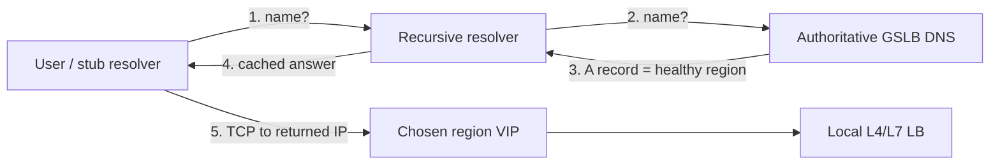
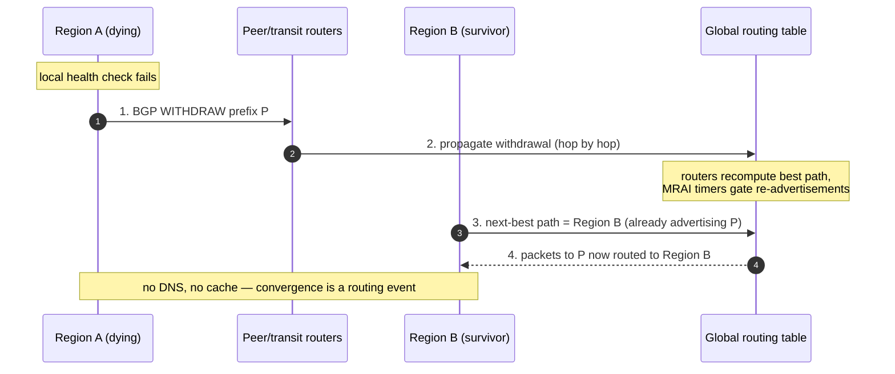

# Global Server Load Balancing — Professional

<!-- level-focus -->
At professional level, focus on this question:

> How should teams adopt and operate **Global Server Load Balancing** with measurable outcomes and limited coordination?

Use the smallest realistic scenario that exposes the decision and its failure behavior.
## 1. What GSLB Actually Controls

Local load balancing (§8.1–8.6) answers *which server in this datacenter gets the request*.
GSLB answers *which datacenter (or edge region) a client reaches in the first place*. It sits
one layer earlier — before any TCP connection to your application exists — and therefore its
only levers are the two mechanisms that resolve "a name a user typed" into "an IP a packet is
routed to":

- **DNS-based steering** — the authoritative nameserver returns *different A/AAAA records* to
  different resolvers based on health, geography, or load. The steering decision is embedded
  in the *answer*.
- **IP anycast steering** — a single IP is advertised from many locations via BGP; the
  *Internet's routing fabric* decides which location a packet reaches. The steering decision
  is embedded in the *route*.

The critical professional insight: **both are indirect.** DNS steers a *resolver*, not a
client, and the answer is cached at multiple layers you do not control. Anycast steers a
*route*, and route changes propagate through thousands of autonomous systems you do not
control. In both cases the time from "I decided to fail traffic away from region X" to
"traffic actually left region X" is dominated by propagation you cannot command — only model.



Steps 3 and 4 are where the *policy* lives; steps 4→5 are where the *stale answer* lives.
Everything in this file is about the delay between those two.

---

## 2. DNS-Based GSLB Mechanics

A DNS-GSLB deployment is an **authoritative nameserver that computes the answer at query
time** instead of serving a static zone. The building blocks:

**Health-aware answers.** The GSLB continuously health-checks each region's VIP (active
probes, or passive signals from the local LBs). Only *healthy* endpoints are eligible to be
returned. When region A fails its health check, the GSLB stops including A's address in
answers. This is the fast part of the decision — a probe interval measured in seconds.

**Steering policy.** Among healthy endpoints the GSLB picks by geo-proximity, measured
latency, weighted round-robin (for gradual shifts / canaries), or explicit failover
priority. The policy runs *per query*, so two resolvers can legitimately get different
answers milliseconds apart.

**TTL.** Every answer carries a Time-To-Live. This is the single most consequential number in
DNS-GSLB: it is the *maximum* time a recursive resolver is *permitted* to cache and re-serve
the answer without asking again. Short TTL = faster failover, more query load, and more
exposure to the accuracy problems of §3.

The state machine above is what the operator sees at the authoritative server. What *users*
experience lags it by the caching chain in §4. Confusing "the authoritative answer changed"
with "traffic moved" is the classic DNS-GSLB error.

---

## 3. EDNS Client Subnet — Why Geo Answers Are Wrong Without It

DNS-GSLB steers by geography, but the authoritative server does not see the *client's* IP —
it sees the *recursive resolver's* IP. If a user in Frankfurt queries a centralized public
resolver whose egress is in Amsterdam (or, worse, a global anycast resolver whose egress the
authoritative can't localize), the GSLB geolocates *Amsterdam* and may return a suboptimal
region. With large centralized resolvers this misattribution can affect a meaningful fraction
of traffic.

**EDNS Client Subnet (ECS), RFC 7871**, fixes this. The recursive resolver appends a truncated
prefix of the *client's* subnet (e.g. `203.0.113.0/24`) to the query. The authoritative GSLB
now geolocates the *actual client network* and returns the region nearest the user. The
resolver caches the answer *per client-subnet scope* (the `SCOPE PREFIX-LENGTH` the
authoritative returns), so a single resolver can hold many region-specific answers keyed by
subnet.

Trade-offs a professional must weigh:

- **Accuracy** improves substantially for users behind centralized resolvers — the whole point.
- **Privacy** degrades: the client's network prefix leaks to the authoritative operator. RFC 7871
  is explicit that ECS is a privacy trade-off; some resolvers deliberately strip or zero it.
- **Cache efficiency** drops: caching per-scope multiplies the number of distinct cached
  answers, raising query volume back to the authoritative.
- **Not universal:** if the resolver does not send ECS, you fall back to resolver-IP geo — so
  geo policy must degrade gracefully, never assume ECS is present.

| Scenario | Geo signal available | Accuracy | Cache behavior |
|----------|---------------------|----------|----------------|
| ECS **on**, resolver forwards prefix | Client subnet | High — region matches the user | Per-subnet scoped; more entries, lower hit ratio |
| ECS **off** (or stripped) | Recursive resolver IP | Low for centralized/anycast resolvers | Single coarse answer; higher hit ratio |
| Local ISP resolver, no ECS | Resolver IP ≈ user region | Usually acceptable (resolver near user) | Coarse but adequate |

Rule: enable ECS on the authoritative, but design geo policy so an ECS-absent query still
produces a *safe* (correct-continent) answer, and treat ECS as an accuracy boost, not a
correctness dependency.

---

## 4. The Effective-Failover-Time Model (DNS)

The configured TTL is a *ceiling on one term*, not the failover time. The time from failure to
"the last client has stopped hitting the dead region" decomposes into additive stages:

```
effective_failover_DNS =
      detection_time                      (probe interval × failures to declare down, ± jitter)
    + authoritative_propagation           (~instant: answer computed per query)
    + resolver_honoring(TTL)              (recursive caches serve stale up to remaining TTL)
    + client_cache                        (stub/OS/browser DNS cache, often ignores TTL)
    + connection_drain                    (existing keep-alive / long-lived conns to old IP)
```

Two of these terms routinely *exceed* the TTL you set, which is why "we set TTL=30s" does not
buy a 30-second failover:

- **`resolver_honoring(TTL)`** — a *well-behaved* resolver serves the cached answer for the
  remaining TTL. But some recursive resolvers **enforce a minimum TTL floor** (clamping tiny
  TTLs up to, say, 30–60 s to protect themselves from query storms) and some serve slightly
  past expiry. So the effective per-resolver honoring is `max(remaining_TTL, resolver_floor)`,
  not simply your TTL.
- **`client_cache`** — browsers and OS stub resolvers cache aggressively and **frequently
  ignore the record's TTL** entirely. Java historically cached DNS for the *process lifetime*
  by default; browsers pin resolutions for their own intervals. A live TCP connection to the
  old IP will *not* re-resolve at all until it is torn down — captured by `connection_drain`.

So the honest model is a **max over the population of clients**, weighted by how long each
tier caches:

```
effective_failover_DNS ≈ detection_time
                        + max_over_clients( resolver_honoring, client_cache )
                        + connection_drain
```

The tail client — the one behind a resolver that floored your TTL, plus a browser that pinned
the answer, plus a persistent connection — dominates your *worst-case* recovery, which is what
availability math cares about.

---

## 5. Worked Failover-Time Calculation

Concrete numbers. Region **US-East** goes hard-down. Config:

- Health probe: every **5 s**, declare down after **3** consecutive failures.
- Authoritative A-record TTL: **30 s**.
- Observed resolver TTL floor in the wild: **60 s** for a slice of traffic (they clamp your 30 s up).
- Browser/OS DNS pin: **~60 s** typical; persistent HTTP keep-alive to the dead VIP: **~90 s**
  before the connection is abandoned and re-resolved.

**Detection**

```
detection_time = 3 probes × 5 s = 15 s   (plus up to one probe-interval of phase jitter → ~15–20 s)
```

**Authoritative propagation** ≈ 0 (answer recomputed on the very next query).

**Resolver honoring** — depends on the resolver:

```
compliant resolver: serves stale up to remaining TTL ≤ 30 s
flooring resolver:  max(30 s honored request, 60 s floor) = 60 s
```

**Client cache / drain** — the slow tail:

```
stub/OS/browser pin:        ~60 s
persistent-connection drain: ~90 s (no re-resolution until socket closes)
```

**Median client** (compliant resolver, no persistent connection):

```
≈ 15 s (detect) + 30 s (TTL) + small stub cache ≈ 45–50 s
```

**Tail client** (flooring resolver + pinned browser + keep-alive connection):

```
≈ 15 s (detect) + max(60 s resolver floor, 60 s pin) + 90 s drain-dominated
≈ 15 s + 60 s + 90 s  ≈ up to ~2.5 min before that client fully moves
```

The lesson for the professional: **advertising "30-second DNS failover" is a fiction.** Your
median is ~45 s and your tail is *minutes*. Lowering TTL to 5 s barely helps the tail — it is
dominated by `resolver_floor` and `connection_drain`, neither of which your TTL controls. To
actually shrink the tail you must attack the *drain* (short keep-alive, connection-close on
error, client-side retry to an alternate IP) or change substrate (anycast, §6).

---

## 6. Anycast Failover Mechanics — BGP Withdrawal Convergence

Anycast collapses the entire DNS-caching chain. One IP prefix is advertised via **BGP
(RFC 4271)** from every region. Routers across the Internet install a route to the
*topologically nearest* advertisement, so a client's packets reach the closest region with **no
per-client steering decision and no cached answer** — the network makes the choice on every
packet.

Failover is not a DNS change; it is a **route withdrawal**. When a region dies (or its BGP
speaker withdraws, often triggered by a failing local health check that stops the
advertisement), that region stops announcing the prefix. Neighboring ASes propagate the
withdrawal; each router recomputes best-path and re-converges onto the next-nearest region
that is *still* advertising. In-flight anycast clients silently shift to the surviving region
on their next packet's route lookup — no TTL, no resolver, no stub cache involved.



**What sets anycast convergence time:**

- **BGP propagation depth** — hops the withdrawal must traverse; each adds processing + queueing.
- **MRAI (Minimum Route Advertisement Interval), RFC 4271** — routers rate-limit how often
  they re-advertise to a peer (historically ~30 s default toward external peers, often tuned
  lower). This is the main *knob* that can slow re-advertisement of the alternative path.
- **BGP timers / BFD** — hold timers govern how fast a *dead session* is noticed; pairing BGP
  with **BFD** (sub-second liveness) lets a router tear down and reconverge far faster than
  hold-timer expiry.
- **Path hunting / route flap** — during convergence routers may transiently try successively
  worse paths before settling, and flap damping can *penalize* an unstable prefix.

In practice, a well-run anycast withdrawal converges on the order of **seconds to a few tens
of seconds** globally — critically, **independent of any client cache**. There is no tail of
resolvers flooring a TTL and no browser pinning an answer, because there is no answer to pin.

---

## 7. DNS vs Anycast — Convergence and Control Contrast

The two substrates fail differently, and a real GSLB usually **layers them**: anycast the DNS
service itself (so resolution survives regional loss instantly) and use DNS answers for
per-client application steering where granular policy matters.

| Dimension | DNS-based GSLB | IP anycast |
|-----------|----------------|-----------|
| Steering decision made by | Authoritative nameserver (you) | Internet routing fabric (BGP) |
| Failover mechanism | Change the returned A record | Withdraw the BGP route |
| Typical failover time | tens of seconds → **minutes** (tail) | **seconds → tens of seconds**, cache-independent |
| Cache dependence | High — resolver TTL floor + stub/browser pin + conn drain | **None** — no answer to cache |
| Steering granularity | Per query: geo, latency, weight, canary %, failover priority | Coarse: "nearest advertisement" only |
| Geo accuracy | Needs ECS (RFC 7871) to see real client | Inherently topological (may ≠ geographic) |
| Precision of control | High (weights, gradual shifts, per-region drain) | Low (can't split a prefix by weight) |
| Session stability | Stable while cached; can flip on re-resolve | Can flip mid-session if routes reconverge (bad for long-lived TCP) |
| Operational surface | DNS zone, health checks, TTL policy | BGP sessions, MRAI/BFD, transit relationships, LOA/RPKI |
| Blast radius of a mistake | One record set | A route leak can misdirect a whole prefix globally |

**Convergence contrast, stated sharply.** DNS failover time is `detection + max(resolver_floor,
client_pin) + drain` — dominated by caches you don't own. Anycast failover time is `detection
(BFD) + BGP_propagation + MRAI_gating` — dominated by routing timers you *can* tune (BFD for
detection, lower MRAI, RPKI/damping hygiene). Anycast trades away *per-client steering
precision and session stickiness* to win *cache-independent, seconds-scale* failover. DNS
trades away *fast, uniform failover* to win *fine-grained, weighted, geo-aware policy*.

Choose by failure requirement: if the SLO needs sub-30-second, uniform regional failover for
a stateless request/response service → anycast the entry point. If you need weighted canaries,
geo-partitioned data residency, or gradual traffic shifting → DNS steering, and accept the
minute-scale tail (or attack the drain term directly).

---

## 8. Latency-Based Routing: RUM vs Synthetic Measurement

"Nearest region" is a proxy for "lowest latency," and geography is a *bad* proxy — routing
detours, congestion, and peering asymmetry mean the geographically closest region is often not
the fastest. Latency-based GSLB steers by *measured* latency instead. Two measurement
philosophies, and they answer different questions:

**Synthetic (active) measurement.** The GSLB (or agents in each region) actively probes network
distance to resolver subnets / client prefixes — periodic pings, TCP handshakes, or path
measurements — and builds a latency map from `{client subnet → region}`. Answers steer toward
the region with the lowest measured RTT for that subnet.

- **Pros:** works before any real user traffic (green-field regions, low-traffic prefixes);
  deterministic and controllable cadence; no dependency on user instrumentation.
- **Cons:** measures the *network*, not the *application* — it can't see your app's own
  processing latency, cold caches, or per-region saturation; probe paths may differ from real
  user paths; coverage of the long tail of client subnets is sparse.

**RUM (Real User Measurement).** Real clients report actual observed latency (e.g. a small
beacon that times fetches to candidate region endpoints and reports back). The GSLB aggregates
these into a per-subnet, per-region latency picture from *ground truth*.

- **Pros:** measures the *full* path including application and last-mile reality; naturally
  covers exactly the subnets that have real users; captures diurnal congestion and real peering.
- **Cons:** needs real traffic to learn (cold-start problem for new regions/prefixes);
  measurements are noisy and must be aggregated/smoothed; adds client-side instrumentation;
  can be gamed or skewed by bot traffic.

| | Synthetic (active) | RUM (real user) |
|---|---|---|
| Measures | Network path RTT | End-to-end incl. application + last mile |
| Coverage | Everywhere you probe (uniform) | Only where real users are (traffic-weighted) |
| Cold start | None — probes on demand | Poor — needs live traffic to learn |
| Reflects app/region saturation | No | Yes |
| Noise | Low | Higher — needs aggregation/smoothing |
| Best for | New regions, sparse prefixes, baseline map | Steering established, high-traffic prefixes |

The professional pattern is **both**: synthetic to seed a complete map and cover the long tail,
RUM to correct it with reality for high-volume prefixes — and always *decayed* over time so a
transient congestion spike doesn't permanently blackhole a region. Whatever the source, the
latency decision is still *delivered* through the DNS answer, so it inherits the entire
caching/TTL tail of §4: a latency-optimal answer that a resolver caches for 60 s is stale the
moment congestion shifts.

---

## 9. The Global Failover-Time Budget as a Formula

Bring it together. The **global failover time** — from the instant a region becomes unhealthy
to the instant essentially all traffic has left it — is the sum of a detection term and a
substrate-specific propagation term, taken at the *tail* of the client population because
availability is a worst-case property:

```
T_failover = T_detect + T_propagate + T_drain

where, for DNS steering:
  T_detect     = probe_interval × failures_to_declare  (+ up to one interval of jitter)
  T_propagate  = max_over_clients( max(remaining_TTL, resolver_TTL_floor), client_cache_pin )
  T_drain      = time for the last long-lived connection to the dead VIP to be re-resolved

and, for anycast steering:
  T_detect     = BFD/BGP liveness detection time      (sub-second with BFD; else hold-timer)
  T_propagate  = BGP_withdrawal_propagation + MRAI_gating   (seconds → tens of seconds)
  T_drain      = 0 for new packets (route-level); nonzero only for sticky in-flight TCP that
                 re-pins to the survivor on the next packet
```

Design consequences that fall directly out of the formula:

- **Lowering TTL has diminishing returns.** Once `remaining_TTL < resolver_TTL_floor`, cutting
  TTL further changes nothing — `T_propagate` is pinned by the resolver floor and the client
  pin. Measure your real resolver floors before choosing a TTL.
- **`T_drain` is often the largest term** for services with persistent connections, and it is
  invisible to DNS. Attack it explicitly: bounded keep-alive, `Connection: close` / GOAWAY on
  region-drain, and client libraries that re-resolve and retry on error to a *different* IP.
- **Anycast collapses `T_propagate` and `T_detect`** (with BFD) but re-introduces a small
  session-stability risk — long-lived TCP can break on reconvergence. For request/response
  and UDP/QUIC (which can migrate) this is nearly free; for long TCP sessions, add app-level
  reconnect.
- **The availability math must use the tail, not the median.** If your SLO says 99.99%
  (≈52 min/year of budget), a 2.5-minute DNS tail per regional failover means you can afford
  very few regional failovers per year on DNS alone — which is frequently the argument that
  justifies anycasting the entry point.

Worked contrast for the same US-East outage:

```
DNS steering, tail client:
  T_detect ≈ 15 s + T_propagate ≈ 60 s + T_drain ≈ 90 s  ⇒  ~165 s (~2.75 min)

Anycast steering, with BFD:
  T_detect < 1 s + T_propagate ≈ 10–30 s + T_drain ≈ 0(new)  ⇒  ~10–30 s
```

Same failure, ~5–10× faster recovery — purely because anycast's propagation term is a routing
event, not a chain of caches. That single ratio is the core professional takeaway of GSLB
failover design.

---

## 10. Professional Checklist

- [ ] Failover time is modeled as `T_detect + T_propagate + T_drain` at the **tail**, not asserted from TTL.
- [ ] Real-world **resolver TTL floors** measured before setting authoritative TTL; TTL not driven below the floor uselessly.
- [ ] `T_drain` attacked explicitly (bounded keep-alive, connection-close on drain, client re-resolve + retry to alternate IP).
- [ ] **ECS (RFC 7871)** enabled on the authoritative for geo accuracy, with a safe correct-continent fallback when ECS is absent/stripped; privacy trade-off acknowledged.
- [ ] Latency steering uses **both** synthetic (coverage, cold-start) and **RUM** (ground truth), with time-decay so transient spikes don't blackhole a region.
- [ ] Substrate chosen per SLO: **anycast** (with BFD + tuned MRAI, RPKI hygiene) for fast uniform failover; **DNS** for weighted/geo/canary precision — often anycast the DNS/entry point *and* use DNS answers for app steering.
- [ ] Long-lived TCP sessions have app-level reconnect logic if riding anycast (reconvergence can break sticky flows).
- [ ] Availability budget computed against the **tail** failover time, and the number of tolerable regional failovers/year derived from it.


---

## Apply it

1. Define the user or business outcome that **Global Server Load Balancing** should improve.
2. Assign one owner for code, contracts, operations, and incidents.
3. Split delivery into reversible increments that produce evidence early.
4. Publish responsibilities, escalation paths, and compatibility windows.
5. Stop or expand only when the agreed measures support that decision.

## Verify your work

- Each increment has an owner, rollback path, and observable exit condition.
- Adoption, reliability, delivery time, and coordination cost are measured.
- Incident and migration exercises prove that responsibility is executable.
- The old path is removed only after telemetry proves it is unused.

## Review questions

- Which measurable outcome justifies investing in Global Server Load Balancing?
- Which team owns the full lifecycle and incident response?
- What reversible increment produces the earliest useful evidence?
- Which exit condition proves that migration or adoption is complete?
