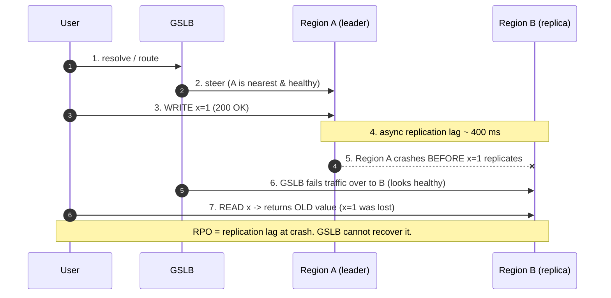
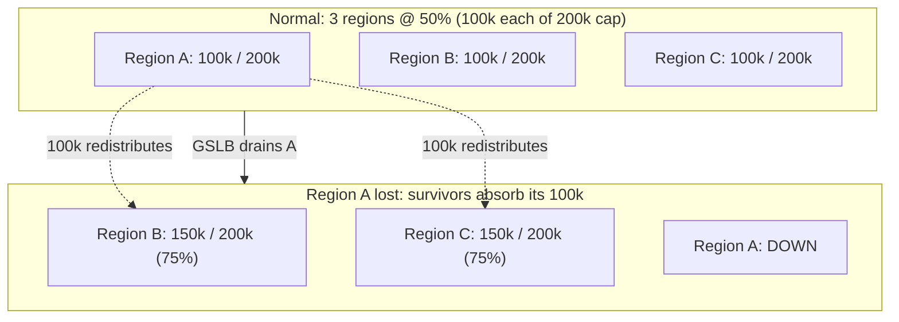
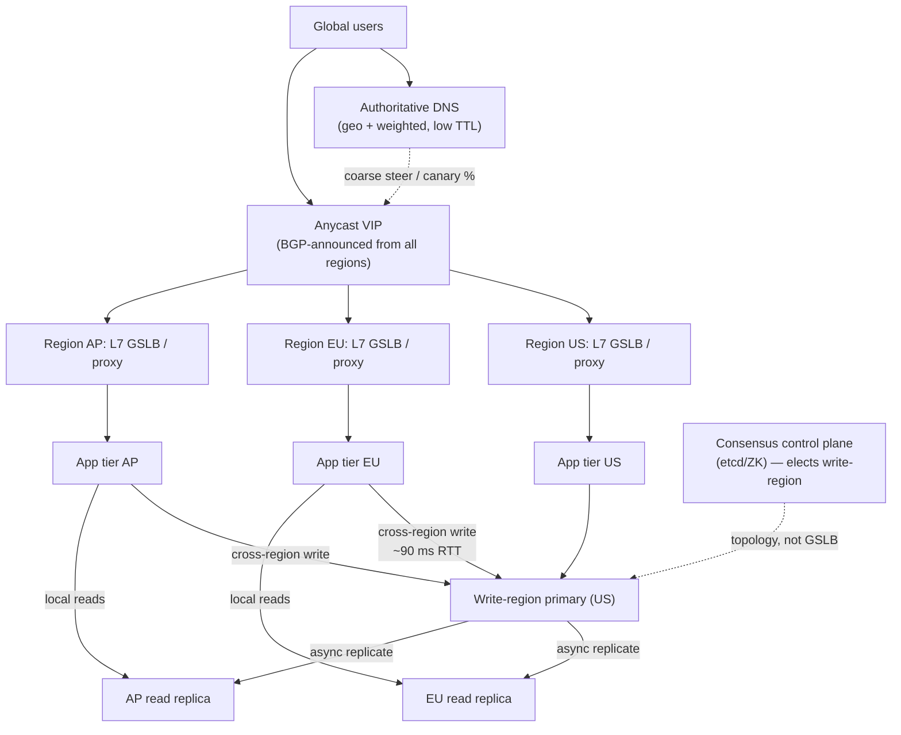

# Global Server Load Balancing — Senior

<!-- level-focus -->
At senior level, focus on this question:

> Which system invariant is affected by **Global Server Load Balancing** under failure, load, and change?

Use the smallest realistic scenario that exposes the decision and its failure behavior.
## 1. What "Senior" Owns in GSLB

At junior/middle you learned *what* GSLB is: a control plane that steers a client to
one of several geographically distributed sites, using DNS answers, anycast routing,
or an HTTP-level redirect, informed by health, latency (geo/RTT proximity), and load.

At senior, you own the parts that turn a demo into a system that survives 3am:

- **The region-loss budget.** When one region dies, its traffic lands somewhere. Is
  there room? You size for it *before* the incident, not during.
- **The data contract.** GSLB moves *requests*. It does not move or reconcile *state*.
  You own the answer to "what does a user see the moment we fail them to another region?"
- **Failover honesty.** You own the gap between the failover *decision time* (seconds)
  and the failover *effective time* (minutes-to-hours for DNS), and you design around it.
- **Blast-radius correctness.** You ensure a health-check flap or a bad config push
  cannot drain all regions at once (a global outage caused by the thing meant to prevent one).

> The recurring senior mistake: treating GSLB as a *reliability* feature. It is a
> *traffic-direction* feature. Reliability comes from the regions being independently
> healthy and the data tier being able to serve from wherever traffic lands.

---

## 2. Active-Active vs Active-Passive

The single most consequential GSLB decision is whether standby regions serve live
traffic or sit idle. This is not primarily a load-balancer choice — it is a **data-tier
and cost** choice that the load balancer merely expresses.

| Dimension | Active-Active | Active-Passive |
|---|---|---|
| Traffic during normal ops | All regions serve | Only primary serves; standby idle |
| Failover mechanism | Steer traffic away from dead region; survivors already warm | Promote standby to primary, then steer |
| Recovery Time (RTO) | Seconds–minutes (survivors are hot) | Minutes–hours (cold start, promotion, cache warm) |
| Data model required | Multi-master OR read-local/write-global; must tolerate concurrent regional writes | Single writable primary; standby is a replica |
| Split-brain risk | **High** — two regions may accept conflicting writes during a partition | Low — only one writable side by construction |
| Cost | ~2× (or N×) — you pay for capacity you use | ~1× active + standby (often smaller / spot) |
| Capacity headroom | Must reserve N+1 headroom (see §5) | Standby *is* the headroom, but it may be cold/undersized |
| Best fit | Read-heavy, latency-sensitive, globally distributed users | Write-heavy with strong consistency; DR-first postures |

**The uncomfortable truth about active-passive:** the standby is the one part of the
system you *never exercise under real load*. It is where cold caches, stale configs,
expired TLS certs, quota limits, and undersized instance pools hide. An untested
failover target is a hypothesis, not a plan. If you run active-passive, you must run
**periodic real failovers (game days)** so the standby is a known quantity.

**The uncomfortable truth about active-active:** you have signed up for concurrent
writes in multiple regions. Unless your data tier has a defined conflict-resolution
strategy (CRDTs, LWW with synced clocks, or a single global write-region), you have
signed up for silent data corruption during partitions. See §3 and §6.

---

## 3. The Data-Tier Problem GSLB Cannot Solve

This is the heart of the topic. **Routing a user to a region is trivial. Keeping their
data consistent across regions is the actual system-design problem — and GSLB has no
lever for it.** A GSLB device knows about health and latency; it knows nothing about
your replication topology, your replication lag, or whether the region it just steered
a user to has that user's most recent write.

### The three canonical data topologies

```text
1. Read-local / Write-global (single write-region)
   - All writes go to ONE region (the "home" / leader region).
   - Reads are served locally in every region from an async replica.
   - GSLB steers reads by proximity; writes are RE-routed (app-level) to the leader.
   Pro: no write conflicts — one writer by construction.
   Con: writers far from the leader pay cross-region RTT (~80–150 ms) per write.
        Read-after-write is NOT guaranteed in the local region (replication lag).

2. Multi-master (write-anywhere)
   - Every region accepts writes locally; changes replicate asynchronously.
   Pro: low write latency everywhere; survives region loss with no promotion.
   Con: concurrent conflicting writes are POSSIBLE. You MUST define resolution:
        LWW (needs synced clocks → clock skew = silent data loss),
        CRDTs (bounded to types that converge), or
        application-level merge. There is no free lunch.

3. Sharded-by-geography (data has a home region)
   - Each record lives in the region of its owning user ("data residency").
   - GSLB proximity steering happens to align with data locality — until a
     European user travels to the US, and now every request is cross-region.
   Pro: clean ownership; often required for GDPR/data-residency compliance.
   Con: cross-region access for "roaming" entities; hard to move a record's home.
```

### Why this bites at failover time specifically

The failover looks successful — the GSLB drained the dead region, users get 200s from
the survivor. But:

- **Replication lag = data loss window.** With async replication, any write acknowledged
  by the dead region but not yet shipped to the survivor is **gone**. Your RPO (Recovery
  Point Objective) is your replication lag at the instant of failure — often seconds,
  sometimes minutes under load. GSLB does not, and cannot, make this zero.
- **Read-after-write breaks.** A user who wrote in Region A and is now steered to Region
  B may not see their own write (it hasn't replicated). Their profile edit "disappeared."
  This generates support tickets that look like data corruption but are lag.
- **Failing back is harder than failing over.** When the dead region returns, it has
  stale data *and* may have un-replicated writes. Reconciling the divergence (which side
  wins?) is a data-engineering problem, not a load-balancer problem.



**Senior takeaway:** decide the consistency model of the data tier *first*, then choose
the GSLB posture that it can support. An active-active GSLB layered over an async
single-master database is a mismatch that promises availability the data cannot honor.

---

## 4. DNS-Based Steering vs Anycast

GSLB is implemented at one of two layers, and they fail in opposite ways. You should be
able to explain both without notes.

### DNS-based GSLB (short-TTL authoritative DNS)

The authoritative DNS server returns different A/AAAA records per resolver location and
health. Failover = stop handing out the dead region's IP.

**Why DNS-based failover is slow and unreliable in practice:**

- **Resolvers ignore your TTL.** You set `TTL=30s`; a large fraction of recursive
  resolvers, corporate caches, and (especially) client stub resolvers/OS caches pin the
  answer far longer — minutes to hours. Some browsers cache DNS independently of the OS.
  Your *decision* to fail over is instant; the *effect* is spread over a long, uncontrolled
  tail. You cannot force clients to re-resolve.
- **You see the resolver, not the client.** ECS (EDNS Client Subnet) helps, but many
  resolvers strip it. Geo decisions are made on the resolver's location, which for large
  public resolvers may be a continent away from the user.
- **No connection awareness.** DNS steers *new* lookups. Existing long-lived connections
  (WebSocket, HTTP/2, gRPC streams) are untouched until they reconnect.

Mitigation: keep TTLs low *and* accept that TTL is a hint; put a health-checked, fast
data-plane (anycast or L7 proxies) in front so the DNS layer is not your only failover
lever. Never make DNS your sole RTO mechanism for a tight SLO.

### Anycast GSLB (one IP announced from many sites via BGP)

The same IP is advertised via BGP from every region; the network routes each client to
the topologically nearest site. Failover = withdraw the BGP route from the dead site;
traffic reconverges to the next-nearest site in seconds.

**Why anycast is fast but flappy:**

- **Fast:** no client cache to wait on. Route withdrawal propagates in seconds; clients
  keep the same IP and are simply steered elsewhere by the network.
- **Flappy:** BGP path changes (route flaps, provider reconvergence) can move a client
  from Region A to Region B **mid-session**, breaking any per-region stateful assumption
  (sticky sessions, in-region caches, TLS session tickets, TCP connections reset). Anycast
  is ideal for stateless request/response (DNS itself, CDNs, DDoS scrubbing) and awkward
  for long-lived stateful connections.
- **Coarse control:** you steer by network topology, not application load. You cannot
  easily say "send 10% here for a canary" the way you can with weighted DNS or an L7 GSLB.

| Property | DNS-based GSLB | Anycast GSLB |
|---|---|---|
| Failover speed | Slow (minutes–hours; resolver/OS caching) | Fast (seconds; BGP reconvergence) |
| Failover reliability | Unreliable — TTL is ignored by clients | Reliable *for new packets*; may reset sessions |
| Session stability | Stable until client re-resolves | Can flip mid-session on route change |
| Granularity of control | Fine (weights, %, geo, canary) | Coarse (nearest-topological only) |
| Stateful long-lived conns | Fine (steers new lookups only) | Risky (route flap = connection reset) |
| Client visibility | Sees resolver, not client (ECS partial) | Sees real client packet path |
| Typical use | App traffic steering, weighted rollouts | DNS, CDN edges, DDoS scrubbing, UDP |

> 🎞️ **See it animated:** [How anycast works (Cloudflare learning center)](https://www.cloudflare.com/learning/cdn/glossary/anycast-network/)

**Senior takeaway:** most large systems use **both** — anycast/L7 proxies for the fast,
in-session data plane, and DNS for coarse geo-steering and controlled rollouts. Do not
rely on DNS TTL for anything with an RTO tighter than "tens of minutes."

---

## 5. Capacity Planning for Region Loss (N+1)

The rule that separates a senior design from a naive one: **surviving regions must be
able to absorb a failed region's load.** If you run N regions each at 80% utilization and
one dies, its traffic redistributes to N−1 regions that are already near capacity — and
they brown out one after another. A GSLB that "successfully" fails over into an
under-capacity region has simply moved the outage, not prevented it.

### The N+1 sizing math

```text
Let:
  R  = number of active regions
  Ttotal = total peak traffic (req/s)
  Cregion = provisioned capacity per region (req/s)

Even split, all healthy:   load/region = Ttotal / R

After losing ONE region, its traffic spreads over the survivors:
  load/survivor = Ttotal / (R - 1)

Requirement (survivors must not exceed safe utilization U, e.g. 0.75):
  Ttotal / (R - 1)  <=  U * Cregion

=> per-region provisioning must satisfy:
  Cregion >= Ttotal / ( U * (R - 1) )

Worked example: R = 3 regions, Ttotal = 300k req/s, safe U = 0.75
  Healthy:  each region carries 100k (needs >=133k provisioned at 75%)
  1 region lost: survivors carry 150k each
  => Cregion >= 300k / (0.75 * 2) = 200k req/s per region.

  So each region is sized to 200k but normally runs at 100k = 50% utilization.
  That "wasted" 50% headroom IS the region-loss budget. It is not waste; it is the
  premium you pay to survive losing a region.
```

Key consequences:

- **Fewer regions = more expensive headroom.** With R=2, losing one means the survivor
  takes 100% of traffic — you must run each at 50%. With R=4, losing one adds only
  ~33% to survivors, so you can run each higher. More regions amortize the failover cost.
- **Autoscaling is not a substitute.** Scaling from cold takes minutes (instance boot,
  container pull, cache warm, connection-pool ramp, JIT warmup). The failover happens in
  seconds. You need *standing* headroom for the first N minutes; autoscaling covers the
  sustained period after. Sizing "we'll just autoscale" is how you get a failover into a
  region that OOMs before it scales.
- **Correlated demand.** Region loss and traffic spikes correlate (a regional network
  event that kills one region often degrades others, and retries from the dead region's
  clients *amplify* load — a thundering herd of reconnects).



---

## 6. Split-Brain and Correlated Failure

### Split-brain

A network partition splits your regions into two groups that can each still serve
clients but cannot see each other. In an **active-active, write-anywhere** topology,
both sides keep accepting writes. When the partition heals, you have two divergent
histories of the same data and no automatic truth. This is split-brain, and GSLB *makes
it worse*: by keeping both partitions reachable (that is its job — availability), it
maximizes the window in which conflicting writes accumulate.

Guardrails a senior puts in place:

- **A single write-region (read-local/write-global)** eliminates split-brain by
  construction — there is only one writer, so a partition just makes the minority side
  read-only (or write-unavailable). This trades write availability for correctness.
- **Quorum / fencing.** Require a majority to accept writes (the minority partition
  becomes unavailable, not divergent). This is the CP choice in CAP terms.
- **Conflict-free types.** If you truly need write-anywhere, restrict mutable state to
  CRDTs or LWW-with-synced-clocks *and* accept the semantic loss LWW implies.
- **Never let GSLB be the arbiter of who is "primary."** Leader election belongs in a
  consensus system (Raft/Paxos-backed: etcd, ZooKeeper, Consul), not in a DNS TTL or a
  health-check threshold. GSLB reacts to the elected topology; it does not decide it.

### Correlated multi-region failure

The whole premise of multi-region — independent failure domains — is a lie if the
regions share a dependency. Real correlated-failure sources that have caused
multi-region outages:

- **Shared control plane:** one global config/DNS/IAM/secrets service that, when it
  fails, takes down every region simultaneously. The GSLB config plane itself is a
  classic single global dependency.
- **Bad global config push:** a deploy or feature flag rolled out to all regions at once.
  Blast radius = 100%. Mitigation: stagger global changes region-by-region with bake time.
- **Shared provider zone/service:** all "regions" in one cloud provider's single
  backbone or a shared regional service (e.g., a global object store, a global auth
  endpoint). Losing it defeats regionalization.
- **Health-check-driven mass drain:** a health check bug or a dependency the health check
  itself depends on marks *every* region unhealthy → GSLB drains everything → total
  outage caused by the availability mechanism. Always cap how much of your fleet GSLB is
  allowed to drain automatically ("if >50% is 'unhealthy', trust the fleet, not the check").

---

## 7. Failure Modes and Runbook Triggers

| Failure mode | What actually happens | Design mitigation |
|---|---|---|
| Failover into a cold region | Standby had cold caches / cold pools / stale config → high latency, then overload | Keep standby warm (active-active or scheduled warmups); game-day failovers |
| Failover into an under-capacity region | Survivors already near limit; absorbing dead region's load browns them out serially | N+1 sizing (§5); standing headroom, not just autoscale |
| DNS cache stickiness | Clients keep hitting the dead region long after failover (TTL ignored) | Anycast/L7 fast data plane in front; don't rely on DNS TTL for RTO |
| Replication-lag data loss | Un-replicated acked writes on the dead region are gone (RPO = lag) | Define RPO; use sync replication where correctness > latency; app read-after-write handling |
| Split-brain writes | Partition + write-anywhere = divergent histories, no auto-truth | Single write-region, quorum/fencing, or CRDTs; consensus-based leader election |
| Correlated multi-region failure | Shared control plane / global config push kills all regions at once | Regionalize dependencies; stagger global changes; cap auto-drain |
| Thundering-herd reconnect | Dead region's clients all retry at once → amplify load on survivors | Backoff + jitter on clients; connection-count-aware capacity headroom |
| GSLB self-inflicted outage | Health-check bug drains healthy regions | Sanity cap on % of fleet drainable; require human ack past a threshold |

**Runbook triggers a senior wires up:** replication lag exceeding RPO budget (page
before it becomes data loss), survivor utilization crossing the N+1 safety threshold,
BGP route flap rate on anycast prefixes, and "> X% of regions reported unhealthy in
< Y seconds" (almost always the health check, not reality).

---

## 8. Reference Architecture (Staged)

A production-grade GSLB that reflects the decisions above: fast anycast/L7 data plane,
DNS for coarse geo + rollouts, a single write-region for correctness, and read-local
replicas per region.



Reading of the diagram:

- **Data plane (fast):** anycast VIP + per-region L7 proxies handle in-session steering
  and health-based failover in seconds. Client keeps one IP.
- **Control plane (coarse):** DNS does geo assignment and weighted canary rollouts,
  where its slow TTL tail is acceptable.
- **Data tier (correct):** one write-region eliminates split-brain; reads are local off
  async replicas (fast, eventually consistent). Cross-region writes pay RTT — a
  deliberate, explicit cost.
- **Leader election** lives in a consensus system, *not* in the GSLB. GSLB observes the
  elected write-region; it never decides it.

---

## 9. SLOs and the Senior Checklist

Define these explicitly — they are the contract GSLB must uphold and the numbers a
design review will ask for:

```text
RTO (Recovery Time Objective): time to restore service after region loss.
  Active-active target: seconds–single-digit minutes (survivors are hot).
  Active-passive: bounded by promotion + cache warm + DNS/anycast convergence.

RPO (Recovery Point Objective): acceptable data loss window.
  = replication lag at time of failure for async topologies.
  Drive RPO -> 0 only where sync replication cost (latency) is justified.

Failover budget: survivor utilization must stay <= safe threshold (e.g. 75%)
  after absorbing the largest single region (see §5 N+1 math).
```

### Senior Checklist

- [ ] Data-tier consistency model chosen **first**; GSLB posture matches what the data
      tier can actually honor (no active-active over async single-master).
- [ ] N+1 region-loss headroom sized with real math; standing headroom exists, not just
      "we'll autoscale."
- [ ] RTO and RPO are written down, agreed with stakeholders, and monitored (page on
      replication lag exceeding RPO).
- [ ] Fast data plane (anycast / L7 proxies) fronts the slow DNS layer; no tight SLO
      depends on clients honoring DNS TTL.
- [ ] Split-brain prevented by construction (single write-region, quorum/fencing, or
      CRDTs) — leader election is in a consensus system, not the GSLB.
- [ ] Correlated-failure audit done: no single global control plane, config pushes are
      staggered region-by-region with bake time.
- [ ] GSLB auto-drain is capped so a health-check bug cannot drain the whole fleet.
- [ ] Real failover exercised in game days on a schedule; the standby is a known
      quantity, not a hypothesis.

*Next step:* [Global Server Load Balancing — Professional](professional.md)

---

## Apply it

1. State the system invariant that **Global Server Load Balancing** must protect.
2. Mark ownership, state, and failure propagation at each boundary.
3. Compare two designs under load, dependency failure, and future change.
4. Define recovery and compatibility behavior before implementation.
5. Test the riskiest assumption with a focused experiment.

## Verify your work

- The experiment supports the design with evidence, not preference.
- Failure injection shows the blast radius and recovery path.
- Compatibility checks cover old and new callers or data.
- Operational signals reveal invariant violations and recovery progress.

## Review questions

- Which invariant must remain true when Global Server Load Balancing fails?
- Where should recovery responsibility live, and why?
- Which assumption deserves an experiment before implementation?
- How can the design evolve without changing every consumer at once?
