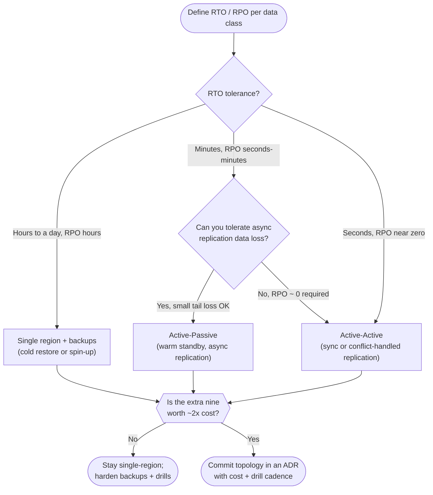

# Global Server Load Balancing — Staff

> **Axis:** organizational scope & judgment — NOT the mechanism of GSLB itself
> (DNS steering, anycast, health-based failover — that is `professional.md`). At staff
> scale, GSLB is not a routing feature you turn on; it is the visible tip of a
> **multi-region decision** that reshapes cost, on-call, data architecture, compliance,
> and how fast every team can ship. This file answers the questions a Staff/Principal
> engineer actually owns: is the second region worth roughly doubling your bill and
> complexity, or is a single region with good backups the honest answer? Do you buy
> managed global steering (Route 53 / Cloudflare / GCLB / Akamai) or build it? What is
> the *organizational discipline* — regular failover drills — that turns a paper DR plan
> into a real one? When does data residency force regional pinning regardless of your
> topology preference? And crucially: how do you stop teams from going multi-region
> *prematurely* because it sounds like maturity?

---

## Table of Contents

1. [The Reframe: GSLB Is a Business/DR Decision, Not a Feature](#1-the-reframe-gslb-is-a-businessdr-decision-not-a-feature)
2. [RTO and RPO Are the Inputs — Topology Is the Output](#2-rto-and-rpo-are-the-inputs--topology-is-the-output)
3. [The Topology Decision Tree](#3-the-topology-decision-tree)
4. [Single-Region vs Active-Passive vs Active-Active](#4-single-region-vs-active-passive-vs-active-active)
5. [The Real Cost of the Second Region](#5-the-real-cost-of-the-second-region)
6. [Buy vs Build the Global Steering Layer](#6-buy-vs-build-the-global-steering-layer)
7. [DR Drills: The Discipline That Makes Failover Real](#7-dr-drills-the-discipline-that-makes-failover-real)
8. [Data Residency and Compliance Force Regional Pinning](#8-data-residency-and-compliance-force-regional-pinning)
9. [When NOT to Go Multi-Region](#9-when-not-to-go-multi-region)
10. [Second-Order Consequences and the Staff Checklist](#10-second-order-consequences-and-the-staff-checklist)
11. [References](#11-references)

---

## 1. The Reframe: GSLB Is a Business/DR Decision, Not a Feature

Engineers reach for GSLB and hear "route users to the nearest healthy region." That
framing is a trap, because it hides where the cost lives. The GSLB config — a few
health checks and a DNS policy — is the cheap 5% of a multi-region program. The
expensive 95% is everything the config *implies*: a second copy of your data with a
replication strategy, a story for conflicting writes, doubled infrastructure and
doubled on-call surface, cross-region network egress bills, deploys that must land
consistently in N places, and a DR plan you actually rehearse.

The staff-level reframe: **the question is never "should we add GSLB," it is "should we
be multi-region at all, and if so, what availability posture does the business need to
pay for?"** GSLB is merely the traffic-steering *implementation* of an answer to that
business question. If you get the business question right, the GSLB config is
straightforward. If you skip the business question, no amount of clever DNS steering
saves you — you will have paid double for a second region that silently diverges from
the first and fails the one time you needed it.

Two forces make this a business decision, not a technical one:

- **Availability has a price, and the buyer is the business, not infra.** Going from a
  well-run single region (~99.9%, roughly 8.8 hours/year of allowed downtime) to a
  true active-active posture (~99.99%+) is not a config change — it can double
  steady-state cost and multiply operational complexity. Someone has to decide the
  extra nine is worth it. That someone is a product/business owner, informed by you.
- **Multi-region is mostly a *data* problem wearing a *traffic* costume.** Steering
  requests across regions is easy. Keeping the data those requests touch correct,
  fresh, and conflict-free across regions is the hard part — and it is invisible in
  the GSLB layer.

---

## 2. RTO and RPO Are the Inputs — Topology Is the Output

The disciplined way to reach a topology is to start from two business-defined targets
and let them *derive* the architecture, rather than picking a fashionable topology and
back-filling a justification.

| Term | Definition | The business question it answers |
|------|-----------|----------------------------------|
| **RTO** — Recovery Time Objective | Maximum tolerable time to restore service after an incident | "How long can we be *down*?" |
| **RPO** — Recovery Point Objective | Maximum tolerable amount of data loss, measured in time | "How much recent *data* can we lose?" |

These are not engineering preferences; they are commitments the business makes to its
customers and, often, to regulators. Your job at staff level is to force the
conversation that pins them to *numbers*, then map those numbers to the cheapest
topology that meets them. A few load-bearing observations:

- **RTO and RPO are set per data class, not per company.** Payment ledgers may demand
  RPO ≈ 0 (zero acceptable loss) and RTO of minutes; a "recently viewed items" cache
  may tolerate RPO of hours and RTO of a day. Applying the ledger's targets to
  everything is how budgets get destroyed. Segment by criticality.
- **RPO drives the replication mechanism.** RPO ≈ 0 forces *synchronous* replication
  (a write is not acknowledged until a second region has it), which taxes every write
  with cross-region latency. A relaxed RPO (seconds to minutes) permits *asynchronous*
  replication — cheaper and lower-latency, at the price of losing the in-flight tail on
  failover.
- **RTO drives the topology's readiness.** A tight RTO (seconds/minutes) means the
  standby must be *already running and warm* — that is active-passive or active-active.
  A loose RTO (hours) permits cold recovery: restore from backup into a region you spin
  up on demand, which is dramatically cheaper.

The mistake to catch in review: a team that has chosen active-active but cannot state
its RTO/RPO in numbers. That is topology-first thinking, and it is almost always
over-built.



---

## 3. The Topology Decision Tree

Above the per-data-class RTO/RPO mapping sits a coarser judgment: how many regions, and
in what posture. The staged decision below is the one to walk a leadership audience
through — it makes the cost/availability trade explicit at each fork rather than
presenting active-active as the obvious "grown-up" choice.

```mermaid
stateDiagram-v2
    [*] --> AssessBlastRadius
    AssessBlastRadius: What outage does the business actually fear?
    AssessBlastRadius --> SingleRegion: Fears an AZ or rack failure
    AssessBlastRadius --> RegionalDR: Fears losing a whole region
    AssessBlastRadius --> GlobalLatency: Fears slow users across continents

    SingleRegion: Single region, multi-AZ
    SingleRegion --> [*]: Cheapest; survives AZ loss; NOT a region

    RegionalDR: Needs to survive a region loss
    RegionalDR --> ActivePassive: RTO minutes, RPO seconds-minutes
    RegionalDR --> Backups: RTO hours acceptable
    Backups: Single region + cross-region backups
    Backups --> [*]: Region loss = long restore, honest + cheap
    ActivePassive --> [*]: Warm standby; drill or it is fiction

    GlobalLatency: Users span continents
    GlobalLatency --> ActiveActive: Willing to solve multi-region data
    ActiveActive --> [*]: Lowest global latency + highest cost/complexity
```



The critical distinction this tree surfaces, and that junior designs routinely miss:
**multi-AZ within one region is not multi-region.** A well-architected single region
spread across three availability zones already survives the failure of a data center,
a rack, or a power domain — the failure modes that occur most often. It does *not*
survive the loss of the whole region (a region-wide control-plane outage, a fat-finger
that deletes the region's account resources, a regional network partition). Many teams
that "need multi-region" actually needed multi-AZ, which they may already have. Ask
which specific failure the second region is buying protection against before approving
its cost.

---

## 4. Single-Region vs Active-Passive vs Active-Active

This is the core comparison. Every column is a real bill and a real operational
burden, not a checkbox.

| Dimension | Single Region (multi-AZ) | Active-Passive (warm standby) | Active-Active |
|-----------|--------------------------|-------------------------------|---------------|
| **Survives AZ loss** | Yes | Yes | Yes |
| **Survives region loss** | No (restore from backup) | Yes, via failover | Yes, transparently |
| **Typical RTO** | Hours (cold restore) | Minutes (promote standby) | Seconds (already serving) |
| **Typical RPO** | Minutes–hours (backup cadence) | Seconds–minutes (async repl.) | ≈ 0 possible (sync / conflict-handled) |
| **Steady-state cost** | 1× (baseline) | ~1.4–1.8× (standby often smaller/warm) | ~2×+ (full duplicate + egress) |
| **Data replication** | None cross-region (backups only) | One-way async, primary → standby | Bidirectional; conflicts must be resolved |
| **Write path** | Local, simple | Local to primary; standby read-only | Multi-master or region-pinned writes |
| **Operational complexity** | Low | Medium (failover runbook + drills) | High (conflict handling, split-brain, quorum) |
| **Deploy surface** | 1 place | 2 places, must stay compatible | N places, must stay consistent live |
| **Failure mode to fear** | Region loss = long outage | Standby stale or untested on the day | Split-brain, divergent data, conflict bugs |
| **Best fit** | Most products, most of the time | Clear DR requirement, write-mostly-single | Global low-latency + genuine 4-nines need |

Reading the table as a staff engineer:

- **Single-region is the honest default, and it is not "unserious."** For the large
  majority of products, a multi-AZ single region plus disciplined cross-region backups
  meets the real RTO/RPO. Choosing it deliberately — and writing down *why* — is a sign
  of maturity, not a lack of it.
- **Active-passive buys region survival at manageable cost, but the standby is a lie
  until you fail over to it.** The entire value proposition depends on the standby
  actually working on the day. A standby that has never taken production traffic is
  Schrödinger's DR: simultaneously working and broken until observed, and it is always
  observed at the worst possible moment. Section 7 is about resolving that.
- **Active-active is the most expensive and most complex, and its dominant cost is not
  the second set of servers — it is the multi-region data problem.** The moment both
  regions accept writes, you inherit conflict resolution, causal ordering, and
  split-brain avoidance. That complexity leaks into every service and every schema.
  Justify it with a genuine global-latency or 4-nines-plus requirement, not with the
  aesthetic appeal of "no primary."

---

## 5. The Real Cost of the Second Region

"Roughly double" is the headline, but the doubling is distributed across categories
that are easy to under-count in a business case. Enumerate all of them, because the
half you forget is the half that surprises finance a quarter later.

```text
Cost model — going from 1 region to 2 (active-passive, illustrative shape):

  Compute:        + full or near-full duplicate of the fleet (warm standby ≈ 60-100%)
  Storage:        + a second copy of all durable data
  Cross-region
    egress:       + continuous replication traffic (often billed per GB, per direction)
  Managed data:   + second cluster / second regional endpoint (DB, cache, queues)
  Global steering:+ health checks + DNS/anycast policy (small $, but adds a dependency)
  People:         + on-call now covers 2 regions, 2 deploy targets, failover runbooks
  Deploy tooling: + pipelines must fan out and verify per-region consistency
  Testing:        + recurring DR-drill time (engineer-hours, quarterly)
  Cognitive load: + every team reasons about "which region," data locality, staleness

Rule of thumb: infra roughly doubles; OPERATIONAL and COGNITIVE cost more than doubles,
because complexity compounds — every service now has a cross-region dimension.
```

Three staff-level cost insights that change decisions:

1. **The cheapest line item (GSLB steering) advertises the most expensive program.**
   Do not let the small DNS/health-check bill anchor the conversation. Price the whole
   program, or you will approve the tip and discover the iceberg.
2. **Egress is a silent, load-scaling tax.** Cross-region replication and any
   cross-region service calls are billed continuously and grow with traffic. A design
   that chats across regions on the hot path can make the second region cost *more* than
   the first. Keep the hot path region-local; replicate asynchronously off the critical
   path where RPO allows.
3. **The break-even is an availability calculation, not a gut call.** Model it: what is
   the expected cost of the outages the second region prevents (probability × duration ×
   revenue-per-minute × reputational factor) versus the annualized cost of running it?
   For many businesses, a rare few-hours regional outage recovered from backup is
   cheaper to *absorb* than to *prevent* with a permanent second region. Put that number
   in the ADR so the decision is auditable, not vibes.

---

## 6. Buy vs Build the Global Steering Layer

Separate two decisions that get conflated. **Being multi-region** is the expensive
program (Sections 2–5). **The global steering layer** — the thing that health-checks
regions and directs users to a healthy, near one — is a much smaller decision, and here
the answer is almost always *buy*.

| Option | When it wins | Hidden cost / risk |
|--------|-------------|--------------------|
| **Buy — managed global LB / DNS steering** (Route 53, Cloudflare, Google Cloud LB, Azure Front Door, Akamai) | Almost always; steering is a commodity, not a differentiator | Lock-in to the provider's health-check and failover semantics; another external dependency on the critical resolution path |
| **Build — self-run GeoDNS / anycast** | You have unusual steering logic, extreme scale economics, or a hard requirement to avoid a specific provider | You now operate a globally distributed, correctness-critical system; anycast + BGP expertise; you own every edge failure at 3 a.m. |
| **Adopt open-source** (e.g. self-hosted authoritative DNS + custom health orchestration) | Middle ground with control needs and staffing to match | Operational burden of a global control plane; you inherit the DNS-TTL and caching pitfalls the managed providers have already solved |

The judgment:

- **Global steering is commodity; buy it.** Directing traffic to the nearest healthy
  region is a solved problem that specialized providers do better, cheaper, and with
  more global points of presence than you can justify building. Building your own GeoDNS
  or anycast fabric is a multi-year platform commitment that pays off for a handful of
  companies on Earth. If you are asking whether you are one of them, you are not.
- **What you cannot buy is the multi-region-readiness of your data and deploys.** The
  provider steers traffic; it does not make your standby correct, your replication
  conflict-free, or your failover rehearsed. Do not let a slick managed-failover feature
  create the illusion that buying the steering layer buys you DR. It buys you the
  *steering*; you still own the *readiness*.
- **Understand the provider's failover semantics before relying on them.** Managed
  health checks have their own thresholds, and DNS-based failover inherits client and
  resolver caching (TTLs) that mean "instant failover" is often minutes in practice.
  Know these limits — they set your realistic RTO floor when steering is DNS-based.
  Anycast-based approaches shift failover into the network and can be faster, but move
  the complexity into routing you do not control.

---

## 7. DR Drills: The Discipline That Makes Failover Real

This is the section that separates organizations with real multi-region resilience from
those with an expensive second region and a false sense of security. **An
untested failover path does not exist.** It is documentation that describes a system you
*hope* behaves as written, and hope is not a recovery strategy.

Why standbys rot without drills:

- **Configuration drift.** The primary evolves — new services, new secrets, new schema,
  new dependencies — and the standby silently falls behind unless every change is
  enforced symmetrically. On the day of failover you discover the standby is missing the
  service you shipped last month.
- **Capacity assumptions go stale.** Traffic grew; the warm standby was sized for last
  year. It comes up and immediately falls over under real load.
- **The runbook goes stale.** The one person who knew the promotion steps left. The
  runbook references a console that was redesigned. The DNS change requires an approval
  nobody is awake to give.
- **Untested dependencies.** The standby's database can be promoted, but the message
  queue in that region was never provisioned, or the third-party API allowlists only the
  primary's egress IPs.

The organizational discipline that fixes this is **regular, scheduled, blameless
failover drills** — treating DR the way you treat backups (a backup you have never
restored is not a backup). A workable cadence and maturity ladder:

```text
DR-drill maturity ladder (increasing confidence, increasing nerve):

  L0  Paper exercise      — walk the runbook in a room. Finds stale docs. Weak signal.
  L1  Standby smoke test  — promote standby in isolation, verify it can serve. No user traffic.
  L2  Scheduled failover  — cut a fraction / all real traffic to the standby on a planned date,
                            business-hours, engineers watching. THIS is the real test.
  L3  Regular game days   — quarterly (or better), rotate who runs it, inject surprises.
  L4  Continuous / chaos  — automated region-evacuation exercises; failover is boring because routine.

Target: at least L2 on a fixed cadence (e.g. quarterly). If you cannot bring yourself to
fail over on purpose during business hours, you do not actually believe your DR works —
and neither should leadership.
```

Staff-level framing for leadership: the drill is not overhead you tolerate; it is the
*only thing that converts the second region's cost into actual insurance*. A budget line
for a standby without a budget line for the engineer-hours to drill it is a budget for a
prop. Make the drill cadence a first-class commitment in the same ADR that approves the
topology.

```mermaid
sequenceDiagram
    autonumber
    participant Ops as On-call / DR Lead
    participant GSLB as Global Steering (managed)
    participant RA as Region A (primary)
    participant RB as Region B (standby)
    Note over Ops,RB: Scheduled quarterly drill, business hours, comms sent
    Ops->>RB: 1. Verify standby health, capacity, config parity
    Ops->>RA: 2. Quiesce / mark region A draining
    Ops->>GSLB: 3. Shift traffic policy A → B
    GSLB-->>RB: 4. User traffic now steered to B
    Note over GSLB,RB: Observe: TTL/resolver lag = real RTO
    RB-->>Ops: 5. Serve production load; watch error budget, latency
    Ops->>Ops: 6. Record actual RTO/RPO vs target; log every gap
    Ops->>GSLB: 7. Fail back to A; capture drift + fixes as action items
```

---

## 8. Data Residency and Compliance Force Regional Pinning

Sometimes the topology is not yours to choose. Regulation can *require* that certain
data stay within certain borders, which turns a pure engineering optimization into a
legal constraint. This flips the usual multi-region motivation on its head: instead of
spreading data everywhere for availability and latency, you must *confine* specific data
to specific regions.

- **Residency laws pin data by jurisdiction.** Regimes such as the EU's GDPR (with its
  restrictions on transfers of personal data outside the EU/EEA) and various
  data-localization laws in other jurisdictions can force EU users' personal data to be
  stored and processed in-region. Health, financial, and government data frequently
  carry their own localization mandates. The details vary and change; the standing rule
  is: **confirm the current legal requirement with counsel — do not infer it from an
  architecture blog.**
- **Pinning breaks naive active-active.** A globally symmetric active-active design
  assumes any region can serve any user's data. Residency says region B is *not allowed*
  to hold region A's regulated data. The reconciliation is usually a **sharded-by-region
  data model**: user data is homed to the region matching its residency requirement, and
  requests for that user are steered — via GSLB — to the home region rather than the
  nearest one. Latency for that user is worse; compliance is non-negotiable.
- **This changes what GSLB optimizes for.** Its steering key stops being "nearest
  healthy region" alone and becomes "the region legally permitted to serve *this user's*
  data, and healthy." Residency is therefore not a footnote to the topology — it can be
  the *dominant* constraint that shapes the whole partitioning scheme.
- **Compliance also constrains failover.** If region B cannot legally hold region A's
  data, you cannot simply fail A's traffic over to B. Your DR plan for a residency-pinned
  region may require a *second region within the same jurisdiction* — which raises cost
  again and must be designed in from the start, not bolted on after an audit finding.

The staff takeaway: surface residency requirements *before* choosing a topology, because
they can invalidate the cheapest option and impose structure (region-homed data,
in-jurisdiction DR pairs) that dominates every later decision.

---

## 9. When NOT to Go Multi-Region

The most valuable thing a staff engineer contributes to this topic is often the word
"not yet." Multi-region has a gravity — it signals scale and maturity, and ambitious
teams are drawn to it before the business needs it. Push back when you see these
patterns:

- **No numeric RTO/RPO.** If the team cannot state, in numbers, how much downtime and
  data loss the business actually tolerates, they are not ready to choose a topology.
  Multi-region proposed without RTO/RPO is architecture as status symbol. Send them back
  to Section 2.
- **The feared failure is an AZ failure, not a region failure.** As Section 3 stresses,
  multi-AZ within one region already survives the common failures. If the proposal
  cannot name a specific *region-level* failure it prevents, it is buying an expensive
  cure for a disease it does not have.
- **The data problem is unsolved.** Steering traffic across regions before you have a
  coherent, tested story for replication, conflicts, and failover is building the roof
  before the foundation. If "how do we handle a write in both regions at once" gets a
  shrug, you are not ready for active-active.
- **You cannot afford to drill it.** If there is no organizational will to fail over on
  purpose (Section 7), the second region will rot into a costly non-functional standby.
  A multi-region program you will not rehearse is worse than a single region you will —
  it costs double and provides false confidence.
- **Premature scaling.** For a pre-product-market-fit company, engineering-months spent
  on active-active are months not spent finding customers. The correct DR posture for
  most early-stage systems is: multi-AZ, solid automated backups, a *tested* restore, and
  a documented (even if slow) recovery. That is cheap, honest, and sufficient — and it
  buys you the option to go multi-region later, when a real requirement, not an
  aspiration, demands it.

The reversibility lens seals it: single-region-with-backups is a **two-way door** — you
can add regions later. A sprawling active-active data model wired through every service
is closer to a **one-way door** — hard to unwind. When unsure, choose the reversible,
cheaper option and let a concrete requirement pull you across the threshold.

---

## 10. Second-Order Consequences and the Staff Checklist

**Downstream effects to anticipate 6–12 months after going multi-region:**

- **Every new service inherits the multi-region tax.** "Which region owns this data? How
  does it replicate? What is its failover story?" becomes a mandatory design question for
  work that used to be simple. Cognitive load rises org-wide, permanently.
- **Deploys get slower and riskier.** Shipping to N regions consistently, and detecting
  when they diverge, becomes a platform problem. Version skew across regions becomes a
  new class of incident.
- **The egress bill grows with success.** More users → more cross-region replication and
  chatter → a cost line that scales with the very growth you were celebrating. Watch it.
- **Consistency bugs are now user-visible.** Users who hit different regions can see
  stale or conflicting data. Support tickets that read like "it worked on my phone but
  not my laptop" are often region-steering artifacts.
- **The metric that tells you the decision is going wrong:** track your **actual
  measured RTO/RPO from real drills** against target, plus the **fraction of durable data
  under active cross-region replication** and its **egress cost trend**. If drill RTO
  drifts above target, or replication cost outpaces traffic growth, the program is
  decaying — investigate before it fails for real.

**Staff Checklist**

- [ ] RTO and RPO defined *in numbers*, *per data class*, and signed off by the business — not by infra alone.
- [ ] Topology (single / active-passive / active-active) derived *from* those targets, captured in an ADR (§35.1) with the cost model and break-even.
- [ ] "Multi-AZ vs multi-region" explicitly disambiguated; the specific *region-level* failure being bought against is named.
- [ ] Full cost modeled — compute, storage, cross-region egress, people, drill hours, cognitive load — not just the steering bill.
- [ ] Global steering layer *bought* (managed) unless a named, exceptional requirement justifies building; provider failover/TTL semantics understood as the RTO floor.
- [ ] A DR-drill cadence (target ≥ L2, e.g. quarterly) is funded and scheduled; the last drill's *actual* RTO/RPO is recorded against target.
- [ ] Data-residency/compliance requirements confirmed with counsel *before* topology choice; region-homed data and in-jurisdiction DR pairs designed in if required.
- [ ] "When NOT to go multi-region" reasoning written down so the next team does not cargo-cult the topology.
- [ ] Reversibility assessed: prefer the two-way-door option (single-region + backups) unless a concrete requirement pulls you across.

---

## 11. References

- Amazon Web Services — *Reliability Pillar*, AWS Well-Architected Framework (RTO/RPO definitions; single-region vs multi-region DR strategies: backup-and-restore, pilot light, warm standby, multi-site active-active). https://docs.aws.amazon.com/wellarchitected/latest/reliability-pillar/welcome.html
- Amazon Web Services — *Disaster Recovery of Workloads on AWS: Recovery in the Cloud* (whitepaper). https://docs.aws.amazon.com/whitepapers/latest/disaster-recovery-workloads-on-aws/disaster-recovery-workloads-on-aws.html
- Google — *Site Reliability Engineering* (Beyer, Jones, Petoff, Murphy, eds.), O'Reilly, 2016 — chapters on availability targets, error budgets, and testing for reliability. https://sre.google/sre-book/table-of-contents/
- Google Cloud — *Disaster recovery planning guide* (RTO/RPO, cold/warm/hot patterns). https://cloud.google.com/architecture/dr-scenarios-planning-guide
- Amazon Route 53 — *Choosing a routing policy* (latency, geolocation, failover, health checks). https://docs.aws.amazon.com/Route53/latest/DeveloperGuide/routing-policy.html
- Microsoft — *Azure Well-Architected Framework: Reliability* (recovery targets, multi-region strategies). https://learn.microsoft.com/en-us/azure/well-architected/reliability/
- European Commission — *General Data Protection Regulation (GDPR)*, official text and rules on international data transfers. https://commission.europa.eu/law/law-topic/data-protection_en

*Next step:* [Global Server Load Balancing — Interview](interview.md)
