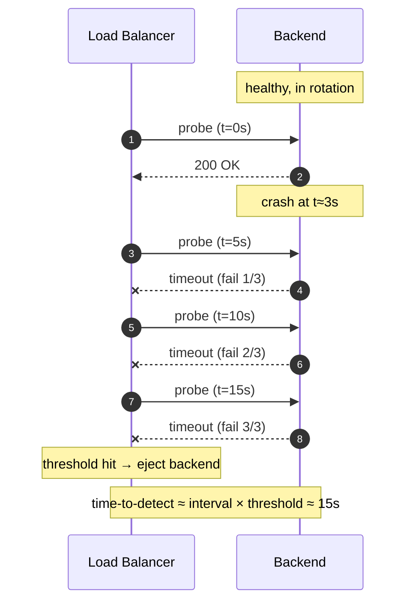
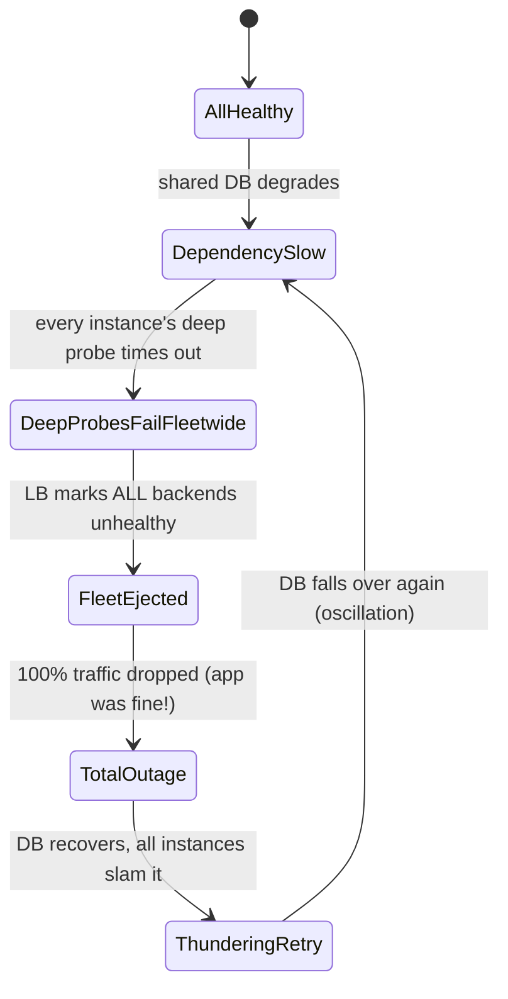
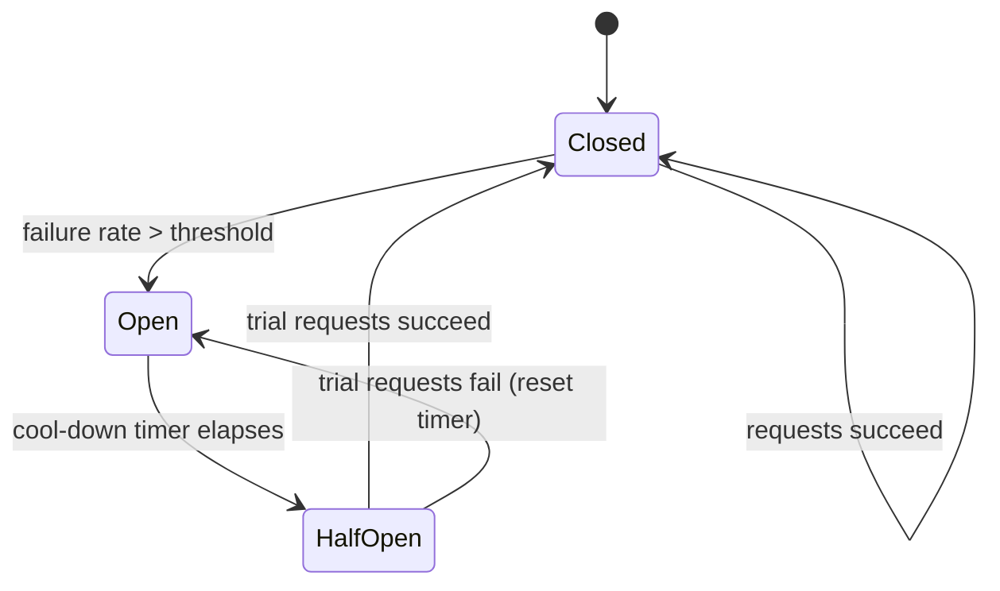

# Health Checks and Failover — Interview

Interview questions for **health checking and failover** at the load-balancer / service tier. Answers are terse on purpose — say the crisp version out loud, then expand only if the interviewer probes. The recurring theme: a health check is a *classifier* that decides whether to send traffic to a backend, and every design choice is a trade-off between **time-to-detect** (catching real failures fast) and **stability** (not evicting healthy backends on noise).

## Contents
1. [Q1: What is a health check and who runs it?](#q1-what-is-a-health-check-and-who-runs-it)
2. [Q2: Active vs passive health checks?](#q2-active-vs-passive-health-checks)
3. [Q3: Liveness vs readiness — what's the difference?](#q3-liveness-vs-readiness--whats-the-difference)
4. [Q4: How do you tune interval and threshold? Derive time-to-detect.](#q4-how-do-you-tune-interval-and-threshold-derive-time-to-detect)
5. [Q5: What is connection draining and why is it needed on deploy?](#q5-what-is-connection-draining-and-why-is-it-needed-on-deploy)
6. [Q6: Explain the deep-health-check death spiral.](#q6-explain-the-deep-health-check-death-spiral)
7. [Q7: Shallow vs deep health checks — which should the LB probe?](#q7-shallow-vs-deep-health-checks--which-should-the-lb-probe)
8. [Q8: Explain circuit breaking and its three states.](#q8-explain-circuit-breaking-and-its-three-states)
9. [Q9: What is outlier detection and how does it differ from a health check?](#q9-what-is-outlier-detection-and-how-does-it-differ-from-a-health-check)
10. [Q10: What is flapping and how does hysteresis fix it?](#q10-what-is-flapping-and-how-does-hysteresis-fix-it)
11. [Q11: What is a false-healthy check and how do you catch it?](#q11-what-is-a-false-healthy-check-and-how-do-you-catch-it)
12. [Q12: How do you avoid evicting the whole fleet at once?](#q12-how-do-you-avoid-evicting-the-whole-fleet-at-once)
13. [Q13: How does failover interact with health checks across LB layers and DNS?](#q13-how-does-failover-interact-with-health-checks-across-lb-layers-and-dns)
14. [Q14: Should health checks fail open or fail closed?](#q14-should-health-checks-fail-open-or-fail-closed)
15. [Q15: Scenario — design health checking + graceful deploy for a service with a flaky dependency.](#q15-scenario--design-health-checking--graceful-deploy-for-a-service-with-a-flaky-dependency)
16. [Q16: What signals separate a great answer from a mediocre one?](#q16-what-signals-separate-a-great-answer-from-a-mediocre-one)

---

## Q1: What is a health check and who runs it?

> A health check is a periodic probe whose result answers one question: *should this backend receive traffic right now?* The **checker** is whoever routes traffic — a load balancer, a service mesh sidecar, a client-side LB library, or the orchestrator (Kubernetes kubelet). The **target** is a backend instance exposing a probe endpoint (e.g. `GET /healthz`) or a protocol-level signal (TCP connect, gRPC `Check`).
>
> Key framing for the interview: the health check is a **control loop**. It samples a signal, applies thresholds/hysteresis, and flips the backend between `in-rotation` and `out-of-rotation`. Everything else — draining, failover, circuit breaking — is built on this loop. The two failure modes to keep naming are **false-unhealthy** (evict a good backend, lose capacity) and **false-healthy** (keep a broken backend, serve errors).

---

## Q2: Active vs passive health checks?

> **Active (proactive):** the checker sends synthetic probes on a fixed interval (`GET /healthz` every 5 s) independent of real traffic. Detects failures even on idle backends; costs extra requests; can miss failures that only manifest under real request shapes.
>
> **Passive (reactive / in-band):** the checker infers health from *real* traffic — consecutive 5xx, connection resets, timeouts. Zero probe overhead and sees exactly what users see, but blind on idle backends and only reacts *after* real requests have already failed.
>
> Production systems run **both**: active checks bound the detection time and cover idle instances; passive checks (a.k.a. outlier detection, Q9) eject instances that pass the synthetic probe but fail real requests. Naming both, and why, is the signal interviewers want.

| Dimension | Active (probes) | Passive (in-band) |
|---|---|---|
| Trigger | Timer / interval | Real request outcomes |
| Overhead | Extra synthetic requests | None |
| Idle backend coverage | Yes | No |
| Detects real-traffic-only faults | Sometimes | Always |
| Reaction | Before users hit it | After some users hit it |
| Typical name | Load-balancer health check | Outlier detection / ejection |

---

## Q3: Liveness vs readiness — what's the difference?

> Different questions with different consequences on failure:
>
> - **Liveness** — "is the process wedged and unrecoverable?" A failed liveness check means *restart me*. Deadlock, unrecoverable panic loop, exhausted event loop. Keep it dead simple and dependency-free; it should almost never fail.
> - **Readiness** — "am I able to serve traffic right now?" A failed readiness check means *stop sending me traffic, but don't kill me* — the instance may recover (warming caches, JIT still cold, at connection-pool capacity, a transient dependency blip).
>
> The classic bug: putting a dependency check (DB ping) in **liveness**. Now a shared DB hiccup makes every pod fail liveness → the orchestrator restarts the entire fleet simultaneously → mass cold-start → the outage is worse and self-inflicted. Dependency health belongs in **readiness** (drain, don't kill), and even there it must be handled carefully (Q6). Kubernetes adds a **startup** probe to gate the other two during slow boot so a long warm-up isn't misread as liveness failure.

---

## Q4: How do you tune interval and threshold? Derive time-to-detect.

> Two knobs per direction. `interval` = probe period. `unhealthy_threshold` = consecutive failures before eviction. `healthy_threshold` = consecutive successes before re-admission. `timeout` = how long a single probe waits.
>
> **Worst-case time-to-detect ≈ `interval × unhealthy_threshold` (+ up to one `timeout`).** Example: 5 s interval × 3 failures = ~15 s to eject a dead backend, plus the request errors users eat during that window.
>
> The tension:
> - Lower interval / threshold → faster detection, but **more false-unhealthy evictions** from transient blips, and more probe load on backends.
> - Higher interval / threshold → stable, but slow to eject a genuinely dead node → longer error window for users.
>
> Rules of thumb: keep `timeout < interval` (never let a probe overrun its own period). Use `unhealthy_threshold ≥ 2–3` to ride out single-probe noise. Make **re-admission slower than eviction** (`healthy_threshold > unhealthy_threshold`) — this is deliberate hysteresis so a flapping backend doesn't bounce back into rotation (Q10). Budget the error window against your SLO: if 15 s of one backend's errors blows the error budget, either shorten the window or ensure the LB retries the failed request on a healthy peer so users never see it.



---

## Q5: What is connection draining and why is it needed on deploy?

> **Connection draining** (a.k.a. deregistration delay / graceful shutdown): when an instance is being removed — deploy, scale-in, failed health check — the LB **stops sending new requests** to it but **lets in-flight requests finish** for a bounded grace period before the instance is killed.
>
> Without it, a rolling deploy that kills a pod mid-request produces a burst of 502/504s and reset connections for exactly the requests that were in flight — a self-inflicted error spike on every deploy.
>
> The correct graceful-shutdown sequence, and the subtle ordering that trips people up:
> 1. Instance flips its **readiness** probe to `NOT_READY` (or the orchestrator marks it Terminating).
> 2. LB observes this and stops routing **new** connections — but propagation is *not instant* (probe interval + control-plane latency).
> 3. **Therefore the app must keep accepting new requests during the gap** — sleep `preStop` for a few seconds *before* closing the listener, or new requests race a closed socket and 502. This "fail readiness, then wait, then stop" ordering is the classic zero-downtime-deploy gotcha.
> 4. After the drain window, finish in-flight work, close listeners, exit. Long-lived connections (WebSocket/gRPC streams) need an application-level "server is going away → reconnect" (GOAWAY) since they won't drain on their own.

---

## Q6: Explain the deep-health-check death spiral.

> A **deep health check** validates dependencies (DB, cache, downstream services) inside the probe. The death spiral (a.k.a. cascading / correlated failure):
>
> 1. A shared dependency degrades — say the DB gets slow, not dead.
> 2. **Every** backend's deep probe now fails or times out *simultaneously* because they all depend on that one thing.
> 3. The LB, seeing all backends unhealthy, ejects **the entire fleet at once**.
> 4. Now 100% of traffic is dropped even though the app instances themselves are perfectly fine and the DB was only *slow*. A partial, recoverable degradation is amplified into a total outage.
> 5. Worse, when the DB recovers, all instances re-admit together and slam it with retried/queued load → it falls over again → oscillation.
>
> The core error: a health check is meant to detect *this instance's* fault, but a deep check reports a *shared, correlated* fault, so failures are perfectly correlated and there is no healthy peer to fail over to. The fixes are Q7 (shallow-vs-deep split) and Q12 (minimum-healthy floor / fail-open on mass failure).



---

## Q7: Shallow vs deep health checks — which should the LB probe?

> **Shallow** = "is *this process* alive and able to accept a connection and run its own event loop?" — no downstream calls. **Deep** = "can I complete a real transaction end-to-end, including dependencies?"
>
> Guidance: the **load-balancer / orchestrator probe should be shallow** (or only check dependencies the instance *uniquely* owns). Deep checks belong to **monitoring/alerting** and to per-dependency circuit breakers, not to the traffic-routing decision — because a deep check turns a shared dependency's degradation into fleet-wide ejection (Q6).
>
> The rule: *the health check should test what is specific to this instance, not what is shared across the fleet.* If a failing dependency is shared by everyone, ejecting instances for it removes capacity without providing any healthy target to route to. Instead, let requests fail fast via a circuit breaker on that dependency and keep the instances in rotation so partial functionality (cached reads, other endpoints) still serves.

| | Shallow check | Deep check |
|---|---|---|
| Tests | Process liveness, own event loop | Full path incl. DB/cache/downstream |
| Failure correlation | Independent per instance | Correlated across fleet |
| Right consumer | LB / orchestrator routing | Monitoring, dashboards, alerts |
| Death-spiral risk | Low | High if wired to routing |
| Detects app bug | Limited | Yes |

---

## Q8: Explain circuit breaking and its three states.

> A **circuit breaker** protects a *caller* from a failing *callee*: instead of hammering a downstream that's clearly broken (piling up timeouts, exhausting threads/connections, cascading the failure upstream), it **fails fast** once error rates cross a threshold. Three states:
>
> - **Closed** (normal): requests flow through. Track a rolling failure rate. On breach (e.g. >50% errors over N requests), **trip to Open**.
> - **Open** (tripped): requests are rejected *immediately* without calling the downstream — return a fast error or fallback. After a cool-down timer, move to Half-Open.
> - **Half-Open** (probing): allow a small number of trial requests through. If they succeed → **Close** (recovered). If they fail → back to **Open** (reset the timer). This is what prevents slamming a still-fragile dependency the instant it comes back.
>
> Why it belongs in this topic: circuit breaking is the *right* response to the shared-dependency problem that a deep health check gets wrong (Q6/Q7). The breaker sheds load on the bad dependency and lets the instance stay healthy and serve everything else.



---

## Q9: What is outlier detection and how does it differ from a health check?

> **Outlier detection** (Envoy's term; conceptually passive ejection) watches *real* traffic per host and temporarily ejects a backend that behaves worse than its peers — e.g. consecutive 5xx, consecutive gateway failures, or latency far above the fleet median (success-rate variance / statistical outlier).
>
> Difference from an active health check:
> - Active health check: **synthetic** probes, absolute pass/fail against a fixed endpoint.
> - Outlier detection: **real** request outcomes, *relative* — "this host is doing worse than the others."
>
> It catches the case active checks miss: a backend that answers `/healthz` with 200 but returns errors or crawls on real requests (bad deploy on one host, degraded disk, GC death, a poisoned cache). Ejection is **time-boxed with backoff** — eject for `base × ejections` (exponential), then re-admit and watch — and gated by a **max-ejection-percent** so a fleet-wide fault can't eject everyone (Q12). Naming outlier detection as the complement to active checks is a strong senior signal.

---

## Q10: What is flapping and how does hysteresis fix it?

> **Flapping** = a backend oscillating rapidly between healthy and unhealthy (pass, fail, pass, fail…), usually because it's *marginal* — right at a timeout boundary, or a GC-pausing instance. Every flip is expensive: connections reset, caches/pools churn, traffic reshuffles, alerts fire. A flapping backend can be worse than a cleanly dead one because it keeps re-entering rotation and taking real traffic it can't serve.
>
> **Hysteresis** = making the two transitions asymmetric so the system resists rapid flipping:
> - Require **multiple consecutive** failures to eject and **more** consecutive successes to re-admit (`healthy_threshold > unhealthy_threshold`).
> - Add a **cool-down / minimum-out-of-rotation time** and exponential backoff on repeated ejections (as outlier detection does) so a repeat offender stays out longer each time.
> - Optionally damp the health *signal* itself (rolling window / EWMA) rather than reacting to a single probe.
>
> The intuition: eviction should be *fast* (protect users) but re-admission should be *cautious* (don't trust a shaky backend). That asymmetry is the whole point of hysteresis.

---

## Q11: What is a false-healthy check and how do you catch it?

> A **false-healthy** (false-positive) check reports 200/healthy while the instance is actually broken for real requests. Classic causes:
> - The probe endpoint is **too shallow** — `/healthz` just returns `200 OK` from a static handler and never touches any code path a real request uses. The app can be OOM-thrashing, its DB pool exhausted, or its cache poisoned, and the probe is oblivious.
> - The probe is served by a **different code path or thread** than real traffic (e.g. a separate admin listener that's fine while the main worker pool is deadlocked).
> - The probe checks the wrong thing (process up, but a required config/feature-flag failed to load).
>
> How to catch it:
> - **Outlier detection / passive checks** (Q9) — real request failures eject a backend the synthetic probe still calls healthy. This is the primary defense.
> - Make the probe exercise a **representative** path (same thread pool, a cheap real query) — but *not* a deep shared-dependency check (Q7); balance realism against the death spiral.
> - **Synthetic canary / black-box monitoring** that hits the real user-facing endpoint end-to-end.
> - Watch the divergence: probe-success-rate high while real-error-rate high is the tell-tale signature of a false-healthy check.

---

## Q12: How do you avoid evicting the whole fleet at once?

> Put a floor under eviction. Concretely:
> - **Minimum healthy percentage / panic threshold**: if the fraction of healthy backends drops below a floor (Envoy's default "panic mode" is 50%), the LB **stops honoring health status and routes to everyone** — the reasoning being that when *almost everything* looks unhealthy, the check itself (or a shared dependency) is more likely the culprit than every backend simultaneously, and dropping 100% of traffic is strictly worse than spraying it at possibly-degraded hosts. This is a deliberate **fail-open** on mass failure.
> - **max-ejection-percent** on outlier detection so passive ejection can never remove more than, say, 10% of hosts.
> - Keep the routing probe **shallow** (Q7) so shared-dependency degradation doesn't correlate all instances' health in the first place — attack the root cause.
> - Rate-limit / stagger evictions so you don't lose a large chunk of capacity in one control-loop tick.
>
> The unifying principle: **correlated failures should not trigger correlated eviction.** A health check is a good classifier for *independent* faults and a dangerous one for *shared* faults, so cap the blast radius.

---

## Q13: How does failover interact with health checks across LB layers and DNS?

> Failover happens at multiple layers, each with its own detection speed and blast radius:
>
> - **Within an LB (backend eviction):** fastest. The L4/L7 LB ejects a dead backend on threshold and, for L7, can **retry the failed request on a healthy peer** so the user sees nothing. Detection: seconds.
> - **LB / node redundancy:** the LB itself must not be a SPOF — active-passive with a floating VIP (VRRP/keepalived) or an active-active LB pool. Health of the *LB* is checked by the layer above it (another LB, an anycast fabric, or DNS).
> - **Cross-zone / cross-region (GSLB, DNS, anycast):** slowest and coarsest. DNS-based failover is bounded by **TTL + resolver caching + client caching**, so it's minutes, not seconds — never rely on DNS for fast failover. Anycast reroutes faster (BGP withdrawal) but at whole-PoP granularity.
>
> The interview point: **match the failover mechanism to the failure domain.** Instance dies → LB retry on a peer (sub-second, invisible). Zone dies → health-checked GSLB shifts traffic (tens of seconds to minutes). Keep TTLs low enough for DNS failover to be usable but not so low you melt your resolvers, and remember cached/misbehaving clients ignore TTL entirely.

---

## Q14: Should health checks fail open or fail closed?

> **Fail closed** = treat "can't determine health" as unhealthy → eject. **Fail open** = treat uncertainty as healthy → keep routing.
>
> The right choice is context-dependent and asymmetric:
> - **Single/independent failure** → fail *closed*. One backend's probe fails, eject it; there are healthy peers to absorb the load. Correct and safe.
> - **Mass/correlated failure** → fail *open*. If nearly all backends look unhealthy (Q12 panic mode), the check or a shared dependency is the likely fault; routing to degraded hosts beats dropping 100% of traffic. Serving stale/partial responses usually beats serving nothing.
> - **The checker itself losing visibility** (LB can't reach the control plane / health data is stale) → generally fail *open* and keep the last-known-good routing, because a monitoring outage should not cause a traffic outage.
>
> Great answers state the principle: *fail closed for the failures your redundancy can absorb; fail open when honoring the health signal would remove your last capacity.*

---

## Q15: Scenario — design health checking + graceful deploy for a service with a flaky dependency.

> **Setup:** Service `S` (N replicas behind an L7 LB) depends on downstream `D`, which is intermittently slow/erroring. Requirements: don't let `D`'s flakiness take `S` down; deploy `S` with zero user-visible errors.
>
> **Health-check design:**
> - **Liveness = shallow, dependency-free.** Only "is the process wedged?" A `D` blip must never restart `S` pods (Q3). High threshold, generous timeout.
> - **Readiness = shallow + own-state only** (listener up, pools initialized, warm-up done). **Do *not* put `D` in readiness** — otherwise a `D` degradation flips every replica to NOT_READY at once and ejects the whole fleet (Q6). `S` stays in rotation and serves everything not needing `D`.
> - **Isolate `D` behind a circuit breaker** (Q8) with a **fallback** (cached/last-known value, degraded feature, or a fast typed error). When `D` is bad: breaker Open → fail fast → `S` stays up and responsive. Half-Open probes bring `D` back without a thundering-herd retry.
> - **Add outlier detection** (Q9) so a single `S` replica that goes genuinely bad (poisoned cache, GC death) is ejected on real-traffic errors, with `max_ejection_percent ≈ 10%` (Q12) so a `D`-wide fault can't eject the fleet.
> - **Bulkhead** `D` calls (bounded connection pool / concurrency limit + timeouts) so slow `D` responses can't exhaust `S`'s threads and starve unrelated endpoints.
>
> **Graceful deploy (rolling, per replica):**
> 1. Flip readiness → NOT_READY (or mark Terminating).
> 2. **`preStop` sleep** (e.g. 5–10 s) so the LB propagates the deregistration *before* the listener closes — keep accepting new requests during the gap (Q5).
> 3. **Drain**: stop new connections, let in-flight requests finish within the grace window; send GOAWAY to long-lived streams.
> 4. Terminate, start the new version, gate it behind a **startup probe** so slow warm-up isn't misread as failure; only add back to rotation after `healthy_threshold` successes.
> 5. Respect `maxUnavailable` / a minimum-healthy floor so the rollout never drops capacity below what `S` needs.
>
> **Net:** `D`'s flakiness is contained by the breaker + bulkhead + shallow checks (no fleet ejection); the deploy is invisible because of readiness-then-drain-then-stop ordering plus LB retries on healthy peers.

```mermaid
sequenceDiagram
    autonumber
    participant U as User
    participant LB as L7 LB
    participant S as Service S (replica)
    participant CB as Circuit Breaker
    participant D as Flaky Dependency
    U->>LB: request
    LB->>S: route (S readiness=OK, shallow)
    S->>CB: call D
    alt D healthy (breaker Closed)
        CB->>D: forward
        D-->>CB: 200
        CB-->>S: result
    else D flaky (breaker Open)
        CB-->>S: fail fast → fallback (cached/degraded)
        Note over S,CB: S stays in rotation; no fleet ejection
    end
    S-->>LB: response (full or degraded)
    LB-->>U: 200
    Note over LB,S: on deploy: readiness=NOT_READY → preStop sleep → drain → stop
```

---

## Q16: What signals separate a great answer from a mediocre one?

> **Strong signals:**
> - Distinguishes liveness vs readiness *and* explains the consequence of each on failure (restart vs drain).
> - Names the deep-health-check death spiral unprompted and reaches for shallow checks + circuit breakers instead of deeper probes.
> - Derives time-to-detect as `interval × threshold` and ties it to the SLO / error budget.
> - Uses asymmetry deliberately: fast eviction, cautious re-admission (hysteresis); fail-closed for independent faults, fail-open for correlated ones.
> - Gets the deploy ordering right: readiness-off → wait for propagation → drain → stop (not the reverse).
>
> **Red flags:**
> - Putting dependency checks in liveness ("we ping the DB in `/health` and restart if it fails").
> - Assuming health-status propagation is instant, so new requests race a closed listener on deploy.
> - No blast-radius cap — happy to let the LB eject 100% of backends.
> - Conflating health checks with circuit breakers, or unaware that outlier detection (passive) even exists.
> - Relying on DNS/TTL for fast failover without acknowledging resolver/client caching.

---

*Next step:* [Horizontal Scaling — Junior](../horizontal-scaling/junior.md)
