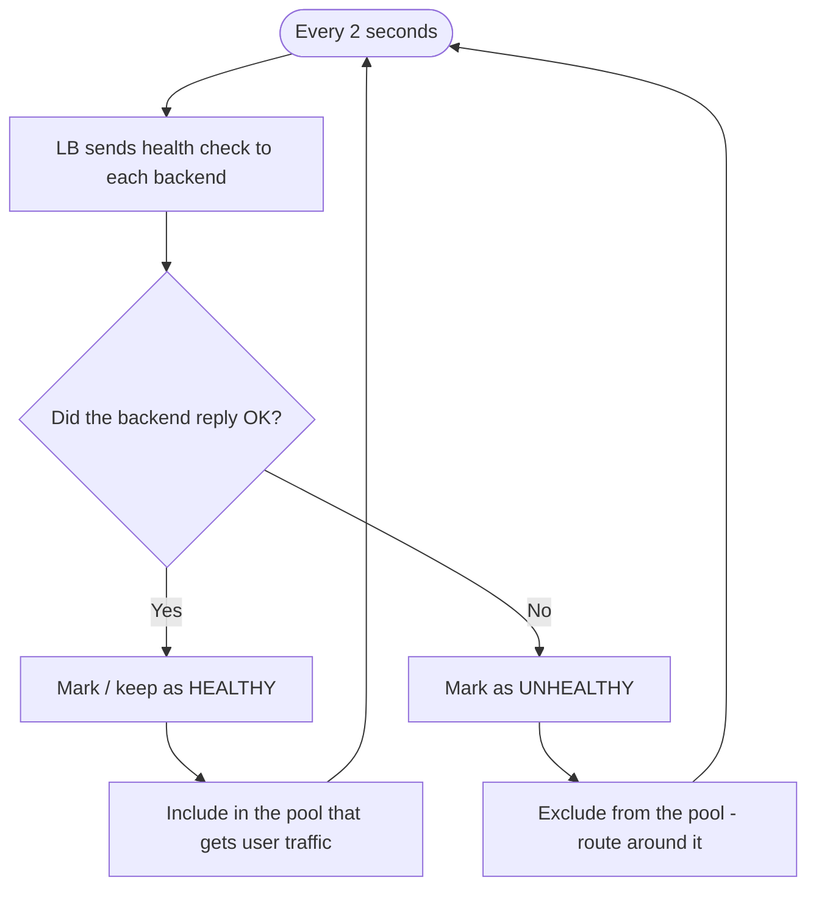
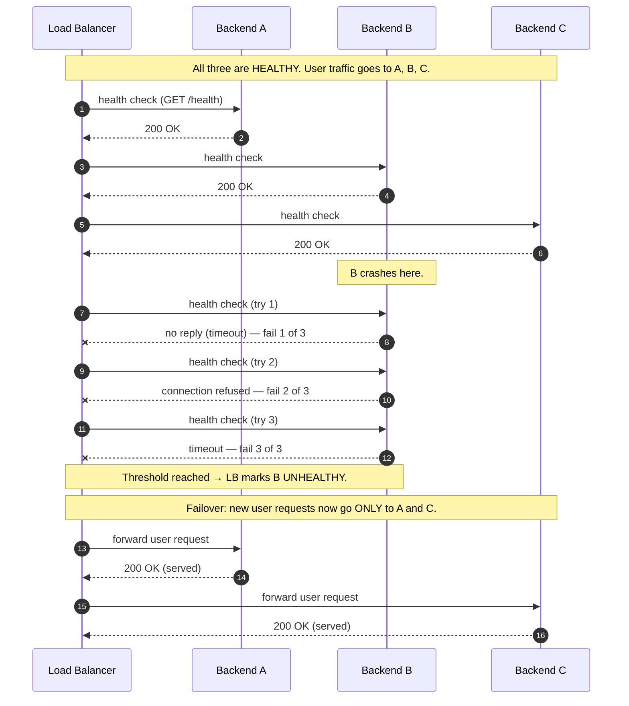

# Health Checks and Failover — Junior

<!-- level-focus -->
At junior level, focus on this question:

> How can I apply **Health Checks and Failover** in one small example and prove the result?

Use the smallest realistic scenario that exposes the decision and its failure behavior.
## 1. Why a Load Balancer Needs Health Checks

Imagine three servers (call them A, B, C) behind a load balancer, all running the same app. From the outside, users hit one address; the LB quietly forwards each request to A, B, or C. This is how large sites survive: any one server can die and users never notice — *if* the LB stops sending traffic to the dead one.

Here is the problem. Server B crashes at 2 a.m. — its process dies, or its disk fills, or it locks up. The LB has no magical knowledge that B is gone. If it keeps forwarding one-third of requests to B, one-third of your users get errors or timeouts. The LB looks like it's "up," but a third of traffic is falling into a hole.

A load balancer that does not check backend health is not fault-tolerant — it is a machine that reliably forwards traffic to broken servers. **Health checks are what turn a traffic splitter into a fault-tolerant front door.** They give the LB the one piece of information it's missing: *is this backend actually able to serve requests right now?*

## 2. The Core Idea: Probe, Mark, Route Around

The whole mechanism is three plain steps, repeated forever:

1. **Probe.** On a fixed interval (say every 2 seconds), the LB sends each backend a small test request — a "health check." The simplest is: open a TCP connection, or ask for a specific URL like `GET /health`.
2. **Mark.** The LB judges the reply. A good reply (connection succeeds, or the URL returns `200 OK`) counts as a pass. A bad reply — connection refused, timeout, or an error status like `500` — counts as a fail. The LB keeps each backend labeled **healthy** or **unhealthy**.
3. **Route around.** The LB only forwards real user traffic to backends currently marked *healthy*. An unhealthy backend is simply skipped — traffic is spread across whoever is left.

That's it. The LB doesn't "fix" anything; it just keeps an up-to-date list of who's healthy and refuses to send users to anyone who isn't.

One important refinement: a single missed probe usually is *not* enough to declare a backend dead. Networks hiccup; one packet gets lost. So real load balancers wait for a small run of failures in a row — a **threshold**, e.g. "3 failed checks" — before marking a backend unhealthy. This avoids yanking a perfectly good server out of rotation over one unlucky moment. We'll see this threshold in action next.

## 3. A Backend Fails — Step by Step

Let's watch a concrete failure. Three backends, probe interval 2 seconds, unhealthy threshold = 3 consecutive fails. Everything is fine, then Backend B crashes.

Read the story in the numbers:

- **Steps 1–6:** the normal rhythm. Every backend answers its probe, so all stay healthy and share the load.
- **B crashes.** Nothing tells the LB directly; it finds out only through probes.
- **Steps 7–12:** three probes to B fail back-to-back. Only when the *third* fails does the LB flip B to unhealthy. The threshold cost us a few seconds but protected us from overreacting to a blip.
- **Failover (steps 13–16):** the LB now spreads traffic across A and C only. B is skipped entirely. From the user's side, requests keep succeeding — no error page, just slightly more load on the two survivors.

Notice what *did not* happen: no human woke up, no config was edited, no deploy ran. Failover is automatic and takes seconds. The one visible cost is a short **detection window** — the handful of seconds between B actually dying and the LB noticing. Requests sent to B during that window may fail; that's the price of finding out via periodic probes rather than instant telepathy. Shorter intervals shrink the window (covered at higher tiers).

## 4. Healthy vs Unhealthy: What Changes

The label on a backend controls exactly one thing — whether it receives user traffic. Everything else follows from that.

| Aspect | Backend marked HEALTHY | Backend marked UNHEALTHY |
|---|---|---|
| Receives user requests? | Yes — it's in the active pool | No — the LB routes around it |
| Still being probed? | Yes, to confirm it stays healthy | Yes, to detect when it recovers |
| Effect on other backends | Shares the load normally | Its share is redistributed to the rest |
| Effect on end users | Normal responses | None directly — they never reach it |
| How it changes state | Fails checks past the threshold → unhealthy | Passes checks past the threshold → healthy |

Two things surprise newcomers. First, an *unhealthy backend is still probed.* Marking it unhealthy doesn't mean the LB forgets about it — the LB keeps knocking on its door so it can notice the moment the server answers again. Second, taking a backend out of rotation **increases load on the survivors.** If B is removed, A and C now handle B's traffic too. With three servers, losing one shifts each survivor from ~33% to ~50% of total load. This is why you keep enough spare capacity that the pool can absorb a failure without the remaining servers tipping over — a real risk when a pool is already running hot.

## 5. The Health States of a Backend

It's cleanest to picture each backend as a tiny state machine the LB tracks independently. The state only moves after enough consecutive checks agree — the thresholds are the guardrails that stop flapping back and forth on a single lucky or unlucky probe.

The **unhealthy threshold** (fail N in a row before dropping out) makes the LB slow to condemn a backend, so a momentary glitch doesn't cause needless failover. The **healthy threshold** (pass M in a row before rejoining) makes it slow to trust a backend again, so a server that recovers for one probe and immediately dies again isn't handed live traffic prematurely. Together they trade a little reaction speed for a lot of stability — a good deal, because a flapping pool is worse than a slightly slow one.

## 6. Kinds of Health Check

Not all probes are equally smart. The trade-off is *how much they tell you* versus *how simple and cheap they are.*

| Check type | What the LB does | What "pass" means | Catches | Misses |
|---|---|---|---|---|
| **TCP / connection** | Opens a TCP connection to the backend's port | Connection is accepted | Server down, process dead, port closed | App that accepts connections but returns errors |
| **HTTP** | Sends `GET /health` and reads the status code | Gets `200 OK` (not `5xx`/timeout) | Everything TCP catches, plus a crashed or erroring app | App that returns `200` but whose database is unreachable |
| **Custom / deep** | Hits an endpoint that checks the app's own dependencies (DB, cache, etc.) | Endpoint reports the app is truly ready | App-level problems the port alone can't reveal | Rare; costs more to run and can false-fail on shared deps |

The instinct is to reach for the deepest check, but there's a catch worth internalizing early. A basic **TCP check** confirms only that *something is listening on the port* — the app could be wedged and returning errors while the port stays open. An **HTTP check** is the common default: cheap, and it verifies the app actually processes a request and answers correctly. A **deep check** that also pings the database is the most truthful, but it's a double-edged sword: if one shared database goes down, *every* backend's deep check fails at once, and the LB marks the entire pool unhealthy — turning a degraded system into a total outage. As a junior, remember the shape of the trade-off: deeper checks tell you more but can take everything down together.

## 7. Recovery: Adding a Backend Back

Failover is only half the loop. The point of automatic health checking is that recovery is automatic too — no human has to remember to put a server back.

Because the LB keeps probing unhealthy backends, it will *see* B come back on its own:

1. An operator (or an auto-restart) brings B back up. Its app starts, opens its port, and `GET /health` starts returning `200`.
2. The LB's next probe to B succeeds. That's *one* pass — not yet enough, because of the healthy threshold.
3. B passes a few more probes in a row. Once it clears the healthy threshold (say 2 in a row), the LB flips B back to **healthy**.
4. B rejoins the active pool. New user requests start flowing to A, B, and C again, and the survivors' load drops back to a comfortable share.

The whole cycle — healthy → fail → out of rotation → recover → back in rotation — runs with zero manual traffic changes. That self-healing loop is the entire reason health checks exist: the system detects failure, routes around it, and reintegrates the recovered server, all on its own. A subtle real-world wrinkle to file away for later tiers: a server can *accept connections before it's truly ready* to serve (still loading data, warming caches). Good health endpoints don't report `200` until the app is genuinely ready — otherwise the LB sends traffic to a backend that isn't done starting up.

## 8. Key Terms

| Term | Definition |
|---|---|
| Backend | One of the interchangeable servers behind the LB that actually serves requests (also called an origin, target, or upstream). |
| Health check (probe) | A small test request the LB sends on an interval to decide if a backend is working. |
| Pool | The set of backends the LB currently considers healthy and eligible for user traffic. |
| Healthy / Unhealthy | The label the LB puts on each backend; only healthy ones receive user traffic. |
| Threshold | How many consecutive passes or fails are required before the label flips (prevents overreacting to one bad probe). |
| Interval | How often the LB probes each backend (e.g. every 2 seconds). |
| Failover | Automatically redirecting traffic away from a failed backend to the healthy ones. |
| Detection window | The short gap between a backend actually failing and the LB noticing via probes. |
| Flapping | A backend rapidly bouncing between healthy and unhealthy; thresholds exist to dampen it. |

## 9. Common Misconceptions

1. **"If the site's LB is up, users are fine."** No — the LB can be perfectly up while forwarding a third of traffic to a dead backend. Without health checks, "up" doesn't mean "serving correctly."
2. **"One failed probe means the server is dead."** No — networks drop the occasional packet. A threshold of several consecutive fails prevents evicting a healthy server over one blip.
3. **"An unhealthy backend is forgotten."** No — the LB keeps probing it precisely so it can detect recovery and add it back automatically.
4. **"A TCP check proves the app works."** No — it only proves the port is open. The app behind it could be returning errors on every request.
5. **"Removing a backend is free."** No — its traffic is redistributed to the survivors, raising their load. A pool with no spare capacity can cascade into failure when one node drops.
6. **"Deeper checks are always better."** No — a check that depends on a shared resource (like one database) can fail every backend at once, converting a partial problem into a full outage.

## 10. Hands-On Exercise

On paper, draw an LB in front of three backends A, B, C. Assume: probe interval = 2 seconds, unhealthy threshold = 3 consecutive fails, healthy threshold = 2 consecutive passes. Then answer:

1. B crashes at time `t = 0`. At roughly what time does the LB mark B unhealthy, and how many probes did that take? (This is your detection window.)
2. During that window, what happens to user requests the LB happens to send to B?
3. After B is out, what fraction of total traffic does each of A and C now carry? What if the pool had only *two* backends to start?
4. B is restarted at `t = 30 s` and immediately answers probes correctly. At roughly what time does it rejoin the pool, and why isn't it added back on the very first successful probe?
5. Suppose the health check is a *deep* check that also queries a shared database, and that database goes down. What does the LB do to A, B, and C — and why is that outcome worse than the single-backend crash you started with?

Write one or two sentences for each. If you can explain #5 clearly, you understand the core trade-off of health checking.

---

*Sources:* [Cloudflare — What is load balancing?](https://www.cloudflare.com/learning/performance/what-is-load-balancing/) · [NGINX — HTTP health checks](https://docs.nginx.com/nginx/admin-guide/load-balancer/http-health-check/) · [HAProxy — health checks](https://www.haproxy.com/documentation/haproxy-configuration-tutorials/service-reliability/health-checks/)

*Next step:* [Health Checks and Failover — Middle](middle.md)

---

## Apply it

1. Choose one small, known input for **Health Checks and Failover**.
2. Predict the output or observable behavior.
3. Run the smallest example or probe that exercises the concept.
4. Change one input to trigger a failure or boundary case.
5. Explain the evidence using the guide's vocabulary.

## Verify your work

- Record the exact input, command or code path, and output.
- Repeat the probe and confirm the result is consistent.
- Show one expected success and one expected failure.
- Resolve any difference between the prediction and the evidence.

## Review questions

- What problem does Health Checks and Failover solve in the example?
- Which input changes the observed result, and why?
- What is the smallest useful success check?
- Which beginner mistake would your evidence catch?
