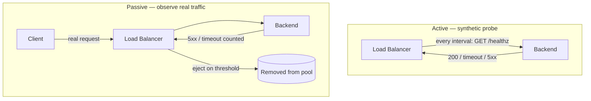
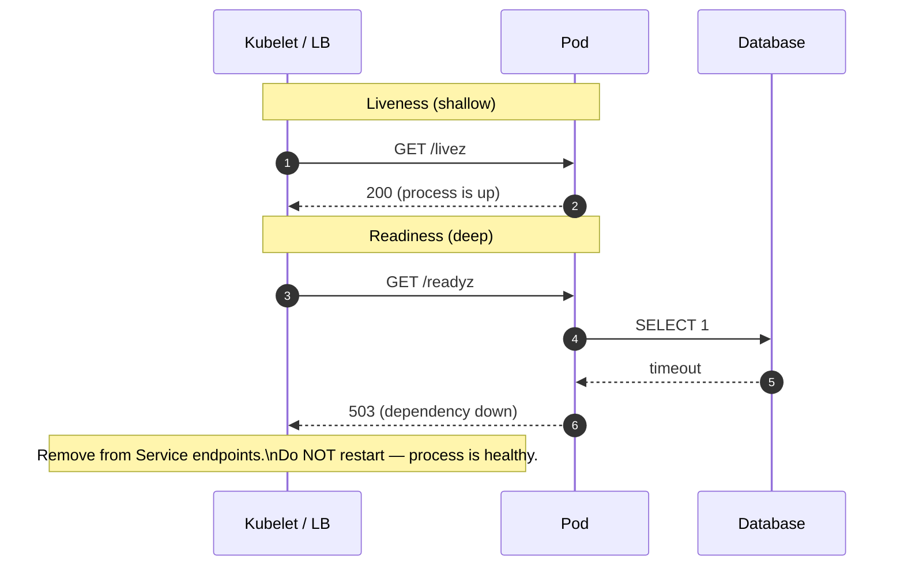
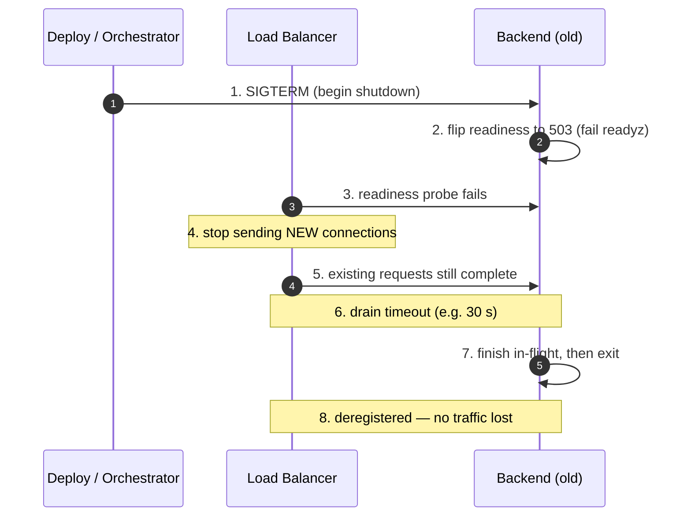

# Health Checks and Failover — Middle

<!-- level-focus -->
At middle level, focus on this question:

> Where does **Health Checks and Failover** belong in a maintainable component, and which trade-off selects the design?

Use the smallest realistic scenario that exposes the decision and its failure behavior.
## 1. Active vs passive health checks

There are two fundamentally different ways to learn a backend is sick, and mature systems use both.

**Active (out-of-band) health checks.** The LB sends a synthetic probe to each backend on a fixed schedule — an HTTP `GET /healthz`, a bare TCP connect, or a gRPC health RPC — and classifies the target by the response. Active checks are *proactive*: a backend can be pulled from rotation before a single real user request hits it. They also cost real traffic (N backends × probe rate) and, critically, they test a **synthetic path** — `/healthz` may return 200 while the endpoint users actually call is timing out.

**Passive (in-band) health checks.** The LB observes the outcomes of *real* client requests flowing through it — counting connection failures, timeouts, and 5xx responses per backend. When a backend crosses a failure threshold, it is ejected. Passive checks cost nothing extra and test the *real* path, but they are *reactive*: by definition some real users must fail before the backend is ejected. NGINX calls this `max_fails`/`fail_timeout`; Envoy calls it **outlier detection**; HAProxy has `observe layer7` with `on-error`.



| Dimension | Active (out-of-band) | Passive (in-band) |
|---|---|---|
| Trigger | Scheduled synthetic probe | Real request outcomes |
| Detection | Proactive — before users hit it | Reactive — after users fail |
| Path tested | Synthetic (`/healthz`) | Real production endpoints |
| Extra load | Yes — N × probe rate | None |
| Blind spots | Endpoint-specific failures the probe doesn't exercise | Low-traffic backends: too few samples to eject |
| Re-admission | Probe succeeds again | Timed backoff, then trial traffic |
| Examples | ALB target group, HAProxy `check`, k8s probes | NGINX `max_fails`, Envoy outlier detection |

**The rule:** active checks for admission and deploy safety; passive checks to catch the failures your synthetic probe can't see. Neither alone is sufficient.

---

## 2. Probe types: HTTP, TCP, gRPC

An active check is defined by *what layer it exercises*. Deeper layers catch more, but cost more and can false-positive on transient app hiccups.

**TCP connect (L4).** The LB opens a TCP connection to the target port and, on a successful handshake, marks it healthy (optionally closing immediately). This proves only that *something is listening* — the process is up and the port is bound. It says nothing about whether the app can serve requests. Cheapest and fastest; the right choice for non-HTTP protocols (databases, custom binary services) and as a coarse liveness signal. HAProxy's default `check` with no options is a TCP connect.

**HTTP(S) (L7).** The LB issues `GET <path>` and matches the response against an expected status (commonly `200`, or a range like `200-399`) and optionally a body substring. This proves the HTTP stack is up *and* the application handler ran to completion. It is the workhorse for web/API tiers. Two sub-decisions matter: the **path** (a dedicated `/healthz`, never `/` — the homepage may run expensive logic) and the **match** (a precise status; `2xx-3xx` masks a `301` redirect to a login page that means the app is actually broken).

**gRPC health checking.** gRPC services expose the standard `grpc.health.v1.Health/Check` service. The prober sends a `Check` RPC (optionally naming a specific service) and expects `SERVING`. This is the L7 equivalent for gRPC backends and lets one server report per-service health (e.g., `Payments=SERVING`, `Reporting=NOT_SERVING`). Kubernetes supports this natively via `grpc:` probes; Envoy and modern ALB/NLB configurations support gRPC health checks directly.

| Probe | Layer | Proves | Cost | Use for |
|---|---|---|---|---|
| TCP connect | L4 | Port is listening | Lowest | DBs, non-HTTP, coarse liveness |
| HTTP(S) GET | L7 | App handler runs, returns expected status | Medium | Web/API tiers |
| gRPC `Health/Check` | L7 | gRPC service reports `SERVING` | Medium | gRPC backends |

> A subtle trap: HTTP checks over HTTPS pay a TLS handshake per probe unless connections are reused. At high backend counts with short intervals this is measurable load — prefer keep-alive or a plain-HTTP health port behind the mesh.

---

## 3. The four tuning knobs

Every active health check is governed by four parameters. Getting them wrong gives you either flapping (too aggressive) or slow detection (too lax).

- **Interval** — how often the probe fires (e.g., every 5 s). Shorter = faster detection but more probe load.
- **Timeout** — how long to wait for a probe response before counting it a failure (e.g., 2 s). Must be **less than the interval**, or overlapping probes pile up.
- **Unhealthy threshold** — consecutive failed probes before the target is marked *unhealthy* and removed from rotation (e.g., 3).
- **Healthy threshold** — consecutive successful probes before an unhealthy target is marked *healthy* and returned to rotation (e.g., 2).

The two thresholds exist to damp **flapping**: a single dropped packet shouldn't eject a backend, and one lucky success shouldn't re-admit a still-crashing one. They deliberately create asymmetry — you generally want a lower unhealthy threshold (react fast to trouble) but keep the healthy threshold ≥ 2 (require sustained recovery).

**Detection latency is arithmetic, and you must budget it.** In the worst case a backend dies just after a successful probe:

```text
time-to-eject  ≈  interval × unhealthy_threshold  +  timeout
              e.g. 5 s × 3 + 2 s  =  17 s worst-case blackhole window

time-to-readmit ≈  interval × healthy_threshold
              e.g. 5 s × 2  =  10 s before traffic returns
```

During that ~17 s window, requests routed to the dead backend fail (unless a passive check or retry catches them sooner). Tightening it to `interval=2s, unhealthy=2, timeout=1s` cuts worst-case to ~5 s — at the cost of 2.5× probe traffic and higher flap risk on a saturated backend whose probe merely got queued behind real work.

| Parameter | Typical | Too low | Too high |
|---|---|---|---|
| Interval | 5–30 s | Probe storm; noise ejects busy backends | Slow detection |
| Timeout | 2–5 s (< interval) | Slow backend flagged as dead | Dead backend held in rotation |
| Unhealthy threshold | 2–3 | Flapping on transient blips | Long blackhole window |
| Healthy threshold | 2–5 | Re-admits still-broken backend | Slow recovery after a fix |

---

## 4. The unhealthy/healthy threshold state machine

A target is never simply "up" or "down" to the LB — it moves through states driven by consecutive probe outcomes. Modeling it as a state machine makes the flap-damping behavior explicit and shows exactly when traffic starts and stops.

Two details are load-bearing. First, a **single** success while in `Healthy` does not reset any counter that matters — but a **single** failure does *not* immediately eject either; the LB requires `unhealthy_threshold` *consecutive* failures, and any success in between resets the failure counter to zero. That reset is what damps flapping. Second, note that the transition out of `Healthy` on failure goes through **Draining**, not straight to dead — that is the graceful-removal path covered in §6. A backend that hard-crashes skips draining (its connections are already broken), but a backend that merely starts failing probes is drained politely.

---

## 5. Shallow vs deep: liveness vs readiness

The most consequential design choice in health checking is **how much the probe checks**. This is the shallow-vs-deep axis, and Kubernetes names the two ends precisely: **liveness** and **readiness**.

**Shallow / liveness — "is the process itself alive?"** The check touches nothing but the process: can it accept a connection and return 200 from a trivial handler? If liveness fails, the correct action is to **restart** the instance — it is wedged (deadlocked, out of memory, event loop blocked). Liveness must **never** check dependencies, because if the database is down, a liveness check that queries the DB will fail on *every* instance, causing Kubernetes to restart the entire fleet in a loop — turning a database blip into a total, self-inflicted outage. Liveness answers "restart me?"

**Deep / readiness — "can this instance serve a real request right now?"** The check exercises the actual work path and its critical dependencies: can I reach the database, is my connection pool warm, have I finished loading config, am I not overloaded? If readiness fails, the correct action is to **remove from rotation but do not restart** — the process is fine, it just isn't ready (still warming up, or a dependency is briefly unavailable). Readiness answers "send me traffic?"

The distinction maps directly to the two LB actions: **restart** vs **stop routing**. Conflating them is the classic outage. A dependency check wired into liveness converts "DB is slow for 30 s" into "every pod restart-loops," which is strictly worse than serving errors.



| Aspect | Liveness (shallow) | Readiness (deep) |
|---|---|---|
| Question | Is the process wedged? | Can I serve a request now? |
| Checks | Process only, trivial handler | Dependencies, pools, warmup, load |
| On failure | **Restart** the instance | **Remove from rotation**, keep running |
| Depends on DB/cache? | **Never** | Yes (carefully — see §9) |
| Startup | Use a separate startup probe | Fails until warm, then passes |
| k8s field | `livenessProbe` | `readinessProbe` |

> Kubernetes adds a third: the **startup probe**, which suspends liveness/readiness until a slow-booting app (JVM, large model load) is up — preventing liveness from killing an app that simply takes 90 s to start.

---

## 6. Connection draining and graceful deregistration

When a backend is removed — because it failed a check, or (far more common) because you are **deploying** — you must not sever its in-flight requests. **Connection draining** (AWS's term; also "graceful deregistration") stops routing *new* connections to the target while letting *existing* ones complete up to a **deregistration delay** / drain timeout, after which any stragglers are forcibly closed.

The deploy sequence that avoids dropped requests is a choreography, and its ordering is what makes rolling deploys silent:



The key insight — and the most common bug — is the **ordering of shutdown vs deregistration**. If the process exits (step 7) *before* the LB notices it's gone (steps 3–4), there is a window where the LB still routes new connections to a dead socket → connection-refused errors for real users. The fix, used by every graceful-shutdown implementation: on `SIGTERM`, first **flip readiness to failing** and *keep serving* for a grace period ≥ the LB's probe detection window, only *then* stop accepting new work and drain. In Kubernetes this is why a `preStop` hook with a `sleep` (or a readiness flip) is standard: it holds the pod alive long enough for the endpoints controller to remove it before the container dies.

**Drain timeout sizing:** set it to slightly above your longest legitimate request (e.g., a 30 s report generation → 35 s drain), but not so long that a deploy stalls waiting on a hung long-poll. Long-lived connections (WebSockets, gRPC streams, SSE) need special handling — they won't finish on their own, so you send a `GOAWAY`/close frame and rely on client reconnect to the drained-in replacement.

---

## 7. Failover behavior and its failure modes

Failover is what the LB *does* with a health verdict: reroute traffic away from unhealthy targets to healthy ones. In the simple case this is automatic and invisible — the target drops out of the pool, the balancing algorithm distributes its share across the survivors. But failover introduces its own failure modes that middle engineers must anticipate.

**Load redistribution and the cascade.** When a backend is ejected, its traffic doesn't vanish — it lands on the remaining backends. If the pool was running near capacity, ejecting one node can push the survivors over the edge, causing *their* health checks (if deep) to fail, ejecting them too: a **retry/failover storm** that cascades the whole tier down. This is why deep readiness checks that trip under load are dangerous, and why you keep headroom (the classic "N+2" sizing) so the pool absorbs failures without tipping.

**Minimum-healthy floor.** A well-configured LB refuses to eject the *last* healthy targets — HAProxy will keep routing to a fully-failed pool as a last resort rather than blackhole all traffic; some systems have an explicit "panic threshold" (Envoy: if fewer than a configurable % of hosts are healthy, it ignores health status and load-balances across *all* of them, on the theory that a mass failure is more likely a probe/network problem than every backend truly being dead). This prevents the pathological case where a bad `/healthz` deploy marks 100% unhealthy and takes the whole service offline.

**Active/passive vs active/active failover.** For stateful or leader-based backends (a primary database, a singleton), failover isn't "spread the load" — it's **promote a standby**. The LB (or a coordinator) detects the primary is down and directs traffic to a promoted replica. This raises correctness concerns absent from stateless failover: split-brain (two nodes both think they're primary) and the health-check-flap → failover-flap link, where an over-sensitive check triggers unnecessary, expensive promotions.

| Scenario | Failover action | Key risk |
|---|---|---|
| Stateless web/API pool | Redistribute across survivors | Cascade under load; keep headroom |
| Mass unhealthy (bad deploy/probe) | Panic mode — route to all | Serving from possibly-bad backends |
| Stateful primary (DB, leader) | Promote standby | Split-brain; flap → needless promotion |
| Long-lived connections | GOAWAY + client reconnect | Reconnect storm on the survivors |

---

## 8. Concrete configurations

Config shapes make the knobs concrete. These are illustrative and elide surrounding boilerplate.

**AWS ALB target group** (health check on a dedicated path, matching 200):

```text
HealthCheckProtocol:            HTTP
HealthCheckPath:                /healthz
HealthCheckPort:                traffic-port
HealthCheckIntervalSeconds:     15
HealthCheckTimeoutSeconds:      5      # must be < interval
HealthyThresholdCount:          3
UnhealthyThresholdCount:        3
Matcher:                        HttpCode: 200
# Graceful deregistration:
deregistration_delay.timeout_seconds:  30   # drain in-flight before removing
```

**NGINX** — passive (in-band) upstream ejection; active checks require NGINX Plus:

```nginx
upstream api {
    server 10.0.0.11:8080 max_fails=3 fail_timeout=10s;
    server 10.0.0.12:8080 max_fails=3 fail_timeout=10s;
    # max_fails failures within fail_timeout -> mark down for fail_timeout
}
# retry the next upstream on error/timeout/5xx:
location / {
    proxy_pass http://api;
    proxy_next_upstream error timeout http_502 http_503;
}
```

**HAProxy** — active L7 check plus passive observation and graceful drain:

```haproxy
backend api
    option httpchk GET /healthz          # active HTTP check
    http-check expect status 200
    default-server inter 5s fall 3 rise 2 # interval, unhealthy=3, healthy=2
    server s1 10.0.0.11:8080 check observe layer7 error-limit 10 on-error mark-down
    server s2 10.0.0.12:8080 check observe layer7 error-limit 10 on-error mark-down
    # 'drain' state (via runtime API) stops new sessions, keeps existing ones
```

**Kubernetes** — the liveness/readiness split, plus a `preStop` drain hook:

```yaml
livenessProbe:              # shallow — restart if wedged
  httpGet: { path: /livez, port: 8080 }
  periodSeconds: 10
  failureThreshold: 3       # ~30s wedged -> restart; NO dependency checks
readinessProbe:             # deep — remove from Service endpoints
  httpGet: { path: /readyz, port: 8080 }   # checks DB/pool/warmup
  periodSeconds: 5
  failureThreshold: 2
startupProbe:               # protect slow boot from liveness
  httpGet: { path: /livez, port: 8080 }
  failureThreshold: 30
  periodSeconds: 5          # allow up to 150s to start
lifecycle:
  preStop:
    exec: { command: ["sh", "-c", "sleep 15"] }  # let endpoints controller
                                                 # deregister before exit
terminationGracePeriodSeconds: 45
```

---

## 9. Failure modes and mitigations

| Failure mode | Cause | Mitigation |
|---|---|---|
| Fleet restart loop | Dependency check wired into **liveness** | Keep liveness shallow; dependencies go in **readiness** only |
| Flapping in/out of pool | Thresholds too aggressive; probe queues behind real work | Raise unhealthy threshold; increase timeout; separate health port |
| Blackhole window on death | Interval × threshold too large | Tighten knobs; add **passive** checks + retry-next-upstream |
| Dropped requests on deploy | Process exits before LB deregisters | On SIGTERM: **flip readiness first**, sleep ≥ detection window, then drain |
| Cascade / failover storm | Ejection overloads survivors near capacity | Size for N+2; readiness that trips under load must be careful; panic mode |
| `/healthz` lies (200 while broken) | Probe tests synthetic path, not real endpoints | Make readiness exercise the real work path; add passive checks |
| Whole service marked down | Bad deploy fails 100% of probes | Panic/minimum-healthy threshold: route to all rather than none |
| Split-brain on promotion | Two nodes both believe they're primary | Fencing/quorum for stateful failover; don't let flap trigger promotion |
| TLS probe overhead | HTTPS check re-handshakes each probe | Keep-alive, or plain-HTTP health port behind the mesh |
| Long-lived conns never drain | WebSocket/gRPC streams don't self-terminate | Send GOAWAY/close; rely on client reconnect to a fresh replica |

---

## 10. Key takeaways

- **Use both check styles.** Active checks admit backends and make deploys safe; passive (in-band) checks catch the real-path failures your synthetic probe can't see. Neither alone suffices.
- **Match the probe to the layer.** TCP proves a port is listening; HTTP proves the handler runs; gRPC `Health/Check` proves the service reports `SERVING`. Never probe `/` — use a dedicated path and a precise status match.
- **The four knobs are a latency budget.** Worst-case eject ≈ `interval × unhealthy_threshold + timeout`. Tighten for faster detection, but pay in probe load and flap risk.
- **Liveness ≠ readiness.** Liveness is shallow and answers "restart me?" — it must **never** touch dependencies. Readiness is deep and answers "send me traffic?" — it removes from rotation without restarting.
- **Drain before you die.** On shutdown, flip readiness to failing *first*, keep serving through the LB's detection window, then drain in-flight work. Exiting before deregistration is the classic dropped-request bug.
- **Failover isn't free.** Ejecting a node redistributes its load; near capacity that cascades. Keep headroom, use minimum-healthy/panic floors, and fence stateful promotions against split-brain.

*Next step:* [Health Checks and Failover — Senior](senior.md)

---

## Apply it

1. Find a real component where **Health Checks and Failover** affects an interface or dependency.
2. Write two plausible choices and the constraint that favors each one.
3. Make the smallest reversible change at that boundary.
4. Exercise the component alone, then exercise the integrated flow.
5. Keep the decision note with the evidence that selected the option.

## Verify your work

- A focused check proves the local behavior.
- An integrated check proves callers and dependencies still agree.
- Logs, traces, compiler output, or benchmarks expose the boundary.
- Reverting the change restores the previous behavior without unrelated edits.

## Review questions

- Which boundary is most affected by Health Checks and Failover?
- What constraint would make you choose the alternative design?
- How would you isolate a local defect from an integration defect?
- What evidence shows that the change remains maintainable?
