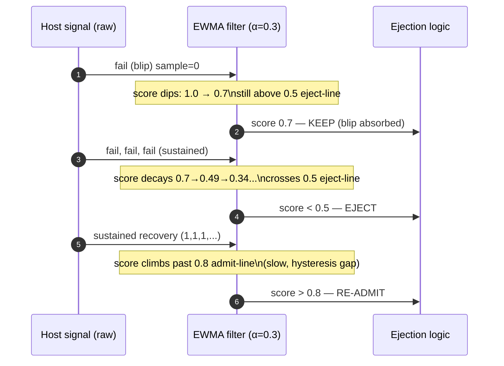

# Health Checks and Failover — Professional

<!-- level-focus -->
At professional level, focus on this question:

> How should teams adopt and operate **Health Checks and Failover** with measurable outcomes and limited coordination?

Use the smallest realistic scenario that exposes the decision and its failure behavior.
## 1. The Detection Problem: Sensitivity vs Stability

A health check is a **binary classifier** running on noisy input. Every backend emits a
stream of signals — probe responses, real-request outcomes, latencies — and the load
balancer must decide, continuously, "route to this host or not?" Two error types govern
the design:

- **False negative** (miss): a genuinely-broken host is still marked healthy → user
  requests hit a black hole. Cost = failed requests until detection fires.
- **False positive** (false alarm): a healthy host is marked broken → capacity is
  needlessly removed, and if enough hosts flap, the whole pool can collapse.

These two errors trade off against a single knob: **how much evidence you require before
acting.** Require little evidence and you detect fast but flap on transient blips. Require
much evidence and you are stable but slow — a dead host keeps taking traffic for seconds.

```text
        require MORE evidence  ─────────────────────────►  require LESS evidence
        (high threshold)                                    (low threshold)

  stability ▲                                                        ▲ sensitivity
  (few false positives)                                (fast detection, more flap)

  slow to detect real death  ◄─────────────────────────►  fast to detect real death
```

There is no setting that is optimal in the abstract; the correct point depends on the
**cost asymmetry** (how expensive is a failed request vs a wrongly-ejected host) and the
**base rate of transient noise** in your fleet. Everything below is machinery for moving
along this curve deliberately instead of by accident.

### The two independent detection channels

| Channel | Signal source | Latency | Blind spot |
|---|---|---|---|
| **Active probing** | LB sends synthetic requests (`GET /healthz`) on a timer | Bounded by probe `interval` | Probe path may not exercise the real dependency (a shallow probe passes while `/checkout` 500s) |
| **Passive / outlier detection** | Real production traffic outcomes | As fast as request rate allows | No traffic → no signal; a cold or low-QPS host is invisible |

Mature systems run **both**: active checks guarantee a signal even at zero load; passive
outlier detection catches deep failures the probe misses and reacts at line rate under
load. The formulas in §2 apply to the active channel; §5 covers the passive channel.

---

## 2. Time-to-Detect and Time-to-Eject Formulas

Active health checking is a sampled process. A host is ejected only after it **fails a
consecutive run** of probes. The controlling parameters:

| Symbol | Parameter | Meaning |
|---|---|---|
| `I` | `interval` | Time between successive probes |
| `T` | `timeout` | How long the LB waits for a probe response before scoring it a failure |
| `N_uh` | `unhealthy_threshold` | Consecutive failed probes required to mark a host **down** |
| `N_h` | `healthy_threshold` | Consecutive successful probes required to mark it **up** again |
| `φ` | phase offset | Time from the *moment of failure* to the *next scheduled probe* (0 ≤ φ ≤ I) |

### Worst-case time-to-eject

The last healthy probe may land the instant *before* the host dies, so you wait almost a
full interval for the next probe, then need `N_uh` consecutive failures, each of which may
burn a full `timeout` (a hung host that never answers):

```text
  time_to_eject(worst) = φ_max + N_uh × (I_eff)

  where I_eff for a hung/timing-out host = max(I, T)   ← a probe cannot start
                                                          before the previous times out

  Simplified upper bound (the form to memorize):

      T_eject ≈ I + (N_uh − 1) × I + T
              = N_uh × I + T          (when I ≥ T, i.e. timeout fits inside the interval)
```

The canonical formula is:

> **`time_to_eject = interval × unhealthy_threshold + timeout`**

This is the number to quote in a design review. It reads as: *"wait roughly one interval
per required failure, plus one timeout for the final hung probe."*

### Time-to-recover (re-admission)

Symmetric, but governed by `healthy_threshold`. A recovered host must pass `N_h`
consecutive probes before it takes traffic again:

```text
  time_to_recover ≈ healthy_threshold × interval
                  = N_h × I           (successful probes return fast, so no +timeout term)
```

Recovery is deliberately made *slower* than detection (`N_h` often > `N_uh`) to prevent a
flapping host from being re-admitted the instant it looks healthy — this is hysteresis,
formalized in §6.

### Why not just probe every 100 ms?

Probing cost scales as `hosts × frequency`. A pool of 500 backends probed every 100 ms is
5,000 probe req/s of pure overhead *per LB instance*, and thundering-herd synchronized
probes can themselves cause the latency spikes they are trying to detect. The interval is
a real resource budget, not a free dial — which is exactly why the passive channel (§5)
matters: it detects at request rate for free.

---

## 3. Worked Detection-Time Numbers

Take a common Kubernetes-style `readinessProbe` configuration and compute the exposure
window — the time real users are sent to a dead host.

```text
  Config:
    interval  I    = 5 s
    timeout   T    = 2 s
    unhealthy_threshold N_uh = 3
    healthy_threshold   N_h  = 2

  Worst-case time-to-eject:
    T_eject = I × N_uh + T
            = 5 × 3 + 2
            = 17 seconds

  Time-to-recover:
    T_recover = N_h × I = 2 × 5 = 10 seconds
```

**Interpretation.** For up to **17 seconds** after a host hangs, the load balancer keeps
routing to it. If that host normally serves 200 req/s and you have no passive detection or
retries, that is up to `200 × 17 = 3,400` failed (or hung) requests before ejection. This
is why relying on active checks *alone* for fast failover is a mistake — 17 s is an
eternity for a user-facing path.

### Sensitivity sweep

Hold `timeout = 2 s` and vary the aggressiveness to see the sensitivity/stability trade
concretely:

| Profile | `I` | `N_uh` | `T_eject` (worst) | False-positive risk |
|---|---|---|---|---|
| **Aggressive** | 1 s | 2 | `1×2 + 2 = 4 s` | High — one GC pause can eject a good host |
| **Balanced** | 5 s | 3 | `5×3 + 2 = 17 s` | Moderate |
| **Conservative** | 10 s | 5 | `10×5 + 2 = 52 s` | Low — very stable, but a dead host lingers ~1 min |

Cutting `T_eject` by 4× (52 s → 4 s → aggressive) does not come free: at `N_uh = 2, I = 1s`
a single 2-second stop-the-world GC pause or a transient network blip trips ejection. The
right answer is usually **balanced active checks for the "is it alive at all" signal, plus
passive outlier detection for fast reaction under load** — you get the 4-second reaction
without the false-positive tax, because passive detection acts on real request outcomes,
not synthetic probes.

---

## 4. The Circuit-Breaker State Machine

Health checks tell the LB *which hosts* to route to. The **circuit breaker** (Nygard,
*Release It!*, 2007) is the complementary pattern that tells a *caller* whether to attempt
a downstream call at all — protecting the caller from spending threads and latency on a
dependency that is already known to be failing. It is a three-state machine:

### State semantics

| State | Behavior | Exit condition |
|---|---|---|
| **Closed** | Normal operation. All requests pass. Failures counted over a rolling window (last `M` requests, or a time window). | Failure ratio (or consecutive failures) crosses the trip threshold → **Open**. |
| **Open** | **Fail fast.** Calls are rejected immediately without touching the downstream (return a cached/default response, or an error). No thread is blocked, no timeout burned. | A cool-down timer (`open_timeout`) expires → **Half-Open**. |
| **Half-Open** | **Trial mode.** A small, bounded number of probe requests are allowed through to test the water. | `success_threshold` consecutive successes → **Closed**. Any failure → back to **Open** (timer resets). |

### Why Half-Open matters

Without the Half-Open state you have only a binary open/closed with a fixed timer — when
the timer fires you dump *all* traffic back onto a downstream that may still be sick,
re-tripping instantly and thrashing. Half-Open is a **single-bit hysteresis latch**: it
sends a *trickle* to probe recovery and only fully reopens the gate on evidence. It is the
circuit-breaker analog of `healthy_threshold` in active checks.

### Trip thresholds — two common policies

```text
  Consecutive-failure trip:
    if consecutive_failures ≥ K  →  OPEN         (e.g. K = 5)
    Simple; reacts to a clean run of failures. Vulnerable to interleaved success/fail.

  Rolling-ratio trip:
    over the last M requests (M ≥ min_request_volume):
        if failure_ratio ≥ p  →  OPEN            (e.g. p = 0.5 over M = 20)
    Robust to intermittent failure; requires a minimum volume to avoid
    tripping on 1-of-2 statistical noise (min_request_volume guards this).
```

The `min_request_volume` guard is essential: a host that has served **2 requests, 1
failed** is not statistically "50% broken" — it is a sample of size 2. Never trip on a
ratio computed from a handful of samples.

---

## 5. Outlier Detection Algorithms

Outlier (passive) detection ejects a host based on the outcomes of **real production
traffic**, at request rate, catching failures the shallow probe misses. Envoy's outlier
detection is the reference implementation; the two core algorithms:

### 5.1 Consecutive-5xx (and consecutive gateway failures)

```text
  Per host, maintain a counter of consecutive 5xx (server-error) responses.
  On the Nth consecutive 5xx (consecutive_5xx, default 5):
      → eject the host for base_ejection_time × (ejection_count).
  A single success resets the counter to 0.
```

Deterministic and fast, but blind to a host that fails *intermittently* — e.g. one that
returns 5xx 40% of the time never accumulates a clean run of 5. That case needs
success-rate detection.

### 5.2 Success-rate standard-deviation ejection

This is the statistically principled algorithm. It compares each host against the **fleet
distribution**, not an absolute threshold:

```text
  1. Compute each host's success rate over the current interval
     (only hosts with ≥ success_rate_request_volume requests are eligible).
  2. Compute the mean (μ) and standard deviation (σ) of success rates
     across all eligible hosts.
  3. Eject any host whose success rate falls below:

         ejection_threshold = μ − (stdev_factor × σ)

     where stdev_factor is tunable (Envoy default 1.9, expressed as 1900/1000).
```

The power of this method: it is **self-calibrating**. During a global dependency brownout
where *every* host is at 70% success, the mean drops with the fleet and no host is
wrongly ejected for a fleet-wide problem — you only eject hosts that are outliers
*relative to their peers*. An absolute "eject below 90% success" rule would eject the
entire fleet in that scenario and take you fully down.

### 5.3 Comparison of outlier-detection strategies

| Strategy | Signal | Catches | Misses | Self-calibrating? |
|---|---|---|---|---|
| **Consecutive-5xx** | Run of hard errors | Cleanly dead / crashing host | Intermittent failures; slow hosts returning 200 | No (absolute) |
| **Consecutive gateway-failure** | Run of 502/503/504 + connect errors | Unreachable / connection-refused host | App-level 500s if excluded | No (absolute) |
| **Success-rate stdev** | Per-host rate vs fleet μ/σ | Intermittent + outlier hosts | Fleet-wide brownouts (by design — correctly) | **Yes** (relative to peers) |
| **Latency / EWMA outlier** | p95 latency vs fleet | "Slow but 200" gray failures | Uniformly slow fleet | Yes (relative) |

The **enforcing_*** percentage parameters (e.g. `enforcing_consecutive_5xx`) let you run
detection in **monitor-only mode**: compute ejections and emit metrics but enforce only X%
of them — invaluable for tuning thresholds in production before letting them remove
capacity.

---

## 6. Hysteresis and EWMA: Killing the Flap

**Flapping** is the pathology where a host oscillates healthy → unhealthy → healthy every
few seconds. Each transition churns connection pools, invalidates the LB's routing tables,
and can trigger autoscaling and paging noise. Two mechanisms suppress it.

### 6.1 Hysteresis (asymmetric thresholds)

Use *different* thresholds for the two transition directions, so the healthy→unhealthy and
unhealthy→healthy boundaries do not coincide:

```text
  Eject   when consecutive failures ≥ N_uh   (e.g. 3)  — react reasonably fast
  Re-admit when consecutive successes ≥ N_h  (e.g. 5)  — but recover slowly & cautiously

  Because N_h > N_uh, a host hovering at the boundary cannot rapidly toggle:
  it must produce a long clean run to get back in, which a genuinely-flaky host
  cannot sustain. This is a Schmitt trigger applied to health.
```

The same idea appears in the circuit breaker's Half-Open state (§4) and in Envoy's
`base_ejection_time × ejection_count` backoff (§7): **make it easy to eject and hard to
un-eject.**

### 6.2 EWMA smoothing of the input signal

Instead of thresholding raw per-probe outcomes, smooth the health signal with an
**Exponentially Weighted Moving Average** so a single blip cannot cross the line:

```text
  score_t = α × sample_t + (1 − α) × score_{t−1}          0 < α ≤ 1

    sample_t = 1 for a healthy probe/request, 0 for a failure
    α small  (e.g. 0.2) → heavy smoothing, slow to react, very stable
    α large  (e.g. 0.8) → light smoothing, fast to react, closer to raw

  Eject when score_t < eject_line (e.g. 0.5); re-admit when score_t > admit_line (0.8).
  The gap (0.5 vs 0.8) is hysteresis; α controls sensitivity.
```

EWMA is also the standard way to fold **latency** into health: track an EWMA of per-host
response time and treat a host whose smoothed p95 diverges from the fleet as an outlier —
catching the "slow but returns 200" gray failure that pure error-rate checks miss
entirely. (This is the basis of latency-aware load balancing algorithms like P2C-EWMA /
"peak EWMA".)



---

## 7. Ejection Backoff and Panic Thresholds

### 7.1 Ejection backoff time

A host ejected once and re-admitted should not be trusted immediately if it fails *again* —
a chronically flaky host deserves progressively longer time-outs. Envoy multiplies the
base ejection time by the number of times the host has been ejected:

```text
  ejection_duration = base_ejection_time × ejection_count

  base_ejection_time = 30 s
    1st ejection →  30 × 1 =  30 s out
    2nd ejection →  30 × 2 =  60 s out
    3rd ejection →  30 × 3 =  90 s out
    ...
  The ejection_count decays over time if the host behaves, so a one-off blip
  does not permanently penalize a host. This is exponential-ish backoff on the
  quarantine, mirroring retry backoff — the more it misbehaves, the longer it sits out.
```

### 7.2 The panic threshold (max-ejection guard)

The dangerous failure mode of *any* automatic ejection system: a **correlated failure**
makes every host look unhealthy, ejection removes them all, and now there is **zero
capacity** — the health-check system has caused the outage it was meant to prevent.

The guard is a **panic threshold** (Envoy default 50%): if the fraction of healthy hosts
in the pool drops below this line, the LB **stops honoring health status and routes to all
hosts anyway** (including the "unhealthy" ones). The reasoning is explicit and correct:

> When most of the fleet looks broken, the probe/metric is more likely wrong (a probe bug,
> a shared-dependency brownout, a config push) than the reality that *literally every host
> died independently at once*. Better to spread load across a degraded fleet than to eject
> your way to a total outage.

`max_ejection_percent` enforces the complementary cap: never eject more than X% (default
often 10–50%) of the pool via outlier detection, regardless of how bad they look. Both
mechanisms encode the same principle — **failover must never be able to take the whole
service down.**

| Guard | Trigger | Effect |
|---|---|---|
| `max_ejection_percent` | Outlier detector wants to eject > X% of pool | Refuse further ejections; cap the removals |
| Panic threshold | Healthy fraction < 50% | Ignore health status; route to all hosts (fail-open) |
| `base_ejection_time × count` | Repeated ejections of same host | Progressively longer quarantine (fail-slow to re-admit) |

---

## 8. Correlated-Failure Probability

Failover math that assumes hosts fail **independently** is dangerously optimistic. Two
regimes:

### 8.1 The independent-failure baseline

If each of `n` redundant hosts fails independently with probability `p`, the probability
that **all** fail simultaneously is `pⁿ` — availability improves exponentially with
redundancy:

```text
  n = 3 hosts, per-host failure prob p = 0.01 (99% each):
    P(all 3 down) = 0.01³ = 1e-6   →  "six nines" from three cheap hosts.
  This is the seductive promise of redundancy — and it is a fiction when failures correlate.
```

### 8.2 Correlation destroys the exponent

Real failures share causes: a bad deploy, a poisoned config push, a shared AZ power event,
a common dependency, or a load-shedding cascade. Model correlation with a coefficient
`ρ ∈ [0, 1]` mixing independent and fully-correlated behavior:

```text
  P(all n down) ≈ (1 − ρ) · pⁿ   +   ρ · p

  ρ = 0  (fully independent):  P = pⁿ            → 1e-6  (six nines)
  ρ = 1  (fully correlated):   P = p             → 1e-2  (two nines) — redundancy buys NOTHING
  ρ = 0.1 (10% correlated):    P ≈ 0.9·1e-6 + 0.1·0.01 ≈ 1.0e-3

  A mere 10% correlation collapses "six nines" to ~three nines — three orders
  of magnitude worse than the independent model predicted.
```

**The lesson for failover design.** The dominant term is `ρ · p`, not `pⁿ`. Adding more
redundant hosts drives `pⁿ → 0` but does *nothing* to the `ρ · p` term. Past a small `n`,
**reducing correlation `ρ` buys far more availability than adding hosts.** Concretely:

- Spread replicas across **failure domains** (AZs, racks, power, network fabric) → lowers `ρ`.
- **Stagger deploys** and config rollouts (canary) → a bad push hits one domain, not all.
- Avoid a **shared fate** dependency (one config server, one DNS, one auth service whose
  failure fails every backend's health check simultaneously → the exact scenario the panic
  threshold in §7.2 exists to survive).
- Design health checks so a **shared-dependency brownout does not eject the whole fleet** —
  which is precisely why success-rate-vs-fleet (§5.2) beats an absolute threshold.

Correlated failure is the bridge from §7's panic threshold to the staff-level material:
the reason automatic failover must be able to *fail open* is that the independence
assumption underlying "just eject the bad ones" breaks exactly when you need it most.

---

## 9. Putting It Together: A Detection Budget

A principal-level design states an explicit **detection budget** and derives the parameters
from it, rather than copying defaults:

```text
  Requirement:  a user-facing path may tolerate at most ~2 s of blackholing.

  1. Active checks alone give T_eject = I×N_uh + T. To hit ~2 s you would need
     e.g. I=0.5s, N_uh=3, T=0.5s → 2.0 s — but that is aggressive enough to
     flap on GC pauses (§3). Active checks cannot safely hit 2 s at fleet scale.

  2. So: use active checks at a stable 'is it alive' cadence (I=5s, N_uh=3, T=2s
     → 17 s liveness backstop), and rely on PASSIVE outlier detection for the
     2 s SLO — it reacts at request rate on real outcomes (consecutive-5xx=5 or
     success-rate-stdev), no synthetic-probe false-positive tax.

  3. Add caller-side circuit breakers (§4) so that even inside the detection
     window, callers fail fast instead of piling threads onto a dying host.

  4. Bound the blast radius: max_ejection_percent + 50% panic threshold (§7.2)
     so a correlated failure (§8) can never eject the pool to zero.

  Result: fast reaction (passive), stable liveness (active), caller protection
  (breaker), and a hard floor on capacity (panic threshold) — the four layers
  that a single knob can never provide.
```

The through-line of this entire tier: **detection is a control loop with an unavoidable
sensitivity/stability trade, and the mature move is not to find the one perfect threshold
but to compose independent layers — active liveness, passive outlier detection, EWMA
smoothing, hysteresis, backoff, and a fail-open floor — each covering the others' blind
spots.**

---

## 10. References

- Michael Nygard, *Release It! Design and Deploy Production-Ready Software* (2nd ed.,
  Pragmatic Bookshelf, 2018) — the canonical treatment of the Circuit Breaker pattern and
  the Closed/Open/Half-Open state machine.
- Envoy Proxy documentation — **Outlier detection** (consecutive-5xx, success-rate stdev
  ejection, `base_ejection_time`, `max_ejection_percent`) and **Health checking**
  (`interval`, `timeout`, `unhealthy_threshold`, `healthy_threshold`, panic threshold).
- Martin Fowler, "CircuitBreaker" — a concise write-up of the pattern and its state
  transitions.
- Kubernetes documentation — Liveness, Readiness, and Startup Probes (`periodSeconds`,
  `timeoutSeconds`, `failureThreshold`, `successThreshold`), the fields the §2 formulas map onto.


---

## Apply it

1. Define the user or business outcome that **Health Checks and Failover** should improve.
2. Assign one owner for code, contracts, operations, and incidents.
3. Split delivery into reversible increments that produce evidence early.
4. Publish responsibilities, escalation paths, and compatibility windows.
5. Stop or expand only when the agreed measures support that decision.

## Verify your work

- Each increment has an owner, rollback path, and observable exit condition.
- Adoption, reliability, delivery time, and coordination cost are measured.
- Incident and migration exercises prove that responsibility is executable.
- The old path is removed only after telemetry proves it is unused.

## Review questions

- Which measurable outcome justifies investing in Health Checks and Failover?
- Which team owns the full lifecycle and incident response?
- What reversible increment produces the earliest useful evidence?
- Which exit condition proves that migration or adoption is complete?
