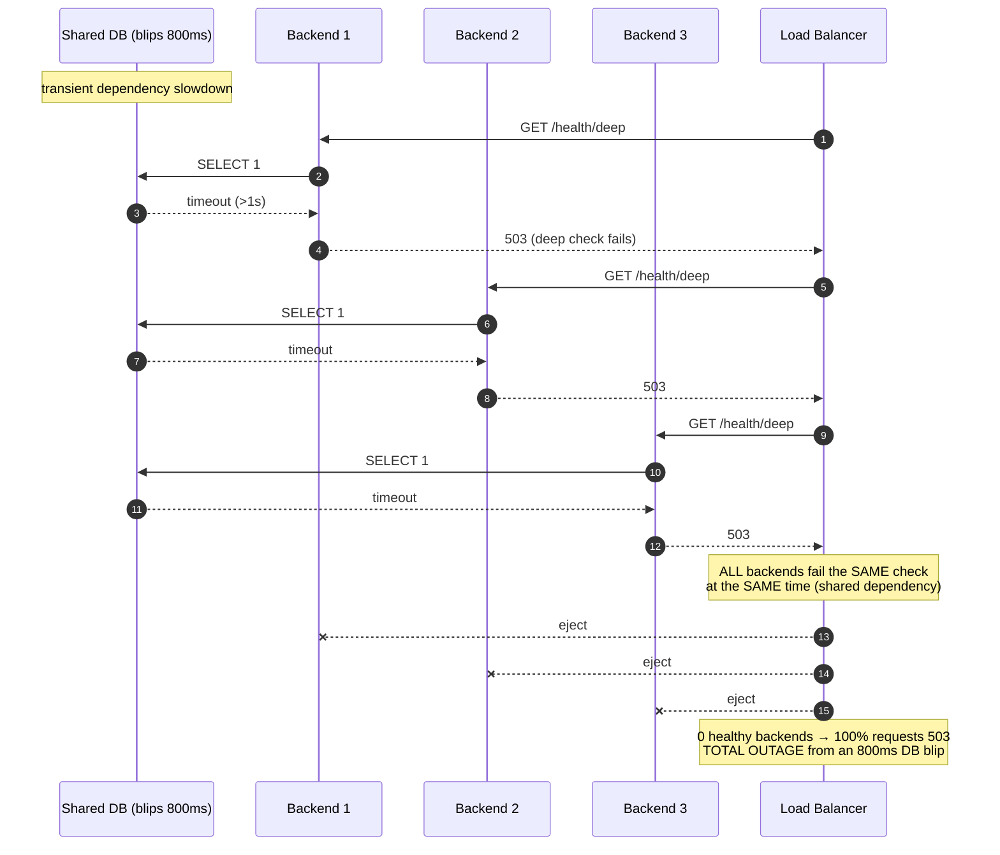

# Health Checks and Failover — Senior

<!-- level-focus -->
At senior level, focus on this question:

> Which system invariant is affected by **Health Checks and Failover** under failure, load, and change?

Use the smallest realistic scenario that exposes the decision and its failure behavior.
---

## 1. The Health-Check Control Loop

A health check has four tunables that together define behavior. Treat them as a system,
not as isolated knobs — they interact.

```text
interval        how often the LB probes a backend           (e.g. 2s)
timeout         how long to wait for a probe response        (e.g. 1s)
unhealthy_threshold   consecutive failures before ejection   (e.g. 3)
healthy_threshold     consecutive successes before return    (e.g. 2)
```

**Detection latency** is the load-bearing derived metric:

```text
worst-case time to eject = interval × unhealthy_threshold + timeout
                         = 2s × 3 + 1s = 7s

worst-case time to return = interval × healthy_threshold
                         = 2s × 2 = 4s
```

The asymmetry is deliberate and is the first design lever: **be slow to eject, slower to
readmit.** A single failed probe is noise (GC pause, a dropped packet, a scheduler stall);
`unhealthy_threshold ≥ 3` filters that noise. But readmission must be even more cautious,
because a backend that just recovered is cold (empty caches, empty connection pools, JIT
not warm) and will fall over if handed full traffic instantly — see §5.

The check's *depth* determines what it actually measures, and that choice is where most
outages are engineered in.

---

## 2. Shallow vs Deep Checks — and the Death Spiral

A **shallow check** answers "is this process alive and serving?" — a `GET /healthz` that
returns `200` if the HTTP server loop is running. A **deep check** answers "can this
instance successfully complete a real request?" — `GET /health/deep` that pings the
database, the cache, downstream services, and reports `200` only if *all* dependencies
respond.

Deep checks feel more honest. They are also the single most common cause of self-inflicted
total outages, via the **deep-health-check death spiral**:



The pathology: a deep check couples the health of *every* backend to the health of a
*shared* dependency. When that dependency has an 800 ms hiccup — a blip a retry would have
absorbed — every backend fails the check *simultaneously and identically*. The LB, doing
exactly what you told it, ejects the entire fleet. Now 100% of traffic gets `503`, when
the correct behavior was to serve the ~95% of requests that don't touch the slow
dependency, or serve degraded responses for the rest.

**The rule:** a health check should report the health of *this instance*, not the health
of the *whole system*. If a dependency is down, that is a dependency problem to be handled
per-request (timeouts, retries, circuit breakers, fallbacks) — not a reason to remove
otherwise-fine servers from rotation. Removing servers cannot fix a shared dependency; it
can only shrink the capacity available to survive it.

| Dimension | Shallow check | Deep check |
|---|---|---|
| Measures | Process alive, event loop serving | Full request path incl. dependencies |
| Failure blast radius | Isolated to one bad instance | **Correlated across all instances** |
| Death-spiral risk | Low | **High** (shared-dependency coupling) |
| False-healthy risk | Higher (app broken but process up) | Lower (catches broken paths) |
| Cost per probe | Cheap | Expensive (DB/cache load ∝ fleet × 1/interval) |
| Right role | LB rotation / liveness | Deploy gate, alerting, dashboards |

The resolution is not "shallow vs deep" as a binary but **layering by consumer**: the LB
uses a *local, shallow-ish* check that trusts the instance; deep dependency checks feed
*observability and deploy gates*, where a human or a slower control loop reacts — not the
per-second traffic-steering loop. A middle ground — a check that verifies local invariants
(config loaded, thread pool not saturated, disk writable) without dialing external
dependencies — captures most real "this instance is broken" cases without the correlated
blast radius.

---

## 3. Liveness vs Readiness vs Startup

Kubernetes formalized a distinction that applies to any LB, and getting it wrong is its
own outage class.

```text
livenessProbe   fail  → RESTART the container (kill + reschedule)
readinessProbe  fail  → REMOVE from load-balancing endpoints (do not restart)
startupProbe    gates liveness/readiness until first success (slow-boot apps)
```

The critical, frequently-violated rule: **liveness probes must be shallow.** A liveness
probe that does a deep dependency check turns the death spiral into a *restart* spiral —
when the DB blips, every pod fails liveness, Kubernetes kills and reschedules *all* of
them, the fleet loses all warm state, and the mass-restart storm hammers the recovering DB
even harder. A shallow liveness check ("is my event loop responsive?") only restarts a pod
when the pod itself is genuinely wedged (deadlock, unrecoverable state), which is what
restart is *for*.

Readiness may be *somewhat* deeper — it's safe for readiness to fail because failing it
only removes the pod from rotation, it doesn't destroy the pod. But even readiness should
avoid checking *shared* dependencies for the §2 reason: if all pods share the same DB, a
DB blip failing readiness on all of them empties the endpoint list just as surely as an LB
ejection. Readiness should reflect *this pod's own* ability to serve: startup complete,
config loaded, local queues not saturated, connection pool established.

| Probe | On failure | Depth | Failing on shared dep |
|---|---|---|---|
| Startup | Keep waiting (until deadline) | App-specific bring-up | N/A |
| Liveness | **Restart pod** | **Shallow only** | Catastrophic (restart storm) |
| Readiness | Remove from endpoints | Shallow-ish, *own* state | Bad (empties endpoints fleet-wide) |

---

## 4. Active vs Passive Health (Outlier Detection)

**Active health checks** are synthetic probes on a fixed interval. They have blind spots:
a probe every 2s means up to 2s of real traffic hits a broken backend before detection,
and a `/healthz` endpoint can pass while the endpoints that actually matter fail (§8).

**Passive health checks / outlier detection** observe *real production traffic* and eject
backends that misbehave — consecutive `5xx`, gateway failures, or latency far above the
fleet median. This is strictly more informed than active checking: it measures exactly
what users experience, with zero probe lag, and catches partial failures that a synthetic
probe misses. Envoy calls this *outlier detection*; it's the passive counterpart to active
health checking and the two are typically used together.

The danger is the same as §2 in a different costume: naïve outlier detection can eject the
whole fleet. If a bad *deploy* or a shared-dependency failure makes every backend return
`5xx`, consecutive-error ejection would remove all of them. Two guardrails are mandatory:

```text
max_ejection_percent   never eject more than N% of the pool (e.g. 50%)
                       → guarantees a floor of capacity even under correlated failure
min_healthy_percent    stop ejecting once the healthy pool drops below a floor
                       (a.k.a. "panic mode": below the floor, LB ignores health and
                        load-balances across ALL hosts, healthy or not — because
                        spraying traffic across everyone beats sending it to no one)
```

Panic mode is the explicit acknowledgment that **an empty pool is worse than a degraded
pool.** When health signals say "everything is broken," the most probable explanation is
not "every server independently died" but "the health signal is measuring something
global." In that case the LB should *distrust its own ejection decisions* and fall back to
serving traffic everywhere — a strictly better bet than returning `503` to everyone.

| Strategy | Signal source | Detection lag | Blast-radius guardrail |
|---|---|---|---|
| Active probe | Synthetic requests | Up to `interval × threshold` | thresholds, `min_healthy` |
| Passive / outlier | Real traffic errors/latency | ~immediate | `max_ejection_%`, panic mode |
| Combined | Both | Fast + robust | Both guardrails together |

Passive ejection should also be **gradual to return** (§5): an outlier-ejected host is
readmitted with a *base ejection time* that grows on repeat offenses (exponential backoff
on ejection), so a chronically-flapping host stays out longer without a human touching it.

---

## 5. The Flapping Problem: Hysteresis, Slow-Start, Ramp

A backend near the failure boundary can oscillate: fail → eject → recover → readmit → get
full traffic → overload → fail again. Each flap dumps and reacquires connections, thrashes
the LB's routing table, and can synchronize with other borderline backends. Three
mechanisms tame it.

**Hysteresis** — the asymmetric thresholds of §1. Ejection is fast (fail 3× → out);
readmission is deliberate (succeed N× *and* wait a cooldown). A separate up-threshold and
down-threshold means a backend hovering exactly at the boundary doesn't rattle in and out
on every probe.

**Exponential ejection backoff** — each successive ejection of the same host multiplies
its base ejection time (`base × 2^n`). A host that flaps repeatedly is progressively
sidelined, converting a fast oscillation into a slow, damped one that a human can
investigate.

**Slow-start / ramp (the recovery load ramp)** — the most important one, and the most
often missing. A backend that just passed its health check is *cold*: empty caches, cold
JIT, unfilled connection pools, unprimed CPU branch predictors. Handing it a full share of
traffic instantly will tip it straight back over. Slow-start gives the newly-healthy host
a *ramping* weight that increases over a window:

Without slow-start, recovery itself becomes a failure trigger. The classic pathology: an
autoscaler adds five cold instances during a traffic spike; the LB immediately splits
traffic evenly; each cold instance is overwhelmed before it warms; they fail health checks;
they get ejected; the surviving warm instances now carry *more* load and start failing too.
Slow-start breaks that by admitting cold capacity *gently*, and it composes with least-load
balancing algorithms (a cold instance with a low weight naturally receives proportionally
less).

---

## 6. Failover Coordination and Correlated Failure

Failover assumes the surviving capacity can absorb the failed capacity's load. That
assumption breaks in two ways senior engineers must design against.

**Insufficient headroom.** If you run 4 backends at 80% utilization and one fails, its 20%
of traffic redistributes onto the other three, pushing them to ~107% — they overload and
fail, and the failover *cascades*. Capacity planning for failover means sizing so that
`N-1` (or `N-k` for correlated-failure tolerance) instances can carry peak load. The
headroom target is `1 − 1/N` utilization ceiling per instance to survive a single loss;
for a 4-node pool, that's a 75% ceiling.

**Correlated / simultaneous failure.** The most dangerous case is *everything failing at
the same instant*, because it defeats the "surviving capacity absorbs the load" premise
entirely — there is no surviving capacity. Sources of correlation:

```text
- Shared dependency        (§2 death spiral — the #1 source)
- Synchronized timers       all backends started together → GC, cert refresh,
                            cache expiry, cron all fire in lockstep
- Same bad deploy           uniform binary → uniform bug triggers on all at once
- Same AZ / rack / host     an AZ outage takes correlated instances together
- Synchronized health probes all LBs probe on the same schedule → same-instant decisions
```

Mitigations decorrelate the fleet: **spread backends across AZs/racks** so no single fault
domain holds a majority; **jitter timers** (add random offset to cache TTLs, cert refresh,
cron, and connection lifetimes) so expiries scatter rather than synchronize; **stagger
deploys** (canary + progressive rollout) so a bad binary is caught before it reaches the
whole fleet; and cap ejection with `max_ejection_percent` (§4) so even a genuinely
correlated failure can't empty the pool. The design goal is that *no single event* can
transition the fleet from "all healthy" to "all ejected" in one tick.

---

## 7. Health-Check-Induced Retry and Thundering Herd

Health-checking interacts violently with retries. Two amplification loops to design out.

**Retry storms on ejection.** When a backend is ejected mid-request, in-flight requests
fail and clients retry. If the ejection happened because of a shared-dependency blip (§2),
*all* backends are struggling simultaneously, so the retries pile onto an already-saturated
fleet — the retry traffic is pure amplification exactly when there is no spare capacity to
serve it. This is the retry-storm form of a thundering herd. Guardrails:

```text
- retry budgets      cap retries to a % of total traffic (e.g. ≤10%), so retries can
                     never more than 1.1× the load — the budget refuses to amplify
- exponential backoff + jitter   spread retry attempts in time, don't re-fire in lockstep
- circuit breakers   after enough failures, stop calling the dependency entirely and
                     fail fast (or serve fallback) instead of queuing doomed retries
- retry only idempotent ops, and only on retryable statuses (never on 400/409)
```

**Reconnection stampede on recovery.** When an ejected backend (or a whole AZ) returns,
every client that was failing over may reconnect *at the same instant* — a synchronized
stampede that can immediately re-overload the just-recovered capacity. Slow-start (§5) on
the server side plus **jittered reconnection backoff** on the client side spread the herd
over a window instead of a spike.

**Probe amplification.** Don't forget the checks themselves are traffic. With a large fleet
and many LB instances each probing every backend, a short interval creates real load —
especially for deep checks that hit the DB. `probes/sec = backends × LB_instances /
interval`; a 500-backend fleet behind 10 LBs on a 1s deep-check interval is 5,000 DB
`SELECT 1`/sec of pure overhead, and that overhead spikes precisely during an incident when
you can least afford it. Prefer cheap local checks for the tight loop; reserve deep probes
for slow, out-of-band evaluation.

---

## 8. Failure Modes and the False-Healthy Backend

The counterpart to the death spiral (false-*unhealthy*, ejecting good servers) is the
**false-healthy** backend: the check passes but the app is broken. This is arguably more
dangerous because it's silent — the LB keeps routing users to a server that returns errors,
serves stale/corrupt data, or hangs, and the green dashboard says everything is fine.

Common false-healthy patterns:

```text
- /healthz returns 200 unconditionally      (a static handler that never touches app state)
- check hits the web tier only              app can serve /healthz but its worker pool is
                                            deadlocked and real requests hang
- check passes, dependency config is wrong  process is up but pointed at a dead DB replica
- disk full / partition read-only           process runs, writes silently fail
- poisoned cache / bad feature flag          200 on health, wrong answers to users
- thread pool exhausted                      health endpoint on a reserved thread responds;
                                            user requests queue forever
```

The design principle: **the health check must exercise a code path representative of real
requests.** A check that shares no code, no threads, and no dependencies with the actual
request path proves nothing about whether real requests succeed. This pulls *toward* deeper
checks — creating direct tension with §2. The senior resolution:

- Make the LB-facing check verify **local liveness of the serving path** — not "can I reach
  the DB" but "can my request-handling machinery process a trivial request end-to-end using
  the same threads/pools it uses for real traffic" (e.g., a self-request through the real
  handler, or a synthetic request touched by the real middleware chain).
- Detect *dependency* health via **passive/outlier detection on real traffic** (§4) and
  observability — where the signal is per-request and per-dependency, so a slow DB ejects
  the *requests that need the DB* (or trips a circuit breaker) rather than the *whole
  server*.
- Never let a single dependency failure flip a check that governs *rotation* for the whole
  fleet — route that signal to alerting and graceful degradation instead.

This is the crux of the whole topic: **checks that govern traffic rotation should be
shallow enough to avoid correlated ejection but deep enough to catch a locally broken
serving path; checks that measure dependencies belong in observation loops, not the
per-second steering loop.**

---

## 9. Split Decisions Across LB Instances

With multiple LB instances (which every real deployment has, for the LB's own HA), each
runs its *own* health-checking loop against the *same* backends — and they can disagree.
LB-A thinks backend B7 is healthy; LB-B has ejected it. Sources of divergence:

```text
- network path differences   LB-A can reach B7, LB-B is on a partitioned path → B7 up for
                             some clients, down for others
- probe timing skew          LBs probe on different phases → catch different transient blips
- independent thresholds     one LB's failure counter is at 2, another's at 3 at the moment
                             a decision fires
- passive detection          each LB only sees the errors from traffic IT routed, so their
                             outlier verdicts are computed on different samples
```

Split health decisions are usually *tolerable and even desirable*: they make ejection
*local* to the LB that actually observed the problem, so a partition that only affects
LB-B doesn't remove B7 for everyone. But they cause confusing incidents ("half of users
see errors, half don't") and complicate debugging. Design responses:

- **Accept locality as correct behavior.** An LB should route based on *its own* ability to
  reach a backend, because that's what its clients experience. Global agreement is not the
  goal; *serving each client from a backend that client can reach* is.
- **Aggregate for humans, not for the tight loop.** Export per-LB health state to a central
  view so on-call can see the split; don't try to force a single consensus verdict into the
  data path (that adds a coordination dependency and a new SPOF).
- **Where you *do* want agreement** (e.g., a control plane deciding to drain a backend for
  deploy), run that decision in a slow, out-of-band controller — not in the per-request LB
  loop. Keep the fast path (traffic steering) local and the slow path (fleet management)
  coordinated.

---

## 10. Design Review Checklist

- [ ] LB-facing check is **shallow / local** — it does not dial shared dependencies, so a
      dependency blip cannot eject the whole fleet (§2).
- [ ] **Liveness is shallow**; only readiness (safely) may be deeper, and even readiness
      avoids shared-dependency coupling (§3).
- [ ] `unhealthy_threshold ≥ 3` filters probe noise; readmission is **more conservative**
      than ejection (hysteresis) (§1, §5).
- [ ] **`max_ejection_percent` / panic-mode floor** guarantees a minimum serving pool even
      under correlated failure — an empty pool is never allowed (§4).
- [ ] **Slow-start / ramp** is enabled so cold and just-recovered backends receive traffic
      gradually, not a full share instantly (§5).
- [ ] **Passive / outlier detection** on real traffic supplements active probes; exponential
      ejection backoff sidelines chronic flappers (§4).
- [ ] Failover **headroom** sized for `N−1` (or `N−k`) at peak; utilization ceiling caps
      per-instance load so one loss doesn't cascade (§6).
- [ ] Fleet is **decorrelated**: multi-AZ spread, **jittered** timers/TTLs/cert-refresh,
      staggered/canary deploys — no single event flips all healthy → all ejected (§6).
- [ ] **Retry budgets + backoff/jitter + circuit breakers** prevent health-check-triggered
      retry storms and reconnection stampedes (§7).
- [ ] The check **exercises the real serving path** (same threads/pools) to catch
      **false-healthy** backends, without pulling shared dependencies into the rotation
      signal (§8).
- [ ] **Split decisions across LB instances** are accepted as local-and-correct; agreement,
      where needed, lives in a slow out-of-band controller, not the data path (§9).

---

*Next step:* [Health Checks and Failover — Professional](professional.md)

---

## Apply it

1. State the system invariant that **Health Checks and Failover** must protect.
2. Mark ownership, state, and failure propagation at each boundary.
3. Compare two designs under load, dependency failure, and future change.
4. Define recovery and compatibility behavior before implementation.
5. Test the riskiest assumption with a focused experiment.

## Verify your work

- The experiment supports the design with evidence, not preference.
- Failure injection shows the blast radius and recovery path.
- Compatibility checks cover old and new callers or data.
- Operational signals reveal invariant violations and recovery progress.

## Review questions

- Which invariant must remain true when Health Checks and Failover fails?
- Where should recovery responsibility live, and why?
- Which assumption deserves an experiment before implementation?
- How can the design evolve without changing every consumer at once?
