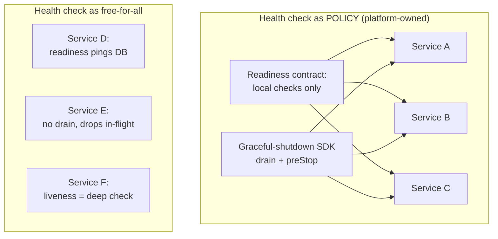
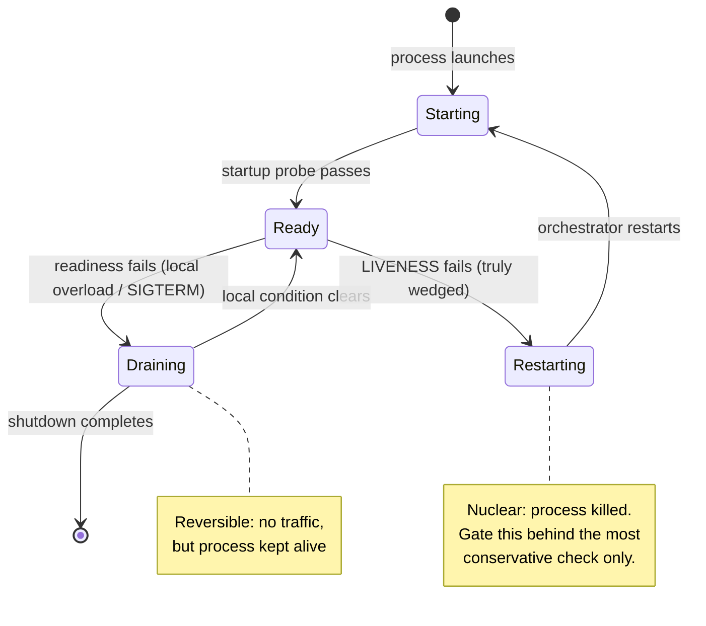

# Health Checks and Failover — Staff

> **Axis:** organizational scope & judgment — NOT deeper protocol mechanics (that is
> `professional.md`). At one team's scale a health check is a route that returns 200.
> At org scale it is a **reliability policy** every service inherits: what a readiness
> probe is *allowed* to check, how draining and graceful shutdown are done uniformly
> across hundreds of deployables, whether failover actually works (it doesn't until you
> test it), and the deliberate SLO trade-off between detecting a bad instance fast and
> not flapping the whole fleet on a transient blip. This file is about the judgment,
> the org rules, and the incidents — not the HTTP.

---

## Table of Contents

1. [Health Checks Are a Reliability Policy, Not a Route](#1-health-checks-are-a-reliability-policy-not-a-route)
2. [The Central Rule: Readiness Must Not Check Downstream Dependencies](#2-the-central-rule-readiness-must-not-check-downstream-dependencies)
3. [Liveness vs Readiness vs Startup — The Semantics Teams Get Wrong](#3-liveness-vs-readiness-vs-startup--the-semantics-teams-get-wrong)
4. [The Deep-Health-Check Outage Pattern (Postmortem)](#4-the-deep-health-check-outage-pattern-postmortem)
5. [Owning Graceful Shutdown and Draining as an Org Convention](#5-owning-graceful-shutdown-and-draining-as-an-org-convention)
6. [Fast Detection vs Stability: An SLO-Driven Choice](#6-fast-detection-vs-stability-an-slo-driven-choice)
7. [Don't Trust Untested Failover: Game Days](#7-dont-trust-untested-failover-game-days)
8. [Failing Open vs Failing Closed at the Fleet Level](#8-failing-open-vs-failing-closed-at-the-fleet-level)
9. [When NOT to Add a Health Check](#9-when-not-to-add-a-health-check)
10. [Second-Order Consequences and the Staff Checklist](#10-second-order-consequences-and-the-staff-checklist)
11. [References](#11-references)

---

## 1. Health Checks Are a Reliability Policy, Not a Route

Every service in the org has health checks. That is exactly the problem. When the same
mistake is copy-pasted into 300 deployables, one design flaw becomes a systemic failure
mode. The staff-level reframe: a health check is not code a team writes; it is a
**policy the platform mandates and the LB/orchestrator enforces**. The policy defines
what a probe may inspect, what it must never inspect, how failure is aggregated across a
fleet, and how a failing instance is removed and restored.

The reason this rises to org scope is *correlated failure*. Independent random hardware
failures are easy — the LB ejects one of N instances, capacity dips by 1/N, nobody
notices. The dangerous failures are correlated: a shared dependency degrades and **every
instance's health check fails at the same instant**. A per-instance mechanism designed
for independent failure, applied to a correlated event, turns a partial degradation into
a total outage. The health-check policy exists to make sure the fleet's *reaction* to a
problem is never worse than the problem itself.



The left side is what you own as a staff engineer: a small, opinionated contract plus a
shared library/sidecar so teams get it right *by default* rather than by discipline. The
right side is what emerges when health checks are left to each team — and every one of
those three services is a latent outage.

---

## 2. The Central Rule: Readiness Must Not Check Downstream Dependencies

This is the single most important org rule in this topic, and it is worth stating as an
enforceable engineering standard:

> **A readiness probe reports whether *this instance* can serve traffic. It must not
> fail because a shared downstream dependency (database, cache, another service) is
> unhealthy.**

The reasoning is about *shared fate*. Suppose the readiness endpoint runs a
`SELECT 1` against the primary database. Now the database has a 5-second hiccup. Every
instance in the fleet runs its readiness probe, every probe fails, the load balancer
marks **every instance unhealthy simultaneously**, and it has nothing left to route to.
The database recovers in 5 seconds — but the outage lasts far longer, because now the
orchestrator is churning: ejecting instances, maybe restarting them, and the LB returns
503 to users for a dependency blip that should have been invisible or, at worst, a few
slow requests.

The failure is not the database. The failure is that a *local* mechanism (per-instance
health) was wired to a *global* condition (shared dependency state), so it converted a
soft, recoverable degradation into a hard, fleet-wide removal.

| Aspect | Good readiness endpoint | Bad readiness endpoint |
|--------|-------------------------|------------------------|
| What it checks | Process is up, port bound, config loaded, thread pool not saturated, local warmup done | Reachability of DB, cache, and 3 downstream services |
| Behavior when a shared dep is down | Stays healthy; individual requests may fail/degrade and are handled with timeouts, retries, circuit breakers | All instances fail together; LB has zero healthy targets → total outage |
| Blast radius of a dep blip | Bounded by the dep's own impact | Amplified into a fleet-wide 503 storm |
| Coupling | Instance ↔ itself | Instance ↔ every shared dependency |
| Recovery | Automatic, immediate when local state OK | Requires dep recovery *plus* fleet re-registration/restart settling |
| Correct place for dep health | Circuit breakers, timeouts, per-request handling, and *separate* dependency dashboards | — |

The subtlety staff engineers must communicate: "don't check dependencies" does **not**
mean "ignore dependencies." A dead dependency should still degrade the user experience —
but through **circuit breakers, timeouts, and graceful degradation on the request path**,
not through the health check that decides fleet membership. Keep the *reaction to a bad
dependency* on the request path, where it can be scoped, retried, and shed; keep it off
the membership path, where it is all-or-nothing.

The one legitimate exception is a **strict per-instance dependency**: e.g., an instance
holds an exclusive connection to a shard it alone serves, and losing that connection
means this instance genuinely cannot serve *its* traffic while others can. Even then, the
correct pattern is to fail readiness *only when a quorum of the fleet would remain
healthy* — never let more than a bounded fraction eject at once.

---

## 3. Liveness vs Readiness vs Startup — The Semantics Teams Get Wrong

The org-wide bug is conflating these three, so the policy must name them precisely and
give a default for each.

- **Startup probe** — "has the process finished booting?" Gates the other two so a slow
  JVM warmup or migration isn't mistaken for a crash. Generous timeout; runs once.
- **Readiness probe** — "should the LB send me traffic *right now*?" Local checks only
  (§2). Failing it **removes from rotation without killing** the instance. Reversible.
- **Liveness probe** — "is this process wedged and unrecoverable?" Failing it **kills and
  restarts** the instance. This is a nuclear action and must be the *most conservative*
  check of the three — ideally just "the event loop / accept loop is still turning."

The two classic org-scale mistakes:

1. **Liveness is a deep check.** A team points liveness at the same expensive handler as
   readiness. Now a transient slowdown doesn't just remove the instance from rotation —
   it *restarts* it. During a dependency brownout, the whole fleet enters a crash-loop,
   throwing away warm caches and in-flight work, guaranteeing the outage outlives the
   dependency problem. **Liveness must never depend on anything external, and never on a
   dependency, full stop.**
2. **Readiness and liveness are the same endpoint.** Then you have no way to *drain*
   (remove from rotation) without *killing*, so you can't do graceful shutdown or shed a
   temporarily overloaded instance without destroying it.



---

## 4. The Deep-Health-Check Outage Pattern (Postmortem)

This is the canonical incident this whole page is built to prevent. It recurs across
companies because the flaw is *reasonable-looking*: "our health check should verify we
can actually do useful work, so let's check the database." The pattern is generalized in
AWS's *Implementing health checks* (Builders' Library): deep health checks amplify small
dependency problems into total failures.

**Setup.** A read-heavy service; readiness endpoint does a real query against the primary
DB to "prove" it can serve. Works fine for years.

**Trigger.** The DB primary has a 90-second failover to a replica (planned or not). During
those 90 seconds, queries hang.

**Cascade.** Every instance's readiness probe hangs, then times out and fails. The LB
health-check interval is short and the unhealthy threshold is low ("fast detection"), so
within ~15 seconds **the LB has marked 100% of targets unhealthy**. It now has nowhere to
route: users get 503s (or the LB fails open and floods a recovering DB — either way, bad).
Meanwhile liveness was *also* a deep check, so the orchestrator starts killing and
restarting instances, dumping warm state and lengthening recovery. The DB comes back at
90 seconds; the *service* takes several more minutes to re-register, re-warm, and stabilize.
A 90-second dependency event became a ~10-minute user-facing outage.

```mermaid
sequenceDiagram
    autonumber
    participant DB as Primary DB
    participant Svc as Service Fleet (N instances)
    participant LB as Load Balancer
    participant U as Users
    Note over DB: t=0s DB failover begins (90s)
    Svc->>DB: readiness query
    DB-->>Svc: (hangs)
    Note over Svc: probes time out → readiness FAILS on ALL instances
    Svc->>LB: report unhealthy (all)
    Note over LB: t=15s 100% targets marked unhealthy
    U->>LB: request
    LB-->>U: 503 (no healthy targets)
    Note over Svc: liveness also deep → orchestrator RESTARTS instances,<br/>warm caches lost
    Note over DB: t=90s DB recovered
    Note over Svc,LB: t=90s..600s re-register + re-warm; users still impacted
    Note over U: 90s dependency blip → ~10 min outage
```

**Why it's insidious.** Each instance behaved "correctly" — it honestly reported it
couldn't reach the DB. The system-level behavior is catastrophic because the mechanism
has no notion of *"if we all fail, failing is pointless."* Removing all targets doesn't
route around the problem; there is nowhere to route.

**The fixes, in order of leverage:**

1. **Shallow readiness (§2).** The probe stops touching the DB. A DB blip now degrades
   *individual requests* (handled by timeouts/circuit breakers), not fleet membership.
   This alone would have prevented the outage.
2. **Liveness must not be a deep check (§3).** Even with shallow readiness, a deep
   liveness would still crash-loop the fleet. Make liveness the most trivial check.
3. **Minimum-healthy floor.** Configure the LB/orchestrator to never eject below, say,
   50% of targets on health signal alone. If *everything* looks unhealthy, that is a
   correlated event; keep serving with what you have rather than emptying the pool. AWS
   ELB's "fail-open" / minimum-healthy behavior encodes exactly this instinct.
4. **Health-check dampening.** Higher unhealthy thresholds and hysteresis so a 15-second
   blip doesn't trip a removal at all (§6).

The staff takeaway is a governance rule, not just a config: **the health-check design
review must ask "what happens if this check fails on 100% of instances at once?"** If the
answer is "we take ourselves down," the check is wrong regardless of how sensible it looks
per-instance.

---

## 5. Owning Graceful Shutdown and Draining as an Org Convention

Failover isn't only about *bad* instances — most instance removals in a healthy org are
*deliberate*: deploys, autoscale-down, node drains, spot reclamation. If shutdown isn't
graceful, every routine deploy sheds a burst of 5xx and every autoscaling event corrupts
in-flight requests. At org scale, "graceful shutdown" cannot be per-team folklore; it must
be a **shared, mandated lifecycle** so that a service handed to a new team on Monday
already drains correctly.

The correct sequence (the thing the platform SDK/sidecar should implement once, for
everyone):

1. Orchestrator sends **SIGTERM** (or invokes a `preStop` hook).
2. Instance **fails its readiness probe immediately** so the LB stops sending *new*
   requests — but the process stays alive (this is why readiness ≠ liveness matters).
3. Instance **waits out the LB's deregistration delay / propagation lag** (connection
   draining). New traffic has stopped arriving *before* the process exits.
4. Instance **finishes in-flight requests** up to a bounded grace period.
5. Instance closes listeners and exits; the orchestrator's termination grace period is set
   **longer** than steps 3+4 so it doesn't SIGKILL mid-drain.

The most common org bug is a **race**: the process exits (or is SIGKILLed) *before* the LB
has propagated the deregistration, so the LB routes a few more requests to a socket that's
already closed → connection resets surface as user-facing 5xx on *every* deploy. The fix
is ordering + slack: fail readiness first, wait longer than the LB's check/propagation
interval, only then stop accepting. This is precisely why Kubernetes has `preStop` hooks
and a `terminationGracePeriodSeconds`, and why AWS target groups have a deregistration
delay — the platform gives you the knobs; the org convention is *using them consistently*.

The staff move: ship this as **default behavior** — a base image, a framework middleware,
or a service-mesh sidecar that handles SIGTERM→drain→exit — so teams inherit correct
draining without writing it. Correctness by default beats correctness by code review.

---

## 6. Fast Detection vs Stability: An SLO-Driven Choice

Every health-check tuning decision is one dial with two failure modes at the ends:

- **Too aggressive** (short interval, low unhealthy threshold): you detect a genuinely bad
  instance in seconds — but you also **flap** on transient blips, ejecting healthy
  instances during momentary GC pauses or network jitter, reducing capacity and, in the
  correlated case, emptying the pool (§4).
- **Too lax** (long interval, high threshold): you never flap — but a truly dead instance
  keeps receiving and black-holing traffic for a long window, directly burning your error
  budget.

There is no universal "right" setting; the correct one is **derived from the SLO**, not
picked by feel.

| Policy dimension | Bias toward fast detection | Bias toward stability |
|------------------|---------------------------|-----------------------|
| Check interval | Short (1–2 s) | Longer (10–30 s) |
| Unhealthy threshold | 1–2 consecutive fails | 3–5 consecutive fails (hysteresis) |
| Probe timeout | Tight | Generous (tolerate normal latency) |
| Best when | Requests are cheap/idempotent, plenty of spare capacity, fast eject is low-risk | Instances hold warm state, capacity is tight, transient blips are common |
| Failure mode you accept | Occasional over-eager ejection | Slightly slower detection of a truly dead node |
| Failure mode you avoid | Black-holing traffic to a dead node | Flapping / correlated pool drain |

Two disciplines make this a *staff* decision rather than a config tweak:

- **Hysteresis / asymmetric thresholds.** Require more consecutive successes to
  *re-add* than failures to *remove* (or vice versa, depending on which flap you fear).
  This damps oscillation directly and is almost always worth it.
- **Tie the numbers to the error budget.** If detection latency of *D* seconds on a dead
  instance burns *X* of the monthly error budget per occurrence, and flapping-induced
  capacity loss burns *Y*, you can *compute* the setting that minimizes expected budget
  burn instead of arguing about it. That reframes an operations bikeshed as an SLO
  optimization — and lets you say "no" to a team that wants a 1-second interval "to be
  safe" when their instances are stateful and the correlated-drain risk dwarfs the
  detection gain.

The meta-point: fast detection and stability are in genuine tension, so the org shouldn't
pretend one global default fits all. It should provide **tiers** (e.g., "stateless-cheap"
vs "stateful-warm") with pre-reasoned settings, and require a justification to deviate.

---

## 7. Don't Trust Untested Failover: Game Days

Failover code is the code least exercised in production and most catastrophic when wrong —
a lethal combination. Standby regions, replica promotions, LB failovers, and multi-AZ
spillover all *look* configured and are quietly broken until the day they're needed:
the replica has drifted, the promotion script has bit-rotted, DNS TTLs are longer than
anyone remembers, the standby was never sized for full load, or the health check that was
supposed to trigger failover checks the wrong thing. **A failover you have not tested is a
hypothesis, not a capability.**

The staff-owned practice is the **game day**: deliberately, on a schedule, in production
(or a production-faithful environment), kill the thing and confirm the system fails over
within its target and, crucially, **fails *back*** cleanly.

- **Inject the real failure**, not a proxy: actually terminate the primary, actually
  black-hole an AZ, actually fail the health check — don't just assert config in a review.
- **Measure against RTO/RPO.** How long until traffic is served again (RTO)? How much data
  was lost or diverged (RPO)? These are the numbers the business promised; a game day is
  how you find out they're honest.
- **Test failback, not just failover.** Many incidents are the *return*: split-brain on
  promotion, thundering re-warm, or the standby that can't hand control back. Un-drained
  failback is a second outage.
- **Rehearse the human path.** Runbooks, paging, the "who is allowed to push the button"
  decision. GameDay-style exercises (Amazon's term) and chaos engineering (Netflix's
  Chaos Monkey / Principles of Chaos) exist precisely to convert untested failover into
  tested failover, on a normal Tuesday instead of during a real outage at 3 a.m.

The organizational teeth: make "failover tested within the last N days" a **release or
audit gate** for tier-1 services. If it hasn't been exercised, treat the failover as
non-functional in risk assessments — because empirically, that's what it usually is.

---

## 8. Failing Open vs Failing Closed at the Fleet Level

When health signal itself becomes untrustworthy — a monitoring outage, a probe bug, a
correlated event where *everything* reads unhealthy — the LB faces a policy question the
org must answer *in advance*: do you **fail open** (keep routing to targets that look
unhealthy, on the theory that "all unhealthy" means the *signal* is broken, not the fleet)
or **fail closed** (stop routing, refuse traffic)?

- **Fail open** is usually right for the *correlated-total* case: if 100% of targets report
  unhealthy, the most likely explanation is a shared/probe problem, and serving degraded
  is better than serving nothing. This is exactly why AWS ELB fails open when all targets in
  a zone are unhealthy (§4, fix 3). The risk is you route to genuinely dead instances.
- **Fail closed** is right when *serving wrong is worse than serving nothing* — e.g., a
  payment authorizer that must never approve without a functioning fraud check. Here an
  empty pool that returns errors is safer than a pool that returns *wrong answers*.

The staff judgment is that this is a **per-service policy driven by the cost of a wrong
answer versus no answer**, and it must be decided and documented before the incident, not
improvised during it. Encode it: LB/mesh config for the fail-open floor, and application
circuit-breaker fallbacks (serve cached/stale/degraded) for the fail-closed alternatives.

---

## 9. When NOT to Add a Health Check

Health checks feel free and universally good, so they get over-applied. Staff engineers
are the ones who say no:

- **No deep check where a shallow one suffices.** If the only thing failure will do is
  eject the instance, and ejection can't help (the dependency is shared), the deep check is
  pure downside (§2, §4).
- **No liveness on anything that isn't a true, local wedge.** Restarting rarely fixes a
  dependency problem and usually makes it worse by discarding warm state (§3).
- **No new custom check when the platform default covers it.** Bespoke per-team probes are
  how the org accumulates 300 subtly different, subtly broken health checks. Prefer the
  golden-path default; deviation should require justification.
- **No health check as a substitute for request-path resilience.** Timeouts, retries with
  jitter, circuit breakers, and load shedding handle dependency failure *with scope*.
  Trying to express that logic through the on/off health signal is the root cause of the
  whole outage pattern in §4.
- **No aggressive interval on stateful/warm instances** without doing the error-budget math
  (§6) — the flap risk typically outweighs the faster-detection benefit.

---

## 10. Second-Order Consequences and the Staff Checklist

**Second-order effects to watch, 6–12 months out:**

- **Golden-path drift.** The shared readiness/drain library exists, but teams fork it or
  bolt on a "quick DB check" and quietly reintroduce §4. Watch for it in design reviews and
  with a lint/policy check that flags dependency calls inside readiness handlers.
- **False confidence from green dashboards.** Everything is "healthy" precisely because the
  checks are shallow — which is correct — but teams then assume shallow health == working
  service. Keep dependency health on *separate* dashboards and alerts so degradation is
  still visible without being wired to fleet membership.
- **Failover atrophy.** Without recurring game days, tested failover silently reverts to
  untested failover as infra drifts. The metric that tells you it's going wrong: days since
  last successful failover exercise on tier-1 services.
- **Detection-tuning arms race.** Repeated incidents push teams to ever-shorter intervals
  ("detect faster!"), increasing correlated-drain risk. The metric to watch: health-check-
  induced ejections that were *not* followed by a real instance failure (i.e., flaps).

**Staff Checklist**

- [ ] Readiness-probe policy is written and enforced: **local checks only**; a lint/policy
      gate flags dependency calls inside readiness handlers.
- [ ] Liveness is the most conservative check in the system; it depends on nothing external
      and is never a deep check.
- [ ] Graceful shutdown (SIGTERM → fail readiness → drain past LB propagation → finish
      in-flight → exit) is the platform default, not per-team code.
- [ ] Health-check timing (interval, thresholds, hysteresis) is derived from the SLO/error
      budget and offered as pre-reasoned tiers, not a single global default.
- [ ] A minimum-healthy floor / fail-open behavior is configured so 100%-unhealthy is
      treated as a signal failure, not a reason to empty the pool.
- [ ] Fail-open vs fail-closed is a documented per-service decision based on the cost of a
      wrong answer vs no answer.
- [ ] Failover is exercised on a schedule via game days, measured against RTO/RPO, and
      includes **failback**; "tested within N days" is a gate for tier-1 services.
- [ ] Every health-check design review answers: *"what happens if this fails on 100% of
      instances at once?"* — and the answer is never "we take ourselves down."

---

## 11. References

- Amazon Builders' Library — *Implementing health checks* (Michael, deep vs shallow checks,
  fail-open): https://aws.amazon.com/builders-library/implementing-health-checks/
- Amazon Builders' Library — *Avoiding fallback in distributed systems*:
  https://aws.amazon.com/builders-library/avoiding-fallback-in-distributed-systems/
- AWS ELB — Target group health checks and unhealthy/fail-open behavior:
  https://docs.aws.amazon.com/elasticloadbalancing/latest/application/target-group-health-checks.html
- AWS ELB — Deregistration delay (connection draining):
  https://docs.aws.amazon.com/elasticloadbalancing/latest/application/target-group-deregistration-delay.html
- Kubernetes — Configure liveness, readiness and startup probes:
  https://kubernetes.io/docs/tasks/configure-pod-container/configure-liveness-readiness-startup-probes/
- Kubernetes — Pod termination lifecycle (`preStop`, `terminationGracePeriodSeconds`):
  https://kubernetes.io/docs/concepts/workloads/pods/pod-lifecycle/
- Google SRE Book — *Service Level Objectives* and error budgets:
  https://sre.google/sre-book/service-level-objectives/
- Principles of Chaos Engineering: https://principlesofchaos.org/
- Netflix — Chaos Monkey / Simian Army: https://netflix.github.io/chaosmonkey/

*Next step:* [Health Checks and Failover — Interview](interview.md)
