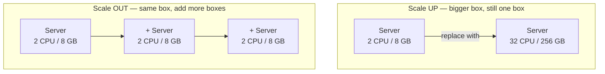
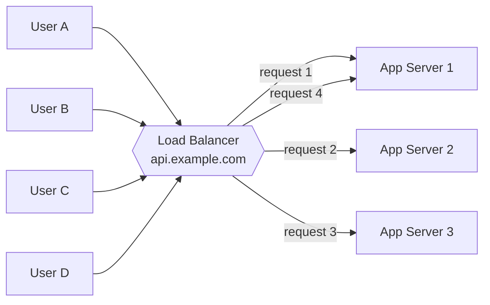
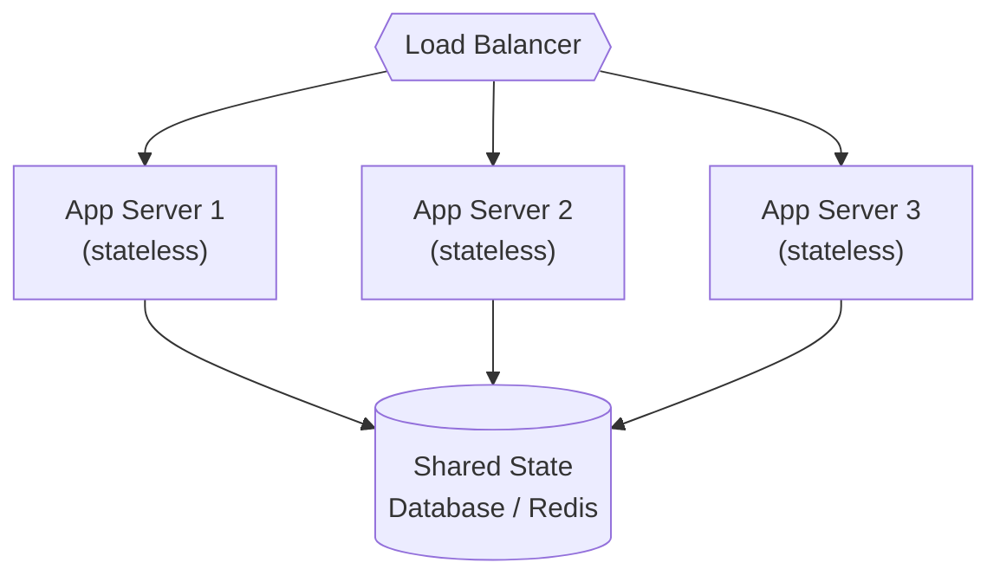
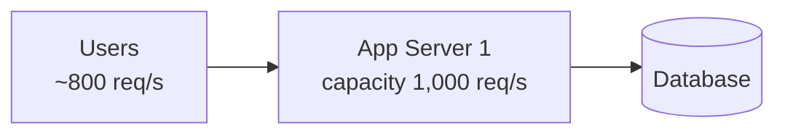
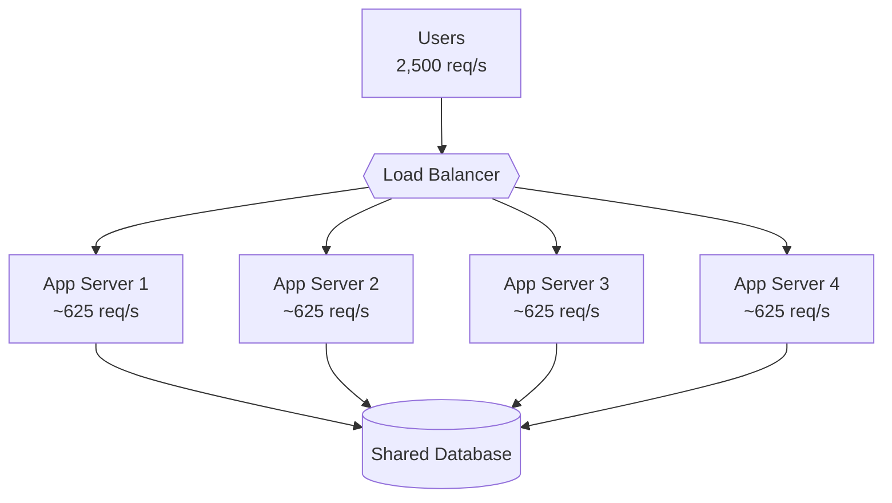

# Horizontal Scaling — Junior

<!-- level-focus -->
At junior level, focus on this question:

> How can I apply **Horizontal Scaling** in one small example and prove the result?

Use the smallest realistic scenario that exposes the decision and its failure behavior.
---

## 1. The Problem: One Machine Has a Ceiling

Every server is a physical (or virtual) computer with a fixed amount of CPU, memory,
disk, and network bandwidth. As traffic grows, you use more of each. Eventually you
run out of *something* — the CPU pins at 100%, the RAM fills up, requests start
queueing behind each other — and latency spikes for everyone.

The intuitive fix is: *make the one machine bigger*. And you can — up to a point.
That point is a hard ceiling, and it exists for three concrete reasons:

- **Hardware has a maximum size.** The biggest cloud instances today top out at a
  few hundred CPU cores and a few terabytes of RAM. You cannot buy an infinitely
  large computer. Once you rent the biggest box available, there is no next step up.
- **Cost grows faster than power.** A machine twice as big usually costs *more* than
  twice as much, not less. The premium instances are priced at a steep markup because
  fewer customers need them.
- **One machine is one failure.** No matter how big it is, if that single server
  reboots, crashes, or its rack loses power, your entire service is down. Bigness
  does not buy you redundancy.

So a single machine gives you a wall you eventually hit, and a single point of failure
you can never remove by making it larger. Horizontal scaling is the way past the wall.

---

## 2. Two Ways to Grow: Up vs Out

There are exactly two directions you can scale, and every real system uses some mix
of them. Learn the names, because interviewers use them constantly.

**Vertical scaling (scale UP):** replace your machine with a more powerful one.
More CPU cores, more RAM, faster disk — same *number* of machines: one. You are
growing the box.

**Horizontal scaling (scale OUT):** keep the machines the same size but add more of
them, and spread the traffic across all of them. You are growing the *count* of boxes.



The critical difference: vertical scaling has a ceiling (Section 1). Horizontal
scaling, in principle, does not — if 3 servers are not enough, add a 4th; if 100 are
not enough, add the 101st. You are limited by your budget and by how cleanly your work
splits across machines, not by what a single computer can physically do.

That "how cleanly your work splits" caveat is the whole game, and we get to it in
Section 4. First we need the piece that makes many servers look like one.

---

## 3. The Load Balancer: One Front Door, Many Rooms

If you have three servers, your users cannot be expected to know about all three and
pick one. From their browser's point of view, your service is a single address like
`api.example.com`. Something has to sit at that address, accept every incoming request,
and hand it to one of the servers behind it. That something is a **load balancer**.

Think of it as the host at a restaurant. Guests arrive at one entrance. The host does
not seat everyone at the first table — they distribute guests across all the open
tables so no single table is overwhelmed and no table sits empty. The load balancer
does exactly this with requests and servers.



Two things the load balancer buys you, both essential:

- **Distribution.** Incoming requests are spread across the servers (round-robin,
  least-connections, and other strategies exist — that is a later topic). No single
  server takes all the load.
- **Health checking.** The load balancer periodically pings each server. If Server 2
  stops responding, the balancer *stops sending it traffic* and routes those requests
  to Servers 1 and 3 instead. Your users never notice. This is the redundancy that a
  single big machine could never give you.

The load balancer is what turns "three separate computers" into "one service that
happens to be backed by three computers."

---

## 4. Why "Stateless" Is the Magic Ingredient

Here is the catch that trips up beginners. Horizontal scaling works *beautifully* — but
only when the servers are **interchangeable**. Any request must be handleable by any
server, and it must not matter which one the load balancer happens to pick.

Servers are interchangeable when they are **stateless**: they keep no important data
of their own between requests. Everything that must be remembered — user sessions,
shopping carts, uploaded files, account balances — lives in a *shared* place that all
servers reach: a database, a cache like Redis, or an object store like S3.

Contrast the two designs with a login example.

**Stateful server (breaks horizontal scaling):**

```text
Request 1 (login):     Load balancer sends it to Server 1.
                       Server 1 stores "Alice is logged in" in its own memory.
Request 2 (view cart): Load balancer sends it to Server 2.
                       Server 2 has never heard of Alice → "Please log in again."
```

Alice bounces between servers and gets logged out constantly, because her session
lived *inside one server's memory* and the others cannot see it. The servers are not
interchangeable.

**Stateless server (scales horizontally):**

```text
Request 1 (login):     Any server validates Alice, writes her session to shared Redis.
Request 2 (view cart): A DIFFERENT server reads Alice's session from the same Redis.
                       It works. The server picked does not matter.
```

Now every server can handle every request, because the state lives *outside* them in
a shared store. This is why the mantra is: **push state out of the app servers.** Once
they hold no state, they are identical, disposable, and you can run 3 or 300 of them —
add one, remove one, replace a crashed one — and nothing breaks.



> Note that the *app servers* scale out easily, but the shared database in this
> picture is now doing the remembering for all of them. Scaling that database is a
> harder problem (replication, sharding) and a whole topic of its own. For now, the
> lesson is: statelessness is what makes the app tier scale horizontally.

---

## 5. Worked Example: Going from 1 to N Servers

Let us make it concrete. You run a small web API on one server. Each server can
comfortably handle **1,000 requests per second** before latency degrades.

**Day 1 — one server, launch traffic.**



800 req/s against a 1,000 req/s server — comfortable, 80% headroom used. No load
balancer needed yet; the domain points straight at the one server.

**Day 30 — traffic grows to 2,500 req/s. One server is now overwhelmed.**

You could scale *up* — rent a machine that does 3,000 req/s. But you would still have
one point of failure, and you would hit the ceiling again at the next growth spurt.
Instead, you scale *out*. First, put a load balancer in front so the domain points at
*it*, not at any single server. Then add servers.

You need to serve 2,500 req/s with servers that each do 1,000. That is `ceil(2,500 /
1,000) = 3` servers to handle the load, and you would run a 4th for safety headroom so
that if one dies you are not instantly over capacity.



Now the 2,500 req/s is spread evenly: about 625 req/s per server, well under each
server's 1,000 limit. If Server 3 crashes, the load balancer's health check removes it
and the remaining three carry roughly 830 req/s each — still under the limit. Users see
nothing.

**Day 365 — a viral moment pushes traffic to 20,000 req/s.**

The pattern does not change; only the number does. `ceil(20,000 / 1,000) = 20` servers
for load, plus headroom → run ~22 identical stateless instances behind the same load
balancer. Because the servers hold no state, adding the 5th through the 22nd is purely
mechanical: launch a copy, register it with the load balancer, done. This is the
superpower of horizontal scaling — **capacity becomes something you add by adding
boxes**, not something you are stuck with.

The formula you keep reusing:

```text
servers needed = ceil(peak_traffic / capacity_per_server)   [+ headroom for failures]
```

---

## 6. Vertical vs Horizontal: The Comparison

| Dimension | Vertical Scaling (scale UP) | Horizontal Scaling (scale OUT) |
|-----------|----------------------------|-------------------------------|
| What you change | Bigger single machine | More identical machines |
| Number of machines | Stays at one | Grows: 1 → N |
| Upper limit | Hard ceiling (biggest box available) | Effectively unlimited (add more) |
| Redundancy / failover | None — one machine, one failure | Built in — one dies, others carry on |
| Load balancer needed? | No | Yes (front door across the fleet) |
| Requires stateless app? | No | Yes — servers must be interchangeable |
| Cost curve | Steep — premium price for top-end hardware | Roughly linear — cheap commodity boxes |
| Complexity to operate | Low — it is just one server | Higher — many servers, LB, shared state |
| Downtime to scale | Usually a reboot / migration | Zero — add a server live |
| Best when | Small scale, simple, quick fix | Growth, high traffic, high availability |

The honest takeaway: vertical scaling is *simpler* and is often the right first move
for a small system — do not build a fleet on day one. But it has a ceiling and no
redundancy. Horizontal scaling costs you some operational complexity (a load balancer,
a shared state store, more moving parts) and demands stateless servers, but in return
it removes the ceiling and gives you failover for free. Large systems are horizontal
because they have no other choice.

---

## 7. Key Terms

| Term | Definition |
|------|-----------|
| Vertical scaling (scale up) | Increasing the capacity of a single machine (more CPU/RAM) |
| Horizontal scaling (scale out) | Adding more machines and distributing load across them |
| Load balancer | A component that receives all requests and spreads them across servers |
| Health check | A periodic probe the load balancer uses to detect and skip dead servers |
| Instance | One running copy of your application (one server in the fleet) |
| Stateless | A server that keeps no per-user data between requests; all state lives externally |
| Shared state store | A database/cache (e.g., Redis, S3) that all servers read and write |
| Interchangeable | Any server can handle any request; the choice of server does not matter |
| Headroom | Spare capacity kept in reserve to absorb spikes and server failures |
| Single point of failure (SPOF) | A component whose failure takes down the whole system |

---

## 8. Common Mistakes at This Level

1. **Storing session or state in the app server's memory.** The number-one killer of
   horizontal scaling. Once a server "remembers" a user, that user must return to the
   *same* server, and your servers are no longer interchangeable. Push state to Redis
   or a database from the start.
2. **Reaching for a bigger machine reflexively.** Vertical scaling is fine for a while,
   but if you *know* you are on a growth path, going stateless early makes the later
   switch to horizontal painless. Retrofitting statelessness under pressure is painful.
3. **Forgetting the load balancer is itself a component.** A single load balancer is a
   new single point of failure. Production setups run the load balancer redundantly too
   (a later topic), but be aware the front door needs its own resilience.
4. **Assuming the database scales the same way as the app tier.** Adding app servers is
   easy *because they are stateless*. The shared database they all hit is stateful and
   scales very differently — it is often the real bottleneck once the app tier is fixed.
5. **Adding servers without headroom.** If four servers are running at exactly 100%,
   one failure instantly overloads the rest. Always size the fleet so it survives losing
   a machine.

---

## 9. Hands-On Exercise

You run a photo-sharing web app on a single server. It handles 500 requests per second
comfortably, and a single server maxes out at 1,000 req/s. Traffic is climbing and you
expect 4,000 req/s next month.

On paper, work through the following:

1. **Count the servers.** Using `servers = ceil(peak / capacity_per_server)`, how many
   servers do you need for 4,000 req/s? How many would you actually run, including
   headroom to survive one server failing?
2. **Draw the topology.** Sketch users → load balancer → the fleet → shared storage.
   Label roughly how many req/s each server receives.
3. **Find the state.** Your app currently stores logged-in user sessions in the server's
   local memory, and saves uploaded photos to the server's local disk. Explain exactly
   what breaks when a user's two requests land on two different servers. For each piece
   of state, name where it should live instead so the servers become interchangeable.
4. **Test a failure.** With your chosen number of servers, one crashes at peak traffic.
   Do the remaining servers stay under their 1,000 req/s limit? If not, how many more
   do you need?

If you can produce those four answers, you understand the core of horizontal scaling:
add boxes behind a load balancer, keep the boxes stateless, and always leave room to
lose one.

---

*Next step:* [Horizontal Scaling — Middle](middle.md)

---

## Apply it

1. Choose one small, known input for **Horizontal Scaling**.
2. Predict the output or observable behavior.
3. Run the smallest example or probe that exercises the concept.
4. Change one input to trigger a failure or boundary case.
5. Explain the evidence using the guide's vocabulary.

## Verify your work

- Record the exact input, command or code path, and output.
- Repeat the probe and confirm the result is consistent.
- Show one expected success and one expected failure.
- Resolve any difference between the prediction and the evidence.

## Review questions

- What problem does Horizontal Scaling solve in the example?
- Which input changes the observed result, and why?
- What is the smallest useful success check?
- Which beginner mistake would your evidence catch?
